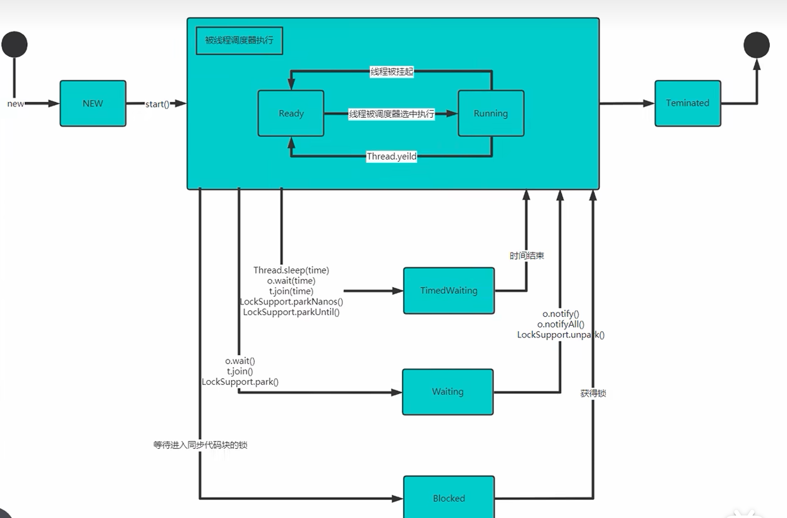

[toc]

# JUC
## 进程与线程
**进程**是程序的一次执行过程，或是运行中的一个程序。进程有其自身产生、存在和消亡的过程。进程是资源分配的基本单位。

**线程**是由进程创建的是进程的一个实体，一个进程可以有多个线程。线程是调度的基本单位。

## 线程创建
在 Java 中有两种方式创建线程：继承 Thread 类和实现 Runnable 接口。

**继承 Thread 类**
继承 Thread 类，直接实现多线程。
```Java
public class Thread01 {
    public static void main(String[] args) {
        new Test("Thread1").start();
        new Test("Thread2").start();
    }
}

// 当一个类继承了 Thread 类，该类就可以当做线程使用
class Test1 extends Thread{
    String name;
    public Test(String name) {
        this.name = name;
    }

    @Override
    public void run() {
        while (true) {
            System.out.println(name + " is running " + Thread.currentThread().getName());
            try {
                Thread.sleep(1000);
            } catch (InterruptedException e) {
                throw new RuntimeException(e);
            }
        }
    }
}
```

**实现 Runnable 接口**
实现 Runnable 接口，Java 是单继承的，在某些情况下一个类可能已经继承了某个父类，这时再用继承 Thread 类来创建线程就不可能了。 
```Java
public class Thread01 {
    public static void main(String[] args) {
        // 创建 Thread 并使用 start 方法启动
        // 底层使用代理模式
        new Thread(new Test2("Thread1")).start();
        new Thread(new Test2("Thread2")).start();
    }
}

// 使用 Runnable 启动线程
class Test2 implements Runnable {
    String name;
    public Test2(String name) {
        this.name = name;
    }

    @Override
    public void run() {
        while (true) {
            System.out.println(name + " is running " + Thread.currentThread().getName());
            try {
                Thread.sleep(1000);
            } catch (InterruptedException e) {
                throw new RuntimeException(e);
            }
        }
    }
}
```

## 线程终止
通过实现线程类的 set 方法控制线程循环变量，达到线程终止的目的。
```java
public class Thread02 {
    public static void main(String[] args) {
        TestStop testStop = new TestStop();
        new Thread(testStop).start();

        System.out.println("主线程休息3秒...");
        try {
            Thread.sleep(3000);
        } catch (InterruptedException e) {
            throw new RuntimeException(e);
        }
        testStop.setLoop(false);
        System.out.println("通知子线程停止...");
    }
}

class TestStop implements Runnable {

    private boolean loop = true;

    @Override
    public void run() {
        while (loop) {
            try {
                Thread.sleep(50);
            } catch (InterruptedException e) {
                throw new RuntimeException(e);
            }
            System.out.println(Thread.currentThread().getName() + "is running...");
        }
    }

    public void setLoop(boolean loop) {
        this.loop = loop;
    }
}
```

## Thread 常用方法
**基本方法**
| 方法名 | 功能 |
|---------|---------|
| setName | 设置线程名称 |
| getName | 返回该线程名称 |
| setPriority | 更改线程优先级（范围为 [1, 10] 1表示优先级最小） |
| getPriority | 返回线程优先级 |
| sleep | 让线程休眠指定时间 |
| interrupt | 中断线程，线程内部可以捕获中断异常 |

> 其中设置 Priority 可以使用 Thread 类预先定义好的三个优先级变量。
  public static final int MIN_PRIORITY = 1;
  public static final int NORM_PRIORITY = 5;
  public static final int MAX_PRIORITY = 10;

```java
public class Thread03 {
    public static void main(String[] args) throws InterruptedException {
        Thread thread = new Thread(new Test());
        thread.setName("Test");
        thread.setPriority(Thread.MAX_PRIORITY);
        thread.start();

        // 三秒后打断线程休息
        Thread.sleep(3 * 1000);
        thread.interrupt();
    }
}

class Test implements Runnable {
    @Override
    public void run() {
        while (true) {
            System.out.println(Thread.currentThread().getName() + " is running Priority =" + Thread.currentThread().getPriority());
            try {
                // 休息 10 秒
                Thread.sleep(10 * 1000);
            } catch (InterruptedException e) {
                System.out.println(Thread.currentThread().getName() + " is interrupted");
            }
        }
    }
}
```
**yield 和 join**
yield：线程礼让， A 线程主动让出 CPU 。让出 CPU 给其它线程执行，但是礼让的时间不确定，所以也不一定礼让成功。

join：线程插队， A 线程未占据 CPU 通过插队抢占 CPU。线程一旦插队成功，则肯定先执行完插入线程的所有任务。
```java
public class Thread03 {
    public static void main(String[] args) throws InterruptedException {
        Thread world = new Thread(new World());
        world.start();
        for(int i = 0; i < 10; i++) {
            System.out.println("Hello");
            Thread.sleep(1000);
            if(i == 4) {
                // join 此时直到World线程执行完，主线程才会接着执行
                world.join();
            }
        }
    }
}

class World implements Runnable {
    @Override
    public void run() {

        for (int i = 0; i < 10; i++) {
            System.out.println("World!");
            try {
                Thread.sleep(1000);
            } catch (InterruptedException e) {
                throw new RuntimeException(e);
            }
        }
    }
}
```

## 守护线程
**用户线程**：也叫工作线程，当线程的任务执行完或收到通知结束执行。
**守护线程**：一般是为工作线程服务的，当所有的用户线程结束，守护线程自动结束。常见的守护线程，垃圾回收机制。
```java
public class MThread {
    public static void main(String[] args) throws InterruptedException {
        Thread boiler = new Thread(new Boiler());
        // 设置热水器为守护线程，边洗澡边热水
        boiler.setDaemon(true);
        boiler.start();

        for(int i = 0; i < 10; i++) {
            System.out.println("你正在洗澡...");
            Thread.sleep(500);
        }
        System.out.println("洗完了，停止加热。守护线程退出");
    }
}

class Boiler implements Runnable {
    @Override
    public void run() {
        while(true) {
            System.out.println("热水器在烧水...");
            try {
                Thread.sleep(1000);
            } catch (InterruptedException e) {
                throw new RuntimeException(e);
            }
        }
    }
}
```
## 线程生命周期


## 线程同步
在多线程编程中，一些敏感数据不允许被多个线程同时访问，此时就使用同步访问技术，确保在任何同一时刻，最多只有一个线程访问，以保证数据的完整性。

以多线程售票为例，在售票前先判断余票数量大于零才可以售票，但如果同一时刻有多个线程进入判断，则可能导致余票为负。这就是多线程并发访问共享资源时的数据不一致问题。

### synchronized
Java 中的 synchronized 是一种用于多线程同步的关键字，能够确保同一时刻只有一个线程访问被修饰的代码块或方法，以避免线程间的数据竞争。

其原理是，Java中每个对象都有一个监视器（monitor），synchronized通过获取监视器锁来实现同步。当一个线程进入synchronized代码块或方法时，自动获得监视器锁；执行结束后自动释放。其他线程尝试进入时，若监视器被占用，则等待锁释放。

**方法同步**
当一个线程进入被标记为synchronized的方法时，自动锁定当前对象实例（或类对象）。对实例方法使用synchronized时，锁住的是调用方法的对象实例；对静态方法使用时，锁住的是该类的Class对象。

```java
// 实例方法
public synchronized void increment() {
    count++;
}

// 类方法
public static synchronized void increment() {
    staticCount++;
}
```

**代码块同步**
明确指定要锁定的对象，粒度更灵活。虽然可以锁任意对象，建议用明确的对象进行锁定，不推荐锁定字符串或包装类型对象，避免意外共享锁。
锁对象应尽量使用 private final 修饰，防止被意外修改或外部访问。

```java
public class Counter {
    private int count = 0;
    private final Object lock = new Object();

    public void increment() {
        synchronized (lock) {
            count++;
        }
    }

    public int getCount() {
        synchronized (lock) {
            return count;
        }
    }
}
```