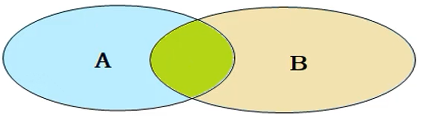

[toc]

# MYSQL
## 基本概念
**学习重点**


**MYSQL 数据模型**
关系型数据库(RDBMS)概念：建立在关系模型基础上，由多张相互连接的二维表组成的数据库。特点：使用表存储数据，格式统一，便于维护；使用SQL语言操作，标准统一，使用方便。

## SQL 语法分类
|分类|全称|说明|
|---|---|---|
| DDL | Data Definition Language | 数据定义语言，用来定义数据库对象(数据库，表，字段) |
| DML | Data Manipulation Language | 数据操作语言，用来对数据库表中的数据进行增删改 |
| DQL | Data Query Language | 数据查询语言，用来查询数据库中表的记录 |
| DCL | Data Control Language | 数据控制语言，用来创建数据库用户、控制数据库的访问权限 |

### DDL
#### 操作数据库
**查询**
查询所有数据库
```sql
SHOW DATABASES;
```

查询当前数据库
```sql
SELECT DATABASE();
```
**创建**
```sql
CREATE DATABASE [IF NOTEXISTS] 数据库名 [DEFAULT CHARSET字符集] [COLLATE 排序规则];
```
**删除**
```sql
DROP DATABASE[IF EXISTS] 数据库名;
```

**使用**
```sql
USE 数据库名;
```
#### 操作表
**查询**
查询当前数据库所有表
```sql
SHOW TABLES;
```
查询表结构
```sql
DESC 表名;
```
查询指定表的建表语句
```sql
SHOW CREATE TABLE 表名;
```
**创建表**
创建表
```sql
CREATE TABLE 表名(
    字段1 字段1类型 [COMMENT 字段 1 注释],
    字段2 字段2类型 [COMMENT 字段 2 注释],
    字段3 字段3类型 [COMMENT 字段 3 注释],
    ......
    字段n 字段n类型 [COMMENT 字段 n 注释]
)[COMMENT 表注释];
```
**修改表**
添加字段
```sql
ALTER TABLE 表名 ADD 字段名 类型(长度) [COMMENT 注释] [约束];
```
修改数据类型
```sql
ALTER TABLE 表名 MODIFY 字段名 新数据类型(长度);
```
修改字段名和字段类型
```sql
ALTER TABLE 表名 CHANGE 旧字段名 新字段名 类型(长度) [COMMENT 注释] [约束];
```
删除字段
```sql
ALTER TABLE 表名 DROP 字段名;
```
修改表名
```sql
ALTER TABLE 表名 RENAME TO 新表名;
```
**删除表**
删除表
```sql
DROP TABLE [IF EXISTS] 表名;
```
删除指定表，并重新创建该表
```sql
TRUNCATE TABLE 表名;
```
### DML
DML 英文全称是 Data Manipulation Language（数据操作语言），用来对数据库中表的数据记录进行增删改操作。
#### 添加数据（INSERT）
1. 给指定字段添加数据
```sql
INSERT INTO 表名 (字段名1, 字段名2, ...) VALUES (值1, 值2, ...);
```
2. 给全部字段添加数据
```sql
INSERT INTO 表名 VALUES (值1, 值2, ...);
```
3. 批量添加数据
```sql
INSERT INTO 表名 (字段名1, 字段名2, ...) VALUES (值1, 值2, ...), (值1, 值2, ...),(值1, 值2, ...);
INSERT INTO 表名 VALUES (值1, 值2, ...), (值1, 值2, ...), (值1, 值2, ...);
```
#### 修改数据（UPDATE）
修改数据
```sql
UPDATE 表名 SET 字段名1=值1, 字段名2=值2, ... [WHERE 条件];
```
#### 删除数据（DEETE）
删除数据
```sql
DELETE FROM 表名 [WHERE 条件];
```
### DQL
DQL 英文全称是 Data Query Language（数据查询语言），数据查询语言，用来查询数据库中表的记录。
**DQL 语法：**
```sql
SELECT
字段列表
FROM
表名列表
WHERE
条件列表
GROUP BY
分组字段列表
HAVING
分组后条件列表
ORDER BY
排序字段列表
LIMIT
分页参数
```
**DQL 执行顺序**


#### 基本查询
1. 查询多个字段
```sql
SELECT 字段1, 字段2, 字段3, ... FROM 表名;
SELECT * FROM 表名;
```
2. 设置别名
```sql
SELECT 字段1[AS 别名1], 字段2[AS 别名2], ... FROM 表名;
```
3. 去除重复记录
```sql
SELECT DISTINCT 字段列表 FROM 表名;
```
#### 条件查询(WHERE)
语法
```sql
SELECT 字段列表 FROM 表名 WHERE 条件列表
```
运算符：
| 比较运算符 | 功能 |
| - | - |
| BETWEEN ... AND ... | 在某个范围之内（包含边界）|
| IN(...) | 在 in 之后的列表中的值 |
| LIKE 占位符 | 模糊匹配（ _ 匹配单个字符，% 匹配任意个字符）|
| IS NULL | 是 NULL |
#### 聚合函数(count、max、min、avg、sum)
聚合函数将一列数据作为一个整体，进行纵向计算。
> 注意：所有的 null 值不参与聚合运算。

#### 分组查询(GROUP BY)
语法
```sql
SELECT 字段列表 FROM 表名[WHERE 条件] GROUP BY 分组字段名 [HAVING 分组后过滤条件];
```
> 注意：
执行顺序: where > 聚合函数 > having；
分组之后，查询的字段一般为聚合函数和分组字段，查询其他字段无任何意义。

#### 排序查询(ORDER BY)
1. 语法
```sql
SELECT 字段列表 FROM 表名 ORDER BY 字段1 排序方式1, 字段2 排序方式2;
```
2. 排序方式
- ASC：升序（默认值）
- DESC：降序

#### 分页查询(LIMIT)
语法
```sql
SELECT 字段列表 FROM 表名 LIMIT 起始索引, 查询记录数
```
> 注意： 
起始索引从0开始，起始索引 = (查询页码 - 1) * 每页显示记录数；
分页查询是数据库的方言，不同的数据库有不同的实现，MySQL 中是 LIMIT ；
如果查询的是第一页数据，起始索引可以省略，直接简写为 limit 10。

### DCL
DCL 英文全称是 Data ControlLanquage（数据控制语言），用来管理数据库用户、控制数据库的访问权限。

#### 管理用户
1. 查询用户
```sql
USE mysql;
SELECT * FROM user;
```
2. 创建用户
```sql
CREATE USER '用户名'@'主机名' IDENTIFIED BY '密码';
```
3. 修改用户密码
```sql
ALTER USER '用户名'@'主机名' IDENTIFIED WITH mysql_native_password BY '新密码';
```
4. 删除用户
```sql
DROP USER '用户名'@'主机名';
```
> 注意：主机名可以用通配符 '%' 表示任意主机。

#### 权限控制
MySQL中定义了很多种权限，但是常用的就以下几种：
| 权限 | 说明 |
| ---  | --- |
| ALL, ALL PRIVILEGES | 所有权限 |
| SELECT              | 查询数据 |   
| INSERT              | 插入数据 |
| UPDATE              | 修改数据 |
| DELETE              | 删除数据 |
| ALTER               | 修改表   | 
| DROP                | 删除数据库/表/视图 |
| CREATE              | 创建数据库/表 |

1. 查询权限
```sql
SHOW GRANTS FOR '用户名'@'主机名;
```
2. 授予权限
```sql
GRANT 权限列表 ON 数据库名.表名 TO '用户名'@'主机名';
```
3. 撤销权限
```sql
REVOKE 权限列表 ON 数据库名.表名 FROM '用户名'@'主机名';
```
> 注意：
多个权限之间使用逗号分隔；
授予所有数据库所有数据表使用 '* . *' 。

## 函数
函数是指一段可以直接被另一段程序调用的程序或代码。
### 字符串函数
| 函数 | 功能 |
| ---  | ---  |
| CONCAT(S1, S2, ...Sn)   | 字符串拼接，将 S1, S2, ... Sn 拼接成一个字符串  |
| LOWER(str)    | 将字符串 str 全部转为小写  |
| UPPER(Str)   | 将字符串 str 全部转为大写  |
| LPAD(str, n, pad)  | 左填充，用字符串 pad 对 str 的左边进行填充，达到n个字符串长度  |
| RPAD(str, n, pad) | 右填充，用字符串 pad 对 str 的右边进行填充，达到 n 个字符串长度  |
| TRIM(str) | 去掉字符串头部和尾部的空格  |
| SUBSTRING(str, start, len) | 返回从字符串 str 从 start（索引从 1 开始）位置起的 len 个长度的字符串  |

### 数值函数
| 函数 | 功能 |
| --- | --- |
| CEIL(x) |  向上取整 |
| FLOOR(x) |  向下取整 |
| MOD(x,y) |  返回 x / y 的模 |
| RAND() |  返回 0 ~ 1 内的随机数 |
| ROUND(x,y) |  求参数 x 的四舍五入的值，保留 y 位小数 |

### 日期函数
| 函数 | 功能 |
| --- | --- |
| CURDATE()    |  返回当前日期，如：2025-05-20 |
| CURTIME()  |  返回当前时间，如 13:14:00 |
| NOW()  |  返回当前日期和时间  |
| YEAR(date)  |  获取指定 date 的年份  |
| MONTH(date)  |  获取指定 date 的月份  |
| DAY(date)  |  获取指定 date 的日期  |
| DATE_ADD(date, INTERVAL expr type)  |  返回一个日期/时间值加上一个时间间隔 expr 后的时间值  |
| DATEDIFF(date1, date2)  |  返回起始时间 date1 和结束时间 date2 之间的天数  |

### 流程函数
| 函数 | 功能 |
| --- | --- |
| lF(value, t, f) | 如果 value 为 true，则返回 t，否则返回 f |
| IFNULL(value1, value2) | 如果 value1 不为空，返回 value1，否则返回 value2 |
| CASE WHEN [val1 ] THEN [res1] ... ELSE [default] END | 如果val1为true，返回 res1，... 否则返回 default 默认值 |
| CASE [expr] WHEN [val1] THEN [res1] ... ELSE [default] END | 如果 expr 的值等于 val1，返回 res1，... 否则返回 default 默认值 |

## 约束
### 基本概念
概念：约束是作用于表中字段上的规则，用于限制存储在表中的数据。
目的：保证数据库中数据的正确、有效性和完整性。
| 约束 | 描述 | 关键字 |
| --- | --- | --- |
| 非空约束  | 限制该字段的数据不能为null | NOT NULL |
| 唯一约束  | 保证该字段的所有数据都是唯一、不重复的 | UNIQUE |
| 主键约束  | 主键是一行数据的唯一标识，要求非空且唯一 | PRIMARY KEY |
| 默认约束  | 保存数据时，如果未指定该字段的值，则采用默认值 | DEFAULT |
| 检查约束  | 保证字段值满足某一个条件 | CHECK |
| 外键约束  | 用来让两张表的数据之间建立连接，保证数据的一致性和完整性 | FOREIGN KEY |

### 外键约束
外键用来让两张表的数据之间建立连接，从而保证数据的一致性和完整性。

**添加外键**
```sql
CREATE TABLE 表名(
    字段名 数据类型,
    ...
    [CONSTRAINT] [外键名称] FOREIGN KEY(外键字段名) REFERENCES 主表(主表列名)
);
```
```sql
ALTER TABLEL 表名 ADD CONSTRAINT 外键名称 FOREIGN KEY(外键字段名) REFERENCES 主表(主表列名);
```
**删除外键**
```sql
DROP FOREIGN KEY 外键名称;
```
删除外键行为：
| 行为 | 说明 |
| --- | --- |
| NO ACTION  | 当在父表中删除 / 更新对应记录时，首先检查该记录是否有对应外键，如果有则不允许删除/更新。(与 RESTRICT 一致) |
| RESTRICT   | 当在父表中删除 / 更新对应记录时，首先检查该记录是否有对应外键，如果有则不允许删除/更新。(与 NO ACTION 一致) |
| CASCADE    |  当在父表中删除 / 更新对应记录时，首先检查该记录是否有对应外键，如果有，则也删除/更新外键在子表中的记录。 |
| SET NULL    | 当在父表中删除对应记录时，首先检查该记录是否有对应外键，如果有则设置子表中该外键值为null(这就要求该外键允许取nul)。 |
| SET DEFAULT  | 父表有变更时，子表将外键列设置成一个默认的值（ Innodb 不支持）。 |
设置外键并设置外键行为：
```sql
ALTER TABE 表名 ADD CONSTRAINT 外键名称 FOREGNKEY(外键字段) REFERENCES 主表名(主表字段名) ON UPDATE CASCADE ON DELETE CASCADE;
```
## 多表查询
### 多表关系
**一对多（多对一）**
案例: 部门与员工的关系。
关系:一个部门对应多个员工，一个员工对应一个部门。
实现: 在多的一方建立外键，指向一的一方的主键。


**多对多**
案例: 学生 与 课程的关系。
关系:一个学生可以选修多门课程，一门课程也可以供多个学生选择。
实现:建立第三张中间表，中间表至少包含两个外键，分别关联两方主键。


**一对一**
案例: 用户与用户详情的关系。
关系: 一对一关系，多用于单表拆分，将一张表的基础字段放在一张表中，其他详情字段放在另一张表中，以提升操作效率。
实现: 在任意一方加入外键，关联另外一方的主键，并且设置外键为唯一的（UNIQUE）。


### 连接查询


#### 内连接
相当于查询 A、B 交集部分数据。

隐式内连接
```sql
SELECT 字段列表 FROM 表1, 表2 WHERE 条件 ...;
```
显式内连接
```sql
SELECT 字段列表 FROM 表1 [INNER]JOIN 表2 ON 连接条件 ...;
```

#### 外连接
左外连接：查询左表所有数据，以及两张表交集部分数据。
```sql
SELECT 字段列表 FROM 表1 LEFT [OUTER]JOIN 表2 ON 条件 ...;
```
右外连接：查询右表所有数据，以及两张表交集部分数据
```sql
SELECT 字段列表 FROM 表1 RIGHT [OUTER]JOIN 表2 ON 条件 ...;
```
> 注意：一般只使用左外连接，将两个表交换顺序即可。
#### 自连接
当前表与自身的连接查询，自连接必须使用表别名。自连接查询，可以是内连接查询，也可以是外连接查询。
```sql
SELECT 字段列表 FROM 表A 别名A JOIN 表A 别名B ON 条件 ...;
```
> 应用场合：全体员工表中，找出每个员工的直接领导。
### 联合查询
对于 union 查询，就是把多次查询的结果合并起来，形成一个新的查询结果集。
```sql
SELECT 字段列表 FROM 表A ...
UNION [ALL] -- 去掉 ALL 可以实现查询结果去重
SELECT 字段列表 FROM 表B ...;
```
> 注意：联合查询多张表字段列数和字段类型必须保持一致。
### 子查询
1. 子查询概念
SQL 语句中嵌套 SELECT 语句，称为嵌套查询，又称子查询。
```sql
SELECT * FROM t1 WHERE column1=(SELECT column1 FROM t2 );
```
子查询外部的语句可以是 INSERT/UPDATE/DELETE/SELECT 的任何一个。

2. 子查询分类
根据子查询结果不同，分为:
- 标量子查询(子查询结果为单个值)；
- 列子查询(子查询结果为一列)；
- 行子查询(子查询结果为一行)；
- 表子查询(子查询结果为多行多列)。

根据子查询位置，分为：WHERE 之后、FROM 之后、SELECT 之后。

#### 列子查询
子查询返回的结果是一列(可以是多行)，这种子查询称为列子查询常用的操作符：IN、NOT IN、ANY、SOME、ALL。

| 操作符 | 描述 |
| --- | --- |
| IN   | 在定的集合范围之内，多选一 |
| NOT IN | 不在指定的集合范围之内 |
| ANY | 子查询返回列表中，有任意一个满足即可 |
| SOME | 与 ANY 等同，使用 SOME 的地方都可以使用 ANY |
| ALL | 子查询返回列表的所有值都必须满足 |

示例：
```sql
-- 比财务部所有人工资都高的员工信息
select * from emp where
    salary > all ( select salary from emp where dept id = 
                    (select id from dept where name = '财务部')
                );
```

#### 行子查询
子查询返回的结果是一行（可以是多列），这种子查询称为行子查询常用的操作符：=、<>、IN、NOT IN。
行子查询经常使用元组对应位置相同这个操作。
示例：
```sql
-- 查询与 '张三' 的薪资及直属领导相同的员工信息;
select * from emp where 
    (salary,managerid) = (select salary, managerid from emp where name ='张三');
```

#### 表子查询
子查询返回的结果是多行多列，这种子查询称为表子查询。
常用的操作符：IN。
使用方式：1. 元组 in 结果集；2. 子查询结果作为一张表，多表查询。

## 事务
### 事务简介
事务是一组操作的集合，它是一个不可分割的工作单位，事务会把所有的操作作为一个整体一起向系统提交或撤销操作请求，即这些操作要么同时成功，要么同时失败。


### 事务操作
#### 方式一
查看/设置事务提交方式
```sql
SELECT @@autocommit; -- 查询事务提交方式：1 为自动提交；0 为手动提交
SET @@autocommit = 0; -- 设置当前会话的事务提交方式为：手动提交
```
提交事务
```sql
COMMIT;
```
回滚事务
```sql
ROLLBACK;
```
#### 方式二
开启事务
```sql
START TRANSACTION -- 或 BEGIN
```
提交事务
```sql
COMMIT;
```
回滚事务
```sql
ROLLBACK;
```
### 事务的四大特性(ACID)
- 原子性（**A**tomicity）：事务是不可分割的最小操作单元，要么全部成功，要么全部失败。
- 一致性（**C**onsistency）：事务完成时，必须使所有的数据都保持一致状态。
- 隔离性（**I**solation）：数据库系统提供的隔离机制，保证事务在不受外部并发操作影响的独立环境下运行。
- 持久性（**D**urability）：事务一旦提交或回滚，它对数据库中的数据的改变就是永久的。
### 并发事务
#### 并发事务问题
| 问题类型 | 关键区别 | 数据变化方式 |
|---------|---------|-------------|
| 脏读     | 读取了未提交的数据 | 其他事务修改后未提交 |
| 不可重复读 | 同一数据多次读取结果不同 | 其他事务修改并提交了数据。为了避免受其他事务修改影响，可能会有备份。 |
| 幻读     | 查询结果集的行数变化 | 其他事务插入/删除并提交了符合查询条件的行。为了避免受其他事务修改影响，一般会进行阻塞。 |

#### 事务隔离级别
| 隔离级别 | 脏读 | 不可重复读 | 幻读 |
| --- | --- | --- | --- |
| Read uncommitted  | T | T | T |
| Read committed    | F | T | T |
| Repeatable Read（mysql 默认）  |  F | F | T |
| Serializable  | F | F | F |

操作隔离级别：
```sql
-- 查看事务隔离级别
SELECT @@TRANSACTION ISOLATION;
-- 设置事务隔离级别
SET [SESSIONI | GLOBAL] TRANSACTION ISOLATION LEVEL { READ UNCOMIMITTED | READ COMMITED | REPEATABLE READ | SERIALZABLE }
```
> 注意：事务隔离级别越高，数据越安全，但是性能越低.