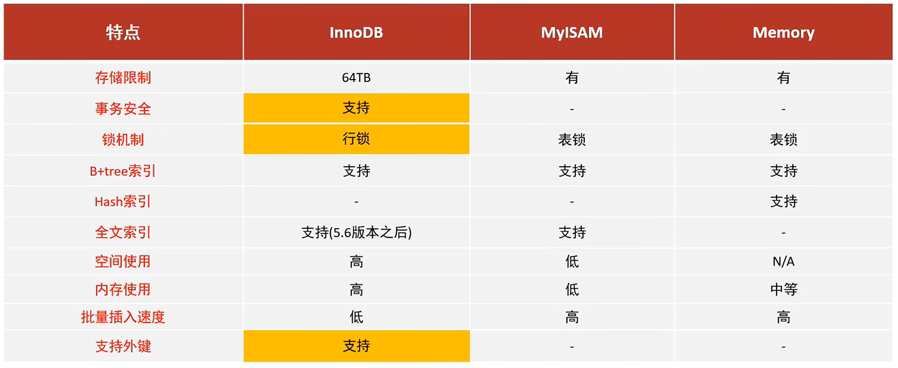
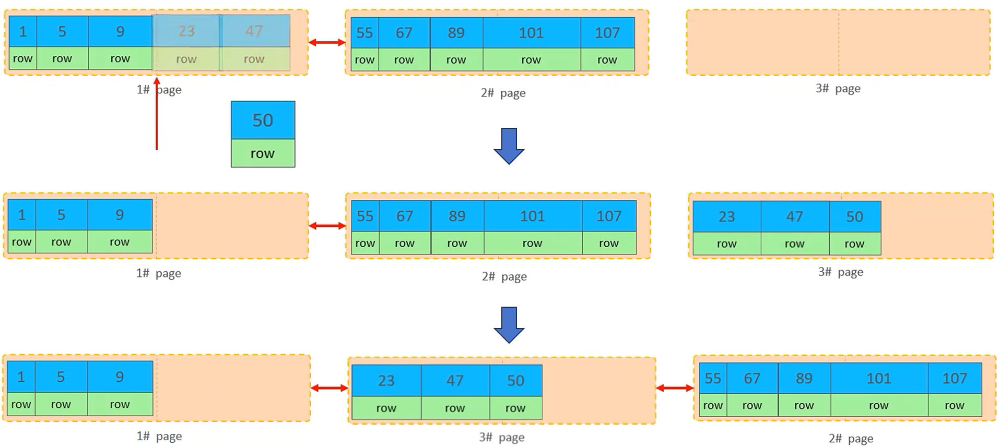
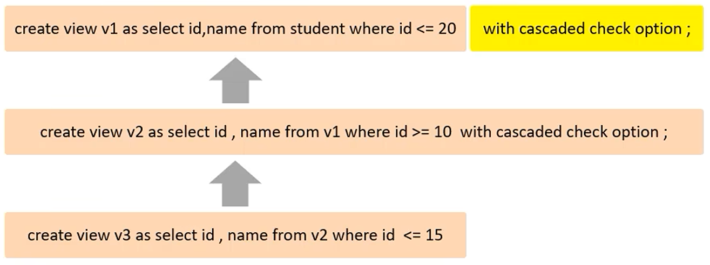
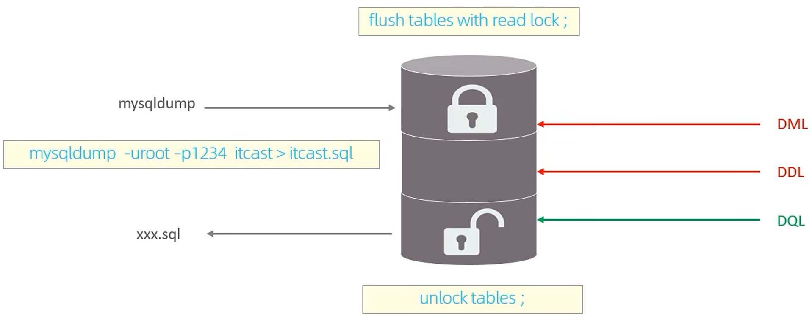
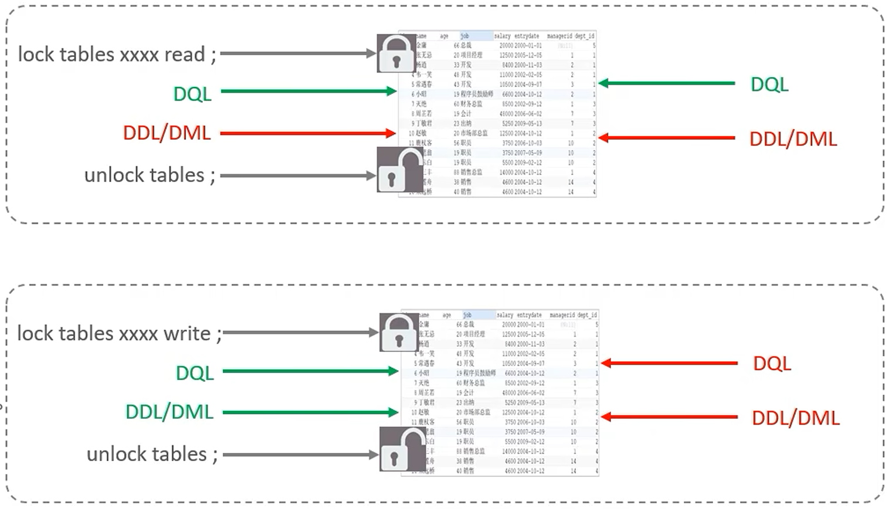
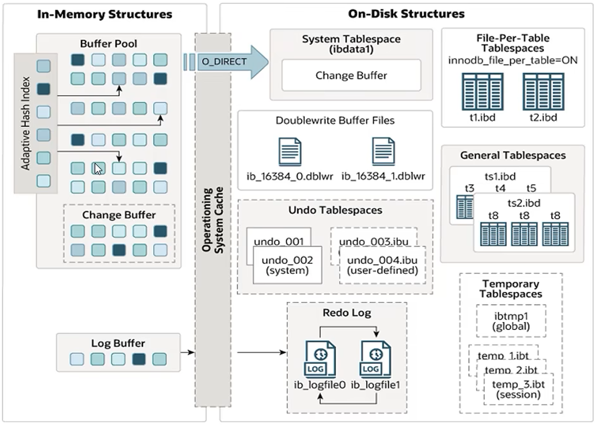
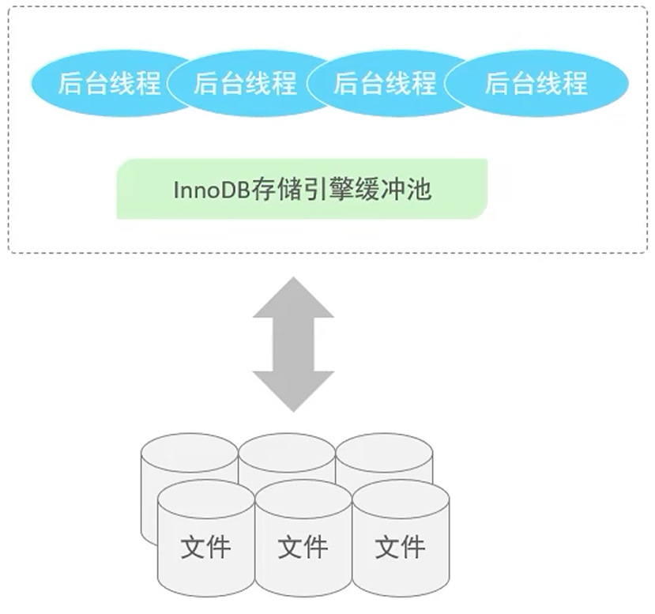
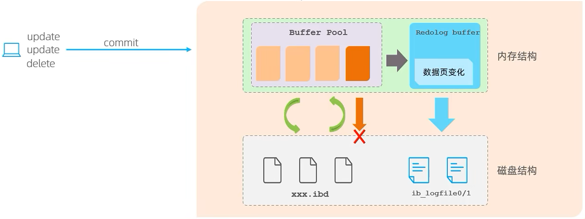
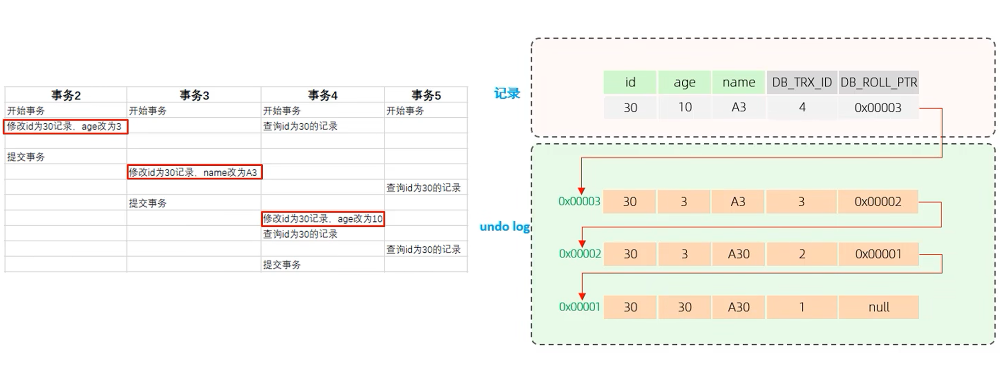

[toc]
# MYSQL 进阶

## 存储引擎
### MySQL 体系结构
**体系结构图**


**连接层**
最上层是一些**客户端和链接服务**，主要完成一些类似于连接处理、授权认证、及相关的安全方案。服务器也会为安全接入的每个客户端验证它所具有的操作权限。

**服务层**
第二层架构主要完成**大多数的核心服务功能**，如 SQL 接口，并完成缓存的查询，SQL 的分析和优化，部分内置函数的执行。所有跨存储引擎的功能也在这一层实现，如过程、函数等。

**引擎层**
存储引擎真正的负责了 MySQL 中**数据的存储和提取**，服务器通过 API 和存储引擎进行通信。不同的存储引擎具有不同的功能，这样我们可以根据自己的需要，来选取合适的存储引擎。

**存储层**
主要是将数据存储在文件系统之上，并完成与存储引擎的交互。

### 存储引擎简介
存储引擎就是**存储数据**、**建立索引**、**更新/查询数据**等技术的实现方式。存储引擎是基于**表**的，而不是基于库的，所以存储引擎也可被称为**表类型**。

> 注意：同一数据库的不同表可以有不同的存储引擎。

1. 在创建表时，指定存储引擎
```sql
CREATE TABLE 表名(
    字段1 字段1类型 [COMMENT 字段1注释],
    ... ,
    字段n 字段n类型 [COMMENT 字段n注释]
) ENGINE = INNODB [COMMENT 表注释];
```
2. 查看当前数据库支持的存储引擎
```sql
SHOW ENGINES;
```

### 存储引擎特点
不同存储引擎的异同：


#### InnoDB 介绍
**介绍**
InnoDB 是一种兼顾高可靠性和高性能的通用存储引擎，在 MySQL 5.5 之后，InnoDB 是默认的 MySQL 存储引擎。

**特点**
DML 操作遵循 ACID 模型，支持**事务**;
支持**外键** FOREIGN KEY 约束，保证数据的完整性和正确性；
**行级锁**，提高并发访问性能。

**文件**
xxx.ibd：xxx代表的是表名，innoDB引擎的每张表都会对应这样一个表空间文件，存储该表的表结构（frm、sdi）数据和索引。

> 注意：
    参数：innodb_file_per_table 打开表示每张表都有单独的 ibd 文件。
    .ibd 文件属于表空间文件。

**Innodb 逻辑存储结构**


#### MyISAM 介绍
**介绍**
MyISAM 是 MySQL 早期的默认存储引擎。

**特点**
不支持事务，不支持外键。
支持表锁，不支持行锁。
访问速度快。

**文件**
xxx.sdi：存储表结构信息。
xxx.MYD：存储数据。
xxx.MYI：存储索引。

#### Memory 介绍
**介绍**
Memory 引擎的表数据时存储在内存中的，由于受到硬件问题、或断电问题的影响，只能将这些表作为临时表或缓存使用。

**特点**
内存存放
hash索引（默认）

**文件**
xxx.sdi:存储表结构信息

## 索引

### 索引概述
**介绍**
索引（index）是帮助 MySQL **高效获取数据**的**数据结构**（有序）。在数据之外，数据库系统还维护着满足特定查找算法的数据结构，这些数据结构以某种方式引用（指向）数据，这样就可以在这些数据结构上实现高级查找算法，这种数据结构就是索引。

**优缺点**
| 优点 | 缺点 |
| --- | --- |
| 提高数据检索的效率，降低数据库的 IO 成本。 | 索引列也是要占用空间的。 |
| 通过索引列对数据进行排序，降低数据排序的成本，降低 CPU 的消耗。 | 索引大大提高了查询效率，同时却也降低更新表的速度，如对表进行 INSERT、UPDATE、DELETE 时，效率降低。 |

### 索引结构
#### 不同索引结构
MySQL 的索引是在存储引擎层实现的，不同的存储引警有不同的结构，主要包含以下几种:
| 索引结构 | 描述 |
| --- | --- |
| B+ Tree 索引 | 最常见的索引类型，大部分引擎都支持 B+ 树索引 |
| Hash 索引 |  底层数据结构是用哈希表实现的，只有精确匹配索引列的查询才有效, 不支持范围查询 |
| R-tree (空间索引)  | 空间索引是 MyISAM 引擎的一个特殊索引类型，主要用于地理空间数据类型，通常使用较少 |
| Full-text (全文索引)  | 是一种通过建立倒排索引，快速匹配文档的方式。类似于 Lucene, Solr, ES |


#### B Tree 和 B+ Tree
**B Tree**
B Tree 多路平衡查找树，一颗最大度数（max-degree）为 5（5阶，指针数等于度数）的 B-tree 为例（每个节点最多存储4个 key，5个指针）:


> 具体动态变化的过程可以参考网站: https://www.cs.usfca.edu/~galles/visualization/BTree.html

**B+ Tree**
B+ Tree 是 B Tree 的变种，以一颗最大度数（max-degree）为4（4阶）的 B+ tree 为例:


B+ Tree 的特点：1. 非叶子节点有的索引值，叶子节点也有；2. 只有叶子节点储存真正的数据； 3. 叶子节点还连接起来，形成了一个单链表。

MySQL 索引数据结构对经典的 B+ Tree 进行了优化。在原 B+ Tree 的基础上，增加一个指向相邻叶子节点的链表指针，就形成了**双向循环链表**叶子节点的 B+ Tree，提高区间访问的性能。


> 注意：虽然 MySQL 的 Innodb 引擎没有 Hash 索引结构，但是 MySQL 的 Innodb 引擎在生成索引的时候会使用自适应 Hash 算法。

> 为什么InnoDB存储引擎选择使用B+tree索引结构?
相对于二叉树，层级更少，搜索效率高；
相对于 B Tree，无论是叶子节点还是非叶子节点，都会保存数据，这样导致一页中存储的键值减少，指针跟着减少，要同样保存大量数据，只能增加树的高度，导致性能降低;
相对Hash索引，B+ Tree 支持范围匹配及排序操作。

### 索引分类
索引分类


在InnoDB存储引擎中，根据索引的存储形式，又可以分为以下两种:

聚集索引选取规则:
如果存在主键，主键索引就是聚集索引。
如果不存在主键，将使用第一个唯一（UNIQUE）索引作为聚集索引。
如果表没有主键，或没有合适的唯一索引，则 InnoDB 会自动生成一个 rowid 作为隐藏的聚集索引。


二级索引和聚集索引配合查询，称为回表查询，即先根据二级索引拿到主键值，再根据主键值走聚集索引拿到这一行的数据。
### 索引语法

1. 创建索引
```sql
CREATE [UNIQUE | FULLTEXT] INDEX index_name ON table_name(index_col_name, ...);
```
> 单列索引：索引只关联一个字段。
  联合索引（组合索引）：索引关联多个字段。

2. 查看索引
```sql
SHOW INDEX FROM table_name ;
```

3. 删除索引
```sql
DROP INDEX index_name ON table_name ;
```
### SQL 性能分析
#### SQL 执行频率
MySQL客户端连接成功后，通过 `show [session | global] status` 命令可以提供服务器状态信息。通过如下指令，可以查看当前数据库的INSERT、UPDATE、DELETE、SELECT的访问频次。
```sql
SHOW GLOBAL STATUS LIKE 'Com_______';
```
#### 慢查询日志
慢查询日志记录了所有执行时间超过指定参数（long_query_time，单位：秒，默认10秒）的所有 SQL 语句的日志。
```sql
show variables like 'slow_query_log';
```
MySQL 的慢查询日志默认没有开启，需要在 MySQL 的配置文件（/etc/my.cnf）中配置如下信息:
```sh
# 开启 MySQL 慢日志查询开关
slow_query log=1
# 设置慢日志的时间为 2 秒，SQL 语句执行时间超过 2 秒就会视为慢查询，记录慢查询日志
long query time=2
```
配置完毕之后，重新启动 MySQL 服务器进行测试，查看慢日志文件中记录的信息 /var/lib/mysql/localhost-slow.log 。

#### profile 详情
show profiles 能够在做 SQL 优化时帮助我们了解时间都耗费到哪里去了。通过 have_profiling 参数，能够看到当前 MySQL 是否支持 profile 操作:
```sql
-- 查看系统是否支持 profile 详情
SELECT @@have profiling;
-- 若支持，查看是否开启
SELECT  @@profiling;
```
默认 profiling 是关闭的，可以通过 set 语句在 session/global 级别开启 profiling：
```sql
SET profiling=1,
```

执行一系列的业务 SQL 的操作，然后通过如下指令查看指令的执行耗时：
```sql
-- 查看每一条 SQL 的耗时基本情况
show profiles;
-- 查看指定 query id 的 SQL 语句各个阶段的耗时情况
show profile for query query_id;
-- 查看指定 query id 的 SQL 语句 CPU 的使用情况
show profile cpu for query query_id;
```

#### explain 执行计划
EXPLAIN 或者 DESC 命令获取 MySQL 如何执行 SELECT 语句的信息，
包括在 SELECT 语句执行过程中表如何连接和连接的顺序。语法:
```sql
-- 直接在select语句之前加上关键字 explain/desc
EXPLAIN SELECT 字段列表 FROM 表名 WHERE 条件;
```

查询结果集中包含：id、select_type、type、possible_key 等。
其中：
- id：id 值越大执行优先级越高，id 值相同执行顺序自上而下依次执行。
- select_type：表示 SELECT 的类型，常见的取值有 SIMPLE（简单表，即不使用表连接或者子查询）、PRIMARY（主查询，即外层的查询），UNION（UNION 中的第二个或者后面的查询语句）、SUBOUERY（ SELECT/WHERE 之后包含了子查询）等。
- **type**：表示连接类型，性能由好到差的连接类型为 NULL、system、const、eq_ref、ref、range、index、all 。一般不查询任何表时 type 为 NULL、查询系统表为 system、查询主键\唯一索引为const、查询一般索引为 ref。
- **possible_key**：显示可能应用在这张表上的索引，一个或多个。
- **Key**：实际使用的索引，如果为NULL，则没有使用索引。
- **Key_len**：表示索引中使用的字节数，该值为索引字段最大可能长度，并非实际使用长度，在不损失精确性的前提下，长度越短越好。
- rows：MySQL 认为必须要执行查询的行数，在innodb引擎的中，是一个估计值，可能并不总是准确的。
- filtered：的值越大越好。表示返回结果的行数占需读取行数的百分比。
- **Extra**：除此之外的其它信息。

### 索引失效
#### 最左前缀法则
如果索引了多列（联合索引），要遵守最左前缀法则。最左前缀法则指的是：按照构造索引的顺序，自左至右查询语句缺失字段，则该字段及之后的索引全部失效。
如果跳跃某一列，索引将部分失效（后面的字段索引失效）。

> 注意顺序无关：以索引 index_profession_age_status 为例，只要条件语句包含自左至右的字段即可。并非死板的严格要求字段自左至右排列。如下的索引并不失效：
`select * from farm_user where age = '23' and profession = '软件工程' and status = '1';`

#### 范围查询
联合索引中，出现范围查询（>，<），范围查询右侧（建立索引的右侧）的列索引失效。
```sql
-- 索引失效
explain select * from tb_user where profession = '软件工程' and age > 30 and status = '0';
-- 索引有效
explain select * from tb_user where profession = '软件工程' and age >= 30 and status = '0';
```
可以在业务允许的情况下，使用（>=, <=）来优化 SQL 语句。

#### 其它失效情况
1. 不要在索引列上运算，否则索引失效。
```sql
-- 索引失效
SELECT * FROM table WHERE column + 10 = 100;

-- 索引有效 恒等变换
SELECT * FROM table WHERE column = 100 - 10;
```

2. 字符串类型不加单引号，隐式类型转换导致索引失效。
```sql
-- 索引失效
explain select * from farm_user where phone = 17799990012;
-- 联合索引，字符串未使用单引号，也会索引失效
-- status = '0'
explain select * from tb_user where profession = '软件工程' and age >= 30 and status = 0;
```

3. 尾部模糊匹配索引不会失效，头部模糊匹配索引失效。
```sql
-- 索引有效
explain select * from farm_user where profession like '软件%';
-- 索引失效
explain select * from farm_user where profession like '%工程';
```

4. or 连接的条件
如果 or 一侧条件中的列有索引，而另一侧的列中没有索引，那么涉及的索引都不会被用到。
```sql
-- 索引失效
explain select * from tb_user where id = 10 or age = 23;
-- 索引失效
explain select* from tb_user where phone='17799990017' or age = 23;
```
其中 age 没有索引，所以即使 id（主键索引）、phone（唯一索引） 有索引，索引也会失效。所以需要针对于 age 也要建立索引。

5. 如果MySQL评估使用索引比全表更慢，则不使用索引。
```sql
-- 全表扫描
select * from tb_user where phone >='17799990005';
-- 全表扫描
select * from tb_user where phone >='17799990015';
```

### 索引使用
#### SQL 提示
SQL提示，是优化数据库的一个重要手段，简单来说，是在 SQL 语句中加入一些人为的提示来达到优化操作的目的。
```sql
-- use index 建议使用指定索引
explain select * from tb_user use index(idx_user_pro) where profession='软件工程';
-- ignore index 忽略指定索引
explain select * from tb_user ignore index(idx_user_pro) where profession='软件工程';
-- force index 强制使用指定索引
explain select * from tb_user force index(idx_user_pro) where profession='软件工程';
```

#### 覆盖索引
尽量使用覆盖索引（查询使用了索引，并且需要返回的列，在该索引中已经全部能够找到），减少 `select * ` 的使用。
原理：在一次索引中能找到所有列，避免了使用**回表查询**。
```sql
-- 覆盖查询，所有数据在二级索引上都能找到。只需要一次遍历。
explain select id, profession, age, status, name from tb_user where profession='软件工程' and age=31 and status='0';
-- 回表查询，必须要回表查询找到 name 字段列。
explain select id, profession, age, status, name from tb_user where profession='软件工程' and age=31 and status='0';
```

#### 前缀索引
当字段类型为字符串（varchar，text 等）时，有时候需要索引很长的字符串，这会让索引变得很大，查询时，浪费大量的磁盘 IO，影响查询效率。此时可以只将字符串的一部分前缀，建立索引，这样可以大大节约索引空间，从而提高索引效率，

语法：
```sql
create index idx_xxx on table_name(column(n));
```

前缀长度：
可以根据索引的选择性来决定，而选择性是指不重复的索引值（基数）和数据表的记录总数的比值，索引选择性越高则查询效率越高。唯一索引的选择性是1，这是最好的索引选择性，性能也是最好的。
```sql
select count(distinct substring(email, 1, 5)) / count(*) from tb_user;
```
执行流程特点：
1. 前缀索引仅仅包含部分数据，一定要回表查询；
2. 由于仅取前缀作为索引有可能重复，回表比较后也不一定为要查找的值。可能需要沿着二级索引链表多次比较，多次回表。


### 索引设计原则
1. 针对于数据量较大，且查询比较频繁的表建立索引。
2. 针对于常作为查询条件（where）、排序（order by）、分组（group by）操作的字段建立索引。
3. 尽量选择区分度高的列作为索引，尽量建立唯一索引，区分度越高，使用索引的效率越高。
4. 如果是字符串类型的字段，字段的长度较长，可以针对于字段的特点，建立前缀索引。
5. 尽量使用联合索引，减少单列索引，查询时，联合索引很多时候可以覆盖索引，避免回表，提高查询效率。
6. 要控制索引的数量，索引并不是多多益善，索引越多维护索引结构的代价也就越大，会影响增删改的效率。
7. 如果索引列不能存储 NULL 值，请在创建表时使用 NOT NULL 约束它。当优化器知道每列是否包含 NULL 值时，它可以更好地确定哪个索引最有效地用于查询。

## SQL 优化
### 插入数据

如果一次性需要插入大批量数据，使用 insert 语句插入性能较低，此时可以使用 MySQL 数据库提供的 load 指令进行插入。操作如下:
```sh
# 客户端连接服务端时，加上参数 --local-infile
mysql --local-infile -u root -p
```
```sql
-- 查看全局参数 local_infile
select @@local_infile;
-- 设置全局参数 local_infile 为 1, 开启从本地加载文件导入数据的开关
set global local_infile=1;
-- 执行load指令将准备好的数据，加载到表结构中
load data local infile '/root/sql1.log' into table 'tb_user' fields terminated by ',' lines terminated by '\n';
```

### 主键优化
#### InnoDB B+ 树节点组织
1. 数据组织方式
在 InnoDB 存储引擎中，表数据都是根据主键顺序组织存放的，这种存储方式的表称为索引组织表（Index Organized Table, IOT）。

2. 页分裂
页可以为空，也可以填充一半，也可以填充 100%。每个页包含了 2-N 行数据（如果一行数据多大，会行溢出），根据主键排列。


3. 页合并
当删除一行记录时，实际上记录并没有被物理删除，只是记录被标记（flaged）为删除并且它的空间变得允许被其他记录声明使用。
当页中删除的记录达到 MERGE_THRESHOLD（默认为页的 50%），InnoDB 会开始寻找最靠近的页（前或后）看看是否可以将两个页合并以优化空间使用。


> MERGE_THRESHOLD：合并页的阈值，可以自己设置，在创建表或者创建索引时指定。

#### 主键设计原则
1. 满足业务需求的情况下，尽量降低主键的长度。
2. 插入数据时，尽量选择顺序插入，选择使用 AUTO_INCREMENT 自增主键。
3. 尽量不要使用 UUID 做主键或者是其他自然主键，如身份证号。
4. 业务操作时，避免对主键的修改。

### ORDER BY 和 GROUP BY 优化
#### ORDER BY 优化
**使用 explain 分析 排序或分组后的 SQL，explain Extra 字段显示：**
Using filesont：通过表的索引或全表扫描，读取满足条件的数据行，然后在排序缓冲区sort bufer 中完成排序操作，所有不是通过索引直接返回排序结果的排序都叫 FileSort 排序。
Using index：通过有序索引顺序扫描直接返回有序数据，这种情况即为 using index，不需要额外排序，操作效率高。

可以为特定排序规则建立索引：
```sql
-- 建立第一个字段升序，第二个字段降序的索引
create index idx_user_age_phone_ad on tb_user(age asc,phone desc);
```
**ORDER BY 优化**
1. 根据排序字段建立合适的索引，多字段排序时，也遵循最左前缀法则。
2. 尽量使用覆盖索引。
3. 多字段排序，一个升序一个降序，此时需要注意联合索引在创建时的规则（ASC/DESC）。
4. 如果不可避免的出现 filesort，大数据量排序时，可以适当增大排序缓冲区大小 sort buffer size（默认256K）。

#### GROUP BY 优化
1. 在分组操作时，可以通过索引来提高效率。
2. 在分组操作时，索引的使用也是满足最左前缀法则的。但可以通过限制前缀字段，实现充分使用索引：
```sql
-- 联合索引
create index idx_farmuser_pro_age_statu on farm_user(profession, age, status);
-- 通过限制最左字段，使用联合索引
explain select age, count(age) from farm_user where profession = '软件工程' group by age;
```
### Limit 优化
limit优化一个常见又非常头疼的问题就是 limit 2000000, 10，此时需要 MySQL 排序前 2000010 记录，仅仅返回 2000001-2000010的记录，其他记录丢弃，查询排序的代价非常大。

优化思路: 一般分页查询时，通过创建**覆盖索引**能够比较好地提高性能，可以通过覆盖索引加子查询形式进行优化。
```sql
explain select s.* from tb_sku s, (select id from tb_sku order by id limit 2000000, 10) a where s.id = a.id;
```

### update优化
```sql
update student set no='2000100100' where id = 1;
update student set no='2000100105' where name = '韦一笑';
```
InnoDB 的行锁是针对索引加的锁，不是针对记录加的锁，并且该索引不能失效，否则会从行锁升级为表锁。在并发环境下，性能会下降。

## 视图\存储过程\触发器
### 视图
视图（View）是一种虚拟存在的表。视图中的数据并不在数据库中实际存在，行和列数据来自定义视图的查询中使用的表，并且是在使用视图时动态生成的。

通俗的讲，视图只保存了查询的SQL逻辑，不保存查询结果。所以我们在创建视图的时候，主要的工作就落在创建这条SQL查询语句上。

#### 视图语法
**创建**
```sql
CREATE [OR REPLACE] VIEW 视图名称[(列名列表)] AS SELECT语句 [WITH[CASCADED | LOCAL]CHECK OPTION];
```

**查询**
```sql
-- 查看创建视图语句
SHOW CREATE VIEW 视图名称;
-- 查看视图数据
SELECT * FROM 视图名称 ... ;
```
**修改**
```sql
-- 方式一
CREATE OR REPLACE VIEW 视图名称[(列名列表)] AS SELECT语句 [WITH[CASCADED |LOCAL]CHECK OPTION];
-- 方式二
ALTER VIEW 视图名称[(列名列表)] AS SELECT语句 [WITH[CASCADED | LOCAL]CHECK OPTION];
```

**删除**
```sql
DROP VIEW [IF EXISTS] 视图名称 [,视图名称] ... ;
```

#### 视图的检查选项
当使用 WITH CHECK OPTION 子句创建视图时，MySQL 会通过视图检查正在更改的每个行，例如插入，更新，删除，以使其符合视图的定义。MySQL 允许基于另一个视图创建视图，它还会检查依赖视图中的规则以保持一致性。为了确定检查的范围，MySQL 提供了两个选 CASCADED 和 LOCAL，默认值为 CASCADED。

CASCADED 向上检查所有依赖视图，并强制所有依赖视图检查条件。LOCAL 仅检查当前视图的条件，而底层视图的条件是否被检查，完全取决于底层视图自己是否声明了 CHECK OPTION。


#### 视图作用
1. 简化操作
视图不仅可以简化用户对数据的理解，也可以简化他们操作。那些被经常使用的查询可以被定义为视图，从而使得用户不必为以后的操作每次指定全部的条件。
2. 安全
数据库可以授权，但不能授权到数据库特定行和特定的列上。通过视图用户只能查询和修改他们所能见到的数据。
3. 数据独立
视图可帮助用户屏蔽真实表结构变化带来的影响。

### 存储过程
#### 存储过程简介
存储过程是事先经过编译并存储在数据库中的一段 SQL 语句的集合，调用存储过程可以简化应用开发人员的很多工作，减少数据在数据库和应用服务器之间的传输，对于提高数据处理的效率是有好处的。
存储过程思想上很简单，就是数据库 SQL 语言层面的代码封装与重用。

**特点**
1. 封装，复用。
2. 可以接收参数，也可以返回数据。
3. 减少网络交互，效率提升。

#### 基本语法
**创建**
```sql
CREATE PROCEDURE 存储过程名称([参数列表])
BEGIN
-- SQL语句
END;
```

**调用**
```sql
CALL 名称([参数]);
```

**查看**
```sql
-- 查询指定数据库的存储过程及状态信息
SELECT * FROM INFORMATION_SCHEMA.ROUTINES WHERE ROUTINE_SCHEMA='xx';
-- 查询某个存储过程的定义
SHOW CREATE PROCEDURE 存储过程名称;
```

**删除**
```sql
DROP PROCEDURE [IF EXISTS] 存储过程名称;
```

#### 变量
**系统变量**
系统变量 是 MySQL 服务器提供，不是用户定义的，属于服务器层面。分为全局变量（GLOBAL）、会话变量（SESSION）。

查看系统变量
```sql
-- 查看所有系统变量
SHOW [SESSION|GLOBAL] ARIABLES;
 -- 可以通过LKE模糊匹配方式查找变量
SHOW [SESSION|GLOBAL] VARIABLES LKE 'com_______';
-- 查看指定变量的值
SELECT @@[SESSION|GLOBAL].系统变量名;
```
设置系统变量
```sql
SET [SESSION|GLOBAL] 系统变量名=值;
SET @@[SESSION|GLOBAL] 系统变量名=值;
```

**用户自定义变量**
用户定义变量是用户根据需要自己定义的变量，用户变量不用提前声明，在用的时候直接用 '@变量名' 使用就可以。其作用域为当前连接。

赋值
```sql
SET @var_name = expr [, @var name = expr] ... ; -- 不推荐，无法和比较运算区分
SET @var_name := expr [, @var name := expr] ... ;
SELECT @var_name := expr [, @var name := expr] ... ;
SELECT 字段名 INTO @var_name FROM 表名;
```

使用
```sql
SELECT @var_name;
```

**局部变量**
局部变量是根据需要定义的在局部生效的变量，访问之前，需要 DECLARE 声明。可用作存储过程内的局部变量和输入参数，局部变量的范围是在其内声明的 `BEGIN ... END` 块。

局部变量声明：
```sql
-- declare n int default 0;
DECLARE 变量名 变量类型 [DEFAULT 默认值 ];
```
变量类型就是数据库字段类型：INT、BIGINT、CHAR、VARCHAR、DATE、TIME 等。
赋值：
```sql
SET 变量名 := 值;
SELECT 字段名 INTO 变量名 FROM 表名 ... ;
```

**游标**
游标（CURSOR）是用来存储查询结果集的数据类型，在存储过程和函数中可以使用游标对结果集进行循环的处理。游标的使用包括游标的声明、OPEN、FETCH和 CLOSE，其语法分别如下。
1. 声明游标
```sql
DECLARE 游标名称 CURSOR FOR 查询语句;
```
2. 打开游标
```sql
OPEN 游标名称;
```
3. 获取游标记录
```sql
FETCH 游标名称 INTO 变量 [, 变量, ...];
```
4. 关闭游标
```sql
CLOSE 游标名称;
```
#### 存储过程语法
**参数**
```sql
CREATE PROCEDURE 存储过程名称([IN/OUT/INOUT 参数名 参数类型 [, IN/OUT/INOUT 参数名 参数类型 ... ] ])
BEGIN
-- SQL语句
END;
```
参数类型图：


**IF语法**
```sql
IF 条件1 THEN
    ...
ELSEIF 条件2 THEN    -- 可选
    ...
ELSE    --可选
    ...
END IF;
```

**case 语法**
```sql
-- 语法一
CASE case_value
    WHEN when_valuel THEN statement_list1
    [WHEN when_value2 THEN statement_list2] ... 
    [ELSE statement_list ]
END CASE;
-- 语法二
CASE
    WHEN search_condition1 THEN statement_list1
    [WHEN search_condition2 THEN statement_list2] ... 
    [ELSE statement_list ]
END CASE;
```

**循环语法**
1. while 循环
while 循环是有条件的循环控制语句。满足条件后，再执行循环体中的 SQL 语句。具体语法为：
```sql
-- 先判定条件，如果条件为true，则执行逻辑，否则，不执行逻辑
WHILE 条件 DO
    -- SQL 语句
END WHILE;
```
2. repeat 循环
repeat是有条件的循环控制语句，当满足条件的时候退出循环。
具体语法为:
```sql
-- 先执行一次逻辑，然后判定逻辑是否满足，如果满足，则退出。如果不满足，则继续下一次循环
REPEAT
    -- SQL语句
    UNTILE 条件
END REPEAT;
```
3. **loop 循环**
LOOP 实现简单的循环，如果不在 SQL 逻辑中增加退出循环的条件，可以用其来实现简单的死循环。LOOP 可以配合一下两个语句使用:
- LEAVE：配合循环使用，退出循环；
- ITERATE：必须用在循环中，作用是跳过当前循环剩下的语句，直接进入下一次循环。

```sql
[begin_label:] Loop
    -- SQL 语句
END LOOP [end_label];
```
```sql
LEAVE label; --退出指定标记的循环体
ITERATE label; --直接进入下一次循环
```

**条件处理程序**
条件处理程序（Handler）可以用来定义在流程控制结构执行过程中遇到问题时相应的处理步骤。具体语法为:
```sql
DECLARE handler_action HANDLER FOR condition_value [, condition_ value] ... statement;
```
其中：
```text
handler_action
    CONTINUE：继续执行当前程序
    EXIT：终止执行当前程序
condition_value
    SQLSTATE sqlstate_value：状态码，如 02000；
    SQLWARNING：所有以 01 开头的 SOLSTATE 代码的简写；
    NOT FOUND：所有以 02 开头的 SQLSTATE 代码的简写；
    SQLEXCEPTION：所有没有被 SQLWARNING 或 NOT FOUND 捕获的 SQLSTATE 代码的简写
```
条件处理程序类似信号，通常用来关闭游标：
```sql
-- 捕获 SQL 状态码，并关闭名称为 cursorEmp 的游标
declare exit handler for SQLSTATE '02000' close cursorEmp;
```

#### 存储函数
存储函数是有返回值的存储过程，存储函数的参数只能是 IN 类型的。具体语法如下：

```sql
CREATE FUNCTION 存储函数名称([参数列表])
RETURNS type [characteristic ... ]
BEGIN
    --SQL语句
    RETURN ...;
END;
/*
characteristic 说明:
    DETERMINISTIC：相同的输入参数总是产生相同的结果
    NO SQL：不包含 SQL 语句。
    READS SOL DATA：包含读取数据的语句，但不包含写入数据的语句。
*/
```

### 触发器
**触发器简介**
触发器是与表有关的数据库对象，指在 insert/update/delete 之前或之后，触发并执行触发器中定义的 SQL 语句集合。触发器的这种特性可以协助应用在数据库端确保数据的完整性，日志记录，数据校验等操作。

使用别名 OLD 和 NEW 来引用触发器中发生变化的记录内容，这与其他的数据库是相似的。现在触发器还只支持行级触发，不支持语句级触发。


**语法**
创建
```sql
CREATE TRIGGER trigger_name
BEFORE/AFTER INSERT/UPDATE/DELETE
ON tbl_name FOR EACH ROW --行级触发器
BEGIN
    -- trigger_stmt
END;
```

查看
```sql
SHOW TRIGGERS;
```

删除
```sql
DROP TRIGGER [schema_name]trigger_name; -- 不指定 schema_name 默认为当前数据库
```

## 锁
### 锁简介
**锁**是计算机协调多个进程或线程并发访问某一资源的机制。在数据库中，除传统的计算资源（CPU、RAM、I/O）的争用以外，数据也是一种供许多用户共享的资源。如何保证数据并发访问的一致性、有效性是所有数据库必须解决的一个问题，锁冲突也是影响数据库并发访问性能的一个重要因素。从这个角度来说，锁对数据库而言显得尤其重要，也更加复杂。

MySQL 中的锁，按照锁的粒度分，分为以下三类：
1. 全局锁：锁定数据库中的所有表。
2. 表级锁：每次操作锁住整张表。
3. 行级锁：每次操作锁住对应的行数据。

### 全局锁
**全局锁简介**
全局锁就是对整个数据库实例加锁，加锁后整个实例就处于只读状态，后续的DML的写语句，DDL语句，已经更新操作的事务提交语句都将被阻塞。

其典型的使用场景是做全库的逻辑备份，对所有的表进行锁定，从而获取一致性视图，保证数据的完整性。


**特点**
数据库中加全局锁，是一个比较重的操作，存在以下问题：
1. 如果在主库上备份，那么在备份期间都不能执行更新业务基本上就得停摆。
2. 如果在从库上备份，那么在备份期间从库不能执行主库同步过来的二进制日志（binlog），会导致主从延迟。
> 在 InnoDB 引擎中，我们可以在备份时加上参数 `--single-transaction` 参数来完成不加锁的一致性数据备份。

### 表级锁
#### 表级锁简介
表级锁，每次操作锁住整张表。锁定粒度大，发生锁冲突的概率最高，并发度最低。应用在 MyISAM、InnoDB、BDB 等存储引擎中。

对于表级锁，主要分为以下三类:
1. 表锁；
2. 元数据锁（meta data lock，MDL）；
3. 意向锁。

#### 表锁

对于表锁，分为两类：
1. 表共享锁（read lock）；
2. 表独享锁。

语法：
```sql
-- 加锁
lock tables 表名 ... read/write;
-- 释放锁
unlock tables; -- 或客户端断开连接
```
> 注意：无法获取锁的其它客户端会被阻塞。

#### 元数据锁
MDL加锁过程是系统自动控制，无需显式使用，在访问一张表的时候会自动加上。MDL 锁主要作用是维护表元数据的数据一致性，在表上有活动事务的时候，不可以对元数据进行写入操作。**为了避免 DML 与 DDL 冲突，保证读写的正确性。**
在 MySQL 5.5 中引入了 MDL，当对一张表内容进行增删改查的时候，加 MDL 读锁（共享）；当对表结构进行变更操作的时候，加 MDL 写锁（排他）。

> 简单来说，元数据锁就是表结构锁。不允许在还有未提交的事务的时候，对表结构进行变动（ALTER TABLE）。

#### 意向锁
为了避免 DML 在执行时，加的行锁与表锁的冲突，在 InnoDB 中引入了意向锁，使得表锁不用检查每行数据是否加锁，使用意向锁来减少表锁的检查。

**意向锁**
意向共享锁（IS）：与表锁共享锁（read）兼容，与表锁排它锁（write）互斥。
意向排他锁（IX）：与表锁共享锁（read）及排它锁（write）都互斥。意向锁之间不会互斥。

可以通过以下 SQL，查看意向锁及行锁的加锁情况:
```sql
select object_schema, object_name, index_name, lock_type, lock_mode, lock_data from performance_schema.data_locks;
```
> 意向锁主要解决 InnoDB 中表锁和行锁冲突问题。

### 行级锁
行级锁，每次操作锁住对应的行数据。锁定粒度最小，发生锁冲突的概率最低，并发度最高。应用在 InnoDB 存储引擎中。

InnoDB 的数据是基于索引组织的，行锁是通过对索引上的索引项加锁来实现的，而不是对记录加的锁。对于行级锁，主要分为以下三类：
1. **行锁（Record Lock）**：锁定单个行记录的锁，防止其他事务对此行进行 update 和 delete。在 RC（Read Committed）、RR（Repeat Read）隔离级别下都支持。
2. **间隙锁（Gap Lock）**：锁定索引记录间隙（不含该记录），确保索引记录间隙不变，防止其他事务在这个间隙进行 insert，产生幻读。在 RR 隔离级别下都支持。
3. **临键锁（Next-KeyLock）**：行锁和间隙锁组合，同时锁住数据，并锁住数据前面的间隙 Gap 。在 RR 隔离级别下支持。

#### 行锁


默认情况下，InnoDB 在 REPEATABLE READ 事务隔离级别运行，InnoDB 使用 next-key 锁进行搜索和索引扫描，以防止幻读。
1. 针对唯一索引进行检索时，对已存在的记录进行等值匹配时，将会自动优化为行锁。
2. InnoDB 的行锁是针对于索引加的锁，不通过索引条件检索数据，那么 InnoDB 将对表中的所有记录加锁，此时就会升级为表锁。

#### 间隙锁和临键锁
默认情况下，InnoDB 在 REPEATABLE READ 事务隔离级别运行，InnoDB使 用 next-key 锁进行搜索和索引扫描，以防止幻读。
1. 索引上的等值查询（唯一索引），给不存在的记录加锁时，优化为间隙锁。
2. 索引上的等值查询（普通索引），向右遍历时最后一个值不满足查询需求时，next-key lock 退化为间隙锁。
3. 索引上的范围查询（唯一索引）会访问到不满足条件的第一个值为止。

> 注意：间隙锁唯一目的是防止其他事务插入间隙。间隙锁可以共存，一个事务采用的间隙锁不会阻止另一个事务在同一间隙上采用间隙锁。

## InnoDB 引擎
### 逻辑存储结构


其中：
- 表空间(ibd文件)，一个 mysql 实例可以对应多个表空间，用于存储记录、索引等数据。
- 段，分为数据段（Leafnode segment）、索引段（Non-leafnode segment）、回滚段（Rollback segment），InnoDB 是索引组织表，数据段就是 B+ 树的叶子节点，索引段即为 B+ 树的非叶子节点。段用来管理多个 Extent （区）。
- 区，表空间的单元结构，每个区的大小为 1M。默认情况下，InnoDB 存储引擎页大小为 16K，即一个区中一共有 64 个连续的页。
- 页，是 InnoDB 存储引擎磁盘管理的最小单元，每个页的大小默认为 16KB。为了保证页的连续性，InnoDB 存储引擎每次从磁盘申请 4-5 个区。
- 行，InnoDB 存储引擎数据是按行进行存放的。
  > Trx_id：每次对某条记录进行改动时，都会把对应的事务 id 赋值给 trx_id 隐藏列。
    Roll_pointer：每次对某条引记录进行改动时，都会把旧的版本写入到 undo 日志中，然后这个隐藏列就相当于一个指针，可以通过它来找到该记录修改前的信息。

### 架构
MySQL5.5 版本开始，默认使用InnoDB存储引擎，它擅长事务处理，具有崩溃恢复特性，在日常开发中使用非常广泛。下面是InnoDB架构图。

左侧为内存结构，右侧为磁盘结构。


#### 内存架构
**Buffer Pool**：缓冲池是主内存中的一个区域，里面可以缓存磁盘上经常操作的真实数据，在执行增删改查操作时，先操作缓冲池中的数据（若缓冲池没有数据，则从磁盘加载并缓存），然后再以一定频率刷新到磁盘，从而减少磁盘 IO，加快处理速度。

**Change Buffer**：更改缓冲区（针对于非唯一二级索引页），在执行 DML 语句时，如果这些数据 Page 没有在 Buffer Pool 中，不会直接操作磁盘，而会将数据变更存在更改缓冲区 Change Buffer 中，在未来数据被读取时，再将数据合并恢复到 Buffer Pool 中，再将合并后的数据刷新到磁盘中。（lazy tag？）
> Change Buffer的意义是什么?
  与聚集索引不同，二级索引通常是非唯一的，并且以相对随机的顺序插入二级索引。同样，删除和更新可能会影响索引树中不相邻的二级索引页，如果每一次都操作磁盘，会造成大量的磁盘 IO 。有了 Change Buffer 之后，我们可以在缓冲池中进行合并处理，减少磁盘IO。

**Adaptive Hash Index**：自适应 hash 索引，用于优化对 Buffer Pool 数据的查询。InnoDB 存储引擎会监控对表上各索引页的查询，如果观察到 hash 索引可以提升速度，则建立 hash 索引，称之为自适应 hash 索引。
> 自适应哈希索引，无需人工干预，是系统根据情况自动完成。

**Log Buffer**：日志缓冲区，用来保存要写入到磁盘中的 log 日志数据（redo log、undo log），默认大小为 16 MB，日志缓冲区的日志会定期刷新到磁盘中。如果需要更新、插入或删除许多行的事务，增加日志缓冲区的大小可以节省磁盘 IO 。
> 参数：innodb log_buffer size：缓冲区大小。
  innodb_flush_log_at_trx_commit：日志刷新到磁盘时机。0：每秒刷新；1：事务提交刷新；2：每秒刷新并且事务提交刷新。

#### 磁盘架构
**Doublewrite Buffer Files**：双写缓冲区，innoDB 引擎将数据页从 Buffer Pool 刷新到磁盘前，先将数据页写入双写缓冲区文件中，便于系统异常时恢复数据。

**Redo Log**：重做日志，是用来实现事务的持久性。该日志文件由两部分组成：重做日志缓冲（redo log buffer）以及重做日志文件（redo log），前者是在内存中，后者在磁盘中。当事务提交之后会把所有修改信息都会存到该日志中，用于在刷新脏页到磁盘时，发生错误时，进行数据恢复使用。

#### 后台线程


1. **Master Thread**
核心后台线程，负责调度其他线程，还负责将缓冲池中的数据异步刷新到磁盘中，保持数据的一致性，还包括脏页的刷新、合并插入缓存、undo 页的回收。

2. **IO Thread**
在 InnoDB 存储引擎中大量使用了 AIO 来处理 IO 请求,这样可以极大地提高数据库的性能，而 IOThread 主要负责这些 IO 请求的回调。


3. **Purge Thread**
主要用于回收事务已经提交了的 undo log，在事务提交之后，undo log可能不用了，就用它来回收。

4. **Page Cleaner Thread**
协助 Master Thread 刷新脏页到磁盘的线程，它可以减轻 Master Thread 的工作压力，减少阻塞。

### 事务原理
#### 事务
**事务**是一组操作的集合，它是一个不可分割的工作单位，事务会把所有的操作作为一个整体一起向系统提交或撤销操作请求，即这些操作要么同时成功，要么同时失败。


#### redo log

重做日志，记录的是事务提交时数据页的物理修改，是用来实现事务的持久性。

该日志文件由两部分组成：重做日志缓冲（redolog buffer）以及重做日志文件（redolog file），前者是在内存中，后者在磁盘中。当事务提交之后会把所有修改信息都存到该日志文件中，用于在刷新脏页到磁盘，发生错误时，进行数据恢复使用。

#### undo log
回滚日志，用于记录数据被修改前的信息，作用包含两个：提供回滚和 MVCC（多版本并发控制）。

undo log 和 redo log 记录物理日志不一样，它是逻辑日志。可以认为当 delete 一条记录时，undo log 中会记录一条对应的 insert 记录，反之亦然，当 update 一条记录时，它记录一条对应相反的 update 记录。当执行 roll back 时，就可以从 undo log 中的逻辑记录读取到相应的内容并进行回滚。

undo log 销毁：undo log 在事务执行时产生，事务提交时，并不会立即删除 undo log，因为这些日志可能还用于 MVCC。
undo log 存储：undo log 采用段的方式进行管理和记录，存放在前面介绍的rollback segment回滚段中，内部包含 1024 个 undolog segment。

### MVCC
#### 基本概念
**当前读**
读取的是记录的最新版本，读取时还要保证其他并发事务不能修改当前记录，会对读取的记录进行加锁。
对于我们日常的操作，如：select ... lock in share mode(共享锁)，select ... for update、update、insert、delete(排他锁)都是一种当前读。

**快照读**
简单的 select（不加锁）就是快照读。快照读，读取的是记录数据的可见版本，有可能是历史数据，不加锁，是非阻塞读。
- Read Committed：每次 select，都生成一个快照读。
- Repeatable Read：开启事务后第一个 select 语句才是快照读的地方。
- Serializxble：快照读会退化为当前读。

**MVCC**
全称 Multi-Version Concurrency Control，多版本并发控制。指维护一个数据的多个版本，使得读写操作没有冲突，快照读为 MySQL 实现 MVCC 提供了一个非阻塞读功能。MVCC 的具体实现，还需要依赖于数据库记录中的三个隐式字段、undo log 日志、readView。

#### MVCC 实现原理
**三个隐藏字段**


**undo log**
回滚日志，在 insert、update、delete 的时候产生的便于数据回滚的日志。
当insert的时候，产生的 undo log 日志只在回滚时需要，在事务提交后，可被立即删除。
而 update、delete 的时候，产生的 undo log 日志不仅在回滚时需要，在快照读时也需要，不会立即被删除。


不同事务或相同事务对同一条记录进行修改，会导致该记录的 undo log 生成一条**记录版本链表**，链表的头部是最新的旧记录，链表尾部是最早的旧记录。

> undo log 版本链记录了记录的各个版本信息，但是至于应该回到哪一个版本是由 readView 控制的。

**readView**

ReadView（读视图）是快照读 SQL 执行时 MVCC 提取数据的依据，记录并维护系统当前活跃的事务（未提交的）id。


> 不同的隔离级别，生成 ReadView 的时机不同：
  READ COMMITTED：在事务中每一次执行快照读时生成 ReadView。
  REPEATABLE READ：仅在事务中第一次执行快照读时生成 ReadView 后续复用该ReadView。

## MySQL 管理
### 系统数据库
Mysql 数据库安装完成后，自带了四个数据库，具体作用如下:


### 常用工具
**mysql**
该 mysql 不是指 mysql 服务，而是指 mysql 的客户端工具。
```sh
# 语法:
mysql [options] [database]
# 选项:
-u, --user=name        #指定用户名
-p, --password[=name]  #指定密码
-h, --host=name        #指定服务器IP或域名
-P, --port=port        #指定连接端口
-e, --execute=name     #执行SOL语句并退出
```
-e 选项可以在 MySQL 客户端执行 SQL 语句，而不用连接到 MySQL 数据库再执行，对于一些批处理脚本，这种方式尤其方便.
```sh
# 示例:
mysql -uroot -p123456 db01 -e "select * from stu";
```

**mysqladmin**
mysqladmin 是一个执行管理操作的客户端程序。可以用它来检查服务器的配置和当前状态、创建并删除数据库等。
```sh
# 通过帮助文档查看选项
mysqladmin --help
# 示例:
mysqladmin -uroot -p123456 drop 'test01';
mysqladmin -uroot -p123456 version;
```

**mysqlbinlog**
由于服务器生成的二进制日志文件以二进制格式保存，所以如果想要检查这些文本的文本格式，就会使用到 mysqlbinlog 日志管理工具。
```bash
# 语法:
mysqlbinlog [options] log-files1 log-files2 ... 
# 选项:

-d, --database=name                           # 指定数据库名称，只列出指定的数据库相关操作。
-o,--offset=#                                 # 忽略掉日志中的前n行命令。
-r, --result-file=name                        # 将输出的文本格式日志输出到指定文件
-s, --short-form                              # 显示简单格式，省略掉一些信息。
--start-datatime=date1 --stop-datetime=date2  # 指定日期间隔内的所有日志。
--start-position=pos1 --stop-position=pos2    # 指定位置间隔内的所有日志。
```

**mysqlshow**
mysqlshow 客户端对象查找工具，用来很快地查找存在哪些数据库、数据库中的表、表中的列或者索引。
```sh
# 语法:
mysqlshow [options] [db_name [table_name[col_name]]]
# 选项:
--count # 显示数据库及表的统计信息（数据库，表均可以不指定）
-i      # 显示指定数据库或者指定表的状态信息
# 示例:
mysqlshow -uroot -p2143 --count            # 查询每个数据库的表的数量及表中记录的数量
mysqlshow -uroot -p2143 test --count       # 查询 test 库中每个表中的字段数，及行数
mysqlshow -uroot -p2143 test book --count  # 查询 test 库中 book 表的详细情况
```

**mysqldump**
mysqldump 客户端工具用来备份数据库或在不同数据库之间进行数据迁移。备份内容包含创建表，及插入表的 SQL 语句。
```sh
# 语法:
mysqldump [options] db_name [tables]
mysqldump [options] --database/-B db1 [db2 db3 ...]
mysqldump [options] --all-databases/-A
# 连接选项:
-u, --user=name        # 指定用户名
-p, --password[=name]  # 指定密码
-h, --host=name        # 指定服务器ip或域名
-P, --port=#           # 指定连接端口
# 输出选项:
--add-drop-database     # 在每个数据库创建语句前加上 drop database 语句
--add-drop-table        # 在每个表创建语句前加上 drop table 语句,默认开启;不开启(--skip-add-drop-table)
-n, --no-create-db       # 不包含数据库的创建语句
-t, --no-create-info     # 不包含数据表的创建语句
-d, --no-data            # 不包含数据
-T, --tab=name           # 自动生成两个文件：一个 .sql 文件，创建表结构的语句;一个 .txt 文件，数据文件
```

**mysqlimport/source**
mysqlimport 是客户端数据导入工具，用来导入 mysqldump 加 -T 参数后导出的文本文件。
```sh
# 语法:
mysqlimport [options] db_name textfile1 [textfile2 ...]
# 示例:
mysqlimport -uroot -p2143 db_name /tmp/city.txt
```
如果需要导入 sql 文件,可以使用 mysql 中的 source 指令：
```sql
# 语法:
source /root/xxxxx.sql;
```
