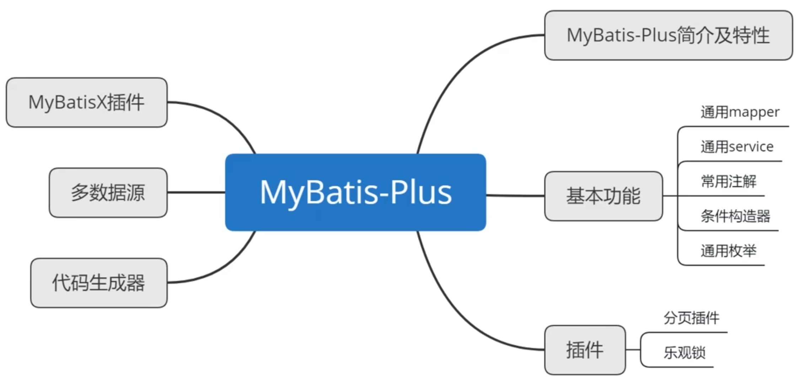
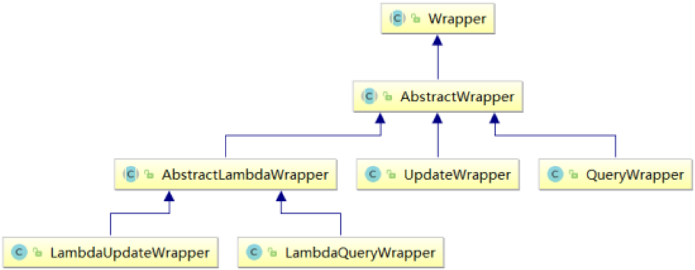

> 收获简化开发插件：1.lombok。

[toc]

# 一、MyBatis-Plus简介
## 1 、简介

MyBatis-Plus （简称 MP）是一个 MyBatis的增强工具 ，在 MyBatis 的基础上 只做增强不做改变 ，为简化开发、提高效率而生 。

## 2 、特性
- **无侵入** ：只做增强不做改变，引入它不会对现有工程产生影响，如丝般顺滑
- **损耗小** ：启动即会自动注入基本 CURD，性能基本无损耗，直接面向对象操作
- **强大的 CRUD 操作** ：内置通用 Mapper、通用 Service，仅仅通过少量配置即可实现单表大部分CRUD 操作，更有强大的条件构造器，满足各类使用需求
- **支持 Lambda 形式调用** ：通过 Lambda 表达式，方便的编写各类查询条件，无需再担心字段写错
- **支持主键自动生成** ：支持多达 4 种主键策略（内含分布式唯一 ID 生成器 - Sequence），可自由配置，完美解决主键问题
- **支持 ActiveRecord 模式** ：支持 ActiveRecord 形式调用，实体类只需继承 Model 类即可进行强大的 CRUD 操作
- **支持自定义全局通用操作** ：支持全局通用方法注入（ Write once, use anywhere ）
- **内置代码生成器** ：采用代码或者 Maven 插件可快速生成 Mapper 、 Model 、 Service 、Controller 层代码，支持模板引擎，更有超多自定义配置等您来使用
- **内置分页插件** ：基于 MyBatis 物理分页，开发者无需关心具体操作，配置好插件之后，写分页等同于普通 List 查询
- **分页插件支持多种数据库** ：支持 MySQL、MariaDB、Oracle、DB2、H2、HSQL、SQLite、Postgre、SQLServer 等多种数据库
- **内置性能分析插件** ：可输出 SQL 语句以及其执行时间，建议开发测试时启用该功能，能快速揪出慢查询
- **内置全局拦截插件** ：提供全表 delete 、 update 操作智能分析阻断，也可自定义拦截规则，预防误操作

# 二、入门案例
## 1、创建数据库及表
```sql
CREATE DATABASE `mybatis_plus` /*!40100 DEFAULT CHARACTER 
SET utf8mb4 */;
USE `mybatis_plus`;
CREATE TABLE `user` (
	`id` BIGINT ( 20 ) NOT NULL COMMENT '主键ID',
	`name` VARCHAR ( 30 ) DEFAULT NULL COMMENT '姓名',
	`age` INT ( 11 ) DEFAULT NULL COMMENT '年龄',
	`email` VARCHAR ( 50 ) DEFAULT NULL COMMENT '邮箱',
PRIMARY KEY ( `id` ) 
) ENGINE = INNODB DEFAULT CHARSET = utf8;

INSERT INTO USER ( id, NAME, age, email )
VALUES
	( 1, 'Jone', 18, 'test1@baomidou.com' ),
	( 2, 'Jack', 20, 'test2@baomidou.com' ),
	( 3, 'Tom', 28, 'test3@baomidou.com' ),
	( 4, 'Sandy', 21, 'test4@baomidou.com' ),
	( 5, 'Billie', 24, 'test5@baomidou.com' );
```

## 2、配置数据源
`application.properties` 配置数据源：
```properties
spring.datasource.username=root
spring.datasource.password=123456
spring.datasource.url=jdbc:mysql://localhost:3306/mybatis_plus?useUnicode=true&characterEncoding=UTF-8&useSSL=false&serverTimezone=Asia/Shanghai
spring.datasource.driver-class-name=com.mysql.cj.jdbc.Driver
```

## 3、创建MAVEN工程
**a> 项目依赖**
```xml
<dependencies>
    <dependency>
        <groupId>org.springframework.boot</groupId>
        <artifactId>spring-boot-starter</artifactId>
    </dependency>

    <dependency>
        <groupId>com.baomidou</groupId>
        <!-- mybatis-plus 场景 -->
        <artifactId>mybatis-plus-spring-boot3-starter</artifactId>
        <version>3.5.12</version>
    </dependency>

    <dependency>
        <groupId>com.mysql</groupId>
        <artifactId>mysql-connector-j</artifactId>
        <scope>runtime</scope>
    </dependency>
    <dependency>
        <groupId>org.projectlombok</groupId>
        <artifactId>lombok</artifactId>
        <optional>true</optional>
    </dependency>
    <dependency>
        <groupId>org.springframework.boot</groupId>
        <artifactId>spring-boot-starter-test</artifactId>
        <scope>test</scope>
    </dependency>
</dependencies>
```

> 注意：SpringBoot3 必须使用 `mybatis-plus-spring-boot3-starter` boot3 场景。在这里错了很多次。

**b> 添加 Mapper**
> 创建实体类 `User.java` 此处省略。

```java
// 此处不设置 @Mapper 注解，在启动类上标注 @MapperScan 统一导入
public interface UserMapper extends BaseMapper<User> {
}
```
> BaseMapper是MyBatis-Plus提供的模板mapper，其中包含了基本的CRUD方法，泛型为操作的实体类型。

**c> 配置文件**
需要在 `application.properties` 中指明 `xxxMapper.xml` 在那个目录下：
```properties
# 告诉 MyBatis-Plus 去哪找映射文件（此处展示为默认值，可不显式配置）
mybatis-plus.mapper-locations=classpath*:/mapper/**/*.xml
# 开启下划线转驼峰（默认为 true，可不显式配置）
mybatis-plus.configuration.map-underscore-to-camel-case=true
# 配置 MyBatis-Plus 的日志实现
mybatis-plus.configuration.log-impl=org.apache.ibatis.logging.stdout.StdOutImpl
# 以包为单位设置默认别名（不区分大小写）
mybatis-plus.type-aliases-package=com.mp.demo1.bean
```

**d> 总结**
在Spring整合MyBatis中加入了MyBatis-Plus后，我们就可以使用MyBatis-Plus所提供的BaseMapper实现CRUD，并不需要编写映射文件以及SQL语句。

但是若要自定义SQL语句，仍然可以编写映射文件而不造成任何影响，因为 MyBatis-Plus **只做增强，而不做改变**。

# 三、基本的 CRUD
## 1、插入
```java
User user = new User();
user.setName("张三");
user.setAge(20);
user.setEmail("zhangsan@163.com");
int count = userMapper.insert(user);
System.out.println("受影响行数 = " + count);
System.out.println("id自动获取的值" + user.getId());
```
> 最终执行的结果，所获取的id为1959912107562504194
> 这是因为MyBatis-Plus在实现插入数据时，会默认基于雪花算法的策略生成id

## 2、删除
**a> 测试deleteById**
```java
// 测试deleteById
int count = userMapper.deleteById(5);
System.out.println("受影响行数 = " + count);
```

**b> 测试deleteByMap**
```java
// 测试deleteByMap
Map<String, Object> map = new HashMap<>();
map.put("age",20);
map.put("name","张三");
int count = userMapper.deleteByMap(map);
System.out.println("受影响行数 = " + count);
```
> 实际语句是由条件 `AND` 连接的。
> ```bash
> ==>  Preparing: DELETE FROM user WHERE (name = ? AND age = ?)
> ==> Parameters: 张三(String), 18(Integer)
> ```

## 3、更新
```java
User user = new User();
user.setId(4L);
user.setName("张三");
user.setAge(20);
user.setEmail("zhangsan@163.com");
int count = userMapper.updateById(user);
System.out.println("受影响行数 = " + count);
```
> 如果传入的某个参数是null不会修改对应字段的。

## 4、查询
```java
// 通过id获取用户信息
User user = userMapper.selectById(1L);
System.out.println(user);
// 通过多个id获取多个用户信息
List<User> users = userMapper.selectByIds(Arrays.asList(1L, 2L));
users.forEach(System.out::println);
// 通过map获取用户信息
HashMap<String, Object> mp = new HashMap<>();
mp.put("name", "李四");
mp.put("age", 18);
List<User> selectByMap = userMapper.selectByMap(mp);
selectByMap.forEach(System.out::println);
// 查询所有用户信息
List<User> userList = userMapper.selectList(null);
userList.forEach(System.out::println);
```

## 5、通用 Service
> 说明:
> - 通用 Service CRUD 封装IService接口，进一步封装 CRUD 采用 get 查询单行、remove 删除、list 查询集合、page 分页前缀命名方式区分 Mapper 层避免混淆，
> - 建议如果存在自定义通用 Service 方法的可能，请创建自己的 IBaseService 继承 Mybatis-Plus 提供的基类

MyBatis-Plus中有一个接口 IService和其实现类 ServiceImpl，封装了常见的业务层逻辑，详情查看源码IService和ServiceImpl。

**创建接口和实现类**
```java
/**
* UserService继承IService模板提供的基础功能
*/
public interface UserService extends IService<User> {
}
```

```java
/**
* ServiceImpl实现了IService，提供了IService中基础功能的实现
* 若ServiceImpl无法满足业务需求，则可以使用自定的UserService定义方法，并在实现类中实现
*/
@Service
public class UserServiceImpl extends ServiceImpl<UserMapper, User> implements UserService {
}
```

**测试批量添加**
```java
@Autowired
private UserService userService;

@Test
public void testSaveBatch(){
    // SQL长度有限制，海量数据插入单条SQL无法实行，
    // 因此MP将批量插入放在了通用Service中实现，而不是通用Mapper
    ArrayList<User> users = new ArrayList<>();
    for (int i = 0; i < 5; i++) {
        User user = new User();
        user.setName("zs" + i);
        user.setAge(18 + i);
        user.setEmail("zs" + i + "@163.com");
        users.add(user);
    }
    // SQL:INSERT INTO t_user ( username, age ) VALUES ( ?, ? )
    // 从此处就可以看出 是通过单个添加再通过循环就行批量添加的
    userService.saveBatch(users);
}
```

> 通用 Service 中进行简单查询可以不注入 XxxMapper 直接使用 `query()`、`update()`、`save()`、`remove()` 语句访问数据库，进一步简化操作。如：
> ```java
> User user = query().eq("phone", loginForm.getPhone()).one();
> List<User> users = query().eq("phone", loginForm.getPhone> ()).list();
> ```

# 四、常用注解
## 1、@TableName
当数据库表名和实体类表名不一致时，如实体类为 User 数据库表为 t_user。调用默认的 `BaseMapper` 中的方法会出现 `java.sql.SQLSyntaxErrorException: Table 'mybatis_plus.user' doesn't exist` 错误。

在实体类类型上添加@TableName("t_user")，标识实体类对应的表，即可成功执行SQL语句。
```java
@Data
@TableName("t_user") // 标识实体类对应的表
public class User {
    private Long id;
    private String name;
    private Integer age;
    private String email;
}
```

> 在开发的过程中，我们经常遇到以上的问题，即实体类所对应的表都有固定的前缀，例如 `t_` 或 `tbl_` 。此时，可以使用MyBatis-Plus提供的全局配置（application.properties），为实体类所对应的表名设置默认的前缀，那么就不需要在每个实体类上通过@TableName标识实体类对应的表。
> ```properties
> # Mybatis-Plus 数据库表前缀
> mybatis-plus.global-config.db-config.table-prefix=t_
> ```

## 2、@TableId
当实体类和数据库字段的 id 不一致时也会出现错误。如 User 中为 id，t_user 表中为 uid。
> SQL 命令 `alter table t_user rename column id to uid;` 。使用传统的 change 命令会导致部分约束丢失。

在实体类中id属性上通过@TableId将其标识为主键，即可成功执行SQL语句。
```java
@Data
@TableName("t_user")
public class User {
    @TableId(value = "uid")
    private Long id;
    private String name;
    private Integer age;
    private String email;
}
```

@TableId的type属性用来定义主键策略。常用的主键策略：
| 值                   | 描述                                                                 |
|----------------------|----------------------------------------------------------------------|
| IdType.ASSIGN_ID（默认） | 基于雪花算法的策略生成数据id，与数据库id是否设置自增无关                |
| IdType.AUTO          | 使用数据库的自增策略，注意，该类型请确保数据库设置了id自增，否则无效     |

> 配置全局主键策略：
> ```properties
> # Mybatis-Plus 主键策略 auto:数据库ID自增
> mybatis-plus.global-config.db-config.id-type=auto
> ```

## 3、@TableField
如果出现实体类中的属性名和字段名不一致的情况，例如：

**情况一：下划线转驼峰**
实体类属性userName，表中字段user_name。

MyBatis-Plus会自动将下划线命名风格转化为驼峰命名风格（默认转换）。

**情况二：完全不一致**
实体类属性userName，表中字段name。此时需要在实体类属性上使用 `@TableField` 设置属性所对应的字段名。

```java
@Data
@TableName("t_user")
public class User {
    @TableId(value = "uid")
    private Long id;
    @TableField("name")
    private String userName;
    private Integer age;
    private String email;
}
```

**情况三：字段不存在**
实体类属性可能是 VO 或 DTO 定义了公共可用字段，但是数据库并不存在该字段。例如，假设实体类定义了num 数据库中没有该字段，此时必须告诉 MP 该字段忽略。

```java
@Data
@TableName("t_user")
public class User {
    @TableId(value = "uid")
    private Long id;
    @TableField("name")
    private String userName;
    private Integer age;
    private String email;
    @TableField(exist = false)
    private Integer num;
}
```

**情况四：字段以 is 开头**
实体类属性可能以 is 开头，例如实体类字段为 isMarried 数据库字段为 is_married，这种情况下 MP 会去掉 is 并按驼峰转下划线处理，此时也需要告诉 MP 该字段。

```java
@Data
@TableName("t_user")
public class User {
    @TableId(value = "uid")
    private Long id;
    @TableField("name")
    private String userName;
    private Integer age;
    private String email;
    @TableField(exist = false)
    private Integer num;
    @TableField("is_married")
    private Boolean isMarried;
}
```

> 补充情况：若字段命名与数据库关键字重复也需要指明告诉 MP，例如 @TableField("`order`")

## 4、@TableLogic
物理删除：真实删除，将对应数据从数据库中删除，之后查询不到此条被删除的数据。
逻辑删除：假删除，将对应数据中代表是否被删除字段的状态修改为“被删除状态”，之后在数据库中仍旧能看到此条数据记录。

```java
@Data
@TableName("t_user")
public class User {
    @TableId(value = "uid")
    private Long id;
    private String name;
    private Integer age;
    private String email;
    @TableLogic // 逻辑删除
    private Boolean isDeleted;
}
```
通过在实体类（isDeleted）和数据库表（is_deleted）中添加状态标记字段，标记逻辑删除，并使用 @TableLogic 标注实体类相关字段。MyBatis-Plus 可以自动实现逻辑删除功能。

此时执行删除语句 `userService.removeByIds(Arrays.asList(1L, 2L, 3L))` 只会进行逻辑删除，而不会真正删除：
```bash
==>  Preparing: UPDATE t_user SET is_deleted=1 WHERE uid IN ( ? , ? , ? ) AND is_deleted=0
==> Parameters: 1(Long), 2(Long), 3(Long)
```
并且执行查询 `userService.list().forEach(System.out::println)` 也会进行逻辑查询，并不会获取所有数据：
```bash
==> Parameters: 
<==    Columns: id, name, age, email, is_deleted
<==        Row: 4, Sandy, 21, test4@baomidou.com, 0
<==        Row: 5, Billie, 24, test5@baomidou.com, 0
<==        Row: 1960144227610402817, 李四, 18, <EMAIL>, 0
<==      Total: 3
```

# 五、条件构造器和常用接口
## 1、wapper介绍


- Wrapper ： 条件构造抽象类，最顶端父类
    - AbstractWrapper ： 用于查询条件封装，生成 sql 的 where 条件
        - QueryWrapper ： 查询条件封装
        - UpdateWrapper ： Update 条件封装
        - AbstractLambdaWrapper ： 使用Lambda 语法
            - LambdaQueryWrapper ：用于Lambda语法使用的查询Wrapper
            - LambdaUpdateWrapper ： Lambda 更新封装Wrapper

## 2、QueryWrapper
### a>例1：基本查询
1、组装查询条件
查询用户名包含a，年龄在20到30之间，并且邮箱不为null的用户信息。
```java
QueryWrapper<User> wrapper = new QueryWrapper<>();
wrapper.like("name", "a")
        .between("age", 20, 30)
        .isNotNull("email");
List<User> list = userMapper.selectList(wrapper);

list.forEach(System.out::println);
```

2、组装排序条件
按年龄降序查询用户，如果年龄相同则按id升序排列。
```java
QueryWrapper<User> wrapper = new QueryWrapper<>();
wrapper.orderByDesc("age")
        .orderByAsc("id");
List<User> list = userMapper.selectList(wrapper);

list.forEach(System.out::println);
```

### b>例2：组装删除条件
删除email为空的用户。
```java
QueryWrapper<User> wrapper = new QueryWrapper<>();
wrapper.isNull("email");
int delete = userMapper.delete(wrapper);

System.out.println("delete=" + delete);
```

### c>例3：条件的优先级（Update）
1、将（年龄大于20并且用户名中包含有a）或邮箱为null的用户信息修改。
```java
QueryWrapper<User> wrapper = new QueryWrapper<>();
wrapper.gt("age", 20)
        .like("name", "a")
        .or() // 使用 OR 分割接下来的条件，而不是默认的 AND
        .isNull("email");
User user = new User();
user.setName("张三"); // 原名为 Sandy
int update = userMapper.update(user, wrapper);

System.out.println("update=" + update);
```
```bash
==>  Preparing: UPDATE t_user SET name=? WHERE is_deleted=0 AND (age > ? AND name LIKE ? OR email IS NULL)
==> Parameters: 张三(String), 20(Integer), %a%(String)
```

2、将用户名中包含有a并且（年龄大于20或邮箱为null）的用户信息修改。
```java
QueryWrapper<User> wrapper = new QueryWrapper<>();
wrapper.like("name", "a")
        .and(i -> i.gt("age", 20).or().isNull("email")); // lambda表达式内的逻辑优先运算

User user = new User();
user.setName("张三"); // 原名为 Sandy
int update = userMapper.update(user, wrapper);

System.out.println("update=" + update);
```
```bash
==>  Preparing: UPDATE t_user SET name=? WHERE is_deleted=0 AND (name LIKE ? AND (age > ? OR email IS NULL))
==> Parameters: 张三(String), %a%(String), 20(Integer)
```

### d>例4：组装select子句
指定查询的列（"name", "age", "email"）。
```java
QueryWrapper<User> wrapper = new QueryWrapper<>();
wrapper.select("name", "age", "email"); // 指定查询的列
List<Map<String, Object>> maps = userMapper.selectMaps(wrapper);

maps.forEach(System.out::println);
```

### e>例5：实现子查询
通过子查询指定 SQL 的 in 子句。
```java
QueryWrapper<User> wrapper = new QueryWrapper<>();
wrapper.inSql("uid", "select uid from t_user where uid < 15");

userMapper.selectList(wrapper).forEach(System.out::println);
```
```bash
==>  Preparing: SELECT uid AS id,name,age,email,is_deleted FROM t_user WHERE is_deleted=0 AND (uid IN (select uid from t_user where uid < 15))
```

## 3、UpdateWrapper
将（年龄大于20或邮箱为null）并且用户名中包含有 ‘三’ 的用户信息修改。
```java
UpdateWrapper<User> updateWrapper = new UpdateWrapper<>();
updateWrapper.like("name", "三")
        .and(i -> i.gt("age", 20).or().isNull("email"));
// 附带要更新的实体数据
updateWrapper.set("name", "Sandy").set("age", 18);
int update = userMapper.update(null, updateWrapper);

System.out.println("update=" + update);
```

```bash
==>  Preparing: UPDATE t_user SET name=?,age=? WHERE is_deleted=0 AND (name LIKE ? AND (age > ? OR email IS NULL))
==> Parameters: Sandy(String), 18(Integer), %三%(String), 20(Integer)
```

## 4、condition 条件组装
在真正开发的过程中，组装条件是常见的功能，而这些条件数据来源于用户输入，是可选的，因此我们在组装这些条件时，必须先判断用户是否选择了这些条件，若选择则需要组装该条件，若没有选择则一定不能组装，以免影响SQL执行的结果。

思路一是使用 if 语句判断是否组装条件，方式二我们可以使用带**condition**参数的重载方法构建查询条件，简化代码的编写。
模拟场景：只有当前端输入带有条件时，我们才组装条件。
```java
// 模拟前端传递的参数
String name = null;
Long beginAge = 10L, endAge = 30L;

// Condition 条件
QueryWrapper<User> wrapper = new QueryWrapper<>();
wrapper.like(StringUtils.isNotBlank(name), "name", "a")
        .ge(beginAge != null, "age", beginAge)
        .le(endAge != null, "age", endAge);

userMapper.selectList(wrapper).forEach(System.out::println);
```

```bash
==>  Preparing: SELECT uid AS id,name,age,email,is_deleted FROM t_user WHERE is_deleted=0 AND (age >= ? AND age <= ?)
==> Parameters: 10(Long), 30(Long)
```

## 5、LambdaXxxWrapper
与基本的 XxxWrapper 区别是：指定条件时，不需要使用字符串指定要查询的数据库表字段，只需要使用实体类指定属性。

1、LambdaQueryWrapper
```java
// 模拟前端传递的参数
String name = null;
Long beginAge = 10L, endAge = 30L;
// Condition 条件
LambdaQueryWrapper<User> wrapper = new LambdaQueryWrapper<>();
wrapper.like(StringUtils.isNotBlank(name), User::getName, "a")
        .ge(beginAge != null, User::getAge, beginAge)
        .le(endAge != null, User::getAge, endAge);

userMapper.selectList(wrapper).forEach(System.out::println);
```

2、LambdaUpdateWrapper
```java
LambdaUpdateWrapper<User> wrapper = new LambdaUpdateWrapper<>();
wrapper.like(User::getName, "a")
        .and(i -> i.gt(User::getAge, 17).or().isNull(User::getEmail));
// 附带要更新的实体数据
wrapper.set(User::getName, "张三").set(User::getAge, 18);
int update = userMapper.update(null, wrapper);
System.out.println("update=" + update);
```

# 六、插件
## 1、分页插件
MyBatis Plus自带分页插件，只要简单的配置即可实现分页功能。

**a> 引入依赖**
```xml
<!-- MyBatis-Plus 扩展插件 -->
<dependency>
    <groupId>com.baomidou</groupId>
    <artifactId>mybatis-plus-jsqlparser</artifactId>
    <version>3.5.12</version>
</dependency>
```

**b> 配置类添加组件**
```java
@MapperScan("com.mp.demo1.mapper")
@Configuration
public class MybatisPlusConfig {
    @Bean
    MybatisPlusInterceptor mybatisPlusInterceptor() {
        MybatisPlusInterceptor interceptor = new MybatisPlusInterceptor();
        // 添加分页插件类，并指定数据库类型为 DbType.MYSQL
        interceptor.addInnerInterceptor(new PaginationInnerInterceptor(DbType.MYSQL));
        return interceptor;
    }
}
```

**c> 测试**
```java
//设置分页参数
Page<User> page = new Page<>(1, 5);
userMapper.selectPage(page, null);
//获取分页数据
List<User> list = page.getRecords();
list.forEach(System.out::println);
System.out.println("当前页："+page.getCurrent());
System.out.println("每页显示的条数："+page.getSize());
System.out.println("总记录数："+page.getTotal());
System.out.println("总页数："+page.getPages());
System.out.println("是否有上一页："+page.hasPrevious());
System.out.println("是否有下一页："+page.hasNext());
```

## 2、自定义 xml 使用分页插件
### a> UserMapper中定义接口方法
根据年龄查询用户列表，分页显示。page 分页对象，xml中可以从里面进行取值，传递参数 Page 即自动分页，该参数必须放在第一位。
```java
Page<User> selectPageVO(@Param("page") Page<User> page, @Param("age") Integer age);
```

### b> UserMapper.xml中编写SQL
```xml
<!--SQL片段，记录基础字段-->
<sql id="BaseColumns">id,username,age,email</sql>
<!--IPage<User> selectPageVo(Page<User> page, Integer age);-->
<select id="selectPageVo" resultType="User">
    SELECT <include refid="BaseColumns"></include> FROM t_user WHERE age > #{age}
</select>
```

## 3、乐观锁
### a> 场景
一件商品，成本价是80元，售价是100元。老板先是通知小李，说你去把商品价格增加50元。小李正在玩游戏，耽搁了一个小时。正好一个小时后，老板觉得商品价格增加到150元，价格太高，可能会影响销量。又通知小王，你把商品价格降低30元。

此时，小李和小王同时操作商品后台系统。小李操作的时候，系统先取出商品价格100元；小王也在操作，取出的商品价格也是100元。小李将价格加了50元，并将100+50=150元存入了数据库；小王将商品减了30元，并将100-30=70元存入了数据库。是的，如果没有锁，小李的操作就完全被小王的覆盖了。

现在商品价格是70元，比成本价低10元。几分钟后，这个商品很快出售了1千多件商品，老板亏1万多。

### b> 乐观锁与悲观锁
上面的故事，如果是乐观锁，小王保存价格前，会检查下价格是否被人修改过了。如果被修改过了，则重新取出的被修改后的价格，150元，这样他会将120元存入数据库。

如果是悲观锁，小李取出数据后，小王只能等小李操作完之后，才能对价格进行操作，也会保证最终的价格是120元。

### c> Mybatis-Plus实现乐观锁
> 乐观锁（@Version + OptimisticLockerInnerInterceptor）自动生效的前提：调用 MP 的内置更新方法（updateById、update(entity, wrapper)）。拦截器会在 WHERE 拼 version = ? 并在更新时把 version 自增。

**1、引入依赖**
```xml
<!-- MyBatis-Plus 扩展插件 -->
<dependency>
    <groupId>com.baomidou</groupId>
    <artifactId>mybatis-plus-jsqlparser</artifactId>
    <version>3.5.12</version>
</dependency>
```

**2、配置类添加组件**
```java
@MapperScan("com.mp.demo1.mapper")
@Configuration
public class MybatisPlusConfig {
    @Bean
    MybatisPlusInterceptor mybatisPlusInterceptor() {
        MybatisPlusInterceptor interceptor = new MybatisPlusInterceptor();
        // 添加分页插件
        interceptor.addInnerInterceptor(new PaginationInnerInterceptor(DbType.MYSQL));
        // 添加乐观锁插件
        interceptor.addInnerInterceptor(new OptimisticLockerInnerInterceptor());
        return interceptor;
    }
}
```

**3、测试**
准备测试数据，并添加对应的实体 Product.java 和 ProductMapper.java：
```sql
CREATE TABLE t_product
(
    id BIGINT(20) NOT NULL COMMENT '主键ID',
    NAME VARCHAR(30) NULL DEFAULT NULL COMMENT '商品名称',
    price INT(11) DEFAULT 0 COMMENT '价格',
    VERSION INT(11) DEFAULT 0 COMMENT '乐观锁版本号',
    PRIMARY KEY (id)
);

INSERT INTO t_product (id, NAME, price) VALUES (1, '外星人笔记本', 100);
```

```java
@Data
public class Product {
    private Long id;
    private String name;
    private Integer price;
    @Version // 标识乐观锁版本字段
    private Integer version;
}
```

测试代码：
```java
Product query1 = productMapper.selectById(1);
Product query2 = productMapper.selectById(1);

// 模拟用户1修改价格
query1.setPrice(query2.getPrice() + 50);
productMapper.updateById(query1);
// 模拟用户2修改价格
query2.setPrice(query2.getPrice() - 30);
productMapper.updateById(query2);

// 查询最终价格 乐观锁保护，用户2的修改未生效
Product query3 = productMapper.selectById(1);
System.out.println(query3);
```

# 七、通用枚举
数据库表中的有些字段值是固定的，例如性别（男或女），此时我们可以使用MyBatis-Plus的通用枚举来实现。

## 环境准备
**a>数据库表添加字段sex**
```sql
alter table t_user add  column gender tinyint(1) default 0 comment '性别';
```

**b>创建通用枚举类型**
```java
@Getter
public enum GenderEnum {
    FEMALE(0, "女");
    MALE(1, "男"),

    @EnumValue // 标记数据库存的值
    private final Integer value;
    private final String gender;

    GenderEnum(Integer value, String gender) {
        this.value = value;
        this.gender = gender;
    }
}
```
> @EnumValue 标记数据库存的值，告诉 MP 更新和查询数据库该字段时应该用哪个值。
> 若需要指明前端得到的数据可以使用 @JsonValue 指明。

## 测试
```java
User user = new User();
user.setName("Jone");
user.setAge(18);
user.setEmail("popopop@163.com");
user.setGender(GenderEnum.MALE);
int insert = userMapper.insert(user);
System.out.println("受影响行数: " + insert);
```

# 八、代码生成器
## 1、引入依赖
```xml
<!-- 代码生成依赖 -->
<dependency>
    <groupId>com.baomidou</groupId>
    <artifactId>mybatis-plus-generator</artifactId>
    <version>3.5.12</version>
    <scope>test</scope>
</dependency>
```

## 2、快速生成
```java
public static void main(String[] args) {
    FastAutoGenerator.create(
        "jdbc:mysql://localhost:3306/mybatis_plus?useUnicode=true&characterEncoding=UTF-8&useSSL=false&serverTimezone=Asia/Shanghai",
                "root",
                "123456"
        )
        .globalConfig(builder -> builder
                .author("Sophon")
                .outputDir(Paths.get(System.getProperty("user.dir")) + "/src/main/java")
                .commentDate("yyyy-MM-dd")
        )
        .packageConfig(builder -> builder
                .parent("com.mybatisplus")
                .entity("entity")
                .mapper("mapper")
                .service("service")
                .serviceImpl("service.impl")
                .xml("mapper.xml")
        )
        .strategyConfig(builder -> builder
                .entityBuilder()
                .enableLombok()
        )
        .templateEngine(new FreemarkerTemplateEngine())
        .execute();
}
```

# 九、多数据源
> 适用于多种场景：纯粹多库、 读写分离、 一主多从、 混合模式等。
> 目前我们就来模拟一个纯粹多库的一个场景，其他场景类似。

场景说明：
我们创建两个库，分别为：mybatis_plus（以前的库不动）与mybatis_plus_1（新建），将mybatis_plus库的product表移动到mybatis_plus_1库，这样每个库一张表，通过一个测试用例
分别获取用户数据与商品数据，如果获取到说明多库模拟成功。

## 1、创建数据库及表
> 创建数据库mybatis_plus_1和表product，删除原本 mybatis_plus 数据库中的 product 表。

```java
CREATE DATABASE `mybatis_plus_1` /*!40100 DEFAULT CHARACTER SET utf8mb4 */;
use `mybatis_plus_1`;
CREATE TABLE product
(
    id BIGINT(20) NOT NULL COMMENT '主键ID',
    name VARCHAR(30) NULL DEFAULT NULL COMMENT '商品名称',
    price INT(11) DEFAULT 0 COMMENT '价格',
    version INT(11) DEFAULT 0 COMMENT '乐观锁版本号',
    PRIMARY KEY (id)
);

INSERT INTO product (id, NAME, price) VALUES (1, '外星人笔记本', 100);
```

## 2、引入依赖
```java
<dependency>
    <groupId>com.baomidou</groupId>
    <artifactId>dynamic-datasource-spring-boot3-starter</artifactId>
    <version>4.3.1</version>
</dependency>
```

## 3、配置多数据源
```yaml
spring:
  datasource:
    dynamic:
      primary: master
      strict: false
      datasource:
        master:
          url: jdbc:mysql://localhost:3306/mybatis_plus?useUnicode=true&characterEncoding=UTF-8&useSSL=false&serverTimezone=Asia/Shanghai
          username: root
          password: 123456
          driver-class-name: com.mysql.cj.jdbc.Driver
        slave_1:
          url: jdbc:mysql://localhost:3306/mybatis_plus_1?useUnicode=true&characterEncoding=UTF-8&useSSL=false&serverTimezone=Asia/Shanghai
          username: root
          password: 123456
          driver-class-name: com.mysql.cj.jdbc.Driver
```

## 4、创建 Service
**创建用户service**
```java
public interface UserService extends IService<User> {
}
```

```java
@DS("master") //指定所操作的数据源
@Service
public class UserServiceImpl extends ServiceImpl<UserMapper, User> implements UserService {
}
```

**创建商品service**
```java
public interface ProductService extends IService<Product> {
}
```

```java
@DS("slave_1")
@Service
public class ProductServiceImpl extends ServiceImpl<ProductMapper, Product> implements ProductService {
}
```

## 5、测试
```java
@Autowired
private UserService userService;
@Autowired
private ProductService productService;
@Test
public void testDynamicDataSource(){
    System.out.println(userService.getById(1L));
    System.out.println(productService.getById(1L));
}
```
> 结果：
> 1、都能顺利获取对象，则测试成功；
> 2、如果我们实现读写分离，将写操作方法加上主库数据源，读操作方法加上从库数据源，自动切换就能实现读写分离。

# 10、MyBatisX 插件
使用 MyBatisX 加速开发技巧。
- 编写任意接口方法后，ctrl + enter 即可生成接口对应 xml 文件。
- 编写接口时分别使用 insert、delete、update、select 开头编写接口方法，MyBatisX 会自动提示模板代码。alt + enter 即可补全对应的 xml 对应方法 sql 语句。

