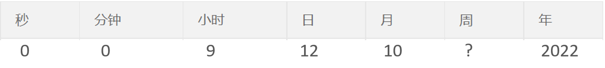

[toc]

# Spring Task 介绍
Spring Task 是Spring框架提供的任务调度工具，可以按照约定的时间自动执行某个代码逻辑。

定位：定时任务框架。
作用：定时自动执行某段代码。

> 只要是需要定时处理的场景都可以使用Spring Task。应用场景：
> - 信用卡每月还款提醒
> - 银行贷款每月还款提醒
> - 火车票售票系统处理未支付订单
> - 入职纪念日为用户发送通知

## cron 表达式
cron 表达式其实就是一个字符串，通过 cron 表达式可以定义任务触发的时间。
构成规则：分为 6 或 7 个域，由空格分隔开，每个域代表一个含义。每个域的含义分别为：秒、分钟、小时、日、月、周、年(可选)。

2022年10月12日上午9点整对应的 cron 表达式为：0 0 9 12 10 ? 2022 。


> 对于复杂的 cron 表达式，可以使用 cron 表达式在线生成器：https://cron.qqe2.com/ 。

## 快速开始
Spring Task使用步骤：
1.导入 maven 坐标 spring-context（已存在）；

2.启动类添加注解 @EnableScheduling 开启任务调度；
```java
@SpringBootApplication
@EnableTransactionManagement //开启注解方式的事务管理
@Slf4j
@EnableCaching //开启缓存功能
@EnableScheduling // 开启定时任务功能
public class SkyApplication {
    public static void main(String[] args) {
        SpringApplication.run(SkyApplication.class, args);
        log.info("server started");
    }
}
```
3.自定义定时任务类（需要注册为组件，加入 Spring 容器中）。
```java
/**
    * 自定义定时任务类
    */
@Component
@Slf4j
public class MyTask {
    @Scheduled(cron = "0/5 * * * * ?")
    public void executeTask() {
        log.info("定时任务开始执行: {}", System.currentTimeMillis());
    }
}
```
执行效果：
```bash
2025-09-22 14:23:35.004  INFO 28396 --- [   scheduling-1] com.sky.task.MyTask                      : 定时任务开始执行: 1758522215004
2025-09-22 14:23:40.002  INFO 28396 --- [   scheduling-1] com.sky.task.MyTask                      : 定时任务开始执行: 1758522220002
2025-09-22 14:23:45.011  INFO 28396 --- [   scheduling-1] com.sky.task.MyTask                      : 定时任务开始执行: 1758522225011
2025-09-22 14:23:50.008  INFO 28396 --- [   scheduling-1] com.sky.task.MyTask                      : 定时任务开始执行: 1758522230008
......
```

# Websocket 
WebSocket 是基于 TCP 的一种新的网络协议。它实现了浏览器与服务器全双工通信——浏览器和服务器只需要完成一次握手，两者之间就可以创建持久性的连接，并进行双向数据传输。

HTTP协议和WebSocket协议对比：
- HTTP是短连接
- WebSocket是长连接
- HTTP通信是单向的，基于请求响应模式
- WebSocket支持双向通信
- HTTP和WebSocket底层都是TCP连接

> WebSocket 应用场景：视频弹幕、网页聊天、体育实况更新、股票基金报价实时更新。

## 快速开始
1.直接使用websocket.html页面作为WebSocket客户端
```html
<!DOCTYPE HTML>
<html>
<head>
    <meta charset="UTF-8">
    <title>WebSocket Demo</title>
</head>
<body>
    <input id="text" type="text" />
    <button onclick="send()">发送消息</button>
    <button onclick="closeWebSocket()">关闭连接</button>
    <div id="message">
    </div>
</body>
<script type="text/javascript">
    var websocket = null;
    var clientId = Math.random().toString(36).substr(2);

    //判断当前浏览器是否支持WebSocket
    if('WebSocket' in window){
        //连接WebSocket节点
        websocket = new WebSocket("ws://localhost:8080/ws/"+clientId);
    }
    else{
        alert('Not support websocket')
    }

    //连接发生错误的回调方法
    websocket.onerror = function(){
        setMessageInnerHTML("error");
    };

    //连接成功建立的回调方法
    websocket.onopen = function(){
        setMessageInnerHTML("连接成功");
    }

    //接收到消息的回调方法
    websocket.onmessage = function(event){
        setMessageInnerHTML(event.data);
    }

    //连接关闭的回调方法
    websocket.onclose = function(){
        setMessageInnerHTML("close");
    }

    //监听窗口关闭事件，当窗口关闭时，主动去关闭websocket连接，防止连接还没断开就关闭窗口，server端会抛异常。
    window.onbeforeunload = function(){
        websocket.close();
    }

    //将消息显示在网页上
    function setMessageInnerHTML(innerHTML){
        document.getElementById('message').innerHTML += innerHTML + '<br/>';
    }

    //发送消息
    function send(){
        var message = document.getElementById('text').value;
        websocket.send(message);
    }
	
	//关闭连接
    function closeWebSocket() {
        websocket.close();
    }
</script>
</html>
```

2.导入WebSocket的maven坐标
```xml
<dependency>
    <groupId>org.springframework.boot</groupId>
    <artifactId>spring-boot-starter-websocket</artifactId>
</dependency>
```

3.导入WebSocket服务端组件WebSocketServer，用于和客户端通信
```java
import lombok.extern.slf4j.Slf4j;
import org.springframework.stereotype.Component;
import javax.websocket.OnClose;
import javax.websocket.OnMessage;
import javax.websocket.OnOpen;
import javax.websocket.Session;
import javax.websocket.server.PathParam;
import javax.websocket.server.ServerEndpoint;
import java.util.Collection;
import java.util.HashMap;
import java.util.Map;

/**
 * WebSocket服务
 */
@Component
@ServerEndpoint("/ws/{sid}")
@Slf4j
public class WebSocketServer {
    //存放会话对象
    private static Map<String, Session> sessionMap = new HashMap();

    /**
     * 连接建立成功调用的方法
     */
    @OnOpen
    public void onOpen(Session session, @PathParam("sid") String sid) {
        log.info("客户端：{} 建立连接", sid);
        sessionMap.put(sid, session);
    }

    /**
     * 收到客户端消息后调用的方法
     *
     * @param message 客户端发送过来的消息
     */
    @OnMessage
    public void onMessage(String message, @PathParam("sid") String sid) {
        log.info("收到来自客户端：{} 的信息：{}", sid, message);
    }

    /**
     * 连接关闭调用的方法
     *
     * @param sid
     */
    @OnClose
    public void onClose(@PathParam("sid") String sid) {
        log.info("连接断开：{}", sid);
        sessionMap.remove(sid);
    }

    /**
     * 群发
     *
     * @param message
     */
    public void sendToAllClient(String message) {
        Collection<Session> sessions = sessionMap.values();
        for (Session session : sessions) {
            try {
                //服务器向客户端发送消息
                session.getBasicRemote().sendText(message);
            } catch (Exception e) {
                e.printStackTrace();
            }
        }
    }
}
```

4.导入配置类WebSocketConfiguration，注册WebSocket的服务端组件
```java
/**
 * WebSocket配置类，用于注册WebSocket的Bean
 */
@Configuration
public class WebSocketConfiguration {
    @Bean
    public ServerEndpointExporter serverEndpointExporter() {
        return new ServerEndpointExporter();
    }
}
```

5.导入定时任务类WebSocketTask，定时向客户端推送数据（该类用来方便测试）
```java
@Component
public class WebSocketTask {
    @Autowired
    private WebSocketServer webSocketServer;

    /**
     * 通过WebSocket每隔5秒向客户端发送消息
     */
    @Scheduled(cron = "0/5 * * * * ?")
    public void sendMessageToClient() {
        webSocketServer.sendToAllClient("这是来自服务端的消息：" + DateTimeFormatter.ofPattern("HH:mm:ss").format(LocalDateTime.now()));
    }
}
```


