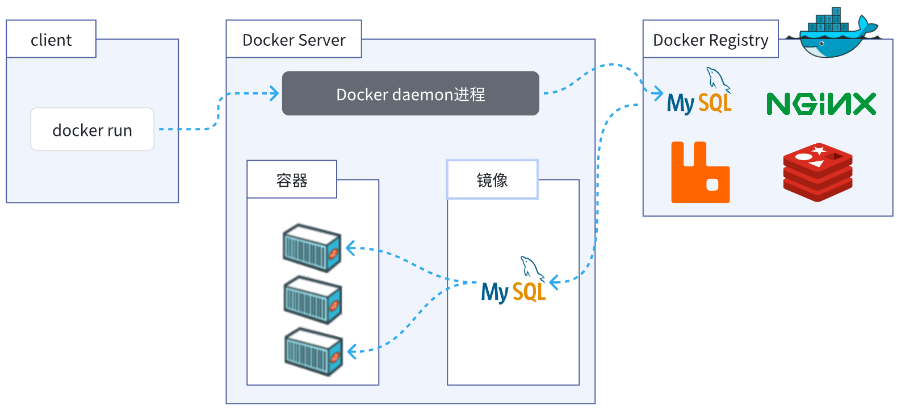
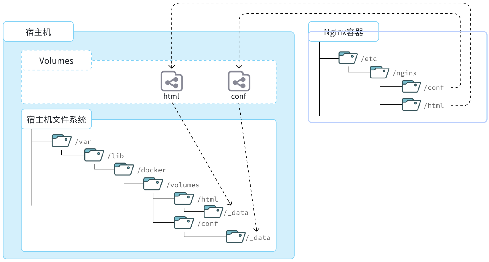
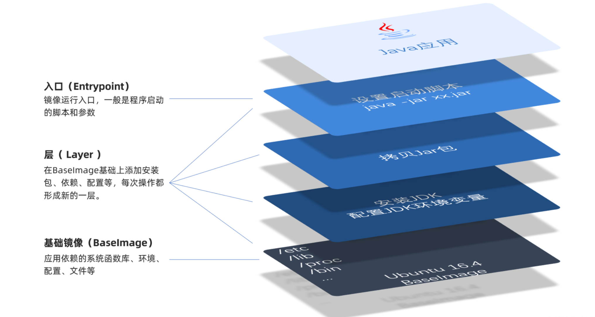
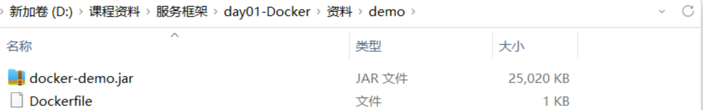

[toc]

# 1 Docker 快速入门
## 1.1 部署 MySQL
使用Docker部署 MySQL，仅仅需要一步即可，在命令行（CentOS 7.9）输入下面的命令：

```bash
docker run -d \
  --name mysql \
  -p 3306:3306 \
  -e TZ=Asia/Shanghai \
  -e MYSQL_ROOT_PASSWORD=123 \
  mysql
```

MySQL安装完毕！通过任意客户端工具即可连接到MySQL。

执行命令后，Docker做的第一件事情，是去自动搜索并下载了MySQL，然后会自动运行MySQL，我们完全不用插手。
而且，这种安装方式你完全不用考虑运行的操作系统环境，它不仅仅在CentOS系统是这样，在Ubuntu系统、macOS系统、甚至是装了WSL的Windows下，都可以使用这条命令来安装MySQL。

要知道，**不同操作系统下其安装包、运行环境是都不相同的**，如果是手动安装，必须手动解决**安装包不同、环境不同的、配置不同**的问题。

而使用Docker，这些完全不用考虑。就是因为Docker会自动搜索并下载MySQL镜像。

Docker 下载的不是安装包，而是**镜像**。镜像中不仅包含了软件本身，还包含了其运行所需要的**环境、配置、系统级函数库**。
Docker 运行的镜像有自己独立的环境，这套独立运行的隔离环境我们称为**容器**，每个容器有自己独立的**内存、网络和文件系统**。

说明：
- 镜像：英文是 image
- 容器：英文是 container

> Docker安装软件的过程，就是自动搜索下载镜像，然后创建并运行容器的过程。



Docker官方提供了一个专门管理、存储镜像的网站，并对外开放了镜像上传、下载的权利。Docker官方提供了一些基础镜像，然后各大软件公司又在基础镜像基础上，制作了自家软件的镜像，全部都存放在这个网站。这个网站就成了Docker镜像交流的社区：https://hub.docker.com/ 。基本上我们常用的各种软件都能在这个网站上找到，我们甚至可以自己制作镜像上传上去。

## 1.2 命令解读

```bash
docker run -d \
  --name mysql \
  -p 3306:3306 \
  -e TZ=Asia/Shanghai \
  -e MYSQL_ROOT_PASSWORD=123 \
  mysql
```

解读：
- `docker run -d` ：创建并运行一个容器，-d则是让容器以后台进程运行
- `--name mysql`  : 给容器起个名字叫mysql，可以任意命名但是必须唯一
- `-p 3306:3306` : 设置端口映射。
  - 容器是隔离环境，外界不可访问。但是可以将宿主机端口映射容器内到端口，当访问宿主机指定端口时，就是在访问容器内的端口了。
  - 容器内端口往往是由容器内的进程决定，例如MySQL进程默认端口是3306，因此容器内端口一定是3306；而宿主机端口则可以任意指定，一般与容器内保持一致。
  - 格式： -p 宿主机端口:容器内端口，示例中就是将宿主机的3306映射到容器内的3306端口
- `-e TZ=Asia/Shanghai` : 配置容器内进程运行时的一些参数
  - 格式：-e KEY=VALUE，KEY和VALUE都由容器内进程决定
  - 案例中，TZ=Asia/Shanghai是设置时区；MYSQL_ROOT_PASSWORD=123是设置MySQL默认密码
- `mysql` : 设置镜像名称，Docker会根据这个名字搜索并下载镜像
  - 格式：REPOSITORY:TAG，例如mysql:8.0，其中REPOSITORY可以理解为镜像名，TAG是版本号
  - 在未指定TAG的情况下，默认是最新版本，也就是mysql:latest

镜像的名称不是随意的，而是要到DockerRegistry中寻找，镜像运行时的配置也不是随意的，要参考镜像的帮助文档，这些在DockerHub网站或者软件的官方网站中都能找到。

如果我们要安装其它软件，也可以到DockerRegistry中寻找对应的镜像名称和版本，阅读相关配置即可。

# 2 Docker 基础
## 2.1 常见命令
| 命令            | 说明 |
| --- | --- |
| docker pull     |  拉取镜像      |
| docker push     |  推送镜像到DockerRegistry      |
| docker images   |  查看本地镜像       |
| docker rmi      |  删除本地镜像       |
| docker run      |  创建并运行容器（不能重复创建）       |
| docker stop     |  停止指定容器       |
| docker start    |  启动指定容器       |
| docker restart  |  重新启动容器       |
| docker rm       |  删除指定容器       |
| docker ps       |  查看运行中的容器       |
| docker ps -a    |  查看所有容器       |
| docker logs     |  查看容器运行日志       |
| docker exec     |  进入容器，例如：docker exec -it nginx bash       |
| docker save     |  保存镜像到本地压缩文件       |
| docker load     |  加载本地压缩文件到镜像       |
| docker inspect  |  查看容器详细信息       |

用一副图来表示这些命令的关系：


补充：
默认情况下，每次重启虚拟机我们都需要手动启动Docker和Docker中的容器。通过命令可以实现开机自启：

```bash
# Docker开机自启
systemctl enable docker

# Docker容器开机自启
docker update --restart=always [容器名/容器id]
```

## 2.2 数据卷
容器是隔离环境，容器内程序的文件、配置、运行时产生的数据都在容器内部，我们要读写容器内的文件非常不方便。大家思考几个问题：
- 如果要升级MySQL版本，需要销毁旧容器，那么数据岂不是跟着被销毁了？
- MySQL、Nginx容器运行后，如果我要修改其中的某些配置该怎么办？
- 我想要让Nginx代理我的静态资源怎么办？

因此，容器提供程序的运行环境，但是程序运行产生的数据、程序运行依赖的配置都应该与容器解耦。

### 2.2.1 什么是数据卷
**数据卷（volume）**是一个虚拟目录，是**容器内目录**与**宿主机目录**之间映射的桥梁。
以Nginx为例，我们知道Nginx中有两个关键的目录：
- html：放置一些静态资源
- conf：放置配置文件

如果我们要让Nginx代理我们的静态资源，最好是放到html目录；如果我们要修改Nginx的配置，最好是找到conf下的nginx.conf文件。但遗憾的是，容器运行的Nginx所有的文件都在容器内部。所以我们必须利用数据卷将两个目录与宿主机目录关联，方便我们操作。如图：



在上图中：
- 我们创建了两个数据卷：conf、html
- Nginx容器内部的conf目录和html目录分别与两个数据卷关联。
- 而数据卷conf和html分别指向了宿主机的 /var/lib/docker/volumes/conf/_data 目录和 /var/lib/docker/volumes/html/_data 目录

这样以来，容器内的conf和html目录就 与宿主机的conf和html目录关联起来，我们称为挂载。此时，我们操作宿主机的 /var/lib/docker/volumes/html/_data 就是在操作容器内的 /usr/share/nginx/html/_data 目录。只要我们将静态资源放入宿主机对应目录，就可以被Nginx代理了。

> 为什么不让容器目录直接指向宿主机目录呢？
> - 因为直接指向宿主机目录就与宿主机强耦合了，如果切换了环境，宿主机目录就可能发生改变了。由于容器一旦创建，目录挂载就无法修改，这样容器就无法正常工作了。
> - 但是容器指向数据卷，一个逻辑名称，而数据卷再指向宿主机目录，就不存在强耦合。如果宿主机目录发生改变，只要改变数据卷与宿主机目录之间的映射关系即可。
> 
> 不过，我们通过由于数据卷目录比较深，不好寻找，通常我们也允许让容器直接与宿主机目录挂载而不使用数据卷，具体参考2.2.3小节。

### 2.2.2 数据卷命令
| 命令                   | 说明 |
| --- | --- |
| docker volume create   | 创建数据卷 |
| docker volume ls       | 查看所有数据卷 |
| docker volume rm       | 删除指定数据卷 |
| docker volume inspect  | 查看某个数据卷的详情 |
| docker volume prune    | 清除数据卷 |

注意：容器与数据卷的挂载要在创建容器时配置，对于创建好的容器，是不能设置数据卷的。而且创建容器的过程中，数据卷会自动创建。以为 Nginx 静态资源创建数据卷为例：

```bash
# 1.首先创建容器并指定数据卷，注意通过 -v 参数来指定数据卷，宿主机 html 目录自动创建
docker run -d --name nginx -p 80:80 -v html:/usr/share/nginx/html nginx

# 2.然后查看数据卷
docker volume ls
```

### 2.2.3 挂载本地目录或文件
可以发现，数据卷的目录结构较深，如果我们去操作数据卷目录会不太方便。在很多情况下，我们会直接将容器目录与宿主机指定目录挂载。挂载语法与数据卷类似：

```bash
# 挂载本地目录
-v 本地目录:容器内目录
# 挂载本地文件
-v 本地文件:容器内文件
```

> 注意：本地目录或文件必须以 / 或 ./开头，如果直接以名字开头，会被识别为数据卷名而非本地目录名。

## 2.3 镜像
前面我们一直在使用别人准备好的镜像，那如果我要部署一个Java项目，把它打包为一个镜像该怎么做呢？
### 2.3.1 镜像结构
要想自己构建镜像，必须先了解镜像的结构。
之前我们说过，镜像之所以能让我们快速跨操作系统部署应用而忽略其运行环境、配置，就是因为镜像中包含了程序运行需要的系统函数库、环境、配置、依赖。
因此，自定义镜像本质就是依次准备好程序运行的基础环境、依赖、应用本身、运行配置等文件，并且打包而成。

举个例子，我们要从0部署一个Java应用，大概流程是这样：
- 准备一个linux服务（CentOS或者Ubuntu均可）
- 安装并配置JDK
- 上传Jar包
- 运行jar包

那因此，我们打包镜像也是分成这么几步：
- 准备Linux运行环境（java项目并不需要完整的操作系统，仅仅是基础运行环境即可）
- 安装并配置JDK
- 拷贝jar包
- 配置启动脚本

上述步骤中的每一次操作其实都是在生产一些文件（系统运行环境、函数库、配置最终都是磁盘文件），所以镜像就是一堆文件的集合。
但需要注意的是，镜像文件不是随意堆放的，而是按照操作的步骤分层叠加而成，每一层形成的文件都会单独打包并标记一个唯一id，称为Layer（层）。这样，如果我们构建时用到的某些层其他人已经制作过，就可以直接拷贝使用这些层，而不用重复制作。

例如，第一步中需要的Linux运行环境，通用性就很强，所以Docker官方就制作了这样的只包含Linux运行环境的镜像。我们在制作java镜像时，就无需重复制作，直接使用Docker官方提供的CentOS或Ubuntu镜像作为基础镜像。然后再搭建其它层即可，这样逐层搭建，最终整个Java项目的镜像结构如图所示：



### 2.3.2 Dockerfile
由于制作镜像的过程中，需要逐层处理和打包，比较复杂，所以Docker就提供了自动打包镜像的功能。我们只需要将打包的过程，每一层要做的事情用固定的语法写下来，交给Docker去执行即可。
而这种记录镜像结构的文件就称为Dockerfile，其对应的语法可以参考官方文档：https://docs.docker.com/engine/reference/builder/

其中的语法比较多，比较常用的有：
| 指令 | 说明 |
|------|------|
| FROM | 指定基础镜像 |
| ENV | 设置环境变量，可在后面指令使用 |
| COPY | 拷贝本地文件到镜像的指定目录 |
| RUN | 执行Linux的shell命令，一般是安装过程的命令 |
| EXPOSE | 指定容器运行时监听的端口，是给镜像使用者看的 |
| ENTRYPOINT | 镜像中应用的启动命令，容器运行时调用 |

根据别人整理的包含基础的系统加JDK环境镜像，我们在此基础上制作java镜像，就可以省去JDK的配置了：

```dockerfile
# 基础镜像
FROM openjdk:11.0-jre-buster
# 设定时区
ENV TZ=Asia/Shanghai
RUN ln -snf /usr/share/zoneinfo/$TZ /etc/localtime && echo $TZ > /etc/timezone
# 拷贝jar包
COPY docker-demo.jar /app.jar
# 入口
ENTRYPOINT ["java", "-jar", "/app.jar"]
```

### 2.3.3 构建镜像
当Dockerfile文件写好以后，就可以利用命令来构建镜像了。
在课前资料中，我们准备好了一个demo项目及对应的Dockerfile：



首先，我们将课前资料提供的docker-demo.jar包以及Dockerfile拷贝到虚拟机的/root/demo目录。然后，执行命令，构建镜像：

> 注意：需要提前拉取或者加载 openjdk:11.0-jre-buster 基础镜像。

```bash
# 进入镜像目录
cd /root/demo
# 开始构建
docker build -t docker-demo:1.0 .
```

命令说明：
- docker build : 就是构建一个docker镜像
- -t docker-demo:1.0 ：-t参数是指定镜像的名称（repository和tag）
- . : 最后的点是指构建时Dockerfile所在路径，由于我们进入了demo目录，所以指定的是.代表当前目录，也可以直接指定Dockerfile目录。

# 2.4 网络
上节课我们创建了一个Java项目的容器，而Java项目往往需要访问其它各种中间件，例如MySQL、Redis等。现在，我们的容器之间能否互相访问呢？我们来测试一下

首先，我们查看下MySQL容器的详细信息，重点关注其中的网络IP地址：

```bash
# 1.用基本命令，寻找Networks.bridge.IPAddress属性
docker inspect mysql
# 也可以使用format过滤结果
docker inspect --format='{{range .NetworkSettings.Networks}}{{println .IPAddress}}{{end}}' mysql
# 得到IP地址如下：
172.17.0.2

# 2.然后通过命令进入dd容器
docker exec -it dd bash

# 3.在容器内，通过ping命令测试网络
ping 172.17.0.2

# 结果
PING 172.17.0.2 (172.17.0.2) 56(84) bytes of data.
64 bytes from 172.17.0.2: icmp_seq=1 ttl=64 time=0.053 ms
64 bytes from 172.17.0.2: icmp_seq=2 ttl=64 time=0.059 ms
64 bytes from 172.17.0.2: icmp_seq=3 ttl=64 time=0.058 ms
```

发现可以互联，没有问题。

但是，容器的网络IP其实是一个虚拟的IP，其值并不固定与某一个容器绑定，如果我们在开发时写死某个IP，而在部署时很可能MySQL容器的IP会发生变化，连接会失败。

所以，我们必须借助于docker的网络功能来解决这个问题，官方文档：https://docs.docker.com/engine/reference/commandline/network/ 。

常见命令有：

| 命令 | 说明 |
|------|------|
| `docker network create` | 创建一个网络 |
| `docker network ls` | 查看所有网络 |
| `docker network rm` | 删除指定网络 |
| `docker network prune` | 清除未使用的网络 |
| `docker network connect` | 使指定容器连接加入某网络 |
| `docker network disconnect` | 使指定容器连接离开某网络 |
| `docker network inspect` | 查看网络详细信息 |

```bash
# 1.首先通过命令创建一个网络
docker network create hmall

# 2.然后查看网络
docker network ls
# 结果：
NETWORK ID     NAME      DRIVER    SCOPE
639bc44d0a87   bridge    bridge    local
403f16ec62a2   hmall     bridge    local
0dc0f72a0fbb   host      host      local
cd8d3e8df47b   none      null      local
# 其中，除了hmall以外，其它都是默认的网络

# 3.让dd和mysql都加入该网络，注意，在加入网络时可以通过--alias给容器起别名
# 这样该网络内的其它容器可以用别名互相访问！
# 3.1.mysql容器，指定别名为db，另外每一个容器都有一个别名是容器名
docker network connect hmall mysql --alias db
# 3.2.db容器，也就是我们的java项目
docker network connect hmall dd

# 4.进入dd容器，尝试利用别名访问db
# 4.1.进入容器
docker exec -it dd bash
# 4.2.用db别名访问
ping db
# 结果
PING db (172.18.0.2) 56(84) bytes of data.
64 bytes from mysql.hmall (172.18.0.2): icmp_seq=1 ttl=64 time=0.070 ms
64 bytes from mysql.hmall (172.18.0.2): icmp_seq=2 ttl=64 time=0.056 ms
# 4.3.用容器名访问
ping mysql
# 结果：
PING mysql (172.18.0.2) 56(84) bytes of data.
64 bytes from mysql.hmall (172.18.0.2): icmp_seq=1 ttl=64 time=0.044 ms
64 bytes from mysql.hmall (172.18.0.2): icmp_seq=2 ttl=64 time=0.054 ms
```

> 注意：
> - 在同一个自定义网络中的容器，可以容器名互相访问。
> - 容器重启后，ip地址变了也仍然可以用容器名去进行容器交流。
> - 在 Spring Boot 乃至 Nginx 中仍然可以配置容器名作为虚拟ip。
>   - 1. 例如 Nginx 中 nginx.conf 配置 `proxy_pass http://hmall:8080;` 。
>   - 2. 例如 Spring Boot 中 application-dev.yaml 配置： `hm.db.host=mysql` 。其中 mysql 为容器名（该容器已经连接网络）。

# 3 Docker Compose
## 3.1 使用示例
Docker Compose 可以帮助我们实现多个相互关联的Docker容器的快速部署。它允许用户通过一个单独的 docker-compose.yml 模板文件（YAML 格式）来定义一组相关联的应用容器。

docker-compose文件中可以定义多个相互关联的应用容器，每一个应用容器被称为一个服务（service）。由于service就是在定义某个应用的运行时参数，因此与docker run参数非常相似。
举例来说，用docker run部署MySQL的命令如下：

```bash
docker run -d \
  --name mysql \
  -p 3306:3306 \
  -e TZ=Asia/Shanghai \
  -e MYSQL_ROOT_PASSWORD=123 \
  -v ./mysql/data:/var/lib/mysql \
  -v ./mysql/conf:/etc/mysql/conf.d \
  -v ./mysql/init:/docker-entrypoint-initdb.d \
  --network hmall
  mysql
```

如果用docker-compose.yml文件来定义，就是这样：

```yaml
version: "3.8"

services:
  mysql:
    image: mysql
    container_name: mysql
    ports:
      - "3306:3306"
    environment:
      TZ: Asia/Shanghai
      MYSQL_ROOT_PASSWORD: 123
    volumes:
      - "./mysql/conf:/etc/mysql/conf.d"
      - "./mysql/data:/var/lib/mysql"
    networks:
      - new
networks:
  new:
    name: hmall
```

## 3.2 基本语法

基本语法如下：

```bash
docker compose [OPTIONS] [COMMAND]
```

Options（选项）

| 参数 | 说明 |
|------|------|
| `-f` | 指定 compose 文件的路径和名称 |
| `-p` | 指定 project 名称。project 是当前 compose 文件中设置的多个 service 的集合，是逻辑概念 |

Commands（命令）

| 命令 | 说明 |
|------|------|
| `up` | 创建并启动所有 service 容器 |
| `down` | 停止并移除所有容器、网络 |
| `ps` | 列出所有启动的容器 |
| `logs` | 查看指定容器的日志 |
| `stop` | 停止容器 |
| `start` | 启动容器 |
| `restart` | 重启容器 |
| `top` | 查看运行的进程 |
| `exec` | 在指定的运行中容器中执行命令 |


# 附：Docker 安装
1. 卸载旧版
    首先如果系统中已经存在旧的Docker，则先卸载：

    ```bash
    yum remove docker \
        docker-client \
        docker-client-latest \
        docker-common \
        docker-latest \
        docker-latest-logrotate \
        docker-logrotate \
        docker-engine \
        docker-selinux
    ```

2. 配置Docker的yum库

    首先要安装一个yum工具

    ```bash
    sudo yum install -y yum-utils device-mapper-persistent-data lvm2
    ```

    安装成功后，执行命令，配置Docker的yum源（已更新为阿里云源）：

    ```bash
    sudo yum-config-manager --add-repo https://mirrors.aliyun.com/docker-ce/linux/centos/docker-ce.repo

    sudo sed -i 's+download.docker.com+mirrors.aliyun.com/docker-ce+' /etc/yum.repos.d/docker-ce.repo
    ```

    更新yum，建立缓存

    ```bash
    sudo yum makecache fast
    ```

3. 安装Docker

    最后，执行命令，安装Docker

    ```bash
    yum install -y docker-ce docker-ce-cli containerd.io docker-buildx-plugin docker-compose-plugin
    ```

4. 启动和校验

    ```bash
    # 启动Docker
    systemctl start docker

    # 停止Docker
    systemctl stop docker

    # 重启
    systemctl restart docker

    # 设置开机自启
    systemctl enable docker

    # 执行docker ps命令，如果不报错，说明安装启动成功
    docker ps
    ```

5. 配置镜像加速

    镜像地址可能会变更，如果失效可以百度找最新的docker镜像。

    配置镜像步骤如下：

    ```bash
    # 创建目录
    mkdir -p /etc/docker

    # 复制内容
    tee /etc/docker/daemon.json <<-'EOF'
    {
        "registry-mirrors": [
            "http://hub-mirror.c.163.com",
            "https://mirrors.tuna.tsinghua.edu.cn",
            "http://mirrors.sohu.com",
            "https://ustc-edu-cn.mirror.aliyuncs.com",
            "https://ccr.ccs.tencentyun.com",
            "https://docker.m.daocloud.io",
            "https://docker.awsl9527.cn"
        ]
    }
    EOF

    # 重新加载配置
    systemctl daemon-reload

    # 重启Docker
    systemctl restart docker
    ```