[toc]

# Spring Cloud

微服务架构，首先是服务化，就是将单体架构中的功能模块从单体应用中拆分出来，独立部署为多个服务。同时要满足下面的一些特点：
- 单一职责：一个微服务负责一部分业务功能，并且其核心数据不依赖于其它模块。
- 团队自治：每个微服务都有自己独立的开发、测试、发布、运维人员，团队人员规模不超过10人
- 服务自治：每个微服务都独立打包部署，访问自己独立的数据库。并且要做好服务隔离，避免对其它服务产生影响

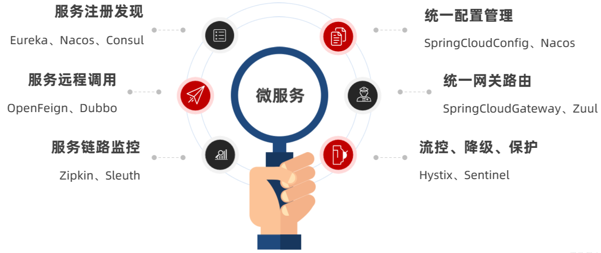

微服务拆分以后碰到的各种问题都有对应的解决方案和微服务组件，而SpringCloud框架可以说是目前Java领域最全面的微服务组件的集合了。

# 服务注册与发现 Nacos

## 注册中心原理

在微服务远程调用的过程中，包括两个角色：
- 服务提供者：提供接口供其它微服务访问，比如item-service
- 服务消费者：调用其它微服务提供的接口，比如cart-service

> 服务的消费者也可以提供服务，服务的提供者也可以消费服务

在大型微服务项目中，服务提供者的数量会非常多，为了管理这些服务就引入了注册中心的概念。注册中心、服务提供者、服务消费者三者间关系如下：

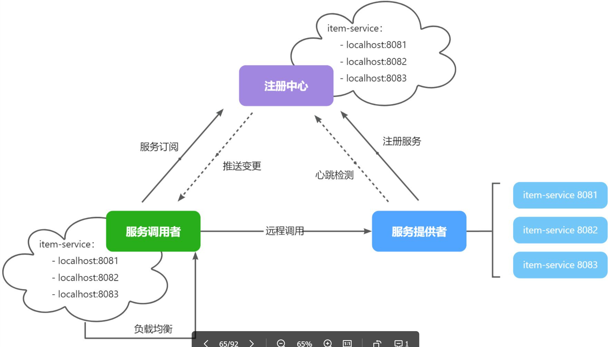

流程如下：
- 服务启动时就会注册自己的服务信息（服务名、IP、端口）到注册中心。
- 调用者可以从注册中心订阅想要的服务，获取服务对应的实例列表（1个服务可能多实例部署）。
- 调用者自己对实例列表负载均衡，挑选一个实例。
- 调用者向该实例发起远程调用。

当服务提供者的实例宕机或者启动新实例时，调用者如何得知呢？
- 当服务有新实例启动时，会发送注册服务请求，其信息会被记录在注册中心的服务实例列表。
- 服务提供者会定期向注册中心发送请求，报告自己的健康状态（心跳请求）。当注册中心长时间收不到提供者的心跳时，会认为该实例宕机，将其从服务的实例列表中剔除。
- 当注册中心服务列表变更时，会主动通知微服务，更新本地服务列表。

## Nacos 注册中心
目前开源的注册中心框架有很多，国内比较常见的有：
- Eureka：Netflix公司出品，目前被集成在SpringCloud当中，一般用于Java应用
- Nacos：Alibaba公司出品，目前被集成在SpringCloudAlibaba中，一般用于Java应用
- Consul：HashiCorp公司出品，目前集成在SpringCloud中，不限制微服务语言

以上几种注册中心都遵循SpringCloud中的API规范，因此在业务开发使用上没有太大差异。由于Nacos是国内产品，中文文档比较丰富，而且同时具备配置管理功能（后面会学习），因此在国内使用较多，课堂中我们会Nacos为例来学习。

官方网站如下：
https://nacos.io/zh-cn/

我们基于Docker来部署Nacos的注册中心，首先我们要准备MySQL数据库表，用来存储Nacos的数据（此案例中，nacos存储数据的数据库由自己创建）。由于是Docker部署，所以大家需要将资料中的SQL文件导入到你Docker中的MySQL容器中：

```sql
-- 案例数据库建库（database：nacos）建表（table：12张表）
-- --------------------------------------------------------
-- 主机:                           192.168.150.101
-- 服务器版本:                        8.0.27 - MySQL Community Server - GPL
-- 服务器操作系统:                      Linux
-- HeidiSQL 版本:                  12.2.0.6576
-- --------------------------------------------------------

/*!40101 SET @OLD_CHARACTER_SET_CLIENT=@@CHARACTER_SET_CLIENT */;
/*!40101 SET NAMES utf8 */;
/*!50503 SET NAMES utf8mb4 */;
/*!40103 SET @OLD_TIME_ZONE=@@TIME_ZONE */;
/*!40103 SET TIME_ZONE='+00:00' */;
/*!40014 SET @OLD_FOREIGN_KEY_CHECKS=@@FOREIGN_KEY_CHECKS, FOREIGN_KEY_CHECKS=0 */;
/*!40101 SET @OLD_SQL_MODE=@@SQL_MODE, SQL_MODE='NO_AUTO_VALUE_ON_ZERO' */;
/*!40111 SET @OLD_SQL_NOTES=@@SQL_NOTES, SQL_NOTES=0 */;


-- 导出 nacos 的数据库结构
DROP DATABASE IF EXISTS `nacos`;
CREATE DATABASE IF NOT EXISTS `nacos` /*!40100 DEFAULT CHARACTER SET utf8mb4 COLLATE utf8mb4_general_ci */ /*!80016 DEFAULT ENCRYPTION='N' */;
USE `nacos`;

-- 导出  表 nacos.config_info 结构
DROP TABLE IF EXISTS `config_info`;
CREATE TABLE IF NOT EXISTS `config_info` (
  `id` bigint NOT NULL AUTO_INCREMENT COMMENT 'id',
  `data_id` varchar(255) COLLATE utf8_bin NOT NULL COMMENT 'data_id',
  `group_id` varchar(128) COLLATE utf8_bin DEFAULT NULL,
  `content` longtext COLLATE utf8_bin NOT NULL COMMENT 'content',
  `md5` varchar(32) COLLATE utf8_bin DEFAULT NULL COMMENT 'md5',
  `gmt_create` datetime NOT NULL DEFAULT CURRENT_TIMESTAMP COMMENT '创建时间',
  `gmt_modified` datetime NOT NULL DEFAULT CURRENT_TIMESTAMP COMMENT '修改时间',
  `src_user` text COLLATE utf8_bin COMMENT 'source user',
  `src_ip` varchar(50) COLLATE utf8_bin DEFAULT NULL COMMENT 'source ip',
  `app_name` varchar(128) COLLATE utf8_bin DEFAULT NULL,
  `tenant_id` varchar(128) COLLATE utf8_bin DEFAULT '' COMMENT '租户字段',
  `c_desc` varchar(256) COLLATE utf8_bin DEFAULT NULL,
  `c_use` varchar(64) COLLATE utf8_bin DEFAULT NULL,
  `effect` varchar(64) COLLATE utf8_bin DEFAULT NULL,
  `type` varchar(64) COLLATE utf8_bin DEFAULT NULL,
  `c_schema` text COLLATE utf8_bin,
  `encrypted_data_key` text COLLATE utf8_bin NOT NULL COMMENT '秘钥',
  PRIMARY KEY (`id`),
  UNIQUE KEY `uk_configinfo_datagrouptenant` (`data_id`,`group_id`,`tenant_id`)
) ENGINE=InnoDB DEFAULT CHARSET=utf8mb3 COLLATE=utf8_bin COMMENT='config_info';

-- 正在导出表  nacos.config_info 的数据：~0 rows (大约)
DELETE FROM `config_info`;

-- 导出  表 nacos.config_info_aggr 结构
DROP TABLE IF EXISTS `config_info_aggr`;
CREATE TABLE IF NOT EXISTS `config_info_aggr` (
  `id` bigint NOT NULL AUTO_INCREMENT COMMENT 'id',
  `data_id` varchar(255) COLLATE utf8_bin NOT NULL COMMENT 'data_id',
  `group_id` varchar(128) COLLATE utf8_bin NOT NULL COMMENT 'group_id',
  `datum_id` varchar(255) COLLATE utf8_bin NOT NULL COMMENT 'datum_id',
  `content` longtext COLLATE utf8_bin NOT NULL COMMENT '内容',
  `gmt_modified` datetime NOT NULL COMMENT '修改时间',
  `app_name` varchar(128) COLLATE utf8_bin DEFAULT NULL,
  `tenant_id` varchar(128) COLLATE utf8_bin DEFAULT '' COMMENT '租户字段',
  PRIMARY KEY (`id`),
  UNIQUE KEY `uk_configinfoaggr_datagrouptenantdatum` (`data_id`,`group_id`,`tenant_id`,`datum_id`)
) ENGINE=InnoDB DEFAULT CHARSET=utf8mb3 COLLATE=utf8_bin COMMENT='增加租户字段';

-- 正在导出表  nacos.config_info_aggr 的数据：~0 rows (大约)
DELETE FROM `config_info_aggr`;

-- 导出  表 nacos.config_info_beta 结构
DROP TABLE IF EXISTS `config_info_beta`;
CREATE TABLE IF NOT EXISTS `config_info_beta` (
  `id` bigint NOT NULL AUTO_INCREMENT COMMENT 'id',
  `data_id` varchar(255) COLLATE utf8_bin NOT NULL COMMENT 'data_id',
  `group_id` varchar(128) COLLATE utf8_bin NOT NULL COMMENT 'group_id',
  `app_name` varchar(128) COLLATE utf8_bin DEFAULT NULL COMMENT 'app_name',
  `content` longtext COLLATE utf8_bin NOT NULL COMMENT 'content',
  `beta_ips` varchar(1024) COLLATE utf8_bin DEFAULT NULL COMMENT 'betaIps',
  `md5` varchar(32) COLLATE utf8_bin DEFAULT NULL COMMENT 'md5',
  `gmt_create` datetime NOT NULL DEFAULT CURRENT_TIMESTAMP COMMENT '创建时间',
  `gmt_modified` datetime NOT NULL DEFAULT CURRENT_TIMESTAMP COMMENT '修改时间',
  `src_user` text COLLATE utf8_bin COMMENT 'source user',
  `src_ip` varchar(50) COLLATE utf8_bin DEFAULT NULL COMMENT 'source ip',
  `tenant_id` varchar(128) COLLATE utf8_bin DEFAULT '' COMMENT '租户字段',
  `encrypted_data_key` text COLLATE utf8_bin NOT NULL COMMENT '秘钥',
  PRIMARY KEY (`id`),
  UNIQUE KEY `uk_configinfobeta_datagrouptenant` (`data_id`,`group_id`,`tenant_id`)
) ENGINE=InnoDB DEFAULT CHARSET=utf8mb3 COLLATE=utf8_bin COMMENT='config_info_beta';

-- 正在导出表  nacos.config_info_beta 的数据：~0 rows (大约)
DELETE FROM `config_info_beta`;

-- 导出  表 nacos.config_info_tag 结构
DROP TABLE IF EXISTS `config_info_tag`;
CREATE TABLE IF NOT EXISTS `config_info_tag` (
  `id` bigint NOT NULL AUTO_INCREMENT COMMENT 'id',
  `data_id` varchar(255) COLLATE utf8_bin NOT NULL COMMENT 'data_id',
  `group_id` varchar(128) COLLATE utf8_bin NOT NULL COMMENT 'group_id',
  `tenant_id` varchar(128) COLLATE utf8_bin DEFAULT '' COMMENT 'tenant_id',
  `tag_id` varchar(128) COLLATE utf8_bin NOT NULL COMMENT 'tag_id',
  `app_name` varchar(128) COLLATE utf8_bin DEFAULT NULL COMMENT 'app_name',
  `content` longtext COLLATE utf8_bin NOT NULL COMMENT 'content',
  `md5` varchar(32) COLLATE utf8_bin DEFAULT NULL COMMENT 'md5',
  `gmt_create` datetime NOT NULL DEFAULT CURRENT_TIMESTAMP COMMENT '创建时间',
  `gmt_modified` datetime NOT NULL DEFAULT CURRENT_TIMESTAMP COMMENT '修改时间',
  `src_user` text COLLATE utf8_bin COMMENT 'source user',
  `src_ip` varchar(50) COLLATE utf8_bin DEFAULT NULL COMMENT 'source ip',
  PRIMARY KEY (`id`),
  UNIQUE KEY `uk_configinfotag_datagrouptenanttag` (`data_id`,`group_id`,`tenant_id`,`tag_id`)
) ENGINE=InnoDB DEFAULT CHARSET=utf8mb3 COLLATE=utf8_bin COMMENT='config_info_tag';

-- 正在导出表  nacos.config_info_tag 的数据：~0 rows (大约)
DELETE FROM `config_info_tag`;

-- 导出  表 nacos.config_tags_relation 结构
DROP TABLE IF EXISTS `config_tags_relation`;
CREATE TABLE IF NOT EXISTS `config_tags_relation` (
  `id` bigint NOT NULL COMMENT 'id',
  `tag_name` varchar(128) COLLATE utf8_bin NOT NULL COMMENT 'tag_name',
  `tag_type` varchar(64) COLLATE utf8_bin DEFAULT NULL COMMENT 'tag_type',
  `data_id` varchar(255) COLLATE utf8_bin NOT NULL COMMENT 'data_id',
  `group_id` varchar(128) COLLATE utf8_bin NOT NULL COMMENT 'group_id',
  `tenant_id` varchar(128) COLLATE utf8_bin DEFAULT '' COMMENT 'tenant_id',
  `nid` bigint NOT NULL AUTO_INCREMENT,
  PRIMARY KEY (`nid`),
  UNIQUE KEY `uk_configtagrelation_configidtag` (`id`,`tag_name`,`tag_type`),
  KEY `idx_tenant_id` (`tenant_id`)
) ENGINE=InnoDB DEFAULT CHARSET=utf8mb3 COLLATE=utf8_bin COMMENT='config_tag_relation';

-- 正在导出表  nacos.config_tags_relation 的数据：~0 rows (大约)
DELETE FROM `config_tags_relation`;

-- 导出  表 nacos.group_capacity 结构
DROP TABLE IF EXISTS `group_capacity`;
CREATE TABLE IF NOT EXISTS `group_capacity` (
  `id` bigint unsigned NOT NULL AUTO_INCREMENT COMMENT '主键ID',
  `group_id` varchar(128) COLLATE utf8_bin NOT NULL DEFAULT '' COMMENT 'Group ID，空字符表示整个集群',
  `quota` int unsigned NOT NULL DEFAULT '0' COMMENT '配额，0表示使用默认值',
  `usage` int unsigned NOT NULL DEFAULT '0' COMMENT '使用量',
  `max_size` int unsigned NOT NULL DEFAULT '0' COMMENT '单个配置大小上限，单位为字节，0表示使用默认值',
  `max_aggr_count` int unsigned NOT NULL DEFAULT '0' COMMENT '聚合子配置最大个数，，0表示使用默认值',
  `max_aggr_size` int unsigned NOT NULL DEFAULT '0' COMMENT '单个聚合数据的子配置大小上限，单位为字节，0表示使用默认值',
  `max_history_count` int unsigned NOT NULL DEFAULT '0' COMMENT '最大变更历史数量',
  `gmt_create` datetime NOT NULL DEFAULT CURRENT_TIMESTAMP COMMENT '创建时间',
  `gmt_modified` datetime NOT NULL DEFAULT CURRENT_TIMESTAMP COMMENT '修改时间',
  PRIMARY KEY (`id`),
  UNIQUE KEY `uk_group_id` (`group_id`)
) ENGINE=InnoDB DEFAULT CHARSET=utf8mb3 COLLATE=utf8_bin COMMENT='集群、各Group容量信息表';

-- 正在导出表  nacos.group_capacity 的数据：~0 rows (大约)
DELETE FROM `group_capacity`;

-- 导出  表 nacos.his_config_info 结构
DROP TABLE IF EXISTS `his_config_info`;
CREATE TABLE IF NOT EXISTS `his_config_info` (
  `id` bigint unsigned NOT NULL,
  `nid` bigint unsigned NOT NULL AUTO_INCREMENT,
  `data_id` varchar(255) COLLATE utf8_bin NOT NULL,
  `group_id` varchar(128) COLLATE utf8_bin NOT NULL,
  `app_name` varchar(128) COLLATE utf8_bin DEFAULT NULL COMMENT 'app_name',
  `content` longtext COLLATE utf8_bin NOT NULL,
  `md5` varchar(32) COLLATE utf8_bin DEFAULT NULL,
  `gmt_create` datetime NOT NULL DEFAULT CURRENT_TIMESTAMP,
  `gmt_modified` datetime NOT NULL DEFAULT CURRENT_TIMESTAMP,
  `src_user` text COLLATE utf8_bin,
  `src_ip` varchar(50) COLLATE utf8_bin DEFAULT NULL,
  `op_type` char(10) COLLATE utf8_bin DEFAULT NULL,
  `tenant_id` varchar(128) COLLATE utf8_bin DEFAULT '' COMMENT '租户字段',
  `encrypted_data_key` text COLLATE utf8_bin NOT NULL COMMENT '秘钥',
  PRIMARY KEY (`nid`),
  KEY `idx_gmt_create` (`gmt_create`),
  KEY `idx_gmt_modified` (`gmt_modified`),
  KEY `idx_did` (`data_id`)
) ENGINE=InnoDB DEFAULT CHARSET=utf8mb3 COLLATE=utf8_bin COMMENT='多租户改造';

-- 正在导出表  nacos.his_config_info 的数据：~0 rows (大约)
DELETE FROM `his_config_info`;

-- 导出  表 nacos.permissions 结构
DROP TABLE IF EXISTS `permissions`;
CREATE TABLE IF NOT EXISTS `permissions` (
  `role` varchar(50) COLLATE utf8mb4_general_ci NOT NULL,
  `resource` varchar(255) COLLATE utf8mb4_general_ci NOT NULL,
  `action` varchar(8) COLLATE utf8mb4_general_ci NOT NULL,
  UNIQUE KEY `uk_role_permission` (`role`,`resource`,`action`) USING BTREE
) ENGINE=InnoDB DEFAULT CHARSET=utf8mb4 COLLATE=utf8mb4_general_ci;

-- 正在导出表  nacos.permissions 的数据：~0 rows (大约)
DELETE FROM `permissions`;

-- 导出  表 nacos.roles 结构
DROP TABLE IF EXISTS `roles`;
CREATE TABLE IF NOT EXISTS `roles` (
  `username` varchar(50) COLLATE utf8mb4_general_ci NOT NULL,
  `role` varchar(50) COLLATE utf8mb4_general_ci NOT NULL,
  UNIQUE KEY `idx_user_role` (`username`,`role`) USING BTREE
) ENGINE=InnoDB DEFAULT CHARSET=utf8mb4 COLLATE=utf8mb4_general_ci;

-- 正在导出表  nacos.roles 的数据：~1 rows (大约)
DELETE FROM `roles`;
INSERT INTO `roles` (`username`, `role`) VALUES
	('nacos', 'ROLE_ADMIN');

-- 导出  表 nacos.tenant_capacity 结构
DROP TABLE IF EXISTS `tenant_capacity`;
CREATE TABLE IF NOT EXISTS `tenant_capacity` (
  `id` bigint unsigned NOT NULL AUTO_INCREMENT COMMENT '主键ID',
  `tenant_id` varchar(128) COLLATE utf8_bin NOT NULL DEFAULT '' COMMENT 'Tenant ID',
  `quota` int unsigned NOT NULL DEFAULT '0' COMMENT '配额，0表示使用默认值',
  `usage` int unsigned NOT NULL DEFAULT '0' COMMENT '使用量',
  `max_size` int unsigned NOT NULL DEFAULT '0' COMMENT '单个配置大小上限，单位为字节，0表示使用默认值',
  `max_aggr_count` int unsigned NOT NULL DEFAULT '0' COMMENT '聚合子配置最大个数',
  `max_aggr_size` int unsigned NOT NULL DEFAULT '0' COMMENT '单个聚合数据的子配置大小上限，单位为字节，0表示使用默认值',
  `max_history_count` int unsigned NOT NULL DEFAULT '0' COMMENT '最大变更历史数量',
  `gmt_create` datetime NOT NULL DEFAULT CURRENT_TIMESTAMP COMMENT '创建时间',
  `gmt_modified` datetime NOT NULL DEFAULT CURRENT_TIMESTAMP COMMENT '修改时间',
  PRIMARY KEY (`id`),
  UNIQUE KEY `uk_tenant_id` (`tenant_id`)
) ENGINE=InnoDB DEFAULT CHARSET=utf8mb3 COLLATE=utf8_bin COMMENT='租户容量信息表';

-- 正在导出表  nacos.tenant_capacity 的数据：~0 rows (大约)
DELETE FROM `tenant_capacity`;

-- 导出  表 nacos.tenant_info 结构
DROP TABLE IF EXISTS `tenant_info`;
CREATE TABLE IF NOT EXISTS `tenant_info` (
  `id` bigint NOT NULL AUTO_INCREMENT COMMENT 'id',
  `kp` varchar(128) COLLATE utf8_bin NOT NULL COMMENT 'kp',
  `tenant_id` varchar(128) COLLATE utf8_bin DEFAULT '' COMMENT 'tenant_id',
  `tenant_name` varchar(128) COLLATE utf8_bin DEFAULT '' COMMENT 'tenant_name',
  `tenant_desc` varchar(256) COLLATE utf8_bin DEFAULT NULL COMMENT 'tenant_desc',
  `create_source` varchar(32) COLLATE utf8_bin DEFAULT NULL COMMENT 'create_source',
  `gmt_create` bigint NOT NULL COMMENT '创建时间',
  `gmt_modified` bigint NOT NULL COMMENT '修改时间',
  PRIMARY KEY (`id`),
  UNIQUE KEY `uk_tenant_info_kptenantid` (`kp`,`tenant_id`),
  KEY `idx_tenant_id` (`tenant_id`)
) ENGINE=InnoDB DEFAULT CHARSET=utf8mb3 COLLATE=utf8_bin COMMENT='tenant_info';

-- 正在导出表  nacos.tenant_info 的数据：~0 rows (大约)
DELETE FROM `tenant_info`;

-- 导出  表 nacos.users 结构
DROP TABLE IF EXISTS `users`;
CREATE TABLE IF NOT EXISTS `users` (
  `username` varchar(50) COLLATE utf8mb4_general_ci NOT NULL,
  `password` varchar(500) COLLATE utf8mb4_general_ci NOT NULL,
  `enabled` tinyint(1) NOT NULL,
  PRIMARY KEY (`username`)
) ENGINE=InnoDB DEFAULT CHARSET=utf8mb4 COLLATE=utf8mb4_general_ci;

-- 正在导出表  nacos.users 的数据：~1 rows (大约)
DELETE FROM `users`;
INSERT INTO `users` (`username`, `password`, `enabled`) VALUES
	('nacos', '$2a$10$EuWPZHzz32dJN7jexM34MOeYirDdFAZm2kuWj7VEOJhhZkDrxfvUu', 1);

/*!40103 SET TIME_ZONE=IFNULL(@OLD_TIME_ZONE, 'system') */;
/*!40101 SET SQL_MODE=IFNULL(@OLD_SQL_MODE, '') */;
/*!40014 SET FOREIGN_KEY_CHECKS=IFNULL(@OLD_FOREIGN_KEY_CHECKS, 1) */;
/*!40101 SET CHARACTER_SET_CLIENT=@OLD_CHARACTER_SET_CLIENT */;
/*!40111 SET SQL_NOTES=IFNULL(@OLD_SQL_NOTES, 1) */;
```

docker 挂载 linux 本地文件的路径和配置 `/root/nacos/custom.env` ：

```txt
PREFER_HOST_MODE=hostname
MODE=standalone
SPRING_DATASOURCE_PLATFORM=mysql
MYSQL_SERVICE_HOST=192.168.150.101
MYSQL_SERVICE_DB_NAME=nacos
MYSQL_SERVICE_PORT=3306
MYSQL_SERVICE_USER=root
MYSQL_SERVICE_PASSWORD=123
MYSQL_SERVICE_DB_PARAM=characterEncoding=utf8&connectTimeout=1000&socketTimeout=3000&autoReconnect=true&useSSL=false&allowPublicKeyRetrieval=true&serverTimezone=Asia/Shanghai
```

上传 linux 完成后，进入root目录，然后执行下面的docker命令：

```bash
docker run -d \
    --name nacos \
    --env-file ./nacos/custom.env \
    -p 8848:8848 \
    -p 9848:9848 \
    -p 9849:9849 \
    --restart=always \
    nacos/nacos-server:v2.1.0-slim
```

启动完成后，访问下面地址：http://192.168.150.101:8848/nacos/，注意将192.168.150.101替换为你自己的虚拟机IP地址。
首次访问会跳转到登录页，账号密码都是nacos。

> 注意：这里有一个坑点，如果虚拟机网络环境改变，需要删除容器修改 custom.env 中的 MYSQL_SERVICE_HOST 配置为新 ip 地址。否则登录 nacos 控制台会显示账号或密码错误。

## 服务注册

接下来，我们把item-service注册到Nacos，步骤如下：
- 引入依赖
- 配置Nacos地址
- 重启

**1.添加依赖**

在item-service的pom.xml中添加依赖：

```xml
<!--nacos 服务注册发现-->
<dependency>
    <groupId>com.alibaba.cloud</groupId>
    <artifactId>spring-cloud-starter-alibaba-nacos-discovery</artifactId>
</dependency>
```

**2.配置Nacos**

在item-service的application.yml中添加nacos地址配置：

```yaml
spring:
  application:
    name: item-service # 服务名称
  cloud:
    nacos:
      server-addr: 192.168.150.101:8848 # nacos地址
```
> 2026/01/01 补充：
>
> 完整配置参考（服务注册 bootstrap.yml）：
> 
> ```yaml
> spring:
>   application:
>     name: item-service # 微服务名称
>   // 省略 ...
>   cloud:
>     nacos:
>       discovery:
>         enabled: true # 启用服务发现
>         group: DEFAULT_GROUP # 所属组
>         namespace: xiaohashu # 命名空间
>         server-addr: 127.0.0.1:8848 # 指定 Nacos 配置中心的服务器地址
> ```
> 
> bootstrap 方式还需引入依赖：
> 
> ```xml
> <dependency>
>     <groupId>org.springframework.cloud</groupId>
>     <artifactId>spring-cloud-starter-bootstrap</artifactId>
> </dependency>
> ```

**3.测试启动多服务实例**

为了测试一个服务多个实例的情况，我们再配置一个item-service的部署实例：

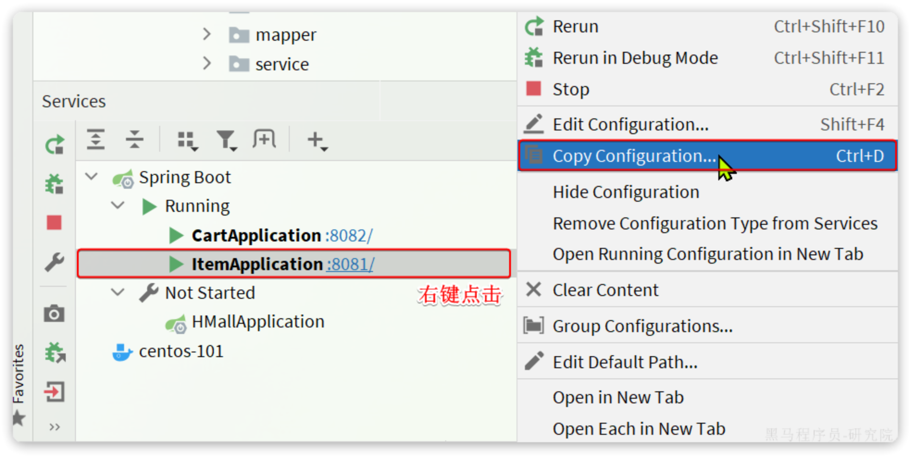

然后配置启动项，注意重命名并且配置新的端口，避免冲突：

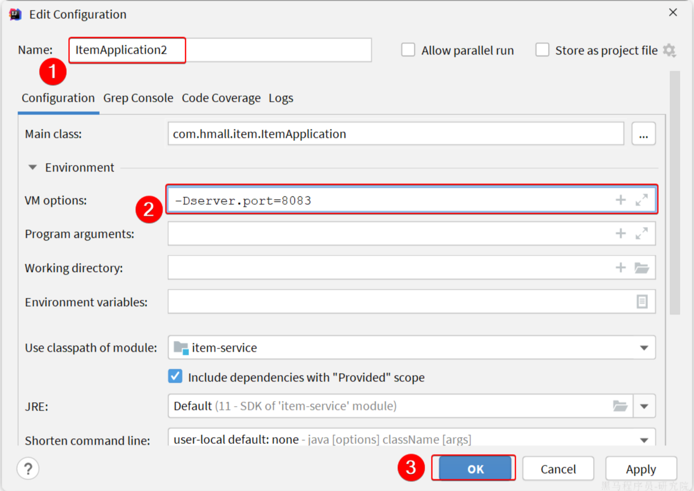

重启item-service的两个实例,访问nacos控制台（http://192.168.150.101:8848/nacos/），可以发现服务注册成功：

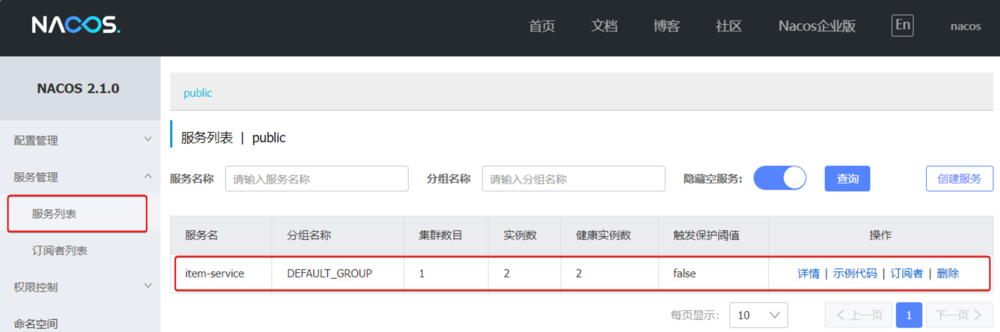

## 服务发现

服务的消费者要去nacos订阅服务，这个过程就是服务发现，步骤如下：
- 引入依赖
- 配置Nacos地址
- 发现并调用服务

**1.引入依赖**

服务发现除了要引入nacos依赖以外，由于还需要负载均衡，因此要引入SpringCloud提供的LoadBalancer依赖。
我们在cart-service中的pom.xml中添加下面的依赖：

```xml
<!--nacos 服务注册发现-->
<dependency>
    <groupId>com.alibaba.cloud</groupId>
    <artifactId>spring-cloud-starter-alibaba-nacos-discovery</artifactId>
</dependency>
```

可以发现，这里Nacos的依赖于服务注册时一致，这个依赖中同时包含了服务注册和发现的功能。因为任何一个微服务都可以调用别人，也可以被别人调用，即可以是调用者，也可以是提供者。
因此，等一会儿cart-service启动，同样会注册到Nacos。

**2.配置Nacos地址**

在cart-service的application.yml中添加nacos地址配置：

```yaml
spring:
  cloud:
    nacos:
      server-addr: 192.168.150.101:8848
```

接下来，服务调用者cart-service就可以去订阅item-service服务了。不过item-service有多个实例，而真正发起调用时只需要知道一个实例的地址。
因此，服务调用者必须利用负载均衡的算法，从多个实例中挑选一个去访问。常见的负载均衡算法有：
- 随机
- 轮询
- IP的hash
- 最近最少访问
- ...

主要使用 SpringCloud 已经帮我们自动装配的服务发现工具 DiscoveryClient 。
传统方式比较繁杂演示略。

# 远程调用 OpenFeign

远程调用的关键点就在于四个：
- 请求方式
- 请求路径
- 请求参数
- 返回值类型

所以，OpenFeign就利用SpringMVC的相关注解来声明上述4个参数，然后基于动态代理帮我们生成远程调用的代码，而无需我们手动再编写，非常方便。

## 快速入门

我们还是以cart-service中的查询我的购物车为例。因此下面的操作都是在cart-service中进行。

**1.引入依赖**

在cart-service服务的pom.xml中引入OpenFeign的依赖和loadBalancer依赖：

```xml
<!--openFeign-->
<dependency>
    <groupId>org.springframework.cloud</groupId>
    <artifactId>spring-cloud-starter-openfeign</artifactId>
</dependency>
<!--负载均衡器-->
<dependency>
    <groupId>org.springframework.cloud</groupId>
    <artifactId>spring-cloud-starter-loadbalancer</artifactId>
</dependency>

<!--nacos 服务注册发现 服务消费者也必须注册服务，注册参照此文档服务注册-->
<dependency>
    <groupId>com.alibaba.cloud</groupId>
    <artifactId>spring-cloud-starter-alibaba-nacos-discovery</artifactId>
</dependency>
```

**2.启用OpenFeign**

接下来，我们在cart-service的CartApplication启动类上添加注解，启动OpenFeign功能：

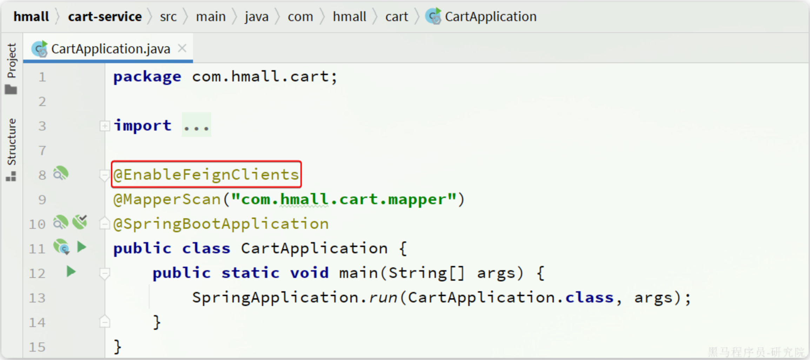

**3.编写OpenFeign客户端**

在cart-service中，定义一个新的接口，编写Feign客户端：
其中代码如下：

```java
package com.hmall.cart.client;

import com.hmall.cart.domain.dto.ItemDTO;
import org.springframework.cloud.openfeign.FeignClient;
import org.springframework.web.bind.annotation.GetMapping;
import org.springframework.web.bind.annotation.RequestParam;

import java.util.List;

@FeignClient("item-service")
public interface ItemClient {

    @GetMapping("/items")
    List<ItemDTO> queryItemByIds(@RequestParam("ids") Collection<Long> ids);
}
```

这里只需要声明接口，无需实现方法。接口中的几个关键信息：
- @FeignClient("item-service") ：声明服务名称
- @GetMapping ：声明请求方式
- @GetMapping("/items") ：声明请求路径
- @RequestParam("ids") Collection<Long> ids ：声明请求参数
- List<ItemDTO> ：返回值类型

有了上述信息，OpenFeign就可以利用动态代理帮我们实现这个方法，并且向http://item-service/items 发送一个GET请求，携带ids为请求参数，并自动将返回值处理为List<ItemDTO>。
我们只需要直接调用这个方法，即可实现远程调用了。

**4.使用FeignClient**

最后，我们在cart-service的com.hmall.cart.service.impl.CartServiceImpl中改造代码，直接调用ItemClient的方法：

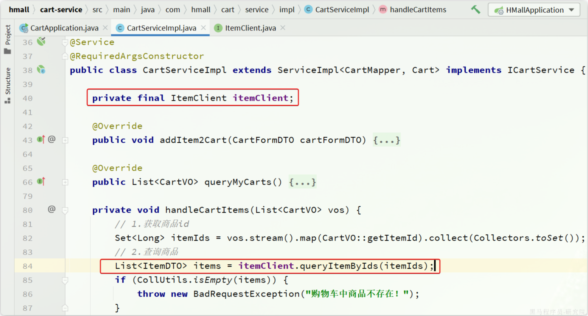

feign替我们完成了服务拉取、负载均衡、发送http请求的所有工作，是不是看起来优雅多了。

## Feign Form

feign-form 是一个 Feign 扩展库，专门用于处理表单数据的编码。它提供了一些增强功能，使 Feign 客户端能够更方便地处理表单提交和文件上传等操作。

**1.引入扩展依赖**

```xml
 <!-- Feign 表单提交 -->
<dependency>
    <groupId>io.github.openfeign.form</groupId>
    <artifactId>feign-form-spring</artifactId>
</dependency>
<dependency>
    <groupId>io.github.openfeign.form</groupId>
    <artifactId>feign-form</artifactId>
</dependency>
```

**2.编写配置类**

SpringFormEncoder 是 Feign 提供的一个编码器，用于处理表单提交。它将对象编码为表单数据格式（如 application/x-www-form-urlencoded 或 multipart/form-data），以便在 HTTP 请求中使用。
创建 /config 包，并新建一个 FeignFormConfig 表单配置类，代码如下：

```java
import feign.codec.Encoder;
import feign.form.spring.SpringFormEncoder;
import org.springframework.context.annotation.Bean;
import org.springframework.context.annotation.Configuration;

@Configuration
public class FeignFormConfig {
    @Bean
    public Encoder feignFormEncoder() {
        return new SpringFormEncoder();
    }
}
```

**3.配置**

接下来，要让 feign form 生效，还需要配置这个类。局部生效即可：

```java
@FeignClient(name = ApiConstants.SERVICE_NAME, configuration = FeignFormConfig.class)
public interface FileFeignApi {

    String PREFIX = "/file";

    /**
     * 文件上传
     *
     * @param file
     * @return
     */
    @PostMapping(value = PREFIX + "/upload", consumes = MediaType.MULTIPART_FORM_DATA_VALUE)
    Response<?> uploadFile(@RequestPart(value = "file") MultipartFile file);
}
```

## 连接池

Feign底层发起http请求，依赖于其它的框架。其底层支持的http客户端实现包括：
- HttpURLConnection：默认实现，不支持连接池
- Apache HttpClient ：支持连接池
- OKHttp：支持连接池

因此我们通常会使用带有连接池的客户端来代替默认的HttpURLConnection。比如，我们使用 OK Http 。

**1.引入依赖**

在cart-service的pom.xml中引入依赖：

```xml
<!--OK http 的依赖 -->
<dependency>
<groupId>io.github.openfeign</groupId>
<artifactId>feign-okhttp</artifactId>
</dependency>
```

**2.开启连接池**

在cart-service的application.yml配置文件中开启Feign的连接池功能：

```yaml
feign:
  okhttp:
      enabled: true # 开启OKHttp功能
```

## 最佳实践
如果别的微服务如 trade-service 使用到了 Item 的 Feign 客户端，我们就需要在trade-service中再次定义ItemClient接口，这不是重复编码吗？ 有什么办法能加避免重复编码呢？

避免重复编码的办法就是抽取。不过这里有两种抽取思路：
- 思路1：抽取到微服务之外的公共module（推荐）
- 思路2：每个微服务自己抽取一个module

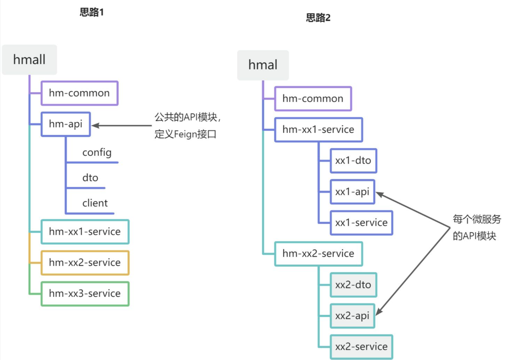

方案1抽取更加简单，工程结构也比较清晰，但缺点是整个项目耦合度偏高。
方案2抽取相对麻烦，工程结构相对更复杂，但服务之间耦合度降低。推荐使用此方案。

## 日志配置

OpenFeign只会在FeignClient所在包的日志级别为DEBUG时，才会输出日志。而且其日志级别有4级：
- NONE：不记录任何日志信息，这是默认值。
- BASIC：仅记录请求的方法，URL以及响应状态码和执行时间
- HEADERS：在BASIC的基础上，额外记录了请求和响应的头信息
- FULL：记录所有请求和响应的明细，包括头信息、请求体、元数据。
Feign默认的日志级别就是NONE，所以默认我们看不到请求日志。

**1.定义日志级别**

在hm-api模块下新建一个配置类，定义Feign的日志级别：


代码如下：

```java
package com.hmall.api.config;

import feign.Logger;
import org.springframework.context.annotation.Bean;

public class DefaultFeignConfig {
    @Bean
    public Logger.Level feignLogLevel(){
        return Logger.Level.FULL;
    }
}
```

**2.配置**

接下来，要让日志级别生效，还需要配置这个类。有两种方式：
- 局部生效：在某个FeignClient中配置，只对当前FeignClient生效
```java
@FeignClient(value = "item-service", configuration = DefaultFeignConfig.class)
```

- 全局生效：在@EnableFeignClients中配置，针对所有FeignClient生效。
```java
@EnableFeignClients(defaultConfiguration = DefaultFeignConfig.class)
```

# 网关路由 SpringCloudGateway

由于每个微服务都有不同的地址或端口，入口不同，相信大家在与前端联调的时候发现了一些问题：
- 请求不同数据时要访问不同的入口，需要维护多个入口地址，麻烦
- 前端无法调用nacos，无法实时更新服务列表

单体架构时我们只需要完成一次用户登录、身份校验，就可以在所有业务中获取到用户信息。而微服务拆分后，每个微服务都独立部署，这就存在一些问题：
- 每个微服务都需要编写登录校验、用户信息获取的功能吗？
- 当微服务之间调用时，该如何传递用户信息？

通过今天的学习你将掌握下列能力：
- 会利用微服务网关做请求路由
- 会利用微服务网关做登录身份校验
- 会利用Nacos实现统一配置管理
- 会利用Nacos实现配置热更新

什么是网关？

顾明思议，网关就是网络的关口。数据在网络间传输，从一个网络传输到另一网络时就需要经过网关来做数据的路由和转发以及数据安全的校验。
更通俗的来讲，网关就像是以前园区传达室的大爷。
- 外面的人要想进入园区，必须经过大爷的认可，如果你是不怀好意的人，肯定被直接拦截。
- 外面的人要传话或送信，要找大爷。大爷帮你带给目标人。

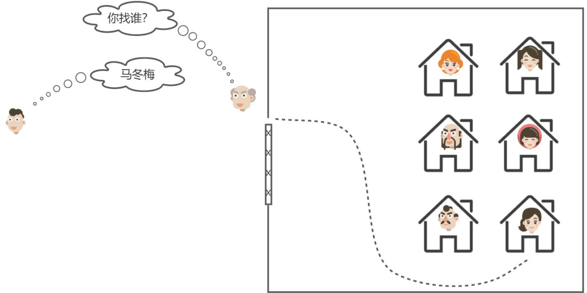

现在，微服务网关就起到同样的作用。前端请求不能直接访问微服务，而是要请求网关：
- 网关可以做安全控制，也就是登录身份校验，校验通过才放行
- 通过认证后，网关再根据请求判断应该访问哪个微服务，将请求转发过去

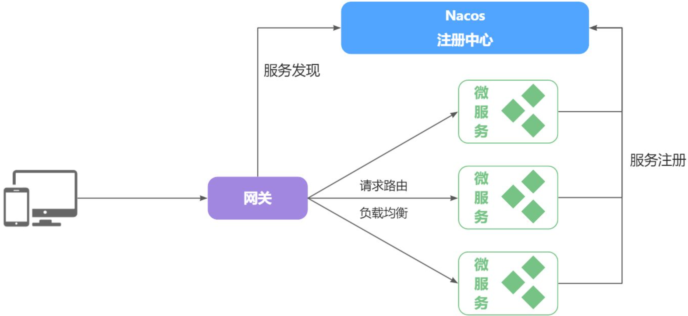

在SpringCloud当中，提供了两种网关实现方案：
- ~~Netflix Zuul：早期实现，目前已经淘汰~~
- SpringCloudGateway：基于Spring的WebFlux技术，完全支持响应式编程，吞吐能力更强

## 快速入门

接下来，我们先看下如何利用网关实现请求路由。由于网关本身也是一个独立的微服务，因此也需要创建一个模块开发功能。大概步骤如下：
- 创建网关微服务
- 引入SpringCloudGateway、NacosDiscovery依赖
- 编写启动类
- 配置网关路由

**1.创建项目引入依赖**

首先，我们要在hmall下创建一个新的module，命名为hm-gateway，作为网关微服务。

在hm-gateway模块的pom.xml文件中引入依赖：

```xml
<dependencies>
    <dependency>
        <groupId>org.springframework.cloud</groupId>
        <artifactId>spring-cloud-starter-bootstrap</artifactId>
    </dependency>
    <!--网关-->
    <dependency>
        <groupId>org.springframework.cloud</groupId>
        <artifactId>spring-cloud-starter-gateway</artifactId>
    </dependency>
    <!--nacos discovery-->
    <dependency>
        <groupId>com.alibaba.cloud</groupId>
        <artifactId>spring-cloud-starter-alibaba-nacos-discovery</artifactId>
    </dependency>
    <!--负载均衡-->
    <dependency>
        <groupId>org.springframework.cloud</groupId>
        <artifactId>spring-cloud-starter-loadbalancer</artifactId>
    </dependency>
</dependencies>
```

**2.启动类**

在hm-gateway模块的com.hmall.gateway包下新建一个启动类：

```java
package com.hmall.gateway;

import org.springframework.boot.SpringApplication;
import org.springframework.boot.autoconfigure.SpringBootApplication;

@SpringBootApplication
public class GatewayApplication {
    public static void main(String[] args) {
        SpringApplication.run(GatewayApplication.class, args);
    }
}
```

**3.配置路由**

接下来，在hm-gateway模块的resources目录新建一个application.yaml文件，内容如下：

```yaml
server:
  port: 8080
spring:
  application:
    name: gateway
  cloud:
    nacos:
      server-addr: 192.168.150.101:8848
    gateway:
      routes:
        - id: item # 路由规则id，自定义，唯一
          uri: lb://item-service # 路由的目标服务，lb代表负载均衡，会从注册中心拉取服务列表
          predicates: # 路由断言，判断当前请求是否符合当前规则，符合则路由到目标服务
            - Path=/items/**,/search/** # 这里是以请求路径作为判断规则
        - id: cart
          uri: lb://cart-service
          predicates:
            - Path=/carts/**
        - id: user
          uri: lb://user-service
          predicates:
            - Path=/users/**,/addresses/**
        - id: trade
          uri: lb://trade-service
          predicates:
            - Path=/orders/**
        - id: pay
          uri: lb://pay-service
          predicates:
            - Path=/pay-orders/**
```

**4.测试**

启动GatewayApplication，以 http://localhost:8080 拼接微服务接口路径来测试。例如：
http://localhost:8080/items/page?pageNo=1&pageSize=1

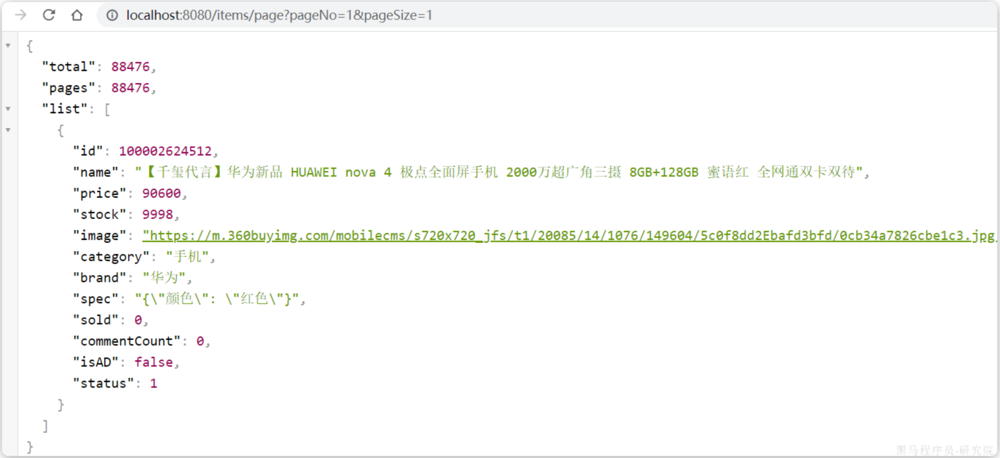

此时，启动UserApplication、CartApplication，然后打开前端页面，发现相关功能都可以正常访问了。

## 路由过滤

路由规则的定义语法如下：

```yaml
spring:
  cloud:
    gateway:
      routes:
        - id: item
          uri: lb://item-service
          predicates:
            - Path=/items/**,/search/**
```

routes 属性含义如下：
- id：路由的唯一标示
- predicates：路由断言，其实就是匹配条件
- uri：路由目标地址，lb://代表负载均衡，从注册中心获取目标微服务的实例列表，并且负载均衡选择一个访问。
- filters：路由过滤条件，后面讲

这里我们重点关注predicates，也就是路由断言。SpringCloudGateway中支持的断言类型有很多：

| 名称        | 说明                           | 示例                                                                                                  |
|-------------|--------------------------------|-------------------------------------------------------------------------------------------------------|
| After       | 是某个时间点后的请求           | `After=2037-01-20T17:42:47.789-07:00[America/Denver]`                                                 |
| Before      | 是某个时间点之前的请求         | `Before=2031-04-13T15:14:47.433+08:00[Asia/Shanghai]`                                                 |
| Between     | 是某两个时间点之前的请求       | `Between=2037-01-20T17:42:47.789-07:00[America/Denver],2037-01-21T17:42:47.789-07:00[America/Denver]` |
| Cookie      | 请求必须包含某些 cookie        | `Cookie=chocolate, ch.p`                                                                              |
| Header      | 请求必须包含某些 header        | `Header=X-Request-Id, \d+`                                                                            |
| Host        | 请求必须是访问某个 host（域名）| `Host=**.somehost.org, **.anotherhost.org`                                                            |
| Method      | 请求方式必须是指定方式         | `Method=GET,POST`                                                                                     |
| Path        | 请求路径必须符合指定规则       | `Path=/red/{segment},/blue/**`                                                                        |
| Query       | 请求参数必须包含指定参数       | `Query=name` 或 `Query=name, Jack`                                                                    |
| RemoteAddr  | 请求者的 IP 必须在指定范围     | `RemoteAddr=192.168.1.1/24`                                                                           |
| weight      | 权重处理                       | —                                                                                                     |

## 网关登录校验

单体架构时我们只需要完成一次用户登录、身份校验，就可以在所有业务中获取到用户信息。而微服务拆分后，每个微服务都独立部署，不再共享数据。也就意味着每个微服务都需要做登录校验，这显然不可取。

### 鉴权思路分析

我们的登录是基于JWT来实现的，校验JWT的算法复杂，而且需要用到秘钥。如果每个微服务都去做登录校验，这就存在着两大问题：
- 每个微服务都需要知道JWT的秘钥，不安全
- 每个微服务重复编写登录校验代码、权限校验代码，麻烦

既然网关是所有微服务的入口，一切请求都需要先经过网关。我们完全可以把登录校验的工作放到网关去做，这样之前说的问题就解决了：
- 只需要在网关和用户服务保存秘钥
- 只需要在网关开发登录校验功能

此时，登录校验的流程如图：


不过，这里存在几个问题：
- 网关路由是配置的，请求转发是Gateway内部代码，我们如何在转发之前做登录校验？
- 网关校验JWT之后，如何将用户信息传递给微服务？
- 微服务之间也会相互调用，这种调用不经过网关，又该如何传递用户信息？

### 网关过滤器

网关中提供了33种路由过滤器，每种过滤器都有独特的作用：

| 名称                   | 说明                         | 示例                                                                                   |
|------------------------|------------------------------|----------------------------------------------------------------------------------------|
| AddRequestHeader       | 给当前请求添加一个请求头     | `AddRequestHeader=headerName,headerValue`                                              |
| RemoveRequestHeader    | 移除请求中的一个请求头       | `RemoveRequestHeader=headerName`                                                       |
| AddResponseHeader      | 给响应结果中添加一个响应头   | `AddResponseHeader=headerName,headerValue`                                             |
| RemoveResponseHeader   | 从响应结果中移除一个响应头   | `RemoveResponseHeader=headerName`                                                      |
| RewritePath            | 请求路径重写                 | `RewritePath=/red/?(?<segment>.*), /$\{segment}`                                       |
| StripPrefix            | 去除请求路径中的 N 段前缀    | `StripPrefix=1`（例如路径 `/a/b` 转发时只保留 `/b`）                                   |
| ...                    | …                            | …                                                                                      |

登录校验必须在请求转发到微服务之前做，否则就失去了意义。而网关的请求转发是Gateway内部代码实现的，要想在请求转发之前做登录校验，就必须了解Gateway内部工作的基本原理。

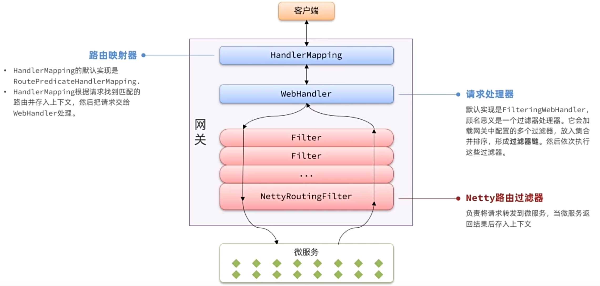

如图所示：
1. 客户端请求进入网关后由HandlerMapping对请求做判断，找到与当前请求匹配的路由规则（Route），然后将请求交给WebHandler去处理。
2. WebHandler则会加载当前路由下需要执行的过滤器链（Filter chain），然后按照顺序逐一执行过滤器（后面称为Filter）。
3. 图中Filter被虚线分为左右两部分，是因为Filter内部的逻辑分为pre和post两部分，分别会在请求路由到微服务之前和之后被执行。
4. 只有所有Filter的pre逻辑都依次顺序执行通过后，请求才会被路由到微服务。
5. 微服务返回结果后，再倒序执行Filter的post逻辑。
6. 最终把响应结果返回。

如图中所示，最终请求转发是有一个名为NettyRoutingFilter的过滤器来执行的，而且这个过滤器是整个过滤器链中顺序最靠后的一个。如果我们能够定义一个过滤器，在其中实现登录校验逻辑，并且将过滤器执行顺序定义到NettyRoutingFilter之前，这就符合我们的需求了！

那么，该如何实现一个网关过滤器呢？
网关过滤器链中的过滤器有两种：
- GatewayFilter：路由过滤器，作用于任意指定路由；默认不生效，要配置到路由后生效。
- GlobalFilter：全局过滤器，作用范围是所有路由；声明后自动生效。

> 注意：过滤器链之外还有一种过滤器，HttpHeadersFilter，用来处理传递到下游微服务的请求头。例如org.springframework.cloud.gateway.filter.headers.XForwardedHeadersFilter可以传递代理请求原本的host头到下游微服务

其实GatewayFilter和GlobalFilter这两种过滤器的方法签名完全一致：

```java
/**
 * 处理请求并将其传递给下一个过滤器
 * @param exchange 当前请求的上下文，其中包含request、response等各种数据
 * @param chain 过滤器链，基于它向下传递请求
 * @return 根据返回值标记当前请求是否被完成或拦截，chain.filter(exchange)就放行了。
 */
Mono<Void> filter(ServerWebExchange exchange, GatewayFilterChain chain);
```

FilteringWebHandler在处理请求时，会将GlobalFilter装饰为GatewayFilter，然后放到同一个过滤器链中，排序以后依次执行。

Gateway内置的GatewayFilter过滤器使用起来非常简单，无需编码，只要在yaml文件中简单配置即可。而且其作用范围也很灵活，配置在哪个Route下，就作用于哪个Route.
例如，有一个过滤器叫做AddRequestHeaderGatewayFilterFacotry，顾明思议，就是添加请求头的过滤器，可以给请求添加一个请求头并传递到下游微服务。
使用只需要在application.yaml中这样配置：

```yaml
spring:
  cloud:
    gateway:
      routes:
        - id: test_route
          uri: lb://test-service
          predicates:
            -Path=/test/**
          filters:
            - AddRequestHeader=key, value # 逗号之前是请求头的key，逗号之后是value
```

如果想要让过滤器作用于所有的路由，则可以这样配置：

```yaml
spring:
  cloud:
    gateway:
      default-filters: # default-filters下的过滤器可以作用于所有路由
        - AddRequestHeader=key, value
      routes:
        - id: test_route
          uri: lb://test-service
          predicates:
            -Path=/test/**
```

### 自定义过滤器

无论是GatewayFilter还是GlobalFilter都支持自定义，只不过编码方式、使用方式略有差别。

**1.自定义GatewayFilter**

自定义GatewayFilter不是直接实现GatewayFilter，而是实现AbstractGatewayFilterFactory。最简单的方式是这样的：

```java
@Component
public class PrintAnyGatewayFilterFactory extends AbstractGatewayFilterFactory<Object> {
    @Override
    public GatewayFilter apply(Object config) {
        return new GatewayFilter() {
            @Override
            public Mono<Void> filter(ServerWebExchange exchange, GatewayFilterChain chain) {
                // 获取请求
                ServerHttpRequest request = exchange.getRequest();
                // 编写过滤器逻辑
                System.out.println("过滤器执行了");
                // 放行
                return chain.filter(exchange);
            }
        };
    }
}
```

> 注意：该类的名称一定要以GatewayFilterFactory为后缀！

然后在yaml配置中这样使用：

```yaml
spring:
  cloud:
    gateway:
      default-filters:
        - PrintAny # 此处直接以自定义的GatewayFilterFactory类名称前缀类声明过滤器
```

> 这种过滤器还可以支持动态配置参数，不过实现起来比较复杂。

**2.自定义GlobalFilter**

自定义GlobalFilter则简单很多，直接实现GlobalFilter即可，而且也无法设置动态参数：

```java
@Component
public class PrintAnyGlobalFilter implements GlobalFilter, Ordered {
    @Override
    public Mono<Void> filter(ServerWebExchange exchange, GatewayFilterChain chain) {
        // 编写过滤器逻辑
        System.out.println("未登录，无法访问");
        // 放行
        // return chain.filter(exchange);

        // 拦截
        ServerHttpResponse response = exchange.getResponse();
        response.setRawStatusCode(401);
        return response.setComplete();
    }

    @Override
    public int getOrder() {
        // 过滤器执行顺序，值越小，优先级越高
        return 0;
    }
}
```

### 登录校验

登录校验需要用到JWT，而且JWT的加密需要秘钥和加密工具。这些在hm-service中已经有了，我们直接拷贝过来：

具体作用如下：
- AuthProperties：配置登录校验需要拦截的路径，因为不是所有的路径都需要登录才能访问
- JwtProperties：定义与JWT工具有关的属性，比如秘钥文件位置
- SecurityConfig：工具的自动装配
- JwtTool：JWT工具，其中包含了校验和解析token的功能
- hmall.jks：秘钥文件

其中AuthProperties和JwtProperties所需的属性要在application.yaml中配置：

```yaml
hm:
  jwt:
    location: classpath:hmall.jks # 秘钥地址
    alias: hmall # 秘钥别名
    password: hmall123 # 秘钥文件密码
    tokenTTL: 30m # 登录有效期
  auth:
    excludePaths: # 无需登录校验的路径
      - /search/**
      - /users/login
      - /items/**
```

接下来，我们定义一个登录校验的过滤器：

```java
@Component
@RequiredArgsConstructor
@EnableConfigurationProperties(AuthProperties.class)
public class AuthGlobalFilter implements GlobalFilter, Ordered {

    private final JwtTool jwtTool;

    private final AuthProperties authProperties;

    private final AntPathMatcher antPathMatcher = new AntPathMatcher();

    @Override
    public Mono<Void> filter(ServerWebExchange exchange, GatewayFilterChain chain) {
        // 1.获取Request
        ServerHttpRequest request = exchange.getRequest();
        // 2.判断是否不需要拦截
        if(isExclude(request.getPath().toString())){
            // 无需拦截，直接放行
            return chain.filter(exchange);
        }
        // 3.获取请求头中的token
        String token = null;
        List<String> headers = request.getHeaders().get("authorization");
        if (!CollUtils.isEmpty(headers)) {
            token = headers.get(0);
        }
        // 4.校验并解析token
        Long userId = null;
        try {
            userId = jwtTool.parseToken(token);
        } catch (UnauthorizedException e) {
            // 如果无效，拦截
            ServerHttpResponse response = exchange.getResponse();
            response.setRawStatusCode(401);
            return response.setComplete();
        }

        // TODO 5.如果有效，传递用户信息
        System.out.println("userId = " + userId);
        // 6.放行
        return chain.filter(exchange);
    }

    private boolean isExclude(String antPath) {
        for (String pathPattern : authProperties.getExcludePaths()) {
            if(antPathMatcher.match(pathPattern, antPath)){
                return true;
            }
        }
        return false;
    }

    @Override
    public int getOrder() {
        return 0;
    }
}
```

### 微服务获取用户

现在，网关已经可以完成登录校验并获取登录用户身份信息。但是当网关将请求转发到微服务时，微服务又该如何获取用户身份呢？

由于网关发送请求到微服务依然采用的是Http请求，因此我们可以将用户信息以请求头的方式传递到下游微服务。然后微服务可以从请求头中获取登录用户信息。考虑到微服务内部可能很多地方都需要用到登录用户信息，因此我们可以利用SpringMVC的拦截器来实现登录用户信息获取，并存入ThreadLocal，方便后续使用。

据图流程图如下：

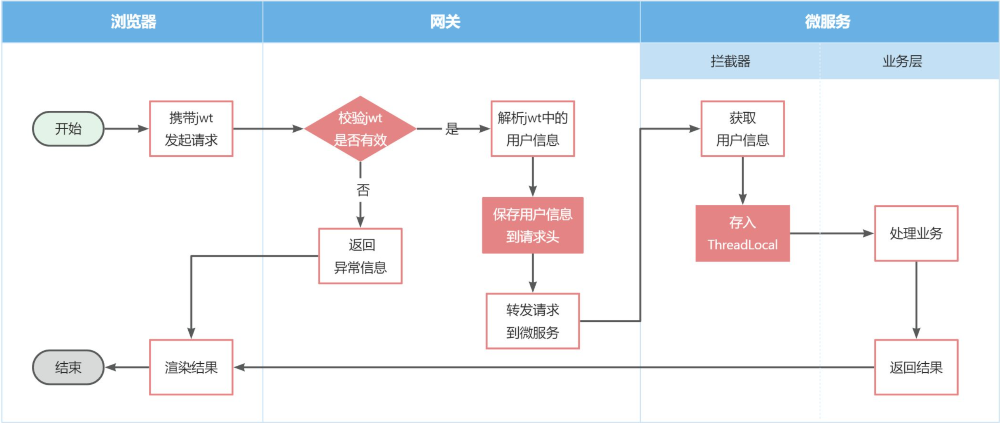

因此，接下来我们要做的事情有：
- 改造网关过滤器，在获取用户信息后保存到请求头，转发到下游微服务
- 编写微服务拦截器，拦截请求获取用户信息，保存到ThreadLocal后放行

**1.保存用户到请求头**

首先，我们修改登录校验拦截器的处理逻辑，保存用户信息到请求头中：

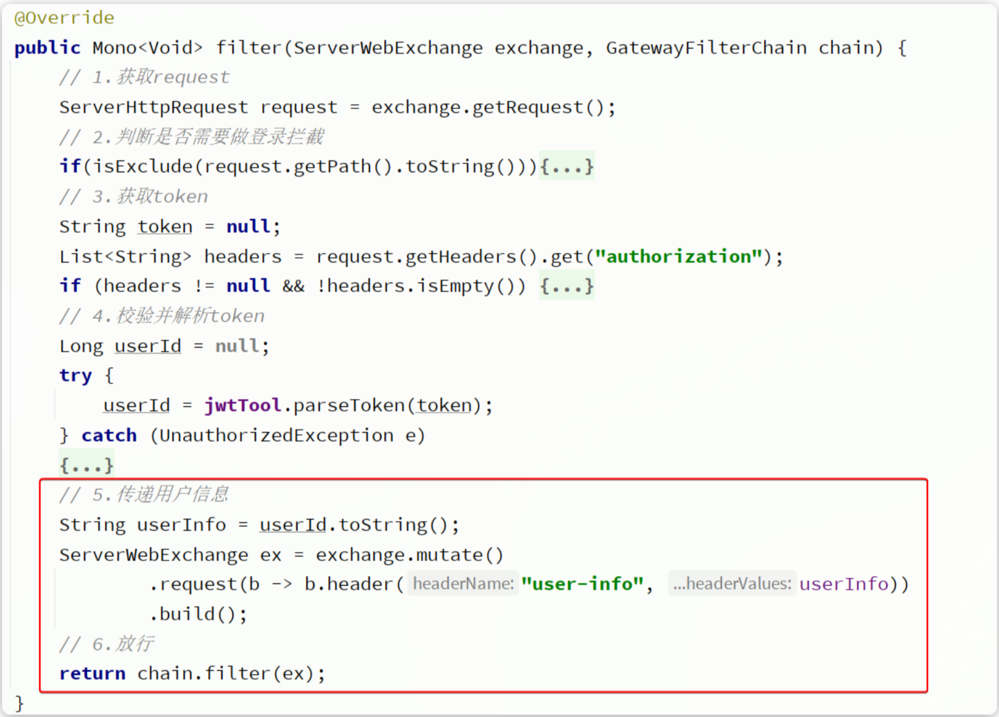

**2.拦截器获取用户**

由于每个微服务都有获取登录用户的需求，因此拦截器我们直接写在hm-common中，并写好自动装配。这样微服务只需要引入hm-common就可以直接具备拦截器功能，无需重复编写。

我们在hm-common模块下定义一个拦截器：

```java
public class UserInfoInterceptor implements HandlerInterceptor {
    @Override
    public boolean preHandle(HttpServletRequest request, HttpServletResponse response, Object handler) throws Exception {
        // 1.获取请求头中的用户信息
        String userInfo = request.getHeader("user-info");
        // 2.判断是否为空
        if (StrUtil.isNotBlank(userInfo)) {
            // 不为空，保存到ThreadLocal
            UserContext.setUser(Long.valueOf(userInfo));
        }
        // 3.放行
        return true;
    }

    @Override
    public void afterCompletion(HttpServletRequest request, HttpServletResponse response, Object handler, Exception ex) throws Exception {
        // 移除用户
        UserContext.removeUser();
    }
}
```

接着在hm-common模块下编写SpringMVC的配置类，配置登录拦截器：

```java
@Configuration
@ConditionalOnClass(DispatcherServlet.class)
public class MvcConfig implements WebMvcConfigurer {
    @Override
    public void addInterceptors(InterceptorRegistry registry) {
        registry.addInterceptor(new UserInfoInterceptor());
    }
}
```

不过，需要注意的是，这个配置类默认是**不会生效**的，因为它所在的包是com.hmall.common.config，与其它微服务的扫描包不一致，无法被扫描到，因此无法生效。
基于SpringBoot的自动装配原理，我们要将其添加到resources目录下的META-INF/spring.factories文件中：

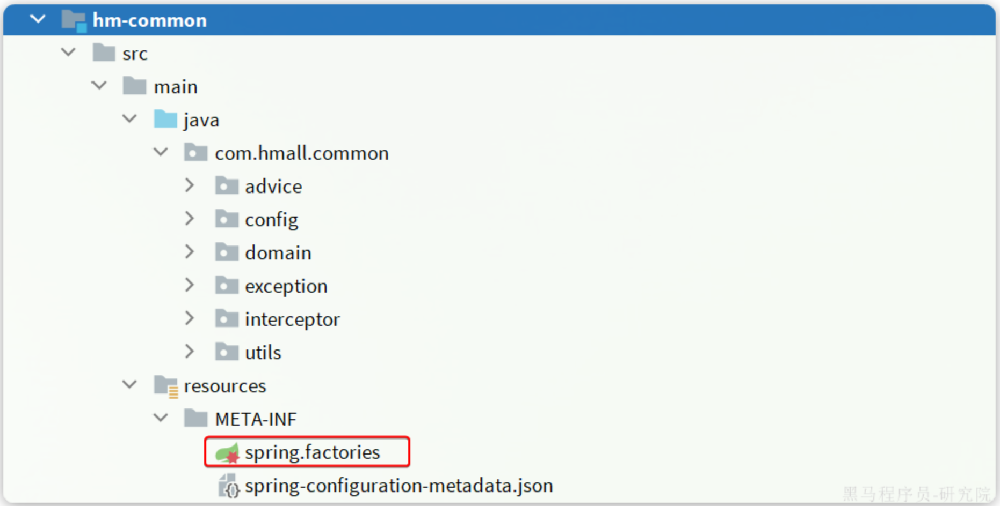

内容如下：

```text
org.springframework.boot.autoconfigure.EnableAutoConfiguration=\
  com.hmall.common.config.MyBatisConfig,\
  com.hmall.common.config.MvcConfig
```

这样就完成了为所有微服务拦截并保存用户信息的操作了。

### OpenFeign传递用户

前端发起的请求都会经过网关再到微服务，由于我们之前编写的过滤器和拦截器功能，微服务可以轻松获取登录用户信息。
但有些业务是比较复杂的，请求到达微服务后还需要调用其它多个微服务。比如下单业务，流程如下：


下单的过程中，需要调用商品服务扣减库存，调用购物车服务清理用户购物车。而清理购物车时必须知道当前登录的用户身份。但是，订单服务调用购物车时并没有传递用户信息，购物车服务无法知道当前用户是谁。

由于微服务获取用户信息是通过拦截器在请求头中读取，因此要想实现微服务之间的用户信息传递，就必须在微服务发起调用时把用户信息存入请求头。

微服务之间调用是基于OpenFeign来实现的，并不是我们自己发送的请求。我们如何才能让每一个由OpenFeign发起的请求自动携带登录用户信息呢？
这里要借助Feign中提供的一个拦截器接口：feign.RequestInterceptor

```java
public interface RequestInterceptor {
  /**
   * Called for every request. 
   * Add data using methods on the supplied {@link RequestTemplate}.
   */
  void apply(RequestTemplate template);
}
```

我们只需要实现这个接口，然后实现apply方法，利用RequestTemplate类来添加请求头，将用户信息保存到请求头中。这样以来，每次OpenFeign发起请求的时候都会调用该方法，传递用户信息。

由于FeignClient全部都是在hm-api模块，因此我们在hm-api模块的com.hmall.api.config.DefaultFeignConfig中编写这个拦截器：

在com.hmall.api.config.DefaultFeignConfig中添加一个Bean：

```java
@Bean
public RequestInterceptor userInfoRequestInterceptor(){
    return new RequestInterceptor() {
        @Override
        public void apply(RequestTemplate template) {
            // 获取登录用户
            Long userId = UserContext.getUser();
            if(userId == null) {
                // 如果为空则直接跳过
                return;
            }
            // 如果不为空则放入请求头中，传递给下游微服务
            template.header("user-info", userId.toString());
        }
    };
}
```

现在微服务之间通过OpenFeign调用时也会传递登录用户信息了。

> 2026/01/12 补充：
> 
> 该操作一般放在自定义的 starter 中所有微服务共享。应包含依赖：
> 
> ```xml
> <dependency>
>     <groupId>io.github.openfeign</groupId>
>     <artifactId>feign-core</artifactId>
> </dependency>
> ```
> 
> ```java
> @Slf4j
> public class FeignRequestInterceptor implements RequestInterceptor {
>     @Override
>     public void apply(RequestTemplate requestTemplate) {
>         // 获取当前上下文中的用户 ID
>         Long userId = LoginUserContextHolder.getUserId();
> 
>         // 若不为空，则添加到请求头中
>         if (Objects.nonNull(userId)) {
>             requestTemplate.header(GlobalConstants.USER_ID, String.valueOf(userId));
>             log.info("########## feign 请求设置请求头 userId: {}", userId);
>         }
>     }
> }
> ```

## 网关自定义全局异常

在网关服务中创建一个 /exception 异常包，用于统一放置异常相关的代码。然后，创建 GlobalExceptionHandler 全局异常处理器，代码如下：

```java
@Component
@Slf4j
public class GlobalExceptionHandler implements ErrorWebExceptionHandler {

    @Resource
    private ObjectMapper objectMapper;

    @Override
    public Mono<Void> handle(ServerWebExchange exchange, Throwable ex) {
        // 获取响应对象
        ServerHttpResponse response = exchange.getResponse();

        log.error("==> 全局异常捕获: ", ex);

        // 响参
        Response<?> result = null;
        // 根据捕获的异常类型，设置不同的响应状态码和响应消息
        /*
        if (ex instanceof SaTokenException) { // Sa-Token 异常
            // 权限认证失败时，设置 401 状态码
            response.setStatusCode(HttpStatus.UNAUTHORIZED);
            // 构建响应结果
            result = Response.fail(ResponseCodeEnum.UNAUTHORIZED.getErrorCode(), ResponseCodeEnum.UNAUTHORIZED.getErrorMessage());
        } else { // 其他异常，则统一提示 “系统繁忙” 错误
            result = Response.fail(ResponseCodeEnum.SYSTEM_ERROR);
        }
        */

        // 设置响应头的内容类型为 application/json;charset=UTF-8，表示响应体为 JSON 格式
        response.getHeaders().setContentType(MediaType.APPLICATION_JSON_UTF8);
        // 设置 body 响应体
        return response.writeWith(Mono.fromSupplier(() -> { // 使用 Mono.fromSupplier 创建响应体
            DataBufferFactory bufferFactory = response.bufferFactory();
            try {
                // 使用 ObjectMapper 将 result 对象转换为 JSON 字节数组
                return bufferFactory.wrap(objectMapper.writeValueAsBytes(result));
            } catch (Exception e) {
                // 如果转换过程中出现异常，则返回空字节数组
                return bufferFactory.wrap(new byte[0]);
            }
        }));
    }
}
```

> 其中：Response 为自定义的返回类型，通常自定义为包含响应信息、响应状态码、数据。

和 Spring Boot 中使用 @ControllerAdvice 注解，来定义全局异常捕获器不同。在网关中，你需要创建 ErrorWebExceptionHandler 的实现类，并将其注入到 Spring 容器中。

在 handle() 异常处理方法中，对方法的入参 ex 异常进行类型判断，从而设置不同的响应状态码和响应消息：
如果异常类型为 SaTokenException，则设置 401 状态码，并构建响应结果；
其他异常，则统一提示 “系统繁忙” 错误。

设置响应头的内容类型为 application/json;charset=UTF-8，表示响应体为 JSON 格式；设置 body 响应体，并返回响参。

# 配置管理

到目前为止我们已经解决了微服务相关的几个问题：
- 微服务远程调用
- 微服务注册、发现
- 微服务请求路由、负载均衡
- 微服务登录用户信息传递

不过，现在依然还有几个问题需要解决：
- 网关路由在配置文件中写死了，如果变更必须重启微服务
- 某些业务配置在配置文件中写死了，每次修改都要重启服务
- 每个微服务都有很多重复的配置，维护成本高

这些问题都可以通过统一的配置管理器服务解决。而Nacos不仅仅具备注册中心功能，也具备配置管理的功能：

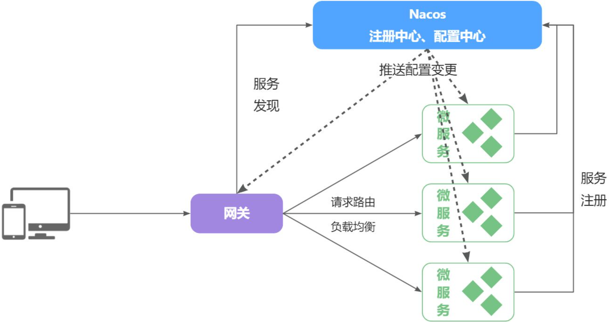

微服务共享的配置可以统一交给Nacos保存和管理，在Nacos控制台修改配置后，Nacos会将配置变更推送给相关的微服务，并且无需重启即可生效，实现配置热更新。
网关的路由同样是配置，因此同样可以基于这个功能实现动态路由功能，无需重启网关即可修改路由配置。

## 配置共享

我们可以把微服务共享的配置抽取到Nacos中统一管理，这样就不需要每个微服务都重复配置了。分为两步：
- 在Nacos中添加共享配置
- 微服务拉取配置

**1.添加共享配置**

以cart-service为例，我们看看有哪些配置是重复的，可以抽取的分别是：jdbc配置、日志配置和swagger和OpenFeign的配置。

我们在nacos控制台分别添加这些配置。
首先是jdbc相关配置，在配置管理->配置列表中点击+新建一个配置：

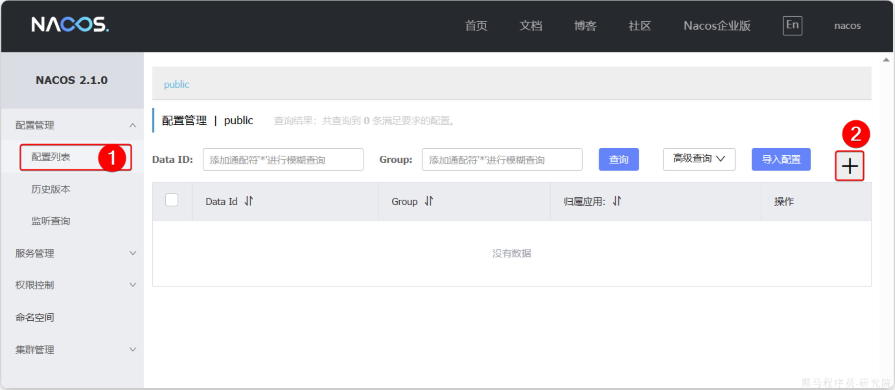

在弹出的表单中填写信息：

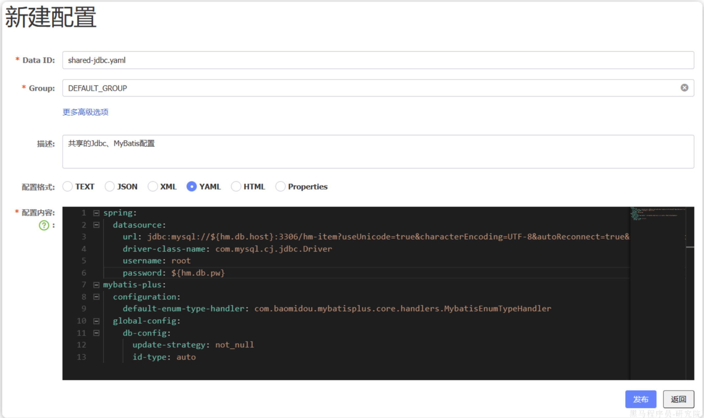

其中详细的配置如下：

```yaml
spring:
  datasource:
    url: jdbc:mysql://${hm.db.host:192.168.150.101}:${hm.db.port:3306}/${hm.db.database}?useUnicode=true&characterEncoding=UTF-8&autoReconnect=true&serverTimezone=Asia/Shanghai
    driver-class-name: com.mysql.cj.jdbc.Driver
    username: ${hm.db.un:root}
    password: ${hm.db.pw:123}
mybatis-plus:
  configuration:
    default-enum-type-handler: com.baomidou.mybatisplus.core.handlers.MybatisEnumTypeHandler
  global-config:
    db-config:
      update-strategy: not_null
      id-type: auto
```

注意这里的jdbc的相关参数并没有写死，例如：
- 数据库ip：通过\${hm.db.host:192.168.150.101}配置了默认值为192.168.150.101，同时允许通过\${hm.db.host}来覆盖默认值
- 数据库端口：通过\${hm.db.port:3306}配置了默认值为3306，同时允许通过\${hm.db.port}来覆盖默认值
- 数据库database：可以通过\${hm.db.database}来设定，无默认值

然后是统一的日志配置，命名为shared-log.yaml，配置内容如下：

```yaml
logging:
  level:
    com.hmall: debug
  pattern:
    dateformat: HH:mm:ss:SSS
  file:
    path: "logs/${spring.application.name}"
```

然后是统一的swagger配置，命名为shared-swagger.yaml，配置内容如下：

```yaml
knife4j:
  enable: true
  openapi:
    title: ${hm.swagger.title:黑马商城接口文档}
    description: ${hm.swagger.description:黑马商城接口文档}
    email: ${hm.swagger.email:zhanghuyi@itcast.cn}
    concat: ${hm.swagger.concat:虎哥}
    url: https://www.itcast.cn
    version: v1.0.0
    group:
      default:
        group-name: default
        api-rule: package
        api-rule-resources:
          - ${hm.swagger.package}
```

注意，这里的swagger相关配置我们没有写死，例如：
- title：接口文档标题，我们用了\${hm.swagger.title}来代替，将来可以有用户手动指定
- email：联系人邮箱，我们用了\${hm.swagger.email:zhanghuyi@itcast.cn}，默认值是zhanghuyi@itcast.cn，同时允许用户利用\${hm.swagger.email}来覆盖。

**2.拉取共享配置**

接下来，我们要在微服务拉取共享配置。将拉取到的共享配置与本地的application.yaml配置合并，完成项目上下文的初始化。
不过，需要注意的是，读取Nacos配置是SpringCloud上下文（ApplicationContext）初始化时处理的，发生在项目的引导阶段。然后才会初始化SpringBoot上下文，去读取application.yaml。
也就是说引导阶段，application.yaml文件尚未读取，根本不知道nacos 地址，该如何去加载nacos中的配置文件呢？

SpringCloud在初始化上下文的时候会先读取一个名为bootstrap.yaml(或者bootstrap.properties)的文件，如果我们将nacos地址配置到bootstrap.yaml中，那么在项目引导阶段就可以读取nacos中的配置了。

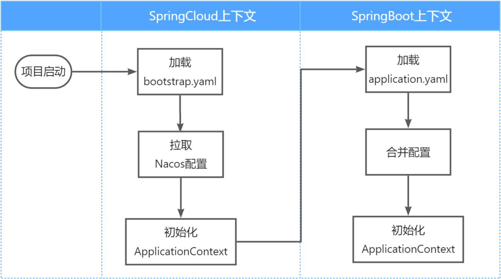

因此，微服务整合Nacos配置管理的步骤如下：

1）引入依赖：
在cart-service模块引入依赖：

```xml
<!--nacos配置管理-->
<dependency>
    <groupId>com.alibaba.cloud</groupId>
    <artifactId>spring-cloud-starter-alibaba-nacos-config</artifactId>
</dependency>
<!--读取bootstrap文件-->
<dependency>
    <groupId>org.springframework.cloud</groupId>
    <artifactId>spring-cloud-starter-bootstrap</artifactId>
</dependency>
```

2）新建bootstrap.yaml
在cart-service中的resources目录新建一个bootstrap.yaml文件。

内容如下：

```yaml
spring:
  application:
    name: cart-service # 服务名称
  profiles:
    active: dev
  cloud:
    nacos:
      server-addr: 192.168.150.101 # nacos地址
      config:
        file-extension: yaml # 文件后缀名
        shared-configs: # 共享配置
          - dataId: shared-jdbc.yaml # 共享mybatis配置
          - dataId: shared-log.yaml # 共享日志配置
          - dataId: shared-swagger.yaml # 共享日志配置
```

3）修改application.yaml
由于一些配置挪到了bootstrap.yaml，因此application.yaml需要修改为：

```yaml
server:
  port: 8082
feign:
  okhttp:
    enabled: true # 开启OKHttp连接池支持
hm:
  swagger:
    title: 购物车服务接口文档
    package: com.hmall.cart.controller
  db:
    database: hm-cart
```

重启服务，发现所有配置都生效了。

## 配置热更新

**创建配置**

进入 Nacos 管理后台，创建配置。浏览器访问： http://localhost:8848/nacos ， 进入到 Nacos 控制台，如下图所示，点击创建配置按钮：


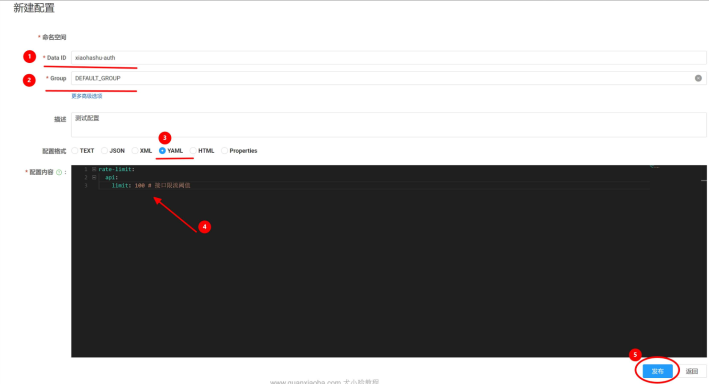

注意 Data ID 格式：

```text
[服务名]-[spring.active.profile].[后缀名]
```

文件名称由三部分组成：

- 服务名：xiaohashu-auth
- spring.active.profile：就是spring boot中的spring.active.profile，可以省略，则所有profile共享该配置
- 后缀名：例如yaml

这里我们直接使用xiaohashu-auth.yaml这个名称，则不管是dev还是local环境都可以共享该配置。

### 微服务项目

**添加依赖**

nacos-config-spring-boot-starter 依赖，来整合的 Nacos，此方式适合单体项目。在微服务项目中，推荐使用 spring-cloud-starter-alibaba-nacos-config依赖，编辑认证服务的 pom.xml 文件，添加依赖如下：

```xml
<dependency>
    <groupId>com.alibaba.cloud</groupId>
    <artifactId>spring-cloud-starter-alibaba-nacos-config</artifactId>
</dependency>

<dependency>
    <groupId>org.springframework.cloud</groupId>
    <artifactId>spring-cloud-starter-bootstrap</artifactId>
</dependency>
```

**添加 Nacos 配置项**

创建 bootstrap.yml 文件：

```yaml
spring:
  application:
    name: xiaohashu-auth # 应用名称
  profiles:
    active: dev # 默认激活 dev 本地开发环境
  cloud:
    nacos:
      config:
        server-addr: http://127.0.0.1:8848 # 指定 Nacos 配置中心的服务器地址
        prefix: ${spring.application.name} # 配置 Data Id 前缀，这里使用应用名称作为前缀
        group: DEFAULT_GROUP # 所属组
        namespace: public # 命名空间
        file-extension: yaml # 配置文件格式
        refresh-enabled: true # 是否开启动态刷新
```

prefix : 配置中心的配置 Data Id 前缀，这里使用应用名称作为前缀，实际监听 Nacos 中的配置时，还会带上环境 profile 的值，比如激活的是 dev 环境，则实际监听的是 Data Id 为 xiaohashu-auth-dev.yaml 的配置，小伙伴们在 Nacos 后台命名配置 Data Id 的时候，名称需要保持一致，否则会监听不到对应配置。

**添加 @RefreshScope 注解**

为了能够让 AlarmConfig 配置类实时监听到 Nacos 中的配置，并注入不同的 Bean 实现类。还需要在类、方法上配置 @RefreshScope 注解，代码如下：

```java
@Configuration
@RefreshScope
public class AlarmConfig {

    @Value("${alarm.type}")
    private String alarmType;

    @Bean
    @RefreshScope
    public AlarmInterface mailAlarmHelper() {
        // 根据配置文件中的告警类型，初始化选择不同的告警实现类
        if (StringUtils.equals("sms", alarmType)) {
            return new SmsAlarmHelper();
        } else if (StringUtils.equals("mail", alarmType)) {
            return new MailAlarmHelper();
        } else {
            throw new IllegalArgumentException("错误的告警类型...");
        }
    }
}
```

@RefreshScope 注解是 Spring Cloud 提供的一个注解，用于实现配置动态刷新功能。当配置中心的配置发生变化时，标注了 @RefreshScope 的 Bean 会重新加载最新的配置，而无需重启应用。

在 Nacos 配置中心的场景下，@RefreshScope 的主要功能包括：

- 动态刷新配置：当 Nacos 配置中心的配置发生变化时，应用中的配置会自动更新，避免了手动重启应用的繁琐过程。
- 重新加载 Bean：标注了 @RefreshScope 的 Bean 会在配置变化后重新加载，确保 Bean 使用最新的配置。
- 与 Spring Cloud 集成：@RefreshScope 与 Spring Cloud 的配置管理机制紧密集成，能够无缝地处理配置更新事件。

**创建 Nacos 配置**

登录到 Nacos 管理后台中，点击创建配置按钮。配置相关配置项，如下图所示，配置完成后，点击发布按钮：


一切准备就绪后，在 TestController 接口中，新增一个 /alarm 测试接口，代码如下：

```java
@Resource
private AlarmInterface alarm;

@GetMapping("/alarm")
public String sendAlarm() {
    alarm.send("系统出错啦，犬小哈这个月绩效没了，速度上线解决问题！");
    return "alarm success";
}
```

**重启项目**

项目重启后，在 nacos 改变配置即可动态加载 bean 。

### 单体项目（了解）

**添加依赖**

然后，添加 Nacos 配置需要使用的依赖：

```xml
<!-- Nacos 配置中心 -->
<dependency>
    <groupId>com.alibaba.boot</groupId>
    <artifactId>nacos-config-spring-boot-starter</artifactId>
</dependency>
```

**项目配置 Nacos**

依赖添加完毕后，编辑 applicaiton.yml 文件，准备添加 Nacos 相关配置：

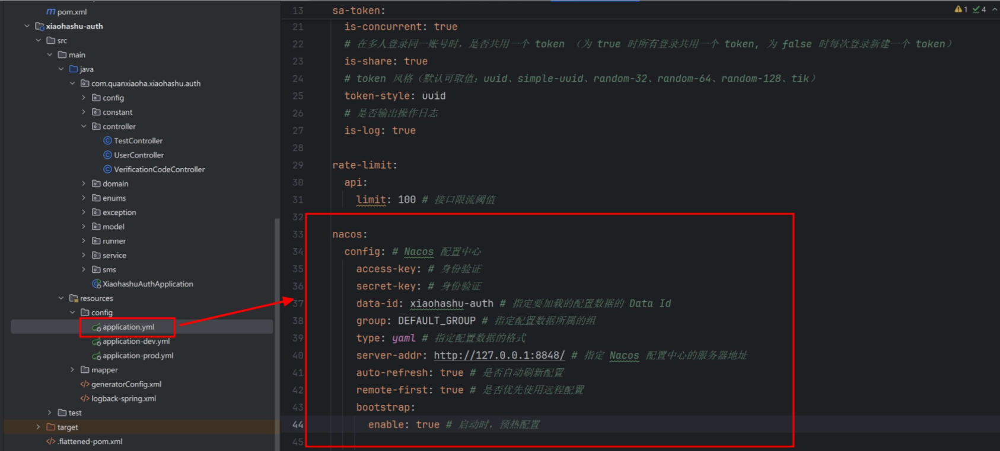

配置项如下：

```yaml
rate-limit:
  api:
    limit: 100 # 接口限流阈值

nacos: 
  config: # Nacos 配置中心
    access-key: # 身份验证
    secret-key: # 身份验证
    data-id: xiaohashu-auth # 指定要加载的配置数据的 Data Id
    group: DEFAULT_GROUP # 指定配置数据所属的组
    type: yaml # 指定配置数据的格式
    server-addr: http://127.0.0.1:8848/ # 指定 Nacos 配置中心的服务器地址
    auto-refresh: true # 是否自动刷新配置
    remote-first: true # 是否优先使用远程配置
    bootstrap:
      enable: true # 启动时，预热配置
```

**使用 @NacosValue 注解**

编辑 TestController 控制器，将之前的 Spring 框架提供的 @Value 注解，替换为 Nacos 的 @NacosValue 注解，代码如下：

```java
@RestController
@Slf4j
public class TestController {
    // @Value("${rate-limit.api.limit}")
    @NacosValue(value = "${rate-limit.api.limit}", autoRefreshed = true)
    private Integer limit;

    @GetMapping("/test")
    public String test() {
        return "当前限流阈值为: " + limit;
    }
}
```

**创建 Nacos 配置**

登录到 Nacos 管理后台中，点击创建配置按钮。配置相关配置项，如下图所示，配置完成后，点击发布按钮：


**重启项目**

代码编写完毕后，记得重启项目，开始测试 Nacos 配置是否好使。进入到 Nacos 管理后台中，点击编辑按钮，将限流阈值修改为 888 。点击发布，发布成功后，查看控制台日志，你会发现认证服务已经实时感知到了配置的变化，并将具体的配置信息以日志的方式，打印了出来。

热更新成功。

# 微服务保护 Sentinel

假如商品服务业务并发较高，占用过多Tomcat连接。可能会导致商品服务的所有接口响应时间增加，延迟变高，甚至是长时间阻塞直至查询失败。
此时查询购物车业务需要查询并等待商品查询结果，从而导致查询购物车列表业务的响应时间也变长，甚至也阻塞直至无法访问。而此时如果查询购物车的请求较多，可能导致购物车服务的Tomcat连接占用较多，所有接口的响应时间都会增加，整个服务性能很差， 甚至不可用。

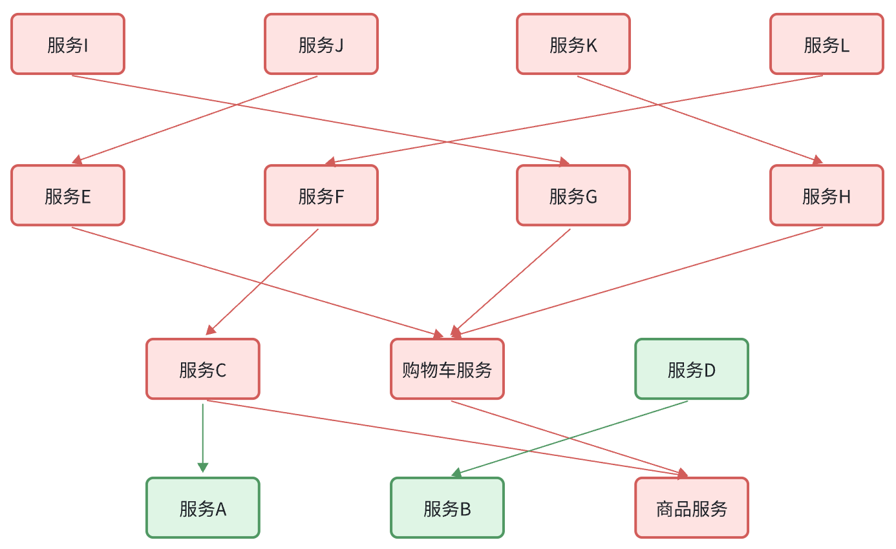

依次类推，整个微服务群中与购物车服务、商品服务等有调用关系的服务可能都会出现问题，最终导致整个集群不可用。

这就是级联失败问题，或者叫**雪崩问题**。

## 服务保护方案

微服务保护的方案有很多，比如：
- 请求限流
- 线程隔离
- 服务熔断

这些方案或多或少都会导致服务的体验上略有下降，比如请求限流，降低了并发上限；线程隔离，降低了可用资源数量；服务熔断，降低了服务的完整度，部分服务变的不可用或弱可用。因此这些方案都属于服务降级的方案。但通过这些方案，服务的健壮性得到了提升，接下来，我们就逐一了解这些方案的原理。

**1.请求限流**

服务故障最重要原因，就是并发太高！解决了这个问题，就能避免大部分故障。当然，接口的并发不是一直很高，而是突发的。因此请求限流，就是限制或控制接口访问的并发流量，避免服务因流量激增而出现故障。

请求限流往往会有一个限流器，数量高低起伏的并发请求曲线，经过限流器就变的非常平稳。这就像是水电站的大坝，起到蓄水的作用，可以通过开关控制水流出的大小，让下游水流始终维持在一个平稳的量。

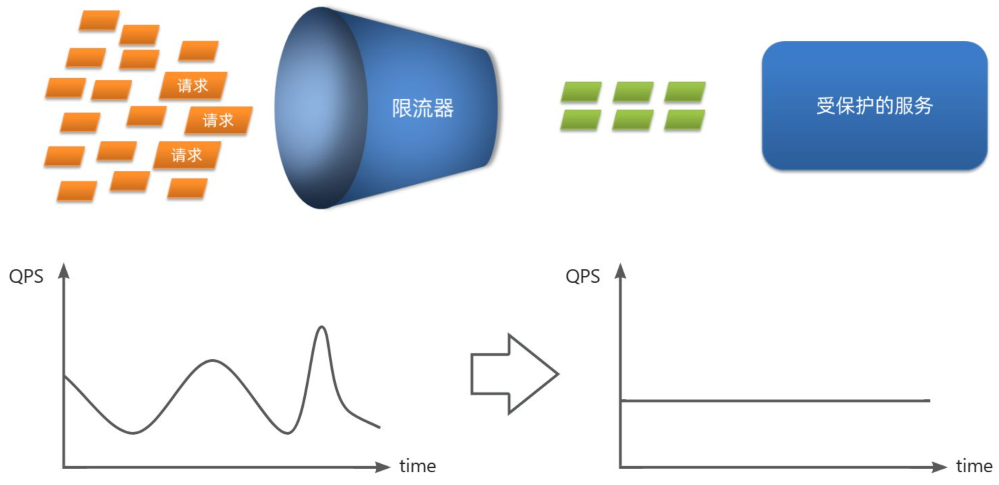

**2.线程隔离**

当一个业务接口响应时间长，而且并发高时，就可能耗尽服务器的线程资源，导致服务内的其它接口受到影响。所以我们必须把这种影响降低，或者缩减影响的范围。线程隔离正是解决这个问题的好办法。

线程隔离的思想来自轮船的舱壁模式：轮船的船舱会被隔板分割为N个相互隔离的密闭舱，假如轮船触礁进水，只有损坏的部分密闭舱会进水，而其他舱由于相互隔离，并不会进水。这样就把进水控制在部分船体，避免了整个船舱进水而沉没。

为了避免某个接口故障或压力过大导致整个服务不可用，我们可以限定每个接口可以使用的资源范围，也就是将其“隔离”起来。

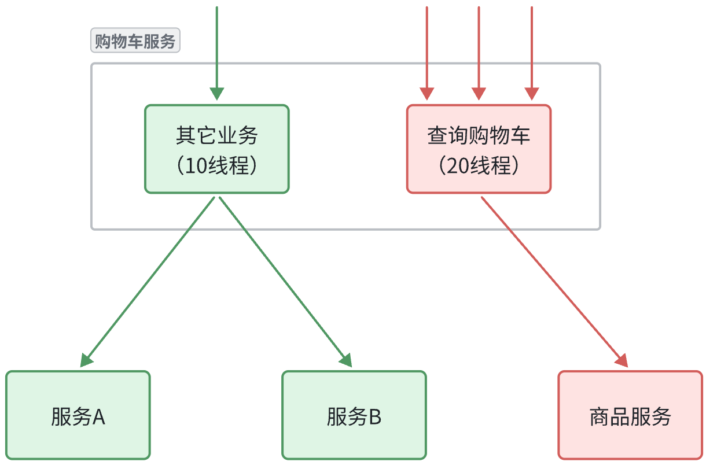

如图所示，我们给查询购物车业务限定可用线程数量上限为20，这样即便查询购物车的请求因为查询商品服务而出现故障，也不会导致服务器的线程资源被耗尽，不会影响到其它接口。

**3.服务熔断**

线程隔离虽然避免了雪崩问题，但故障服务（商品服务）依然会拖慢购物车服务（服务调用方）的接口响应速度。而且商品查询的故障依然会导致查询购物车功能出现故障，购物车业务也变的不可用了。

所以，我们要做两件事情：
- 编写服务降级逻辑：就是服务调用失败后的处理逻辑，根据业务场景，可以抛出异常，也可以返回友好提示或默认数据。
- 异常统计和熔断：统计服务提供方的异常比例，当比例过高表明该接口会影响到其它服务，应该拒绝调用该接口，而是直接走降级逻辑。

## Sentinel

**1.介绍和安装**

Sentinel是阿里巴巴开源的一款服务保护框架，目前已经加入SpringCloudAlibaba中。官方网站：https://sentinelguard.io/zh-cn/ 。

Sentinel 的使用可以分为两个部分:
- 核心库（Jar包）：不依赖任何框架/库，能够运行于 Java 8 及以上的版本的运行时环境，同时对 Dubbo / Spring Cloud 等框架也有较好的支持。在项目中引入依赖即可实现服务限流、隔离、熔断等功能。
- 控制台（Dashboard）：Dashboard 主要负责管理推送规则、监控、管理机器信息等。

为了方便监控微服务，我们先把Sentinel的控制台搭建出来。

1）下载jar包

下载地址：https://github.com/alibaba/Sentinel/releases 。

2）运行

将jar包放在任意非中文、不包含特殊字符的目录下，重命名为sentinel-dashboard.jar：

然后运行如下命令启动控制台：

```bash
java -Dserver.port=8090 -Dcsp.sentinel.dashboard.server=localhost:8090 -Dproject.name=sentinel-dashboard -jar sentinel-dashboard.jar
```

3）访问

访问 http://localhost:8090 页面，就可以看到sentinel的控制台了：

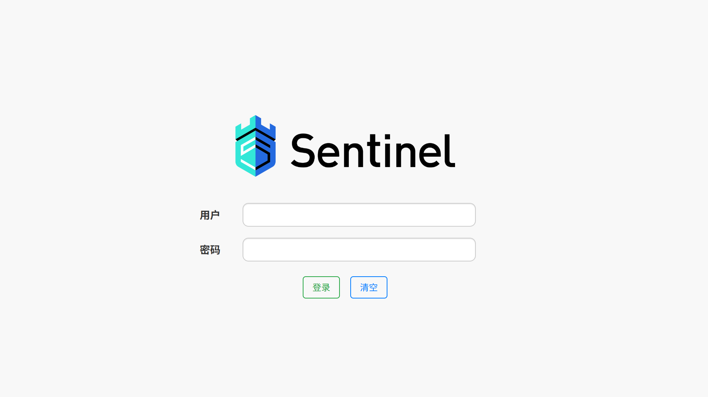

需要输入账号和密码，默认都是：sentinel
登录后，即可看到控制台，默认会监控sentinel-dashboard服务本身。

**2.微服务整合**

我们在cart-service模块中整合sentinel，连接sentinel-dashboard控制台，步骤如下：

1）引入sentinel依赖

```xml
<!--sentinel-->
<dependency>
    <groupId>com.alibaba.cloud</groupId> 
    <artifactId>spring-cloud-starter-alibaba-sentinel</artifactId>
</dependency>
```

2）配置控制台

修改application.yaml文件，添加下面内容：

```yaml
spring:
  cloud: 
    sentinel:
      transport:
        dashboard: localhost:8090
```

3）访问cart-service的任意端点

重启cart-service，然后访问查询购物车接口，sentinel的客户端就会将服务访问的信息提交到sentinel-dashboard控制台。并展示出统计信息。点击簇点链路菜单，会看到下面的页面：

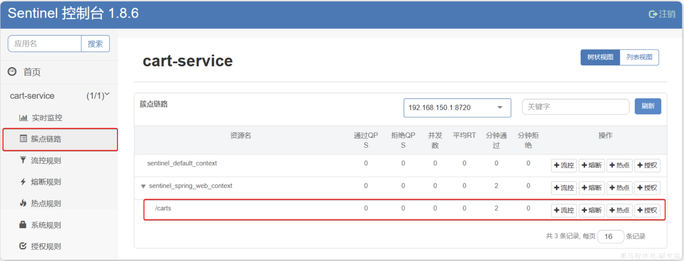

所谓簇点链路，就是单机调用链路，是一次请求进入服务后经过的每一个被Sentinel监控的资源。默认情况下，Sentinel会监控SpringMVC的每一个Endpoint（接口）。
因此，我们看到/carts这个接口路径就是其中一个簇点，我们可以对其进行限流、熔断、隔离等保护措施。

不过，需要注意的是，我们的SpringMVC接口是按照Restful风格设计，因此购物车的查询、删除、修改等接口全部都是/carts路径：

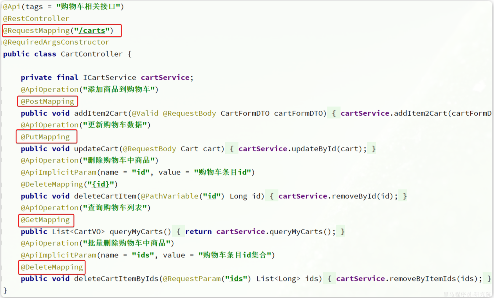

默认情况下Sentinel会把路径作为簇点资源的名称，无法区分路径相同但请求方式不同的接口，查询、删除、修改等都被识别为一个簇点资源，这显然是不合适的。

所以我们可以选择打开Sentinel的请求方式前缀，把请求方式 + 请求路径作为簇点资源名：
首先，在cart-service的application.yml中添加下面的配置：

```yaml
spring:
  cloud:
    sentinel:
      transport:
        dashboard: localhost:8090
      http-method-specify: true # 开启请求方式前缀
```

然后，重启服务，通过页面访问购物车的相关接口，可以看到sentinel控制台的簇点链路发生了变化:

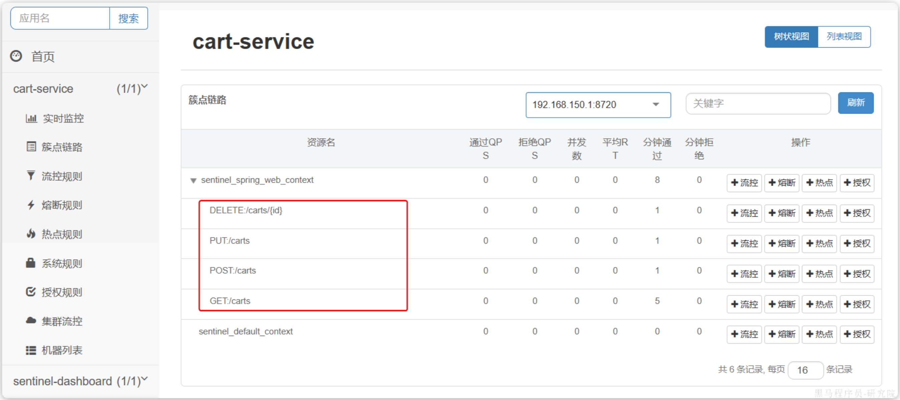

## 请求限流

在簇点链路后面点击流控按钮，即可对其做限流配置：

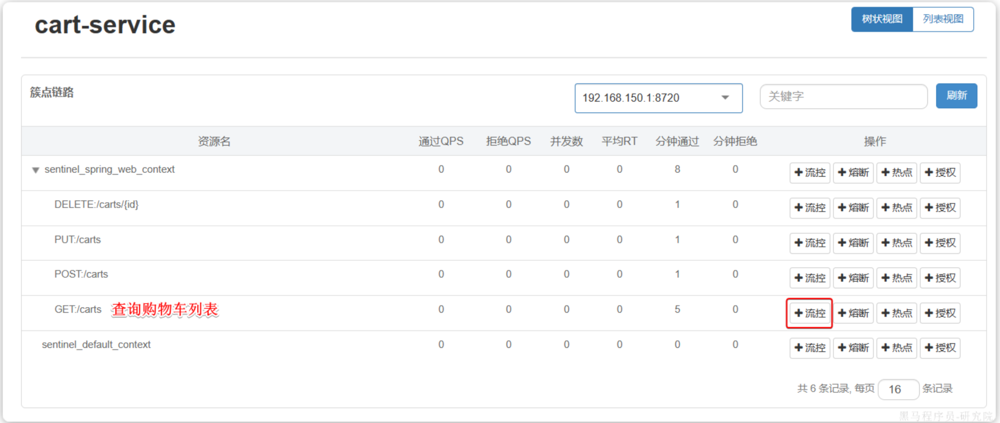


在弹出的菜单中这样填写：

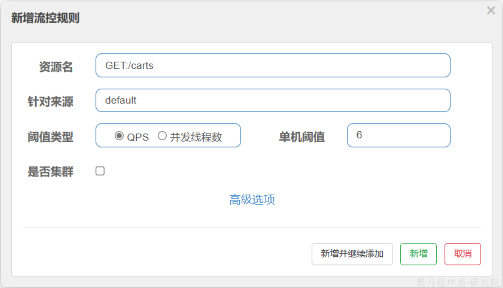

这样就把查询购物车列表这个簇点资源的流量限制在了每秒6个，也就是最大QPS为6.

我们利用Jemeter做限流测试，我们每秒发出10个请求：

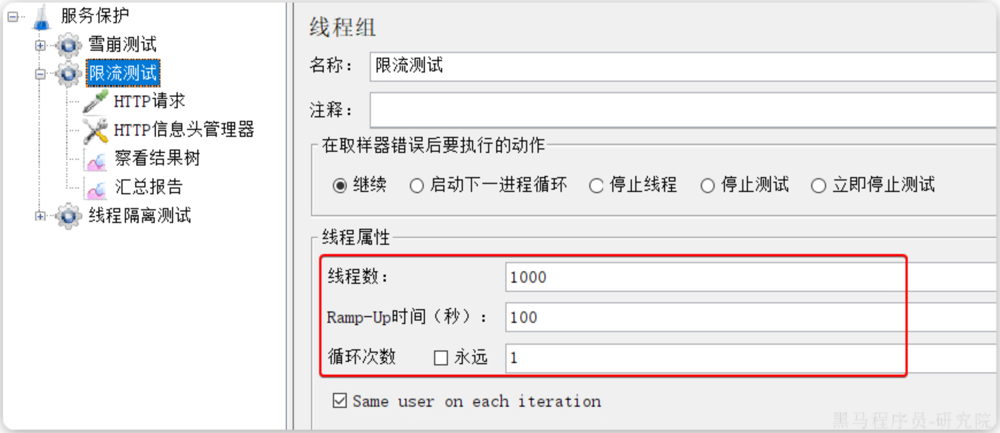

最终监控结果如下：

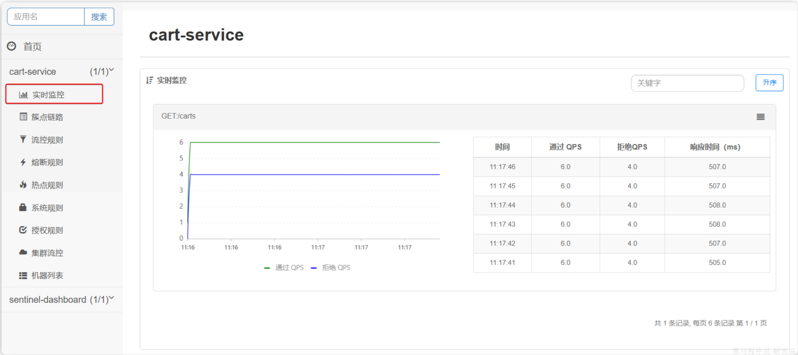

可以看出GET:/carts这个接口的通过QPS稳定在6附近，而拒绝的QPS在4附近，符合我们的预期。


## 线程隔离

限流可以降低服务器压力，尽量减少因并发流量引起的服务故障的概率，但并不能完全避免服务故障。一旦某个服务出现故障，我们必须隔离对这个服务的调用，避免发生雪崩。

比如，查询购物车的时候需要查询商品，为了避免因商品服务出现故障导致购物车服务级联失败，我们可以把购物车业务中查询商品的部分隔离起来，限制可用的线程资源：

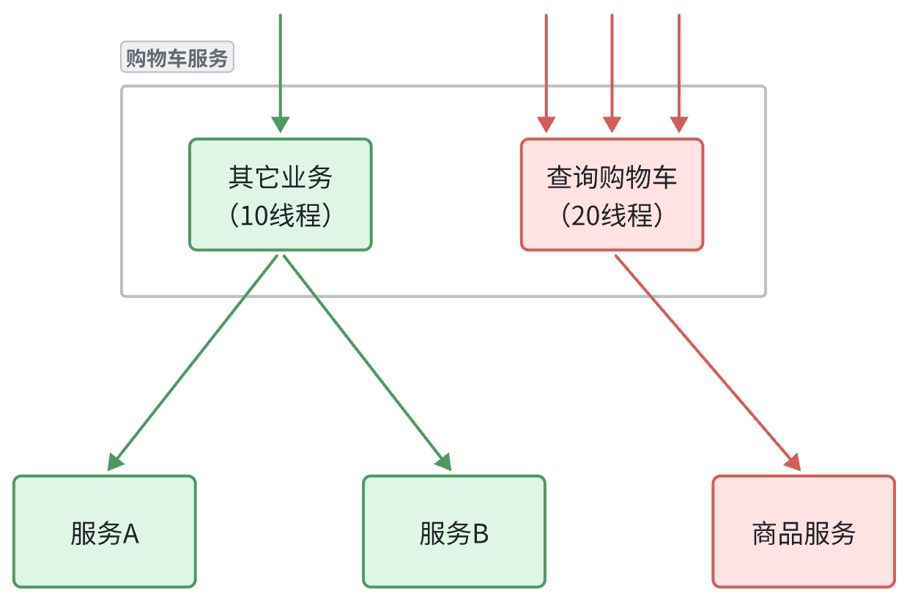

这样，即便商品服务出现故障，最多导致查询购物车业务故障，并且可用的线程资源也被限定在一定范围，不会导致整个购物车服务崩溃。

所以，我们要对查询商品的FeignClient接口做线程隔离。

**1.OpenFeign整合Sentinel**

修改cart-service模块的application.yml文件，开启Feign的sentinel功能：

```java
feign:
  sentinel:
    enabled: true # 开启feign对sentinel的支持
```

> 需要注意的是，默认情况下SpringBoot项目的tomcat最大线程数是200，允许的最大连接是8492，单机测试很难打满。

所以我们需要配置一下cart-service模块的application.yml文件，修改tomcat连接：

```java
server:
  port: 8082
  tomcat:
    threads:
      max: 50 # 允许的最大线程数
    accept-count: 50 # 最大排队等待数量
    max-connections: 100 # 允许的最大连接
```

同时手动修改查询单个商品 ItemController 业务代码，以便于压测：
```java
@ApiOperation("根据id批量查询商品")
@GetMapping
public List<ItemDTO> queryItemByIds(@RequestParam("ids") List<Long> ids){
    // TODO 模拟时间延迟
    ThreadUtil.sleep(500);
    return itemService.queryItemByIds(ids);
}
```

然后重启cart-service服务，可以看到查询商品的FeignClient自动变成了一个簇点资源：

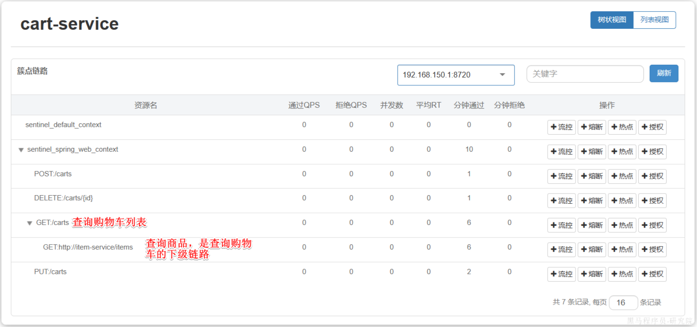

**2.配置线程隔离**

接下来，点击查询商品的FeignClient对应的簇点资源后面的流控按钮：

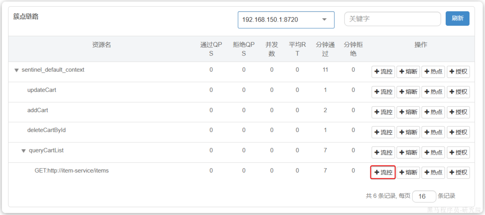

在弹出的表单中填写下面内容：

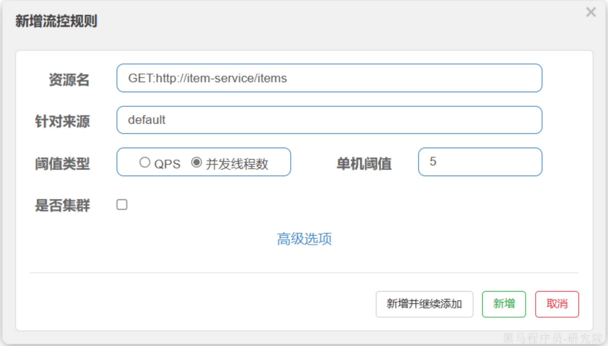

注意，这里勾选的是并发线程数限制，也就是说这个查询功能最多使用5个线程，而不是5QPS。如果查询商品的接口每秒处理2个请求，则5个线程的实际QPS在10左右，而超出的请求自然会被拒绝。

我们利用Jemeter测试，每秒发送100个请求：

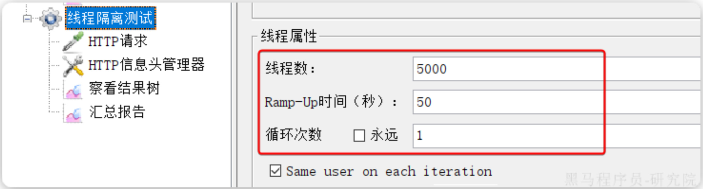

最终测试结果如下：

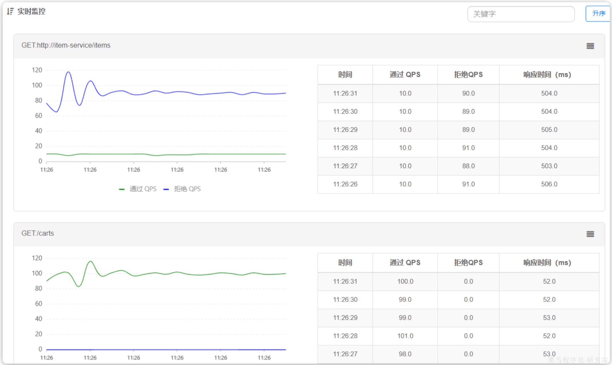

进入查询购物车的请求每秒大概在100，而在查询商品时却只剩下每秒10左右，符合我们的预期。

此时如果我们通过页面访问购物车的其它接口，例如添加购物车、修改购物车商品数量，发现不受影响：

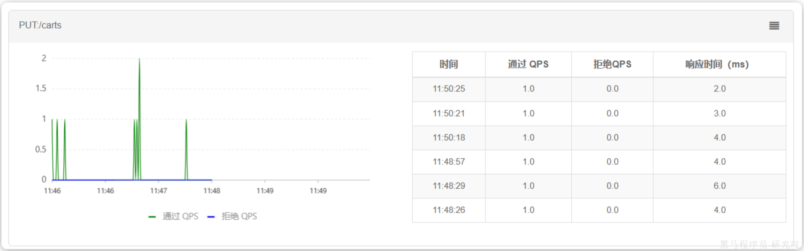

响应时间非常短，这就证明线程隔离起到了作用，尽管查询购物车这个接口并发很高，但是它能使用的线程资源被限制了，因此不会影响到其它接口。

## 服务熔断

**1.编写降级逻辑**

触发限流或熔断后的请求不一定要直接报错，也可以返回一些默认数据或者友好提示，用户体验会更好。
给FeignClient编写失败后的降级逻辑有两种方式：
- 方式一：FallbackClass，无法对远程调用的异常做处理
- 方式二：FallbackFactory，可以对远程调用的异常做处理，我们一般选择这种方式。

这里我们演示方式二的失败降级处理。

**步骤一**：在hm-api模块中给ItemClient定义降级处理类，实现FallbackFactory：

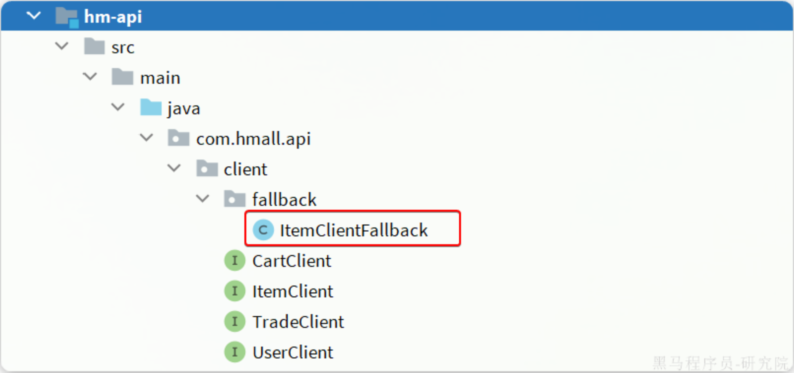

代码如下：

```java
@Slf4j
public class ItemClientFallback implements FallbackFactory<ItemClient> {
    @Override
    public ItemClient create(Throwable cause) {
        return new ItemClient() {
            @Override
            public List<ItemDTO> queryItemByIds(Collection<Long> ids) {
                log.error("远程调用ItemClient#queryItemByIds方法出现异常，参数：{}", ids, cause);
                // 查询购物车允许失败，查询失败，返回空集合
                return CollUtils.emptyList();
            }

            @Override
            public void deductStock(List<OrderDetailDTO> items) {
                // 库存扣减业务需要触发事务回滚，查询失败，抛出异常
                throw new BizIllegalException(cause);
            }
        };
    }
}
```

**步骤二**：在hm-api模块中的com.hmall.api.config.DefaultFeignConfig类中将ItemClientFallback注册为一个Bean：

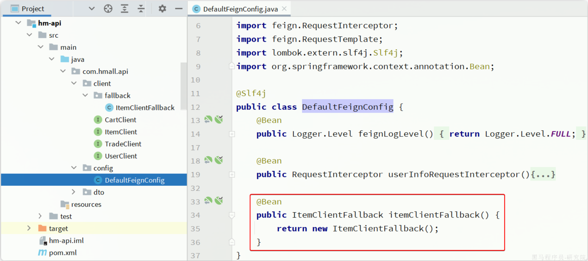

**步骤三**：在hm-api模块中的ItemClient接口中使用ItemClientFallbackFactory：

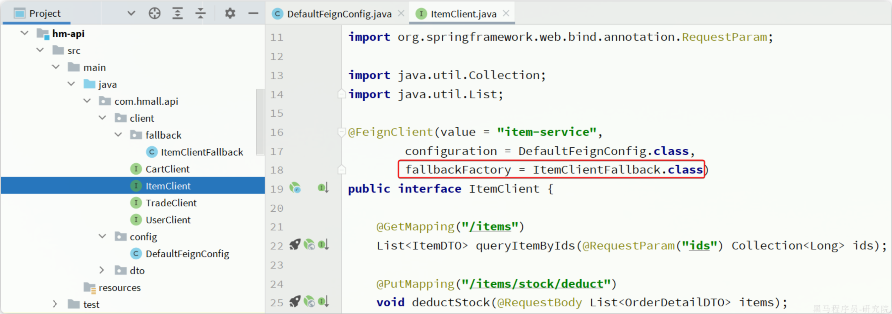

重启后，再次测试，发现被限流的请求不再报错，走了降级逻辑：

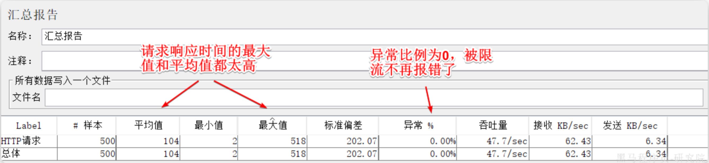

但是未被限流的请求延时依然很高：

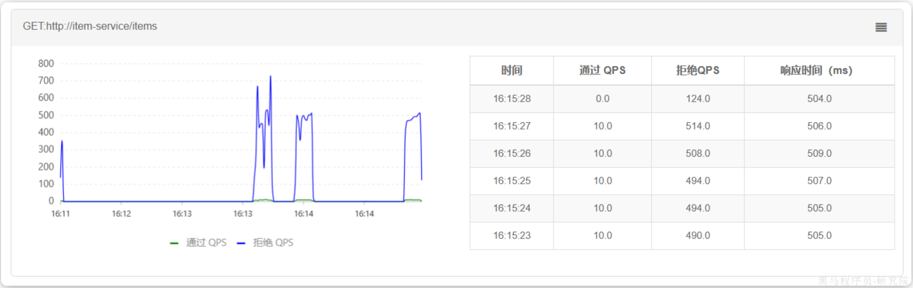

导致最终的平局响应时间较长。

**2.服务熔断**

查询商品的RT较高（模拟的500ms），从而导致查询购物车的RT也变的很长。这样不仅拖慢了购物车服务，消耗了购物车服务的更多资源，而且用户体验也很差。
对于商品服务这种不太健康的接口，我们应该停止调用，直接走降级逻辑，避免影响到当前服务。也就是将商品查询接口熔断。当商品服务接口恢复正常后，再允许调用。这其实就是断路器的工作模式了。

Sentinel中的断路器不仅可以统计某个接口的慢请求比例，还可以统计异常请求比例。当这些比例超出阈值时，就会熔断该接口，即拦截访问该接口的一切请求，降级处理；当该接口恢复正常时，再放行对于该接口的请求。
断路器的工作状态切换有一个状态机来控制：

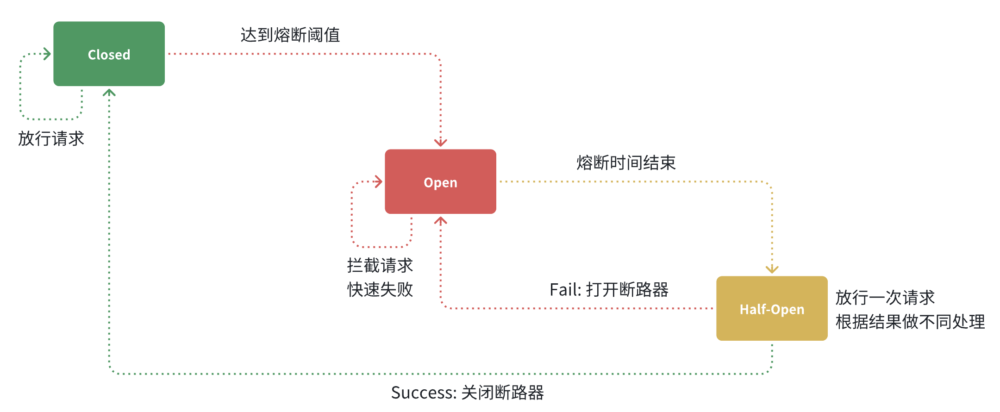

状态机包括三个状态：
- closed：关闭状态，断路器放行所有请求，并开始统计异常比例、慢请求比例。超过阈值则切换到open状态
- open：打开状态，服务调用被熔断，访问被熔断服务的请求会被拒绝，快速失败，直接走降级逻辑。Open状态持续一段时间后会进入half-open状态
- half-open：半开状态，放行一次请求，根据执行结果来判断接下来的操作。 
  - 请求成功：则切换到closed状态
  - 请求失败：则切换到open状态

我们可以在控制台通过点击簇点后的熔断按钮来配置熔断策略：

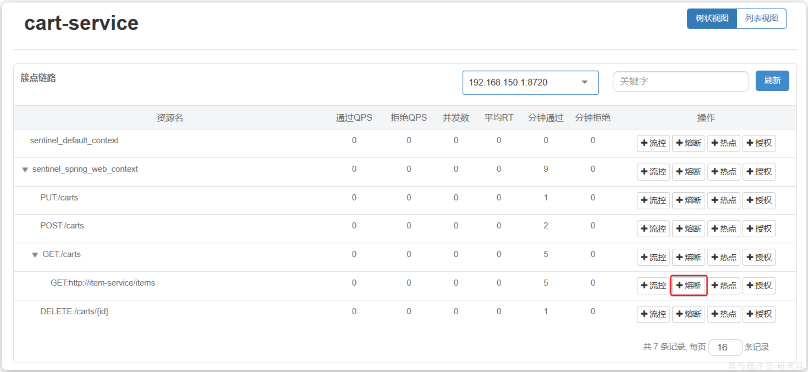

在弹出的表格中这样填写：

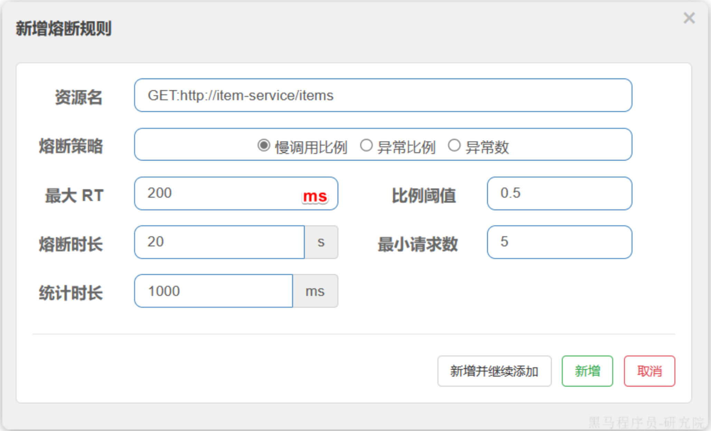

这种是按照慢调用比例来做熔断，上述配置的含义是：
- RT超过200毫秒的请求调用就是慢调用
- 统计最近1000ms内的最少5次请求，如果慢调用比例不低于0.5，则触发熔断
- 熔断持续时长20s

配置完成后，再次利用Jemeter测试，可以发现：

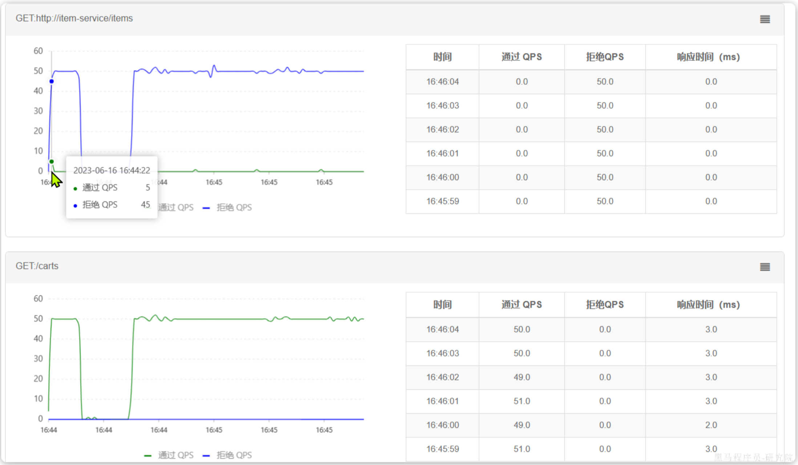

在一开始一段时间是允许访问的，后来触发熔断后，查询商品服务的接口通过QPS直接为0，所有请求都被熔断了。而查询购物车的本身并没有受到影响。
此时整个购物车查询服务的平均RT影响不大：

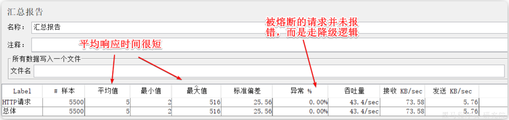


# 分布式事务 Seata

首先我们看看项目中的下单业务整体流程：

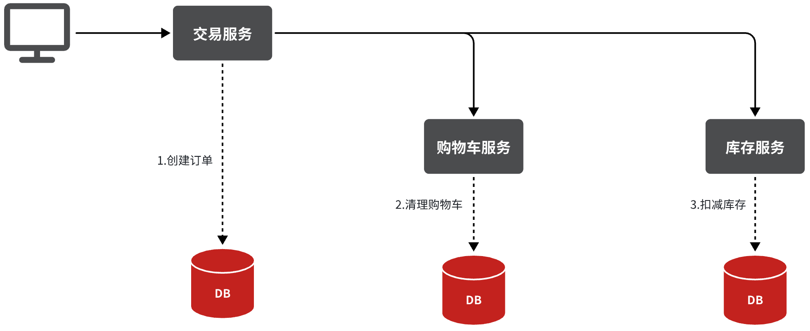

由于订单、购物车、商品分别在三个不同的微服务，而每个微服务都有自己独立的数据库，因此下单过程中就会跨多个数据库完成业务。而每个微服务都会执行自己的本地事务：
- 交易服务：下单事务
- 购物车服务：清理购物车事务
- 库存服务：扣减库存事务

整个业务中，各个本地事务是有关联的。因此每个微服务的本地事务，也可以称为分支事务。多个有关联的分支事务一起就组成了全局事务。我们必须保证整个全局事务同时成功或失败。

参与事务的多个子业务在不同的微服务，跨越了不同的数据库。虽然每个单独的业务都能在本地遵循ACID，但是它们互相之间没有感知，不知道有人失败了，无法保证最终结果的统一，也就无法遵循ACID的事务特性了。
这就是分布式事务问题，出现以下情况之一就可能产生分布式事务问题：
- 业务跨多个服务实现
- 业务跨多个数据源实现

## Seata 简介

解决分布式事务的方案有很多，但实现起来都比较复杂，因此我们一般会使用开源的框架来解决分布式事务问题。在众多的开源分布式事务框架中，功能最完善、使用最多的就是阿里巴巴在2019年开源的[Seata](https://seata.apache.org/zh-cn/docs/overview/what-is-seata/)了。

其实分布式事务产生的一个重要原因，就是参与事务的多个分支事务互相无感知，不知道彼此的执行状态。因此解决分布式事务的思想非常简单：
就是找一个统一的**事务协调者**，与多个分支事务通信，检测每个分支事务的执行状态，保证全局事务下的每一个分支事务同时成功或失败即可。大多数的分布式事务框架都是基于这个理论来实现的。

Seata也不例外，在Seata的事务管理中有三个重要的角色：
- **TC (Transaction Coordinator) - 事务协调者**：维护全局和分支事务的状态，协调全局事务提交或回滚。 
- **TM (Transaction Manager) - 事务管理器**：定义全局事务的范围、开始全局事务、提交或回滚全局事务。 
- **RM (Resource Manager) - 资源管理器**：管理分支事务，与TC交谈以注册分支事务和报告分支事务的状态，并驱动分支事务提交或回滚。 

Seata的工作架构如图所示：

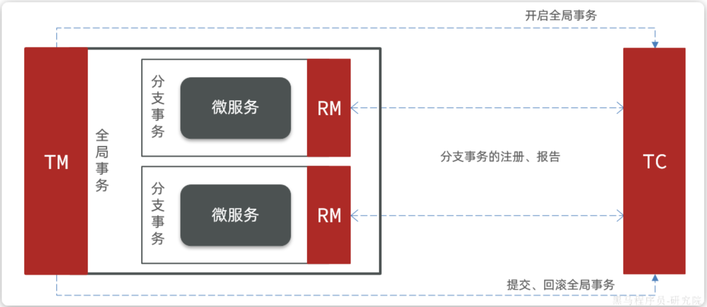

其中，TM和RM可以理解为Seata的客户端部分，引入到参与事务的微服务依赖中即可。将来TM和RM就会协助微服务，实现本地分支事务与TC之间交互，实现事务的提交或回滚。

而TC服务则是事务协调中心，是一个独立的微服务，需要单独部署。

## 部署TC服务

**1.准备数据库表**

Seata支持多种存储模式，但考虑到持久化的需要，我们一般选择基于数据库存储。执行课前资料提供的 seata-tc.sql，导入数据库表：

```sql
CREATE DATABASE IF NOT EXISTS `seata`;
USE `seata`;


CREATE TABLE IF NOT EXISTS `global_table`
(
    `xid`                       VARCHAR(128) NOT NULL,
    `transaction_id`            BIGINT,
    `status`                    TINYINT      NOT NULL,
    `application_id`            VARCHAR(32),
    `transaction_service_group` VARCHAR(32),
    `transaction_name`          VARCHAR(128),
    `timeout`                   INT,
    `begin_time`                BIGINT,
    `application_data`          VARCHAR(2000),
    `gmt_create`                DATETIME,
    `gmt_modified`              DATETIME,
    PRIMARY KEY (`xid`),
    KEY `idx_status_gmt_modified` (`status` , `gmt_modified`),
    KEY `idx_transaction_id` (`transaction_id`)
) ENGINE = InnoDB
  DEFAULT CHARSET = utf8mb4;


CREATE TABLE IF NOT EXISTS `branch_table`
(
    `branch_id`         BIGINT       NOT NULL,
    `xid`               VARCHAR(128) NOT NULL,
    `transaction_id`    BIGINT,
    `resource_group_id` VARCHAR(32),
    `resource_id`       VARCHAR(256),
    `branch_type`       VARCHAR(8),
    `status`            TINYINT,
    `client_id`         VARCHAR(64),
    `application_data`  VARCHAR(2000),
    `gmt_create`        DATETIME(6),
    `gmt_modified`      DATETIME(6),
    PRIMARY KEY (`branch_id`),
    KEY `idx_xid` (`xid`)
) ENGINE = InnoDB
  DEFAULT CHARSET = utf8mb4;


CREATE TABLE IF NOT EXISTS `lock_table`
(
    `row_key`        VARCHAR(128) NOT NULL,
    `xid`            VARCHAR(128),
    `transaction_id` BIGINT,
    `branch_id`      BIGINT       NOT NULL,
    `resource_id`    VARCHAR(256),
    `table_name`     VARCHAR(32),
    `pk`             VARCHAR(36),
    `status`         TINYINT      NOT NULL DEFAULT '0' COMMENT '0:locked ,1:rollbacking',
    `gmt_create`     DATETIME,
    `gmt_modified`   DATETIME,
    PRIMARY KEY (`row_key`),
    KEY `idx_status` (`status`),
    KEY `idx_branch_id` (`branch_id`),
    KEY `idx_xid_and_branch_id` (`xid` , `branch_id`)
) ENGINE = InnoDB
  DEFAULT CHARSET = utf8mb4;

CREATE TABLE IF NOT EXISTS `distributed_lock`
(
    `lock_key`       CHAR(20) NOT NULL,
    `lock_value`     VARCHAR(20) NOT NULL,
    `expire`         BIGINT,
    primary key (`lock_key`)
) ENGINE = InnoDB
  DEFAULT CHARSET = utf8mb4;

INSERT INTO `distributed_lock` (lock_key, lock_value, expire) VALUES ('AsyncCommitting', ' ', 0);
INSERT INTO `distributed_lock` (lock_key, lock_value, expire) VALUES ('RetryCommitting', ' ', 0);
INSERT INTO `distributed_lock` (lock_key, lock_value, expire) VALUES ('RetryRollbacking', ' ', 0);
INSERT INTO `distributed_lock` (lock_key, lock_value, expire) VALUES ('TxTimeoutCheck', ' ', 0);
```

**2.Docker 部署**

课前资料准备了一个seata目录，其中包含了seata运行时所需要的配置文件：

其中包含中文注释，大家可以自行阅读。
我们将整个seata文件夹拷贝到虚拟机的/root目录：

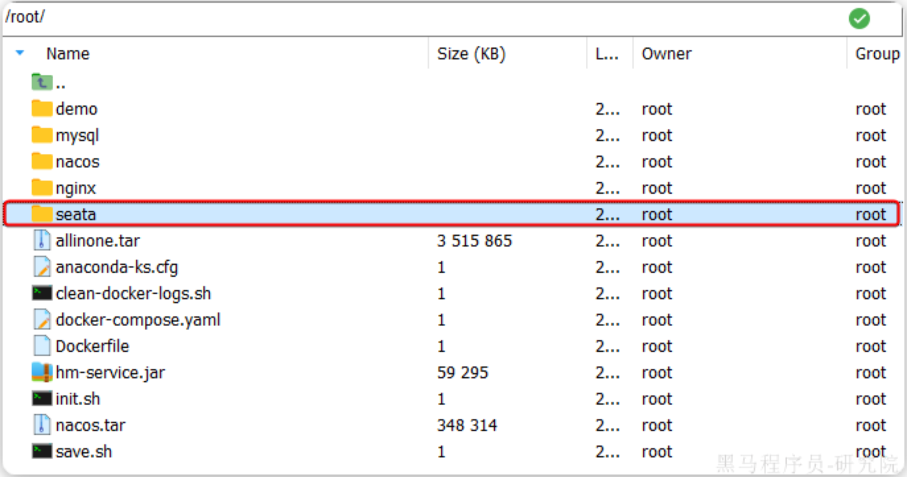

需要注意，要确保nacos、mysql都在hm-net网络中。如果某个容器不再hm-net网络，可以参考下面的命令将某容器加入指定网络：

```bash
docker network connect [网络名] [容器名]
```

```bash
docker run --name seata \
-p 8099:8099 \
-p 7099:7099 \
-e SEATA_IP=192.168.150.101 \
-v ./seata:/seata-server/resources \
--privileged=true \
--network hm-net \
-d \
seataio/seata-server:1.5.2
```

**3.微服务集成Seata**

参与分布式事务的每一个微服务都需要集成Seata，我们以trade-service为例。

**3.1.引入依赖**

为了方便各个微服务集成seata，我们需要把seata配置共享到nacos，因此trade-service模块不仅仅要引入seata依赖，还要引入nacos依赖:

```xml
<!--统一配置管理-->
<dependency>
    <groupId>com.alibaba.cloud</groupId>
    <artifactId>spring-cloud-starter-alibaba-nacos-config</artifactId>
</dependency>
<!--读取bootstrap文件-->
<dependency>
    <groupId>org.springframework.cloud</groupId>
    <artifactId>spring-cloud-starter-bootstrap</artifactId>
</dependency>
<!--seata-->
<dependency>
    <groupId>com.alibaba.cloud</groupId>
    <artifactId>spring-cloud-starter-alibaba-seata</artifactId>
</dependency>
```

3.2.改造配置

首先在nacos上添加一个共享的seata配置，命名为shared-seata.yaml：

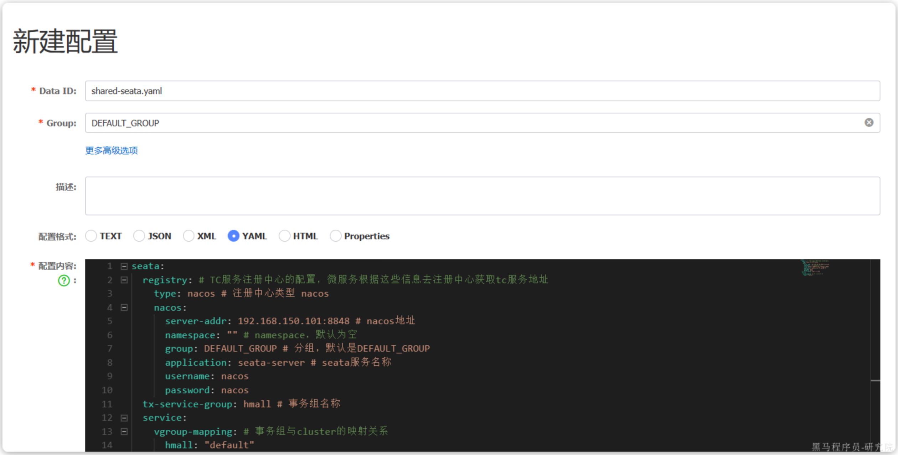

内容如下：

```yaml
seata:
  registry: # TC服务注册中心的配置，微服务根据这些信息去注册中心获取tc服务地址
    type: nacos # 注册中心类型 nacos
    nacos:
      server-addr: 192.168.150.101:8848 # nacos地址
      namespace: "" # namespace，默认为空
      group: DEFAULT_GROUP # 分组，默认是DEFAULT_GROUP
      application: seata-server # seata服务名称
      username: nacos
      password: nacos
  tx-service-group: hmall # 事务组名称
  service:
    vgroup-mapping: # 事务组与tc集群的映射关系
      hmall: "default"
```

然后，改造trade-service模块，添加bootstrap.yaml：


内容如下:

```yaml
spring:
  application:
    name: trade-service # 服务名称
  profiles:
    active: dev
  cloud:
    nacos:
      server-addr: 192.168.150.101 # nacos地址
      config:
        file-extension: yaml # 文件后缀名
        shared-configs: # 共享配置
          - dataId: shared-jdbc.yaml # 共享mybatis配置
          - dataId: shared-log.yaml # 共享日志配置
          - dataId: shared-swagger.yaml # 共享日志配置
          - dataId: shared-seata.yaml # 共享seata配置
```

可以看到这里加载了共享的seata配置。
然后改造application.yaml文件，内容如下：

```yaml
server:
  port: 8085
feign:
  okhttp:
    enabled: true # 开启OKHttp连接池支持
  sentinel:
    enabled: true # 开启Feign对Sentinel的整合
hm:
  swagger:
    title: 交易服务接口文档
    package: com.hmall.trade.controller
  db:
    database: hm-trade
```

参考上述办法分别改造hm-cart和hm-item两个微服务模块。

## XA模式
Seata支持四种不同的分布式事务解决方案：
- XA
- TCC
- AT
- SAGA

这里我们以XA模式和AT模式来给大家讲解其实现原理。

XA 规范 是 X/Open 组织定义的分布式事务处理（DTP，Distributed Transaction Processing）标准，XA 规范 描述了全局的TM与局部的RM之间的接口，几乎所有主流的数据库都对 XA 规范 提供了支持。

**1.Seata的XA模型**

Seata对原始的XA模式做了简单的封装和改造，以适应自己的事务模型，基本架构如图：

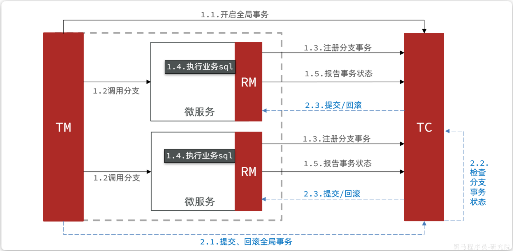

RM一阶段的工作：
1. 注册分支事务到TC
2. 执行分支业务sql但不提交
3. 报告执行状态到TC

TC二阶段的工作：
1. TC检测各分支事务执行状态
  1. 如果都成功，通知所有RM提交事务
  2. 如果有失败，通知所有RM回滚事务 

RM二阶段的工作：
- 接收TC指令，提交或回滚事务

**2.实现步骤**

首先，我们要在配置文件中指定要采用的分布式事务模式。我们可以在Nacos中的共享shared-seata.yaml配置文件中设置：

```yaml
seata:
  data-source-proxy-mode: XA
```

其次，我们要利用@GlobalTransactional标记分布式事务的入口方法：

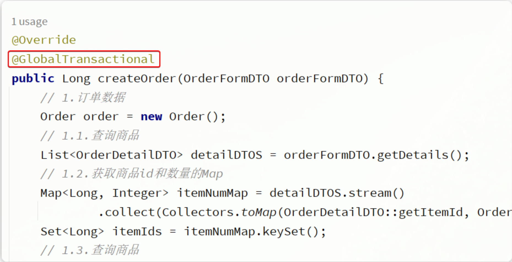

**3.优缺点**

XA模式的优点是什么？
- 事务的强一致性，满足ACID原则
- 常用数据库都支持，实现简单，并且没有代码侵入

XA模式的缺点是什么？
- 因为一阶段需要锁定数据库资源，等待二阶段结束才释放，性能较差
- 依赖关系型数据库实现事务

## AT模式

AT模式同样是分阶段提交的事务模型，不过缺弥补了XA模型中资源锁定周期过长的缺陷。

**1.Seata的AT模型**

基本流程图：

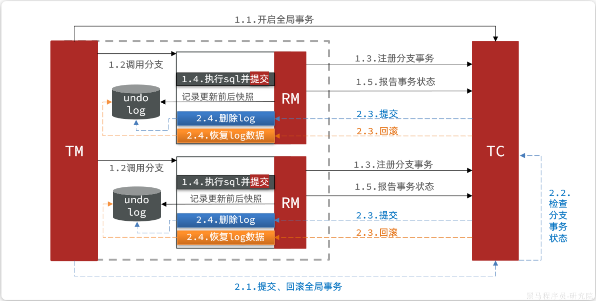

阶段一RM的工作：
- 注册分支事务
- 记录undo-log（数据快照）
- 执行业务sql并提交
- 报告事务状态

阶段二提交时RM的工作：
- 删除undo-log即可

阶段二回滚时RM的工作：
- 根据undo-log恢复数据到更新前

**2.实现步骤**

首先，为每个微服务数据库添加 `undo_log` 表：

```java
USE `hm-trade`;

-- for AT mode you must to init this sql for you business database. the seata server not need it.
CREATE TABLE IF NOT EXISTS `undo_log`
(
    `branch_id`     BIGINT       NOT NULL COMMENT 'branch transaction id',
    `xid`           VARCHAR(128) NOT NULL COMMENT 'global transaction id',
    `context`       VARCHAR(128) NOT NULL COMMENT 'undo_log context,such as serialization',
    `rollback_info` LONGBLOB     NOT NULL COMMENT 'rollback info',
    `log_status`    INT(11)      NOT NULL COMMENT '0:normal status,1:defense status',
    `log_created`   DATETIME(6)  NOT NULL COMMENT 'create datetime',
    `log_modified`  DATETIME(6)  NOT NULL COMMENT 'modify datetime',
    UNIQUE KEY `ux_undo_log` (`xid`, `branch_id`)
) ENGINE = InnoDB
  AUTO_INCREMENT = 1
  DEFAULT CHARSET = utf8mb4 COMMENT ='AT transaction mode undo table';
```

其次，我们要在配置文件中指定要采用的分布式事务模式。我们可以在Nacos中的共享shared-seata.yaml配置文件中设置：

```yaml
seata:
  data-source-proxy-mode: AT
```

最后，我们要利用@GlobalTransactional标记分布式事务的入口方法。

**3.流程梳理**

我们用一个真实的业务来梳理下AT模式的原理。
比如，现在有一个数据库表，记录用户余额：

| id | money |
| -- |  --   |
| 1  |  100  |

其中一个分支业务要执行的SQL为：

```sql
 update tb_account set money = money - 10 where id = 1
```

AT模式下，当前分支事务执行流程如下：
一阶段：
1. TM发起并注册全局事务到TC
2. TM调用分支事务
3. 分支事务准备执行业务SQL
4. RM拦截业务SQL，根据where条件查询原始数据，形成快照。

```json
{
  "id": 1, "money": 100
}
```

5. RM执行业务SQL，提交本地事务，释放数据库锁。此时 money = 90
6. RM报告本地事务状态给TC

二阶段：
1. TM通知TC事务结束
2. TC检查分支事务状态
  1. 如果都成功，则立即删除快照
  2. 如果有分支事务失败，需要回滚。读取快照数据（{"id": 1, "money": 100}），将快照恢复到数据库。此时数据库再次恢复为100

**4.AT与XA的区别**

简述AT模式与XA模式最大的区别是什么？
- XA模式一阶段不提交事务，锁定资源；AT模式一阶段直接提交，不锁定资源。
- XA模式依赖数据库机制实现回滚；AT模式利用数据快照实现数据回滚。
- XA模式强一致；AT模式最终一致

可见，AT模式使用起来更加简单，无业务侵入，性能更好。因此企业90%的分布式事务都可以用AT模式来解决。
