[toc]

# 1.初识MQ

## 1.1.同步调用

之前说过，我们现在基于OpenFeign的调用都属于是同步调用，那么这种方式存在哪些问题呢？
举个例子，我们以昨天留给大家作为作业的余额支付功能为例来分析，首先看下整个流程：

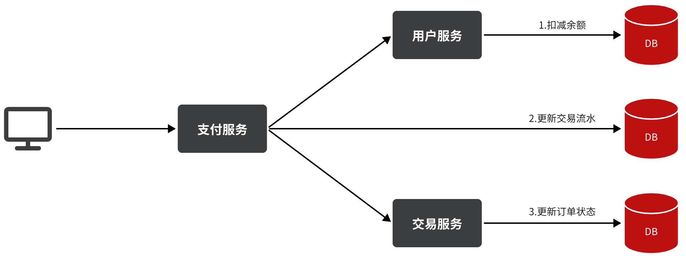

目前我们采用的是基于OpenFeign的同步调用，也就是说业务执行流程是这样的：
- 支付服务需要先调用用户服务完成余额扣减
- 然后支付服务自己要更新支付流水单的状态
- 然后支付服务调用交易服务，更新业务订单状态为已支付

三个步骤依次执行。
这其中就存在3个问题：

**第一，拓展性差**

我们目前的业务相对简单，但是随着业务规模扩大，产品的功能也在不断完善。
在大多数电商业务中，用户支付成功后都会以短信或者其它方式通知用户，告知支付成功。假如后期产品经理提出这样新的需求，你怎么办？是不是要在上述业务中再加入通知用户的业务？
某些电商项目中，还会有积分或金币的概念。假如产品经理提出需求，用户支付成功后，给用户以积分奖励或者返还金币，你怎么办？是不是要在上述业务中再加入积分业务、返还金币业务？
。。。
最终你的支付业务会越来越臃肿：

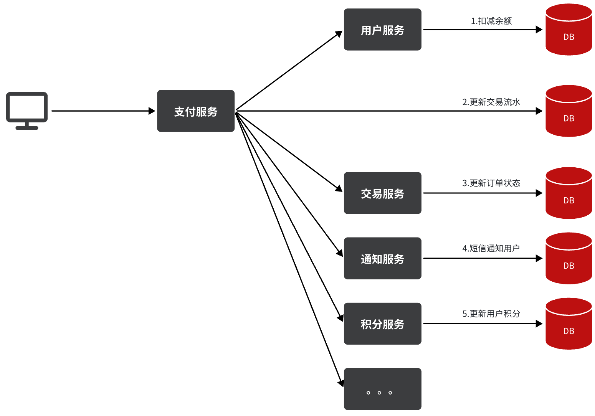

也就是说每次有新的需求，现有支付逻辑都要跟着变化，代码经常变动，不符合开闭原则，拓展性不好。

**第二，性能下降**

由于我们采用了同步调用，调用者需要等待服务提供者执行完返回结果后，才能继续向下执行，也就是说每次远程调用，调用者都是阻塞等待状态。最终整个业务的响应时长就是每次远程调用的执行时长之和：

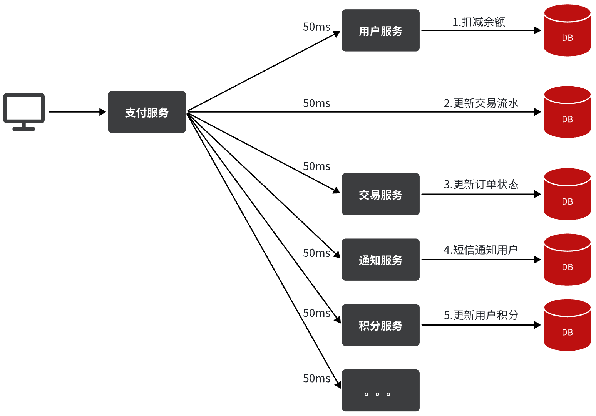

假如每个微服务的执行时长都是50ms，则最终整个业务的耗时可能高达300ms，性能太差了。

**第三，级联失败**

由于我们是基于OpenFeign调用交易服务、通知服务。当交易服务、通知服务出现故障时，整个事务都会回滚，交易失败。
这其实就是同步调用的级联失败问题。

但是大家思考一下，我们假设用户余额充足，扣款已经成功，此时我们应该确保支付流水单更新为已支付，确保交易成功。毕竟收到手里的钱没道理再退回去吧。

因此，这里不能因为短信通知、更新订单状态失败而回滚整个事务。

综上，同步调用的方式存在下列问题：
- 拓展性差
- 性能下降
- 级联失败

而要解决这些问题，我们就必须用异步调用的方式来代替同步调用。

## 1.2.异步调用

异步调用方式其实就是基于消息通知的方式，一般包含三个角色：
- 消息发送者：投递消息的人，就是原来的调用方
- 消息Broker：管理、暂存、转发消息，你可以把它理解成微信服务器
- 消息接收者：接收和处理消息的人，就是原来的服务提供方

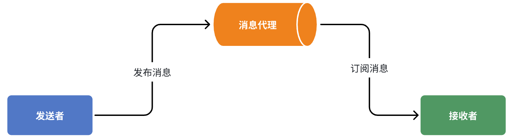

在异步调用中，发送者不再直接同步调用接收者的业务接口，而是发送一条消息投递给消息Broker。然后接收者根据自己的需求从消息Broker那里订阅消息。每当发送方发送消息后，接受者都能获取消息并处理。
这样，发送消息的人和接收消息的人就完全解耦了。

还是以余额支付业务为例：

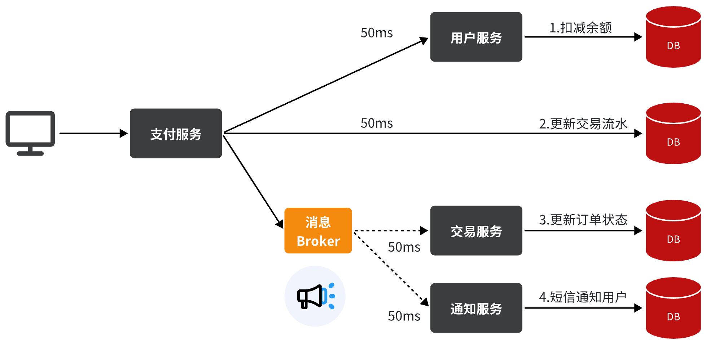

除了扣减余额、更新支付流水单状态以外，其它调用逻辑全部取消。而是改为发送一条消息到Broker。而相关的微服务都可以订阅消息通知，一旦消息到达Broker，则会分发给每一个订阅了的微服务，处理各自的业务。

假如产品经理提出了新的需求，比如要在支付成功后更新用户积分。支付代码完全不用变更，而仅仅是让积分服务也订阅消息即可：

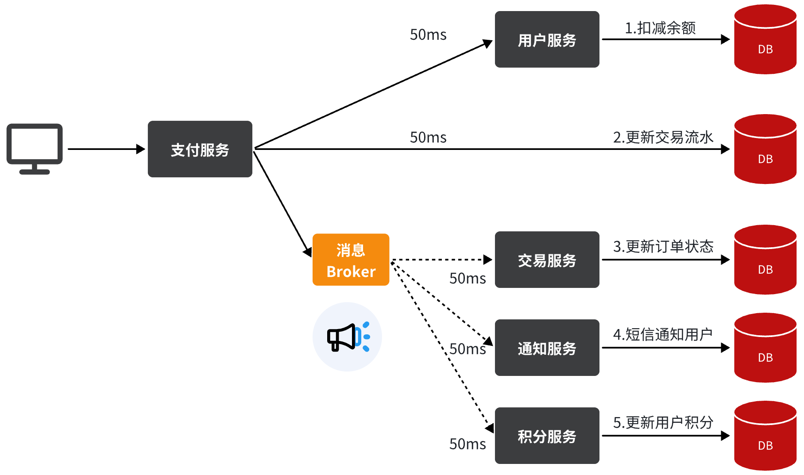

不管后期增加了多少消息订阅者，作为支付服务来讲，执行问扣减余额、更新支付流水状态后，发送消息即可。业务耗时仅仅是这三部分业务耗时，仅仅100ms，大大提高了业务性能。

另外，不管是交易服务、通知服务，还是积分服务，他们的业务与支付关联度低。现在采用了异步调用，解除了耦合，他们即便执行过程中出现了故障，也不会影响到支付服务。

综上，异步调用的优势包括：
- 耦合度更低
- 性能更好
- 业务拓展性强
- 故障隔离，避免级联失败

当然，异步通信也并非完美无缺，它存在下列缺点：
- 完全依赖于Broker的可靠性、安全性和性能
- 架构复杂，后期维护和调试麻烦

# 2.RabbitMQ

RabbitMQ是基于Erlang语言开发的开源消息通信中间件，官网地址：
https://www.rabbitmq.com/
接下来，我们就学习它的基本概念和基础用法。

## 2.1.安装

我们同样基于Docker来安装RabbitMQ，使用下面的命令即可：

```bash
docker run \
 -e RABBITMQ_DEFAULT_USER=itheima \
 -e RABBITMQ_DEFAULT_PASS=123321 \
 -v mq-plugins:/plugins \
 --name mq \
 --hostname mq \
 -p 15672:15672 \
 -p 5672:5672 \
 --network hm-net\
 -d \
 rabbitmq:3.8-management
```

可以看到在安装命令中有两个映射的端口：
- 15672：RabbitMQ提供的管理控制台的端口
- 5672：RabbitMQ的消息发送处理接口

安装完成后，我们访问 http://192.168.150.101:15672 即可看到管理控制台。首次访问需要登录，默认的用户名和密码在配置文件中已经指定了。
登录后即可看到管理控制台总览页面。

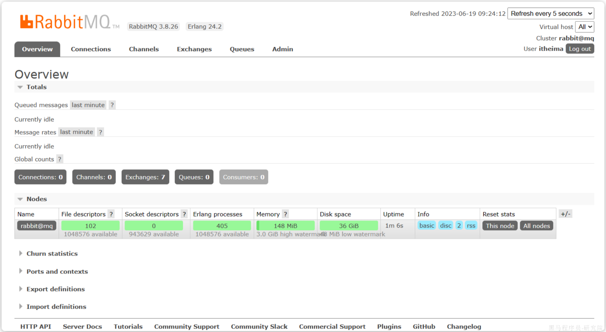

RabbitMQ对应的架构如图：

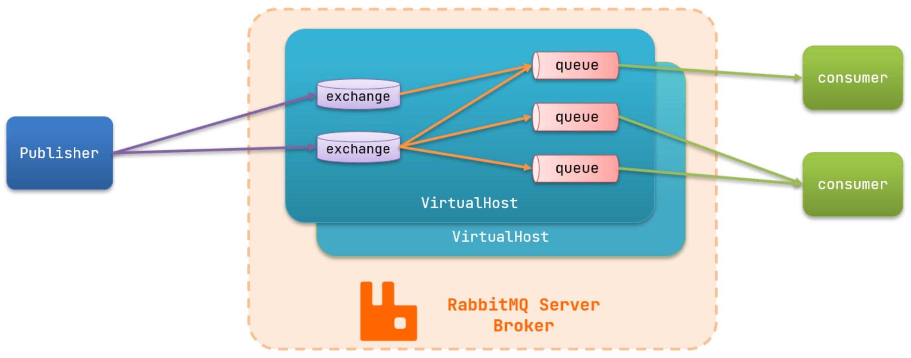

其中包含几个概念：
- publisher：生产者，也就是发送消息的一方
- consumer：消费者，也就是消费消息的一方
- queue：队列，存储消息。生产者投递的消息会暂存在消息队列中，等待消费者处理
- exchange：交换机，负责消息路由。生产者发送的消息由交换机决定投递到哪个队列。
- virtual host：虚拟主机，起到数据隔离的作用。每个虚拟主机相互独立，有各自的exchange、queue

上述这些东西都可以在RabbitMQ的管理控制台来管理，下一节我们就一起来学习控制台的使用。

## 2.2.收发消息

### 2.2.1.交换机

我们打开Exchanges选项卡，可以看到已经存在很多交换机：

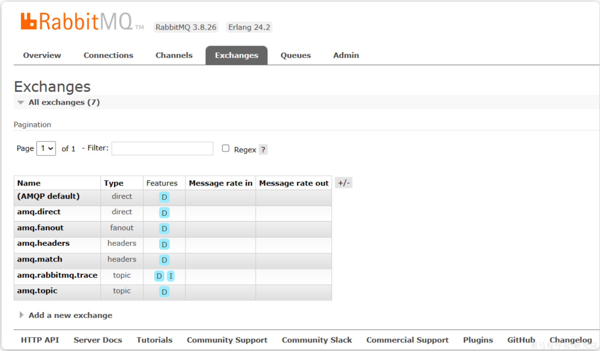

我们点击任意交换机，即可进入交换机详情页面。仍然会利用控制台中的publish message 发送一条消息：

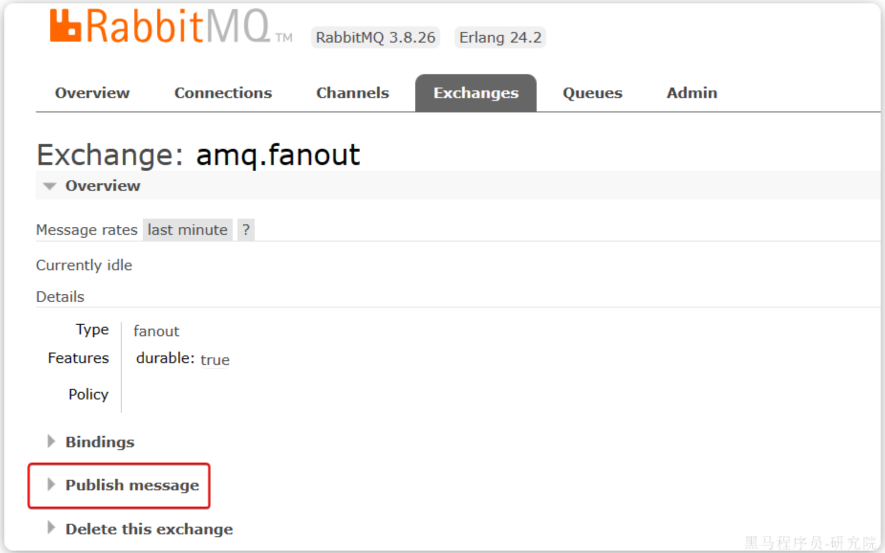

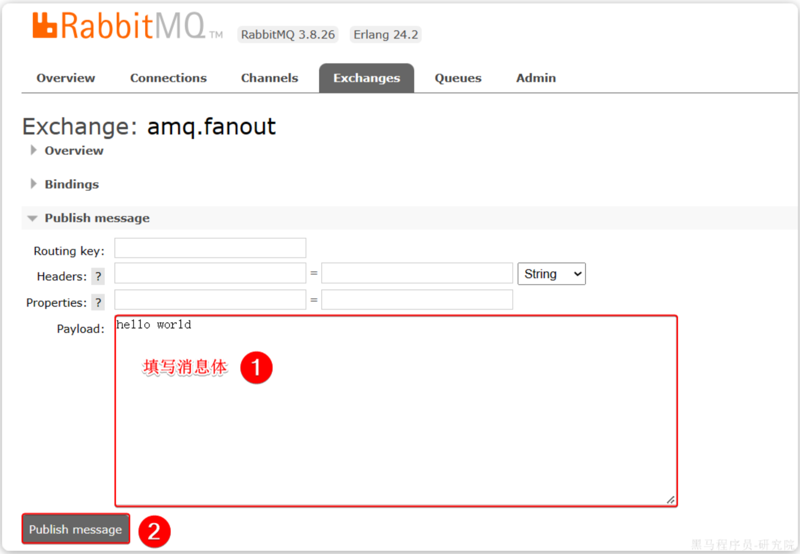

这里是由控制台模拟了生产者发送的消息。由于没有消费者存在，最终消息丢失了，这样说明交换机没有存储消息的能力。

### 2.2.2.队列

我们打开Queues选项卡，新建一个队列：

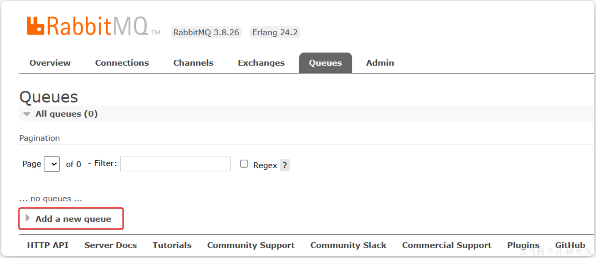

命名为hello.queue1：

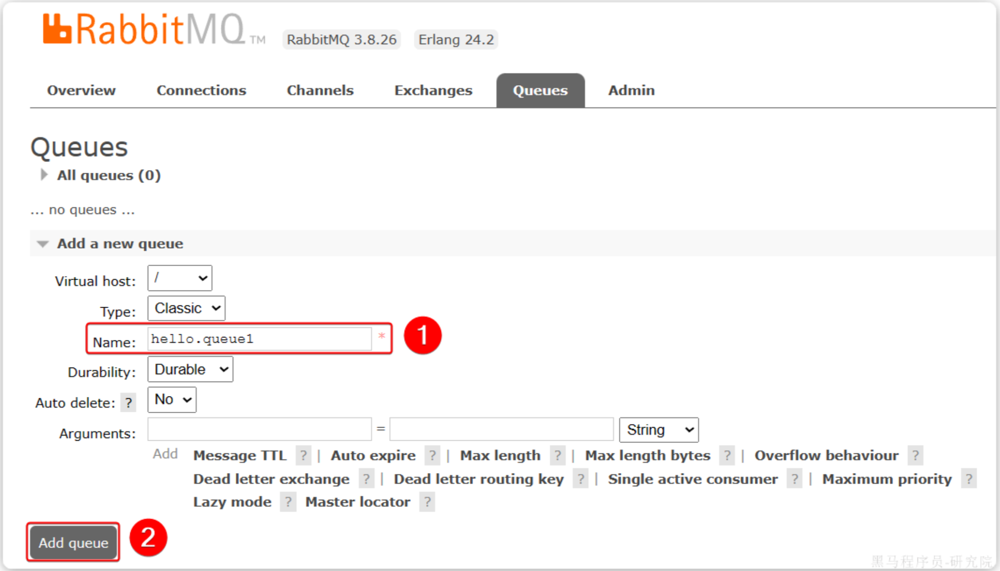

再以相同的方式，创建一个队列，密码为hello.queue2，最终队列列表如下：

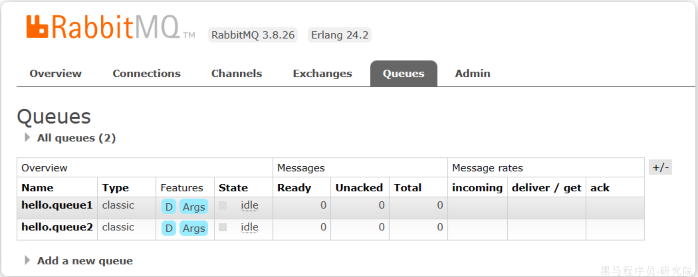

此时，我们再次向amq.fanout交换机发送一条消息。会发现消息依然没有到达队列！！
怎么回事呢？
发送到交换机的消息，只会路由到与其绑定的队列，因此仅仅创建队列是不够的，我们还需要将其与交换机绑定。

### 2.2.3.绑定关系

点击Exchanges选项卡，点击amq.fanout交换机，进入交换机详情页，然后点击Bindings菜单，在表单中填写要绑定的队列名称：

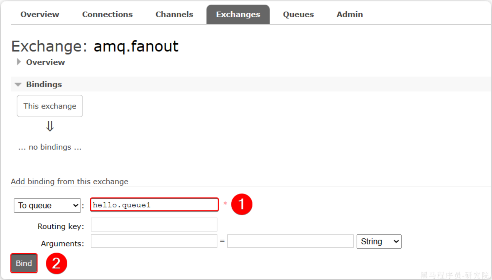

相同的方式，将hello.queue2也绑定到改交换机。
最终，绑定结果如下：

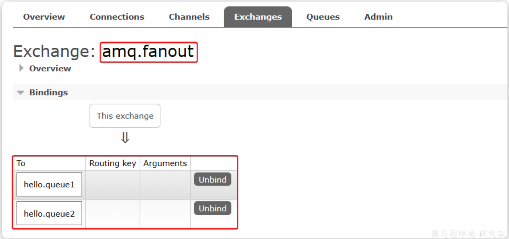

### 2.2.4.发送消息

再次回到exchange页面，找到刚刚绑定的amq.fanout，点击进入详情页，再次发送一条消息：

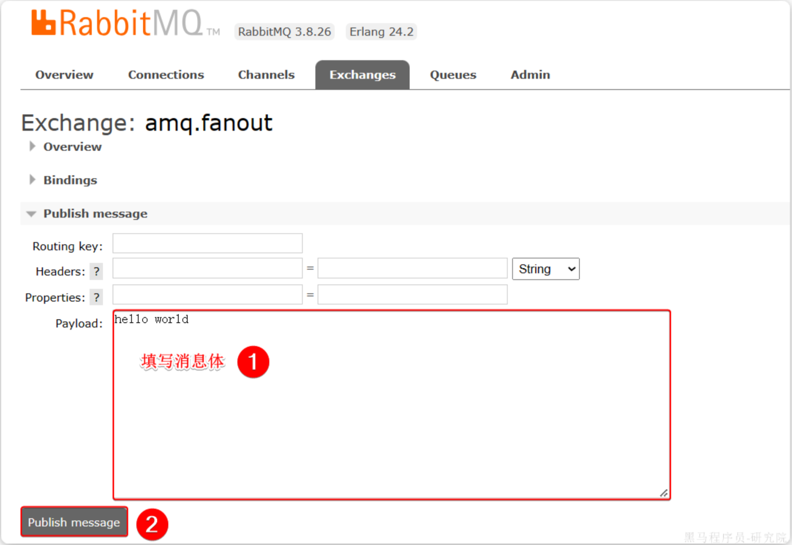

回到Queues页面，可以发现hello.queue中已经有一条消息了：

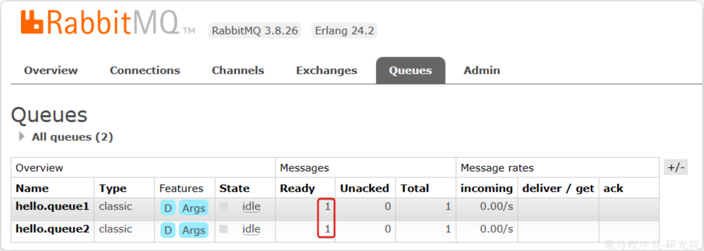

点击队列名称，进入详情页，查看队列详情，这次我们点击get message：

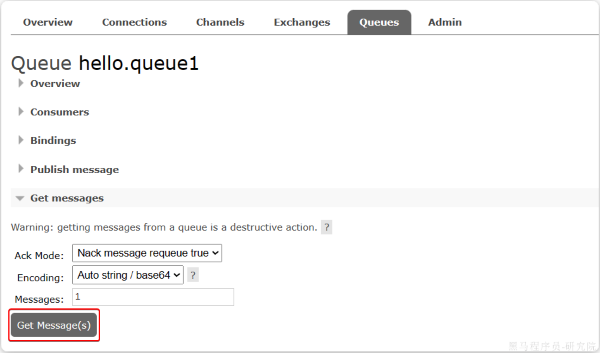

可以看到消息到达队列了：

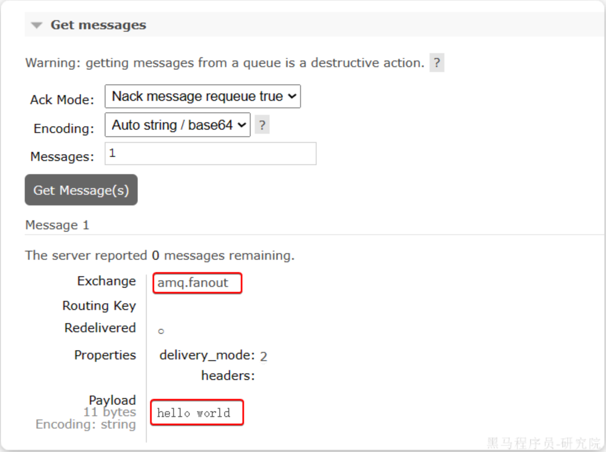

这个时候如果有消费者监听了MQ的hello.queue1或hello.queue2队列，自然就能接收到消息了。

## 2.3.数据隔离

### 2.3.1.用户管理

点击Admin选项卡，首先会看到RabbitMQ控制台的用户管理界面：

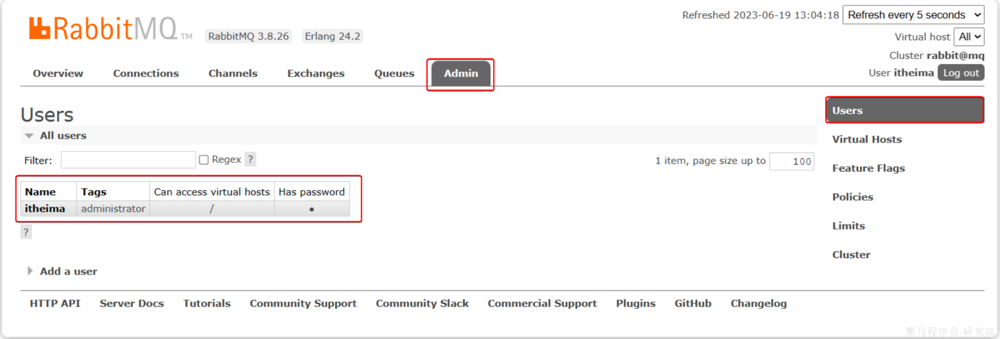

这里的用户都是RabbitMQ的管理或运维人员。目前只有安装RabbitMQ时添加的itheima这个用户。仔细观察用户表格中的字段，如下：
- Name：itheima，也就是用户名
- Tags：administrator，说明itheima用户是超级管理员，拥有所有权限
- Can access virtual host： /，可以访问的virtual host，这里的/是默认的virtual host

对于小型企业而言，出于成本考虑，我们通常只会搭建一套MQ集群，公司内的多个不同项目同时使用。这个时候为了避免互相干扰， 我们会利用virtual host的隔离特性，将不同项目隔离。一般会做两件事情：
- 给每个项目创建独立的运维账号，将管理权限分离。
- 给每个项目创建不同的virtual host，将每个项目的数据隔离。

比如，我们给黑马商城创建一个新的用户，命名为hmall：

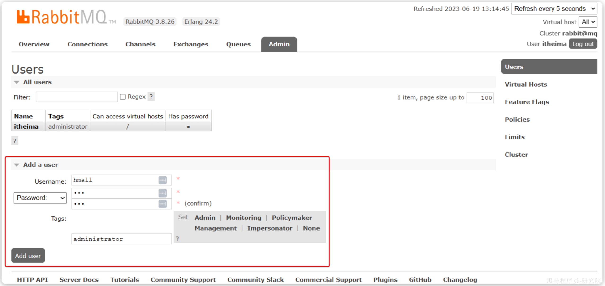

你会发现此时hmall用户没有任何virtual host的访问权限，接下来我们就来授权。

### 2.3.2.virtual host

我们先退出登录，切换到刚刚创建的hmall用户登录，然后点击Virtual Hosts菜单，进入virtual host管理页：

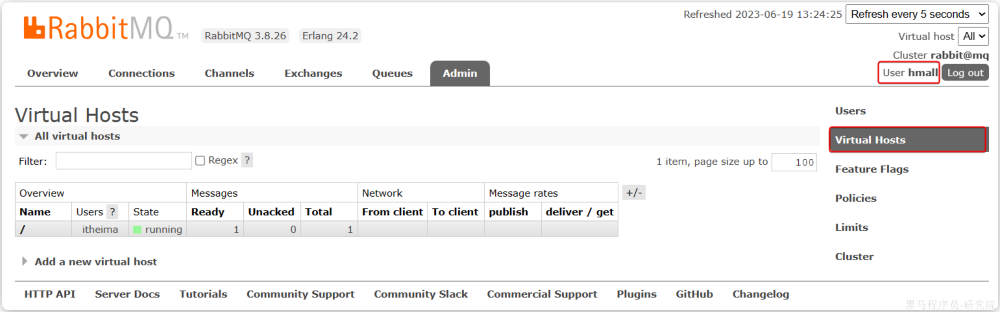

可以看到目前只有一个默认的virtual host，名字为 /。
我们可以给黑马商城项目创建一个单独的virtual host，而不是使用默认的/。

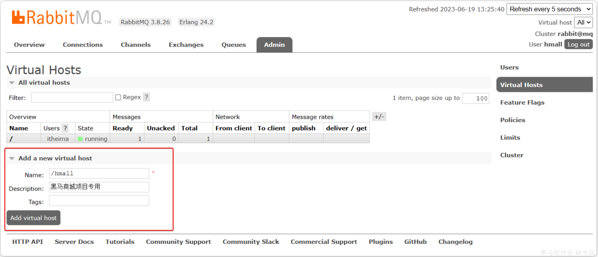

由于我们是登录hmall账户后创建的virtual host，因此回到users菜单，你会发现当前用户已经具备了对/hmall这个virtual host的访问权限了.

然后再次查看queues选项卡，会发现之前的队列已经看不到了：

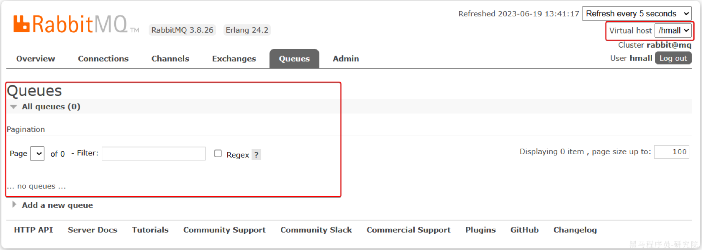

这就是基于virtual host的隔离效果。

# 3.SpringAMQP

将来我们开发业务功能的时候，肯定不会在控制台收发消息，而是应该基于编程的方式。由于RabbitMQ采用了AMQP协议，因此它具备跨语言的特性。任何语言只要遵循AMQP协议收发消息，都可以与RabbitMQ交互。并且RabbitMQ官方也提供了各种不同语言的客户端。

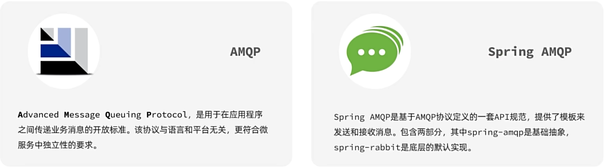

但是，RabbitMQ官方提供的Java客户端编码相对复杂，一般生产环境下我们更多会结合Spring来使用。而Spring的官方刚好基于RabbitMQ提供了这样一套消息收发的模板工具：SpringAMQP。并且还基于SpringBoot对其实现了自动装配，使用起来非常方便。

SpringAmqp的官方地址：https://spring.io/projects/spring-amqp 。

SpringAMQP提供了三个功能：
- 自动声明队列、交换机及其绑定关系
- 基于注解的监听器模式，异步接收消息
- 封装了RabbitTemplate工具，用于发送消息

## 3.1.快速入门

### 3.1.1.导入依赖

```xml
<!--AMQP依赖，包含RabbitMQ-->
<dependency>
    <groupId>org.springframework.boot</groupId>
    <artifactId>spring-boot-starter-amqp</artifactId>
</dependency>
```

### 3.1.2.消息发送

我们跳过交换机，直接向队列发送消息。也就是：
- publisher直接发送消息到队列
- 消费者监听并处理队列中的消息

我们先在控制台新建一个队列：simple.queue 。

首先配置MQ地址，在publisher服务的application.yml中添加配置：

```yaml
spring:
  rabbitmq:
    host: 192.168.150.101 # 你的虚拟机IP
    port: 5672 # 端口
    virtual-host: /hmall # 虚拟主机
    username: hmall # 用户名
    password: 123 # 密码
```

然后在publisher服务中编写测试类SpringAmqpTest，并利用RabbitTemplate实现消息发送：

```java
@SpringBootTest
public class SpringAmqpTest {

    @Autowired
    private RabbitTemplate rabbitTemplate;

    @Test
    public void testSimpleQueue() {
        // 队列名称
        String queueName = "simple.queue";
        // 消息
        String message = "hello, spring amqp!";
        // 发送消息
        rabbitTemplate.convertAndSend(queueName, message);
    }
}
```

### 3.1.3.消息接收

首先配置MQ地址，在consumer服务的application.yml中添加配置：

```yaml
spring:
  rabbitmq:
    host: 192.168.150.101 # 你的虚拟机IP
    port: 5672 # 端口
    virtual-host: /hmall # 虚拟主机
    username: hmall # 用户名
    password: 123 # 密码
```

然后在consumer服务的com.itheima.consumer.listener包中新建一个类SpringRabbitListener，代码如下：

```java
@Component
public class SpringRabbitListener {
        // 利用RabbitListener来声明要监听的队列信息
    // 将来一旦监听的队列中有了消息，就会推送给当前服务，调用当前方法，处理消息。
    // 可以看到方法体中接收的就是消息体的内容
    @RabbitListener(queues = "simple.queue")
    public void listenSimpleQueueMessage(String msg) throws InterruptedException {
        System.out.println("spring 消费者接收到消息：【" + msg + "】");
    }
}
```

先启动消费者，再发送消息即可。

## 3.2.WorkQueues模型

Work queues，任务模型。简单来说就是让多个消费者绑定到一个队列，共同消费队列中的消息。

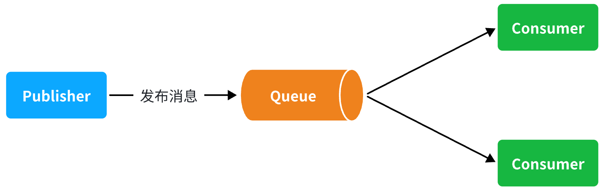

当消息处理比较耗时的时候，可能生产消息的速度会远远大于消息的消费速度。长此以往，消息就会堆积越来越多，无法及时处理。
此时就可以使用work模型，多个消费者共同处理消息处理，消息处理的速度就能大大提高了。

### 3.2.1.模拟大量消息堆积

接下来，我们就来模拟这样的场景。
首先，我们在控制台创建一个新的队列，命名为work.queue

然后我们循环发送，模拟大量消息堆积现象。
在publisher服务中的SpringAmqpTest类中添加一个测试方法

```java
@Test
public void testWorkQueue() throws InterruptedException {
    // 队列名称
    String queueName = "simple.queue";
    for (int i = 0; i < 50; i++) {
        // 发送消息，每20毫秒发送一次，相当于每秒发送50条消息
        rabbitTemplate.convertAndSend(queueName, "hello, message_" + i);
        Thread.sleep(20);
    }
}
```

要模拟多个消费者绑定同一个队列，我们在consumer服务的SpringRabbitListener中添加2个新的方法：

```java
@RabbitListener(queues = "work.queue")
public void listenWorkQueue1(String msg) throws InterruptedException {
    System.out.println("消费者1接收到消息：【" + msg + "】" + LocalTime.now());
    Thread.sleep(20);
}

@RabbitListener(queues = "work.queue")
public void listenWorkQueue2(String msg) throws InterruptedException {
    System.err.println("消费者2........接收到消息：【" + msg + "】" + LocalTime.now());
    Thread.sleep(200);
}
```

注意到这两消费者，都设置了Thead.sleep，模拟任务耗时：
- 消费者1 sleep了20毫秒，相当于每秒钟处理50个消息
- 消费者2 sleep了200毫秒，相当于每秒处理5个消息

测试注意到：消息是平均分配给每个消费者，并没有考虑到消费者的处理能力。导致1个消费者空闲，另一个消费者忙的不可开交。没有充分利用每一个消费者的能力。

### 3.2.2.能者多劳

在spring中有一个简单的配置，可以解决这个问题。我们修改consumer服务的application.yml文件，添加配置：

```yaml
spring:
  rabbitmq:
    listener:
      simple:
        prefetch: 1 # 每次只能获取一条消息，处理完成才能获取下一个消息
```

再次测试，发现：由于消费者1处理速度较快，所以处理了更多的消息；消费者2处理速度较慢，只处理了6条消息。而最终总的执行耗时也在1秒左右，大大提升。
正所谓能者多劳，这样充分利用了每一个消费者的处理能力，可以有效避免消息积压问题。

### 3.2.3.总结

Work模型的使用：
- 多个消费者绑定到一个队列，同一条消息只会被一个消费者处理
- 通过设置prefetch来控制消费者预取的消息数量

## 3.3.交换机类型

在之前的两个测试案例中，都没有交换机，生产者直接发送消息到队列。而一旦引入交换机，消息发送的模式会有很大变化：


可以看到，在订阅模型中，多了一个exchange角色，而且过程略有变化：
- Publisher：生产者，不再发送消息到队列中，而是发给交换机
- Exchange：交换机，一方面，接收生产者发送的消息。另一方面，知道如何处理消息，例如递交给某个特别队列、递交给所有队列、或是将消息丢弃。到底如何操作，取决于Exchange的类型。
- Queue：消息队列也与以前一样，接收消息、缓存消息。不过队列一定要与交换机绑定。
- Consumer：消费者，与以前一样，订阅队列，没有变化

Exchange（交换机）只负责转发消息，不具备存储消息的能力，因此如果没有任何队列与Exchange绑定，或者没有符合路由规则的队列，那么消息会丢失！

交换机的类型有四种：
- Fanout：广播，将消息交给所有绑定到交换机的队列。我们最早在控制台使用的正是Fanout交换机
- Direct：订阅，基于RoutingKey（路由key）发送给订阅了消息的队列
- Topic：通配符订阅，与Direct类似，只不过RoutingKey可以使用通配符
- Headers：头匹配，基于MQ的消息头匹配，用的较少。

## 3.4.Fanout交换机
Fanout，英文翻译是扇出，我觉得在MQ中叫广播更合适。
在广播模式下，消息发送流程是这样的：

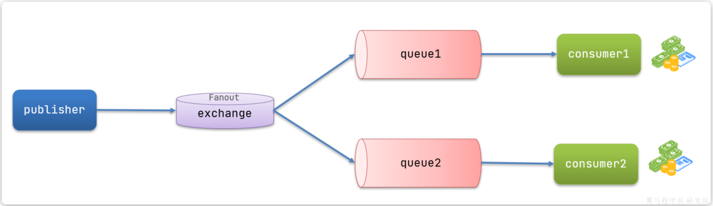

- 1）  可以有多个队列
- 2）  每个队列都要绑定到Exchange（交换机）
- 3）  生产者发送的消息，只能发送到交换机
- 4）  交换机把消息发送给绑定过的所有队列
- 5）  订阅队列的消费者都能拿到消息

### 3.4.1.消息收发

在控制台创建队列 fanout.queue1、fanout.queue2 。
然后再创建一个交换机 hmall.fanout，注意选择交换机类型为 fanout。

在publisher服务的SpringAmqpTest类中添加测试方法：

```java
@Test
public void testFanoutExchange() {
    // 交换机名称
    String exchangeName = "hmall.fanout";
    // 消息
    String message = "hello, everyone!";
    rabbitTemplate.convertAndSend(exchangeName, "", message);
}
```

> 注意：发送给交换机需要使用三个参数的重载。

在consumer服务的SpringRabbitListener中添加两个方法，作为消费者：

```java
@RabbitListener(queues = "fanout.queue1")
public void listenFanoutQueue1(String msg) {
    System.out.println("消费者1接收到Fanout消息：【" + msg + "】");
}

@RabbitListener(queues = "fanout.queue2")
public void listenFanoutQueue2(String msg) {
    System.out.println("消费者2接收到Fanout消息：【" + msg + "】");
}
```

### 3.4.2.总结

交换机的作用是什么？
- 接收publisher发送的消息
- 将消息按照规则路由到与之绑定的队列
- 不能缓存消息，路由失败，消息丢失
- FanoutExchange的会将消息路由到每个绑定的队列

## 3.5.Direct交换机

在Fanout模式中，一条消息，会被所有订阅的队列都消费。但是，在某些场景下，我们希望不同的消息被不同的队列消费。这时就要用到Direct类型的Exchange。

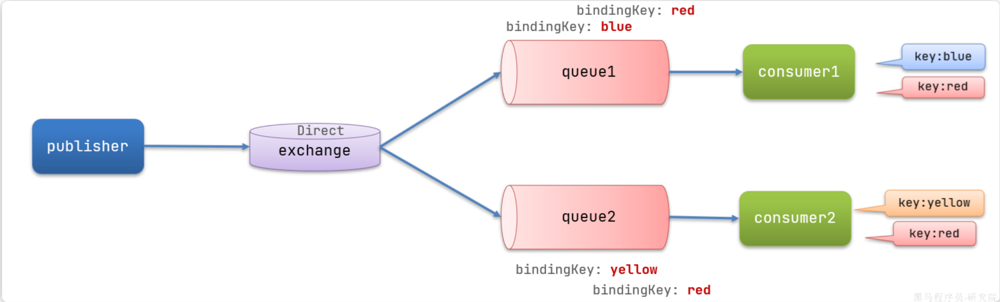

在Direct模型下：
- 队列与交换机的绑定，不能是任意绑定了，而是要指定一个RoutingKey（路由key）
- 消息的发送方在 向 Exchange发送消息时，也必须指定消息的 RoutingKey。
- Exchange不再把消息交给每一个绑定的队列，而是根据消息的Routing Key进行判断，只有队列的Routingkey与消息的 Routing key完全一致，才会接收到消息


### 3.5.1.消息收发

1.声明一个名为hmall.direct的交换机
2.声明队列direct.queue1，绑定hmall.direct，bindingKey为blud和red
3.声明队列direct.queue2，绑定hmall.direct，bindingKey为yellow和red
4.在consumer服务中，编写两个消费者方法，分别监听direct.queue1和direct.queue2 
5.在publisher中编写测试方法，向hmall.direct发送消息 

首先在控制台声明两个队列direct.queue1和direct.queue2。

然后声明一个direct类型的交换机，命名为hmall.direct，注意选择交换机类型为 direct 。

然后使用red和blue作为key，绑定direct.queue1到hmall.direct：

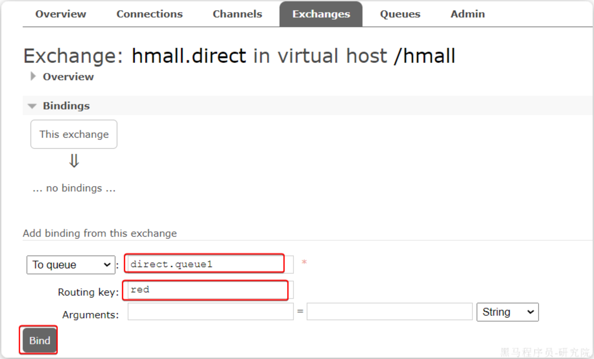

同理，使用red和yellow作为key，绑定direct.queue2到hmall.direct，步骤略，最终结果：

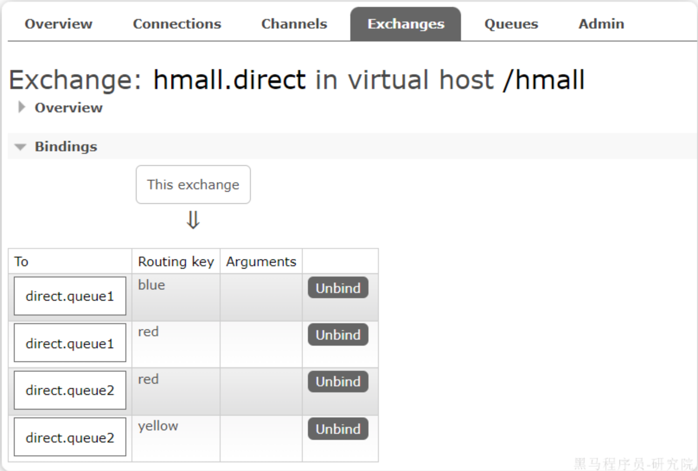

在consumer服务的SpringRabbitListener中添加方法：

```java
@RabbitListener(queues = "direct.queue1")
public void listenDirectQueue1(String msg) {
    System.out.println("消费者1接收到direct.queue1的消息：【" + msg + "】");
}

@RabbitListener(queues = "direct.queue2")
public void listenDirectQueue2(String msg) {
    System.out.println("消费者2接收到direct.queue2的消息：【" + msg + "】");
}
```

在publisher服务的SpringAmqpTest类中添加测试方法：

```java
@Test
public void testSendDirectExchange() {
    // 交换机名称
    String exchangeName = "hmall.direct";
    // 消息
    String message = "红色警报！日本乱排核废水，导致海洋生物变异，惊现哥斯拉！";
    // 发送消息
    rabbitTemplate.convertAndSend(exchangeName, "red", message);
}
```

经测试，由于使用的red这个key，所以两个消费者都收到了消息。切换为使用blue作为key则只有一个消费者收到了消息。

### 3.5.2.总结

Direct交换机与Fanout交换机的差异
- Fanout交换机将消息路由给每一个与之绑定的队列
- Direct交换机根据RoutingKey判断路由给哪个队列
- 如果多个队列具有相同的RoutingKey，则与Fanout功能类似

## 3.6.Topic交换机

Topic类型的Exchange与Direct相比，都是可以根据RoutingKey把消息路由到不同的队列。
只不过Topic类型Exchange可以让队列在绑定BindingKey 的时候使用通配符。

BindingKey 一般都是有一个或多个单词组成，多个单词之间以.分割，例如： item.insert

通配符规则：
- #：匹配一个或多个词
- *：匹配不多不少恰好1个词

举例：
- item.#：能够匹配item.spu.insert 或者 item.spu
- item.*：只能匹配item.spu

### 3.6.1.消息收发

首先，在控制台按照图示例子创建队列、交换机，并利用通配符绑定队列和交换机。此处步骤略。最终结果如下：

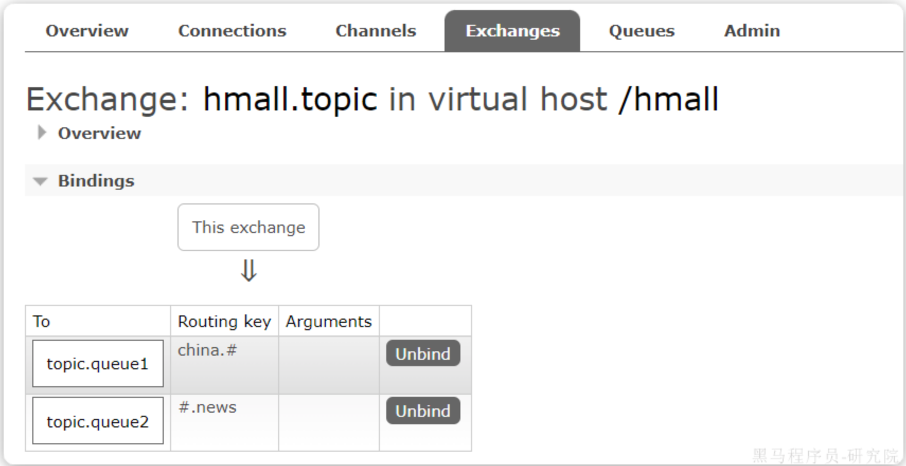

在consumer服务的SpringRabbitListener中添加方法：

```java
@RabbitListener(queues = "topic.queue1")
public void listenTopicQueue1(String msg){
    System.out.println("消费者1接收到topic.queue1的消息：【" + msg + "】");
}

@RabbitListener(queues = "topic.queue2")
public void listenTopicQueue2(String msg){
    System.out.println("消费者2接收到topic.queue2的消息：【" + msg + "】");
}
```

在publisher服务的SpringAmqpTest类中添加测试方法：

```java
@Test
public void testSendTopicExchange() {
    // 交换机名称
    String exchangeName = "hmall.topic";
    // 消息
    String message = "喜报！孙悟空大战哥斯拉，胜!";
    // 发送消息
    rabbitTemplate.convertAndSend(exchangeName, "china.news", message);
}
```

### 3.6.2.总结

Direct交换机与Topic交换机的差异
- Topic交换机接收的消息RoutingKey必须是多个单词，以 . 分割
- Topic交换机与队列绑定时的bindingKey可以指定通配符
- #：代表0个或多个词
- *：代表1个词

## 3.7.声明队列和交换机

在之前我们都是基于RabbitMQ控制台来创建队列、交换机。但是在实际开发时，队列和交换机是程序员定义的，将来项目上线，又要交给运维去创建。那么程序员就需要把程序中运行的所有队列和交换机都写下来，交给运维。在这个过程中是很容易出现错误的。

因此推荐的做法是由程序启动时检查队列和交换机是否存在，如果**不存在自动创建**。

### 3.7.1.基本API

SpringAMQP提供了几个类，用来声明队列、交换机及其绑定关系：

Queue：用于声明队列，可以用工厂类QueueBuilder构建

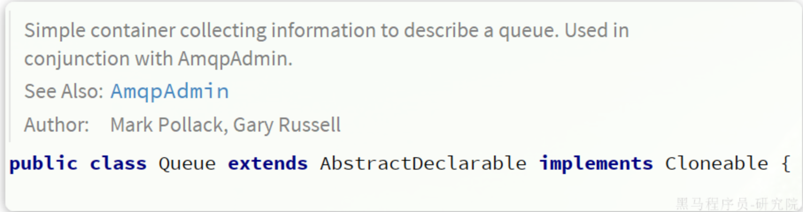

SpringAMQP还提供了一个Exchange接口，来表示所有不同类型的交换机：

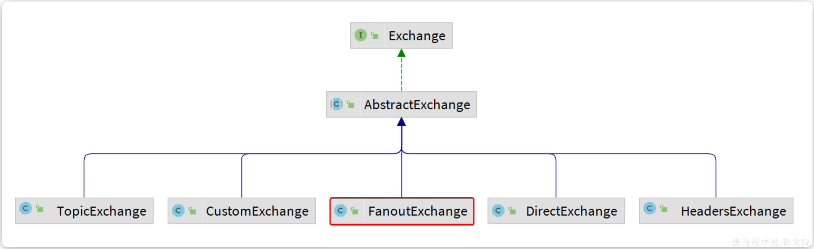

我们可以自己创建队列和交换机，不过SpringAMQP还提供了ExchangeBuilder来简化这个过程:

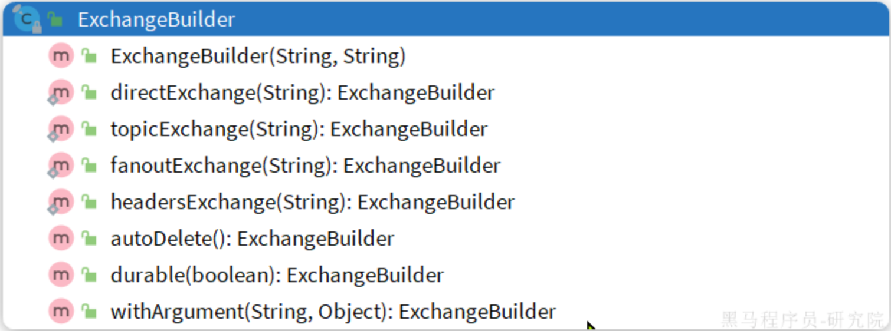

而在绑定队列和交换机时，则需要使用BindingBuilder来创建Binding对象：


### 3.7.2.fanout示例

在consumer中创建一个类，声明队列和交换机：

```java
@Configuration
public class FanoutConfig {
    /**
     * 声明交换机
     * @return Fanout类型交换机
     */
    @Bean
    public FanoutExchange fanoutExchange(){
        return new FanoutExchange("hmall.fanout");
    }

    // 第1个队列
    @Bean
    public Queue fanoutQueue1(){
        return new Queue("fanout.queue1");
    }

    // 绑定队列和交换机
    @Bean
    public Binding bindingQueue1(Queue fanoutQueue1, FanoutExchange fanoutExchange){
        return BindingBuilder.bind(fanoutQueue1).to(fanoutExchange);
    }

    // 第2个队列
    @Bean
    public Queue fanoutQueue2(){
        return new Queue("fanout.queue2");
    }

    // 绑定队列和交换机
    @Bean
    public Binding bindingQueue2(Queue fanoutQueue2, FanoutExchange fanoutExchange){
        return BindingBuilder.bind(fanoutQueue2).to(fanoutExchange);
    }
}
```

### 3.7.3.direct示例

direct模式由于要绑定多个KEY，会非常麻烦，每一个Key都要编写一个binding：

```java
@Configuration
public class DirectConfig {

    /**
     * 声明交换机
     * @return Direct类型交换机
     */
    @Bean
    public DirectExchange directExchange(){
        return ExchangeBuilder.directExchange("hmall.direct").build();
    }

    // 第1个队列
    @Bean
    public Queue directQueue1(){
        return new Queue("direct.queue1");
    }

    // 绑定队列1和交换机
    @Bean
    public Binding bindingQueue1WithRed(Queue directQueue1, DirectExchange directExchange){
        return BindingBuilder.bind(directQueue1).to(directExchange).with("red");
    }

    // 绑定队列1和交换机
    @Bean
    public Binding bindingQueue1WithBlue(Queue directQueue1, DirectExchange directExchange){
        return BindingBuilder.bind(directQueue1).to(directExchange).with("blue");
    }

    // 第2个队列
    @Bean
    public Queue directQueue2(){
        return new Queue("direct.queue2");
    }

    // 绑定队列2和交换机
    @Bean
    public Binding bindingQueue2WithRed(Queue directQueue2, DirectExchange directExchange){
        return BindingBuilder.bind(directQueue2).to(directExchange).with("red");
    }

    // 绑定队列2和交换机
    @Bean
    public Binding bindingQueue2WithYellow(Queue directQueue2, DirectExchange directExchange){
        return BindingBuilder.bind(directQueue2).to(directExchange).with("yellow");
    }
}
```

### 3.7.4.基于注解声明

基于@Bean的方式声明队列和交换机比较麻烦，Spring还提供了基于注解方式来声明。

例如，我们同样声明Direct模式的交换机和队列：

```java
@RabbitListener(bindings = @QueueBinding(
    value = @Queue(name = "direct.queue1"),
    exchange = @Exchange(name = "hmall.direct", type = ExchangeTypes.DIRECT),
    key = {"red", "blue"}
))
public void listenDirectQueue1(String msg){
    System.out.println("消费者1接收到direct.queue1的消息：【" + msg + "】");
}

@RabbitListener(bindings = @QueueBinding(
    value = @Queue(name = "direct.queue2"),
    exchange = @Exchange(name = "hmall.direct", type = ExchangeTypes.DIRECT),
    key = {"red", "yellow"}
))
public void listenDirectQueue2(String msg){
    System.out.println("消费者2接收到direct.queue2的消息：【" + msg + "】");
}
```

再试试Topic模式：

```java
@RabbitListener(bindings = @QueueBinding(
    value = @Queue(name = "topic.queue1"),
    exchange = @Exchange(name = "hmall.topic", type = ExchangeTypes.TOPIC),
    key = "china.#"
))
public void listenTopicQueue1(String msg){
    System.out.println("消费者1接收到topic.queue1的消息：【" + msg + "】");
}

@RabbitListener(bindings = @QueueBinding(
    value = @Queue(name = "topic.queue2"),
    exchange = @Exchange(name = "hmall.topic", type = ExchangeTypes.TOPIC),
    key = "#.news"
))
public void listenTopicQueue2(String msg){
    System.out.println("消费者2接收到topic.queue2的消息：【" + msg + "】");
}
```

## 3.8.消息转换器

Spring的消息发送代码接收的消息体是一个Object：

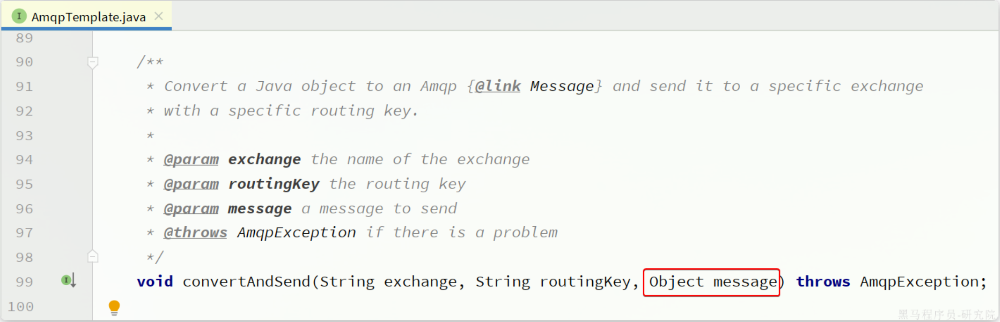

而在数据传输时，它会把你发送的消息序列化为字节发送给MQ，接收消息的时候，还会把字节反序列化为Java对象。
只不过，默认情况下Spring采用的序列化方式是JDK序列化。众所周知，JDK序列化存在下列问题：
- 数据体积过大
- 有安全漏洞
- 可读性差

我们希望消息体的体积更小、可读性更高，因此可以使用JSON方式来做序列化和反序列化。

在publisher和consumer两个服务中都引入依赖：

```xml
<dependency>
    <groupId>com.fasterxml.jackson.dataformat</groupId>
    <artifactId>jackson-dataformat-xml</artifactId>
    <version>2.9.10</version>
</dependency>
```

> 注意，如果项目中引入了spring-boot-starter-web依赖，则无需再次引入Jackson依赖。

配置消息转换器，在publisher和consumer两个服务的配置类中添加一个Bean即可：

```java
@Bean
public MessageConverter messageConverter(){
    // 1.定义消息转换器
    Jackson2JsonMessageConverter jackson2JsonMessageConverter = new Jackson2JsonMessageConverter();
    // 2.配置自动创建消息id，用于识别不同消息，也可以在业务中基于ID判断是否是重复消息
    jackson2JsonMessageConverter.setCreateMessageIds(true);
    return jackson2JsonMessageConverter;
}
```

> 注意：配置了消息转换器后，发送数据用什么格式，接收消息也用什么格式。


