[toc]

# 做项目的额外收获

## 1.项目的 pom.xml 中添加 maven 镜像

```java
<?xml version="1.0" encoding="UTF-8"?>
<project xmlns="http://maven.apache.org/POM/4.0.0"
         xmlns:xsi="http://www.w3.org/2001/XMLSchema-instance"
         xsi:schemaLocation="http://maven.apache.org/POM/4.0.0 http://maven.apache.org/xsd/maven-4.0.0.xsd">
    <modelVersion>4.0.0</modelVersion>

    <!-- ...略... -->

    <!-- 添加华为云、阿里云 maven 中央仓库，提升依赖下载速度 -->
    <repositories>
        <repository>
            <id>huaweicloud</id>
            <name>huawei</name>
            <url>https://mirrors.huaweicloud.com/repository/maven/</url>
        </repository>
        <repository>
            <id>aliyunmaven</id>
            <name>aliyun</name>
            <url>https://maven.aliyun.com/repository/public</url>
        </repository>
    </repositories>

</project>
```

## 2. Maven pom.xml 的 \<dependencyManagement\> 标签

在 Maven 的 pom.xml 中，\<dependencyManagement\> 标签用于统一管理依赖的版本，但它本身并不会将依赖实际引入到项目中。

    它的主要作用是：
    - 集中声明: 在父 pom 文件中声明依赖及其版本号。
    - 版本统一: 确保所有子模块在使用该依赖时都使用统一的版本，避免版本冲突。

    简单来说，<dependencyManagement> 只负责“声明和管理”，而子模块的 <dependencies> 才负责“引入和使用”。

## 3.Druid 数据库连接池配置

依赖：

```xml
<!-- MySQL 驱动 -->
<dependency>
    <groupId>mysql</groupId>
    <artifactId>mysql-connector-java</artifactId>
</dependency>

<!-- Druid 数据库连接池 -->
<dependency>
    <groupId>com.alibaba</groupId>
    <artifactId>druid-spring-boot-3-starter</artifactId>
</dependency>
```

配置：

```yaml
spring:
  datasource:
    driver-class-name: com.mysql.cj.jdbc.Driver # 指定数据库驱动类
    # 数据库连接信息
    url: jdbc:mysql://192.168.117.128:3306/rednote?useUnicode=true&characterEncoding=utf-8&autoReconnect=true&useSSL=false&serverTimezone=Asia/Shanghai&allowPublicKeyRetrieval=true
    username: root # 数据库用户名
    password: 123456 # 数据库密码
    type: com.alibaba.druid.pool.DruidDataSource
    druid: # Druid 连接池
      initial-size: 5 # 初始化连接池大小
      min-idle: 5 # 最小连接池数量
      max-active: 20 # 最大连接池数量
      max-wait: 60000 # 连接时最大等待时间（单位：毫秒）
      test-while-idle: true
      time-between-eviction-runs-millis: 60000 # 配置多久进行一次检测，检测需要关闭的连接（单位：毫秒）
      min-evictable-idle-time-millis: 300000 # 配置一个连接在连接池中最小生存的时间（单位：毫秒）
      max-evictable-idle-time-millis: 900000 # 配置一个连接在连接池中最大生存的时间（单位：毫秒）
      validation-query: SELECT 1 FROM DUAL # 配置测试连接是否可用的查询 sql
      test-on-borrow: false
      test-on-return: false
      pool-prepared-statements: false
      web-stat-filter:
        enabled: true
      stat-view-servlet:
        enabled: true
        url-pattern: /druid/* # 配置监控后台访问路径
        login-username: admin # 配置监控后台登录的用户名、密码
        login-password: admin
      filter:
        stat:
          enabled: true
          log-slow-sql: true # 开启慢 sql 记录
          slow-sql-millis: 2000 # 若执行耗时大于 2s，则视为慢 sql
          merge-sql: true
        wall: # 防火墙
          config:
            multi-statement-allow: true
```

## 4.数据库密码加密

**Druid 内置工具加密密码**

通过 Druid 内置的密码加密工具 ConfigTools，来对明文密码进行加密处理。

```java
void encodePassword() {
    // 你的密码
    String password = "123456";
    String[] arr = ConfigTools.genKeyPair(512);

    // 私钥
    log.info("privateKey: {}", arr[0]);
    // 公钥
    log.info("publicKey: {}", arr[1]);

    // 通过私钥加密密码
    String encodePassword = ConfigTools.encrypt(arr[0], password);
    log.info("password: {}", encodePassword);
}
```

控制台输入如下：

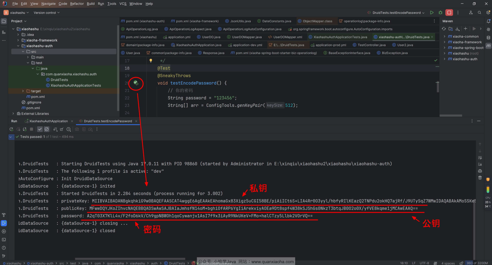

**配置加密后的密码**

接下来，编辑 applicaiton-dev.yml 文件，配置密码加密相关配置，如下图标注所示：


核心配置如下：

```yaml
spring:
  datasource:
    # 省略...
    password: A2qT03X7KlL4v/F2foD6kV/Ch9gpNBWOh1qoCywanjv1AsI7f9x3iAyR9NkUKeV+FMo+halCTzy5Llbk2VOrVQ== # 数据库密码
    type: com.alibaba.druid.pool.DruidDataSource
    druid: # Druid 连接池
      # 省略...
      connectionProperties: config.decrypt=true;config.decrypt.key=MFwwDQYJKoZIhvcNAQEBBQADSwAwSAJBAIaJmhsfN14oM+bghiOfARP6YgIiArekviyAOEa9Dt8spf4W38kSJShGs0NkzT3btqJB0O2o0X/yfVE8kqme1jMCAwEAAQ==
      # 省略...
      filter:
        config:
          enabled: true
        # 省略...
```

> 解释一下上述配置项：
> 
> 1.password: A2qT03X7KlL4v/F2foD6kV/Ch9gpNBWOh1qoCywanjv1AsI7f9x3iAyR9NkUKeV+FMo> +halCTzy5Llbk2VOrVQ==：这里的密码改为加密后的密码。
> 
> 2.connectionProperties: config.decrypt=true;config.decrypt.> key=MFwwDQYJKoZIhvcNAQEBBQADSwAwSAJBAIaJmhsfN14oM> +bghiOfARP6YgIiArekviyAOEa9Dt8spf4W38kSJShGs0NkzT3btqJB0O2o0X/yfVE8kqme1jMCAwEAAQ==：这里配置了连接> 属性，其中 config.decrypt=true 表示开启密码解密功能，config.decrypt.key 是用于解密的密钥，即上面单元测试> 生成公钥。在 Druid 连接池中，如果我们的密码已经经过了加密处理，就需要在连接属性中配置解密相关的参数，以便 > Druid 能够正确解密密码，然后连接到数据库。
> 
> 3.filter.config.enabled: true：这里配置了 Druid 连接池的 filter，其中 config 是一个配置项，enabled: true 表示开启该配置项。这个配置项通常用于配置 Druid 连接池的一些额外功能，比如密码解密等。

## 5.@RequestBody 不支持 LocalDateTime

**User 实体类**

```java
@Data
@AllArgsConstructor
@NoArgsConstructor
@Builder
public class User {
    /**
     * 昵称
     */
    private String nickName;

    /**
     * 创建时间
     */
    private LocalDateTime createTime;
}
```

通过 Apipost 来请求一下 /test2 接口， JSON 入参如下：

```json
{
    "nickName" : "犬小哈",
    "createTime": "2024-05-14 12:00:00"
}
```

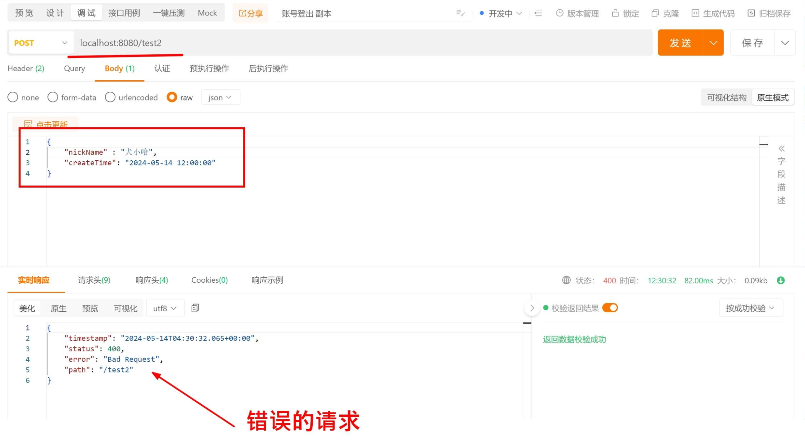

再来看看后端控制台信息，有如下一行警告信息：

```bash
JSON parse error: Cannot deserialize value of type `java.time.LocalDateTime` from String "2024-05-14 12:00:00": Failed to deserialize java.time.LocalDateTime: (java.time.format.DateTimeParseException) Text '2024-05-14 12:00:00' could not be parsed at index 10]
```

提示我们 JSON 解析错误，无法将 2024-05-14 12:00:00 字符串解析为 java.time.LocalDateTime 日期类。

**自定义 Jackson 配置**

为了解决上述问题，需要自定义 Jackson 配置类。

```java
@Configuration
public class JacksonConfig {

    @Bean
    public ObjectMapper objectMapper() {
        // 初始化一个 ObjectMapper 对象，用于自定义 Jackson 的行为
        ObjectMapper objectMapper = new ObjectMapper();

        // 忽略未知属性
        objectMapper.configure(DeserializationFeature.FAIL_ON_UNKNOWN_PROPERTIES, false);
        objectMapper.configure(SerializationFeature.FAIL_ON_EMPTY_BEANS, false);
        
        // 设置凡是为 null 的字段，返参中均不返回，请根据项目组约定是否开启
        // objectMapper.setSerializationInclusion(JsonInclude.Include.NON_NULL);

        // 设置时区
        objectMapper.setTimeZone(TimeZone.getTimeZone("Asia/Shanghai"));

        // JavaTimeModule 用于指定序列化和反序列化规则
        JavaTimeModule javaTimeModule = new JavaTimeModule();

        // 支持 LocalDateTime、LocalDate、LocalTime
        javaTimeModule.addSerializer(LocalDateTime.class, new LocalDateTimeSerializer(DateTimeFormatter.ofPattern("yyyy-MM-dd HH:mm:ss")));
        javaTimeModule.addDeserializer(LocalDateTime.class, new LocalDateTimeDeserializer(DateTimeFormatter.ofPattern("yyyy-MM-dd HH:mm:ss")));
        javaTimeModule.addSerializer(LocalDate.class, new LocalDateSerializer(DateTimeFormatter.ofPattern("yyyy-MM-dd")));
        javaTimeModule.addDeserializer(LocalDate.class, new LocalDateDeserializer(DateTimeFormatter.ofPattern("yyyy-MM-dd")));
        javaTimeModule.addSerializer(LocalTime.class, new LocalTimeSerializer(DateTimeFormatter.ofPattern("HH:mm:ss")));
        javaTimeModule.addDeserializer(LocalTime.class, new LocalTimeDeserializer(DateTimeFormatter.ofPattern("HH:mm:ss")));
        // 支持 YearMonth
        javaTimeModule.addSerializer(YearMonth.class, new YearMonthSerializer(DateTimeFormatter.ofPattern("yyyy-MM")));
        javaTimeModule.addDeserializer(YearMonth.class, new YearMonthDeserializer(DateTimeFormatter.ofPattern("yyyy-MM")));

        objectMapper.registerModule(javaTimeModule);

        return objectMapper;
    }
}
```

重启项目再次测试接口，出入参实体类中就能支持定义 LocalDateTime 日期 API 了。


## 6.Spring Boot 3.x 整合 Logback 日志框架（支持异步写入）

### 6.1 整合日志

在 /resources 资源目录下，创建名为 logback-spring.xml 日志配置文件。

文件内容如下：

```xml
<configuration>
    <!-- 引用 Spring Boot 的 logback 基础配置 -->
    <include resource="org/springframework/boot/logging/logback/defaults.xml" />

    <!-- 应用名称 需要修改部分为 value="" -->
    <property scope="context" name="appName" value="auth"/>
    <!-- 自定义日志输出路径，以及日志名称前缀 -->
    <property name="LOG_FILE" value="./logs/${appName}.%d{yyyy-MM-dd}"/>
    <!-- 每行日志输出的格式 -->
    <property name="LOG_PATTERN" value="%d{yyyy-MM-dd HH:mm:ss.SSS} [%thread] %-5level %logger{50} - %msg%n"/>

    <!-- 文件输出 -->
    <appender name="FILE" class="ch.qos.logback.core.rolling.RollingFileAppender">
        <rollingPolicy class="ch.qos.logback.core.rolling.SizeAndTimeBasedRollingPolicy">
            <!-- 日志文件的命名格式 -->
            <fileNamePattern>${LOG_FILE}-%i.log</fileNamePattern>
            <!-- 保留 30 天的日志文件 -->
            <maxHistory>30</maxHistory>
            <!-- 单个日志文件最大大小 -->
            <maxFileSize>10MB</maxFileSize>
            <!-- 日志文件的总大小，0 表示不限制 -->
            <totalSizeCap>0</totalSizeCap>
            <!-- 重启服务时，是否清除历史日志，不推荐清理 -->
            <cleanHistoryOnStart>false</cleanHistoryOnStart>
        </rollingPolicy>
        <encoder class="ch.qos.logback.classic.encoder.PatternLayoutEncoder">
            <pattern>${LOG_PATTERN}</pattern>
            <charset>UTF-8</charset>
        </encoder>
    </appender>

    <!-- 本地 dev 开发环境 -->
    <springProfile name="dev">
        <include resource="org/springframework/boot/logging/logback/console-appender.xml" />
        <root level="INFO">
            <appender-ref ref="CONSOLE"/> <!-- 输出控制台日志 -->
            <appender-ref ref="FILE"/> <!-- 打印日志到文件中。PS: 本地环境下，如果不想打印日志到文件，可注释掉此行 -->
        </root>
    </springProfile>

    <!-- 其它环境 -->
    <springProfile name="prod">
        <include resource="org/springframework/boot/logging/logback/console-appender.xml" />
        <root level="INFO">
            <appender-ref ref="FILE"/> <!-- 生产环境下，仅打印日志到文件中 -->
        </root>
    </springProfile>

</configuration>
```

> 拓展小知识 : 如果你想同时设置多个环境，假设咱们除了本地开发环境、生产环境外，还有个 test 测试环境， 也仅需>要输出日志到文件。则可以配置如下，通过逗号 , 分隔开来就行：
> 
> ```xml
> <springProfile name="test,prod">
>     // 省略...
> </springProfile>
> ```

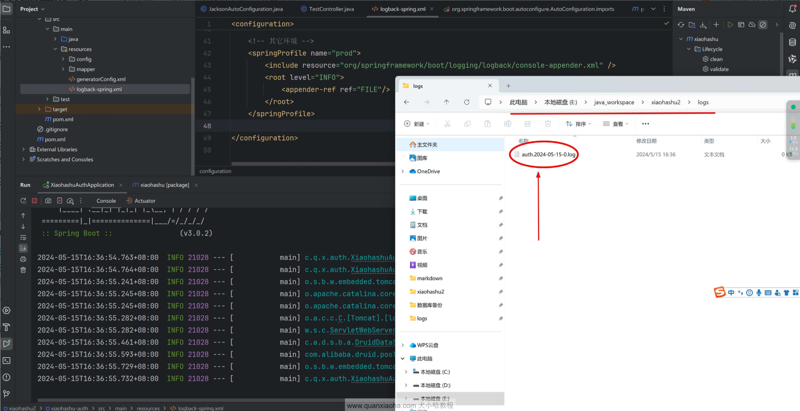

项目启动成功后，如上图所示，进入到项目的 /logs 文件夹下，可以看到日志输出是 ok 的。

### 6.2 异步日志

异步打印日志（Asynchronous Logging）是一种日志记录方式，它将日志写入操作放在一个单独的线程中执行，而不是在主线程中进行。这意味着日志写入的过程不会阻塞主线程的执行，主线程可以继续执行其余的业务逻辑，增强了应用的性能和响应速度。

为什么需要异步打印日志？

1. 性能提升：同步日志记录在高并发情况下会显著影响应用性能，因为每一次日志写入操作都可能导致磁盘 I/O 操作，主线程必须等待这些操作完成才能继续执行。异步日志记录将这些操作放在单独的线程中进行，避免了主线程的阻塞，提高了整体性能。

2. 响应时间：异步日志记录可以减少应用的响应时间，尤其是在需要记录大量日志信息的时候。用户请求得到快速响应，而日志记录在后台处理。

3. 资源利用：通过异步日志记录，应用可以更有效地利用 CPU 资源。同步日志记录可能导致线程频繁等待 I/O 操作完成，而异步记录可以让这些线程去执行其他任务，提高资源利用率。

4. 系统稳定性：在极端情况下（例如，日志量非常大时），同步日志记录可能会导致应用出现性能瓶颈甚至崩溃。异步日志记录通过缓冲和队列机制，能够更好地应对突发的大量日志请求，增强系统稳定性。

Logback 提供了 AsyncAppender 来支持异步日志记录。通过 AsyncAppender 可以将日志事件发送到一个队列中，并由一个独立的线程池来处理这些日志事件。编辑 logback-spring.xml 文件，添加配置如下：

```xml
// 省略...

<!-- 文件输出 -->
<appender name="FILE" class="ch.qos.logback.core.rolling.RollingFileAppender">
    // 省略...
</appender>

<!-- 异步写入日志，提升性能 -->
<appender name="ASYNC_FILE" class="ch.qos.logback.classic.AsyncAppender">
    <!-- 是否丢弃日志, 0 表示不丢弃。默认情况下，如果队列满 80%, 会丢弃 TRACE、DEBUG、INFO 级别的日志 -->
    <discardingThreshold>0</discardingThreshold>
    <!-- 队列大小。默认值为 256 -->
    <queueSize>256</queueSize>
    <appender-ref ref="FILE"/>
</appender>

<!-- 本地 dev 开发环境 -->
<springProfile name="dev">
    <include resource="org/springframework/boot/logging/logback/console-appender.xml" />
    <root level="INFO">
        <appender-ref ref="CONSOLE"/> <!-- 输出控制台日志 -->
        <appender-ref ref="ASYNC_FILE"/> <!-- 打印日志到文件中。PS: 本地环境下，如果不想打印日志到文件，可注释掉此行 -->
    </root>
</springProfile>

<!-- 其它环境 -->
<springProfile name="prod">
    <include resource="org/springframework/boot/logging/logback/console-appender.xml" />
    <root level="INFO">
        <appender-ref ref="ASYNC_FILE"/> <!-- 生产环境下，仅打印日志到文件中 -->
    </root>
</springProfile>

// 省略...
```

解释一下修改的地方，主要添加了一个名称为 ASYNC_FILE 异步输出日志的 Appender：
- AsyncAppender 使用内部队列来异步处理日志事件。
- queueSize：队列的大小。
- discardingThreshold：是否丢弃日志, 0 表示不丢弃。

最后，将各个环境中的 FILE 更改为 ASYNC_FILE 异步写入日志。

## 7.解决子模块单独打包失败问题

解决 Maven 多模块工程中，如果在父 pom 中定义了统一版本号 revision ，单独对某个子模块执行 clean package 打包失败的问题。

### 7.1问题复现

首先，对父类 pom 执行 clean package 打包命令，如下图所示：

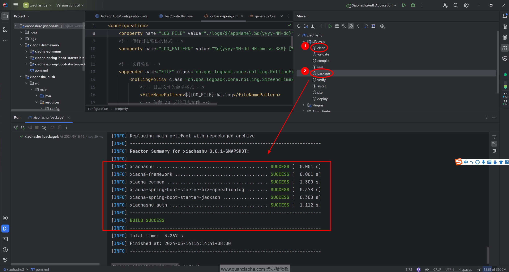

可以看到，控制台中提示 BUILD SUCCESS , 项目构建成功，进入到认证服务的 /target 目录下，确实是打包成功了

接下来，打开 IDEA 右侧栏，对 xiaohashu-auth 子模块单独进行打包：

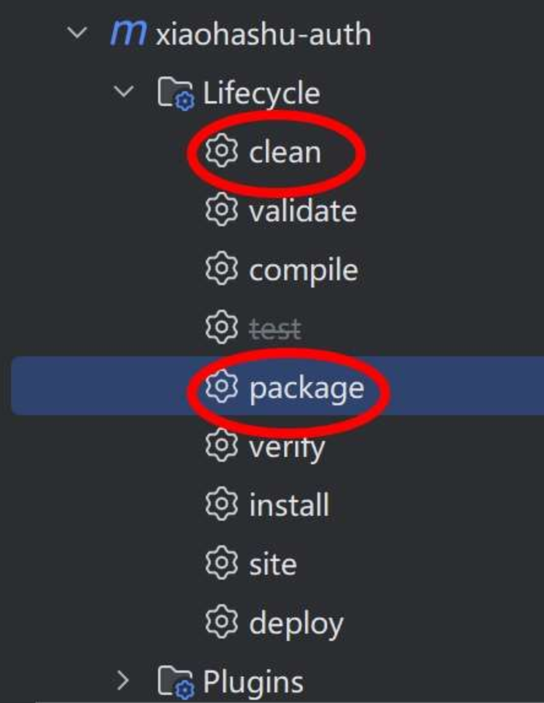

控制台会获得如下报错信息：

```bash
[INFO] Scanning for projects...
[INFO] 
[INFO] -------------------< com.quanxiaoha:xiaohashu-auth >--------------------
[INFO] Building xiaohashu-auth 0.0.1-SNAPSHOT
[INFO]   from pom.xml
[INFO] --------------------------------[ jar ]---------------------------------
Downloading from huaweicloud: https://mirrors.huaweicloud.com/repository/maven/com/quanxiaoha/xiaoha-framework/$%7Brevision%7D/xiaoha-framework-$%7Brevision%7D.pom
[INFO] ------------------------------------------------------------------------
[INFO] BUILD FAILURE
[INFO] ------------------------------------------------------------------------
[INFO] Total time:  0.776 s
[INFO] Finished at: 2024-05-16T16:22:17+08:00
[INFO] ------------------------------------------------------------------------
[ERROR] Failed to execute goal on project xiaohashu-auth: Could not resolve dependencies for project com.quanxiaoha:xiaohashu-auth:jar:0.0.1-SNAPSHOT: Failed to collect dependencies at com.quanxiaoha:xiaoha-common:jar:0.0.1-SNAPSHOT: Failed to read artifact descriptor for com.quanxiaoha:xiaoha-common:jar:0.0.1-SNAPSHOT: The following artifacts could not be resolved: com.quanxiaoha:xiaoha-framework:pom:${revision} (absent): Could not transfer artifact com.quanxiaoha:xiaoha-framework:pom:${revision} from/to huaweicloud (https://mirrors.huaweicloud.com/repository/maven/): status code: 400, reason phrase:  (400) -> [Help 1]
[ERROR] 
[ERROR] To see the full stack trace of the errors, re-run Maven with the -e switch.
[ERROR] Re-run Maven using the -X switch to enable full debug logging.
[ERROR] 
[ERROR] For more information about the errors and possible solutions, please read the following articles:
[ERROR] [Help 1] http://cwiki.apache.org/confluence/display/MAVEN/DependencyResolutionException

Process finished with exit code 1
```

打包失败原因:

```bash
Could not transfer artifact com.quanxiaoha:xiaoha-framework:pom:${revision} from/to huaweicloud (https://mirrors.huaweicloud.com/repository/maven/)
```

在多模块项目中，如果使用到 revision 占位符进行版本号管理。此时，如果单独打包子项目时，是不能将 ${revision} 替换成父 pom 中的版本号的，最终打包时，就会提示找不到依赖。

### 7.2 引入 flatten-maven-plugin 插件

flatten-maven-plugin 将项目的 pom.xml 文件转换成一个更简单的扁平版本，包含消费者所需的关键信息。这个扁平的 POM 文件会去除构建相关的配置和不必要的细节，留下一个更干净、简单的 POM，便于理解和管理。

使用该插件有如下优势：

- **简化 POM 文件**： 扁平化后的 POM 去除了构建插件、配置文件等构建过程中的不必要细节，使其更简单、更易于下游项目消费。

- **提高可重复性**： 通过扁平化，确保消费者获得一致且可重复的项目依赖和元数据，避免构建时的变异。

- **减少大小和复杂性**： 该插件有助于减少 POM 文件的大小和复杂性，便于理解和排除故障。对于包含复杂构建配置的大型项目尤其有用。

- **优化分发**： 在将项目分发到 Maven 中央仓库或其他仓库时，扁平化 POM 确保只包含必要的信息，避免由于构建时配置导致的潜在问题。

#### 7.2.1 开始整合

编辑项目最外层的 pom.xml 文件，声明 flatten-maven-plugin 版本号并添加该插件：

```xml
<properties>
    // 省略...
    
    <flatten-maven-plugin.version>1.5.0</flatten-maven-plugin.version>

    // 省略...
</properties>

// 省略...

<build>
    <!-- 统一插件管理 -->
    <pluginManagement>
        <plugins>
            // 省略...
        </plugins>
    </pluginManagement>

    <plugins>
        <!-- 统一 revision 版本, 解决子模块打包无法解析 ${revision} 版本号问题 -->
        <plugin>
            <groupId>org.codehaus.mojo</groupId>
            <artifactId>flatten-maven-plugin</artifactId>
            <version>${flatten-maven-plugin.version}</version>
            <configuration>
                <flattenMode>resolveCiFriendliesOnly</flattenMode>
                <updatePomFile>true</updatePomFile>
            </configuration>
            <executions>
                <execution>
                    <id>flatten</id>
                    <phase>process-resources</phase>
                    <goals>
                        <goal>flatten</goal>
                    </goals>
                </execution>
                <execution>
                    <id>flatten.clean</id>
                    <phase>clean</phase>
                    <goals>
                        <goal>clean</goal>
                    </goals>
                </execution>
            </executions>
        </plugin>
    </plugins>
</build>
```

> 注意：这里 flatten-maven-plugin 是定义在 pluginManagement 节点外的，子模块无需再手动引入，直接让其全局生效。

插件添加完毕后，先对父 pom 执行 clean install 安装操作，注意是执行 install，先将子模块都安装到本地 Maven 仓库中，防止后续打包时，相关模块从远程 Maven 仓库拉取。

可以看到，对应各模块 pom.xml 文件的同级目录下，额外生成了一个 .flattened-pom.xml 文件，打开该文件看一下，可以看到 ${revision} 被替换成了实际的版本号：

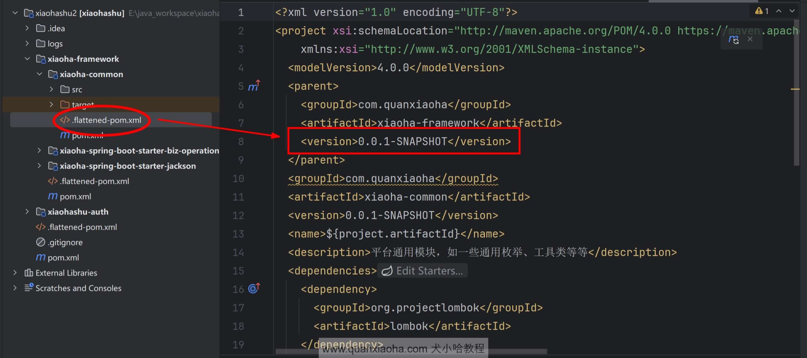

再次对 xiaohashu-auth 子模块进行打包，maven 就会解析 .flattened-pom.xml 文件进行打包，可以看到，这次就打包成功了。

## 8.SaToken 权限认证框架

### 8.1 什么是 SaToken ?

Sa-Token 是一个轻量级 Java 权限认证框架，官网地址：https://sa-token.cc/ ，主要解决：登录认证、权限认证、单点登录、OAuth2.0、分布式Session会话、微服务网关鉴权 等一系列权限相关问题。

当你受够 Shiro、SpringSecurity 等框架的三拜九叩之后，你就会明白，相对于这些传统老牌框架，Sa-Token 的 API 设计是多么的简单、优雅！

### 8.2 Sa-Token 功能一览

Sa-Token 目前主要五大功能模块：登录认证、权限认证、单点登录、OAuth2.0、微服务鉴权。

- 登录认证 —— 单端登录、多端登录、同端互斥登录、七天内免登录。
- 权限认证 —— 权限认证、角色认证、会话二级认证。
- 踢人下线 —— 根据账号id踢人下线、根据Token值踢人下线。
- 注解式鉴权 —— 优雅的将鉴权与业务代码分离。
- 路由拦截式鉴权 —— 根据路由拦截鉴权，可适配 restful 模式。
- Session会话 —— 全端共享Session,单端独享Session,自定义Session,方便的存取值。
- 持久层扩展 —— 可集成 Redis，重启数据不丢失。
- 前后台分离 —— APP、小程序等不支持 Cookie 的终端也可以轻松鉴权。
- Token风格定制 —— 内置六种 Token 风格，还可：自定义 Token 生成策略。
- 记住我模式 —— 适配 [记住我] 模式，重启浏览器免验证。
- 二级认证 —— 在已登录的基础上再次认证，保证安全性。
- 模拟他人账号 —— 实时操作任意用户状态数据。
- 临时身份切换 —— 将会话身份临时切换为其它账号。
- 同端互斥登录 —— 像QQ一样手机电脑同时在线，但是两个手机上互斥登录。
- 账号封禁 —— 登录封禁、按照业务分类封禁、按照处罚阶梯封禁。
- 密码加密 —— 提供基础加密算法，可快速 MD5、SHA1、SHA256、AES 加密。
- 会话查询 —— 提供方便灵活的会话查询接口。
- Http Basic认证 —— 一行代码接入 Http Basic、Digest 认证。
- 全局侦听器 —— 在用户登陆、注销、被踢下线等关键性操作时进行一些AOP操作。
- 全局过滤器 —— 方便的处理跨域，全局设置安全响应头等操作。
- 多账号体系认证 —— 一个系统多套账号分开鉴权（比如商城的 User 表和 Admin 表）
- 单点登录 —— 内置三种单点登录模式：同域、跨域、同Redis、跨Redis、前后端分离等架构都可以搞定。
- 单点注销 —— 任意子系统内发起注销，即可全端下线。
- OAuth2.0认证 —— 轻松搭建 OAuth2.0 服务，支持openid模式 。
- 分布式会话 —— 提供共享数据中心分布式会话方案。
- 微服务网关鉴权 —— 适配Gateway、ShenYu、Zuul等常见网关的路由拦截认证。
- RPC调用鉴权 —— 网关转发鉴权，RPC调用鉴权，让服务调用不再裸奔
- 临时Token认证 —— 解决短时间的 Token 授权问题。
- 独立Redis —— 将权限缓存与业务缓存分离。
- Quick快速登录认证 —— 为项目零代码注入一个登录页面。
- 标签方言 —— 提供 Thymeleaf 标签方言集成包，提供 beetl 集成示例。
- jwt集成 —— 提供三种模式的 jwt 集成方案，提供 token 扩展参数能力。
- RPC调用状态传递 —— 提供 dubbo、grpc 等集成包，在RPC调用时登录状态不丢失。
- 参数签名 —— 提供跨系统API调用签名校验模块，防参数篡改，防请求重放。
- 自动续签 —— 提供两种Token过期策略，灵活搭配使用，还可自动续签。
- 开箱即用 —— 提供SpringMVC、WebFlux、Solon 等常见框架集成包，开箱即用。
- 最新技术栈 —— 适配最新技术栈：支持 SpringBoot 3.x，jdk 17。

功能结构图：

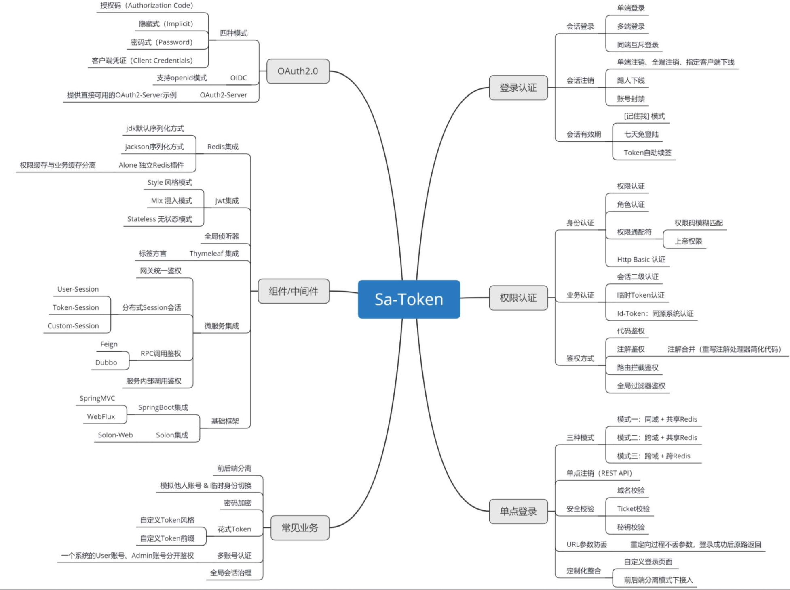

### 8.3 快速入门

**添加依赖**

了解完了 SaToken 以及其优势后，准备将它整合到我们的项目中。编辑项目的最外层 pom.xml 文件，声明 SaToken 的版本号以及依赖：

```xml
<!-- Sa-Token 权限认证 -->
<dependency>
    <groupId>cn.dev33</groupId>
    <artifactId>sa-token-spring-boot3-starter</artifactId>
    <version>1.38.0</version>
</dependency>
```

**添加配置**

依赖添加完毕后，编辑 application.yml 文件，添加 SaToken 基础配置项：

```yaml
############## Sa-Token 配置 (文档: https://sa-token.cc) ##############
sa-token:
  # token 名称（同时也是 cookie 名称）
  token-name: satoken
  # token 有效期（单位：秒） 默认30天，-1 代表永久有效
  timeout: 2592000
  # token 最低活跃频率（单位：秒），如果 token 超过此时间没有访问系统就会被冻结，默认-1 代表不限制，永不冻结
  active-timeout: -1
  # 是否允许同一账号多地同时登录 （为 true 时允许一起登录, 为 false 时新登录挤掉旧登录）
  is-concurrent: true
  # 在多人登录同一账号时，是否共用一个 token （为 true 时所有登录共用一个 token, 为 false 时每次登录新建一个 token）
  is-share: true
  # token 风格（默认可取值：uuid、simple-uuid、random-32、random-64、random-128、tik）
  token-style: uuid
  # 是否输出操作日志
  is-log: true
```

**添加登录接口、查询登录状态接口**

编辑 TestController 测试类，分别创建用户登录接口、查询登录状态接口：

```java
@RestController
public class TestController {
    // 测试登录，浏览器访问： http://localhost:8080/user/doLogin?username=zhang&password=123456
    @RequestMapping("/user/doLogin")
    public String doLogin(String username, String password) {
        // 此处仅作模拟示例，真实项目需要从数据库中查询数据进行比对
        if("zhang".equals(username) && "123456".equals(password)) {
            StpUtil.login(10001);
            return "登录成功";
        }
        return "登录失败";
    }

    // 查询登录状态，浏览器访问： http://localhost:8080/user/isLogin
    @RequestMapping("/user/isLogin")
    public String isLogin() {
        return "当前会话是否登录：" + StpUtil.isLogin();
    }
}
```

**自测**

以上为官方提供的示例接口，添加完成后，重启认证服务，观察控制台日志，若看到下图标注的部分，说明 SaToken 框架整合成功了：

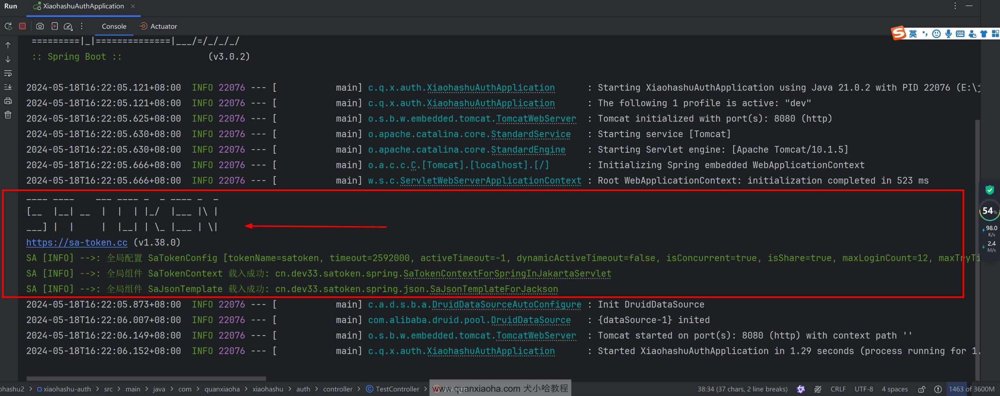

登录自测：

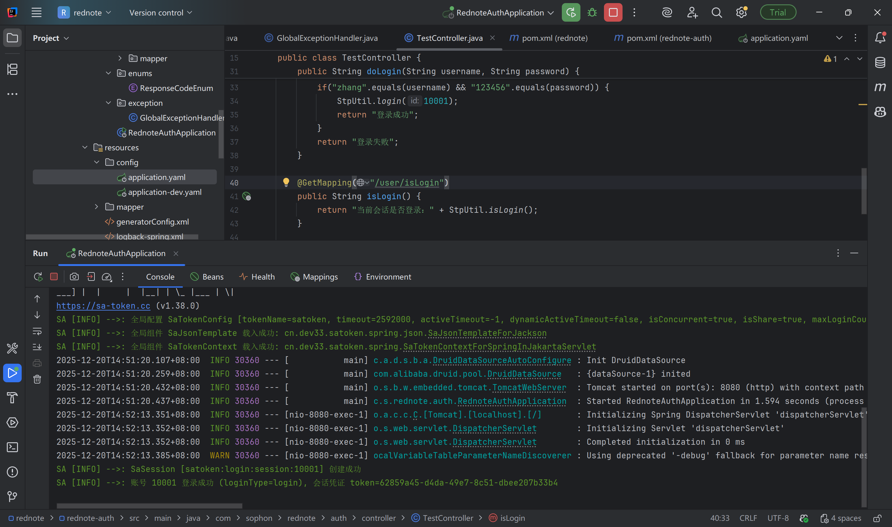

### 8.4 SaToken 整合 Redis

Sa-Token 默认将数据保存在内存中，此模式读写速度最快，且避免了序列化与反序列化带来的性能消耗，但是此模式也有一些缺点，比如：

- 重启后数据会丢失。
- 无法在分布式环境中共享数据。

为此，Sa-Token 提供了扩展接口，你可以轻松将会话数据存储在一些专业的缓存中间件上（比如 Redis）， 做到重启数据不丢失，而且保证分布式环境下多节点的会话一致性。

**引入依赖**

```xml
<!-- 统一依赖管理 -->
<dependencyManagement>
    <dependencies>
        // 省略...

        <!-- Sa-Token 整合 Redis （使用 jackson 序列化方式） -->
        <dependency>
            <groupId>cn.dev33</groupId>
            <artifactId>sa-token-redis-jackson</artifactId>
            <version>${sa-token.version}</version>
        </dependency>

        // 省略...
    </dependencies>
</dependencyManagement>
```

实际需要的模块中引入依赖：

```xml
<!-- Sa-Token 整合 Redis （使用 jackson 序列化方式） -->
<dependency>
    <groupId>cn.dev33</groupId>
    <artifactId>sa-token-redis-jackson</artifactId>
</dependency>

<!-- Redis 连接池 -->
<dependency>
    <groupId>org.apache.commons</groupId>
    <artifactId>commons-pool2</artifactId>
</dependency>
```

完成依赖添加的工作后，这里直接重启项目，再次调用登录接口，登录成功后，观察 Redis 中的数据，如下：

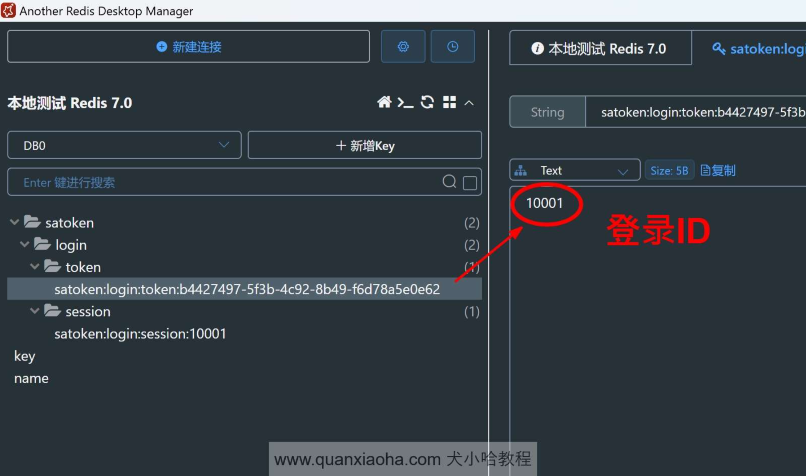

### 8.5 Gateway 网关集成 SaToken

关于 Gateway 网关集成 SaToken, 详细文档可访问：https://sa-token.cc/doc.html#/micro/gateway-auth 。

实现大致思路如下：

**准备阶段**

项目启动时将 **角色（Role）** 对应 **权限（Permission）** 的关系存储到 Redis 中。
注册用户时为用户分配角色 Role（可能多个角色）。
登录时将用户的角色存储到 Redis 中，方便校验。

**自定义 SaToken 权限验证接口**

自定义权限验证接口扩展，用于获取当前用户的角色（可能多个角色）和所有权限。

```java
/**
 * @author: Sophon
 * @date: 2025/12/26 14:08
 * @version: v1.0.0
 * @description: 自定义权限验证接口扩展，用于获取当前用户的角色（可能多个角色）和所有权限。
 **/
@Component
@Slf4j
public class StpInterfaceImpl implements StpInterface {

    @Resource
    private RedisTemplate<String, String> redisTemplate;
    @Resource
    private ObjectMapper objectMapper;

    @Override
    @SneakyThrows
    public List<String> getRoleList(Object loginId, String loginType) {
        // 返回此 loginId 拥有的权限列表
        log.info("获取用户权限列表，loginId：{}，loginType：{}", loginId, loginType);
        String userRolesValue = redisTemplate.opsForValue().get(RedisKeyConstants.buildUserRoleKey(Long.valueOf(loginId.toString())));
        if(StringUtils.isBlank(userRolesValue)){
            return null;
        }
        return objectMapper.readValue(userRolesValue, new TypeReference<>() {});
    }

    @Override
    @SneakyThrows
    public List<String> getPermissionList(Object loginId, String loginType) {
        // 返回此 loginId 拥有的角色列表
        log.info("获取用户角色列表，loginId：{}，loginType：{}", loginId, loginType);

        // 构建 用户-角色 Redis Key
        String userRoleKey = RedisKeyConstants.buildUserRoleKey(Long.valueOf(loginId.toString()));

        // 根据用户 id， 从 Redis 中获取用户角色集合
        String userRolesValue = redisTemplate.opsForValue().get(userRoleKey);

        if(StringUtils.isBlank(userRolesValue)){
            return null;
        }

        List<String> userRoleKeys = objectMapper.readValue(userRolesValue, new TypeReference<>() {});

        if(CollUtil.isNotEmpty(userRoleKeys)){
            // 查询这些角色对应的权限
            // 构建角色权限 Redis Key 列表
            List<String> rolePermissionsKeys  = userRoleKeys.stream()
                    .map(RedisKeyConstants::buildRolePermissionsKey)
                    .toList();

            // 通过 Key 集合批量查询权限，提升查询性能
            List<String> rolePermissionsValues  = redisTemplate.opsForValue().multiGet(rolePermissionsKeys);
            if(CollUtil.isNotEmpty(rolePermissionsValues)){
                List<String> permissions = Lists.newArrayList();

                rolePermissionsValues.forEach(jsonValue -> {
                    try {
                        List<String> rolePermissions = objectMapper.readValue(jsonValue, new TypeReference<>() {});
                        if(CollUtil.isNotEmpty(rolePermissions)){
                            permissions.addAll(rolePermissions);
                        }
                    } catch (Exception e) {
                        log.error("解析角色权限 JSON 失败，jsonValue：{}", jsonValue, e);
                    }
                });
                return permissions;
            }
        }
        return null;
    }
}
```

**网关整合 SaToken**

可以校验角色是否符合要求，也可校验权限是否符合要求。

当该拦截路径需要校验角色时 `StpUtil.checkRole("admin")`，自动调用自定义 SaToken 权限验证接口中的 getRoleList 方法，获取当前用户的角色集合，判断需要校验的角色是否在该集合中。

当该拦截路径需要校验权限时 `StpUtil.checkPermission("common_user")`，自动调用自定义 SaToken 权限验证接口中的 getPermissionList 方法，获取当前用户的权限集合，判断需要校验的权限是否在该集合中。

```java
/**
 * @author: Sophon
 * @date: 2025/12/26 14:11
 * @version: v1.0.0
 * @description: 定义拦截路径和鉴权逻辑
 **/
@Configuration
public class SaTokenConfigure {

    @Bean
    public SaReactorFilter getSaReactorFilter() {
        return new SaReactorFilter()
                .addInclude(("/**")) // 添加路由拦截
                // 鉴权方法：每次访问进入
                .setAuth(obj -> {
                    // 登录校验 -- 拦截所有路由，并排除/user/doLogin 用于开放登录
                    SaRouter.match("/**")
                            .notMatch("/auth/user/login")
                            .notMatch("/auth/verification/code/send")
                            .check(r -> StpUtil.checkLogin());
                    // 权限验证 -- 不同模块，校验不同权限
//                    SaRouter.match("/auth/user/logout", r -> StpUtil.checkPermission("app:note:publish"));
//                    SaRouter.match("/auth/user/logout", r -> StpUtil.checkPermission("common_user"));
                    SaRouter.match("/auth/user/logout", r -> StpUtil.checkRole("admin"));
//                    SaRouter.match("/user/**", r -> StpUtil.checkRole("user"));
                }) // 异常处理方法：每次setAuth函数出现异常时进入
                .setError(e -> {
                    // return SaResult.error(e.getMessage());
                    // 手动抛出异常，抛给全局异常处理器
                    if (e instanceof NotLoginException) { // 未登录异常
                        throw new NotLoginException(e.getMessage(), null, null);
                    } else if (e instanceof NotPermissionException || e instanceof NotRoleException) { // 权限不足，或不具备角色，统一抛出权限不足异常
                        throw new NotPermissionException(e.getMessage());
                    } else { // 其他异常，则抛出一个运行时异常
                        throw new RuntimeException(e.getMessage());
                    }
                });
    }
}
```

## 9.整合 RedisTemplate 配置连接池

依赖：

```xml
<!-- Redis -->
<dependency>
    <groupId>org.springframework.boot</groupId>
    <artifactId>spring-boot-starter-data-redis</artifactId>
</dependency>

<!-- Redis 连接池 -->
<dependency>
    <groupId>org.apache.commons</groupId>
    <artifactId>commons-pool2</artifactId>
</dependency>
```

配置（包含连接池）：

```yaml
spring:
  datasource:
	// 省略...
  data:
    redis:
      database: 0 # Redis 数据库索引（默认为 0）
      host: 127.0.0.1 # Redis 服务器地址
      port: 6379 # Redis 服务器连接端口
      password: qwe123!@# # Redis 服务器连接密码（默认为空）
      timeout: 5s # 读超时时间
      connect-timeout: 5s # 链接超时时间
      lettuce:
        pool:
          max-active: 200 # 连接池最大连接数
          max-wait: -1ms # 连接池最大阻塞等待时间（使用负值表示没有限制）
          min-idle: 0 # 连接池中的最小空闲连接
          max-idle: 10 # 连接池中的最大空闲连接    
```

## 10.Spring Boot 自定义线程池

调用第三方服务，属于网络 IO, 相对来说是比较耗时的操作，完全可以放到异步线程中来处理，以提升接口的响应速度。本小节中，我们就来为认证服务自定义一个线程池。

新建 ThreadPoolConfig 线程池配置类，代码如下：

```java
@Configuration
public class ThreadPoolConfig {
    @Bean(name = "taskExecutor")
    public Executor taskExecutor() {
        ThreadPoolTaskExecutor executor = new ThreadPoolTaskExecutor();
        // 核心线程数
        executor.setCorePoolSize(10);
        // 最大线程数
        executor.setMaxPoolSize(50);
        // 队列容量
        executor.setQueueCapacity(200);
        // 线程活跃时间（秒）
        executor.setKeepAliveSeconds(30);
        // 线程名前缀，线程池中的线程名称会以这个前缀开头，便于在调试和监控时识别这些线程
        executor.setThreadNamePrefix("AuthExecutor-");

        // 拒绝策略：由调用线程处理（一般为主线程）
        executor.setRejectedExecutionHandler(new ThreadPoolExecutor.CallerRunsPolicy());

        // 等待所有任务结束后再关闭线程池
        executor.setWaitForTasksToCompleteOnShutdown(true);
        // 设置线程池在关闭时等待任务完成的最大时间。这里设置为 60 秒，超过这个时间后，线程池会强制关闭，即使有任务未完成
        executor.setAwaitTerminationSeconds(60);

        executor.initialize();
        return executor;
    }
}
```

这段代码是用来配置和初始化一个线程池任务执行器 (ThreadPoolTaskExecutor) 的。在 Spring Boot 应用中，线程池可以用来处理并发任务，尤其是需要执行大量异步任务时，可以提高系统的响应速度和吞吐量。具体的：

```java
ThreadPoolTaskExecutor executor = new ThreadPoolTaskExecutor();
```

创建一个 ThreadPoolTaskExecutor 实例。ThreadPoolTaskExecutor 是 Spring 提供的一个方便的线程池封装类，基于 JDK 的 ThreadPoolExecutor 实现。

```java
executor.setCorePoolSize(10);
```

设置核心线程池的大小。核心线程池的线程数是线程池的基本大小，这些线程会一直存在，即使它们处于空闲状态。这里设置为 10，意味着最少会有 10 个线程一直存活。

```java
executor.setQueueCapacity(200);
```

设置队列的容量。任务队列用于保存等待执行的任务。这里设置为 200，意味着如果所有核心线程都在工作，新任务会被放在这个队列中等待执行，直到队列满为止。

```java
executor.setKeepAliveSeconds(30);
```

设置线程的空闲时间。当线程池中线程数大于核心线程数时，多余的空闲线程的存活时间，超过这个时间会被销毁。这里设置为 30 秒。

```java
executor.setRejectedExecutionHandler(new ThreadPoolExecutor.CallerRunsPolicy());
```

设置拒绝策略。当线程池达到最大线程数并且队列已满时，任务会被拒绝。CallerRunsPolicy 是一种拒绝策略，它会将任务返回给调用者线程执行，避免任务丢失。

> 注意：通过 @Resource 注解注入 ThreadPoolTaskExecutor 线程池时，需要指定 name = "taskExecutor" , 否则可能会报错。


## 11.鉴权设计：RBAC 权限模型

在一个系统中，往往都需要对用户进行权限控制。比如在小红书系统中，普通用户拥有发笔记、点赞、评论的权限；管理员有更高级的权限，比如某个用户违反了社区规则，管理员能够禁用某个用户发笔记、评论的权限等等。那么，针对此类功能要如何实现呢？

### 11.1 什么是 RBAC 模型？

RBAC（Role-Based Access Control）是一种基于角色的访问控制。它通过角色来管理用户的权限。RBAC 的核心思想是将用户与角色进行关联，并将权限分配给角色，而不是直接分配给用户。这样，通过改变用户的角色，就可以灵活地控制用户的权限。

RBAC 的主要组成部分包括：

- 用户（User）：系统的使用者。
- 角色（Role）：权限的集合，一个角色可以包含多个权限。
- 权限（Permission）：对系统资源的访问操作，如读取、写入、删除等。

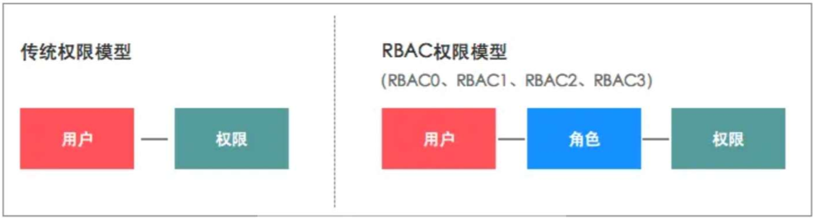

### 11.2 模型拓展

在实际的业务场景中，往往有着更复杂的权限控制需求，于是乎，又扩展出了 RBAC 1、RBAC 2 和 RBAC 3。这些模型在 RBAC 的基础上，增加了更多的功能，以适应不同的业务场景。

**RBAC 0**

即上面所讲的 RBAC 模型，基于用户-角色-权限的模型。

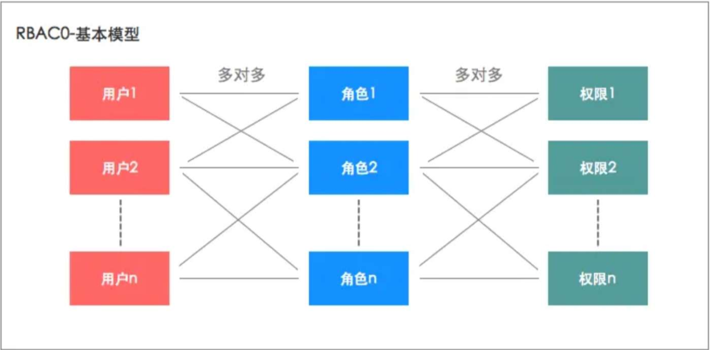

**RBAC 1：基于角色的层次模型（Role Hierarchies）**

RBAC 1 在 RBAC 0 的基础上增加了角色层次结构（Role Hierarchies）。角色层次结构允许角色之间存在继承关系，一个角色可以继承另一个角色的权限。

主要特点
- 角色继承：一个角色可以继承另一个角色的所有权限。比如，角色B继承角色 A 的权限，那么角色 B 不仅拥有自己定义的权限，还拥有角色 A 的所有权限。
- 权限传递：继承关系是传递的，如果角色 C 继承角色 B，而角色 B 继承角色 A，那么角色 C 将拥有角色 A 和角色 B 的所有权限。

优点
- 简化权限管理：通过角色继承，可以减少重复定义权限的工作。
- 提高灵活性：可以方便地对角色进行分层管理，满足不同层次用户的权限需求。

场景举例

在一个企业系统中，高级经理（Senior Manager）角色继承经理（Manager）角色的权限，经理角色继承员工（Employee）角色的权限。这样，高级经理角色不仅拥有自己的权限，还拥有经理和员工的所有权限。

**RBAC 2：基于约束的 RBAC 模型（Constraints）**


RBAC 2 同样建立在 RBAC 0 基础之上，但是增加了约束（Constraints）。约束是用于加强访问控制策略的规则或条件，可以限制用户、角色和权限的关联方式。

主要特点
- 互斥角色：某些角色不能同时赋予同一个用户。例如，审计员和财务员角色不能同时赋予同一个用户，以避免暗黑交易。
- 先决条件：用户要获得某个角色，必须先拥有另一个角色。例如，公司研发人员要成为高级程序员，必须先成为中级程序员。
- 基数约束：限制某个角色可以被赋予的用户数量。例如，某个项目的经理角色只能赋予一个用户，以确保项目的唯一责任人。

优点：
- 加强安全性：通过约束规则，可以避免权限滥用和利益冲突。
- 精细化管理：可以更精细地控制用户的角色分配和权限管理。

场景举例

在一个金融系统中，为了避免利益冲突，定义了互斥角色规则：审计员和财务员角色不能同时赋予同一个用户。这样可以确保审计员和财务员的职责分离，增强系统的安全性。

**RBAC 3：统一模型（Consolidated Model）**


RBAC 3 是最全面的 RBAC 模型，它结合了 RBAC1 的角色层次结构和 RBAC2 的约束，形成一个统一的模型，提供了最大程度的灵活性和安全性。

主要特点
- 包含RBAC 1的所有功能：角色层次结构，角色继承和权限传递。
- 包含RBAC 2的所有功能：互斥角色、先决条件角色和角色卡数限制等约束规则。
- 综合管理：可以同时利用角色继承和约束规则，提供最全面的权限管理解决方案。

优点
- 高灵活性：可以满足各种复杂的权限管理需求。
- 高安全性：通过约束规则，进一步加强权限管理的安全性。

场景举例

在一个大型企业系统中，需要复杂的权限管理策略。RBAC 3 模型可以通过角色层次结构定义不同层级的员工权限，通过约束规则确保权限分配的安全性。例如，高级经理角色继承经理角色的权限，但为了避免利益冲突，财务员和审计员角色互斥，不能同时赋予同一个用户。

**基于 RBAC 的延展：用户组**

管理员手动为每一个用户分配角色，也太繁琐了！

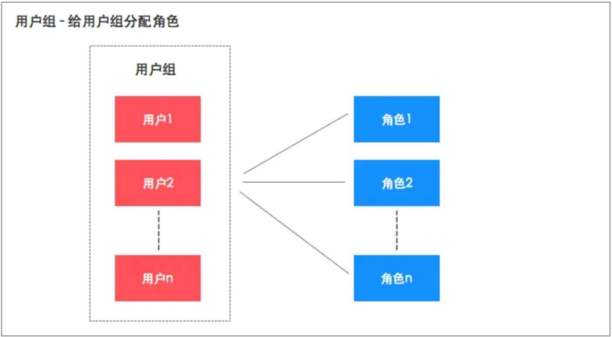

在实际业务场景中，举个栗子，比如销售部门，分配到此部门的员工都是销售员，拥有同一类角色。如果要为每一个员工手动分配角色，就显得非常繁琐了，而且容易出错。于是乎，在系统设计上，引入了用户组的概念，我们可以把销售部看成一个用户组，对用户组提前分配好角色，这样后续只需将员工拉入该部门，即可拥有该部门已分配的权限。

### 11.3 要控制哪些权限？

RBAC 模型是为了更加灵活的控制权限。那么问题来了，需要控制的权限通常都有哪些？

在系统设计时，通常你需要考虑以下几类权限：

- 菜单权限：控制用户在管理后台中，可以看到的菜单项与页面。
- 操作权限：控制用户可以执行的具体操作。比如新增、删除、修改按钮的权限。
- 数据权限：控制用户可以访问的数据范围。比如只能看到本部门的数据，其他部门的员工登录则无法查看。
- 字段权限：控制用户可以查看或编辑的字段。
- 等等...

具体还得结合你的业务来，没有绝对，毕竟技术服务于业务。

## 12. IDEA 自定义文件头

设置文件头模板

File → Settings → Editor → File and Code Templates

选择 Includes 标签页

点击 File Header

输入：

```java
/**
 * @author: Sophon
 * @date: ${YEAR}/${MONTH}/${DAY} ${TIME}
 * @version: v1.0.0
 * @description: 
 **/
```

常用变量
- ${USER} - 当前系统用户名
- ${DATE} - 当前日期（格式可自定义）
- ${TIME} - 当前时间
- ${YEAR} - 年份
- ${MONTH} - 月份
- ${DAY} - 日期
- ${NAME} - 类名
- ${PACKAGE_NAME} - 包名

## 13.声明式注解事务失效

### 13.1 声明式注解事务失效原因

声明式注解事务失效原因，主要由以下几点：

- 方法可见性：@Transactional 仅在 public 方法上生效。

- 自调用：当类中的方法调用同一个类中的另一个 @Transactional 方法时，事务可能不会生效。这是因为事务注解是通过 AOP 实现的，而 Spring 的 AOP 代理机制在这种情况下不会被触发。

- 异常处理：只有 RuntimeException 和 Error 类型的异常会触发事务回滚。如果你抛出的是 checked exception，事务不会回滚，除非你明确指定 rollbackFor 属性。

- 代理对象：确保你是在 Spring 管理的代理对象上调用方法。如果你直接使用 new 关键字实例化对象，Spring 的 AOP 代理机制将不会被应用。

### 13.2 使用编程式事务

编程式事务（Programmatic Transaction）是一种通过代码显式地管理事务的方式，而不是依赖声明式事务（Declarative Transaction）中使用的注解或 XML 配置。在编程式事务中，开发人员通过编写代码来开启、提交和回滚事务，以精细控制事务的边界和行为。

使用编程式事务优点如下：

- 精细控制：编程式事务允许开发者通过代码精细地控制事务的生命周期，包括开始、提交和回滚。可以根据具体业务需求，灵活地管理事务。

- 动态处理：在运行时可以根据业务逻辑的不同情况动态决定事务的行为。特别适合需要在代码执行过程中，根据某些条件来开启、提交或回滚事务的场景。

- 适用于复杂事务：在一个方法中需要多次开启和关闭事务，或需要嵌套事务的复杂场景中，编程式事务可以提供更大的灵活性和控制力。

- 灵活性高：能够在代码中实现复杂的事务逻辑，可以精确控制事务的边界和行为。这在需要多个步骤或调用之间共享事务上下文时非常有用。

- 性能提升：通过精细控制事务的边界，减少不必要的事务开启和提交，从而减少事务开销；通过明确控制事务的开始和结束，可以确保事务范围尽可能小，减少长时间占用数据库资源，提高系统的并发性；通过灵活的事务管理，可以在必要时才进行事务回滚，减少回滚操作带来的性能开销。

Spring Boot 中使用编程式事务：

```java
@Service
public class MyService {

    @Resource
    private TransactionTemplate transactionTemplate;

    @Resource
    private MyMapper myMapper;

    public void myTransactionalMethod() {
        transactionTemplate.execute(status -> {
            try {
                // 业务逻辑代码
                myMapper.insertSomething(...);

            } catch (Exception ex) {
                status.setRollbackOnly(); // 标记事务为回滚
                throw ex; // 重新抛出异常
            }
            return null;
        });
    }
}
```

> 其中：TransactionTemplate是一个简化了事务管理的工具类。

## 14.Spring Boot 项目初始化执行代码

**1.使用 @PostConstruct 注解**

@PostConstruct 注解可以用于在 Spring 容器初始化 bean 之后立即执行特定的方法。

```java
import org.springframework.stereotype.Component;

import javax.annotation.PostConstruct;

@Component
public class MyInitializer {

    @PostConstruct
    public void init() {
        // 初始化工作
        System.out.println("初始化工作完成");
    }
}
```

**2.实现 ApplicationRunner 接口**

ApplicationRunner 接口提供了一种在 Spring Boot 应用启动后执行特定代码的方式。

```java
import org.springframework.boot.ApplicationArguments;
import org.springframework.boot.ApplicationRunner;
import org.springframework.stereotype.Component;

@Component
public class MyApplicationRunner implements ApplicationRunner {

    @Override
    public void run(ApplicationArguments args) throws Exception {
        // 初始化工作
        System.out.println("初始化工作完成");
    }
}
```

**3.实现 CommandLineRunner 接口**

CommandLineRunner 接口类似于 ApplicationRunner，可以在应用启动后执行代码。

```java
import org.springframework.boot.CommandLineRunner;
import org.springframework.stereotype.Component;

@Component
public class MyCommandLineRunner implements CommandLineRunner {

    @Override
    public void run(String... args) throws Exception {
        // 初始化工作
        System.out.println("初始化工作完成");
    }
}
```

**4.使用 @EventListener 注解监听 ApplicationReadyEvent**

通过监听 ApplicationReadyEvent 事件，可以在 Spring Boot 应用完全启动并准备好服务请求时执行初始化工作。

```java
import org.springframework.context.event.EventListener;
import org.springframework.stereotype.Component;
import org.springframework.boot.context.event.ApplicationReadyEvent;

@Component
public class MyApplicationReadyListener {

    @EventListener(ApplicationReadyEvent.class)
    public void onApplicationReady() {
        // 初始化工作
        System.out.println("初始化工作完成");
    }
}
```

**5.使用 SmartInitializingSingleton 接口**

SmartInitializingSingleton 接口提供了一种在所有单例 bean 初始化完成后执行代码的方式。

```java
import org.springframework.beans.factory.SmartInitializingSingleton;
import org.springframework.stereotype.Component;

@Component
public class MySmartInitializingSingleton implements SmartInitializingSingleton {

    @Override
    public void afterSingletonsInstantiated() {
        // 初始化工作
        System.out.println("初始化工作完成");
    }
}
```

**6.使用 Spring Boot 的 InitializingBean 接口**

通过实现 InitializingBean 接口的 afterPropertiesSet 方法，可以在 bean 的属性设置完成后执行初始化工作。

```java
import org.springframework.beans.factory.InitializingBean;
import org.springframework.stereotype.Component;

@Component
public class MyInitializingBean implements InitializingBean {

    @Override
    public void afterPropertiesSet() throws Exception {
        // 初始化工作
        System.out.println("初始化工作完成");
    }
}
```

**总结**

以上这些方法各有优缺点，可以根据具体的初始化需求选择合适的方法。

- @PostConstruct：适合简单的初始化逻辑，执行时机较早。
- ApplicationRunner 和 CommandLineRunner：适合需要访问命令行参数的初始化逻辑，执行时机在 Spring Boot 应用启动完成后。
- ApplicationReadyEvent 监听器：适合在整个应用准备好后执行的初始化逻辑。
- SmartInitializingSingleton：适合需要在所有单例 bean 初始化完成后执行的初始化逻辑。
- InitializingBean：适合需要在 bean 属性设置完成后执行的初始化逻辑。


## 15. TransmittableThreadLocal：异步获取上下文

ThreadLocal 存在的问题我们写业务代码的时候，有些逻辑是需要在异步线程中去执行，如下图所示，异步线程中，再通过 ThreadLocal 去获取上下文数据，就失效了。

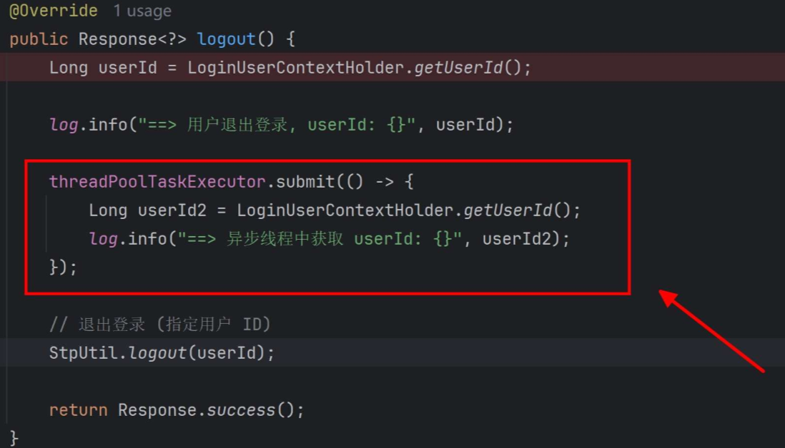

InheritableThreadLocal 好使不？

InheritableThreadLocal 是 Java 提供的另一个特殊的类，它是 ThreadLocal 的子类。与 ThreadLocal 不同，InheritableThreadLocal 允许线程将其父线程中的值传递给其子线程。这对于一些需要在父子线程之间共享数据的场景非常有用。但是 InheritableThreadLocal 同样有它的弊端，如果我们在使用线程池的情况下，它就不好使了。

TransmittableThreadLocal 是阿里巴巴开源的一个库，专门为了解决在使用线程池或异步执行框架时，InheritableThreadLocal 不能传递父子线程上下文的问题。TransmittableThreadLocal 能够将父线程中的上下文在子线程或线程池中执行时也能够保持一致。

引入依赖：

```xml
<dependency>
    <groupId>com.alibaba</groupId>
    <artifactId>transmittable-thread-local</artifactId>
</dependency>
```

快速入门：

```java
public class LoginUserContextHolder {
    // 初始化一个 TransmittableThreadLocal 变量
    private static final ThreadLocal<Map<String, Object>> LOGIN_USER_CONTEXT_THREAD_LOCAL
            = TransmittableThreadLocal.withInitial(HashMap::new);

    /**
     * 设置用户 ID
     *
     * @param value
     */
    public static void setUserId(Object value) {
        LOGIN_USER_CONTEXT_THREAD_LOCAL.get().put(GlobalConstants.USER_ID, value);
    }

    /**
     * 获取用户 ID
     *
     * @return
     */
    public static  Long getUserId() {
        Object value = LOGIN_USER_CONTEXT_THREAD_LOCAL.get().get(GlobalConstants.USER_ID);
        if(Objects.isNull(value)){
            return null;
        }
        return Long.valueOf(value.toString());
    }

    /**
     * 删除 ThreadLocal
     */
    public static void remove() {
        LOGIN_USER_CONTEXT_THREAD_LOCAL.remove();
    }
}
```

## 16. 密码加密: BCrypt

在系统中，安全存储用户密码是至关重要的。使用明文存储密码容易受到攻击，相信小伙伴们都看过某些网站用户数据库被黑，密码都是明文保存的，密码大批泄露的新闻，因此使用密码加密技术来保护用户密码是必不可少的。

**密码加密的重要性**

安全性： 存储加密后的密码可以防止明文密码泄漏，即使数据库被攻击也不会暴露用户的真实密码。
防御攻击： 使用密码哈希算法可以防止常见的攻击，如彩虹表攻击。
隐私保护： 用户的密码是敏感信息，应当采取措施来保护用户的隐私。

**使用 BCryptPasswordEncoder**

BCryptPasswordEncoder 是 Spring Security 中用于对密码进行哈希处理的一种加密工具类。它基于 BCrypt 哈希函数，专门设计用于存储密码，提供了较高的安全性和抗攻击性。

它具有如下特性：

- 自动加盐：每次调用 encode 方法时，BCryptPasswordEncoder 都会自动生成一个随机的盐值。
- 内置安全性：BCrypt 算法是专门为存储密码设计的，具有较强的抗攻击性。

**添加依赖**

编辑认证服务的 pom.xml 文件，添加如下依赖：

```xml
<!-- 密码加密 -->
<dependency>
    <groupId>org.springframework.security</groupId>
    <artifactId>spring-security-crypto</artifactId>
</dependency>
```

**添加配置**

```java
@Component
public class PasswordEncoderConfig {
    @Bean
    public PasswordEncoder passwordEncoder() {
        // BCrypt 是一种安全且适合密码存储的哈希算法，它在进行哈希时会自动加入“盐”，增加密码的安全性。
        return new BCryptPasswordEncoder();
    }
}
```

使用时只需要注入即可：

```java
@Resource
private PasswordEncoder passwordEncoder;
```

## 17.短文本存储技术选型

**分布式 KV 存储系统**：如基于 RocksDB 存储引擎上构建的 Cassandra 、TiKV 等，都有非常好的扩展性和数据持久化能力，并且数据保存在磁盘上，磁盘相较于内存要廉价很多，非常适合用于存储海量的短文本数据

- 特点：

    - 分布式存储：高可用性和可扩展性强。
    - 支持时间序列数据：适合处理大规模时间序列数据。
    - 可线性扩展：增加节点可以线性提高读写性能。

- 适用场景：

    - 大规模数据存储和分析。
    - 需要高可用性的系统。
    - 横向扩展需求强烈的场景。


**分布式文档数据库**：数据以文档的形式存储，通常使用 JSON、BSON（Binary JSON）或 XML 格式。这使得数据结构非常灵活，适合存储半结构化或无结构的数据，典型的代表就是 MongDB ，具有强大的查询和索引功能。

- 特点：

    - 文档存储：以 JSON 格式存储数据，灵活性强。
    - 索引支持：支持多种索引，查询性能好。
    - 分片机制：支持水平分片，数据量大时扩展性强。

- 适用场景：

    - 半结构化数据存储，如日志、文档管理。
    - 需要快速开发迭代的应用。
    - 数据模式不固定或变化频繁的场景。

针对海量的短文本存储，这里不考虑内存型 KV 数据库，一是内存非常昂贵，另外，数据持久化表现也比较一般。所以在 KV 存储系统或者分布式文档数据库中选择，若更关注于易用性，可以考虑分布式文档数据库。而针对小红书项目，我们更在意性能，所以最终选型 KV 存储系统 Apache Cassandra。

它是一个强大、灵活且可扩展的分布式 NoSQL 数据库系统，适用于需要高可用性、高吞吐量和低延迟的应用场景。其无中心化架构、可调一致性、以及列族存储模型，使其成为处理大规模数据和实时分析的理想选择。

### 17.1 什么是 Cassandra ?

Apache Cassandra 是一个开源的分布式 NoSQL（Not Only SQL）数据库管理系统，专为处理大规模数据量和高写入频率的工作负载而设计。它最初由 Facebook 开发，后来贡献给了 Apache 软件基金会，成为了 Apache 的一个顶级项目。

Cassandra 结合了 Google Bigtable 的数据模型和 Amazon Dynamo 的完全分布式架构，提供了以下关键特性：

- 高可用性：Cassandra 是一个无单点故障的系统，它通过数据复制和一致性级别选择，确保即使在节点失败的情况下数据仍然可访问。

- 水平可扩展性：Cassandra 能够通过添加更多节点到集群中轻松扩展，无需停机，这使得它能够处理不断增长的数据量和用户负载。

- 分布式数据存储：数据在集群中的多个节点上分布存储，每个节点都是平等的，没有主从之分，这有助于提高性能和可靠性。

- 最终一致性：Cassandra 允许开发者选择数据的一致性和可用性之间的权衡，通过可配置的一致性级别，可以在强一致性和高可用性之间找到合适的平衡点。

- 数据模型：Cassandra 使用列族（column-family）的数据模型，允许以宽列的方式存储数据，非常适合存储半结构化或非结构化数据。

- 数据压缩和索引：Cassandra 支持数据压缩和创建二级索引，以提高存储效率和查询性能。

- 多数据中心复制：Cassandra 支持跨多个地理区域的数据中心复制，以实现数据的地理分布和灾难恢复。

Cassandra 被广泛应用于需要处理大量数据和高写入负载的场景，例如社交网络、物联网（IoT）、实时数据分析和推荐系统等。由于其强大的可扩展性和高可用性，Cassandra 成为了许多大型企业如 Netflix、Digg、Twitter 等的选择。

### 17.2部署 Cassandra

docker 运行 Cassandra 镜像：

```bash
docker pull cassandra:latest

docker run --name cassandra -d -p 9042:9042 -v /docker/cassandra/data:/var/lib/cassandra cassandra:latest
```

cassandra 容器运行成功后，执行如下命令，可进入到容器中：

```bash
docker exec -it cassandra /bin/sh
cqlsh
```

> cqlsh 是 Cassandra Query Language Shell 的缩写，它是一个命令行工具，允许你向 Cassandra 数据库发送查询、创建表、插入数据、检索数据等。

### 17.3 CQL 基本命令

Cassandra Query Language (CQL) 是 Apache Cassandra 数据库的一种专用查询语言，它简化了与 Cassandra 的交互，提供了一种类似 SQL 的语法来管理数据。本小节中，我们就来学习一下如何使用 CQL 命令来创建、管理和查询 Cassandra 数据库。

Cassandra 中几个基本概念：

- 节点（Node）：Cassandra 集群中的每个服务器称为一个节点。每个节点都存储数据，并且相互之间没有主从关系，所有节点都是对等的。
- 集群（Cluster）：由多个节点组成的分布式系统称为集群。集群中的节点共同工作，处理读写请求并存储数据。
- 数据中心（Data Center）：集群中的节点可以分布在多个数据中心，每个数据中心包含若干个节点。数据中心的划分有助于实现跨地域的高可用性。
- 键空间（Keyspace）：键空间是一个逻辑容器，用于管理多个表，可以理解为 MySQL 中的库。另外，键空间定义了数据复制的策略。
- 表（Table）：表是数据存储的基本单位，由行和列组成。每张表都有一个唯一的名称和定义。
- 主键（Primary Key）：每行数据都有一个唯一的主键。主键由分区键和可选的列组成，用于唯一标识数据行。
- 分区键（Partition Key）：Cassandra 使用分区键的哈希值将数据分布到不同的节点上，从而实现负载均衡和数据的水平扩展。分区键可以是单个列或多列的组合（复合分区键）。

#### 键空间（Keyspace）

**1.创建**

打开 cqlsh 命令行，执行下面语句，来创建一个 Keyspace:

```bash
CREATE KEYSPACE IF NOT EXISTS xiaohashu WITH replication = {'class': 'SimpleStrategy', 'replication_factor': 1};
```

> WITH replication: 这里指定了 keyspace 的复制策略和配置。复制策略决定了数据如何在集群中复制和分布。
> 'class': 'SimpleStrategy': 这里指定了复制策略的类型为 SimpleStrategy。SimpleStrategy 是一种基本的复制策略，适用于单数据中心的部署。它将数据均匀地分布到集群中的节点上。
> 'replication_factor': 1: 这是复制因子，表示每个数据分区的副本数量。在这个例子中，replication_factor 设置为 1，意味着每个数据分区只有一个副本，这通常用于测试或开发环境，但在生产环境中可能不是最佳实践，因为缺乏冗余会导致数据丢失的风险增加。

**2.查看**

键空间创建完成后，执行如下命令，可查看所有的 Keyspace :

```bash
DESCRIBE KEYSPACES;
```

**3.删除**

如果想删除某个键空间，以及其中的所有数据，可执行如下语句：

```bash
DROP KEYSPACE IF EXISTS xiaohashu;
```

**4.选择**

键空间创建完成后，可通过 USE 命令，选择该 Keyspace ，以便后续操作它:

```bash
use xiaohashu;
```

#### 表

**1.创建表**

执行如下语句，创建一张 note_content 笔记内容表。这里注意，由于我们是拿 Cassandra 充当 K-V 键值存储数据库，所以表中只包含两个字段（实际可以支持多字段），id 主键充当 Key , 笔记内容 content 充当 Value :

```bash
CREATE TABLE note_content (
    id UUID PRIMARY KEY,
    content TEXT
);
```

为什么这里要用 UUID? 而不是笔记本身的 ID?
UUID 生成的值具有较高的随机性，因此在集群中可以提供良好的数据分布，避免热点问题。

> id UUID PRIMARY KEY: 这里定义了表中的一个列 id，其数据类型是 UUID（通用唯一标识符）。PRIMARY KEY 指示 id 列是表的主键。在 Cassandra 中，主键用于唯一标识表中的每一行，同时也是数据在集群中分区的依据。
> 
> content TEXT: 这里定义了另一个列 content，其数据类型是 TEXT。TEXT 类型用于存储文本字符串。

**2.插入数据**

笔记内容表创建完成后，执行如下语句，插入一条数据：

```bash
INSERT INTO note_content (id, content) VALUES (uuid(), '这是一条测试笔记');
```

**3.查询记录**

```bash
SELECT * FROM note_content;
SELECT * FROM note_content WHERE id = 728c9c82-c64b-410b-8970-0dcae49efaa7;
```

**4.更新记录**

以 id 为条件来更新对应笔记内容：

```bash
UPDATE note_content SET content = '更新后的评论内容' WHERE id = 728c9c82-c64b-410b-8970-0dcae49efaa7;
```

**5.删除记录**

```bash
DELETE FROM note_content WHERE id = 728c9c82-c64b-410b-8970-0dcae49efaa7;
```

### 17.4 Spring Boot 3.x 整合 Cassandra

**添加依赖**

编辑 xiaohashu-kv-biz 模块中的 pom.xml 文件，添加如下依赖：

```xml
<!-- Cassandra 存储 -->
<dependency>
    <groupId>org.springframework.boot</groupId>
    <artifactId>spring-boot-starter-data-cassandra</artifactId>
</dependency>
```

**添加配置**

接着，编辑 application-dev.yml 开发环境配置文件，添加连接 Cassandra 所需的相关配置，如键空间、连接地址、端口，大致如下：

```yaml
spring:
  cassandra:
    keyspace-name: xiaohashu
    contact-points: 127.0.0.1
    port: 9042
```

**新建 DO 实体类与 Repository 接口**

note_content 表对应的数据库实体类，代码如下：

```java
import lombok.AllArgsConstructor;
import lombok.Builder;
import lombok.Data;
import lombok.NoArgsConstructor;
import org.springframework.data.cassandra.core.mapping.PrimaryKey;
import org.springframework.data.cassandra.core.mapping.Table;

import java.util.UUID;

@Table("note_content")
@Data
@NoArgsConstructor
@AllArgsConstructor
@Builder
public class NoteContentDO {

    @PrimaryKey("id")
    private UUID id;

    private String content;
}
```

创建 NoteContentRepository 接口，代码如下：

```java
import com.quanxiaoha.xiaohashu.kv.biz.domain.dataobject.NoteContentDO;
import org.springframework.data.cassandra.repository.CassandraRepository;

import java.util.UUID;

public interface NoteContentRepository extends CassandraRepository<NoteContentDO, UUID> {

}
```

CassandraRepository: 这是 Spring Data Cassandra 提供的一个泛型接口，它为 Cassandra 数据库提供了 CRUD（创建、读取、更新、删除）和其他一些基本的操作方法。

<NoteContentDO, UUID>: 这里有两个类型参数：
NoteContentDO: 表示与 Cassandra 数据库交互时使用的数据对象类型。通常情况下，这是一个 Java 类，它映射到数据库中的表。
UUID: 表示 NoteContentDO 对象的主键类型。根据表的实际情况来定义，这里使用 UUID 作为主键类型。

**声明配置类**

创建 CassandraConfig 数据源配置类，代码如下：

```java
import org.springframework.beans.factory.annotation.Value;
import org.springframework.context.annotation.Configuration;
import org.springframework.data.cassandra.config.AbstractCassandraConfiguration;

@Configuration
public class CassandraConfig extends AbstractCassandraConfiguration {

    @Value("${spring.cassandra.keyspace-name}")
    private String keySpace;

    @Value("${spring.cassandra.contact-points}")
    private String contactPoints;

    @Value("${spring.cassandra.port}")
    private int port;

    /*
     * Provide a keyspace name to the configuration.
     */
    @Override
    public String getKeyspaceName() {
        return keySpace;
    }

    @Override
    public String getContactPoints() {
        return contactPoints;
    }

    @Override
    public int getPort() {
        return port;
    }
}
```

**测试**

```java
@SpringBootTest
@Slf4j
public class CassandraTests {
    @Resource
    private NoteContentRepository noteContentRepository;

    /**
     * 测试插入数据
     */
    @Test
    void testInsert() {
        NoteContentDO nodeContent = NoteContentDO.builder()
                .id(UUID.randomUUID())
                .content("代码测试笔记内容插入")
                .build();

        noteContentRepository.save(nodeContent);
    }

    /**
     * 测试修改数据
     */
    @Test
    void testUpdate() {
        NoteContentDO nodeContent = NoteContentDO.builder()
                .id(UUID.fromString("1d9b3971-d0e8-4374-a3cb-a52c9a34c27a"))
                .content("代码测试笔记内容更新")
                .build();

        noteContentRepository.save(nodeContent);
    }

    /**
     * 测试查询数据
     */
    @Test
    void testSelect() {
        Optional<NoteContentDO> optional = noteContentRepository.findById(UUID.fromString("1d9b3971-d0e8-4374-a3cb-a52c9a34c27a"));
        optional.ifPresent(noteContentDO -> log.info("查询结果：{}", JsonUtils.toJsonString(noteContentDO)));
    }

    /**
     * 测试删除数据
     */
    @Test
    void testDelete() {
        noteContentRepository.deleteById(UUID.fromString("1d9b3971-d0e8-4374-a3cb-a52c9a34c27a"));
    }
}
```

## 18. Zookeeper

### 18.1 Zookeeper 介绍

Apache ZooKeeper 是一个开源的分布式协调服务，用于大型分布式系统的开发和管理。它提供了一种简单而统一的方法来解决分布式应用中常见的协调问题，如命名服务、配置管理、集群管理、组服务、分布式锁、队列管理等。ZooKeeper 通过提供一种类似文件系统的结构来存储数据，并允许客户端通过简单的 API 进行读写操作，从而简化了分布式系统的复杂度。

**Zookeeper 的核心特性如下**：

一致性：对于任何更新，所有客户端都将看到相同的数据视图。这是通过 ZooKeeper 的原子性保证的，意味着所有更新要么完全成功，要么完全失败。

可靠性：一旦数据被提交，它将被持久化存储，即使在某些服务器出现故障的情况下，数据也不会丢失。

实时性：ZooKeeper 支持事件通知机制，允许客户端实时接收到数据变化的通知。

高可用性：ZooKeeper 通常以集群形式部署，可以容忍部分节点的故障，只要集群中超过半数的节点是可用的，ZooKeeper 就能继续提供服务。

**ZooKeeper 的数据模型**：

ZooKeeper 使用一个层次化的命名空间来组织数据，类似于文件系统中的目录树。每个节点（称为znode）都可以有子节点，形成树状结构。每个 znode 可以存储一定量的数据，并且可以设置访问控制列表（ACL）来控制谁可以读取或修改数据。

**ZooKeeper 的应用场景**：

配置管理：ZooKeeper 可以用来集中存储和管理分布式系统中的配置信息，当配置发生变化时，可以实时通知到所有客户端。

命名服务：ZooKeeper 可以作为服务发现的注册中心，帮助客户端查找和定位服务。

集群管理：ZooKeeper 可以用于选举主节点、检测集群成员的变化、以及监控集群的健康状况。

分布式锁：ZooKeeper 提供了一种机制来实现分布式环境下的互斥访问，保证多个进程之间数据操作的正确性。

队列管理：ZooKeeper 可以用来实现分布式队列，如任务调度队列或消息队列。

### 18.2 环境搭建

拉取 Zookeeper 镜像，启动容器：

```bash
docker pull zookeeper:3.5.6

docker run -d --name zookeeper -p 2181:2181 -e TZ="Asia/Shanghai" -v /docker/zookeeper/data:/data -v /docker/zookeeper/conf:/conf zookeeper:3.5.6
```

执行如下命令，进入到 Zookeeper 容器中：

```bash
docker exec -it zookeeper bash
```

接着，执行如下命令，来启动 ZooKeeper 的命令行界面（CLI），它允许用户直接与 ZooKeeper 服务器进行交互：

```bash
./bin/zkCli.sh
```

### 18.3 zk 基本命令

ZooKeeper CLI (zkCli) 是 ZooKeeper 分布式协调服务附带的一个命令行工具，它提供了与 ZooKeeper 服务器交互的方式。使用 zkCli，你可以执行诸如查看、创建、修改和删除 ZooKeeper 中的数据节点（znodes）的操作。

ls：列出当前路径下的子节点。如：查看根节点的子节点，命令如下：
```bash
ls /
```

create：创建一个新的节点 （znode）。命令如下：
```bash
create /myNode "犬小哈专栏"
```
以上命令，将创建一个名为 /myNode 的节点，并初始化其数据为 "犬小哈专栏"。

get：获取指定节点的数据和状态信息。命令如下：
```bash
get /myNode
```

set：设置指定节点的数据。命令如下：
```bash
set /myNode "犬小哈专栏更新啦"
```

delete：删除指定的节点（znode） 。命令如下：
```bash
delete /myNode
```

quit：退出 zkCli 命令行工具。
```bash
quit
```


