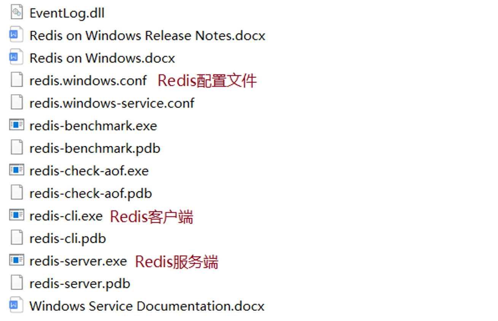
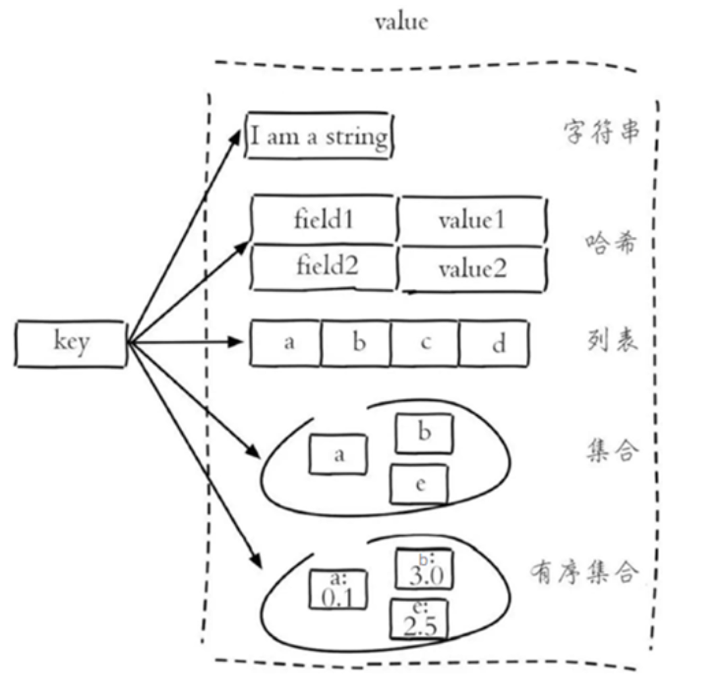
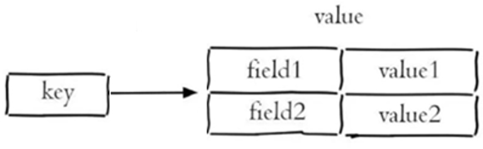
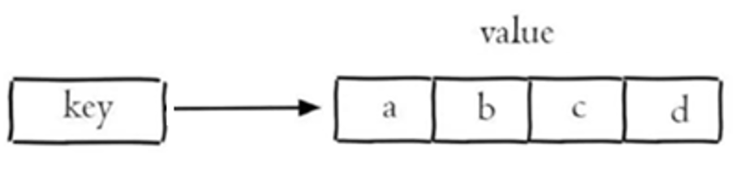
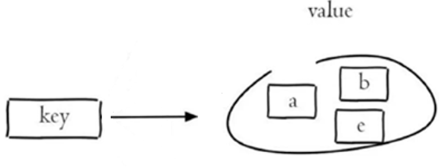
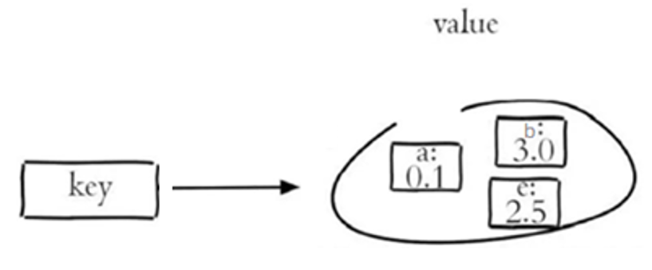
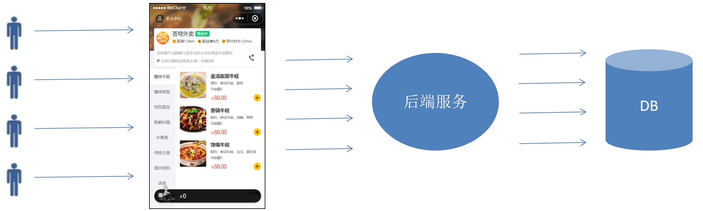
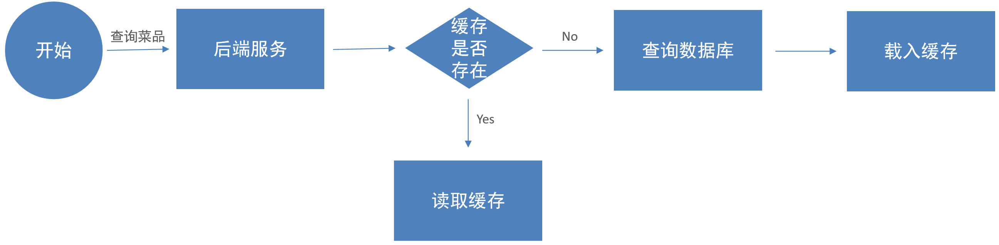
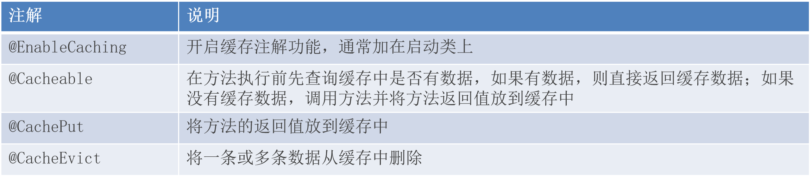

# Redis 简介
Redis是一个基于**内存**的 key-value 结构数据库。
- 基于内存存储，读写性能高
- 适合存储热点数据（热点商品、资讯、新闻）
- 企业应用广泛

> Redis的Windows版属于绿色软件，直接解压即可使用，解压后目录结构如下：
> 


# Redis 常用数据类型


Redis存储的是key-value结构的数据，其中key是字符串类型，value有5种常用的数据类型：
- 字符串(string)：普通字符串，Redis中最简单的数据类型
- 哈希(hash)：也叫散列，类似于Java中的HashMap结构
- 列表(list)：按照插入顺序排序，可以有重复元素，类似于Java中的LinkedList
- 集合(set)：无序集合，没有重复元素，类似于Java中的HashSet
- 有序集合(sorted set / zset)：集合中每个元素关联一个分数（score），根据分数升序排序，没有重复元素

# Redis 常用命令
## 字符串操作命令
Redis 字符串类型常用命令：
```bash
SET key value              # 设置指定key的值
GET key                    # 获取指定key的值
SETEX key seconds value    # 设置指定key的值，并将 key 的过期时间设为 seconds 秒
SETNX key value            # 只有在 key 不存在时设置 key 的值
```
## 哈希操作命令


Redis hash 是一个string类型的 field 和 value 的映射表，hash特别适合用于存储对象，常用命令：
```bash
HSET key field value       # 将哈希表 key 中的字段 field 的值设为 value
HGET key field             # 获取存储在哈希表中指定字段的值
HDEL key field             # 删除存储在哈希表中的指定字段
HKEYS key                  # 获取哈希表中所有字段
HVALS key                  # 获取哈希表中所有值
HGETALL key                # 获取哈希表中所有字段和值
```

## 列表操作命令


Redis 列表是简单的字符串列表，按照插入顺序排序，常用命令：
```bash
LPUSH key value1 [value2]  # 将一个或多个值插入到列表头部(左边)
LRANGE key start stop      # 获取列表指定范围内的元素(可以使用 -1 表示 stop)
RPOP key                   # 移除并获取列表最后一个元素(右边)
LLEN key                   # 获取列表长度
```

## 集合操作命令


Redis set 是string类型的无序集合。集合成员是唯一的，集合中不能出现重复的数据，常用命令：
```bash
SADD key member1 [member2]  # 向集合添加一个或多个成员
SMEMBERS key                # 返回集合中的所有成员
SCARD key                   # 获取集合的成员数
SINTER key1 [key2]          # 返回给定所有集合的交集
SUNION key1 [key2]          # 返回所有给定集合的并集
SREM key member1 [member2]  # 删除集合中一个或多个成员
```

## 有序集合操作命令


Redis有序集合是string类型元素的集合，且不允许有重复成员。每个元素都会关联一个double类型的分数。常用命令：
```bash
ZADD key score1 member1 [score2 member2]  # 向有序集合添加一个或多个成员
ZRANGE key start stop [WITHSCORES]        # 通过索引区间返回有序集合中指定区间内的成员
ZINCRBY key increment member              # 有序集合中对指定成员的分数加上增量 increment
ZREM key member [member ...]              # 移除有序集合中的一个或多个成员
```

## 通用命令
Redis的通用命令是不分数据类型的，都可以使用的命令：
```bash
KEYS pattern                # 查找所有符合给定模式( pattern)的 key 
EXISTS key                  # 检查给定 key 是否存在
TYPE key                    # 返回 key 所储存的值的类型
DEL key1 [key2 ...]         # 该命令用于在 key 存在是删除 key
```

# 在 Java 中操作 Redis
## Redis的Java客户端
Redis 的 Java 客户端很多，常用的几种：
- Jedis
- Lettuce
- Spring Data Redis

Spring Data Redis 是 Spring 的一部分，对 Redis 底层开发包进行了高度封装。
在 Spring 项目中，可以使用Spring Data Redis来简化操作。

## Spring Data Redis使用方式
操作步骤：
1、导入Spring Data Redis 的maven坐标
```xml
<dependency>
    <groupId>org.springframework.boot</groupId>
    <artifactId>spring-boot-starter-data-redis</artifactId>
</dependency>
```

2、配置Redis数据源
```yaml
spring:
  redis:
    host: localhost
    port: 6379
    password: 123456
```

3、编写配置类，创建RedisTemplate对象
```java
@Configuration
@Slf4j
public class RedisConfiguration {
    @Bean
    public RedisTemplate redisTemplate(RedisConnectionFactory redisConnectionFactory){
        log.info("开始创建redis模板类...");
        RedisTemplate redisTemplate = new RedisTemplate();
        // 设置Key的序列化器，默认为JdkSerializationRedisSerializer
        redisTemplate.setKeySerializer(new StringRedisSerializer());
        redisTemplate.setConnectionFactory(redisConnectionFactory);
        return redisTemplate;
    }
}
```

4、通过RedisTemplate对象操作Redis
RedisTemplate 针对大量api进行了归类封装,将同一数据类型的操作封装为对应的Operation接口，具体分类如下：
- ValueOperations：string数据操作
- SetOperations：set类型数据操作
- ZSetOperations：zset类型数据操作
- HashOperations：hash类型的数据操作
- ListOperations：list类型的数据操作

```java
@SpringBootTest
public class SpringDataRedisTest {
    @Autowired
    private RedisTemplate redisTemplate;
    @Test
    public void testRedisTemplate() {
        ValueOperations valueOperations = redisTemplate.opsForValue();
        HashOperations hashOperations = redisTemplate.opsForHash();
        ListOperations listOperations = redisTemplate.opsForList();
        SetOperations setOperations = redisTemplate.opsForSet();
        ZSetOperations zSetOperations = redisTemplate.opsForZSet();
        // 字符串
        valueOperations.set("name", "张三");
        Object o = valueOperations.get("name");
        System.out.println(o);
        
        // 有序集合
        zSetOperations.add("zset", "zset1", 1.1);
        Set zset = zSetOperations.range("zset", 0, -1);
        System.out.println(zset);
    }
}
```

# 项目使用 Redis（了解）
## ~~问题说明~~


用户端小程序展示的菜品数据都是通过查询数据库获得，如果用户端访问量比较大，数据库访问压力随之增大。

结果：系统响应慢、用户体验差。

## ~~解决思路~~


通过Redis来缓存菜品数据，减少数据库查询操作。

缓存逻辑分析（苍穹外卖项目用户端小程序为例）：
- 每个分类下的菜品保存一份缓存数据
- 数据库中菜品数据有变更时清理缓存数据

| key | value |
|--|--|
| dish_1 | string(...) |
| dish_2 | string(...) |
| dish_3 | string(...) |

## ~~实现代码~~
依据解决思路改造 DishController.java 中的查询菜品方法。加入查询 Redis 逻辑：
```java
/**
 * 根据分类id查询菜品
 *
 * @param categoryId
 * @return
 */
@GetMapping("/list")
@ApiOperation("根据分类id查询菜品")
public Result<List<DishVO>> list(Long categoryId) {
    // 构造redis中的key
    String key = "dish_" + categoryId;
    // 先从redis中获取数据
    List<DishVO> dishVOList = (List<DishVO>) redisTemplate.opsForValue().get(key);

    // 如果存在，直接返回，无需查询数据库
    if (dishVOList != null) {
        log.info("从Redis中获取数据，key为：{}", key);
        return Result.success(dishVOList);
    }
    // 如果不存在，则查询数据库
    log.info("从数据库中获取数据，key为：{}", categoryId);

    Dish dish = new Dish();
    dish.setCategoryId(categoryId);
    dish.setStatus(StatusConstant.ENABLE);//查询起售中的菜品
    dishVOList = dishService.listWithFlavor(dish);

    // 将查询结果保存到Redis中
    redisTemplate.opsForValue().set(key, dishVOList);
    return Result.success(dishVOList);
}
```

# Spring Cache
## 简介
Spring Cache 是一个框架，实现了基于注解的缓存功能，只需要简单地加一个注解，就能实现缓存功能。

Spring Cache 提供了一层抽象，底层可以切换不同的缓存实现，例如：
- EHCache
- Caffeine
- Redis

## 引入依赖
```xml
<dependency>
    <groupId>org.springframework.boot</groupId>
    <artifactId>spring-boot-starter-cache</artifactId>
</dependency>
```

## 常用注解


## 项目使用 Spring Cache
> 注意：使用到的所有实体需要实现序列化接口；

缓存苍穹外卖套餐（setmeal）具体的实现思路如下：
- 导入Spring Cache和Redis相关maven坐标；
- 在启动类上加入@EnableCaching注解，开启缓存注解功能；
- 在用户端接口SetmealController的 list 方法上加入@Cacheable注解；
- 在管理端接口SetmealController的 save、delete、update、startOrStop等方法上加入CacheEvict注解。

添加缓存示例代码（user/SetmealController.java）：
> `key = "#categoryId"` 该语句中双引号是 Spring 的 SEL 表达式语言。

```java
/**
 * 条件查询
 * @param categoryId
 * @return
 */
@GetMapping("/list")
@ApiOperation("根据分类id查询套餐")
@Cacheable(cacheNames = "setmealCache", key = "#categoryId")
public Result<List<Setmeal>> list(Long categoryId) {
    Setmeal setmeal = new Setmeal();
    setmeal.setCategoryId(categoryId);
    setmeal.setStatus(StatusConstant.ENABLE);

    List<Setmeal> list = setmealService.list(setmeal);
    return Result.success(list);
}
```

删除缓存示例代码（admin/SetmealController.java）：
```java
@PostMapping
@CacheEvict(cacheNames = "setmealCache", key = "#setmealDTO.categoryId")
public Result<String> save(@RequestBody SetmealDTO setmealDTO) {
    log.info("新增套餐");
    setmealService.saveWithDish(setmealDTO);
    return Result.success();
}

@DeleteMapping
@ApiOperation("套餐批量删除")
@CacheEvict(cacheNames = "setmealCache", allEntries = true)
public Result delete(@RequestParam("ids") List<Long> ids) {
    log.info("套餐批量删除");
    setmealService.deleteBatch(ids);
    return Result.success();
}
```
