[toc]

# 实战篇Redis

## 1、开篇导读

亲爱的小伙伴们大家好，马上咱们就开始实战篇的内容了，相信通过本章的学习，小伙伴们就能理解各种redis的使用啦，接下来咱们来一起看看实战篇我们要学习一些什么样的内容

* 短信登录

这一块我们会使用redis共享session来实现

* 商户查询缓存

通过本章节，我们会理解缓存击穿，缓存穿透，缓存雪崩等问题，让小伙伴的对于这些概念的理解不仅仅是停留在概念上，更是能在代码中看到对应的内容

* 优惠卷秒杀

通过本章节，我们可以学会Redis的计数器功能， 结合Lua完成高性能的redis操作，同时学会Redis分布式锁的原理，包括Redis的三种消息队列

* 附近的商户

我们利用Redis的GEOHash来完成对于地理坐标的操作

* UV统计

主要是使用Redis来完成统计功能

* 用户签到

使用Redis的BitMap数据统计功能

* 好友关注

基于Set集合的关注、取消关注，共同关注等等功能，这一块知识咱们之前就讲过，这次我们在项目中来使用一下

* 达人探店

基于List来完成点赞列表的操作，同时基于SortedSet来完成点赞的排行榜功能

以上这些内容咱们统统都会给小伙伴们讲解清楚，让大家充分理解如何使用Redis


## 2、商户查询缓存

### 2.1 什么是缓存?

**前言**:**什么是缓存?**

就像自行车,越野车的避震器

举个例子:越野车,山地自行车,都拥有"避震器",**防止**车体加速后因惯性,在酷似"U"字母的地形上飞跃,硬着陆导致的**损害**,像个弹簧一样;

同样,实际开发中,系统也需要"避震器",防止过高的数据访问猛冲系统,导致其操作线程无法及时处理信息而瘫痪;

这在实际开发中对企业讲,对产品口碑,用户评价都是致命的;所以企业非常重视缓存技术;

**缓存(**Cache),就是数据交换的**缓冲区**,俗称的缓存就是**缓冲区内的数据**,一般从数据库中获取,存储于本地代码(例如:

```java
例1:Static final ConcurrentHashMap<K,V> map = new ConcurrentHashMap<>(); 本地用于高并发

例2:static final Cache<K,V> USER_CACHE = CacheBuilder.newBuilder().build(); 用于redis等缓存

例3:Static final Map<K,V> map =  new HashMap(); 本地缓存
```

由于其被**Static**修饰,所以随着类的加载而被加载到**内存之中**,作为本地缓存,由于其又被**final**修饰,所以其引用(例3:map)和对象(例3:new HashMap())之间的关系是固定的,不能改变,因此不用担心赋值(=)导致缓存失效;

####  2.1.1 为什么要使用缓存

一句话:因为**速度快,好用**

缓存数据存储于代码中,而代码运行在内存中,内存的读写性能远高于磁盘,缓存可以大大降低**用户访问并发量带来的**服务器读写压力

实际开发过程中,企业的数据量,少则几十万,多则几千万,这么大数据量,如果没有缓存来作为"避震器",系统是几乎撑不住的,所以企业会大量运用到缓存技术;

但是缓存也会增加代码复杂度和运营的成本:


#### 2.1.2 如何使用缓存

实际开发中,会构筑多级缓存来使系统运行速度进一步提升,例如:本地缓存与redis中的缓存并发使用

**浏览器缓存**：主要是存在于浏览器端的缓存

**应用层缓存：** 可以分为tomcat本地缓存，比如之前提到的map，或者是使用redis作为缓存

**数据库缓存：** 在数据库中有一片空间是 buffer pool，增改查数据都会先加载到mysql的缓存中

**CPU缓存：** 当代计算机最大的问题是 cpu性能提升了，但内存读写速度没有跟上，所以为了适应当下的情况，增加了cpu的L1，L2，L3级的缓存

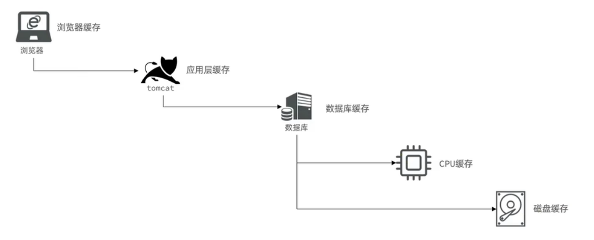


### 2.2 添加商户缓存

在我们查询商户信息时，我们是直接操作从数据库中去进行查询的，大致逻辑是这样，直接查询数据库那肯定慢咯，所以我们需要增加缓存

```
@GetMapping("/{id}")
public Result queryShopById(@PathVariable("id") Long id) {
    //这里是直接查询数据库
    return shopService.queryById(id);
}
```

#### 2.2.1 、缓存模型和思路

标准的操作方式就是查询数据库之前先查询缓存，如果缓存数据存在，则直接从缓存中返回，如果缓存数据不存在，再查询数据库，然后将数据存入redis。


#### 2.1.2、代码如下

代码思路：如果缓存有，则直接返回，如果缓存不存在，则查询数据库，然后存入redis。

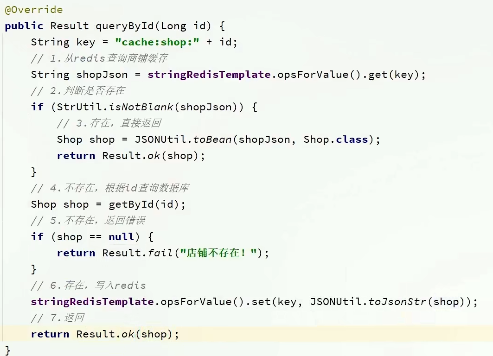

### 2.3 缓存更新策略

缓存更新是redis为了节约内存而设计出来的一个东西，主要是因为内存数据宝贵，当我们向redis插入太多数据，此时就可能会导致缓存中的数据过多，所以redis会对部分数据进行更新，或者把他叫为淘汰更合适。

**内存淘汰：** redis自动进行，当redis内存达到咱们设定的max-memery的时候，会自动触发淘汰机制，淘汰掉一些不重要的数据(可以自己设置策略方式)

**超时剔除：** 当我们给redis设置了过期时间ttl之后，redis会将超时的数据进行删除，方便咱们继续使用缓存

**主动更新：** 我们可以手动调用方法把缓存删掉，通常用于解决缓存和数据库不一致问题

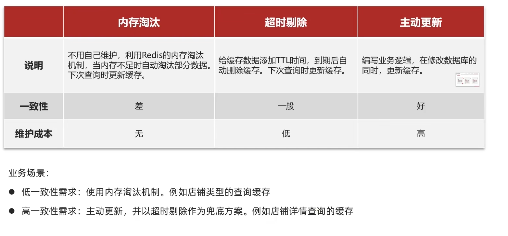

#### 2.3.1 、数据库缓存不一致解决方案：


由于我们的**缓存的数据源来自于数据库**,而数据库的**数据是会发生变化的**,因此,如果当数据库中**数据发生变化,而缓存却没有同步**,此时就会有**一致性问题存在**,其后果是:

用户使用缓存中的过时数据,就会产生类似多线程数据安全问题,从而影响业务,产品口碑等;怎么解决呢？有如下几种方案

Cache Aside Pattern 人工编码方式：缓存调用者在更新完数据库后再去更新缓存，也称之为双写方案

Read/Write Through Pattern : 由系统本身完成，数据库与缓存的问题交由系统本身去处理

Write Behind Caching Pattern ：调用者只操作缓存，其他线程去异步处理数据库，实现最终一致


#### 2.3.2 、数据库和缓存不一致采用什么方案

综合考虑使用方案一，但是方案一调用者如何处理呢？这里有几个问题

操作缓存和数据库时有三个问题需要考虑：


如果采用第一个方案，那么假设我们每次操作数据库后，都操作缓存，但是中间如果没有人查询，那么这个更新动作实际上只有最后一次生效，中间的更新动作意义并不大，我们可以把缓存删除，等待再次查询时，将缓存中的数据加载出来

* 删除缓存还是更新缓存？
  * 更新缓存：每次更新数据库都更新缓存，无效写操作较多
  * 删除缓存：更新数据库时让缓存失效，查询时再更新缓存

* 如何保证缓存与数据库的操作的同时成功或失败？
  * 单体系统，将缓存与数据库操作放在一个事务
  * 分布式系统，利用TCC等分布式事务方案

应该具体操作缓存还是操作数据库，我们应当是先操作数据库，再删除缓存，原因在于，如果你选择第一种方案，在两个线程并发来访问时，假设线程1先来，他先把缓存删了，此时线程2过来，他查询缓存数据并不存在，此时他写入缓存，当他写入缓存后，线程1再执行更新动作时，实际上写入的就是旧的数据，新的数据被旧数据覆盖了。

* 先操作缓存还是先操作数据库？
  * 先删除缓存，再操作数据库
  * 先操作数据库，再删除缓存


### 2.4 实现商铺和缓存与数据库双写一致

核心思路如下：

修改ShopController中的业务逻辑，满足下面的需求：

根据id查询店铺时，如果缓存未命中，则查询数据库，将数据库结果写入缓存，并设置超时时间

根据id修改店铺时，先修改数据库，再删除缓存

**修改重点代码1**：修改**ShopServiceImpl**的queryById方法

**设置redis缓存时添加过期时间**


**修改重点代码2**

代码分析：通过之前的淘汰，我们确定了采用删除策略，来解决双写问题，当我们修改了数据之后，然后把缓存中的数据进行删除，查询时发现缓存中没有数据，则会从mysql中加载最新的数据，从而避免数据库和缓存不一致的问题

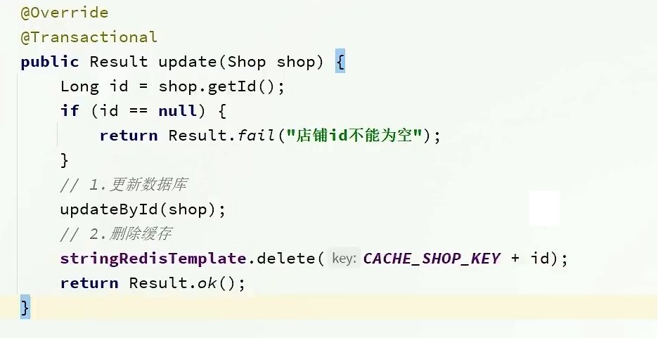

### 2.5 缓存穿透问题的解决思路

缓存穿透 ：缓存穿透是指客户端请求的数据在缓存中和数据库中都不存在，这样缓存永远不会生效，这些请求都会打到数据库。

常见的解决方案有两种：

* 缓存空对象
  * 优点：实现简单，维护方便
  * 缺点：
    * 额外的内存消耗
    * 可能造成短期的不一致
* 布隆过滤
  * 优点：内存占用较少，没有多余key
  * 缺点：
    * 实现复杂
    * 存在误判可能

**缓存空对象思路分析：** 当我们客户端访问不存在的数据时，先请求redis，但是此时redis中没有数据，此时会访问到数据库，但是数据库中也没有数据，这个数据穿透了缓存，直击数据库，我们都知道数据库能够承载的并发不如redis这么高，如果大量的请求同时过来访问这种不存在的数据，这些请求就都会访问到数据库，简单的解决方案就是哪怕这个数据在数据库中也不存在，我们也把这个数据存入到redis中去，这样，下次用户过来访问这个不存在的数据，那么在redis中也能找到这个数据就不会进入到缓存了

**布隆过滤：** 布隆过滤器其实采用的是哈希思想来解决这个问题，通过一个庞大的二进制数组，走哈希思想去判断当前这个要查询的这个数据是否存在，如果布隆过滤器判断存在，则放行，这个请求会去访问redis，哪怕此时redis中的数据过期了，但是数据库中一定存在这个数据，在数据库中查询出来这个数据后，再将其放入到redis中，

假设布隆过滤器判断这个数据不存在，则直接返回

这种方式优点在于节约内存空间，存在误判，误判原因在于：布隆过滤器走的是哈希思想，只要哈希思想，就可能存在哈希冲突


### 2.6 编码解决商品查询的缓存穿透问题：

核心思路如下：

在原来的逻辑中，我们如果发现这个数据在mysql中不存在，直接就返回404了，这样是会存在缓存穿透问题的

现在的逻辑中：如果这个数据不存在，我们不会返回404 ，还是会把这个数据写入到Redis中，并且将value设置为空，欧当再次发起查询时，我们如果发现命中之后，判断这个value是否是null，如果是null，则是之前写入的数据，证明是缓存穿透数据，如果不是，则直接返回数据。


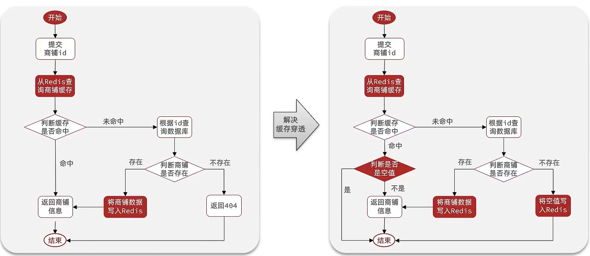

**小总结：**

缓存穿透产生的原因是什么？

* 用户请求的数据在缓存中和数据库中都不存在，不断发起这样的请求，给数据库带来巨大压力

缓存穿透的解决方案有哪些？

* 缓存null值
* 布隆过滤
* 增强id的复杂度，避免被猜测id规律
* 做好数据的基础格式校验
* 加强用户权限校验
* 做好热点参数的限流

### 2.7 缓存雪崩问题及解决思路

缓存雪崩是指在同一时段大量的缓存key同时失效或者Redis服务宕机，导致大量请求到达数据库，带来巨大压力。

解决方案：

* 给不同的Key的TTL添加随机值
* 利用Redis集群提高服务的可用性
* 给缓存业务添加降级限流策略
* 给业务添加多级缓存


### 2.8 缓存击穿问题及解决思路

缓存击穿问题也叫热点Key问题，就是一个被高并发访问并且缓存重建业务较复杂的key突然失效了，无数的请求访问会在瞬间给数据库带来巨大的冲击。

常见的解决方案有两种：

* 互斥锁
* 逻辑过期

逻辑分析：假设线程1在查询缓存之后，本来应该去查询数据库，然后把这个数据重新加载到缓存的，此时只要线程1走完这个逻辑，其他线程就都能从缓存中加载这些数据了，但是假设在线程1没有走完的时候，后续的线程2，线程3，线程4同时过来访问当前这个方法， 那么这些线程都不能从缓存中查询到数据，那么他们就会同一时刻来访问查询缓存，都没查到，接着同一时间去访问数据库，同时的去执行数据库代码，对数据库访问压力过大


解决方案一、使用锁来解决：

因为锁能实现互斥性。假设线程过来，只能一个人一个人的来访问数据库，从而避免对于数据库访问压力过大，但这也会影响查询的性能，因为此时会让查询的性能从并行变成了串行，我们可以采用tryLock方法 + double check来解决这样的问题。

假设现在线程1过来访问，他查询缓存没有命中，但是此时他获得到了锁的资源，那么线程1就会一个人去执行逻辑，假设现在线程2过来，线程2在执行过程中，并没有获得到锁，那么线程2就可以进行到休眠，直到线程1把锁释放后，线程2获得到锁，然后再来执行逻辑，此时就能够从缓存中拿到数据了。


解决方案二、逻辑过期方案

方案分析：我们之所以会出现这个缓存击穿问题，主要原因是在于我们对key设置了过期时间，假设我们不设置过期时间，其实就不会有缓存击穿的问题，但是不设置过期时间，这样数据不就一直占用我们内存了吗，我们可以采用逻辑过期方案。

我们把过期时间设置在 redis的value中，注意：这个过期时间并不会直接作用于redis，而是我们后续通过逻辑去处理。假设线程1去查询缓存，然后从value中判断出来当前的数据已经过期了，此时线程1去获得互斥锁，那么其他线程会进行阻塞，获得了锁的线程他会开启一个 线程去进行 以前的重构数据的逻辑，直到新开的线程完成这个逻辑后，才释放锁， 而线程1直接进行返回，假设现在线程3过来访问，由于线程线程2持有着锁，所以线程3无法获得锁，线程3也直接返回数据，只有等到新开的线程2把重建数据构建完后，其他线程才能走返回正确的数据。

这种方案巧妙在于，异步的构建缓存，缺点在于在构建完缓存之前，返回的都是脏数据。


进行对比

**互斥锁方案：** 由于保证了互斥性，所以数据一致，且实现简单，因为仅仅只需要加一把锁而已，也没其他的事情需要操心，所以没有额外的内存消耗，缺点在于有锁就有死锁问题的发生，且只能串行执行性能肯定受到影响

**逻辑过期方案：** 线程读取过程中不需要等待，性能好，有一个额外的线程持有锁去进行重构数据，但是在重构数据完成前，其他的线程只能返回之前的数据，且实现起来麻烦


### 2.9 利用互斥锁解决缓存击穿问题

核心思路：相较于原来从缓存中查询不到数据后直接查询数据库而言，现在的方案是 进行查询之后，如果从缓存没有查询到数据，则进行互斥锁的获取，获取互斥锁后，判断是否获得到了锁，如果没有获得到，则休眠，过一会再进行尝试，直到获取到锁为止，才能进行查询

如果获取到了锁的线程，再去进行查询，查询后将数据写入redis，再释放锁，返回数据，利用互斥锁就能保证只有一个线程去执行操作数据库的逻辑，防止缓存击穿


**操作锁的代码：**

核心思路就是利用redis的setnx方法来表示获取锁，该方法含义是redis中如果没有这个key，则插入成功，返回1，在stringRedisTemplate中返回true，  如果有这个key则插入失败，则返回0，在stringRedisTemplate返回false，我们可以通过true，或者是false，来表示是否有线程成功插入key，成功插入的key的线程我们认为他就是获得到锁的线程。

```java

private boolean tryLock(String key) {
    Boolean flag = stringRedisTemplate.opsForValue().setIfAbsent(key, "1", 10, TimeUnit.SECONDS);
    return BooleanUtil.isTrue(flag);
}

private void unlock(String key) {
    stringRedisTemplate.delete(key);
}
```

**操作代码：**

```java
 public Shop queryWithMutex(Long id)  {
        String key = CACHE_SHOP_KEY + id;
        // 1、从redis中查询商铺缓存
        String shopJson = stringRedisTemplate.opsForValue().get("key");
        // 2、判断是否存在
        if (StrUtil.isNotBlank(shopJson)) {
            // 存在,直接返回
            return JSONUtil.toBean(shopJson, Shop.class);
        }
        //判断命中的值是否是空值
        if("".equals(shopJson)) {
            return null;
        }
        // 4.实现缓存重构
        //4.1 获取互斥锁
        String lockKey = "lock:shop:" + id;
        Shop shop = null;
        try {
            boolean isLock = tryLock(lockKey);
            // 4.2 判断否获取成功
            if(!isLock){
                //4.3 失败，则休眠重试
                Thread.sleep(50);
                return queryWithMutex(id);
            }
            //4.4 成功，根据id查询数据库
            // 4.4.1 Double Check
            shopJson = stringRedisTemplate.opsForValue().get(key);
            if (StrUtil.isNotBlank(json)) {
                return JSONUtil.toBean(json, Shop.class);
            }
            // 判断命中的是否是空值
            if("".equals(shopJson)) {
                return null;
            }

             shop = getById(id);
            // 5.不存在，返回错误
            if(shop == null){
                 //将空值写入redis
                stringRedisTemplate.opsForValue().set(key,"",CACHE_NULL_TTL,TimeUnit.MINUTES);
                //返回错误信息
                return null;
            }
            //6.写入redis
            stringRedisTemplate.opsForValue().set(key,JSONUtil.toJsonStr(shop),CACHE_NULL_TTL,TimeUnit.MINUTES);

        }catch (Exception e){
            throw new RuntimeException(e);
        }
        finally {
            //7.释放互斥锁
            unlock(lockKey);
        }
        return shop;
    }
```

###  3.0 、利用逻辑过期解决缓存击穿问题

**需求：修改根据id查询商铺的业务，基于逻辑过期方式来解决缓存击穿问题**

思路分析：当用户开始查询redis时，判断是否命中，如果没有命中则直接返回空数据，不查询数据库，而一旦命中后，将value取出，判断value中的过期时间是否满足，如果没有过期，则直接返回redis中的数据，如果过期，则在开启独立线程后直接返回之前的数据，独立线程去重构数据，重构完成后释放互斥锁。


如果封装数据：因为现在redis中存储的数据的value需要带上过期时间，此时要么你去修改原来的实体类，要么你

**步骤一、**

新建一个实体类，我们采用第二个方案，这个方案，对原来代码没有侵入性。

```
@Data
public class RedisData {
    private LocalDateTime expireTime;
    private Object data;
}
```

**步骤二、**

在**ShopServiceImpl** 新增此方法，利用单元测试进行缓存预热


**在测试类中**


步骤三：正式代码

**ShopServiceImpl**

```java
private static final ExecutorService CACHE_REBUILD_EXECUTOR = Executors.newFixedThreadPool(10);
public Shop queryWithLogicalExpire( Long id ) {
    String key = CACHE_SHOP_KEY + id;
    // 1.从redis查询商铺缓存
    String json = stringRedisTemplate.opsForValue().get(key);
    // 2.判断是否存在
    if (StrUtil.isBlank(json)) {
        // 3.存在，直接返回
        return null;
    }
    // 4.命中，需要先把json反序列化为对象
    RedisData redisData = JSONUtil.toBean(json, RedisData.class);
    Shop shop = JSONUtil.toBean((JSONObject) redisData.getData(), Shop.class);
    LocalDateTime expireTime = redisData.getExpireTime();
    // 5.判断是否过期
    if(expireTime.isAfter(LocalDateTime.now())) {
        // 5.1.未过期，直接返回店铺信息
        return shop;
    }
    // 5.2.已过期，需要缓存重建
    // 6.缓存重建
    // 6.1.获取互斥锁
    String lockKey = LOCK_SHOP_KEY + id;
    boolean isLock = tryLock(lockKey);
    // 6.2.判断是否获取锁成功
    if (isLock){
        // 再次判断redis缓存是否过期 Double check
        json = stringRedisTemplate.opsForValue().get(key);
        redisData = JSONUtil.toBean(json, RedisData.class);
        if (redisData.getExpireTime().isAfter(LocalDateTime.now())) {
            return JSONUtil.toBean((JSONObject) redisData.getData(), , Shop.class);
        }

        CACHE_REBUILD_EXECUTOR.submit( ()->{
            try{
                //重建缓存
                this.saveShop2Redis(id, 20L);
            }catch (Exception e){
                throw new RuntimeException(e);
            }finally {
                unlock(lockKey);
            }
        });
    }
    // 6.4.返回过期的商铺信息
    return shop;
}
```

### 3.1、封装Redis工具类

基于StringRedisTemplate封装一个缓存工具类，满足下列需求：

* 方法1：将任意Java对象序列化为json并存储在string类型的key中，并且可以设置TTL过期时间
* 方法2：将任意Java对象序列化为json并存储在string类型的key中，并且可以设置逻辑过期时间，用于处理缓

存击穿问题

* 方法3：根据指定的key查询缓存，并反序列化为指定类型，利用缓存空值的方式解决缓存穿透问题
* 方法4：根据指定的key查询缓存，并反序列化为指定类型，需要利用逻辑过期解决缓存击穿问题

将逻辑进行封装

```java
@Component
public class CacheClient {
    @Autowired
    private StringRedisTemplate stringRedisTemplate;
    // 缓存重建线程池
    private static final ExecutorService CACHE_REBUILD_EXECUTOR = Executors.newFixedThreadPool(10);

    /**
     * 缓存数据
     * @param key
     * @param value
     * @param time
     * @param unit
     */
    public void set(String key, Object value, Long time, TimeUnit unit) {
        stringRedisTemplate.opsForValue().set(key, JSONUtil.toJsonStr(value), time, unit);
    }

    /**
     * 逻辑过期缓存数据
     * @param key
     * @param value
     * @param time
     * @param unit
     */
    public void setWithLogicalExpire(String key, Object value, Long time, TimeUnit unit) {
        // 封装逻辑过期时间
        RedisData redisData = new RedisData();
        redisData.setData(value);
        redisData.setExpireTime(LocalDateTime.now().plusSeconds(unit.toSeconds(time)));
        // 写入redis
        stringRedisTemplate.opsForValue().set(key, JSONUtil.toJsonStr(redisData));
    }

    /**
     * 存空字符串解决缓存穿透
     * @param cachePrefix 缓存前缀
     * @param id id
     * @param type 返回类型
     * @param dbFallback 数据库查询方法
     * @param time 缓存时间
     * @param unit 时间单位
     * @return <R>
     */
    public <R, ID> R queryWithPassThrough(String cachePrefix, ID id, Class<R> type, Function<ID, R> dbFallback, Long time, TimeUnit unit) {
        String key = cachePrefix + id;
        // 1.从redis查询商铺缓存
        String json = stringRedisTemplate.opsForValue().get(key);
        // 2.判断是否存在
        if (StrUtil.isNotBlank(json)) {
            return JSONUtil.toBean(json, type);
        }
        // 判断命中的是否是空值
        if("".equals(json)) {
            return null;
        }

        // 3.不存在，根据id查询数据库
        R r = dbFallback.apply(id);
        if (r == null) {
            // Redis 写入空值，解决缓存穿透
            this.set(key, "", RedisConstants.CACHE_NULL_TTL, TimeUnit.MINUTES);
            return null;
        }
        // 4.存在，写入redis
        this.set(key, r, time, unit);
        return r;
    }

    /**
     * 逻辑过期解决缓存击穿
     * @param cachePrefix 缓存前缀
     * @param lockPrefix 锁前缀
     * @param lockTtl 锁过期时间
     * @param id id
     * @param type 返回类型
     * @param dbFallback 数据库查询方法
     * @param time 缓存时间
     * @param unit 时间单位
     * @return <R>
     */
    public  <R, ID> R queryWithLogicalExpire(String cachePrefix, String lockPrefix, Long lockTtl, ID id, Class<R> type, Function<ID, R> dbFallback, Long time, TimeUnit unit) {
        String key = cachePrefix + id;
        // 1.从redis查询缓存
        String redisDataJson = stringRedisTemplate.opsForValue().get(key);
        // 2.判断是否存在
        if (StrUtil.isBlank(redisDataJson)) {
            return null;
        }
        RedisData redisData = JSONUtil.toBean(redisDataJson, RedisData.class);
        R r = JSONUtil.toBean((JSONObject) redisData.getData(), type);
        // 3.命中，判断是否过期
        // 3.1.未过期，直接返回
        if (redisData.getExpireTime().isAfter(LocalDateTime.now())) {
            return r;
        }
        // 3.2.已过期，需要缓存重建
        // 获取互斥锁
        String lockKey = lockPrefix + id;
        boolean isLock = tryLock(lockKey, lockTtl);
        // 获取锁成功，根据id查询数据库
        if (isLock) {
            // 再次判断redis缓存是否过期 Double check
            redisDataJson = stringRedisTemplate.opsForValue().get(key);
            redisData = JSONUtil.toBean(redisDataJson, RedisData.class);
            if (redisData.getExpireTime().isAfter(LocalDateTime.now())) {
                return JSONUtil.toBean((JSONObject) redisData.getData(), type);
            }

            // 开启独立线程，实现缓存重建
            CACHE_REBUILD_EXECUTOR.submit(() -> {
                // 缓存重建
                // 查数据库
                R rRebuild = null;
                try {
                    rRebuild = dbFallback.apply(id);
                    // 写入redis
                    this.setWithLogicalExpire(key, rRebuild, time,  unit);
                } catch (Exception e) {
                    throw new RuntimeException(e);
                } finally {
                    // 释放锁
                    unlock(lockKey);
                }
            });
        }
        return r;
    }

    /**
     * 互斥锁解决缓存击穿 及 存空字符串解决缓存穿透
     * @param cachePrefix 缓存前缀
     * @param lockPrefix 锁前缀
     * @param lockTtl 锁过期时间
     * @param id id
     * @param type 返回类型
     * @param dbFallback 数据库查询方法
     * @param time 缓存时间
     * @param unit 时间单位
     * @return <R>
     */
    public <R, ID> R queryWithMutex(String cachePrefix, String lockPrefix, Long lockTtl, ID id, Class<R> type, Function<ID, R> dbFallback, Long time, TimeUnit unit) {
        String key = cachePrefix + id;
        // 1.从redis查询缓存
        String json = stringRedisTemplate.opsForValue().get(key);
        // 2.判断是否存在
        if (StrUtil.isNotBlank(json)) {
            return JSONUtil.toBean(json, type);
        }
        // 判断命中的是否是空值 -> 解决缓存穿透
        if("".equals(json)) {
            return null;
        }

        // 4.实现缓存重建
        // 4.1 获取互斥锁
        R r = null;
        String lockKey = lockPrefix + id;
        try {
            boolean isLock = tryLock(lockKey, lockTtl);
            // 4.2 判断锁是否获取成功
            // 4.3 失败则休眠重试
            if (!isLock) {
                Thread.sleep(50);
                return queryWithMutex(cachePrefix, lockPrefix, lockTtl, id, type, dbFallback, time, unit);
            }

            // 4.4 重建缓存，根据id查询数据库
            // 4.4.1 Double Check
            json = stringRedisTemplate.opsForValue().get(key);
            if (StrUtil.isNotBlank(json)) {
                return JSONUtil.toBean(json, type);
            }
            // 判断命中的是否是空值
            if("".equals(json)) {
                return null;
            }

            r = dbFallback.apply(id);
            Thread.sleep(200);
            if (r == null) {
                // Redis 写入空值，解决缓存穿透
                this.set(key, "", CACHE_NULL_TTL, TimeUnit.MINUTES);
                return null;
            }
            // 4.存在，写入redis
            this.set(key, r, time, unit);
        } catch (InterruptedException e) {
            throw new RuntimeException(e);
        } finally {
            unlock(lockKey);
        }
        return r;
    }

    /**
     * 获取互斥锁
     * @param key 锁的key
     * @param ttl 锁的过期时间
     * @return 锁是否获取成功
     */
    private boolean tryLock(String key, long ttl) {
        Boolean flag = stringRedisTemplate.opsForValue().setIfAbsent(
                key,
                "1",
                ttl,
                TimeUnit.SECONDS);
        return Boolean.TRUE.equals(flag);
    }

    private void unlock(String key) {
        stringRedisTemplate.delete(key);
    }
}
```

在ShopServiceImpl 中

```java
@Resource
private CacheClient cacheClient;

 @Override
    public Result queryById(Long id) {
        // 解决缓存穿透
        Shop shop = cacheClient
                .queryWithPassThrough(CACHE_SHOP_KEY, id, Shop.class, this::getById, CACHE_SHOP_TTL, TimeUnit.MINUTES);

        // 互斥锁解决缓存击穿
        // Shop shop = cacheClient
        //         .queryWithMutex(CACHE_SHOP_KEY, id, Shop.class, this::getById, CACHE_SHOP_TTL, TimeUnit.MINUTES);

        // 逻辑过期解决缓存击穿
        // Shop shop = cacheClient
        //         .queryWithLogicalExpire(CACHE_SHOP_KEY, id, Shop.class, this::getById, 20L, TimeUnit.SECONDS);

        if (shop == null) {
            return Result.fail("店铺不存在！");
        }
        // 7.返回
        return Result.ok(shop);
    }
```

## 3、优惠卷秒杀

### 3.1 -全局唯一ID

每个店铺都可以发布优惠券：


当用户抢购时，就会生成订单并保存到tb_voucher_order这张表中，而订单表如果使用数据库自增ID就存在一些问题：

* id的规律性太明显
* 受单表数据量的限制

场景分析：如果我们的id具有太明显的规则，用户或者说商业对手很容易猜测出来我们的一些敏感信息，比如商城在一天时间内，卖出了多少单，这明显不合适。

场景分析二：随着我们商城规模越来越大，mysql的单表的容量不宜超过500W，数据量过大之后，我们要进行拆库拆表，但拆分表了之后，他们从逻辑上讲他们是同一张表，所以他们的id是不能一样的， 于是乎我们需要保证id的唯一性。

**全局ID生成器**，是一种在分布式系统下用来生成全局唯一ID的工具，一般要满足下列特性：


为了增加ID的安全性，我们可以不直接使用Redis自增的数值，而是拼接一些其它信息：

ID的组成部分：符号位：1bit，永远为0

时间戳：31bit，以秒为单位，可以使用69年

序列号：32bit，秒内的计数器，支持每秒产生2^32个不同ID

### 3.2 -Redis实现全局唯一Id

```java
@Component
public class RedisIdWorker {
    /**
     * 开始时间戳
     */
    private static final long BEGIN_TIMESTAMP = 1640995200L;
    /**
     * 序列号的位数
     */
    private static final int COUNT_BITS = 32;

    private StringRedisTemplate stringRedisTemplate;

    public RedisIdWorker(StringRedisTemplate stringRedisTemplate) {
        this.stringRedisTemplate = stringRedisTemplate;
    }

    public long nextId(String keyPrefix) {
        // 1.生成时间戳
        LocalDateTime now = LocalDateTime.now();
        long nowSecond = now.toEpochSecond(ZoneOffset.UTC);
        long timestamp = nowSecond - BEGIN_TIMESTAMP;

        // 2.生成序列号
        // 2.1.获取当前日期，精确到天
        String date = now.format(DateTimeFormatter.ofPattern("yyyy:MM:dd"));
        // 2.2.自增长
        long count = stringRedisTemplate.opsForValue().increment("icr:" + keyPrefix + ":" + date);

        // 3.拼接并返回
        return timestamp << COUNT_BITS | (count & 0xffffffff);
    }
}
```

测试类

知识小贴士：关于countdownlatch

countdownlatch名为信号枪：主要的作用是同步协调在多线程的等待于唤醒问题

我们如果没有CountDownLatch ，那么由于程序是异步的，当异步程序没有执行完时，主线程就已经执行完了，然后我们期望的是分线程全部走完之后，主线程再走，所以我们此时需要使用到CountDownLatch

CountDownLatch 中有两个最重要的方法

1、countDown

2、await

await 方法 是阻塞方法，我们担心分线程没有执行完时，main线程就先执行，所以使用await可以让main线程阻塞，那么什么时候main线程不再阻塞呢？当CountDownLatch  内部维护的 变量变为0时，就不再阻塞，直接放行，那么什么时候CountDownLatch   维护的变量变为0 呢，我们只需要调用一次countDown ，内部变量就减少1，我们让分线程和变量绑定， 执行完一个分线程就减少一个变量，当分线程全部走完，CountDownLatch 维护的变量就是0，此时await就不再阻塞，统计出来的时间也就是所有分线程执行完后的时间。

```java
@Test
void testIdWorker() throws InterruptedException {
    CountDownLatch latch = new CountDownLatch(300);

    Runnable task = () -> {
        for (int i = 0; i < 100; i++) {
            long id = redisIdWorker.nextId("order");
            System.out.println("id = " + id);
        }
        latch.countDown();
    };
    long begin = System.currentTimeMillis();
    for (int i = 0; i < 300; i++) {
        es.submit(task);
    }
    latch.await();
    long end = System.currentTimeMillis();
    System.out.println("time = " + (end - begin));
}
```

### 3.3 添加优惠卷

每个店铺都可以发布优惠券，分为平价券和特价券。平价券可以任意购买，而特价券需要秒杀抢购：


tb_voucher：优惠券的基本信息，优惠金额、使用规则等
tb_seckill_voucher：优惠券的库存、开始抢购时间，结束抢购时间。特价优惠券才需要填写这些信息

平价卷由于优惠力度并不是很大，所以是可以任意领取

而代金券由于优惠力度大，所以像第二种卷，就得限制数量，从表结构上也能看出，特价卷除了具有优惠卷的基本信息以外，还具有库存，抢购时间，结束时间等等字段

**新增普通卷代码：  **VoucherController

```java
@PostMapping
public Result addVoucher(@RequestBody Voucher voucher) {
    voucherService.save(voucher);
    return Result.ok(voucher.getId());
}
```

**新增秒杀卷代码：**

**VoucherController**

```java
@PostMapping("seckill")
public Result addSeckillVoucher(@RequestBody Voucher voucher) {
    voucherService.addSeckillVoucher(voucher);
    return Result.ok(voucher.getId());
}
```

**VoucherServiceImpl**

```java
@Override
@Transactional
public void addSeckillVoucher(Voucher voucher) {
    // 保存优惠券
    save(voucher);
    // 保存秒杀信息
    SeckillVoucher seckillVoucher = new SeckillVoucher();
    seckillVoucher.setVoucherId(voucher.getId());
    seckillVoucher.setStock(voucher.getStock());
    seckillVoucher.setBeginTime(voucher.getBeginTime());
    seckillVoucher.setEndTime(voucher.getEndTime());
    seckillVoucherService.save(seckillVoucher);
    // 保存秒杀库存到Redis中
    stringRedisTemplate.opsForValue().set(SECKILL_STOCK_KEY + voucher.getId(), voucher.getStock().toString());
}
```

### 3.4 实现秒杀下单

下单核心思路：当我们点击抢购时，会触发右侧的请求，我们只需要编写对应的controller即可


秒杀下单应该思考的内容：

下单时需要判断两点：

* 秒杀是否开始或结束，如果尚未开始或已经结束则无法下单
* 库存是否充足，不足则无法下单

下单核心逻辑分析：

当用户开始进行下单，我们应当去查询优惠卷信息，查询到优惠卷信息，判断是否满足秒杀条件

比如时间是否充足，如果时间充足，则进一步判断库存是否足够，如果两者都满足，则扣减库存，创建订单，然后返回订单id，如果有一个条件不满足则直接结束。


VoucherOrderServiceImpl

```java
@Override
public Result seckillVoucher(Long voucherId) {
    // 1.查询优惠券
    SeckillVoucher voucher = seckillVoucherService.getById(voucherId);
    // 2.判断秒杀是否开始
    if (voucher.getBeginTime().isAfter(LocalDateTime.now())) {
        // 尚未开始
        return Result.fail("秒杀尚未开始！");
    }
    // 3.判断秒杀是否已经结束
    if (voucher.getEndTime().isBefore(LocalDateTime.now())) {
        // 尚未开始
        return Result.fail("秒杀已经结束！");
    }
    // 4.判断库存是否充足
    if (voucher.getStock() < 1) {
        // 库存不足
        return Result.fail("库存不足！");
    }
    //5，扣减库存
    boolean success = seckillVoucherService.update()
            .setSql("stock= stock -1")
            .eq("voucher_id", voucherId).update();
    if (!success) {
        //扣减库存
        return Result.fail("库存不足！");
    }
    //6.创建订单
    VoucherOrder voucherOrder = new VoucherOrder();
    // 6.1.订单id
    long orderId = redisIdWorker.nextId("order");
    voucherOrder.setId(orderId);
    // 6.2.用户id
    Long userId = UserHolder.getUser().getId();
    voucherOrder.setUserId(userId);
    // 6.3.代金券id
    voucherOrder.setVoucherId(voucherId);
    save(voucherOrder);

    return Result.ok(orderId);

}
```

### 3.5 库存超卖问题分析

有关超卖问题分析：在我们原有代码中是这么写的

```java
 if (voucher.getStock() < 1) {
        // 库存不足
        return Result.fail("库存不足！");
    }
    //5，扣减库存
    boolean success = seckillVoucherService.update()
            .setSql("stock= stock -1")
            .eq("voucher_id", voucherId).update();
    if (!success) {
        //扣减库存
        return Result.fail("库存不足！");
    }
```

假设线程1过来查询库存，判断出来库存大于1，正准备去扣减库存，但是还没有来得及去扣减，此时线程2过来，线程2也去查询库存，发现这个数量一定也大于1，那么这两个线程都会去扣减库存，最终多个线程相当于一起去扣减库存，此时就会出现库存的超卖问题。


超卖问题是典型的多线程安全问题，针对这一问题的常见解决方案就是加锁：而对于加锁，我们通常有两种解决方案：见下图：

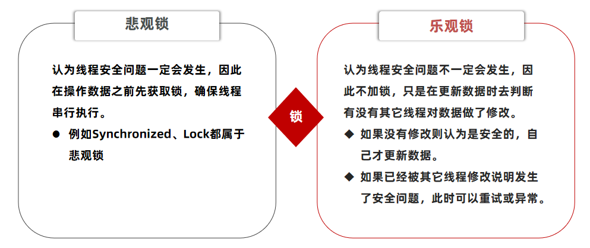

**悲观锁：**

 悲观锁可以实现对于数据的串行化执行，比如syn，和lock都是悲观锁的代表，同时，悲观锁中又可以再细分为公平锁，非公平锁，可重入锁，等等

**乐观锁：**

  乐观锁：会有一个版本号，每次操作数据会对版本号+1，再提交回数据时，会去校验是否比之前的版本大1 ，如果大1 ，则进行操作成功，这套机制的核心逻辑在于，如果在操作过程中，版本号只比原来大1 ，那么就意味着操作过程中没有人对他进行过修改，他的操作就是安全的，如果不大1，则数据被修改过，当然乐观锁还有一些变种的处理方式比如cas

  乐观锁的典型代表：就是cas，利用cas进行无锁化机制加锁，var5 是操作前读取的内存值，while中的var1+var2 是预估值，如果预估值 == 内存值，则代表中间没有被人修改过，此时就将新值去替换 内存值

  其中do while 是为了在操作失败时，再次进行自旋操作，即把之前的逻辑再操作一次。

```java
int var5;
do {
    var5 = this.getIntVolatile(var1, var2);
} while(!this.compareAndSwapInt(var1, var2, var5, var5 + var4));

return var5;
```

**课程中的使用方式：**

课程中的使用方式是没有像cas一样带自旋的操作，也没有对version的版本号+1 ，他的操作逻辑是在操作时，对版本号进行+1 操作，然后要求version 如果是1 的情况下，才能操作，那么第一个线程在操作后，数据库中的version变成了2，但是他自己满足version=1 ，所以没有问题，此时线程2执行，线程2 最后也需要加上条件version =1 ，但是现在由于线程1已经操作过了，所以线程2，操作时就不满足version=1 的条件了，所以线程2无法执行成功


### 3.6 乐观锁解决超卖问题

**修改代码方案一、**

VoucherOrderServiceImpl 在扣减库存时，改为：

```java
boolean success = seckillVoucherService.update()
            .setSql("stock= stock -1") //set stock = stock -1
            .eq("voucher_id", voucherId).eq("stock",voucher.getStock()).update(); //where id = ？ and stock = ?
```

以上逻辑的核心含义是：只要我扣减库存时的库存和之前我查询到的库存是一样的，就意味着没有人在中间修改过库存，那么此时就是安全的，但是以上这种方式通过测试发现会有很多失败的情况，失败的原因在于：在使用乐观锁过程中假设100个线程同时都拿到了100的库存，然后大家一起去进行扣减，但是100个人中只有1个人能扣减成功，其他的人在处理时，他们在扣减时，库存已经被修改过了，所以此时其他线程都会失败

**修改代码方案二、**

之前的方式要修改前后都保持一致，但是这样我们分析过，成功的概率太低，所以我们的乐观锁需要变一下，改成stock大于0 即可

```java
boolean success = seckillVoucherService.update()
            .setSql("stock= stock -1")
            .eq("voucher_id", voucherId).update().gt("stock",0); //where id = ? and stock > 0
```

**知识小扩展：**

针对cas中的自旋压力过大，我们可以使用Longaddr这个类去解决

Java8 提供的一个对AtomicLong改进后的一个类，LongAdder

大量线程并发更新一个原子性的时候，天然的问题就是自旋，会导致并发性问题，当然这也比我们直接使用syn来的好

所以利用这么一个类，LongAdder来进行优化

如果获取某个值，则会对cell和base的值进行递增，最后返回一个完整的值


### 3.6 优惠券秒杀-一人一单

需求：修改秒杀业务，要求同一个优惠券，一个用户只能下一单

**现在的问题在于：**

优惠卷是为了引流，但是目前的情况是，一个人可以无限制的抢这个优惠卷，所以我们应当增加一层逻辑，让一个用户只能下一个单，而不是让一个用户下多个单

具体操作逻辑如下：比如时间是否充足，如果时间充足，则进一步判断库存是否足够，然后再根据优惠卷id和用户id查询是否已经下过这个订单，如果下过这个订单，则不再下单，否则进行下单


VoucherOrderServiceImpl  

**初步代码：增加一人一单逻辑**

```java

@Override
public Result seckillVoucher(Long voucherId) {
    // 1.查询优惠券
    SeckillVoucher voucher = seckillVoucherService.getById(voucherId);
    // 2.判断秒杀是否开始
    if (voucher.getBeginTime().isAfter(LocalDateTime.now())) {
        // 尚未开始
        return Result.fail("秒杀尚未开始！");
    }
    // 3.判断秒杀是否已经结束
    if (voucher.getEndTime().isBefore(LocalDateTime.now())) {
        // 尚未开始
        return Result.fail("秒杀已经结束！");
    }
    // 4.判断库存是否充足
    if (voucher.getStock() < 1) {
        // 库存不足
        return Result.fail("库存不足！");
    }
    // 5.一人一单逻辑
    // 5.1.用户id
    Long userId = UserHolder.getUser().getId();
    int count = query().eq("user_id", userId).eq("voucher_id", voucherId).count();
    // 5.2.判断是否存在
    if (count > 0) {
        // 用户已经购买过了
        return Result.fail("用户已经购买过一次！");
    }

    //6，扣减库存
    boolean success = seckillVoucherService.update()
            .setSql("stock= stock -1")
            .eq("voucher_id", voucherId).update();
    if (!success) {
        //扣减库存
        return Result.fail("库存不足！");
    }
    //7.创建订单
    VoucherOrder voucherOrder = new VoucherOrder();
    // 7.1.订单id
    long orderId = redisIdWorker.nextId("order");
    voucherOrder.setId(orderId);

    voucherOrder.setUserId(userId);
    // 7.3.代金券id
    voucherOrder.setVoucherId(voucherId);
    save(voucherOrder);

    return Result.ok(orderId);

}
```

**存在问题：** 现在的问题还是和之前一样，并发过来，查询数据库，都不存在订单，所以我们还是需要加锁，但是乐观锁比较适合更新数据，而现在是插入数据，所以我们需要使用悲观锁操作

**注意：** 在这里提到了非常多的问题，我们需要慢慢的来思考，首先我们的初始方案是封装了一个createVoucherOrder方法，同时为了确保他线程安全，在方法上添加了一把synchronized 锁

```java
@Transactional
public synchronized Result createVoucherOrder(Long voucherId) {

    Long userId = UserHolder.getUser().getId();
         // 5.1.查询订单
        int count = query().eq("user_id", userId).eq("voucher_id", voucherId).count();
        // 5.2.判断是否存在
        if (count > 0) {
            // 用户已经购买过了
            return Result.fail("用户已经购买过一次！");
        }

        // 6.扣减库存
        boolean success = seckillVoucherService.update()
                .setSql("stock = stock - 1") // set stock = stock - 1
                .eq("voucher_id", voucherId).gt("stock", 0) // where id = ? and stock > 0
                .update();
        if (!success) {
            // 扣减失败
            return Result.fail("库存不足！");
        }

        // 7.创建订单
        VoucherOrder voucherOrder = new VoucherOrder();
        // 7.1.订单id
        long orderId = redisIdWorker.nextId("order");
        voucherOrder.setId(orderId);
        // 7.2.用户id
        voucherOrder.setUserId(userId);
        // 7.3.代金券id
        voucherOrder.setVoucherId(voucherId);
        save(voucherOrder);

        // 7.返回订单id
        return Result.ok(orderId);
}
```

，但是这样添加锁，锁的粒度太粗了，在使用锁过程中，控制**锁粒度** 是一个非常重要的事情，因为如果锁的粒度太大，会导致每个线程进来都会锁住，所以我们需要去控制锁的粒度，以下这段代码需要修改为：
intern() 这个方法是从常量池中拿到数据，如果我们直接使用userId.toString() 他拿到的对象实际上是不同的对象，new出来的对象，我们使用锁必须保证锁必须是同一把，所以我们需要使用intern()方法

```java
@Transactional
public  Result createVoucherOrder(Long voucherId) {
    Long userId = UserHolder.getUser().getId();
    synchronized(userId.toString().intern()){
         // 5.1.查询订单
        int count = query().eq("user_id", userId).eq("voucher_id", voucherId).count();
        // 5.2.判断是否存在
        if (count > 0) {
            // 用户已经购买过了
            return Result.fail("用户已经购买过一次！");
        }

        // 6.扣减库存
        boolean success = seckillVoucherService.update()
                .setSql("stock = stock - 1") // set stock = stock - 1
                .eq("voucher_id", voucherId).gt("stock", 0) // where id = ? and stock > 0
                .update();
        if (!success) {
            // 扣减失败
            return Result.fail("库存不足！");
        }

        // 7.创建订单
        VoucherOrder voucherOrder = new VoucherOrder();
        // 7.1.订单id
        long orderId = redisIdWorker.nextId("order");
        voucherOrder.setId(orderId);
        // 7.2.用户id
        voucherOrder.setUserId(userId);
        // 7.3.代金券id
        voucherOrder.setVoucherId(voucherId);
        save(voucherOrder);

        // 7.返回订单id
        return Result.ok(orderId);
    }
}
```

但是以上代码还是存在问题，问题的原因在于当前方法被spring的事务控制，如果你在方法内部加锁，可能会导致当前方法事务还没有提交，但是锁已经释放也会导致问题，所以我们选择将当前方法整体包裹起来，确保事务不会出现问题：如下：

在seckillVoucher 方法中，添加以下逻辑，这样就能保证事务的特性，同时也控制了锁的粒度


但是以上做法依然有问题，因为你调用的方法，其实是this.的方式调用的，事务想要生效，还得利用代理来生效，所以这个地方，我们需要获得原始的事务对象， 来操作事务

```java
//细节1：锁的范围细节：必须锁住整个事务，否则锁释放但数据库还未更新
synchronized (userId.toString().intern()) { // 细节2：锁住当前用户：为了保证锁定的是用户而不是不同对象。不同锁必须使用toString().intern()
    // 细节3：事务失效问题（代理失效问题）因为事务是基于代理的，而this调用方法不会走代理所以事务会失效
    // 解决方案：使用AopContext获取当前代理对象
    IVoucherOrderService proxy = (IVoucherOrderService) AopContext.currentProxy();
    return proxy.createVoucherOrder(voucherId);
}
```

> 获取当前类的代理对象还需要两步：
> 1.引入依赖：
> ```java
> <dependency>
>     <groupId>org.aspectj</groupId>
>     <artifactId>aspectjweaver</artifactId>
> </dependency>
> ```
> 2.启动类暴露代理：
> ```java
> @EnableAspectJAutoProxy(exposeProxy = true)
> @MapperScan("com.hmdp.mapper")
> @SpringBootApplication
> public class HmDianPingApplication {
>     public static void main(String[] args) {
>         SpringApplication.run(HmDianPingApplication.class, args);
>     }
> }
> ```

### 3.7 集群环境下的并发问题

通过加锁可以解决在单机情况下的一人一单安全问题，但是在集群模式下就不行了。

1、我们将服务启动两份，端口分别为8081和8082：


2、然后修改nginx的conf目录下的nginx.conf文件，配置反向代理和负载均衡：


**具体操作(略)**

**有关锁失效原因分析**

由于现在我们部署了多个tomcat，每个tomcat都有一个属于自己的jvm，那么假设在服务器A的tomcat内部，有两个线程，这两个线程由于使用的是同一份代码，那么他们的锁对象是同一个，是可以实现互斥的，但是如果现在是服务器B的tomcat内部，又有两个线程，但是他们的锁对象写的虽然和服务器A一样，但是锁对象却不是同一个，所以线程3和线程4可以实现互斥，但是却无法和线程1和线程2实现互斥，这就是 集群环境下，syn锁失效的原因，在这种情况下，我们就需要使用分布式锁来解决这个问题。


## 4、分布式锁

### 4.1 、基本原理和实现方式对比

分布式锁：满足分布式系统或集群模式下多进程可见并且互斥的锁。

分布式锁的核心思想就是让大家都使用同一把锁，只要大家使用的是同一把锁，那么我们就能锁住线程，不让线程进行，让程序串行执行，这就是分布式锁的核心思路


那么分布式锁他应该满足一些什么样的条件呢？

可见性：多个线程都能看到相同的结果，注意：这个地方说的可见性并不是并发编程中指的内存可见性，只是说多个进程之间都能感知到变化的意思

互斥：互斥是分布式锁的最基本的条件，使得程序串行执行

高可用：程序不易崩溃，时时刻刻都保证较高的可用性

高性能：由于加锁本身就让性能降低，所有对于分布式锁本身需要他就较高的加锁性能和释放锁性能

安全性：安全也是程序中必不可少的一环


常见的分布式锁有三种

Mysql：mysql本身就带有锁机制，但是由于mysql性能本身一般，所以采用分布式锁的情况下，其实使用mysql作为分布式锁比较少见

Redis：redis作为分布式锁是非常常见的一种使用方式，现在企业级开发中基本都使用redis或者zookeeper作为分布式锁，利用setnx这个方法，如果插入key成功，则表示获得到了锁，如果有人插入成功，其他人插入失败则表示无法获得到锁，利用这套逻辑来实现分布式锁

Zookeeper：zookeeper也是企业级开发中较好的一个实现分布式锁的方案，由于本套视频并不讲解zookeeper的原理和分布式锁的实现，所以不过多阐述


### 4.2 、Redis分布式锁的实现核心思路

实现分布式锁时需要实现的两个基本方法：

* 获取锁：

  * 互斥：确保只能有一个线程获取锁
  * 非阻塞：尝试一次，成功返回true，失败返回false

```bash
set key val nx ex 10
```

* 释放锁：

  * 手动释放
  * 超时释放：获取锁时添加一个超时时间

```bash
del key
```

核心思路：

我们利用redis 的setNx 方法，当有多个线程进入时，我们就利用该方法，第一个线程进入时，redis 中就有这个key 了，返回了1，如果结果是1，则表示他抢到了锁，那么他去执行业务，然后再删除锁，退出锁逻辑，没有抢到锁的哥们，等待一定时间后重试即可

 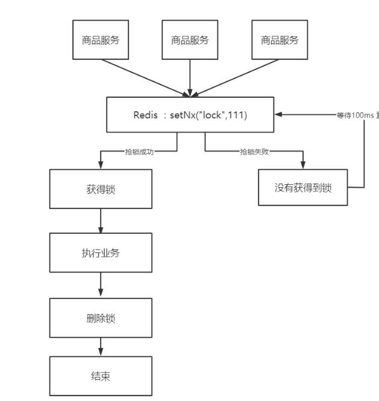

### 4.3 实现分布式锁版本一

* 加锁逻辑

**锁的基本接口**


**SimpleRedisLock**

利用setnx方法进行加锁，同时增加过期时间，防止死锁，此方法可以保证加锁和增加过期时间具有原子性

```java
private static final String KEY_PREFIX="lock:"
@Override
public boolean tryLock(long timeoutSec) {
    // 获取线程标示
    String threadId = Thread.currentThread().getId()
    // 获取锁
    Boolean success = stringRedisTemplate.opsForValue()
            .setIfAbsent(KEY_PREFIX + name, threadId + "", timeoutSec, TimeUnit.SECONDS);
    return Boolean.TRUE.equals(success);
}
```

* 释放锁逻辑

SimpleRedisLock

释放锁，防止删除别人的锁

```java
public void unlock() {
    //通过del删除锁
    stringRedisTemplate.delete(KEY_PREFIX + name);
}
```

* 修改业务代码

```java
  @Override
    public Result seckillVoucher(Long voucherId) {
        // 1.查询优惠券
        SeckillVoucher voucher = seckillVoucherService.getById(voucherId);
        // 2.判断秒杀是否开始
        if (voucher.getBeginTime().isAfter(LocalDateTime.now())) {
            // 尚未开始
            return Result.fail("秒杀尚未开始！");
        }
        // 3.判断秒杀是否已经结束
        if (voucher.getEndTime().isBefore(LocalDateTime.now())) {
            // 尚未开始
            return Result.fail("秒杀已经结束！");
        }
        // 4.判断库存是否充足
        if (voucher.getStock() < 1) {
            // 库存不足
            return Result.fail("库存不足！");
        }
        Long userId = UserHolder.getUser().getId();
        //创建锁对象(新增代码)
        SimpleRedisLock lock = new SimpleRedisLock("order:" + userId, stringRedisTemplate);
        //获取锁对象
        boolean isLock = lock.tryLock(1200);
        //加锁失败
        if (!isLock) {
            return Result.fail("不允许重复下单");
        }
        try {
            //获取代理对象(事务)
            IVoucherOrderService proxy = (IVoucherOrderService) AopContext.currentProxy();
            return proxy.createVoucherOrder(voucherId);
        } finally {
            //释放锁
            lock.unlock();
        }
    }
```

### 4.4 Redis分布式锁误删情况说明

逻辑说明：

持有锁的线程在锁的内部出现了阻塞，导致他的锁自动释放，这时其他线程，线程2来尝试获得锁，就拿到了这把锁，然后线程2在持有锁执行过程中，线程1反应过来，继续执行，而线程1执行过程中，走到了删除锁逻辑，此时就会把本应该属于线程2的锁进行删除，这就是误删别人锁的情况说明

解决方案：解决方案就是在每个线程释放锁的时候，去判断一下当前这把锁是否属于自己，如果属于自己，则不进行锁的删除，假设还是上边的情况，线程1卡顿，锁自动释放，线程2进入到锁的内部执行逻辑，此时线程1反应过来，然后删除锁，但是线程1，一看当前这把锁不是属于自己，于是不进行删除锁逻辑，当线程2走到删除锁逻辑时，如果没有卡过自动释放锁的时间点，则判断当前这把锁是属于自己的，于是删除这把锁。


### 4.5 解决Redis分布式锁误删问题

需求：修改之前的分布式锁实现，满足：在获取锁时存入线程标示（可以用UUID表示）
在释放锁时先获取锁中的线程标示，判断是否与当前线程标示一致

* 如果一致则释放锁
* 如果不一致则不释放锁

核心逻辑：在存入锁时，放入自己线程的标识，在删除锁时，判断当前这把锁的标识是不是自己存入的，如果是，则进行删除，如果不是，则不进行删除。


具体代码如下：加锁

```java
private static final String ID_PREFIX = UUID.randomUUID().toString(true) + "-";
@Override
public boolean tryLock(long timeoutSec) {
   // 获取线程标示
   String threadId = ID_PREFIX + Thread.currentThread().getId();
   // 获取锁
   Boolean success = stringRedisTemplate.opsForValue()
                .setIfAbsent(KEY_PREFIX + name, threadId, timeoutSec, TimeUnit.SECONDS);
   return Boolean.TRUE.equals(success);
}
```

释放锁

```java
public void unlock() {
    // 获取线程标示
    String threadId = ID_PREFIX + Thread.currentThread().getId();
    // 获取锁中的标示
    String id = stringRedisTemplate.opsForValue().get(KEY_PREFIX + name);
    // 判断标示是否一致
    if(threadId.equals(id)) {
        // 释放锁
        stringRedisTemplate.delete(KEY_PREFIX + name);
    }
}
```

**有关代码实操说明：**

在我们修改完此处代码后，我们重启工程，然后启动两个线程，第一个线程持有锁后，手动释放锁，第二个线程 此时进入到锁内部，再放行第一个线程，此时第一个线程由于锁的value值并非是自己，所以不能释放锁，也就无法删除别人的锁，此时第二个线程能够正确释放锁，通过这个案例初步说明我们解决了锁误删的问题。

### 4.6 分布式锁的原子性问题

更为极端的误删逻辑说明：

线程1现在持有锁之后，在执行业务逻辑过程中，他正准备删除锁，而且已经走到了条件判断的过程中，比如他已经拿到了当前这把锁确实是属于他自己的，正准备删除锁，但是此时他的锁到期了，那么此时线程2进来，但是线程1他会接着往后执行，当他卡顿结束后，他直接就会执行删除锁那行代码，相当于条件判断并没有起到作用，这就是删锁时的原子性问题，之所以有这个问题，是因为线程1的拿锁，比锁，删锁，实际上并不是原子性的，我们要防止刚才的情况发生，

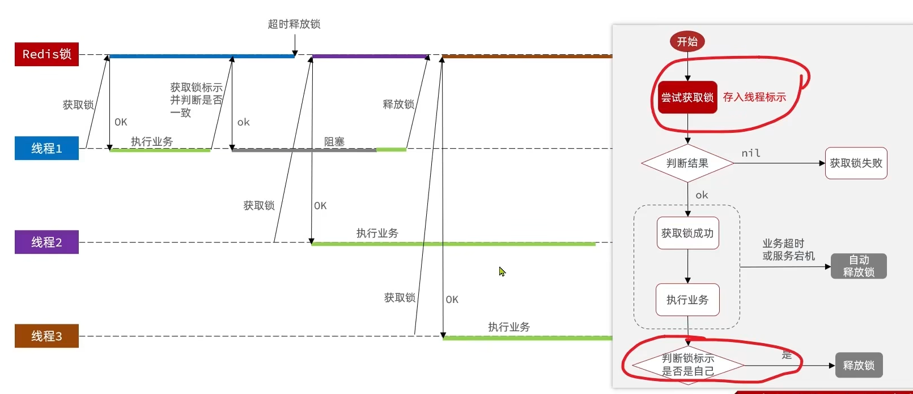

### 4.7 Lua脚本解决多条命令原子性问题

Redis提供了Lua脚本功能，在一个脚本中编写多条Redis命令，确保多条命令执行时的原子性。Lua是一种编程语言，它的基本语法大家可以参考网站：https://www.runoob.com/lua/lua-tutorial.html，这里重点介绍Redis提供的调用函数，我们可以使用lua去操作redis，又能保证他的原子性，这样就可以实现拿锁比锁删锁是一个原子性动作了，作为Java程序员这一块并不作一个简单要求，并不需要大家过于精通，只需要知道他有什么作用即可。

这里重点介绍Redis提供的调用函数，语法如下：

```lua
redis.call('命令名称', 'key', '其它参数', ...)
```

例如，我们要执行set name jack，则脚本是这样：

```lua
# 执行 set name jack
redis.call('set', 'name', 'jack')
```

例如，我们要先执行set name Rose，再执行get name，则脚本如下：

```lua
# 先执行 set name jack
redis.call('set', 'name', 'Rose')
# 再执行 get name
local name = redis.call('get', 'name')
# 返回
return name
```

写好脚本以后，需要用Redis命令来调用脚本，调用脚本的常见命令如下：


例如，我们要执行 redis.call('set', 'name', 'jack') 这个脚本，语法如下：


如果脚本中的key、value不想写死，可以作为参数传递。key类型参数会放入KEYS数组，其它参数会放入ARGV数组，在脚本中可以从KEYS和ARGV数组获取这些参数：


接下来我们来回一下我们释放锁的逻辑：

释放锁的业务流程是这样的

​	1、获取锁中的线程标示

​	2、判断是否与指定的标示（当前线程标示）一致

​	3、如果一致则释放锁（删除）

​	4、如果不一致则什么都不做

如果用Lua脚本来表示则是这样的：

最终我们操作redis的拿锁比锁删锁的lua脚本就会变成这样

```lua
-- 这里的 KEYS[1] 就是锁的key，这里的ARGV[1] 就是当前线程标示
-- 获取锁中的标示，判断是否与当前线程标示一致
if (redis.call('GET', KEYS[1]) == ARGV[1]) then
  -- 一致，则删除锁
  return redis.call('DEL', KEYS[1])
end
-- 不一致，则直接返回
return 0
```

### 4.8 利用Java代码调用Lua脚本改造分布式锁

lua脚本本身并不需要大家花费太多时间去研究，只需要知道如何调用，大致是什么意思即可，所以在笔记中并不会详细的去解释这些lua表达式的含义。

我们的RedisTemplate中，可以利用execute方法去执行lua脚本，参数对应关系就如下图股


**Java代码**

```java
private static final DefaultRedisScript<Long> UNLOCK_SCRIPT;
    static {
        UNLOCK_SCRIPT = new DefaultRedisScript<>();
        UNLOCK_SCRIPT.setLocation(new ClassPathResource("unlock.lua"));
        UNLOCK_SCRIPT.setResultType(Long.class);
    }

public void unlock() {
    // 调用lua脚本
    stringRedisTemplate.execute(
            UNLOCK_SCRIPT,
            Collections.singletonList(KEY_PREFIX + name),
            ID_PREFIX + Thread.currentThread().getId());
}
经过以上代码改造后，我们就能够实现 拿锁比锁删锁的原子性动作了~
```

小总结：

基于Redis的分布式锁实现思路：

* 利用set nx ex获取锁，并设置过期时间，保存线程标示
* 释放锁时先判断线程标示是否与自己一致，一致则删除锁
  * 特性：
    * 利用set nx满足互斥性
    * 利用set ex保证故障时锁依然能释放，避免死锁，提高安全性
    * 利用Redis集群保证高可用和高并发特性

笔者总结：我们一路走来，利用添加过期时间，防止死锁问题的发生，但是有了过期时间之后，可能出现误删别人锁的问题，这个问题我们开始是利用删之前 通过拿锁，比锁，删锁这个逻辑来解决的，也就是删之前判断一下当前这把锁是否是属于自己的，但是现在还有原子性问题，也就是我们没法保证拿锁比锁删锁是一个原子性的动作，最后通过lua表达式来解决这个问题

但是目前还剩下一个问题锁不住，什么是锁不住呢，你想一想，如果当过期时间到了之后，我们可以给他续期一下，比如续个30s，就好像是网吧上网， 网费到了之后，然后说，来，网管，再给我来10块的，是不是后边的问题都不会发生了，那么续期问题怎么解决呢，可以依赖于我们接下来要学习redisson啦

**测试逻辑：**

第一个线程进来，得到了锁，手动删除锁，模拟锁超时了，其他线程会执行lua来抢锁，当第一天线程利用lua删除锁时，lua能保证他不能删除他的锁，第二个线程删除锁时，利用lua同样可以保证不会删除别人的锁，同时还能保证原子性。

## 5、分布式锁-redisson

### 5.1 分布式锁-redisson功能介绍

基于setnx实现的分布式锁存在下面的问题：

**重入问题**：重入问题是指 获得锁的线程可以再次进入到相同的锁的代码块中，可重入锁的意义在于防止死锁，比如HashTable这样的代码中，他的方法都是使用synchronized修饰的，假如他在一个方法内，调用另一个方法，那么此时如果是不可重入的，不就死锁了吗？所以可重入锁他的主要意义是防止死锁，我们的synchronized和Lock锁都是可重入的。

**不可重试**：是指目前的分布式只能尝试一次，我们认为合理的情况是：当线程在获得锁失败后，他应该能再次尝试获得锁。

**超时释放：** 我们在加锁时增加了过期时间，这样的我们可以防止死锁，但是如果卡顿的时间超长，虽然我们采用了lua表达式防止删锁的时候，误删别人的锁，但是毕竟没有锁住，有安全隐患

**主从一致性：** 如果Redis提供了主从集群，当我们向集群写数据时，主机需要异步的将数据同步给从机，而万一在同步过去之前，主机宕机了，就会出现死锁问题。


那么什么是Redisson呢

Redisson是一个在Redis的基础上实现的Java驻内存数据网格（In-Memory Data Grid）。它不仅提供了一系列的分布式的Java常用对象，还提供了许多分布式服务，其中就包含了各种分布式锁的实现。

Redisson提供了分布式锁的多种多样的功能


### 5.2 分布式锁-Redisson快速入门

引入依赖：

```java
<dependency>
    <groupId>org.redisson</groupId>
    <artifactId>redisson</artifactId>
    <version>3.13.6</version>
</dependency>
```

配置Redisson客户端：

```java
@Configuration
public class RedissonConfig {

    @Bean
    public RedissonClient redissonClient(){
        // 配置
        Config config = new Config();
        config.useSingleServer().setAddress("redis://192.168.150.101:6379")
            .setPassword("123321");
        // 创建RedissonClient对象
        return Redisson.create(config);
    }
}

```

如何使用Redisson的分布式锁

```java
@Resource
private RedissonClient redissonClient;

@Test
void testRedisson() throws Exception{
    //获取锁(可重入)，指定锁的名称
    RLock lock = redissonClient.getLock("anyLock");
    //尝试获取锁，参数分别是：获取锁的最大等待时间(期间会重试)，锁自动释放时间，时间单位
    boolean isLock = lock.tryLock(1,10,TimeUnit.SECONDS);
    //判断获取锁成功
    if(isLock){
        try{
            System.out.println("执行业务");          
        }finally{
            //释放锁
            lock.unlock();
        }
    }
}
```

在 VoucherOrderServiceImpl

注入RedissonClient

```java
@Resource
private RedissonClient redissonClient;

@Override
public Result seckillVoucher(Long voucherId) {
        // 1.查询优惠券
        SeckillVoucher voucher = seckillVoucherService.getById(voucherId);
        // 2.判断秒杀是否开始
        if (voucher.getBeginTime().isAfter(LocalDateTime.now())) {
            // 尚未开始
            return Result.fail("秒杀尚未开始！");
        }
        // 3.判断秒杀是否已经结束
        if (voucher.getEndTime().isBefore(LocalDateTime.now())) {
            // 尚未开始
            return Result.fail("秒杀已经结束！");
        }
        // 4.判断库存是否充足
        if (voucher.getStock() < 1) {
            // 库存不足
            return Result.fail("库存不足！");
        }
        Long userId = UserHolder.getUser().getId();
        //创建锁对象 这个代码不用了，因为我们现在要使用分布式锁
        //SimpleRedisLock lock = new SimpleRedisLock("order:" + userId, stringRedisTemplate);
        RLock lock = redissonClient.getLock("lock:order:" + userId);
        //获取锁对象
        boolean isLock = lock.tryLock();
       
        //加锁失败
        if (!isLock) {
            return Result.fail("不允许重复下单");
        }
        try {
            //获取代理对象(事务)
            IVoucherOrderService proxy = (IVoucherOrderService) AopContext.currentProxy();
            return proxy.createVoucherOrder(voucherId);
        } finally {
            //释放锁
            lock.unlock();
        }
 }
```

### 5.3 分布式锁-redisson可重入锁原理

在Lock锁中，他是借助于底层的一个voaltile的一个state变量来记录重入的状态的，比如当前没有人持有这把锁，那么state=0，假如有人持有这把锁，那么state=1，如果持有这把锁的人再次持有这把锁，那么state就会+1 ，如果是对于synchronized而言，他在c语言代码中会有一个count，原理和state类似，也是重入一次就加一，释放一次就-1 ，直到减少成0 时，表示当前这把锁没有被人持有。  

在redisson中，我们的也支持支持可重入锁

在分布式锁中，他采用hash结构用来存储锁，其中大key表示表示这把锁是否存在，用小key表示当前这把锁被哪个线程持有，所以接下来我们一起分析一下当前的这个lua表达式

这个地方一共有3个参数

**KEYS[1] ： 锁名称**

**ARGV[1]：  锁失效时间**

**ARGV[2]：  id + ":" + threadId; 锁的小key**

exists: 判断数据是否存在  name：是lock是否存在,如果==0，就表示当前这把锁不存在

redis.call('hset', KEYS[1], ARGV[2], 1);此时他就开始往redis里边去写数据 ，写成一个hash结构

Lock{

​    id + **":"** + threadId :  1

}

如果当前这把锁存在，则第一个条件不满足，再判断

redis.call('hexists', KEYS[1], ARGV[2]) == 1

此时需要通过大key+小key判断当前这把锁是否是属于自己的，如果是自己的，则进行

redis.call('hincrby', KEYS[1], ARGV[2], 1)

将当前这个锁的value进行+1 ，redis.call('pexpire', KEYS[1], ARGV[1]); 然后再对其设置过期时间，如果以上两个条件都不满足，则表示当前这把锁抢锁失败，最后返回pttl，即为当前这把锁的失效时间

如果小伙帮们看了前边的源码， 你会发现他会去判断当前这个方法的返回值是否为null，如果是null，则对应则前两个if对应的条件，退出抢锁逻辑，如果返回的不是null，即走了第三个分支，在源码处会进行while(true)的自旋抢锁。

```lua
"if (redis.call('exists', KEYS[1]) == 0) then " +
                  "redis.call('hset', KEYS[1], ARGV[2], 1); " +
                  "redis.call('pexpire', KEYS[1], ARGV[1]); " +
                  "return nil; " +
              "end; " +
              "if (redis.call('hexists', KEYS[1], ARGV[2]) == 1) then " +
                  "redis.call('hincrby', KEYS[1], ARGV[2], 1); " +
                  "redis.call('pexpire', KEYS[1], ARGV[1]); " +
                  "return nil; " +
              "end; " +
              "return redis.call('pttl', KEYS[1]);"
```


### 5.4 分布式锁-redisson锁重试和WatchDog机制

**说明**：由于课程中已经说明了有关tryLock的源码解析以及其看门狗原理，所以笔者在这里给大家分析lock()方法的源码解析，希望大家在学习过程中，能够掌握更多的知识

抢锁过程中，获得当前线程，通过tryAcquire进行抢锁，该抢锁逻辑和之前逻辑相同

1、先判断当前这把锁是否存在，如果不存在，插入一把锁，返回null

2、判断当前这把锁是否是属于当前线程，如果是，则返回null

所以如果返回是null，则代表着当前这哥们已经抢锁完毕，或者可重入完毕，但是如果以上两个条件都不满足，则进入到第三个条件，返回的是锁的失效时间，同学们可以自行往下翻一点点，你能发现有个while( true) 再次进行tryAcquire进行抢锁

```java
long threadId = Thread.currentThread().getId();
Long ttl = tryAcquire(-1, leaseTime, unit, threadId);
// lock acquired
if (ttl == null) {
    return;
}
```

接下来会有一个条件分支，因为lock方法有重载方法，一个是带参数，一个是不带参数，如果带带参数传入的值是-1，如果传入参数，则leaseTime是他本身，所以如果传入了参数，此时leaseTime != -1 则会进去抢锁，抢锁的逻辑就是之前说的那三个逻辑

```java
if (leaseTime != -1) {
    return tryLockInnerAsync(waitTime, leaseTime, unit, threadId, RedisCommands.EVAL_LONG);
}
```

如果是没有传入时间，则此时也会进行抢锁， 而且抢锁时间是默认看门狗时间 commandExecutor.getConnectionManager().getCfg().getLockWatchdogTimeout()

ttlRemainingFuture.onComplete((ttlRemaining, e) 这句话相当于对以上抢锁进行了监听，也就是说当上边抢锁完毕后，此方法会被调用，具体调用的逻辑就是去后台开启一个线程，进行续约逻辑，也就是看门狗线程

```java
RFuture<Long> ttlRemainingFuture = tryLockInnerAsync(waitTime,
                                        commandExecutor.getConnectionManager().getCfg().getLockWatchdogTimeout(),
                                        TimeUnit.MILLISECONDS, threadId, RedisCommands.EVAL_LONG);
ttlRemainingFuture.onComplete((ttlRemaining, e) -> {
    if (e != null) {
        return;
    }

    // lock acquired
    if (ttlRemaining == null) {
        scheduleExpirationRenewal(threadId);
    }
});
return ttlRemainingFuture;
```

此逻辑就是续约逻辑，注意看commandExecutor.getConnectionManager().newTimeout（） 此方法

Method(  **new** TimerTask() {},参数2 ，参数3  )

指的是：通过参数2，参数3 去描述什么时候去做参数1的事情，现在的情况是：10s之后去做参数一的事情

因为锁的失效时间是30s，当10s之后，此时这个timeTask 就触发了，他就去进行续约，把当前这把锁续约成30s，如果操作成功，那么此时就会递归调用自己，再重新设置一个timeTask()，于是再过10s后又再设置一个timerTask，完成不停的续约

那么大家可以想一想，假设我们的线程出现了宕机他还会续约吗？当然不会，因为没有人再去调用renewExpiration这个方法，所以等到时间之后自然就释放了。

```java
private void renewExpiration() {
    ExpirationEntry ee = EXPIRATION_RENEWAL_MAP.get(getEntryName());
    if (ee == null) {
        return;
    }
    
    Timeout task = commandExecutor.getConnectionManager().newTimeout(new TimerTask() {
        @Override
        public void run(Timeout timeout) throws Exception {
            ExpirationEntry ent = EXPIRATION_RENEWAL_MAP.get(getEntryName());
            if (ent == null) {
                return;
            }
            Long threadId = ent.getFirstThreadId();
            if (threadId == null) {
                return;
            }
            
            RFuture<Boolean> future = renewExpirationAsync(threadId);
            future.onComplete((res, e) -> {
                if (e != null) {
                    log.error("Can't update lock " + getName() + " expiration", e);
                    return;
                }
                
                if (res) {
                    // reschedule itself
                    renewExpiration();
                }
            });
        }
    }, internalLockLeaseTime / 3, TimeUnit.MILLISECONDS);
    
    ee.setTimeout(task);
}
```

### 5.5 分布式锁-redisson锁的MutiLock原理

为了提高redis的可用性，我们会搭建集群或者主从，现在以主从为例

此时我们去写命令，写在主机上， 主机会将数据同步给从机，但是假设在主机还没有来得及把数据写入到从机去的时候，此时主机宕机，哨兵会发现主机宕机，并且选举一个slave变成master，而此时新的master中实际上并没有锁信息，此时锁信息就已经丢掉了。


为了解决这个问题，redisson提出来了MutiLock锁，使用这把锁咱们就不使用主从了，每个节点的地位都是一样的， 这把锁加锁的逻辑需要写入到每一个主丛节点上，只有所有的服务器都写入成功，此时才是加锁成功，假设现在某个节点挂了，那么他去获得锁的时候，只要有一个节点拿不到，都不能算是加锁成功，就保证了加锁的可靠性。


那么MutiLock 加锁原理是什么呢？笔者画了一幅图来说明

当我们去设置了多个锁时，redisson会将多个锁添加到一个集合中，然后用while循环去不停去尝试拿锁，但是会有一个总共的加锁时间，这个时间是用需要加锁的个数 * 1500ms ，假设有3个锁，那么时间就是4500ms，假设在这4500ms内，所有的锁都加锁成功， 那么此时才算是加锁成功，如果在4500ms有线程加锁失败，则会再次去进行重试.


## 6、秒杀优化

### 6.1 秒杀优化-异步秒杀思路

我们来回顾一下下单流程

当用户发起请求，此时会请求nginx，nginx会访问到tomcat，而tomcat中的程序，会进行串行操作，分成如下几个步骤

1、查询优惠卷

2、判断秒杀库存是否足够

3、查询订单

4、校验是否是一人一单

5、扣减库存

6、创建订单

在这六步操作中，又有很多操作是要去操作数据库的，而且还是一个线程串行执行， 这样就会导致我们的程序执行的很慢，所以我们需要异步程序执行，那么如何加速呢？

在这里笔者想给大家分享一下课程内没有的思路，看看有没有小伙伴这么想，比如，我们可以不可以使用异步编排来做，或者说我开启N多线程，N多个线程，一个线程执行查询优惠卷，一个执行判断扣减库存，一个去创建订单等等，然后再统一做返回，这种做法和课程中有哪种好呢？答案是课程中的好，因为如果你采用我刚说的方式，如果访问的人很多，那么线程池中的线程可能一下子就被消耗完了，而且你使用上述方案，最大的特点在于，你觉得时效性会非常重要，但是你想想是吗？并不是，比如我只要确定他能做这件事，然后我后边慢慢做就可以了，我并不需要他一口气做完这件事，所以我们应当采用的是课程中，类似消息队列的方式来完成我们的需求，而不是使用线程池或者是异步编排的方式来完成这个需求


优化方案：我们将耗时比较短的逻辑判断放入到redis中，比如是否库存足够，比如是否一人一单，这样的操作，只要这种逻辑可以完成，就意味着我们是一定可以下单完成的，我们只需要进行快速的逻辑判断，根本就不用等下单逻辑走完，我们直接给用户返回成功， 再在后台开一个线程，后台线程慢慢的去执行queue里边的消息，这样程序不就超级快了吗？而且也不用担心线程池消耗殆尽的问题，因为这里我们的程序中并没有手动使用任何线程池，当然这里边有两个难点

第一个难点是我们怎么在redis中去快速校验一人一单，还有库存判断

第二个难点是由于我们校验和tomct下单是两个线程，那么我们如何知道到底哪个单他最后是否成功，或者是下单完成，为了完成这件事我们在redis操作完之后，我们会将一些信息返回给前端，同时也会把这些信息丢到异步queue中去，后续操作中，可以通过这个id来查询我们tomcat中的下单逻辑是否完成了。

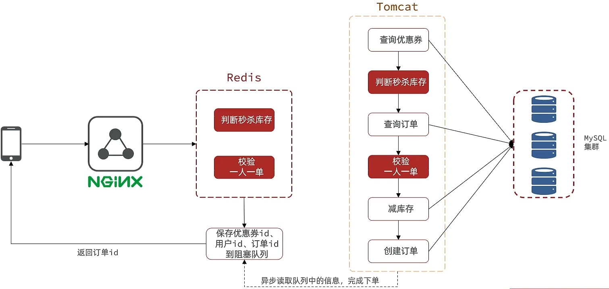


我们现在来看看整体思路：当用户下单之后，判断库存是否充足只需要导redis中去根据key找对应的value是否大于0即可，如果不充足，则直接结束，如果充足，继续在redis中判断用户是否可以下单，如果set集合中没有这条数据，说明他可以下单，如果set集合中没有这条记录，则将userId和优惠卷存入到redis中，并且返回0，整个过程需要保证是原子性的，我们可以使用lua来操作

当以上判断逻辑走完之后，我们可以判断当前redis中返回的结果是否是0 ，如果是0，则表示可以下单，则将之前说的信息存入到到queue中去，然后返回，然后再来个线程异步的下单，前端可以通过返回的订单id来判断是否下单成功。


### 6.2 秒杀优化-Redis完成秒杀资格判断

需求：

* 新增秒杀优惠券的同时，将优惠券信息保存到Redis中

* 基于Lua脚本，判断秒杀库存、一人一单，决定用户是否抢购成功

* 如果抢购成功，将优惠券id和用户id封装后存入阻塞队列

* 开启线程任务，不断从阻塞队列中获取信息，实现异步下单功能

  

VoucherServiceImpl

```java
@Override
@Transactional
public void addSeckillVoucher(Voucher voucher) {
    // 保存优惠券
    save(voucher);
    // 保存秒杀信息
    SeckillVoucher seckillVoucher = new SeckillVoucher();
    seckillVoucher.setVoucherId(voucher.getId());
    seckillVoucher.setStock(voucher.getStock());
    seckillVoucher.setBeginTime(voucher.getBeginTime());
    seckillVoucher.setEndTime(voucher.getEndTime());
    seckillVoucherService.save(seckillVoucher);
    // 保存秒杀库存到Redis中
    //SECKILL_STOCK_KEY 这个变量定义在RedisConstans中
    //private static final String SECKILL_STOCK_KEY ="seckill:stock:"
    stringRedisTemplate.opsForValue().set(SECKILL_STOCK_KEY + voucher.getId(), voucher.getStock().toString());
}
```

完整lua表达式

```lua
-- 1.参数列表
-- 1.1.优惠券id
local voucherId = ARGV[1]
-- 1.2.用户id
local userId = ARGV[2]
-- 1.3.订单id
local orderId = ARGV[3]

-- 2.数据key
-- 2.1.库存key
local stockKey = 'seckill:stock:' .. voucherId
-- 2.2.订单key
local orderKey = 'seckill:order:' .. voucherId

-- 3.脚本业务
-- 3.1.判断库存是否充足 get stockKey
if(tonumber(redis.call('get', stockKey)) <= 0) then
    -- 3.2.库存不足，返回1
    return 1
end
-- 3.2.判断用户是否下单 SISMEMBER orderKey userId
if(redis.call('sismember', orderKey, userId) == 1) then
    -- 3.3.存在，说明是重复下单，返回2
    return 2
end
-- 3.4.扣库存 incrby stockKey -1
redis.call('incrby', stockKey, -1)
-- 3.5.下单（保存用户）sadd orderKey userId
redis.call('sadd', orderKey, userId)
-- 3.6.发送消息到队列中， XADD stream.orders * k1 v1 k2 v2 ...
redis.call('xadd', 'stream.orders', '*', 'userId', userId, 'voucherId', voucherId, 'id', orderId)
return 0
```

当以上lua表达式执行完毕后，剩下的就是根据步骤3,4来执行我们接下来的任务了

VoucherOrderServiceImpl

```java
@Override
public Result seckillVoucher(Long voucherId) {
    //获取用户
    Long userId = UserHolder.getUser().getId();
    long orderId = redisIdWorker.nextId("order");
    // 1.执行lua脚本
    Long result = stringRedisTemplate.execute(
            SECKILL_SCRIPT,
            Collections.emptyList(),
            voucherId.toString(), userId.toString(), String.valueOf(orderId)
    );
    int r = result.intValue();
    // 2.判断结果是否为0
    if (r != 0) {
        // 2.1.不为0 ，代表没有购买资格
        return Result.fail(r == 1 ? "库存不足" : "不能重复下单");
    }
    //TODO 保存阻塞队列
    // 3.返回订单id
    return Result.ok(orderId);
}
```

### 6.3 秒杀优化-基于阻塞队列实现秒杀优化

VoucherOrderServiceImpl

修改下单动作，现在我们去下单时，是通过lua表达式去原子执行判断逻辑，如果判断我出来不为0 ，则要么是库存不足，要么是重复下单，返回错误信息，如果是0，则把下单的逻辑保存到队列中去，然后异步执行

```java
//异步处理线程池
private static final ExecutorService SECKILL_ORDER_EXECUTOR = Executors.newSingleThreadExecutor();

//在类初始化之后执行，因为当这个类初始化好了之后，随时都是有可能要执行的
@PostConstruct
private void init() {
   SECKILL_ORDER_EXECUTOR.submit(new VoucherOrderHandler());
}
// 用于线程池处理的任务
// 当初始化完毕后，就会去从对列中去拿信息
 private class VoucherOrderHandler implements Runnable{

        @Override
        public void run() {
            while (true){
                try {
                    // 1.获取队列中的订单信息
                    VoucherOrder voucherOrder = orderTasks.take();
                    // 2.创建订单
                    handleVoucherOrder(voucherOrder);
                } catch (Exception e) {
                    log.error("处理订单异常", e);
                }
             }
        }
     
       private void handleVoucherOrder(VoucherOrder voucherOrder) {
            //1.获取用户
            Long userId = voucherOrder.getUserId();
            // 2.创建锁对象
            RLock redisLock = redissonClient.getLock("lock:order:" + userId);
            // 3.尝试获取锁
            boolean isLock = redisLock.lock();
            // 4.判断是否获得锁成功
            if (!isLock) {
                // 获取锁失败，直接返回失败或者重试
                log.error("不允许重复下单！");
                return;
            }
            try {
                //注意：由于是spring的事务是放在threadLocal中，此时的是多线程，事务会失效
                proxy.createVoucherOrder(voucherOrder);
            } finally {
                // 释放锁
                redisLock.unlock();
            }
    }
     //a
    private BlockingQueue<VoucherOrder> orderTasks =new  ArrayBlockingQueue<>(1024 * 1024);

    @Override
    public Result seckillVoucher(Long voucherId) {
        Long userId = UserHolder.getUser().getId();
        long orderId = redisIdWorker.nextId("order");
        // 1.执行lua脚本
        Long result = stringRedisTemplate.execute(
                SECKILL_SCRIPT,
                Collections.emptyList(),
                voucherId.toString(), userId.toString(), String.valueOf(orderId)
        );
        int r = result.intValue();
        // 2.判断结果是否为0
        if (r != 0) {
            // 2.1.不为0 ，代表没有购买资格
            return Result.fail(r == 1 ? "库存不足" : "不能重复下单");
        }
        VoucherOrder voucherOrder = new VoucherOrder();
        // 2.3.订单id
        long orderId = redisIdWorker.nextId("order");
        voucherOrder.setId(orderId);
        // 2.4.用户id
        voucherOrder.setUserId(userId);
        // 2.5.代金券id
        voucherOrder.setVoucherId(voucherId);
        // 2.6.放入阻塞队列
        orderTasks.add(voucherOrder);
        //3.获取代理对象
         proxy = (IVoucherOrderService)AopContext.currentProxy();
        //4.返回订单id
        return Result.ok(orderId);
    }
     
    @Transactional
    public  void createVoucherOrder(VoucherOrder voucherOrder) {
        Long userId = voucherOrder.getUserId();
        // 5.1.查询订单
        int count = query().eq("user_id", userId).eq("voucher_id", voucherOrder.getVoucherId()).count();
        // 5.2.判断是否存在
        if (count > 0) {
            // 用户已经购买过了
           log.error("用户已经购买过了");
           return ;
        }

        // 6.扣减库存
        boolean success = seckillVoucherService.update()
                .setSql("stock = stock - 1") // set stock = stock - 1
                .eq("voucher_id", voucherOrder.getVoucherId()).gt("stock", 0) // where id = ? and stock > 0
                .update();
        if (!success) {
            // 扣减失败
            log.error("库存不足");
            return ;
        }
        save(voucherOrder);
    }

```

**小总结：**

秒杀业务的优化思路是什么？

* 先利用Redis完成库存余量、一人一单判断，完成抢单业务
* 再将下单业务放入阻塞队列，利用独立线程异步下单
* 基于阻塞队列的异步秒杀存在哪些问题？
  * 内存限制问题
  * 数据安全问题


## 7、Redis消息队列

### 7.1 Redis消息队列-认识消息队列

什么是消息队列：字面意思就是存放消息的队列。最简单的消息队列模型包括3个角色：

* 消息队列：存储和管理消息，也被称为消息代理（Message Broker）
* 生产者：发送消息到消息队列
* 消费者：从消息队列获取消息并处理消息


使用队列的好处在于 **解耦：**所谓解耦，举一个生活中的例子就是：快递员(生产者)把快递放到快递柜里边(Message Queue)去，我们(消费者)从快递柜里边去拿东西，这就是一个异步，如果耦合，那么这个快递员相当于直接把快递交给你，这事固然好，但是万一你不在家，那么快递员就会一直等你，这就浪费了快递员的时间，所以这种思想在我们日常开发中，是非常有必要的。

这种场景在我们秒杀中就变成了：我们下单之后，利用redis去进行校验下单条件，再通过队列把消息发送出去，然后再启动一个线程去消费这个消息，完成解耦，同时也加快我们的响应速度。

这里我们可以使用一些现成的mq，比如kafka，rabbitmq等等，但是呢，如果没有安装mq，我们也可以直接使用redis提供的mq方案，降低我们的部署和学习成本。


### 7.2 Redis消息队列-基于List实现消息队列

**基于List结构模拟消息队列**

消息队列（Message Queue），字面意思就是存放消息的队列。而Redis的list数据结构是一个双向链表，很容易模拟出队列效果。

队列是入口和出口不在一边，因此我们可以利用：LPUSH 结合 RPOP、或者 RPUSH 结合 LPOP来实现。
不过要注意的是，当队列中没有消息时RPOP或LPOP操作会返回null，并不像JVM的阻塞队列那样会阻塞并等待消息。因此这里应该使用BRPOP或者BLPOP来实现阻塞效果。


基于List的消息队列有哪些优缺点？
优点：

* 利用Redis存储，不受限于JVM内存上限
* 基于Redis的持久化机制，数据安全性有保证
* 可以满足消息有序性

缺点：

* 无法避免消息丢失
* 只支持单消费者


### 7.3 Redis消息队列-基于PubSub的消息队列

PubSub（发布订阅）是Redis2.0版本引入的消息传递模型。顾名思义，消费者可以订阅一个或多个channel，生产者向对应channel发送消息后，所有订阅者都能收到相关消息。

 SUBSCRIBE channel [channel] ：订阅一个或多个频道
 PUBLISH channel msg ：向一个频道发送消息
 PSUBSCRIBE pattern[pattern] ：订阅与pattern格式匹配的所有频道


基于PubSub的消息队列有哪些优缺点？
优点：

* 采用发布订阅模型，支持多生产、多消费

缺点：

* 不支持数据持久化
* 无法避免消息丢失
* 消息堆积有上限，超出时数据丢失


### 7.4 Redis消息队列-基于Stream的消息队列

Stream 是 Redis 5.0 引入的一种新数据类型，可以实现一个功能非常完善的消息队列。

发送消息的命令：XADD


例如：


读取消息的方式之一：XREAD


例如，使用XREAD读取第一个消息：


XREAD阻塞方式，读取最新的消息：


> BLOCK 0 表示永久阻塞。

在业务开发中，我们可以循环的调用XREAD阻塞方式来查询最新消息，从而实现持续监听队列的效果，**伪代码**如下


注意：当我们指定起始ID为$时，代表读取最新的消息，如果我们处理一条消息的过程中，又有超过1条以上的消息到达队列，则下次获取时也只能获取到最新的一条，会出现**漏读消息**的问题

STREAM类型消息队列的XREAD命令特点：

* 消息可回溯
* 一个消息可以被多个消费者读取
* 可以阻塞读取
* 有消息漏读的风险


### 7.5 Redis消息队列-基于Stream的消息队列-消费者组

消费者组（Consumer Group）：将多个消费者划分到一个组中，监听同一个队列。具备下列特点：


创建消费者组：

key：队列名称
groupName：消费者组名称
ID：起始ID标示，$代表队列中最后一个消息，0则代表队列中第一个消息
MKSTREAM：队列不存在时自动创建队列
其它常见命令：

 **删除指定的消费者组**

```java
XGROUP DESTORY key groupName
```

 **给指定的消费者组添加消费者**

```java
XGROUP CREATECONSUMER key groupname consumername
```

 **删除消费者组中的指定消费者**

```java
XGROUP DELCONSUMER key groupname consumername
```

从消费者组读取消息：

```java
XREADGROUP GROUP group consumer [COUNT count] [BLOCK milliseconds] [NOACK] STREAMS key [key ...] ID [ID ...]
```

* group：消费组名称
* consumer：消费者名称，如果消费者不存在，会自动创建一个消费者
* count：本次查询的最大数量
* BLOCK milliseconds：当没有消息时最长等待时间
* NOACK：无需手动ACK，获取到消息后自动确认
* STREAMS key：指定队列名称
* ID：获取消息的起始ID：

">"：从下一个未消费的消息开始
其它：根据指定id从pending-list中获取已消费但未确认的消息，例如0，是从pending-list中的第一个消息开始

消费者监听消息的基本思路：

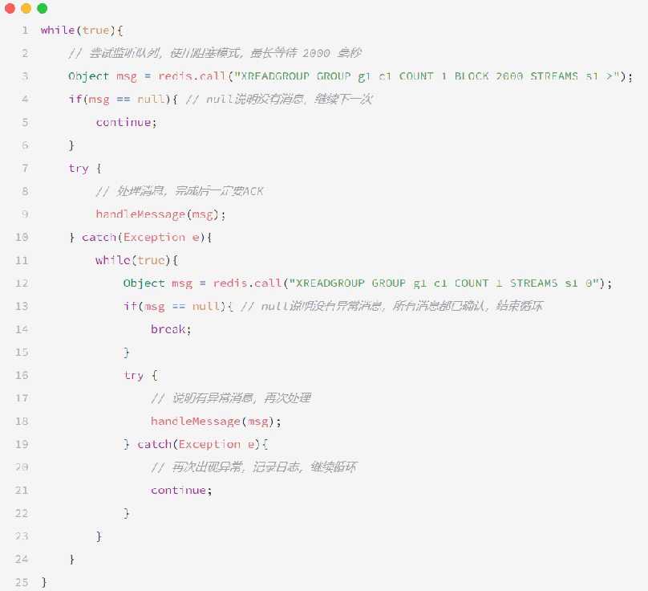STREAM类型消息队列的XREADGROUP命令特点：

* 消息可回溯
* 可以多消费者争抢消息，加快消费速度
* 可以阻塞读取
* 没有消息漏读的风险
* 有消息确认机制，保证消息至少被消费一次

最后我们来个小对比


### 7.6 基于Redis的Stream结构作为消息队列，实现异步秒杀下单

需求：

* 创建一个Stream类型的消息队列，名为stream.orders
* 修改之前的秒杀下单Lua脚本，在认定有抢购资格后，直接向stream.orders中添加消息，内容包含voucherId、userId、orderId
* 项目启动时，开启一个线程任务，尝试获取stream.orders中的消息，完成下单\

修改lua表达式,新增3.6 


VoucherOrderServiceImpl

```java
private class VoucherOrderHandler implements Runnable {

    @Override
    public void run() {
        while (true) {
            try {
                // 1.获取消息队列中的订单信息 XREADGROUP GROUP g1 c1 COUNT 1 BLOCK 2000 STREAMS s1 >
                List<MapRecord<String, Object, Object>> list = stringRedisTemplate.opsForStream().read(
                    Consumer.from("g1", "c1"),
                    StreamReadOptions.empty().count(1).block(Duration.ofSeconds(2)),
                    StreamOffset.create("stream.orders", ReadOffset.lastConsumed())
                );
                // 2.判断订单信息是否为空
                if (list == null || list.isEmpty()) {
                    // 如果为null，说明没有消息，继续下一次循环
                    continue;
                }
                // 解析数据
                MapRecord<String, Object, Object> record = list.get(0);
                Map<Object, Object> value = record.getValue();
                VoucherOrder voucherOrder = BeanUtil.fillBeanWithMap(value, new VoucherOrder(), true);
                // 3.创建订单
                createVoucherOrder(voucherOrder);
                // 4.确认消息 XACK
                stringRedisTemplate.opsForStream().acknowledge("s1", "g1", record.getId());
            } catch (Exception e) {
                log.error("处理订单异常", e);
                //处理异常消息
                handlePendingList();
            }
        }
    }

    private void handlePendingList() {
        while (true) {
            try {
                // 1.获取pending-list中的订单信息 XREADGROUP GROUP g1 c1 COUNT 1 BLOCK 2000 STREAMS s1 0
                List<MapRecord<String, Object, Object>> list = stringRedisTemplate.opsForStream().read(
                    Consumer.from("g1", "c1"),
                    StreamReadOptions.empty().count(1),
                    StreamOffset.create("stream.orders", ReadOffset.from("0"))
                );
                // 2.判断订单信息是否为空
                if (list == null || list.isEmpty()) {
                    // 如果为null，说明没有异常消息，结束循环
                    break;
                }
                // 解析数据
                MapRecord<String, Object, Object> record = list.get(0);
                Map<Object, Object> value = record.getValue();
                VoucherOrder voucherOrder = BeanUtil.fillBeanWithMap(value, new VoucherOrder(), true);
                // 3.创建订单
                createVoucherOrder(voucherOrder);
                // 4.确认消息 XACK
                stringRedisTemplate.opsForStream().acknowledge("s1", "g1", record.getId());
            } catch (Exception e) {
                log.error("处理pendding订单异常", e);
                try{
                    Thread.sleep(20);
                }catch(Exception e){
                    e.printStackTrace();
                }
            }
        }
    }
}

```

## 8、达人探店

### 8.1、达人探店-发布探店笔记

发布探店笔记

探店笔记类似点评网站的评价，往往是图文结合。对应的表有两个：
tb_blog：探店笔记表，包含笔记中的标题、文字、图片等
tb_blog_comments：其他用户对探店笔记的评价

**具体发布流程**

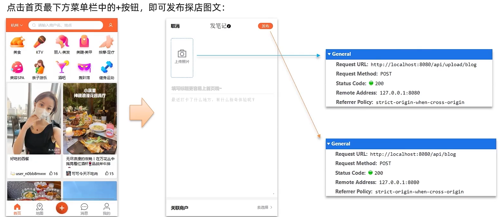

上传接口

```java
@Slf4j
@RestController
@RequestMapping("upload")
public class UploadController {

    @PostMapping("blog")
    public Result uploadImage(@RequestParam("file") MultipartFile image) {
        try {
            // 获取原始文件名称
            String originalFilename = image.getOriginalFilename();
            // 生成新文件名
            String fileName = createNewFileName(originalFilename);
            // 保存文件
            image.transferTo(new File(SystemConstants.IMAGE_UPLOAD_DIR, fileName));
            // 返回结果
            log.debug("文件上传成功，{}", fileName);
            return Result.ok(fileName);
        } catch (IOException e) {
            throw new RuntimeException("文件上传失败", e);
        }
    }

}
```

注意：同学们在操作时，需要修改SystemConstants.IMAGE_UPLOAD_DIR 自己图片所在的地址，在实际开发中图片一般会放在nginx上或者是云存储上。

BlogController

```java
@RestController
@RequestMapping("/blog")
public class BlogController {

    @Resource
    private IBlogService blogService;

    @PostMapping
    public Result saveBlog(@RequestBody Blog blog) {
        //获取登录用户
        UserDTO user = UserHolder.getUser();
        blog.setUpdateTime(user.getId());
        //保存探店博文
        blogService.saveBlog(blog);
        //返回id
        return Result.ok(blog.getId());
    }
}
```

### 8.2 达人探店-查看探店笔记

实现查看发布探店笔记的接口


实现代码：

BlogServiceImpl

```java
@Override
public Result queryBlogById(Long id) {
    // 1.查询blog
    Blog blog = getById(id);
    if (blog == null) {
        return Result.fail("笔记不存在！");
    }
    // 2.查询blog有关的用户
    queryBlogUser(blog);
  
    return Result.ok(blog);
}
```

### 8.3 达人探店-点赞功能

初始代码

```java
@GetMapping("/likes/{id}")
public Result queryBlogLikes(@PathVariable("id") Long id) {
    //修改点赞数量
    blogService.update().setSql("liked = liked +1 ").eq("id",id).update();
    return Result.ok();
}
```

问题分析：这种方式会导致一个用户无限点赞，明显是不合理的

造成这个问题的原因是，我们现在的逻辑，发起请求只是给数据库+1，所以才会出现这个问题

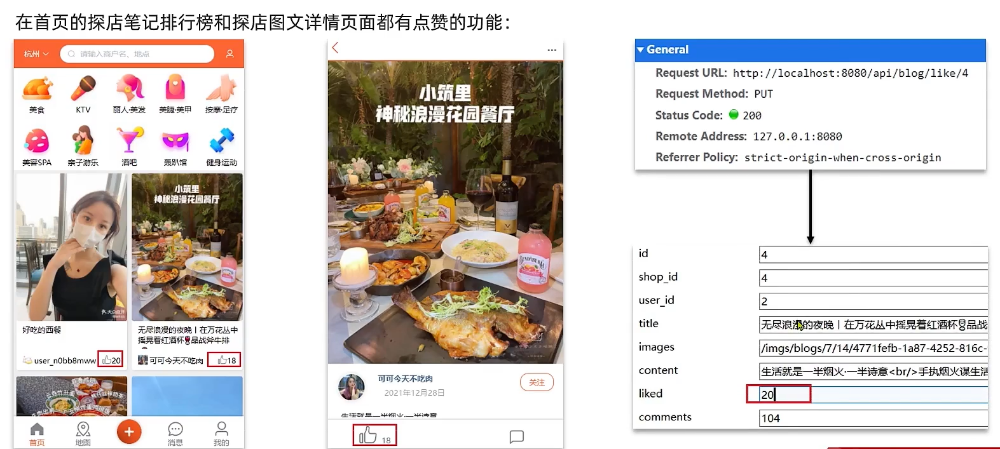

完善点赞功能

需求：

* 同一个用户只能点赞一次，再次点击则取消点赞
* 如果当前用户已经点赞，则点赞按钮高亮显示（前端已实现，判断字段Blog类的isLike属性）

实现步骤：

* 给Blog类中添加一个isLike字段，标示是否被当前用户点赞
* 修改点赞功能，利用Redis的set集合判断是否点赞过，未点赞过则点赞数+1，已点赞过则点赞数-1
* 修改根据id查询Blog的业务，判断当前登录用户是否点赞过，赋值给isLike字段
* 修改分页查询Blog业务，判断当前登录用户是否点赞过，赋值给isLike字段

为什么采用set集合：

因为我们的数据是不能重复的，当用户操作过之后，无论他怎么操作，都是

具体步骤：

1、在Blog 添加一个字段

```java
@TableField(exist = false)
private Boolean isLike;
```

2、修改代码

```java
 @Override
    public Result likeBlog(Long id){
        // 1.获取登录用户
        Long userId = UserHolder.getUser().getId();
        // 2.判断当前登录用户是否已经点赞
        String key = BLOG_LIKED_KEY + id;
        Boolean isMember = stringRedisTemplate.opsForSet().isMember(key, userId.toString());
        if(BooleanUtil.isFalse(isMember)){
             //3.如果未点赞，可以点赞
            //3.1 数据库点赞数+1
            boolean isSuccess = update().setSql("liked = liked + 1").eq("id", id).update();
            //3.2 保存用户到Redis的set集合
            if(isSuccess){
                stringRedisTemplate.opsForSet().add(key,userId.toString());
            }
        }else{
             //4.如果已点赞，取消点赞
            //4.1 数据库点赞数-1
            boolean isSuccess = update().setSql("liked = liked - 1").eq("id", id).update();
            //4.2 把用户从Redis的set集合移除
            if(isSuccess){
                stringRedisTemplate.opsForSet().remove(key,userId.toString());
            }
        }
```

### 8.4 达人探店-点赞排行榜

在探店笔记的详情页面，应该把给该笔记点赞的人显示出来，比如最早点赞的TOP5，形成点赞排行榜：

之前的点赞是放到set集合，但是set集合是不能排序的，所以这个时候，咱们可以采用一个可以排序的set集合，就是咱们的sortedSet


我们接下来来对比一下这些集合的区别是什么

所有点赞的人，需要是唯一的，所以我们应当使用set或者是sortedSet

其次我们需要排序，就可以直接锁定使用sortedSet啦


修改代码

BlogServiceImpl

点赞逻辑代码

```java
   @Override
    public Result likeBlog(Long id) {
        // 1.获取登录用户
        Long userId = UserHolder.getUser().getId();
        // 2.判断当前登录用户是否已经点赞
        String key = BLOG_LIKED_KEY + id;
        Double score = stringRedisTemplate.opsForZSet().score(key, userId.toString());
        if (score == null) {
            // 3.如果未点赞，可以点赞
            // 3.1.数据库点赞数 + 1
            boolean isSuccess = update().setSql("liked = liked + 1").eq("id", id).update();
            // 3.2.保存用户到Redis的set集合  zadd key value score
            if (isSuccess) {
                stringRedisTemplate.opsForZSet().add(key, userId.toString(), System.currentTimeMillis());
            }
        } else {
            // 4.如果已点赞，取消点赞
            // 4.1.数据库点赞数 -1
            boolean isSuccess = update().setSql("liked = liked - 1").eq("id", id).update();
            // 4.2.把用户从Redis的set集合移除
            if (isSuccess) {
                stringRedisTemplate.opsForZSet().remove(key, userId.toString());
            }
        }
        return Result.ok();
    }


    private void isBlogLiked(Blog blog) {
        // 1.获取登录用户
        UserDTO user = UserHolder.getUser();
        if (user == null) {
            // 用户未登录，无需查询是否点赞
            return;
        }
        Long userId = user.getId();
        // 2.判断当前登录用户是否已经点赞
        String key = "blog:liked:" + blog.getId();
        Double score = stringRedisTemplate.opsForZSet().score(key, userId.toString());
        blog.setIsLike(score != null);
    }
```

点赞列表查询列表

BlogController

```java
@GetMapping("/likes/{id}")
public Result queryBlogLikes(@PathVariable("id") Long id) {

    return blogService.queryBlogLikes(id);
}
```

BlogService

```java
@Override
public Result queryBlogLikes(Long id) {
    String key = BLOG_LIKED_KEY + id;
    // 1.查询top5的点赞用户 zrange key 0 4
    Set<String> top5 = stringRedisTemplate.opsForZSet().range(key, 0, 4);
    if (top5 == null || top5.isEmpty()) {
        return Result.ok(Collections.emptyList());
    }
    // 2.解析出其中的用户id
    List<Long> ids = top5.stream().map(Long::valueOf).collect(Collectors.toList());
    String idStr = StrUtil.join(",", ids);
    // 3.根据用户id查询用户 WHERE id IN ( 5 , 1 ) ORDER BY FIELD(id, 5, 1)
    List<UserDTO> userDTOS = userService.query()
            .in("id", ids).last("ORDER BY FIELD(id," + idStr + ")").list()
            .stream()
            .map(user -> BeanUtil.copyProperties(user, UserDTO.class))
            .collect(Collectors.toList());
    // 4.返回
    return Result.ok(userDTOS);
}
```

## 9、好友关注

### 9.1 好友关注-关注和取消关注

针对用户的操作：可以对用户进行关注和取消关注功能。


实现思路：

需求：基于该表数据结构，实现两个接口：

* 关注和取关接口
* 判断是否关注的接口

关注是User之间的关系，是博主与粉丝的关系，数据库中有一张tb_follow表来标示：


注意: 这里需要把主键修改为自增长，简化开发。

FollowController

```java
//关注
@PutMapping("/{id}/{isFollow}")
public Result follow(@PathVariable("id") Long followUserId, @PathVariable("isFollow") Boolean isFollow) {
    return followService.follow(followUserId, isFollow);
}
//取消关注
@GetMapping("/or/not/{id}")
public Result isFollow(@PathVariable("id") Long followUserId) {
      return followService.isFollow(followUserId);
}
```

FollowService

```java
取消关注service
@Override
public Result isFollow(Long followUserId) {
        // 1.获取登录用户
        Long userId = UserHolder.getUser().getId();
        // 2.查询是否关注 select count(*) from tb_follow where user_id = ? and follow_user_id = ?
        Integer count = query().eq("user_id", userId).eq("follow_user_id", followUserId).count();
        // 3.判断
        return Result.ok(count > 0);
    }

 关注service
 @Override
    public Result follow(Long followUserId, Boolean isFollow) {
        // 1.获取登录用户
        Long userId = UserHolder.getUser().getId();
        String key = "follows:" + userId;
        // 1.判断到底是关注还是取关
        if (isFollow) {
            // 2.关注，新增数据
            Follow follow = new Follow();
            follow.setUserId(userId);
            follow.setFollowUserId(followUserId);
            boolean isSuccess = save(follow);

        } else {
            // 3.取关，删除 delete from tb_follow where user_id = ? and follow_user_id = ?
            remove(new QueryWrapper<Follow>()
                    .eq("user_id", userId).eq("follow_user_id", followUserId));

        }
        return Result.ok();
    }
```

### 9.2 好友关注-共同关注

想要去看共同关注的好友，需要首先进入到这个页面，这个页面会发起两个请求

1、去查询用户的详情

2、去查询用户的笔记

以上两个功能和共同关注没有什么关系，大家可以自行将笔记中的代码拷贝到idea中就可以实现这两个功能了，我们的重点在于共同关注功能。


```java
// UserController 根据id查询用户
@GetMapping("/{id}")
public Result queryUserById(@PathVariable("id") Long userId){
    // 查询详情
    User user = userService.getById(userId);
    if (user == null) {
        return Result.ok();
    }
    UserDTO userDTO = BeanUtil.copyProperties(user, UserDTO.class);
    // 返回
    return Result.ok(userDTO);
}

// BlogController  根据id查询博主的探店笔记
@GetMapping("/of/user")
public Result queryBlogByUserId(
        @RequestParam(value = "current", defaultValue = "1") Integer current,
        @RequestParam("id") Long id) {
    // 根据用户查询
    Page<Blog> page = blogService.query()
            .eq("user_id", id).page(new Page<>(current, SystemConstants.MAX_PAGE_SIZE));
    // 获取当前页数据
    List<Blog> records = page.getRecords();
    return Result.ok(records);
}
```

接下来我们来看看共同关注如何实现：

需求：利用Redis中恰当的数据结构，实现共同关注功能。在博主个人页面展示出当前用户与博主的共同关注呢。

当然是使用我们之前学习过的set集合咯，在set集合中，有交集并集补集的api，我们可以把两人的关注的人分别放入到一个set集合中，然后再通过api去查看这两个set集合中的交集数据。


我们先来改造当前的关注列表

改造原因是因为我们需要在用户关注了某位用户后，需要将数据放入到set集合中，方便后续进行共同关注，同时当取消关注时，也需要从set集合中进行删除

FollowServiceImpl

```java
@Override
public Result follow(Long followUserId, Boolean isFollow) {
    // 1.获取登录用户
    Long userId = UserHolder.getUser().getId();
    String key = "follows:" + userId;
    // 1.判断到底是关注还是取关
    if (isFollow) {
        // 2.关注，新增数据
        Follow follow = new Follow();
        follow.setUserId(userId);
        follow.setFollowUserId(followUserId);
        boolean isSuccess = save(follow);
        if (isSuccess) {
            // 把关注用户的id，放入redis的set集合 sadd userId followerUserId
            stringRedisTemplate.opsForSet().add(key, followUserId.toString());
        }
    } else {
        // 3.取关，删除 delete from tb_follow where user_id = ? and follow_user_id = ?
        boolean isSuccess = remove(new QueryWrapper<Follow>()
                .eq("user_id", userId).eq("follow_user_id", followUserId));
        if (isSuccess) {
            // 把关注用户的id从Redis集合中移除
            stringRedisTemplate.opsForSet().remove(key, followUserId.toString());
        }
    }
    return Result.ok();
}
```

**具体的关注代码：**

FollowServiceImpl

```java
@Override
public Result followCommons(Long id) {
    // 1.获取当前用户
    Long userId = UserHolder.getUser().getId();
    String key = "follows:" + userId;
    // 2.求交集
    String key2 = "follows:" + id;
    Set<String> intersect = stringRedisTemplate.opsForSet().intersect(key, key2);
    if (intersect == null || intersect.isEmpty()) {
        // 无交集
        return Result.ok(Collections.emptyList());
    }
    // 3.解析id集合
    List<Long> ids = intersect.stream().map(Long::valueOf).collect(Collectors.toList());
    // 4.查询用户
    List<UserDTO> users = userService.listByIds(ids)
            .stream()
            .map(user -> BeanUtil.copyProperties(user, UserDTO.class))
            .collect(Collectors.toList());
    return Result.ok(users);
}
```

### 9.3 好友关注-Feed流实现方案

当我们关注了用户后，这个用户发了动态，那么我们应该把这些数据推送给用户，这个需求，其实我们又把他叫做Feed流，关注推送也叫做Feed流，直译为投喂。为用户持续的提供“沉浸式”的体验，通过无限下拉刷新获取新的信息。

对于传统的模式的内容解锁：我们是需要用户去通过搜索引擎或者是其他的方式去解锁想要看的内容


对于新型的Feed流的的效果：不需要我们用户再去推送信息，而是系统分析用户到底想要什么，然后直接把内容推送给用户，从而使用户能够更加的节约时间，不用主动去寻找。


Feed流的实现有两种模式：

Feed流产品有两种常见模式：
Timeline：不做内容筛选，简单的按照内容发布时间排序，常用于好友或关注。例如朋友圈

* 优点：信息全面，不会有缺失。并且实现也相对简单
* 缺点：信息噪音较多，用户不一定感兴趣，内容获取效率低

智能排序：利用智能算法屏蔽掉违规的、用户不感兴趣的内容。推送用户感兴趣信息来吸引用户

* 优点：投喂用户感兴趣信息，用户粘度很高，容易沉迷
* 缺点：如果算法不精准，可能起到反作用
  本例中的个人页面，是基于关注的好友来做Feed流，因此采用Timeline的模式。该模式的实现方案有三种：

我们本次针对好友的操作，采用的就是Timeline的方式，只需要拿到我们关注用户的信息，然后按照时间排序即可

，因此采用Timeline的模式。该模式的实现方案有三种：

* 拉模式
* 推模式
* 推拉结合

**拉模式**：也叫做读扩散

该模式的核心含义就是：当张三和李四和王五发了消息后，都会保存在自己的邮箱中，假设赵六要读取信息，那么他会从读取他自己的收件箱，此时系统会从他关注的人群中，把他关注人的信息全部都进行拉取，然后在进行排序

优点：比较节约空间，因为赵六在读信息时，并没有重复读取，而且读取完之后可以把他的收件箱进行清楚。

缺点：比较延迟，当用户读取数据时才去关注的人里边去读取数据，假设用户关注了大量的用户，那么此时就会拉取海量的内容，对服务器压力巨大。

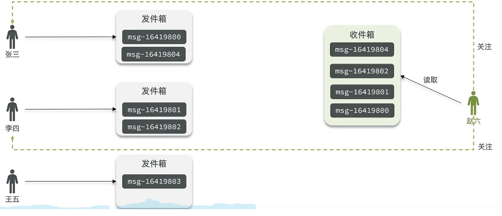


**推模式**：也叫做写扩散。

推模式是没有写邮箱的，当张三写了一个内容，此时会主动的把张三写的内容发送到他的粉丝收件箱中去，假设此时李四再来读取，就不用再去临时拉取了

优点：时效快，不用临时拉取

缺点：内存压力大，假设一个大V写信息，很多人关注他， 就会写很多分数据到粉丝那边去


**推拉结合模式**：也叫做读写混合，兼具推和拉两种模式的优点。

推拉模式是一个折中的方案，站在发件人这一段，如果是个普通的人，那么我们采用写扩散的方式，直接把数据写入到他的粉丝中去，因为普通的人他的粉丝关注量比较小，所以这样做没有压力，如果是大V，那么他是直接将数据先写入到一份到发件箱里边去，然后再直接写一份到活跃粉丝收件箱里边去，现在站在收件人这端来看，如果是活跃粉丝，那么大V和普通的人发的都会直接写入到自己收件箱里边来，而如果是普通的粉丝，由于他们上线不是很频繁，所以等他们上线时，再从发件箱里边去拉信息。


### 9.4 好友关注-推送到粉丝收件箱

需求：

* 修改新增探店笔记的业务，在保存blog到数据库的同时，推送到粉丝的收件箱
* 收件箱满足可以根据时间戳排序，必须用Redis的数据结构实现
* 查询收件箱数据时，可以实现分页查询

Feed流中的数据会不断更新，所以数据的角标也在变化，因此不能采用传统的分页模式。

传统了分页在feed流是不适用的，因为我们的数据会随时发生变化

假设在t1 时刻，我们去读取第一页，此时page = 1 ，size = 5 ，那么我们拿到的就是10~6 这几条记录，假设现在t2时候又发布了一条记录，此时t3 时刻，我们来读取第二页，读取第二页传入的参数是page=2 ，size=5 ，那么此时读取到的第二页实际上是从6 开始，然后是6~2 ，那么我们就读取到了重复的数据，所以feed流的分页，不能采用原始方案来做。


Feed流的滚动分页

我们需要记录每次操作的最后一条，然后从这个位置开始去读取数据

举个例子：我们从t1时刻开始，拿第一页数据，拿到了10~6，然后记录下当前最后一次拿取的记录，就是6，t2时刻发布了新的记录，此时这个11放到最顶上，但是不会影响我们之前记录的6，此时t3时刻来拿第二页，第二页这个时候拿数据，还是从6后一点的5去拿，就拿到了5-1的记录。我们这个地方可以采用sortedSet来做，可以进行范围查询，并且还可以记录当前获取数据时间戳最小值，就可以实现滚动分页了


核心的意思：就是我们在保存完探店笔记后，获得到当前笔记的粉丝，然后把数据推送到粉丝的redis中去。

```java
@Override
public Result saveBlog(Blog blog) {
    // 1.获取登录用户
    UserDTO user = UserHolder.getUser();
    blog.setUserId(user.getId());
    // 2.保存探店笔记
    boolean isSuccess = save(blog);
    if(!isSuccess){
        return Result.fail("新增笔记失败!");
    }
    // 3.查询笔记作者的所有粉丝 select * from tb_follow where follow_user_id = ?
    List<Follow> follows = followService.query().eq("follow_user_id", user.getId()).list();
    // 4.推送笔记id给所有粉丝
    for (Follow follow : follows) {
        // 4.1.获取粉丝id
        Long userId = follow.getUserId();
        // 4.2.推送
        String key = FEED_KEY + userId;
        stringRedisTemplate.opsForZSet().add(key, blog.getId().toString(), System.currentTimeMillis());
    }
    // 5.返回id
    return Result.ok(blog.getId());
}
```

### 9.5好友关注-实现分页查询收邮箱

需求：在个人主页的“关注”卡片中，查询并展示推送的Blog信息：

具体操作如下：

1、每次查询完成后，我们要分析出查询出数据的最小时间戳，这个值会作为下一次查询的条件

2、我们需要找到与上一次查询相同的查询个数作为偏移量，下次查询时，跳过这些查询过的数据，拿到我们需要的数据

综上：我们的请求参数中就需要携带 lastId：上一次查询的最小时间戳 和偏移量这两个参数。

这两个参数第一次会由前端来指定，以后的查询就根据后台结果作为条件，再次传递到后台。


一、定义出来具体的返回值实体类

```java
@Data
public class ScrollResult {
    private List<?> list;
    private Long minTime;
    private Integer offset;
}
```

BlogController

注意：RequestParam 表示接受url地址栏传参的注解，当方法上参数的名称和url地址栏不相同时，可以通过RequestParam 来进行指定

```java
@GetMapping("/of/follow")
public Result queryBlogOfFollow(
    @RequestParam("lastId") Long max, @RequestParam(value = "offset", defaultValue = "0") Integer offset){
    return blogService.queryBlogOfFollow(max, offset);
}
```

BlogServiceImpl

```java
@Override
public Result queryBlogOfFollow(Long max, Integer offset) {
    // 1.获取当前用户
    Long userId = UserHolder.getUser().getId();
    // 2.查询收件箱 ZREVRANGEBYSCORE key Max Min LIMIT offset count
    String key = FEED_KEY + userId;
    Set<ZSetOperations.TypedTuple<String>> typedTuples = stringRedisTemplate.opsForZSet()
        .reverseRangeByScoreWithScores(key, 0, max, offset, 2);
    // 3.非空判断
    if (typedTuples == null || typedTuples.isEmpty()) {
        return Result.ok();
    }
    // 4.解析数据：blogId、minTime（时间戳）、offset
    List<Long> ids = new ArrayList<>(typedTuples.size());
    long minTime = 0; // 2
    int os = 1; // 2
    for (ZSetOperations.TypedTuple<String> tuple : typedTuples) { // 5 4 4 2 2
        // 4.1.获取id
        ids.add(Long.valueOf(tuple.getValue()));
        // 4.2.获取分数(时间戳）
        long time = tuple.getScore().longValue();
        if(time == minTime){
            os++;
        }else{
            minTime = time;
            os = 1;
        }
    }
    os = minTime == max ? os : os + offset;
    // 5.根据id查询blog
    String idStr = StrUtil.join(",", ids);
    List<Blog> blogs = query().in("id", ids).last("ORDER BY FIELD(id," + idStr + ")").list();

    for (Blog blog : blogs) {
        // 5.1.查询blog有关的用户
        queryBlogUser(blog);
        // 5.2.查询blog是否被点赞
        isBlogLiked(blog);
    }

    // 6.封装并返回
    ScrollResult r = new ScrollResult();
    r.setList(blogs);
    r.setOffset(os);
    r.setMinTime(minTime);

    return Result.ok(r);
}
```

## 10、附近商户

### 10.1、附近商户-GEO数据结构的基本用法

GEO就是Geolocation的简写形式，代表地理坐标。Redis在3.2版本中加入了对GEO的支持，允许存储地理坐标信息，帮助我们根据经纬度来检索数据。常见的命令有：

* GEOADD：添加一个地理空间信息，包含：经度（longitude）、纬度（latitude）、值（member）
* GEODIST：计算指定的两个点之间的距离并返回
* GEOHASH：将指定member的坐标转为hash字符串形式并返回
* GEOPOS：返回指定member的坐标
* GEORADIUS：指定圆心、半径，找到该圆内包含的所有member，并按照与圆心之间的距离排序后返回。6.以后已废弃
* GEOSEARCH：在指定范围内搜索member，并按照与指定点之间的距离排序后返回。范围可以是圆形或矩形。6.2.新功能
* GEOSEARCHSTORE：与GEOSEARCH功能一致，不过可以把结果存储到一个指定的key。 6.2.新功能

### 10.2、 附近商户-导入店铺数据到GEO

具体场景说明：


当我们点击美食之后，会出现一系列的商家，商家中可以按照多种排序方式，我们此时关注的是距离，这个地方就需要使用到我们的GEO，向后台传入当前app收集的地址(我们此处是写死的) ，以当前坐标作为圆心，同时绑定相同的店家类型type，以及分页信息，把这几个条件传入后台，后台查询出对应的数据再返回。

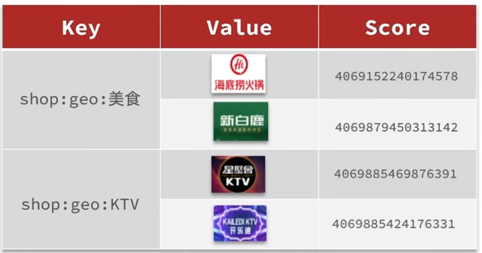

我们要做的事情是：将数据库表中的数据导入到redis中去，redis中的GEO，GEO在redis中就一个menber和一个经纬度，我们把x和y轴传入到redis做的经纬度位置去，但我们不能把所有的数据都放入到menber中去，毕竟作为redis是一个内存级数据库，如果存海量数据，redis还是力不从心，所以我们在这个地方存储他的id即可。

但是这个时候还有一个问题，就是在redis中并没有存储type，所以我们无法根据type来对数据进行筛选，所以我们可以按照商户类型做分组，类型相同的商户作为同一组，以typeId为key存入同一个GEO集合中即可

代码

HmDianPingApplicationTests

```java
@Test
void loadShopData() {
    // 1.查询店铺信息
    List<Shop> list = shopService.list();
    // 2.把店铺分组，按照typeId分组，typeId一致的放到一个集合
    Map<Long, List<Shop>> map = list.stream().collect(Collectors.groupingBy(Shop::getTypeId));
    // 3.分批完成写入Redis
    for (Map.Entry<Long, List<Shop>> entry : map.entrySet()) {
        // 3.1.获取类型id
        Long typeId = entry.getKey();
        String key = SHOP_GEO_KEY + typeId;
        // 3.2.获取同类型的店铺的集合
        List<Shop> value = entry.getValue();
        List<RedisGeoCommands.GeoLocation<String>> locations = new ArrayList<>(value.size());
        // 3.3.写入redis GEOADD key 经度 纬度 member
        for (Shop shop : value) {
            // stringRedisTemplate.opsForGeo().add(key, new Point(shop.getX(), shop.getY()), shop.getId().toString());
            locations.add(new RedisGeoCommands.GeoLocation<>(
                    shop.getId().toString(),
                    new Point(shop.getX(), shop.getY())
            ));
        }
        stringRedisTemplate.opsForGeo().add(key, locations);
    }
}
```

### 10.3 附近商户-实现附近商户功能

SpringDataRedis的2.3.9版本并不支持Redis 6.2提供的GEOSEARCH命令，因此我们需要提示其版本，修改自己的POM

第一步：导入pom

```java
<dependency>
    <groupId>org.springframework.boot</groupId>
    <artifactId>spring-boot-starter-data-redis</artifactId>
    <exclusions>
        <exclusion>
            <artifactId>spring-data-redis</artifactId>
            <groupId>org.springframework.data</groupId>
        </exclusion>
        <exclusion>
            <artifactId>lettuce-core</artifactId>
            <groupId>io.lettuce</groupId>
        </exclusion>
    </exclusions>
</dependency>
<dependency>
    <groupId>org.springframework.data</groupId>
    <artifactId>spring-data-redis</artifactId>
    <version>2.6.2</version>
</dependency>
<dependency>
    <groupId>io.lettuce</groupId>
    <artifactId>lettuce-core</artifactId>
    <version>6.1.6.RELEASE</version>
</dependency>
```

第二步：

ShopController

```java
@GetMapping("/of/type")
public Result queryShopByType(
        @RequestParam("typeId") Integer typeId,
        @RequestParam(value = "current", defaultValue = "1") Integer current,
        @RequestParam(value = "x", required = false) Double x,
        @RequestParam(value = "y", required = false) Double y
) {
   return shopService.queryShopByType(typeId, current, x, y);
}
```

ShopServiceImpl

```java
@Override
    public Result queryShopByType(Integer typeId, Integer current, Double x, Double y) {
        // 1.判断是否需要根据坐标查询
        if (x == null || y == null) {
            // 不需要坐标查询，按数据库查询
            Page<Shop> page = query()
                    .eq("type_id", typeId)
                    .page(new Page<>(current, SystemConstants.DEFAULT_PAGE_SIZE));
            // 返回数据
            return Result.ok(page.getRecords());
        }

        // 2.计算分页参数
        int from = (current - 1) * SystemConstants.DEFAULT_PAGE_SIZE;
        int end = current * SystemConstants.DEFAULT_PAGE_SIZE;

        // 3.查询redis、按照距离排序、分页。结果：shopId、distance
        String key = SHOP_GEO_KEY + typeId;
        GeoResults<RedisGeoCommands.GeoLocation<String>> results = stringRedisTemplate.opsForGeo() // GEOSEARCH key BYLONLAT x y BYRADIUS 10 WITHDISTANCE
                .search(
                        key,
                        GeoReference.fromCoordinate(x, y),
                        new Distance(5000),
                        RedisGeoCommands.GeoSearchCommandArgs.newGeoSearchArgs().includeDistance().limit(end)
                );
        // 4.解析出id
        if (results == null) {
            return Result.ok(Collections.emptyList());
        }
        List<GeoResult<RedisGeoCommands.GeoLocation<String>>> list = results.getContent();
        if (list.size() <= from) {
            // 没有下一页了，结束
            return Result.ok(Collections.emptyList());
        }
        // 4.1.截取 from ~ end的部分
        List<Long> ids = new ArrayList<>(list.size());
        Map<String, Distance> distanceMap = new HashMap<>(list.size());
        list.stream().skip(from).forEach(result -> {
            // 4.2.获取店铺id
            String shopIdStr = result.getContent().getName();
            ids.add(Long.valueOf(shopIdStr));
            // 4.3.获取距离
            Distance distance = result.getDistance();
            distanceMap.put(shopIdStr, distance);
        });
        // 5.根据id查询Shop
        String idStr = StrUtil.join(",", ids);
        List<Shop> shops = query().in("id", ids).last("ORDER BY FIELD(id," + idStr + ")").list();
        for (Shop shop : shops) {
            shop.setDistance(distanceMap.get(shop.getId().toString()).getValue());
        }
        // 6.返回
        return Result.ok(shops);
    }
```


## 11、用户签到

#### 11.1、用户签到-BitMap功能演示

我们针对签到功能完全可以通过mysql来完成，比如说以下这张表


用户一次签到，就是一条记录，假如有1000万用户，平均每人每年签到次数为10次，则这张表一年的数据量为 1亿条

每签到一次需要使用（8 + 8 + 1 + 1 + 3 + 1）共22 字节的内存，一个月则最多需要600多字节

我们如何能够简化一点呢？其实可以考虑小时候一个挺常见的方案，就是小时候，咱们准备一张小小的卡片，你只要签到就打上一个勾，我最后判断你是否签到，其实只需要到小卡片上看一看就知道了

我们可以采用类似这样的方案来实现我们的签到需求。

我们按月来统计用户签到信息，签到记录为1，未签到则记录为0.

把每一个bit位对应当月的每一天，形成了映射关系。用0和1标示业务状态，这种思路就称为位图（BitMap）。这样我们就用极小的空间，来实现了大量数据的表示

Redis中是利用string类型数据结构实现BitMap，因此最大上限是512M，转换为bit则是 2^32个bit位。


BitMap的操作命令有：

* SETBIT：向指定位置（offset）存入一个0或1
* GETBIT ：获取指定位置（offset）的bit值
* BITCOUNT ：统计BitMap中值为1的bit位的数量
* BITFIELD ：操作（查询、修改、自增）BitMap中bit数组中的指定位置（offset）的值
* BITFIELD_RO ：获取BitMap中bit数组，并以十进制形式返回
* BITOP ：将多个BitMap的结果做位运算（与 、或、异或）
* BITPOS ：查找bit数组中指定范围内第一个0或1出现的位置

#### 11.2 、用户签到-实现签到功能

需求：实现签到接口，将当前用户当天签到信息保存到Redis中

思路：我们可以把年和月作为bitMap的key，然后保存到一个bitMap中，每次签到就到对应的位上把数字从0变成1，只要对应是1，就表明说明这一天已经签到了，反之则没有签到。

我们通过接口文档发现，此接口并没有传递任何的参数，没有参数怎么确实是哪一天签到呢？这个很容易，可以通过后台代码直接获取即可，然后到对应的地址上去修改bitMap。


**代码**

UserController

```java
 @PostMapping("/sign")
 public Result sign(){
    return userService.sign();
 }
```

UserServiceImpl

```java
@Override
public Result sign() {
    // 1.获取当前登录用户
    Long userId = UserHolder.getUser().getId();
    // 2.获取日期
    LocalDateTime now = LocalDateTime.now();
    // 3.拼接key
    String keySuffix = now.format(DateTimeFormatter.ofPattern(":yyyyMM"));
    String key = USER_SIGN_KEY + userId + keySuffix;
    // 4.获取今天是本月的第几天
    int dayOfMonth = now.getDayOfMonth();
    // 5.写入Redis SETBIT key offset 1
    stringRedisTemplate.opsForValue().setBit(key, dayOfMonth - 1, true);
    return Result.ok();
}
```

#### 11.3 用户签到-签到统计

**问题1：**什么叫做连续签到天数？
从最后一次签到开始向前统计，直到遇到第一次未签到为止，计算总的签到次数，就是连续签到天数。


Java逻辑代码：获得当前这个月的最后一次签到数据，定义一个计数器，然后不停的向前统计，直到获得第一个非0的数字即可，每得到一个非0的数字计数器+1，直到遍历完所有的数据，就可以获得当前月的签到总天数了

**问题2：**如何得到本月到今天为止的所有签到数据？

  BITFIELD key GET u[dayOfMonth] 0

假设今天是10号，那么我们就可以从当前月的第一天开始，获得到当前这一天的位数，是10号，那么就是10位，去拿这段时间的数据，就能拿到所有的数据了，那么这10天里边签到了多少次呢？统计有多少个1即可。

**问题3：如何从后向前遍历每个bit位？**

注意：bitMap返回的数据是10进制，哪假如说返回一个数字8，那么我哪儿知道到底哪些是0，哪些是1呢？我们只需要让得到的10进制数字和1做与运算就可以了，因为1只有遇见1 才是1，其他数字都是0 ，我们把签到结果和1进行与操作，每与一次，就把签到结果向右移动一位，依次内推，我们就能完成逐个遍历的效果了。

需求：实现下面接口，统计当前用户截止当前时间在本月的连续签到天数

有用户有时间我们就可以组织出对应的key，此时就能找到这个用户截止这天的所有签到记录，再根据这套算法，就能统计出来他连续签到的次数了


代码

**UserController**

```java
@GetMapping("/sign/count")
public Result signCount(){
    return userService.signCount();
}
```

**UserServiceImpl**

```java
@Override
public Result signCount() {
    // 1.获取当前登录用户
    Long userId = UserHolder.getUser().getId();
    // 2.获取日期
    LocalDateTime now = LocalDateTime.now();
    // 3.拼接key
    String keySuffix = now.format(DateTimeFormatter.ofPattern(":yyyyMM"));
    String key = USER_SIGN_KEY + userId + keySuffix;
    // 4.获取今天是本月的第几天
    int dayOfMonth = now.getDayOfMonth();
    // 5.获取本月截止今天为止的所有的签到记录，返回的是一个十进制的数字 BITFIELD sign:5:202203 GET u14 0
    List<Long> result = stringRedisTemplate.opsForValue().bitField(
            key,
            BitFieldSubCommands.create()
                    .get(BitFieldSubCommands.BitFieldType.unsigned(dayOfMonth)).valueAt(0)
    );
    if (result == null || result.isEmpty()) {
        // 没有任何签到结果
        return Result.ok(0);
    }
    Long num = result.get(0);
    if (num == null || num == 0) {
        return Result.ok(0);
    }
    // 6.循环遍历
    int count = 0;
    while (true) {
        // 6.1.让这个数字与1做与运算，得到数字的最后一个bit位  // 判断这个bit位是否为0
        if ((num & 1) == 0) {
            // 如果为0，说明未签到，结束
            break;
        }else {
            // 如果不为0，说明已签到，计数器+1
            count++;
        }
        // 把数字右移一位，抛弃最后一个bit位，继续下一个bit位
        num >>>= 1;
    }
    return Result.ok(count);
}
```

#### 11.4 额外加餐-关于使用bitmap来解决缓存穿透的方案

回顾**缓存穿透**：

发起了一个数据库不存在的，redis里边也不存在的数据，通常你可以把他看成一个攻击

解决方案：

* 判断id<0

* 如果数据库是空，那么就可以直接往redis里边把这个空数据缓存起来

第一种解决方案：遇到的问题是如果用户访问的是id不存在的数据，则此时就无法生效

第二种解决方案：遇到的问题是：如果是不同的id那就可以防止下次过来直击数据

所以我们如何解决呢？

我们可以将数据库的数据，所对应的id写入到一个list集合中，当用户过来访问的时候，我们直接去判断list中是否包含当前的要查询的数据，如果说用户要查询的id数据并不在list集合中，则直接返回，如果list中包含对应查询的id数据，则说明不是一次缓存穿透数据，则直接放行。


现在的问题是这个主键其实并没有那么短，而是很长的一个 主键

哪怕你单独去提取这个主键，但是在11年左右，淘宝的商品总量就已经超过10亿个

所以如果采用以上方案，这个list也会很大，所以我们可以使用bitmap来减少list的存储空间

我们可以把list数据抽象成一个非常大的bitmap，我们不再使用list，而是将db中的id数据利用哈希思想，比如：

id % bitmap.size  = 算出当前这个id对应应该落在bitmap的哪个索引上，然后将这个值从0变成1，然后当用户来查询数据时，此时已经没有了list，让用户用他查询的id去用相同的哈希算法， 算出来当前这个id应当落在bitmap的哪一位，然后判断这一位是0，还是1，如果是0则表明这一位上的数据一定不存在，  采用这种方式来处理，需要重点考虑一个事情，就是误差率，所谓的误差率就是指当发生哈希冲突的时候，产生的误差。


## 12、UV统计

### 12.1 、UV统计-HyperLogLog

首先我们搞懂两个概念：

* UV：全称Unique Visitor，也叫独立访客量，是指通过互联网访问、浏览这个网页的自然人。1天内同一个用户多次访问该网站，只记录1次。
* PV：全称Page View，也叫页面访问量或点击量，用户每访问网站的一个页面，记录1次PV，用户多次打开页面，则记录多次PV。往往用来衡量网站的流量。

通常来说UV会比PV大很多，所以衡量同一个网站的访问量，我们需要综合考虑很多因素，所以我们只是单纯的把这两个值作为一个参考值

UV统计在服务端做会比较麻烦，因为要判断该用户是否已经统计过了，需要将统计过的用户信息保存。但是如果每个访问的用户都保存到Redis中，数据量会非常恐怖，那怎么处理呢？

Hyperloglog(HLL)是从Loglog算法派生的概率算法，用于确定非常大的集合的基数，而不需要存储其所有值。相关算法原理大家可以参考：https://juejin.cn/post/6844903785744056333#heading-0
Redis中的HLL是基于string结构实现的，单个HLL的内存**永远小于16kb**，**内存占用低**的令人发指！作为代价，其测量结果是概率性的，**有小于0.81％的误差**。不过对于UV统计来说，这完全可以忽略。

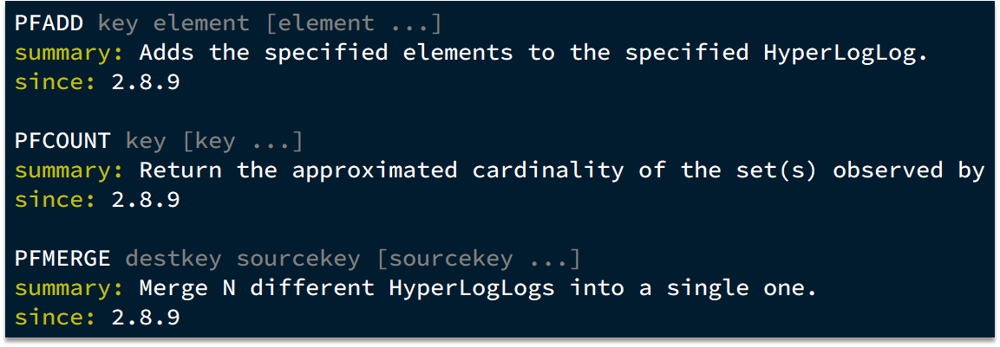

### 12.2 UV统计-测试百万数据的统计

测试思路：我们直接利用单元测试，向HyperLogLog中添加100万条数据，看看内存占用和统计效果如何


经过测试：我们会发生他的误差是在允许范围内，并且内存占用极小