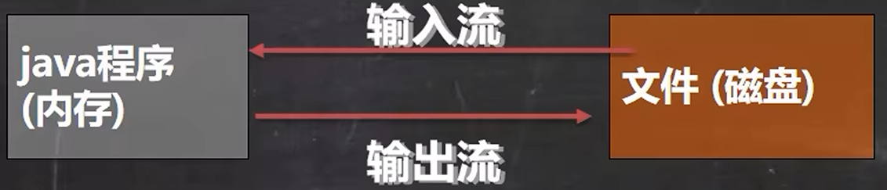
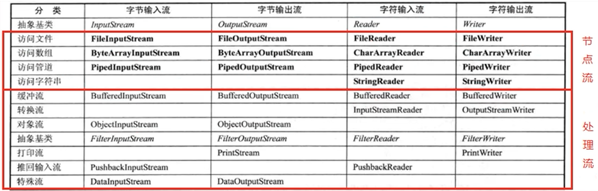

[toc]

# IO流
## 文件
文件就是保存数据的地方，常见的文件有 word、PPT、excel等。

文件在程序中是以流的形式来操作的，流是指数据从数据源（文件）和程序（内存）的路径。

输入流：数据从数据源（文件）到程序（内存）的路径。
输出流：数据从程序（内存）到数据源（文件）的路径。
### 创建文件
```java
public void create01() {
    String filepath = "d:\\1.txt";
    File file = new File(filepath);
    try {
        file.createNewFile();
        System.out.println("1.txt 文件创建成功。");
    } catch (IOException e) {
        throw new RuntimeException(e);
    }
}

public void create02() {
    String pfilepath = "d:\\";
    String filepath = "2.txt";
    File file = new File(pfilepath, filepath);
    try {
        file.createNewFile();
        System.out.println("2.txt 文件创建成功。");
    } catch (IOException e) {
        throw new RuntimeException(e);
    }
}

public void create03() {
    boolean mkdir = new File("d:\\testFile").mkdir();
    File file = new File("d:\\testFile", "\\4.txt");
    try {
        file.createNewFile();
    } catch (IOException e) {
        throw new RuntimeException(e);
    }
}
```
### 文件基本操作
```java
String filepath = "d:\\testFile\\";
File file = new File(filepath, "1.txt");

try {
    file.createNewFile();
} catch (IOException e) {
    throw new RuntimeException(e);
}

System.out.println("文件名称：" + file.getName());
System.out.println("文件的绝对路径：" + file.getAbsolutePath());
System.out.println("文件的长度（字节数）：" + file.length());
System.out.println("文件的父目录：" + file.getParent());
System.out.println("文件是否存在：" + file.exists());
System.out.println("文件是否为一般文件：" + file.isFile());
System.out.println("文件是否为目录：" + file.isDirectory());
```

### 目录的创建与删除
**delete**
delete 删除文件或者空目录
```java
String filepath = "d:\\testFile\\1.txt";
File file = new File(filepath);

if(file.exists()) {
    if(file.delete()) {
        System.out.println(file.getName() + "删除成功。");
    } else {
        System.out.println(file.getName() + "删除失败。");
    }
} else {
    System.out.println("文件不存在。");
}
```
**mkdir 和 mkdirs**
```java
// 判断目录是否存在，如果不存在则创建。注意嵌套多层目录
// 单层目录使用 mkdir()
String filepath = "d:\\testFile\\sub1\\sub2";
File file = new File(filepath);

if(!file.exists()) {
    if (file.mkdirs()) {
        System.out.println(file.getAbsoluteFile() + "创建成功。");
    } else {
        System.out.println(file.getAbsoluteFile() + "创建失败。");
    }
}
```
## IO流原理及流的分类
按操作单位不同分为：字节流（8bit）二进制文件；字符流（根据不同编码按字符）文本文件。
按数据的流向不同分为：输入流；输出流。
按流的角色不同分为：节点流；处理流（包装流）。

|抽象基类|字节流|字符流|
|---|---|---|
|输入流|InputStream|Reader|
|输出流|OutPutStream|Writer|


## 节点流和处理流



**节点流和处理流的区别和联系**
- 节点流是底层流/低级流,直接跟数据源相接.
- 处理流(包装流)包装节点流，既可以消除不同节点流的实现差异，也可以提供更方便的方法来完成输入输出。
- 处理流(也叫包装流)对节点流进行包装，使用了修饰器设计模式，不会直接与数据源相连

**处理流的功能主要体现在以下两个方面**
1. 性能的提高:主要以增加缓冲的方式来提高输入输出的效率
2. 操作的便捷:处理流可能提供了一系列便捷的方法来一次输入输出大批量的数据，使用更加灵活方便

**序列化和反序列化**
1.序列化就是在保存数据时，保存数据的值和数据类型
2反序列化就是在恢复数据时，恢复数据的值和数据类型
ObjectoutputStream 提供序列化功能； ObjectlnputStream 提供反序列化功能
> 需要让某个对象支持序列化机制，则必须让其类是可序列化的，为了让某个类是可序列化的，该类必须实现如下两个接口之:Serializable 或 Externalizable。 Serializable 是一个标记接口, 没有方法；Externalizable 接口有方法需要实现，因此我们一般实现 Serializable 接口。

## 输入流
### InputStream
#### **FileInputStream**
```java
String filepath = "d:\\testFile\\hello.txt";
FileInputStream fileInputStream = null;
try {
    fileInputStream = new FileInputStream(filepath);
    int res = 0;
    // read 返回一个 int。每次读取一个字节数据
    // 若读取完毕返回 -1
    while((res = fileInputStream.read()) != -1) {
        System.out.print((char)res);
    }

} catch (IOException e) {
    throw new RuntimeException(e);
} finally {
    // 一定要在 finally 及时释放资源
    try {
        if(fileInputStream != null) fileInputStream.close();
    } catch (IOException e) {
        throw new RuntimeException(e);
    }
}
```

#### **BufferedInputStream**
```java
String srcfilepath = "d:\\testFile\\1.jpg";
String destfilepath = "d:\\testFile\\sub1\\1.jpg";
// 创建
BufferedInputStream bufferedInputStream = null;
BufferedOutputStream bufferedOutputStream = null;

try {
    bufferedInputStream = new BufferedInputStream(new FileInputStream(srcfilepath));
    bufferedOutputStream = new BufferedOutputStream(new FileOutputStream(destfilepath));

    // 读取
    int len = 0;
    byte[] buffer = new byte[1024];
    while ((len = bufferedInputStream.read(buffer)) != -1) {
        bufferedOutputStream.write(buffer, 0, len);
    }
} catch (IOException e) {
    throw new RuntimeException(e);
} finally {
    try {
        if (bufferedInputStream != null) bufferedInputStream.close();
        if (bufferedOutputStream != null) bufferedOutputStream.close();
    } catch (IOException e) {
        throw new RuntimeException(e);
    }
}
```

#### **ObjectInputStream**
**注意事项和细节说明**
1. 读写顺序要一致
2. 要求实现序列化或反序列化对象 ，需要实现 Serializable
3. 序列化的类中建议添加SerialVersionUID,为了提高版本的兼容性
4. 序列化对象时，默认将里面所有属性都进行序列化，但除了 static 或 transient 修饰的成员
5. 序列化对象时，要求里面属性的类型也需要实现序列化接口
6. 序列化具备可继承性,也就是如果某类已经实现了序列化，则它的所有子类也已经默认实现了序列化
```java
// 实际类型并非 txt 是特有类型
String path = "d:\\testFile\\object.txt";
ObjectInputStream ois = null;
try {
    ois = new ObjectInputStream(new FileInputStream(path));
    // 自动装箱写入对象
    System.out.println(ois.readInt());
    System.out.println(ois.readChar());
    System.out.println(ois.readBoolean());
    System.out.println(ois.readDouble());
    System.out.println(ois.readUTF());
    // 自定义对象
    Object dog = ois.readObject();
    System.out.println(dog.getClass() + " " + dog);

} catch (IOException e) {
    e.printStackTrace();
} catch (ClassNotFoundException e) {
    throw new RuntimeException(e);
} finally {
    try {
        if(ois != null) {
            ois.close();
        }
    } catch (IOException e) {
        throw new RuntimeException(e);
    }
}
```

### Reader
#### **FileReader**
```java
String srcfilepath = "d:\\testFile\\hello.txt";
String destfilepath = "d:\\testFile\\hello2.txt";
FileReader fileReader = null;
FileWriter fileWriter = null;

try {
    fileReader = new FileReader(srcfilepath);
    fileWriter = new FileWriter(destfilepath);
    char[] buf = new char[1024];
    int len;

    while ((len = fileReader.read(buf)) != -1) {
        fileWriter.write(buf, 0, len);
    }
} catch (IOException e) {
    throw new RuntimeException(e);
} finally {
    try {
        if(fileReader != null) {
            fileReader.close();
        }
        if(fileWriter != null) {
            fileWriter.close();
        }
    } catch (IOException e) {
        throw new RuntimeException(e);
    }
}
```
#### **BufferedReader**
```java
String srcfilepath = "d:\\testFile\\hello.txt";
String destfilepath = "d:\\testFile\\helloCpy.txt";
// 创建
BufferedReader bufferedReader = new BufferedReader(new FileReader(srcfilepath));
BufferedWriter bufferedWriter = new BufferedWriter(new FileWriter(destfilepath));


// 读取
String line = null;
while ((line = bufferedReader.readLine()) != null) {
    bufferedWriter.write(line);
    bufferedWriter.newLine();
}
// 关闭流
bufferedReader.close();
bufferedWriter.close();
```
#### **InputStreamReader**
```java
String path = "d:\\testFile\\zh.txt";
BufferedReader br = null;

try {
    br = new BufferedReader(new InputStreamReader(
            new FileInputStream(path), "GB18030")
    );
    String line = null;
    while ((line = br.readLine()) != null) {
        System.out.println(line);
    }

} catch (IOException e) {
    throw new RuntimeException(e);
} finally {
    try {
        if (br != null) {
            br.close();
        }
    } catch (IOException e) {
        throw new RuntimeException(e);
    }
}
```

## 输出流
### OutputStream
#### **FileOutputStream**
```java
String filepath = "d:\\testFile\\hello.txt";
FileOutputStream fileOutputStream = null;
try {
    fileOutputStream = new FileOutputStream(filepath,true);

    /*
    write(int b);
    write(byte[] b);
    write(byte[] b, int off, int len); // 将 byte 数组从中的字节数据 off 开始写入 len 个
        */
    fileOutputStream.write(("hello").getBytes(), 1, 2);

} catch (IOException e) {
    throw new RuntimeException(e);
} finally {
    try {
        if(fileOutputStream != null) fileOutputStream.close();
    } catch (IOException e) {
        throw new RuntimeException(e);
    }
}
```
#### **BufferedOutputStream**
```java
String srcfilepath = "d:\\testFile\\1.jpg";
String destfilepath = "d:\\testFile\\sub1\\1.jpg";
// 创建
BufferedInputStream bufferedInputStream = null;
BufferedOutputStream bufferedOutputStream = null;

try {
    bufferedInputStream = new BufferedInputStream(new FileInputStream(srcfilepath));
    bufferedOutputStream = new BufferedOutputStream(new FileOutputStream(destfilepath));

    // 读取
    int len = 0;
    byte[] buffer = new byte[1024];
    while ((len = bufferedInputStream.read(buffer)) != -1) {
        bufferedOutputStream.write(buffer, 0, len);
    }
} catch (IOException e) {
    throw new RuntimeException(e);
} finally {
    try {
        if (bufferedInputStream != null) bufferedInputStream.close();
        if (bufferedOutputStream != null) bufferedOutputStream.close();
    } catch (IOException e) {
        throw new RuntimeException(e);
    }
}
```

#### **ObjectOutputStream**
```java
// 实际类型并非 txt 是特有类型
String path = "d:\\testFile\\object.txt";
ObjectOutputStream oos = null;
try {
    oos = new ObjectOutputStream(new FileOutputStream(path));
    // 自动装箱写入对象
    oos.writeInt(100);
    oos.writeChar('O');
    oos.writeBoolean(true);
    oos.writeDouble(11.1);
    oos.writeUTF("Hello");
    // 自定义对象
    oos.writeObject(new Dog(11, "wangwang"));

} catch (IOException e) {
    e.printStackTrace();
} finally {
    try {
        if(oos != null) {
            oos.close();
        }
    } catch (IOException e) {
        throw new RuntimeException(e);
    }
}
System.out.println("序列化完成！");
```

### Writer
#### **FileWriter**
```java
String srcfilepath = "d:\\testFile\\hello.txt";
String destfilepath = "d:\\testFile\\hello2.txt";
FileReader fileReader = null;
FileWriter fileWriter = null;

try {
    fileReader = new FileReader(srcfilepath);
    fileWriter = new FileWriter(destfilepath);
    char[] buf = new char[1024];
    int len;

    while ((len = fileReader.read(buf)) != -1) {
        fileWriter.write(buf, 0, len);
    }
} catch (IOException e) {
    throw new RuntimeException(e);
} finally {
    try {
        if(fileReader != null) {
            fileReader.close();
        }
        if(fileWriter != null) {
            fileWriter.close();
        }
    } catch (IOException e) {
        throw new RuntimeException(e);
    }
}
```
#### **BufferedWriter**
```java
String srcfilepath = "d:\\testFile\\hello.txt";
String destfilepath = "d:\\testFile\\helloCpy.txt";
// 创建
BufferedReader bufferedReader = new BufferedReader(new FileReader(srcfilepath));
BufferedWriter bufferedWriter = new BufferedWriter(new FileWriter(destfilepath));


// 读取
String line = null;
while ((line = bufferedReader.readLine()) != null) {
    bufferedWriter.write(line);
    bufferedWriter.newLine();
}
// 关闭流
bufferedReader.close();
bufferedWriter.close();
```
#### **OutputStreamWriter**
```java
String path = "d:\\testFile\\zh.txt";
String charset = "utf-8";

OutputStreamWriter osw = null;
osw = new OutputStreamWriter(new FileOutputStream(path), charset);
osw.write("让我们说中文！");
osw.close();
```

## Properties
### 读取配置文件
```java
// 创建 Properties 集合对象
Properties properties = new Properties();
// 加载配置信息
properties.load(new FileReader("src/p1.properties"));
// 全部展示
properties.list(System.out);
// 根据键获取值
System.out.println(properties.getProperty("user.name"));
System.out.println(properties.getProperty("password"));
System.out.println(properties.getProperty("ip"));
```

### 修改配置文件
```java
// 创建 Properties 集合对象
Properties properties = new Properties();
// 向 Properties 中添加键值对信息
//    规则：若存在则修改，若不存在则添加
properties.setProperty("user.name", "Sophon");
properties.setProperty("password", "*#*#*#");
properties.setProperty("ip", "192.165.50.110");
properties.setProperty("port", "6666");
// 存储到文件中
// 第二个参数 comment 给配置文件添加注释，一般为 null
properties.store(new FileWriter("src/p1.properties"), null);
```