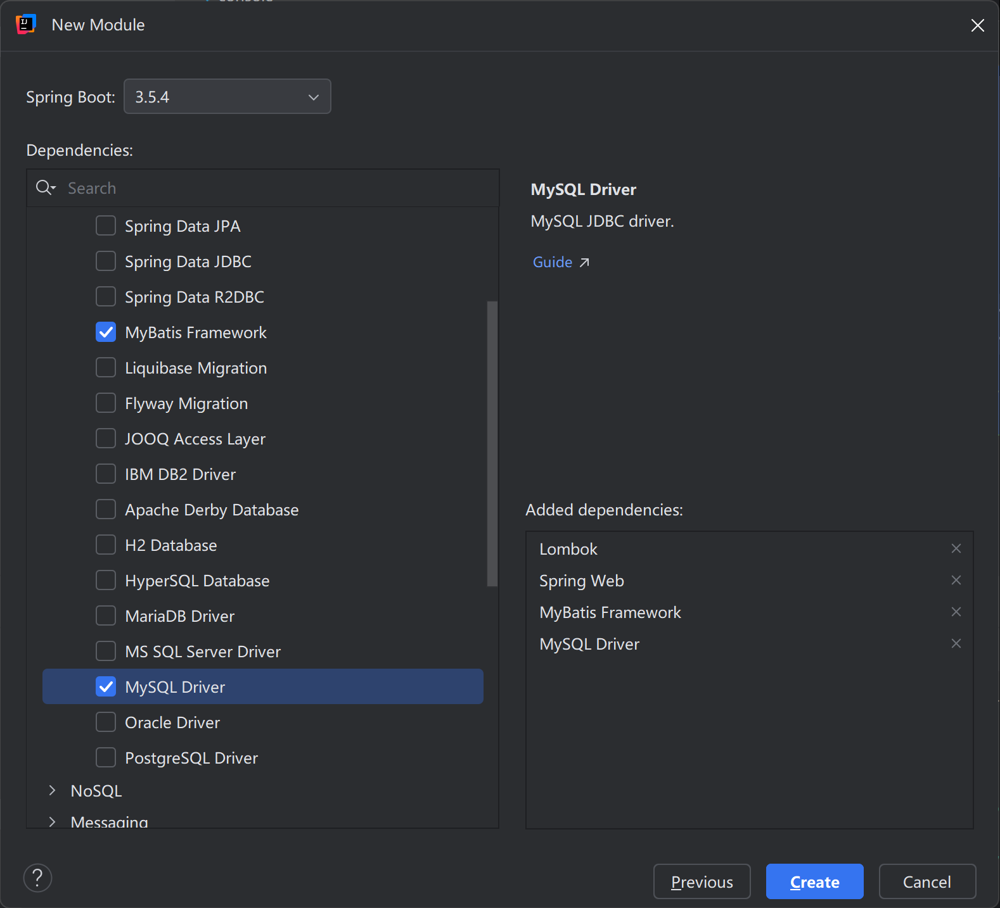

[toc]

> 收获简化开发插件：1.MyBatisX（生成 xml：Alt + Enter）。

# MyBatis Boot
## 快速开始
### 配置依赖
导入 dependencies：


数据库环境 `application.properties`：
```sql
spring.datasource.username=root
spring.datasource.password=123456
spring.datasource.url=jdbc:mysql://localhost:3306/mybatis_plus?useUnicode=true&characterEncoding=UTF-8&useSSL=false&serverTimezone=Asia/Shanghai
spring.datasource.driver-class-name=com.mysql.cj.jdbc.Driver
```

### 编写 Mapper
1.创建 `EmpMapper.java`：

```java
@Mapper
public interface EmpMapper {
    // 根据 id 查询员工信息
    Emp getEmpById(@Param("id") Integer id);

    // 添加员工
    int addEmp(Emp emp);
}
```

其中 `@Mapper` 注解的作用如下：
- 自动扫描和注册：Spring Boot会自动扫描带有 `@Mapper` 注解的接口，并将其注册为Spring容器中的Bean；
- 代理对象创建：MyBatis会为这个接口创建动态代理对象，实现SQL映射和数据库操作；
- 依赖注入支持：使用 `@Mapper` 后，可以在其他类中通过 `@Autowired` 等注解直接注入使用。

2.在 `resources/mapper/` 下创建 `EmpMapper.xml`：
```xml
<?xml version="1.0" encoding="UTF-8" ?>
<!DOCTYPE mapper PUBLIC "-//mybatis.org//DTD Mapper 3.0//EN" "http://mybatis.org/dtd/mybatis-3-mapper.dtd" >
<mapper namespace="com.mybatishello.mapper.EmpMapper">

    <insert id="addEmp" useGeneratedKeys="true" keyProperty="id">
        INSERT INTO t_emp (emp_name, age, emp_salary) VALUES (#{empName}, #{age}, #{empSalary})
    </insert>

    <select id="getEmpById" resultType="com.mybatishello.bean.Emp">
        SELECT * FROM t_emp WHERE id = #{id}
    </select>

</mapper>
```
> 不需要手动整合 MyBatis 核心配置文件，此时需要在 `application.properties` 中指明 `xxxMapper.xml` 在那个目录下：
> ```xml
> # 告诉 MyBatis 去哪找映射文件（必须配置）
> mybatis.mapper-locations=classpath:mapper/**.xml
> # 开启下划线转驼峰
> mybatis.configuration.map-underscore-to-camel-case=true
> # 开启 MyBatis 的 SQL 日志调试模式，用于调试和查看执行的 SQL 语句
> logging.level.com.mybatishello.mapper=debug
> # 以包为单位设置默认别名（不区分大小写）
> mybatis.type-aliases-package=com.mybatishello.bean
> ```

## 多对一、一对多映射处理
### 多对一映射处理
根据订单 id 查询订单信息，以及订单对应的客户信息。

**方式一：级联 association**
`OrderMapper.xml`：
```xml
<resultMap id="OrderWithCustomerRM" type="com.mybatishello.bean.Order">
    <id property="id" column="id"/>
    <result property="address" column="address"/>
    <result property="amount" column="amount"/>
    <result property="customerId" column="customer_id"/>
    <association property="customer" javaType="com.mybatishello.bean.Customer">
        <id property="c_id" column="id"/>
        <result property="customerName" column="customer_name"/>
        <result property="phone" column="phone"/>
    </association>
</resultMap>

<select id="getOrderWithCustomerById" resultMap="OrderWithCustomerRM">
    SELECT t_order.*, t_customer.id c_id, t_customer.customer_name, t_customer.phone
    FROM t_order left join t_customer on t_order.customer_id = t_customer.id
    WHERE t_order.id = #{id}
</select>
```

> 方式一查询结果集出现了相同的列 `id` ，如果不起别名 MyBatis 会出现逻辑错误。

**方式二：分布查询**
`OrderMapper.xml`：
```xml
<resultMap id="OrderWithCustomerRM" type="com.mybatishello.bean.Order">
    <id property="id" column="id"/>
    <result property="address" column="address"/>
    <result property="amount" column="amount"/>
    <result property="customerId" column="customer_id"/>
    <!--column 属性值会作为参数传递给 select 指定的查询方法-->
    <association property="customer" select="com.mybatishello.mapper.CustomerMapper.getCustomerById" column="customer_id" />
</resultMap>

<select id="getOrderWithCustomerById" resultMap="OrderWithCustomerRM">
    SELECT * FROM t_order WHERE t_order.id = #{id}
</select>
```

`CustomerMapper.xml`：
```xml
<select id="getCustomerById" resultType="com.mybatishello.bean.Customer">
    SELECT * FROM t_customer WHERE id = #{id}
</select>
```

### 一对多映射处理
根据客户 id 查询客户信息，以及客户对应的所有订单信息。

**方式一：级联 association**
`CustomerMapper.xml`：
```xml
<resultMap id="CustomerWithOrderRM" type="com.mybatishello.bean.Customer">
    <id column="id" property="id" />
    <result column="customer_name" property="customerName" />
    <result column="phone" property="phone" />
    <collection property="orders" ofType="com.mybatishello.bean.Order">
        <id column="order_id" property="id" />
        <result column="address" property="address" />
        <result column="amount" property="amount" />
        <result column="customer_id" property="customerId" />
    </collection>
</resultMap>

<select id="getCustomerWithOrdersById" resultMap="CustomerWithOrderRM">
    SELECT t_customer.*, t_order.id order_id, t_order.address, t_order.amount, t_order.customer_id
    FROM t_customer LEFT JOIN t_order ON t_customer.id = t_order.customer_id
    WHERE t_customer.id = #{id};
</select>
```

> 方式一查询结果集出现了相同的列 `id` ，如果不起别名 MyBatis 会出现逻辑错误。

**方式二：分布查询**
`CustomerMapper.xml`：
```xml
<resultMap id="CustomerWithOrderRM" type="com.mybatishello.bean.Customer">
    <id column="id" property="id" />
    <result column="customer_name" property="customerName" />
    <result column="phone" property="phone" />
    <collection property="orders" select="com.mybatishello.mapper.OrderMapper.getOrderByCustomerId" column="id"/>
</resultMap>

<select id="getCustomerWithOrdersById" resultMap="CustomerWithOrderRM">
    SELECT * FROM t_customer WHERE id = #{id}
</select>
```

`OrderMapper.xml`：
```xml
<select id="getOrderByCustomerId" resultType="com.mybatishello.bean.Order">
    SELECT * FROM t_order WHERE customer_id = #{customerId}
</select>
```
> `OrderMapper.xml` 应该写 getOrderByCustomerId 因为是使用 t_customer.id 作为关联条件进行子查询。

### 分布查询进阶
根据订单 id 查询订单信息，以及订单对应的客户信息，以及该客户对应的所有订单信息。

`OrderMapper.xml`：
```xml
<resultMap id="OrderWithCustomerAndOrdersRM" type="com.mybatishello.bean.Order">
    <id property="id" column="id"/>
    <result property="address" column="address"/>
    <result property="amount" column="amount"/>
    <result property="customerId" column="customer_id"/>

    <association property="customer" select="com.mybatishello.mapper.CustomerMapper.getCustomerWithOrdersById" column="customer_id" />
</resultMap>

<select id="getOrderWithCustomerAndOrdersById" resultMap="OrderWithCustomerAndOrdersRM">
    SELECT * FROM t_order WHERE t_order.id = #{id}
</select>
```

> select 中直接套用之前写好的分布查询。
> column 若需要多个参数传递，可以使用 `column={参数名=参数,...,参数名=参数}` 。

开启懒加载功能：
> ```xml
> # 开启 MyBatis 延迟加载功能
> mybatis.configuration.lazy-loading-enabled=true
> mybatis.configuration.aggressive-lazy-loading=false
> ```

## MyBatis缓存机制
**Spring Boot 整合**
- 一级缓存: Spring 将 SqlSession 的生命周期与 Spring 的事务（@Transactional）进行了绑定。事务开始时，会获取一个 SqlSession；事务结束时，会关闭 SqlSession。因此，一级缓存的生命周期就从 SqlSession 级别变为了 **“事务级别”** 。在同一个事务内，多次执行相同的查询会命中一级缓存。
- 二级缓存: 二级缓存的机制没有改变，它依然是基于 SqlSessionFactory 的。因为在 Spring 应用中通常只有一个 **SqlSessionFactory 单例 Bean**，所以由它创建的所有 SqlSession（即使它们分属于不同的事务）都可以共享二级缓存。因此说它是 **“多个事务共享级别”** 是准确的。
    > a> 在映射文件中设置标签 <cache />
    > b> 查询的数据所转换的实体类类型**必须实现序列化**的接口

**缓存失效**
一级缓存的作用域是 SqlSession (在 Spring 集成下是事务)。只要在同一个事务中，任何 update/delete/insert 操作（无论是由哪个 Mapper 执行的）都会清空当前 SqlSession 的整个一级缓存。

二级缓存的作用域是 Mapper 的 namespace。默认情况下，当一个 Mapper 执行 update/delete/insert 操作时，只会清空自己这个 namespace 所对应的二级缓存。它不会影响其他 namespace 的缓存。

> 一般不会启用二级缓存，而是使用 Redis 等缓存框架。

## MyBatis插件机制
### 插件实现原理
MyBatis 底层使用拦截器（Interceptor）机制提供插件功能，方便用户在SQL执行前后进行拦截增强。
拦截器可以拦截 **四大对象** 的执行：
- ParameterHandler：处理SQL的参数对象
- ResultSetHandler：处理SQL的返回结果集
- StatementHandler：数据库的处理对象，用于执行SQL语句
- Executor：MyBatis的执行器，用于执行增删改查操作

### 分页插件
PageHelper 是可以用在 MyBatis 中的一个强大的分页插件。
分页插件就是利用 MyBatis 插件机制，在底层编写了分页 Interceptor，每次 SQL 查询之前会自动拼装分页数据。

**1.引入依赖**
```xml
<dependency>
    <groupId>com.github.pagehelper</groupId>
    <!--  pagehelper-spring-boot-starter -->
    <artifactId>pagehelper</artifactId>
    <version>6.1.1</version>
</dependency>
```

**2.配置类添加组件**
```java
@MapperScan("com.mybatishello.mapper") // 批量扫描 mapper 接口（效果相当于批量给所有 mapper 接口类标注 @Mapper）
@Configuration
public class MybatisConfig {
    @Bean
    public PageInterceptor getPageInterceptor() {
        return new PageInterceptor();
    }
}
```

**3.在任何一次查询前使用 startPage**
```java
// 展示第 1 页，每页 5 条数据（页码从 1 开始）
PageHelper.startPage(1, 5);
List<Emp> allEmps = empMapper.getAllEmps();
allEmps.forEach(System.out::println);
```
紧跟着 startPage 之后的 **第一个方法** 就会执行分页。具体操作分两步：
1. 查询总记录数 COUNT(0)
2. 添加 limt 限制 limit(页码, 每页条数)

> 底层使用 ThreadLocal 同一个线程共享数据：第一个查询从 ThreadLocal 中获取到共享数据，执行分页；第一个查询操作执行完会把 ThreadLocal 分页数据删除。

**4.在获取查询集合后使用 PageInfo 获取更多信息**
```java
PageHelper.startPage(1, 5);
List<Emp> allEmps = empMapper.getAllEmps();
// 5表示连续显示的页码数，即，导航前后覆盖的页码数
PageInfo<Object> pageInfo = new PageInfo<>(allEmps, 5);
System.out.println(pageInfo); // 前端需要的所有页面信息
System.out.println(pageInfo.getPages()); // 分页后总页数
System.out.println(pageInfo.getTotal()); // 总记录条数
```

