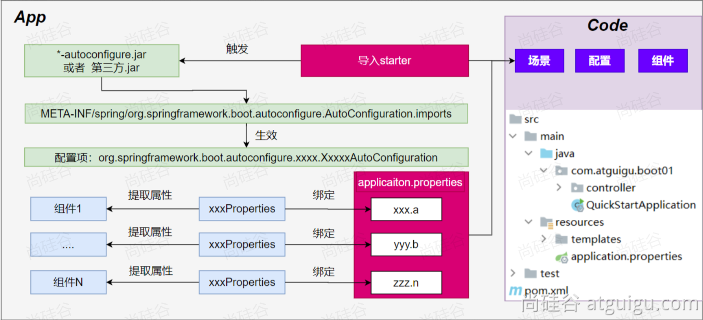
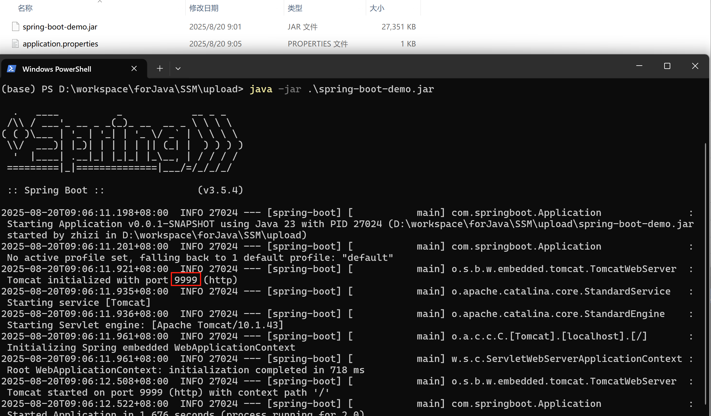

# SpringBoot 特性
> 约定大于配置
> 框架的框架：快速整合，快速启动

## **1、简介**
SpringBoot 帮我们简单、快速地创建一个独立的、生产级别的 Spring 应用，即使用最简单的方式快速整合所有技术栈。大多数 SpringBoot 应用只需要编写少量配置即可快速整合 Spring 平台以及第三方技术。
特性：
- 快速创建独立 Spring 应用
- 直接嵌入Tomcat、Jetty or Undertow
- 提供可选的 starter，简化应用整合
- 按需自动配置 Spring 以及 第三方库
- 提供生产级特性：如 监控指标、健康检查、外部化配置等
- 无代码生成、无xml； 都是基于自动配置技术

> 总结：简化开发，简化配置，简化整合，简化部署，简化监控，简化运维。
> SpringBoot 打包的 jar 包直接命令行输入 `java -jar 项目.jar` 即可运行，若需要改变 `application.properties` 中的任何配置，只需要附上 `--配置` 即可。

## **2、场景启动器**
场景启动器：导入相关的场景，拥有相关的功能。导入场景启动器会包含场景所需的所有 jar 包。
- 官方提供的场景：命名为：spring-boot-starter-*
- 第三方提供场景：命名为：*-spring-boot-starter

例如：
```xml
<!-- 官方提供的场景 -->
<dependency>
    <groupId>org.springframework.boot</groupId>
    <artifactId>spring-boot-starter-web</artifactId>
</dependency>
<!-- 第三方提供场景 -->
<dependency>
    <groupId>org.mybatis.spring.boot</groupId>
    <artifactId>mybatis-spring-boot-starter</artifactId>
    <version>3.0.5</version>
</dependency>
```


## **3、依赖管理**
为什么 SpringBoot 依赖不用写版本号，因为 maven 父子继承，父项目可以锁定版本。只有父不管的依赖需要写版本。
如何修改默认版本号？
- version 精确声明版本
- 子覆盖父的属性设置


## **4、自动配置机制**


**初步理解**：
- 自动配置
    - 导入场景，容器中就会自动配置好这个场景的核心组件。
    - 如 Tomcat、SpringMVC、DataSource 等
    - 不喜欢的组件可以自行配置进行替换
- 默认的包扫描规则
    - SpringBoot只会扫描主程序所在的包及其下面的子包
- 配置默认值
    - 配置文件的所有配置项 是和 某个类的对象值进行一一绑定的。
    - 很多配置即使不写都有默认值，如：端口号，字符编码等
    - 默认能写的所有配置项：https://docs.spring.io/spring-boot/appendix/application-properties/index.html
- 按需加载自动配置
    - 导入的场景会导入全量自动配置包，但并不是都生效

**底层流程**：
1. 导入 starter，就会导入 autoconfigure 包。
2. autoconfigure 包里面有一个文件 META-INF/spring/org.springframework.boot.autoconfigure.AutoConfiguration.imports，里面指定的所有启动要加载的自动配置类
3. @EnableAutoConfiguration 会自动的把上面文件里面写的所有自动配置类都导入进来。xxxAutoConfiguration 是有条件注解进行按需加载
4. xxxAutoConfiguration 给容器中导入一堆组件，组件都是从 xxxProperties 中提取属性值
5. xxxProperties 又是和配置文件（application.properties）进行了绑定

> 效果：导入 starter、修改配置文件，就能修改底层行为。

# SpringBoot 基础功能
## **1、属性绑定**
将容器中任意组件的属性值和配置文件的配置项的值进行绑定
1. 给容器中注册组件（@Component、@Bean）
2. 使用 @ConfigurationProperties 声明组件和配置文件的哪些配置项进行绑定

例：
`application.properties`：
```properties
emp.age=19
emp.emp-name=张三
emp.emp-salary=10000
emp.id=7
```
要进行属性绑定的类：
```java
@ConfigurationProperties(prefix = "emp")
@Component
public class Emp {
    private Integer id;
    private String empName;
    private Integer age;
    private Double empSalary;
}
```

## **2、YAML文件**


**简介**
YAML: YAML Ain't Markup Language™
- 设计目标，就是方便人类读写
- 层次分明，更适合做配置文件
- 使用.yaml或 .yml作为文件后缀

**语法**
- 大小写敏感
- 键值对写法 k: v，使用空格分割 k，v
- 使用缩进表示层级关系
    - 缩进时不允许使用Tab键，只允许使用空格。换行
    - 缩进的空格数目不重要，只要相同层级的元素左侧对齐即可
- \# 表示注释，从这个字符一直到行尾，都会被解析器忽略。
- Value支持的写法
    - 对象：键值对的集合，如：映射（map）/ 哈希（hash） / 字典（dictionary）
    - 数组：一组按次序排列的值，如：序列（sequence） / 列表（list），可以使用`[]`、 `- ` 表示数组。
    - 字面量：单个的、不可再分的值，如：字符串、数字、bool、日期

> SpringBoot 中 `.properties` 和 `.yaml` 文件配置了相同的配置项出现冲突，则优先选用 `.properties` 中的配置。

## **3、SpringApplication**
**自定义 banner**
- 类路径添加banner.txt或设置spring.banner.location就可以定制 banner
    > banner 生成网页 https://www.bootschool.net/ascii 。

**自定义 SpringApplication**
- new SpringApplication
```java
@SpringBootApplication
public class Application {
    public static void main(String[] args) {
        // 默认方式
        // SpringApplication.run(Application.class, args);

        // 创建 SpringApplication 对象
        SpringApplication springApplication = new SpringApplication(Application.class);

        // 添加其它配置项

        // 启动 Spring Boot 应用
        springApplication.run(args);
    }
}
```
- new SpringApplicationBuilder
```java
@SpringBootApplication
public class Application {
    public static void main(String[] args) {
        // 默认方式
        // SpringApplication.run(Application.class, args);

        // 使用SpringApplicationBuilder方式
        SpringApplicationBuilder springApplicationBuilder = new SpringApplicationBuilder();
        // 链式调用配置
        springApplicationBuilder.sources(Application.class)
                .bannerMode(Banner.Mode.OFF) // 关闭Banner
                .run(args);
    }
}
```

## **4、日志系统**
规范：项目开发不要写System.out.println()，用日志记录信息
SpringBoot 默认使用 slf4j + logback 。日志格式为：时间 级别 进程id --- 项目名 --- 线程名 --- 当前类名:日志内容。

> 日志级别：off > error > warn > info > debug > trace > all。

**基本使用**
```java
@Slf4j
@SpringBootTest
class ApplicationTests {
    @Test
    void contextLoads() {
        log.trace("trace log");
        log.debug("debug log");
        log.info("info log");
        log.warn("warn log");
        log.error("error log");
    }
}
```
可以在 `application.properties` 中配置打印日志级别：
```properties
# 设置全局日志级别
logging.level.root=info
# 设置 mapper 包的日志级别
logging.level.com.springboot.mapper=debug
```

**日志分组**
SpringBoot 支持分组统一配置，`application.properties`：
```properties
# 日志分组，指定业务组 biz
logging.group.biz=com.springboot.mapper,com.springboot.service
# 日志级别，指定业务组日志级别为 debug
logging.level.biz=debug
```

SpringBoot 还预定义了两个组：
| 组名 | 范围 |
| -- | -- |
| web | org.springframework.core.codec, org.springframework.http, org.springframework.web, org.springframework.boot.actuate.endpoint.web, org.springframework.boot.web.servlet.ServletContextInitializerBeans |
| sql | org.springframework.jdbc.core, org.hibernate.SQL, org.jooq.tools.LoggerListener |

**日志文件输出**
SpringBoot 默认只把日志写在控制台，如果想额外记录到文件，可以在application.properties中添加 logging.file.name 或 logging.file.path 配置项。

在 `application.properties` 中配置日志输出到文件：
```properties

```
输出到文件的日志越来越大越来越多就需要文件归档与滚动切割。
- 归档：每天的日志单独存到一个文档中。
- 切割：每个文件10MB，超过大小切割成另外一个文件。
默认滚动切割与归档规则如下：

| 配置项 | 描述 | 默认值 |
|--------|------|--------|
| `logging.logback.rollingpolicy.file-name-pattern` | 日志存档的文件名格式 | `${LOG_FILE}.%d{yyyy-MM-dd}.%i.gz` |
| `logging.logback.rollingpolicy.clean-history-on-start` | 应用启动时是否清除以前存档 | `false` |
| `logging.logback.rollingpolicy.max-file-size` | 每个日志文件的最大大小 | `10MB` |
| `logging.logback.rollingpolicy.total-size-cap` | 日志文件被删除之前，可以容纳的最大大小（设置为 `1GB` 则磁盘存储超过 `1GB` 日志后就会删除旧日志文件） | `0B` （表示不限制容量） |
| `logging.logback.rollingpolicy.max-history` | 日志文件保存的最大天数 | `7` |


# 进阶使用
## 1、Profiles环境隔离（掌握）
### 生效特定组件
1. 自定义环境标识
```java
@Configuration
public class DataSourceConfig {
    // Profile 指定环境标识 dev
    @Profile("dev")
    @Bean
    public MyDataSource dev() {
        MyDataSource dev = new MyDataSource();
        dev.setUsername("root");
        dev.setPassword("123456");
        dev.setUrl("jdbc:mysql://127.0.0.1:3306/devdb");
        dev.setDriver("com.mysql.jdbc.Driver");
        return dev;
    }

    @Profile("test")
    @Bean
    public MyDataSource test() {
        MyDataSource test = new MyDataSource();
        test.setUsername("test");
        test.setPassword("test123");
        test.setUrl("jdbc:mysql://127.0.0.1:3306/testdb");
        test.setDriver("com.mysql.jdbc.Driver");
        return test;
    }

    @Profile("prod")
    @Bean
    public MyDataSource prod() {
        MyDataSource myDataSource = new MyDataSource();
        myDataSource.setUsername("root");
        myDataSource.setPassword("123456");
        myDataSource.setUrl("jdbc:mysql://127.0.0.1:3306/proddb");
        myDataSource.setDriver("com.mysql.jdbc.Driver");
        return myDataSource;
    }
}
```
> 若未定义环境标识，默认处于 default 环境。
2. 激活环境标识
在 application.properties 中配置 `spring.profiles.active=环境标识` 。即可激活标识环境组件。
```properties
spring.profiles.active=prod
```

### 生效配置文件
为不同的环境编写不同的配置文件，application-{profile}.properties 可以作为指定环境的配置文件。


激活这个环境，配置就会生效。最终生效的所有配置是
- application.properties：主配置文件，任意时候都生效
- application-{profile}.properties：指定环境配置文件，激活指定环境生效

在 application.properties 中配置 `spring.profiles.active=环境标识` 。即可激活标识环境组件。同理，可以包含一个环境。
```properties
# 激活指定环境
spring.profiles.active=dev
# 包含指定环境
spring.profiles.include=prod
```

> 如果环境被激活则：profile优先级 > application。
> 生效的配置 = 默认环境配置 + 激活的环境  + 包含的环境配置

环境分组操作（了解）：
```properties
# 设置 profile 组
spring.profiles.group.env[0]=dev
spring.profiles.group.env[1]=common
# 每次激活一整组环境
spring.profiles.active=env
```

## 2、外部化配置（掌握）


将项目打包为 `.jar` 文件后，在 jar 包所在目录仍可以配置 `application.properties` 文件。且项目启动后优先选用此文件中的配置。

配置生效优先级（越外部越优先，命令行优先级最高）： 


## 3、单元测试进阶（熟悉）
### 测试注解
@Test : 表示方法是测试方法。
@ParameterizedTest : 表示方法是参数化测试，下方会有详细介绍
@RepeatedTest : 表示方法可重复执行，下方会有详细介绍
@DisplayName : 为测试类或者测试方法设置展示名称
@BeforeEach : 表示在每个单元测试之前执行
@AfterEach : 表示在每个单元测试之后执行
@BeforeAll : 表示在所有单元测试之前执行
@AfterAll : 表示在所有单元测试之后执行
@Tag : 表示单元测试类别，类似于JUnit4中的@Categories
@Disabled : 表示测试类或测试方法不执行，类似于JUnit4中的@Ignore
@Timeout : 表示测试方法运行如果超过了指定时间将会返回错误
@ExtendWith : 为测试类或测试方法提供扩展类引用

### 断言机制

| 方法 | 说明 |
|------|------|
| `Assertions.assertEquals` | 判断两个对象或两个原始类型是否相等 |
| `Assertions.assertNotEquals` | 判断两个对象或两个原始类型是否不相等 |
| `Assertions.assertSame` | 判断两个对象引用是否指向同一个对象 |
| `Assertions.assertNotSame` | 判断两个对象引用是否指向不同的对象 |
| `Assertions.assertTrue` | 判断给定的布尔值是否为 true |
| `Assertions.assertFalse` | 判断给定的布尔值是否为 false |
| `Assertions.assertNull` | 判断给定的对象引用是否为 null |
| `Assertions.assertNotNull` | 判断给定的对象引用是否不为 null |
| `Assertions.assertArrayEquals` | 数组断言 |
| `Assertions.assertAll` | 组合断言 |
| `Assertions.assertThrows` | 异常断言 |
| `Assertions.assertTimeout` | 超时断言 |
| `Assertions.fail` | 快速失败 |

## 4、可观测性（了解）
可观测性（Observability）指应用的运行数据，可以被线上进行观测、监控、预警等。


SpringBoot 提供了 actuator 模块，可以快速暴露应用的所有指标。导入 spring-boot-starter-actuator 场景，访问 http://localhost:8080/actuator 即可展示出所有可以用的监控端点。
在访问之前，需要在 application.properties 中配置。
```properties
# 暴露所有 Actuator 端点用于监控和管理
management.endpoints.web.exposure.include=*
```

# 核心原理

## 1、生命周期监听（了解）


> 实现自己的生命周期监听器步骤：
> 1、实现接口 SpringApplicationRunListener
> 2、创建文件 META-INF/spring.factories，并以 properties 键值对的方式配置 `接口引用全类名=实现类` 。

其它监听器（了解）：
| 监听器 | 感知阶段 | 配置方式 |
|--------|----------|----------|
| `BootstrapRegistryInitializer` | 特定阶段：引导初始化 | 1、META-INF/spring.factories；2、application.addBootstrapRegistryInitializer() |
| `ApplicationContextInitializer` | 特定阶段：IOC容器初始化 | 1、META-INF/spring.factories；2、application.addInitializers() |
| `ApplicationListener` | 全阶段 | 1、META-INF/spring.factories；2、SpringApplication.addListeners(…)；3、@Bean 或 @EventListener |
| `SpringApplicationRunListener` | 全阶段 | `META-INF/spring.factories` |
| `ApplicationRunner` | 特定阶段：感知应用就绪 | `@Bean` |
| `CommandLineRunner` | 特定阶段：感知应用就绪 | `@Bean` |

> 最佳实践：
> 1、应用启动后做事：ApplicationRunner、CommandLineRunner
> 2、事件驱动开发：ApplicationListener


## 2、生命周期事件（了解）


## 3、事件驱动开发
事件驱动开发减少了 Controller 代码简化了执行逻辑、降低了代码之间的耦合度，且可以通过简单的注解**异步**执行触发代码，避免阻塞主线程提高了运行效率。


应用启动过程生命周期事件感知（9大事件）。

应用运行中事件感知（无数种）。

**事件驱动开发**（融合异步监听执行）
1、定义事件
- 任意事件：任意类可以作为事件类，建议命名 xxxEvent
- 系统事件：继承 ApplicationEvent

定义用户成功登陆事件：
```java
@Data
public class UserLoginSuccessEvent { // 用户登录成功事件
    private String username;

    public UserLoginSuccessEvent(String username) {
        this.username = username;
    }
}
```
> 注意：定义的事件类只是 POJO，并非组件。

2、事件发布
- 组件实现 ApplicationEventPublisherAware
- 自动注入 ApplicationEventPublisher

发布用户登录成功事件（UserController.java）：
```java
@GetMapping("/login/{username}")
public String login(@PathVariable("username") String username) {
    log.info("用户{}登录成功", username);
    // 发送登录成功事件
    applicationEventPublisher.publishEvent(new UserLoginSuccessEvent(username));
    return "success";
}
```

3、事件监听
组件 + 方法标注@EventListener。

监听事件发放优惠券（发放积分同理）：
```java
@Slf4j
@Service
public class CouponService {
    @Async // 异步执行，避免阻塞主线程
    @EventListener(UserLoginSuccessEvent.class) // 监听用户登录成功事件
    public void listenUserLoginSuccessEvent(UserLoginSuccessEvent event) {
        log.info("监听到用户 {} 登录成功", event.getUsername());
        sendCoupon(event.getUsername());
    }

    public void sendCoupon(String username) {
        // 模拟发送优惠券
        log.info("给用户 {} 发送优惠券成功", username);
    }
}
```

> `@Async` 异步执行注解，需要在启动类上开启
> ```java
> @EnableAsync // 开启异步功能
> @SpringBootApplication
> public class Application {
>     public static void main(String[] args) {
>          SpringApplication.run(Application.class, args);
>     }
> }
> ```

## 4、SpringBoot 完整启动流程（了解）


# 自定义 starter（了解）
## 1、场景设计
场景：抽取聊天机器人场景，它可以打招呼。
效果：任何项目导入此starter都具有打招呼功能，并且问候语中的人名需要可以在配置文件中修改

## 2、基础抽取
1. 创建自定义starter项目，引入spring-boot-starter基础依赖
2. 编写xxxAutoConfiguration自动配置类，帮其他项目导入这个模块需要的所有组件（RobotAutoConfiguration）
    ```java
    @Configuration
    @EnableConfigurationProperties(RobotProperties.class)
    public class RobotAutoConfiguration {
        @Bean
        public RobotController robotController() {
            return new RobotController();
        }
    }
    ```

> 这个阶段其它项目使用自定义场景，除了需要导入自定义场景还需要使用 `@Import(xxxAutoConfiguration.class)` 注解导入配置类。

## 3、@EnableXx机制
1. 编写自定义 @EnableXxx 注解
2. @EnableXxx 导入自动配置类（）
3. 测试功能组件生效
    ```java
    @Target({ElementType.TYPE})
    @Retention(RetentionPolicy.RUNTIME)
    @Documented
    @Import({RobotAutoConfiguration.class})
    public @interface EnableRobot {
    }
    ```

> 这个阶段其它项目使用自定义场景，除了需要导入自定义场景只需要使用 `@EnableRobot` 注解导入配置类。

## 4、完全自动配置
1. 依赖 SpringBoot 的 SPI 机制
2. META-INF/spring/org.springframework.boot.autoconfigure.AutoConfiguration.imports 文件中编写好我们自动配置类的全类名即可
    ```imports
    com.robotspringbootstarter.RobotAutoConfiguration
    ```
3. 项目启动，自动加载我们的自动配置类

> 这个阶段其它项目使用自定义场景，只需要导入自定义场景。
