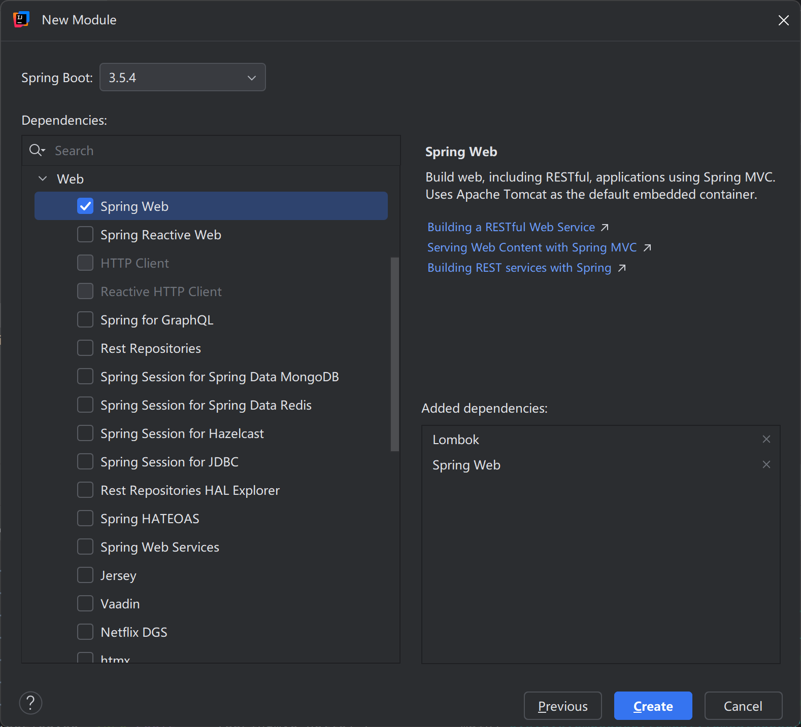

[toc]
# springMVC Boot
## Hello World
### 环境依赖


编写 HelloController ：
```java
@Controller
public class HelloController {

    @ResponseBody
    @RequestMapping("/hello")
    public String hello() {
        return "Hello World!你好！";
    }
}
```
点击运行即可通过 `http://localhost:8080/hello` 访问页面，因为 Spring Boot 已经集成了 Tomcat ，不需要自行配置 Tomcat。
> 1. 且页面中可以出现中文，说明 Spring Boot 也处理了乱码；
> 2. 原本 spring MVC 中还需要在 web.xml 以及 springMVC.xml 中的配置也无需出现;
> 3. 更改启动端口可以在 `application.properties` 中添加 `server.port=8888` 。


## 请求处理
### @RequestMapping
- 路径映射
    - ?：表示任意的单个字符（有且必须有一个，不能0个）
    *：表示任意的0个或多个字符
    \\**：表示任意的0层或多层目录

    > 注意：
    > 1.在使用/\**时，只能使用/xx/**的方式（`**` 只能在末尾）；
    > 2.特殊符号不可以: ? / \ [ ] % ;
    - 路径变量：@PathVariable （指定和前端数据参数映射关系）
- 请求限定
    - 请求方式：method
    - 请求参数：params
    - 请求头：headers
    - 请求内容类型：consumes
    - 响应内容类型：produces

```java
/**
 * 使用consumes指定请求的内容类型为application/json
 * 这样只有当请求的Content-Type为application/json时，才会匹配到这个方法。
 */
@RequestMapping(value = "/hello3", consumes = "application/json")
public String hello3() {
    return "Hello!你好！";
}

/**
 * 使用produces指定返回的内容类型为text/plain;charset=UTF-8
 * 这样浏览器就会以文本方式显示，而不是HTML方式。
 */
@RequestMapping(value = "/hello4", produces = "text/plain;charset=UTF-8")
public String hello4() {
    return "<h1>Hello World!你好！</h1>";
}
```
### 文件上传
文件上传要求：


Controller 代码：
```java
@Autowired
private ResourceLoader resourceLoader;

@RequestMapping("/upload")
public String handle08(HttpSession session, Person person,
                        @RequestParam("headerImg") MultipartFile headerImg,
                        @RequestParam("lifeImg") MultipartFile[] lifeImg) throws IOException {

    System.out.println(person);

    // 使用项目根目录下的upload文件夹
    String uploadPath = resourceLoader.getResource("file:upload").getFile().getAbsolutePath();
    
    File headerImgFile = new File(uploadPath + File.separator + "headerImgs");
    File lifeImgFile = new File(uploadPath + File.separator + "lifeImgs");
    if (!headerImgFile.exists()) {
        headerImgFile.mkdirs(); // 创建目录
    }
    if (!lifeImgFile.exists()) {
        lifeImgFile.mkdirs(); // 创建目录
    }

    String originalFilename = headerImg.getOriginalFilename();
    headerImg.transferTo(new File(headerImgFile, originalFilename));
    for (MultipartFile multipartFile : lifeImg) {
        String fileName = multipartFile.getOriginalFilename();
        multipartFile.transferTo(new File(lifeImgFile, fileName));
    }
    return "Ok";
}
```
> 可以在配置文件 `application.properties` 中修改**单个文件大小限制**和**单次请求总大小限制**：
> ```xml
> spring.servlet.multipart.max-file-size=10GB
> spring.servlet.multipart.max-request-size=10GB
> ```

### 文件下载

Controller 代码：
```java
@Autowired
private ResourceLoader resourceLoader;

@RequestMapping("/download")
public ResponseEntity<byte[]> handle09() throws IOException {
    byte[] bytes = null;
    try(BufferedInputStream bis = new BufferedInputStream(resourceLoader.getResource("file:upload/lifeImgs/2qp316.jpg").getInputStream()) ) {
        bytes = bis.readAllBytes();
    }
    return  ResponseEntity.ok()
                // 内容处理方式
                .header("Content-Disposition", "attachment; filename=" + URLEncoder.encode("这是图片.jpg", StandardCharsets.UTF_8))
                // 内容类型
                .contentType(MediaType.APPLICATION_OCTET_STREAM)
                // 内容大小
                .contentLength(bytes.length)
                .body(bytes);
}
```
> - Content-Disposition 响应头：指定文件名信息，文件名如果有中文还需要 URLEncoder 进行- 编码；
> - ContentType 响应头：指定响应内容类型，是一个 OCTET_STREAM（8位字节流）；
> - ContentLength 响应头：指定内容大小；
> - body 指定具体响应内容（文件字节流）；也可以用 Resource 替换 byte[]，防止 OOM 。
>   ```java
>   @RequestMapping("/download")
>   public ResponseEntity<Resource> handle09() throws IOException {
>       Resource resource = resourceLoader.getResource("file:upload/lifeImgs/2qp316.jpg");
>       return  ResponseEntity.ok()
>               // 内容处理方式
>               .header("Content-Disposition", "attachment; filename=" + URLEncoder.encode("这是图片.jpg", StandardCharsets.UTF_8))
>               // 内容类型
>               .contentType(MediaType.APPLICATION_OCTET_STREAM)
>               .body(resource);
>   }
>   ```
>

### 模板引擎
> 小 demo 演示，企业开发更多使用前后端分离处理，不必深究。若深究请参考 [springMVC](./springMVC.md#七restful)

1.引入 Thymeleaf 依赖


```xml
<dependency>
    <groupId>org.springframework.boot</groupId>
    <artifactId>spring-boot-starter-thymeleaf</artifactId>
</dependency>
```

2.收参与响应数据
controller 代码：
```java
@RequestMapping("/success")
public String success(String username, String password, Model model) {
    System.out.println("Username: " + username + ", Password: " + password);
    List<Person> people = new ArrayList<>(Arrays.asList(
            new Person("张三", "123456", "13800000000", "on", new String[]{"足球", "篮球"}, "一年级"),
            new Person("李四", "abcdef", "13900000000", "on", new String[]{"乒乓球", "羽毛球"}, "二年级"),
            new Person("王五", "qwerty", "13700000000", "on", new String[]{"排球", "网球"}, "三年级")
    ));
    model.addAttribute("people", people);
    return "success";
}
```

展示页面：
```html
<!DOCTYPE html>
<html lang="en">
<head>
    <meta charset="UTF-8">
    <title>成功</title>
</head>
<body>

<h1>登录成功</h1>
<table>
    <tr>
        <th colspan="6">用户信息表</th>
    </tr>
    <tr>
        <th>用户名</th>
        <th>密码</th>
        <th>手机号</th>
        <th>协议</th>
        <th>爱好</th>
        <th>年级</th>
    </tr>
    <tr th:each="p : ${people}">
        <!--public Person(String username, String password, String cellphone, String agreement, String[] hobby, String grade)-->
        <td th:text="${p.username}"></td>
        <td th:text="${p.password}"></td>
        <td th:text="${p.cellphone}"></td>
        <td th:text="${p.agreement}"></td>
        <td th:text="${#strings.arrayJoin(p.hobby, ', ')}"></td>
        <td th:text="${p.grade}"></td>
    </tr>
</table>
</body>
</html>
```

## RESTful

### 简介
REST（Representational State Transfer 表现层状态转移）是一种软件架构风格。
- Resource：资源
- Representational：表现形式：比如用JSON，XML，JPEG等
- State Transfer：状态变化：通过HTTP的动词（GET、POST、PUT、DELETE）实现

一句话：使用资源名作为URI，使用HTTP的请求方式表示对资源的操作满足 REST 风格的系统，我们称为是 RESTful 系统。

以 员工的 增删改查 为例，设计的 RESTful API 如下：
| URI               | 请求方式 | 请求体          | 作用           | 返回数据             |
|-------------------|----------|-----------------|----------------|----------------------|
| `/employee/{id}`  | GET      | 无              | 查询某个员工    | Employee JSON        |
| `/employee`       | POST     | employee json   | 新增某个员工    | 成功或失败状态       |
| `/employee`       | PUT      | employee json   | 修改某个员工    | 成功或失败状态       |
| `/employee/{id}`  | DELETE   | 无              | 删除某个员工    | 成功或失败状态       |
| `/employees`      | GET      | 无/查询条件     | 查询所有员工    | List\<Employee\>JSON |
| `/employees/page` | GET      | 无/分页条件     | 查询所有员工    | 分页数据 JSON        |

> 调用别人的功能几种方式：
> 1. API：给第三方发送请求，获取响应数据；
> 2. SDK：导入 jar 包。

### 案例
#### 导入项目依赖


#### 配置数据源信息
spring boot 在 `application.properties` 中配置：
```properties
spring.datasource.username=root
spring.datasource.password=123456
spring.datasource.url=jdbc:mysql://localhost:3306/mybatis_plus?useUnicode=true&characterEncoding=UTF-8&useSSL=false&serverTimezone=Asia/Shanghai
spring.datasource.driver-class-name=com.mysql.cj.jdbc.Driver
```

#### CRUD 案例
**1.根据 Id 查询单个员工**：
Controller 代码：
```java
@GetMapping(value = "/employee/{id}")
public Employee getEmployee(@PathVariable("id") long id) {
    return employeeService.getEmployeeById(id);
}
```
运行结果（返回 Json ）：


**2.根据 Id 删除单个员工**：
Controller 代码：
```java
@DeleteMapping(value = "/employee/{id}", method = RequestMethod.DELETE)
public String deleteEmployee(@PathVariable("id") long id) {
    employeeService.deleteEmployee(id);
    return "ok";
}
```
运行结果（Postman）：


**3.查询所有员工**：
Controller 代码：
```java
@GetMapping(value = "/employees")
public List<Employee> getAllEmployees() {
    return employeeService.getAllEmployees();
}
```
运行结果（返回 Json ）：


**4.添加员工**：
Controller 代码：
```java
@PostMapping(value = "/employee")
public String addEmployee(@RequestBody Employee employee) {
    employeeService.addEmployee(employee);
    return "ok";
}
```
运行结果（Postman 请求）：


**4.修改员工**：
Controller 代码：
```java
@PutMapping(value = "/employee")
public String updateEmployee(@RequestBody Employee employee) {
    employeeService.upDateEmployee(employee);
    return "ok";
}
```
运行结果（Postman 请求）：


> 允许跨域使用注解 `@CrossOrigin` 标注 Controller 方法或类。
> CORS（Cross-Origin Resource Sharing，跨域资源共享）是一种由浏览器实现的安全机制，允许网页在“跨源”（协议/域名/端口任一不同）情况下，受控地访问另一个源的资源。

#### 返回值统一（重要）
为了方便前端统一处理数据，以及前后端沟通。统一返回 json 数据，json 固定格式为：
```json
{
    "code" : "状态码",
    "message" : "状态码描述信息",
    "data" : "具体数据"
}
```
例如（getAllEmployees）：
```json
{
    "code": 200,
    "message": "success",
    "data": [
        {
            "id": 1,
            "name": "张三",
            "age": 11,
            "email": "aa@qq.com",
            "gender": "男",
            "address": "西安",
            "salary": 9999.0
        },
        {
            "id": 8,
            "name": "->lisi<-",
            "age": 24,
            "email": "2123@qq.com",
            "gender": "男",
            "address": "北京市海淀区",
            "salary": 1000000.0
        }
    ]
}
```
为了达成这一目的，自定义返回值类 R：
```java
@Data
public class R<T> {

    private Integer code;
    private String message;
    private T data;

    public R(Integer code, String message, T data) {
        this.code = code;
        this.message = message;
        this.data = data;
    }

    public static <T> R<T> ok() {
        return new R<>(200, "success", null);
    }

    public static<T> R<T> ok(T data) {
        return new R<T>(200, "success", data);
    }
}
```
并修改所有的 Controller 代码：
```java
@RestController
public class EmployeeController {

    @Autowired
    private EmployeeService employeeService;

    @GetMapping(value = "/employee/{id}")
    public R<Employee> getEmployee(@PathVariable("id") long id) {
        Employee emp = employeeService.getEmployeeById(id);
        return R.ok(emp);
    }

    @DeleteMapping(value = "/employee/{id}")
    public R<Object> deleteEmployee(@PathVariable("id") long id) {
        int row = employeeService.deleteEmployee(id);
        return R.ok();
    }

    @GetMapping(value = "/employees")
    public R<List<Employee>> getAllEmployees() {
        List<Employee> allEmployees = employeeService.getAllEmployees();
        return R.ok(allEmployees);
    }

    @PostMapping(value = "/employee")
    public R<Object> addEmployee(@RequestBody Employee employee) {
        int row = employeeService.addEmployee(employee);
        return R.ok();
    }

    @PutMapping(value = "/employee")
    public R<Object> updateEmployee(@RequestBody Employee employee) {
        int row = employeeService.upDateEmployee(employee);
        return R.ok();
    }
}
```
## 拦截器
### 配置拦截器
SpringMVC中的拦截器用于拦截控制器方法的执行

SpringMVC中的拦截器需要实现 HandlerInterceptor

SpringMVC的拦截器必须在配置类中进行配置（实现 WebMvcConfigurer 接口）：
```java
@Configuration // 专门对 SpringMVC 底层进行配置
public class MySpringMVCConfig implements WebMvcConfigurer {

    @Autowired
    private MyHandlerInterceptor myHandlerInterceptor;

    // 添加拦截器
    @Override
    public void addInterceptors(InterceptorRegistry registry) {
        registry.addInterceptor(myHandlerInterceptor)
                .addPathPatterns("/**")
                .order(1); // 设置拦截器的优先级，数字越小优先级越高;
    }
}
```

### 自定义拦截器
```java
@Component
public class MyHandlerInterceptor implements HandlerInterceptor {

    @Override
    public boolean preHandle(HttpServletRequest request, HttpServletResponse response, Object handler) throws Exception {
        response.getWriter().write("permission denied!");
        return false;
    }

    @Override
    public void postHandle(HttpServletRequest request, HttpServletResponse response, Object handler, ModelAndView modelAndView) throws Exception {
        HandlerInterceptor.super.postHandle(request, response, handler, modelAndView);
    }

    @Override
    public void afterCompletion(HttpServletRequest request, HttpServletResponse response, Object handler, Exception ex) throws Exception {
        HandlerInterceptor.super.afterCompletion(request, response, handler, ex);
    }
}
```

### 拦截器和过滤器的区别
| 对比项      | 控制器 (HandlerInterceptor)                                  | 过滤器 (Filter)                                             |
| -------- | -------------------------------------------------------------- | -------------------------------------------------------- |
| **所属框架** | Spring 框架                                                | Servlet 规范                                               |
| **放行方式** | `preHandle` 返回 `true` 放行请求                            | `chain.doFilter()` 放行请求                                  |
| **整合性**  | 可直接整合 Spring 容器的所有组件（如注入 Bean）                | 不受 Spring 容器管理，需通过 `@Component` 或手动注册                    |
| **拦截范围** | 仅拦截 SpringMVC 能处理的请求（如 `.do`、Rest API）          | 拦截所有 Web 请求，包括静态资源等                                      |
| **推荐场景** | 业务层控制（如权限校验、登录状态验证、接口拦截等）                                      | 低层技术控制（如字符编码、跨域、XSS 过滤）                                  |
| **接口定义** | 实现 `HandlerInterceptor` 接口                              | 实现 `javax.servlet.Filter` 接口                             |
| **总结**   | Spring 框架中的推荐方式，适合做与 Controller 紧密关联的请求处理逻辑；支持依赖注入，配置灵活，开发效率高。 | 更底层，独立于 Spring，适合处理与框架无关的通用功能（如日志、编码、权限过滤等），适用于过滤所有类型请求。 |

## 异常处理器
SpringMVC提供了 @ExceptionHandler、@ControllerAdvice 等便捷的声明式注解来进行快速的异常处理。

> 若发生的异常可以适配多个 @ExceptionHandler 标注的异常类型，遵循精确优先原则调用异常处理逻辑。
> 异常处理优先级：本类大于全局。

### 单个类异常处理
如果 Controller 本类出现问题，会自动在本类中寻找使用 `@ExceptionHandler` 注解标注的方法，如果有执行这个方法。
使用 `@ExceptionHandler` 注解在 Controller 代码中嵌入异常处理逻辑：
```java
@GetMapping(value = "/exception")
public R<Object> testException(@RequestParam(value = "i", defaultValue = "0") int i) {
    int rest = 1 / i;
    return R.ok();
}

@ExceptionHandler(ArithmeticException.class)
public R<Object> testException(Exception e) {
    return R.error("异常测试: " + e.getMessage());
}
```
运行结果：


### 全局异常处理
> 其中：@RestControllerAdvice = @ResponseBody + @ControllerAdvice
```java
@RestControllerAdvice
public class TestExceptionController {

    @ExceptionHandler(ArithmeticException.class)
    public R<Object> testException(Exception e) {
        return R.error("异常测试: " + e.getMessage());
    }

}
```
运行结果：


### 企业异常处理
前端关心异常状态码，后端关心业务。

企业异常处理方式：
1. 必须有业务异常类：BizException；
2. 必须有异常枚举类：BizExceptionEnum；
3. 编写业务代码时，只需要编写正确逻辑，如果出现预期的问题，需要以抛异常的方式中断逻辑并通知上层；
4. 全局异常处理器：GlobalExceptionHandler 处理所有异常，返回与前端约定好的的 json 数据和错误码。

为了避免状态码变动，以及提高可读性自定义异常枚举类：
```java
public enum BizExceptionEnum {
    // ORDER_XXX：订单模块的异常
    // USER_XXX：用户模块的异常

    ORDER_CLOSED(10001, "订单已关闭"),
    ORDER_NOT_EXIST(10002, "订单不存在"),
    ORDER_STATUS_ERROR(10003, "订单状态错误"),
    ORDER_NOT_PAID(10004, "订单未支付"),

    USER_NOT_EXIST(20001, "用户不存在"),
    USER_PASSWORD_ERROR(20002, "用户密码错误"),
    USER_NOT_LOGIN(20003, "用户未登录"),
    USER_NOT_ADMIN(20004, "用户不是管理员"),
    USER_NOT_PERMITTED(20007, "用户无权限");

    @Getter
    private final Integer code;
    @Getter
    private final String message;

    BizExceptionEnum(Integer code, String message) {
        this.code = code;
        this.message = message;
    }
}
```

自定义业务异常，使用枚举类构造异常状态码和异常状态信息：
```java
public class BizException extends RuntimeException {
    @Getter
    private Integer code;
    @Getter
    private String message;

    public BizException(BizExceptionEnum exceptionEnum) {
        super(exceptionEnum.getMessage());
        this.code = exceptionEnum.getCode();
        this.message = exceptionEnum.getMessage();
    }
}
```

全局异常处理：
```java
@RestControllerAdvice
public class TestExceptionController {
    @ExceptionHandler(BizException.class)
    public R<Object> testException(BizException e) {
        return R.error(e.getCode(), e.getMessage());
    }
}
```
测试（getEmployeeById）：
```java
if (id < 0) {
    throw new BizException(BizExceptionEnum.USER_NOT_EXIST);
}
```


## 数据校验
JSR 303 是 Java 为 Bean 数据合法性校验 提供的标准框架，它已经包含在 JavaEE 6.0 标准中。JSR 303 通过在 Bean 属性上标注类似于 @NotNull、@Max 等标准的注解指定校验规则，并通过标准的验证接口对Bean进行验证。

数据校验使用流程
1. 引入校验依赖：spring-boot-starter-validation
    ```java
    <dependency>
        <groupId>org.springframework.boot</groupId>
        <artifactId>spring-boot-starter-validation</artifactId>
    </dependency>
    ```
2. 定义封装数据的Bean，给Bean的字段标注校验注解，并指定校验错误消息提示
    ```java
    @Data
    public class Employee {

        private Long id;

        @NotBlank(message = "姓名不能为空")
        private String name;

        @NotNull(message = "年龄不能为空")
        @Max(value = 120, message = "年龄不能大于120")
        @Min(value = 0, message = "年龄不能小于0")
        private Integer age;

        @Email(message = "邮箱格式不正确")
        private String email;
        private String gender;
        private String address;
        private Double salary;
    }
    ```
3. 使用@Valid、@Validated开启校验（Controller 代码）
    ```java
    @PostMapping(value = "/employee")
    public R<Object> addEmployee(@RequestBody @Valid Employee employee) {
        int row = employeeService.addEmployee(employee);
        return R.ok();
    }
    ```
4. 编写全局异常处理方法专门处理数据校验
    ```java
    // 捕获参数校验异常
    @ExceptionHandler(MethodArgumentNotValidException.class)
    public R<Object> testException(MethodArgumentNotValidException e) {
        Map<String, String> errorMap = new HashMap<>();
        for (FieldError fieldError : e.getBindingResult().getFieldErrors()) {
            errorMap.put(fieldError.getField(), fieldError.getDefaultMessage());
        }
        return R.error(400, "Validation Failed", errorMap);
    }
    ```
    测试：
    

5. 自定义校验注解 + 校验器(implements ConstraintValidator) 完成gender字段自定义校验规则
    自定义注解 @Gender ：
    ```java
    @Target(ElementType.FIELD)
    @Retention(RetentionPolicy.RUNTIME)
    @Documented
    @Constraint(
            validatedBy = {GenderValidator.class}
    )
    public @interface Gender {

        String message() default "{Gender.message}";

        Class<?>[] groups() default {};

        Class<? extends Payload>[] payload() default {};

    }
    ```
    自定义校验器 GenderValidator ：
    ```java
    public class GenderValidator implements ConstraintValidator<Gender, String> {
    @Override
    public boolean isValid(String s, ConstraintValidatorContext constraintValidatorContext) {
            return "男".equals(s) || "女".equals(s);
        }
    }
    ```
    测试结果：
    
7. 结合校验注解 message属性 与 i18n 文件，实现错误消息国际化
    注解 message 中使用 {gender.message} 占位，实际内容在 `messages.properties` 中
    ```java
    @Gender(message = "{gender.message}")
    private String gender;
    ```
    对不同国家设置不同的 `.properties` 文件，文件命名 `xxx_国家代码.properties`
    messages.properties：
    ```properties
    gender.message=性别只能为男或女
    ```
    messages.properties：
    ```properties
    gender.message=gender can only be male or female
    ```
    请求头中附带 `Accept-Language=en-US,en;q=0.9` 以切换不同国家或地区：
    

8. 结合全局异常处理，统一处理数据校验错误
    此时数据校验功能已经很齐全了，但是统一在 Employee 实体类上标注的校验针对 `addEmployee` 好用，但是针对 `updateEmployee` 并不好用，因为 `updateEmployee` 可以存在部分内容为空，且多要求 `id` 必须存在。
    为了解决这一问题有两种方式：1.使用 SpringBoot 的校验标签进行分组校验；2.针对不同的业务要求（前端、数据库），编写不同的实体类，如：`EmployeeAddVo`。推荐第二种方式，更满足设计模式中的**单一职责**原则。
    为添加功能重新定义实体类 EmployeeAddVo：
    ```java
    @Data
    public class EmployeeAddVo {
        @NotBlank(message = "姓名不能为空")
        private String name;

        @NotNull(message = "年龄不能为空")
        @Max(value = 120, message = "年龄不能大于120")
        @Min(value = 0, message = "年龄不能小于0")
        private Integer age;

        @Email(message = "邮箱格式不正确")
        private String email;
        @Gender(message = "{gender.message}")
        private String gender;
        private String address;
        private Double salary;
    }
    ```

    编写 Controller 中的 `addEmployee` 方法：
    ```java
    @PostMapping(value = "/employee")
    public R<Object> addEmployee(@RequestBody @Valid EmployeeAddVo employeeAddVo) {
        Employee employee = new Employee();
        BeanUtils.copyProperties(employeeAddVo, employee); // Spring提供的BeanUtils工具类，可以将一个对象的属性复制到另一个对象中
        int row = employeeService.addEmployee(employee);
        return R.ok();
    }
    ```

## 接口文档
使用国产接口文档生成框架 Knife4j ，自动生成同前端交流沟通的接口文档。
- Knife4j 是基于 Swagger 之上的增强套件
- Swagger 可以快速生成实时接口文档，方便前后开发人员进行协调沟通。遵循 OpenAPI 规范。

### 配置依赖
> Knife4j 使用，参考：https://doc.xiaominfo.com/docs/quick-start 。

1.pom.xml 导入依赖：
```xml
<dependency>
    <groupId>com.github.xiaoymin</groupId>
    <artifactId>knife4j-openapi3-jakarta-spring-boot-starter</artifactId>
    <version>4.4.0</version>
</dependency>
```

2./resources 下配置 `application.yaml`：
```yaml
# springdoc-openapi项目配置
springdoc:
  swagger-ui:
    path: /swagger-ui.html
    tags-sorter: alpha
    operations-sorter: alpha
  api-docs:
    path: /v3/api-docs
  group-configs:
    - group: 'default'
      paths-to-match: '/**'
      # 修改为controller所在的包
      packages-to-scan: com.springrestful.controller
# knife4j的增强配置，不需要增强可以不配
knife4j:
  enable: true
  setting:
    language: zh_cn
```

3.启动项目
配置好直接启动，访问 http://localhost:8080/doc.html （`http://ip:port/doc.html`）即可查看接口文档。
替换 localhost 为本机内网 ip，前端一起工作的同事就可以访问 `http://ip:port/doc.html` 实时更新接口文档，并测试接口。


> 若未生成 Controller 对应的接口文档，需要先注释全局异常处理。knife4j 应该还不支持 spring 3.4，可以改为 3.3.3，或者把全局异常关了。

### 使用 Knife4j
使用 swagger 标准常用的注解进一步表述清晰接口文档，方便前端阅读。
swagger 标准常用注解：
| 注解            | 标注位置               | 作用                           |
|-----------------|-----------------------|-------------------------------|
| `@Tag`          | Controller 类         | 描述 Controller 的作用         |
| `@Parameter`    | 方法参数              | 标识参数的作用                 |
| `@Parameters`   | 方法参数              | 对参数进行多重说明             |
| `@Schema`       | Model 层的 JavaBean   | 描述模型的作用及每个属性的含义  |
| `@Operation`    | 方法                  | 描述方法的作用                 |
| `@ApiResponse`  | 方法                  | 描述响应的状态码等信息         |

- `@Tag` 标注 RestController 类；`@Operation` 标注 RestController 方法：
```java
@Tag(name = "员工管理")
@CrossOrigin
@RestController
@RequestMapping(value = "/api/v1")
public class EmployeeController {
    @Autowired
    private EmployeeService employeeService;

    @Operation(summary = "按照 id 查询员工信息")
    @Parameters(value = {
            @Parameter(name = "id", description = "员工id", in = ParameterIn.PATH, required = true)
    })
    @GetMapping(value = "/employee/{id}")
    public R<Employee> getEmployee(@PathVariable("id") long id) {
        Employee emp = employeeService.getEmployeeById(id);
        return R.ok(emp);
    }

    @Parameters(value = {
            @Parameter(name = "id", description = "员工id", in = ParameterIn.PATH, required = true)
    })
    @Operation(summary = "按照 id 删除员工信息")
    @DeleteMapping(value = "/employee/{id}")
    public R<Object> deleteEmployee(@PathVariable("id") long id) {
        int row = employeeService.deleteEmployee(id);
        return R.ok();
    }

    @Operation(summary = "获取所有员工信息")
    @GetMapping(value = "/employees")
    public R<List<Employee>> getAllEmployees() {
        List<Employee> allEmployees = employeeService.getAllEmployees();
        return R.ok(allEmployees);
    }

    @Parameters(value = {
            @Parameter(name = "employeeAddVo", description = "添加员工信息")
    })
    @Operation(summary = "添加员工信息")
    @PostMapping(value = "/employee")
    public R<Object> addEmployee(@RequestBody @Valid EmployeeAddVo employeeAddVo) {
        Employee employee = new Employee();
        BeanUtils.copyProperties(employeeAddVo, employee); // Spring提供的BeanUtils工具类，可以将一个对象的属性复制到另一个对象中
        int row = employeeService.addEmployee(employee);
        return R.ok();
    }

    @Parameters(value = {
            @Parameter(name = "employeeUpdateVo", description = "更新员工信息")
    })
    @Operation(summary = "更新员工信息")
    @PutMapping(value = "/employee")
    public R<Object> updateEmployee(@RequestBody @Valid EmployeeUpdateVo employeeUpdateVo) {
        Employee employee = new Employee();
        BeanUtils.copyProperties(employeeUpdateVo, employee);
        int row = employeeService.upDateEmployee(employee);
        return R.ok();
    }
}
```

- `@Schema` 标注说明传输的实体类（EmployeeUpdateVo）：
```java
@Schema(description = "更新员工信息需要的数据")
@Data
public class EmployeeUpdateVo {
    @Schema(description = "员工id")
    @NotNull(message = "id不能为空")
    private Long id;
    @Schema(description = "员工姓名")
    private String name;
    @Schema(description = "员工年龄")
    private Integer age;
    @Schema(description = "员工邮箱")
    private String email;
    @Schema(description = "员工性别")
    private String gender;
    @Schema(description = "员工地址")
    private String address;
    @Schema(description = "员工薪资")
    private Double salary;
}
```
- `@Schema` 标注说明 Controller 统一返回的结果类（R）：
```java
@Schema(description = "统一返回结果")
@Data
public class R<T> {
    @Schema(description = "返回结果状态码")
    private Integer code;
    @Schema(description = "返回结果信息")
    private String message;
    @Schema(description = "返回结果数据")
    private T data;

    public R(Integer code, String message, T data) {
        this.code = code;
        this.message = message;
        this.data = data;
    }

    public static <T> R<T> ok() {
        return new R<>(200, "success", null);
    }

    public static<T> R<T> ok(T data) {
        return new R<T>(200, "success", data);
    }

    public static<T> R<T> error(String message) {
        return new R<T>(500, message, null);
    }

    public static<T> R<T> error(Integer code, String message) {
        return new R<T>(code, message, null);
    }

    public static<T> R<T> error(Integer code, String message, T data) {
        return new R<T>(code, message, data);
    }
}
```

> 前后端分离日期处理注解 `@JsonFormat`，方便日期数据序列化与反序列化：
> ```java
> @JsonFormat(pattern = "yyyy-MM-dd HH:mm:ss", timezone = "GMT+8")
> private Data birth;
> ```
