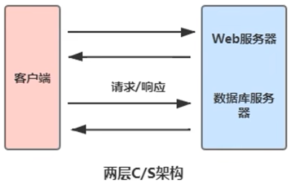
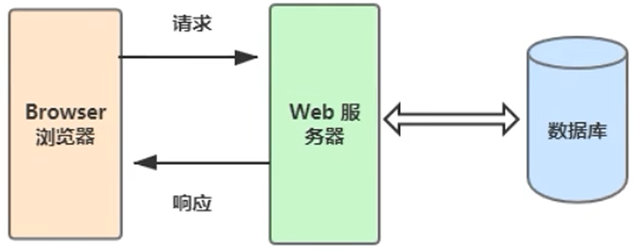
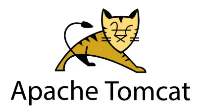
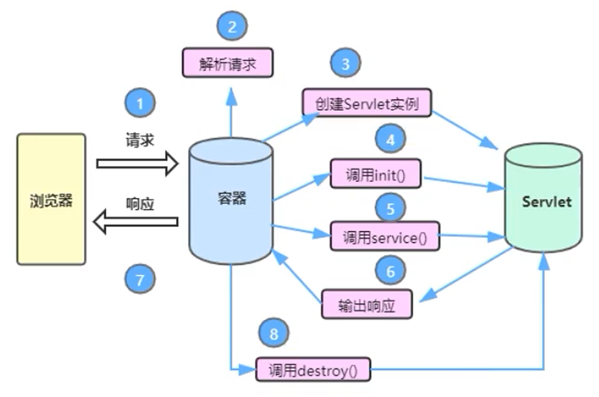
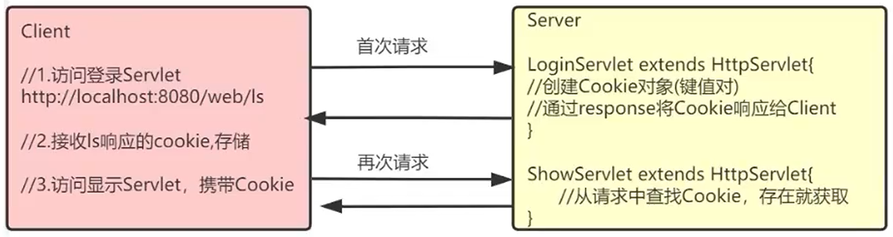
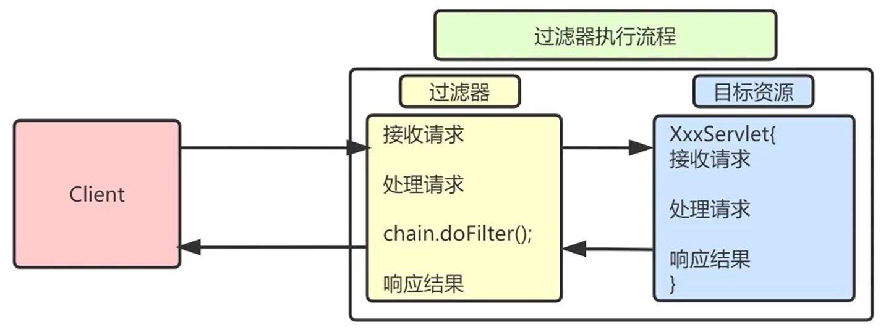
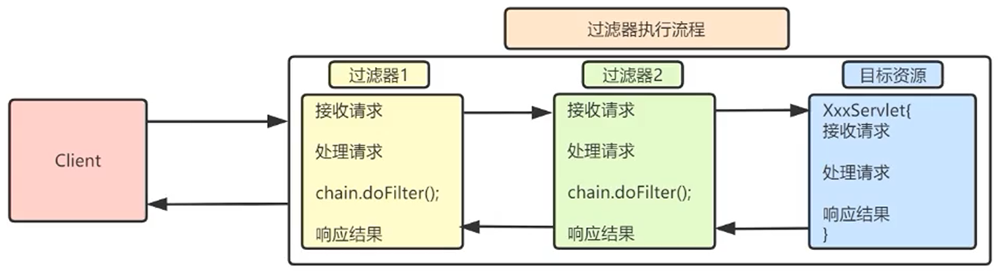

[toc]
# Servlet
## 基础知识
### C/S 架构和 B/S 架构
C/S 和 B/S 是软件发展过程中出现的两种软件架构方式。

**C/S 架构**(client/server 客户端/服务器)

特点：必须在客户端安装特定软件；
优点：图形效果显示较好(如：3D 游戏)；
缺点：服务器的软件和功能进行升级，客户端也必须升级、不利于维护；
常见的 C/S 程序：QQ、微信等。

**B/S 架构**(Browser/Server浏览器/服务器)
特点:无需安装客户端，任何浏览器都可直接访问；
优点:涉及到功能的升级，只需要升级服务器端；
缺点:图形显示效果不如 C/S 架构；
需要通过HTTP协议访问。


### 服务器
#### 基本概念
**Web**
Web(World wide web)称为万维网，简单理解就是网站，它用来表示 Internet 主机上供外界访问的资源。
Internet上供外界访问的资源分为两大类：
静志资源：指 Web 页面中供人们浏览的数据始终是不变的(HTML、CSS)。
动态资源：指 web 页面中供人们浏览的数据是由程序产生的，不同时间点，甚至不同设备访问 Web 页面看到的内容各不相同(JSP/Servlet)。

在 Java 中，动态 Web 资源开发技术我们统称为 Java Web。

**Web 服务器**
Web 服务器是运行及发布 Web 应用的容器，只有将开发的 Web 项目放置到该容器中，才能使网络中的所有用户通过浏览器进行访问。

**常见服务器**
1. 开源：Opensourse(1、开放源代码 2、免费)
- Tomcat(主流Web服务器之一，适合初学者)
- jetty(淘宝，运行效率比 Tomcat 高)
- resin(新浪，所有开源服务器软件中，运行效率最高的)
三者的用法从代码角度完全相同，只有在开启、关闭服务器软件时对应的命令稍有区别。掌握一个即掌握所有。
2. 收费
- WebLogic (Oracle)
- WebSphere (IBM)
提供相应的服务与支持，软件大，耗资源。

#### Tomcat 服务器

Tomcat 是 Apache 软件基金会(Apache software Foundation)的 Jakarta 项目中的一个核心项目，免费开源，并支持 Serlet 和 JSP 规范。
Tomcat 技术先进、性能稳定，深受 Java 爱好者喜爱并得到了部分软件开发商的认可，成为目前比较流行的 Web 应用服务器。

> 如何创建第一个页面：在 webapps 中建立文件夹(项目应用)，比如：myweb创建：
1.WEB-INF文件夹，用于存放项目的核心内容。
 创建 classes，用于存放 .class 文件；
 创建 lib，用于存放 jar 文件；
 创建web.xml，项目配置文件(到ROOT项目下的WEB-INF复制即可)。
2.myweb 文件夹中编写网页 hello.html，与 WEB-INF 在同级目录。

### HTTP 协议
**HTTP** 超文本传输协议(HTTP，HyperText Transfer Protocol)是互联网上应用最为广泛的一种网络协议,是一个基于请求与响应模式的、无状态的、应用层的协议，运行于 TCP 协议基础之上。

**HTTP 特点**
- 支持客户端(浏览器)/服务器模式。
- 简单快速：客户端只向服务器发送请求方法和路径，服务器即可响应数据，因而通信速度很快。请求方法常用的有 GET、POST 等。
- 灵活：HTTP 允许传输任意类型的数据，传输的数据类型由 Content-Type 标识。
- 无连接：无连接指的是每次TCP连接只处理一个或多个请求，服务器处理完客户的请求后，即断开连接采用这种方式可以节省传输时间。
    - HTTP1.0 版本是一个请求响应之后，直接就断开了。称为短连接。
    - HTTP1.1 版本不是响应后直接就断开了，而是等几秒钟，这几秒钟之内有新的请求，那么还是通过之前的连接通道来收发消息，如果过了这几秒钟用户没有发送新的请求，就会断开连接。称为长连接。
- 无状态：HTTP协议是无状态协议。无状态是指协议对于事务处理没有记忆能力。

**HTTP 通信流程**
1. 客户与服务器建立连接(三次握手)。
2. 客户向服务器发送请求。
3. 服务器接受请求，并根据请求返回相应的文件作为应答。
4. 客户与服务器关闭连接(四次挥手)。

**常见状态码**
| 状态代码 | 状态描述               | 说明                                                                 |
|----------|------------------------|----------------------------------------------------------------------|
| 200      | OK                     | 客户端请求成功                                                       |
| 302      | Found                  | 临时重定向                                                           |
| 403      | Forbidden              | 服务器收到了请求，但是拒绝提供服务。服务器通常会在响应正文中给出不提供服务的原因 |
| 404      | Not Found              | 请求的资源不存在，例如，输入了错误的URL。                           |
| 500      | Internal Server Error  | 服务器发生不可预期的错误，导致无法完成客户端的请求。                 |


## Servlet概念
Servlet：server Applet 的简称，是服务器端的程序(代码、功能实现)，可交互式的处理客户端发送到服务端的请求，并完成操作响应。是动态网页技术，JavaWeb 程序开发的基础，JavaEE规范(一套接口)的一个组成部分。

Servlet 的作用是接收客户端请求，完成操作；动态生成网页(页面数据可变)；将包含操作结果的动态网页响应给客户端。

## Servlet 开发步骤
1. 实现 javax.servlet.Servlet；重写 5 个主要方法；在核心的 service() 方法中编写输出语句，打印访问结果。
```java
public class MyServlet implements Servlet {
    @Override
    public void init(ServletConfig servletConfig) throws ServletException {

    }

    public void service(ServletRequest request, ServletResponse response) throws ServletException, IOException {
        System.out.println("My First Servlet!");
    }

    public void destroy(){
    }

    public ServletConfig getServletConfig() {
        return null;
    }

    public String getServletInfo() {
        return null;
    }
}
```
2. 编译 MyServlet 后将编译后的 .class 文件放在 /WEB-INF/classes/ 下。
3. 配置 Servlet 。
```xml
<?xml version="1.0" encoding="UTF-8"?>
<web-app xmlns="http://xmlns.jcp.org/xml/ns/javaee"
  xmlns:xsi="http://www.w3.org/2001/XMLSchema-instance"
  xsi:schemaLocation="http://xmlns.jcp.org/xml/ns/javaee
                      http://xmlns.jcp.org/xml/ns/javaee/web-app_4_0.xsd"
  version="4.0"
  metadata-complete="true">

    <!--1、添加servlet节点-->
    <servlet>
        <servlet-name>MyServlet</servlet-name>
        <servlet-class>MyServlet</servlet-class>
    </servlet>
    <!--2、添加servlet-mapping节点-->
    <servlet-mapping>
        <servlet-name>MyServlet</servlet-name>
        <url-pattern>/myservlet</url-pattern>
    </servlet-mapping>

</web-app>
```
> 注意：这是手动部署，方便初次学习了解过程。后续使用 IDEA 集成 Web 项目和 Tomcat 服务器实现热部署，并通过 IDEA 打包成 war 包实现最终部署。
IDEA 集成 Tomcat：1. settings —> Build, Execution, Deployment -> Application Servers -> 选择 Tomcat 解压目录；2. Edit Configurations -> + 选择 Tomcat Server -> Deployment。
IDEA 打包 war 包：Project Settings -> Artifacts -> + Web Application Archive -> for "项目名"；2. Build -> Build Artifact -> 选择 war。

## GenericServlet 和 HttpServlet 抽象类
**GenericServlet**
GenericServlet 使编写 Servlet 变得更容易。要编写一般的Servlet，只需重写抽象 service 方法即可它提供生命周期方法 init 和 destroy 的简单实现。

**HttpServlet**
HttpServlet 是继承 GenericServlet 的基础上进一步的扩展。提供将要被子类化以创建适用于 web 站点的 HTTP servlet 的抽象类。HttpServlet 的子类至少必须重写一个方法，该方法通常是以下这些方法之一
- doGet，如果 servlet 支持 HTTP GET 请求
- doPost，用于 HTTP POST 请求
- doPut，用于 HTTP PUT 请求
- doDelete，用于 HTTP DELETE 请求

## 注解配置 Servlet
Servlet 3.0后支持，使用注解配置 servlet 简化了配置繁琐的 web.xml 。

**示例语法**
```java
@WebServlet(value = {"/bs"}, loadOnStartup = 1)
public class BasicServlet extends HttpServlet {
    @Override
    protected void doGet(HttpServletRequest req, HttpServletResponse resp) throws ServletException, IOException {
        super.doGet(req, resp);
    }

    @Override
    protected void doPost(HttpServletRequest req, HttpServletResponse resp) throws ServletException, IOException {
        super.doPost(req, resp);
    }
}
```

**@Webservlet注解常用属性**
1. name：Serlvet名字(可选)。
2. value：配置 url 路径，可以配置多个。
3. urlPatterns：配置 url 路径，和value作用一样，不能同时使用。
4. loadOnstartup：配置 Servlet 的创建的时机，如果是 0 或者正数 启动程序时创建，如果是负数，则访问时创建。数字越小优先级越高。

## Request 和 Response 对象
在 Servlet 中用来处理客户端请求需要用 doGet 或 doPost 方法的 request 对象。

**Request**
| 方法名            | 说明                |
|------------------|---------------------|
| String getParameter(String name)         | 根据表单组件名称获取提交数据   |
| void setCharacterEncoding(String charset)| 指定每个请求的编码   |

示例网页 register.html ：
```html
<!DOCTYPE html>
<html lang="en">
<head>
    <meta charset="UTF-8">
    <title>Register</title>
</head>
<body>

<form action="/LearnServlet/rs" method="get">
    用户名: <input type="text" name="username"/> <br/>
    密码:  <input type="password" name="password"/> <br/>
    <input type="submit" value="注册"/>
</form>

</body>
</html>
```
对应 Servlet ：
```java
@WebServlet(value = "/rs")
public class RegisterServlet extends HttpServlet {
    @Override
    protected void doGet(HttpServletRequest req, HttpServletResponse resp) throws ServletException, IOException {
        System.out.println("username = " + req.getParameter("username")
                + '\t' + "password = " + req.getParameter("password"));
    }

    @Override
    protected void doPost(HttpServletRequest req, HttpServletResponse resp) throws ServletException, IOException {
        req.setCharacterEncoding("UTF-8");
        System.out.println("username = " + req.getParameter("username")
                + '\t' + "password = " + req.getParameter("password"));
    }
}
```

**Response**
response对象用于响应客户请求并向客户端输出信息。
| 方法名称                     | 作用                                   |
|------------------------------|----------------------------------------|
| setHeader(name, value)     | 设置响应信息头                         |
| setContentType(String)      | 设置响应文件类型、响应式的编码格式     |
| setCharacterEncoding(String)| 设置服务端响应内容编码格式             |
| getWriter()                | 获取字符输出流                         |

案例：使用 response 对象向浏览器输出 HTML 内容，实现用户登录后，输出：用户名 Login Success 。
```java
req.setCharacterEncoding("UTF-8");
resp.setContentType("text/html; charset=UTF-8");
String username = req.getParameter("username");
String password = req.getParameter("password");

//获取输出流
PrintWriter out = resp.getWriter();
out.println("<html>");
out.println("<head><title>login</title></head>");
out.println("<body>");
out.println("<h1>" + username + "Register Success!!!</h1>");
```

## JDBC
这里给出典型的 Java Web + maven 项目目录，因为 IDEA 一次生成不彻底，导致在这里错误了半天。
```text
项目根目录/
│
├── src/
│   ├── main/               # 主代码和资源
│   │   ├── java/           # Java 源代码（Servlet、Service、DAO 等）
│   │   │   └── com/
│   │   │       ├── entity/      # 实体类
│   │   │       ├── service/     # 业务逻辑
│   │   │       ├── servlet/     # 跳转逻辑
│   │   │       ├── dao/         # 数据访问层
│   │   │       └── utils/       # 工具类
│   │   │
│   │   ├── resources/      # 配置文件（非 Web 资源）
│   │   │   ├── database.properties     # 数据库 配置
│   │   │   └── mapper/     # MyBatis SQL 映射文件（如 UserMapper.xml）
│   │   │
│   │   └── webapp/         # Web 资源（必须，符合 Servlet 规范）
│   │       ├── WEB-INF/
│   │       │   └── web.xml              # Servlet 部署描述符
│   │       └── index.jsp                # 首页
│   │
│   └── test/               # 测试代码和资源
│       ├── java/           # 测试代码（JUnit）
│       └── resources/      # 测试配置
│
├── target/                 # 构建输出目录（自动生成）
│   ├── classes/            # 编译后的字节码
│   ├── generated-sources/  # 生成的代码（如 Lombok）
│   └── 项目名.war          # 打包后的 WAR 文件
│
├── pom.xml                 # Maven 项目核心配置文件
└── README.md               # 项目说明
```
## 转发和重定向
在之前案例中，调用业务逻辑和显示结果页面都在同一个 Servlet 里，就会产生设计问题不符合单一职能原则、各司其职的思想。不利于后续的维护，应该将业务逻辑和显示结果分离开。

### 请求转发
转发的作用在服务器端，将请求发送给服务器上的其他资源，以共同完成一次请求的处理。
```java
req.getRequestDispatcher("/url").forward(req, resp);
```

**数据传递**
forward 表示一次请求，是在服务器内部跳转，可以共享同一次 request 作用域中的数据。

request作用域：拥有存储数据的空间，作用范围是一次请求有效(一次请求可以经过多次转发)。可以将数据存入request后，在一次请求过程中的任何位置进行获取可传递任何数据(基本数据类型、对象、数组、集合等)。
```java
// 存数据：以键值对形式存储在 request 作用域中
// key 为 String 类型，value 为 Object 类型。
request.setAttribute(key, value);
```
```java
// 取数据：通过 string 类型的 key 访问 Object 类型的 value
request.getAttribute(key);
```

**请求转发特点**
1. 转发是服务器行为。
2. 转发是浏览器只做了一次访问请求。
3. 转发浏览器地址不变。
4. 转发两次跳转之间传输的信息不会丢失，所以可以通过 request 进行数据的传递。
5. 转发只能将请求转发给同一个 web 应用中的组件。

### 响应重定向
重定向作用在客户端，客户端将请求发送给服务器后，服务器响应给客户端一个新的请求地址，客户端重新发送新请求。

重定向是**客户端行为**。
```java
resp.sendRedirect("/url");
```

**数据传递**
sendRedirect 跳转时，地址栏改变，代表客户端重新发送的请求。属于两次请求：

response 没有作用域，两次 request 请求中的数据无法共享
传递数据：通过URI的拼接进行数据传递
```java
// 传递数据
resp.sendRedirect("/url?username=tom"");
```
```java
// 获取数据
request.getParameter("username");
```

**重定向特点**
1. 重定向是客户端行为。
2. 重定向是浏览器做了至少两次的访问请求。
3. 重定向浏览器地址改变。
4. 重定向两次跳转之间传输的信息会丢失(request范围)。
5. 重定向可以指向任何的资源，包括当前应用程序中的其他资源、同一个站点上的其他应用程序中的资源、其他站点的资源。

## Servlet 生命周期
Servlet 生命周期分为四个阶段：实例化、初始化、服务和销毁。


**实例化**
当用户第一次访问Servlet时，由容器调用 Servlet 的构造器创建具体的 Servlet 对象。也可以在容器启动之后立刻创建实例。使用如下代码可以设置 Servlet 是否在服务器启动时就创建。
```xml
<!-- 负数或不写则调用时实例化，否则启动时实例化，此时数字越小优先级越高 -->
<load-on-startup>1</load-on-startup>
```
> 注意：实例化只执行一次。

**初始化**
在初始化阶段，init()方法会被调用。这个方法在 javax.servlet.Servlet 接口中定义。其中，方法以一个 ServletConfig 类型的对象作为参数。
> 注意：init方法只被执行一次。

**服务**
式传给service方法
当客户端有一个请求时，容器就会将请求ServletRequest与响应ServletResponse对象转给Servlet，以参数的形
> 注意：此方法会执行多次。

**销毁**
当 servlet 容器停止或者重新启动都会引起销毁 Servlet 对象并调用 destroy 方法。
> 注意：destroy方法执行一次。

## 状态管理
HTTP协议是无状态的，不能保存每次提交的信息如果用户发来一个新的请求，服务器无法知道它是否与上次的请求有联系。对于那些需要多次提交数据才能完成的Web操作，比如登录来说，就成问题了。

**状态管理**将浏览器与 web 服务器之间多次交互当作一个整体来处理，并且将多次交互所涉及的数据(即状态)保存下来。

### 状态管理分类
客户端状态管理技术:将状态保存在客户端。代表性的是 **Cookie** 技术。

服务器状态管理技术:将状态保存在服务器端。代表性的是 **session** 技术(服务器传递 sessionID 时需要使用 Cookie 的方式)和 **application**。

### Cookie
Cookie是在浏览器访问Web服务器的某个资源时，由 Web 服务器在 HTTP 响应消息头中附带传送给浏览器的一小段数据。

一旦 web 浏览器保存了某个 Cookie，那么它在以后每次访问该 web 服务器时，都应在 HTTP 请求头中将这个 Cookie 回传给 Web 服务器。一个 Cookie 主要由标识该信息的名称(name)和值(value)组成。


**Cookie 使用**
ServletA：
```java
Cookie cookie = new Cookie("zhangsan", "123456");
resp.addCookie(cookie);
resp.sendRedirect(req.getContextPath() + "/b");
```
ServletB：
```java
Cookie[] cookies = req.getCookies();
if (cookies != null) {
    for (Cookie cookie : cookies) {
        System.out.println(cookie.getName() + ": " + cookie.getValue());
    }
}
```

> Cookie 默认不支持中文，只能包含 ASCII 字符，所以 cookie 需要对 Unicode 字符进行编码，否则会出现乱码。
    编码可以使用 java.net.URLEncoder 类的 encode(String str, String charset) 方法;
    解码使用 java.net.URLDecoder 类的 decode(String str, String charset) 方法。

**优缺点**
- 优点:
    1. 可配置到期规则；
    2. 简单性：Cookie 是一种基于文本的轻量结构，包含简单的键值对。
    3. 数据持久性：Cookie 默认在过期之前是可以一直存在客户端浏览器上的。
- 缺点:
    1. 大小受到限制：大多数浏览器对 cookie 的大小有 4K、8K 字节的限制。
    2. 用户配置为禁用：有些用户禁用了浏览器或客户端设备接收 Cookie 的能力，因此限制了这一功能。
    3. 潜在的安全风险: cookie 可能会被篡改。会对安全性造成潜在风险或者导致依赖于cookie 的应用程序失败。

### Session
Session 用于记录用户的状态。Session 指的是在一段时间内，单个客户端与 Web 服务器的一连串相关的交互过程。
在一个 Session 中，客户可能会多次请求访问同一个资源，也有可能请求访问各种不同的服务器资源。

**原理**
服务器会为每一次会话分配Session对象。同一个浏览器发起的多次请求，同属于一次会话(Session)。
首次使用到 Session 时，服务器会自动创建 Session，并创建 Cookie 存储 SessionId 发送回客户端。
> 若用户彻底禁用 Cookie 可以使用 `String newUrl = resp.encodeRedirectURL("url");` 。

Session 作用域拥有存储数据的空间，作用范围是一次会话有效。
1. 一次会话是使用同一浏览器发送的多次请求。一旦浏览器关闭，则结束会话。
2. 可以将数据存入 Session 中，在一次会话的任意位置进行获取。
3. 可传递任何数据(基本数据类型、对象、集合、数组)。

**Session 使用**
```java
// 获取Session
HttpSession session = request.getSession();
// 存储数据到Session中
void setAttribute(String name, Object o); 
// 根据key获取value
Object getAttribute(String name); 
// 根据key删除value
void removeAttribute(String name); 
// 销毁session对象
session.invalidate(); 
```
> Request 和 Session 作用域区别：
Request是一次请求有效，请求改变，则request改变。
Session是一次会话有效，浏览器改变，则session改变。

### ServletContext
ServletContext 是全局对象，也拥有作用域，对应一个 Tomcat 中的 Web 应用。当 Web 服务器启动时，会为每一个 Web 应用程序创建一块共享的存储区域(Servletcontext)。Servletcontext 在 Web 服务器启动时创建，服务器关闭时销毁。

**ServletContext 使用**
```java
// 存储数据
servletContext.setAttribute(String name, Object o);
// 获取数据
servletContext.getAttribute(String name);
// 移除数据
servletContext.removeAttribute(String name);
```

**ServletContext 特点**
唯一性：一个应用对应一个Servletcontext。
生命周期：只要容器不关闭或者应用不卸载，Servletcontext就一直存在。

### 作用域总结
HttpServletRequest：一次请求，请求响应之前有效。
HttpSession：一次会话开始，浏览器不关闭或不超时之前有效。
Servletcontext：服务器启动开始，服务器停止之前有效。

## 过滤器

过滤器(Filter)是处于客户端与服务器目标资源之间的一道过滤技术。

执行地位在 Servlet 之前，客户端发送请求时，会先经过 Filter，再到达目标 Servlet 中。响应时，会根据执行流程再次反向执行。 Filter 可以解决多个 Servlet 共性代码的冗余问题(例如:乱码处理、登录验证)。

### Filter 编写
Servlet API 中提供了一个 Filter 接口，开发人员编写一个 Java 类实现了这个接口即可，这个 Java 类称之为过滤器(Filter)。

实现步骤分为三步：
1. 编写 Java 类实现 Filter 接口。
2. 在 doFilter 方法中编写拦截逻辑。
3. 设置拦截路径。

配置过滤器时可以选择用**注解**或者 **xml** 。

**拦截路径配置**
过滤器的拦截路径通常有三种形式:
精确拦截匹配 ，比如：/index.jsp，/myservlet1。
后缀拦截匹配，比如：* .jsp、* .htm1、* .jpg。
通配符拦截匹配 / *，表示拦截所有。

**过滤器链和优先级**

客户端对服务器请求之后，服务器调用 Serviet 之前会执行一组过滤器，这组过滤器就称为一条过滤器链。
每个过滤器实现某个特定的功能，当第一个 Filter 的 doFilter 方法被调用时，Web 服务器会创建一个代表 Filter 链的 Filterchain 对象传递给该方法。在 doFilter 方法中，开发人员如果调用了 Filterchain 对象的 doFilter 方法，则 Web 服务器会检查 Filterchain 对象中是否还有 filter，如果有，则调用第 2 个 filter，如果没有，则调用目标资源。

> 注意：
配置 filter 时，如果为注解的话，是按照类全名称的字符串顺序决定作用顺序。
如果 web.xml，按照 filter-mapping 注册顺序，从上往下。
web.xml配置高于注解方式。
如果注解和 web.xml 同时配置，会创建多个过滤器对象，造成过滤多次。
