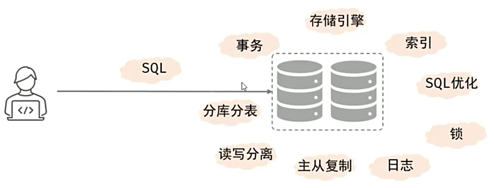

[toc]

# MYSQL
## 基本概念
**学习重点**


**MYSQL 数据模型**
关系型数据库(RDBMS)概念：建立在关系模型基础上，由多张相互连接的二维表组成的数据库。特点：使用表存储数据，格式统一，便于维护；使用SQL语言操作，标准统一，使用方便。

## SQL 语法分类
|分类|全称|说明|
|---|---|---|
| DDL | Data Definition Language | 数据定义语言，用来定义数据库对象(数据库，表，字段) |
| DML | Data Manipulation Language | 数据操作语言，用来对数据库表中的数据进行增删改 |
| DQL | Data Query Language | 数据查询语言，用来查询数据库中表的记录 |
| DCL | Data Control Language | 数据控制语言，用来创建数据库用户、控制数据库的访问权限 |

### DDL
#### 操作数据库
**查询**
查询所有数据库
```sql
SHOW DATABASES;
```

查询当前数据库
```sql
SELECT DATABASE();
```
**创建**
```sql
CREATE DATABASE [IF NOTEXISTS] 数据库名 [DEFAULT CHARSET字符集] [COLLATE 排序规则];
```
**删除**
```sql
DROP DATABASE[IF EXISTS] 数据库名;
```

**使用**
```sql
USE 数据库名;
```
#### 操作表
**查询**
查询当前数据库所有表
```sql
SHOW TABLES;
```
查询表结构
```sql
DESC 表名;
```
查询指定表的建表语句
```sql
SHOW CREATE TABLE 表名;
```
**创建表**
创建表
```sql
CREATE TABLE 表名(
    字段1 字段1类型 [COMMENT 字段 1 注释],
    字段2 字段2类型 [COMMENT 字段 2 注释],
    字段3 字段3类型 [COMMENT 字段 3 注释],
    ......
    字段n 字段n类型 [COMMENT 字段 n 注释]
)[COMMENT 表注释];
```
**修改表**
添加字段
```sql
ALTER TABLE 表名 ADD 字段名 类型(长度) [COMMENT 注释] [约束];
```
修改数据类型
```sql
ALTER TABLE 表名 MODIFY 字段名 新数据类型(长度);
```
修改字段名和字段类型
```sql
ALTER TABLE 表名 CHANGE 旧字段名 新字段名 类型(长度) [COMMENT 注释] [约束];
```
删除字段
```sql
ALTER TABLE 表名 DROP 字段名;
```
修改表名
```sql
ALTER TABLE 表名 RENAME TO 新表名;
```
**删除表**
删除表
```sql
DROP TABLE [IF EXISTS] 表名;
```
删除指定表，并重新创建该表
```sql
TRUNCATE TABLE 表名;
```
### DML
DML 英文全称是 Data Manipulation Language（数据操作语言），用来对数据库中表的数据记录进行增删改操作。
#### 添加数据（INSERT）
1. 给指定字段添加数据
```sql
INSERT INTO 表名 (字段名1, 字段名2, ...) VALUES (值1, 值2, ...);
```
2. 给全部字段添加数据
```sql
INSERT INTO 表名 VALUES (值1, 值2, ...);
```
3. 批量添加数据
```sql
INSERT INTO 表名 (字段名1, 字段名2, ...) VALUES (值1, 值2, ...), (值1, 值2, ...),(值1, 值2, ...);
INSERT INTO 表名 VALUES (值1, 值2, ...), (值1, 值2, ...), (值1, 值2, ...);
```
#### 修改数据（UPDATE）
修改数据
```sql
UPDATE 表名 SET 字段名1=值1, 字段名2=值2, ... [WHERE 条件];
```
#### 删除数据（DEETE）
删除数据
```sql
DELETE FROM 表名 [WHERE 条件];
```
### DQL
DQL 英文全称是 Data Query Language（数据查询语言），数据查询语言，用来查询数据库中表的记录。
DQL 语法：
```sql
SELECT
字段列表
FROM
表名列表
WHERE
条件列表
GROUP BY
分组字段列表
HAVING
分组后条件列表
ORDER BY
排序字段列表
LIMIT
分页参数
```
#### 基本查询
1. 查询多个字段
```sql
SELECT 字段1, 字段2, 字段3, ... FROM 表名;
SELECT * FROM 表名;
```
2. 设置别名
```sql
SELECT 字段1[AS 别名1], 字段2[AS 别名2], ... FROM 表名;
```
3. 去除重复记录
```sql
SELECT DISTINCT 字段列表 FROM 表名;
```
#### 条件查询(WHERE)
语法
```sql
SELECT 字段列表 FROM 表名 WHERE 条件列表
```
运算符：
| 比较运算符 | 功能 |
| - | - |
| BETWEEN ... AND ... | 在某个范围之内（包含边界）|
| IN(...) | 在 in 之后的列表中的值 |
| LIKE 占位符 | 模糊匹配（ _ 匹配单个字符，% 匹配任意个字符）|
| IS NULL | 是 NULL |
#### 聚合函数(count、max、min、avg、sum)
聚合函数将一列数据作为一个整体，进行纵向计算。
> 注意：所有的 null 值不参与聚合运算。

#### 分组查询(GROUP BY)
语法
```sql
SELECT 字段列表 FROM 表名[WHERE 条件] GROUP BY 分组字段名 [HAVING 分组后过滤条件];
```
> 注意：
执行顺序: where > 聚合函数 > having；
分组之后，查询的字段一般为聚合函数和分组字段，查询其他字段无任何意义

#### 排序查询(ORDER BY)
#### 分页查询(LIMIT)