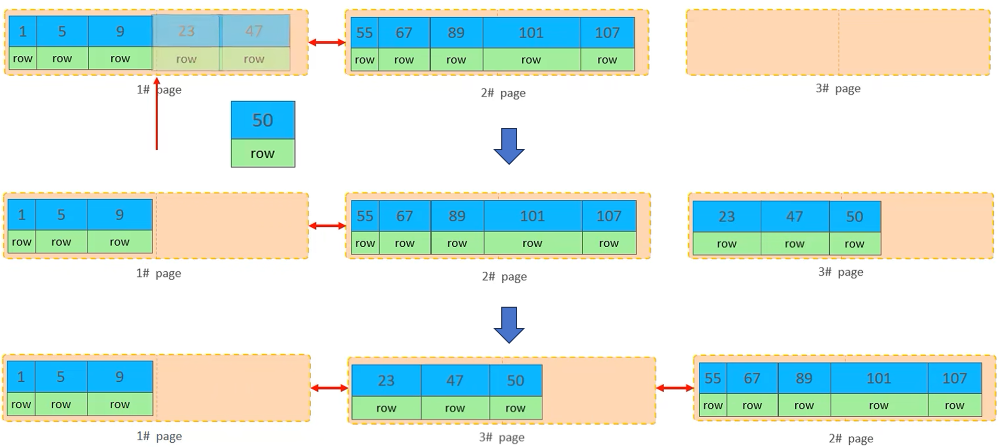

[toc]
# MYSQL 进阶

## 存储引擎
### MySQL 体系结构
**体系结构图**


**连接层**
最上层是一些**客户端和链接服务**，主要完成一些类似于连接处理、授权认证、及相关的安全方案。服务器也会为安全接入的每个客户端验证它所具有的操作权限。

**服务层**
第二层架构主要完成**大多数的核心服务功能**，如 SQL 接口，并完成缓存的查询，SQL 的分析和优化，部分内置函数的执行。所有跨存储引擎的功能也在这一层实现，如过程、函数等。

**引擎层**
存储引擎真正的负责了 MySQL 中**数据的存储和提取**，服务器通过 API 和存储引擎进行通信。不同的存储引擎具有不同的功能，这样我们可以根据自己的需要，来选取合适的存储引擎。

**存储层**
主要是将数据存储在文件系统之上，并完成与存储引擎的交互。

### 存储引擎简介
存储引擎就是**存储数据**、**建立索引**、**更新/查询数据**等技术的实现方式。存储引擎是基于**表**的，而不是基于库的，所以存储引擎也可被称为**表类型**。

> 注意：同一数据库的不同表可以有不同的存储引擎。

1. 在创建表时，指定存储引擎
```sql
CREATE TABLE 表名(
    字段1 字段1类型 [COMMENT 字段1注释],
    ... ,
    字段n 字段n类型 [COMMENT 字段n注释]
) ENGINE = INNODB [COMMENT 表注释];
```
2. 查看当前数据库支持的存储引擎
```sql
SHOW ENGINES;
```

### 存储引擎特点
不同存储引擎的异同：


#### InnoDB 介绍
**介绍**
InnoDB 是一种兼顾高可靠性和高性能的通用存储引擎，在 MySQL 5.5 之后，InnoDB 是默认的 MySQL 存储引擎。

**特点**
DML 操作遵循 ACID 模型，支持**事务**;
支持**外键** FOREIGN KEY 约束，保证数据的完整性和正确性；
**行级锁**，提高并发访问性能。

**文件**
xxx.ibd：xxx代表的是表名，innoDB引擎的每张表都会对应这样一个表空间文件，存储该表的表结构（frm、sdi）数据和索引。

> 注意：
    参数：innodb_file_per_table 打开表示每张表都有单独的 ibd 文件。
    .ibd 文件属于表空间文件。

**Innodb 逻辑存储结构**


#### MyISAM 介绍
**介绍**
MyISAM 是 MySQL 早期的默认存储引擎。

**特点**
不支持事务，不支持外键。
支持表锁，不支持行锁。
访问速度快。

**文件**
xxx.sdi：存储表结构信息。
xxx.MYD：存储数据。
xxx.MYI：存储索引。

#### Memory 介绍
**介绍**
Memory 引擎的表数据时存储在内存中的，由于受到硬件问题、或断电问题的影响，只能将这些表作为临时表或缓存使用。

**特点**
内存存放
hash索引（默认）

**文件**
xxx.sdi:存储表结构信息

## 索引

### 索引概述
**介绍**
索引（index）是帮助 MSQL **高效获取数据**的**数据结构**（有序）。在数据之外，数据库系统还维护着满足特定查找算法的数据结构，这些数据结构以某种方式引用（指向）数据，这样就可以在这些数据结构上实现高级查找算法，这种数据结构就是索引。

**优缺点**
| 优点 | 缺点 |
| --- | --- |
| 提高数据检索的效率，降低数据库的 IO 成本。 | 索引列也是要占用空间的。 |
| 通过索引列对数据进行排序，降低数据排序的成本，降低 CPU 的消耗。 | 索引大大提高了查询效率，同时却也降低更新表的速度，如对表进行 INSERT、UPDATE、DELETE 时，效率降低。 |

### 索引结构
#### 不同索引结构
MySQL 的索引是在存储引擎层实现的，不同的存储引警有不同的结构，主要包含以下几种:
| 索引结构 | 描述 |
| --- | --- |
| B+ Tree 索引 | 最常见的索引类型，大部分引擎都支持 B+ 树索引 |
| Hash 索引 |  底层数据结构是用哈希表实现的，只有精确匹配索引列的查询才有效, 不支持范围查询 |
| R-tree (空间索引)  | 空间索引是 MyISAM 引擎的一个特殊索引类型，主要用于地理空间数据类型，通常使用较少 |
| Full-text (全文索引)  | 是一种通过建立倒排索引，快速匹配文档的方式。类似于 Lucene, Solr, ES |


#### B Tree 和 B+ Tree
**B Tree**
B Tree 多路平衡查找树，一颗最大度数（max-degree）为 5（5阶，指针数等于度数）的 B-tree 为例（每个节点最多存储4个 key，5个指针）:


> 具体动态变化的过程可以参考网站: https://www.cs.usfca.edu/~galles/visualization/BTree.html

**B+ Tree**
B+ Tree 是 B Tree 的变种，以一颗最大度数（max-degree）为4（4阶）的 B+ tree 为例:


B+ Tree 的特点：1. 非叶子节点有的索引值，叶子节点也有；2. 只有叶子节点储存真正的数据； 3. 叶子节点还连接起来，形成了一个单链表。

MySQL 索引数据结构对经典的 B+ Tree 进行了优化。在原 B+ Tree 的基础上，增加一个指向相邻叶子节点的链表指针，就形成了**双向循环链表**叶子节点的 B+ Tree，提高区间访问的性能。


> 注意：虽然 MySQL 的 Innodb 引擎没有 Hash 索引结构，但是 MySQL 的 Innodb 引擎在生成索引的时候会使用自适应 Hash 算法。

> 为什么InnoDB存储引擎选择使用B+tree索引结构?
相对于二叉树，层级更少，搜索效率高；
相对于 B Tree，无论是叶子节点还是非叶子节点，都会保存数据，这样导致一页中存储的键值减少，指针跟着减少，要同样保存大量数据，只能增加树的高度，导致性能降低;
相对Hash索引，B+ Tree 支持范围匹配及排序操作。

### 索引分类
索引分类


在InnoDB存储引擎中，根据索引的存储形式，又可以分为以下两种:

聚集索引选取规则:
如果存在主键，主键索引就是聚集索引。
如果不存在主键，将使用第一个唯一（UNIQUE）索引作为聚集索引。
如果表没有主键，或没有合适的唯一索引，则 InnoDB 会自动生成一个 rowid 作为隐藏的聚集索引。


二级索引和聚集索引配合查询，称为回表查询，即先根据二级索引拿到主键值，再根据主键值走聚集索引拿到这一行的数据。
### 索引语法

1. 创建索引
```sql
CREATE [UNIQUE | FULLTEXT] INDEX index_name ON table_name(index_col_name, ...);
```
> 单列索引：索引只关联一个字段。
  联合索引（组合索引）：索引关联多个字段。

2. 查看索引
```sql
SHOW INDEX FROM table_name ;
```

3. 删除索引
```sql
DROP INDEX index_name ON table_name ;
```
### SQL 性能分析
#### SQL 执行频率
MySQL客户端连接成功后，通过 `show [session | global] status` 命令可以提供服务器状态信息。通过如下指令，可以查看当前数据库的INSERT、UPDATE、DELETE、SELECT的访问频次。
```sql
SHOW GLOBAL STATUS LIKE 'Com_______';
```
#### 慢查询日志
慢查询日志记录了所有执行时间超过指定参数（long_query_time，单位：秒，默认10秒）的所有 SQL 语句的日志。
```sql
show variables like 'slow_query_log';
```
MySQL 的慢查询日志默认没有开启，需要在 MySQL 的配置文件（/etc/my.cnf）中配置如下信息:
```sh
# 开启 MySQL 慢日志查询开关
slow_query log=1
# 设置慢日志的时间为 2 秒，SQL 语句执行时间超过 2 秒就会视为慢查询，记录慢查询日志
long query time=2
```
配置完毕之后，重新启动 MySQL 服务器进行测试，查看慢日志文件中记录的信息 /var/lib/mysql/localhost-slow.log 。

#### profile 详情
show profiles 能够在做 SQL 优化时帮助我们了解时间都耗费到哪里去了。通过 have_profiling 参数，能够看到当前 MySQL 是否支持 profile 操作:
```sql
-- 查看系统是否支持 profile 详情
SELECT @@have profiling;
-- 若支持，查看是否开启
SELECT  @@profiling;
```
默认 profiling 是关闭的，可以通过 set 语句在 session/global 级别开启 profiling：
```sql
SET profiling=1,
```

执行一系列的业务 SQL 的操作，然后通过如下指令查看指令的执行耗时：
```sql
-- 查看每一条 SQL 的耗时基本情况
show profiles;
-- 查看指定 query id 的 SQL 语句各个阶段的耗时情况
show profile for query query_id;
-- 查看指定 query id 的 SQL 语句 CPU 的使用情况
show profile cpu for query query_id;
```

#### explain 执行计划
EXPLAIN 或者 DESC 命令获取 MySQL 如何执行 SELECT 语句的信息，
包括在 SELECT 语句执行过程中表如何连接和连接的顺序。语法:
```sql
-- 直接在select语句之前加上关键字 explain/desc
EXPLAIN SELECT 字段列表 FROM 表名 WHERE 条件;
```

查询结果集中包含：id、select_type、type、possible_key 等。
其中：
- id：id 值越大执行优先级越高，id 值相同执行顺序自上而下依次执行。
- select_type：表示 SELECT 的类型，常见的取值有 SIMPLE（简单表，即不使用表连接或者子查询）、PRIMARY（主查询，即外层的查询），UNION（UNION 中的第二个或者后面的查询语句）、SUBOUERY（ SELECT/WHERE 之后包含了子查询）等。
- **type**：表示连接类型，性能由好到差的连接类型为 NULL、system、const、eq_ref、ref、range、index、all 。一般不查询任何表时 type 为 NULL、查询系统表为 system、查询主键\唯一索引为const、查询一般索引为 ref。
- **possible_key**：显示可能应用在这张表上的索引，一个或多个。
- **Key**：实际使用的索引，如果为NULL，则没有使用索引。
- **Key_len**：表示索引中使用的字节数，该值为索引字段最大可能长度，并非实际使用长度，在不损失精确性的前提下，长度越短越好。
- rows：MySQL 认为必须要执行查询的行数，在innodb引擎的中，是一个估计值，可能并不总是准确的。
- filtered：的值越大越好。表示返回结果的行数占需读取行数的百分比。
- **Extra**：除此之外的其它信息。

### 索引失效
#### 最左前缀法则
如果索引了多列（联合索引），要遵守最左前缀法则。最左前缀法则指的是：按照构造索引的顺序，自左至右查询语句缺失字段，则该字段及之后的索引全部失效。
如果跳跃某一列，索引将部分失效（后面的字段索引失效）。

> 注意顺序无关：以索引 index_profession_age_status 为例，只要条件语句包含自左至右的字段即可。并非死板的严格要求字段自左至右排列。如下的索引并不失效：
`select * from farm_user where age = '23' and profession = '软件工程' and status = '1';`

#### 范围查询
联合索引中，出现范围查询（>，<），范围查询右侧（建立索引的右侧）的列索引失效。
```sql
-- 索引失效
explain select * from tb_user where profession = '软件工程' and age > 30 and status = '0';
-- 索引有效
explain select * from tb_user where profession = '软件工程' and age >= 30 and status = '0';
```
可以在业务允许的情况下，使用（>=, <=）来优化 SQL 语句。

#### 其它失效情况
1. 不要在索引列上运算，否则索引失效。
```sql
-- 索引失效
SELECT * FROM table WHERE column + 10 = 100;

-- 索引有效 恒等变换
SELECT * FROM table WHERE column = 100 - 10;
```

2. 字符串类型不加单引号，隐式类型转换导致索引失效。
```sql
-- 索引失效
explain select * from farm_user where phone = 17799990012;
-- 联合索引，字符串未使用单引号，也会索引失效
-- status = '0'
explain select * from tb_user where profession = '软件工程' and age >= 30 and status = 0;
```

3. 尾部模糊匹配索引不会失效，头部模糊匹配索引失效。
```sql
-- 索引有效
explain select * from farm_user where profession like '软件%';
-- 索引失效
explain select * from farm_user where profession like '%工程';
```

4. or 连接的条件
如果 or 一侧条件中的列有索引，而另一侧的列中没有索引，那么涉及的索引都不会被用到。
```sql
-- 索引失效
explain select * from tb_user where id = 10 or age = 23;
-- 索引失效
explain select* from tb_user where phone='17799990017' or age = 23;
```
其中 age 没有索引，所以即使 id（主键索引）、phone（唯一索引） 有索引，索引也会失效。所以需要针对于 age 也要建立索引。

5. 如果MySQL评估使用索引比全表更慢，则不使用索引。
```sql
-- 全表扫描
select * from tb_user where phone >='17799990005';
-- 全表扫描
select * from tb_user where phone >='17799990015';
```

### 索引使用
#### SQL 提示
SQL提示，是优化数据库的一个重要手段，简单来说，是在 SQL 语句中加入一些人为的提示来达到优化操作的目的。
```sql
-- use index 建议使用指定索引
explain select * from tb_user use index(idx_user_pro) where profession='软件工程';
-- ignore index 忽略指定索引
explain select * from tb_user ignore index(idx_user_pro) where profession='软件工程';
-- force index 强制使用指定索引
explain select * from tb_user force index(idx_user_pro) where profession='软件工程';
```

#### 覆盖索引
尽量使用覆盖索引（查询使用了索引，并且需要返回的列，在该索引中已经全部能够找到），减少 `select * ` 的使用。
原理：在一次索引中能找到所有列，避免了使用**回表查询**。
```sql
-- 覆盖查询，所有数据在二级索引上都能找到。只需要一次遍历。
explain select id, profession, age, status, name from tb_user where profession='软件工程' and age=31 and status='0';
-- 回表查询，必须要回表查询找到 name 字段列。
explain select id, profession, age, status, name from tb_user where profession='软件工程' and age=31 and status='0';
```

#### 前缀索引
当字段类型为字符串（varchar，text 等）时，有时候需要索引很长的字符串，这会让索引变得很大，查询时，浪费大量的磁盘 IO，影响查询效率。此时可以只将字符串的一部分前缀，建立索引，这样可以大大节约索引空间，从而提高索引效率，

语法：
```sql
create index idx_xxx on table_name(column(n));
```

前缀长度：
可以根据索引的选择性来决定，而选择性是指不重复的索引值（基数）和数据表的记录总数的比值，索引选择性越高则查询效率越高。唯一索引的选择性是1，这是最好的索引选择性，性能也是最好的。
```sql
select count(distinct substring(email, 1, 5)) / count(*) from tb_user;
```
执行流程特点：
1. 前缀索引仅仅包含部分数据，一定要回表查询；
2. 由于仅取前缀作为索引有可能重复，回表比较后也不一定为要查找的值。可能需要沿着二级索引链表多次比较，多次回表。


### 索引设计原则
1. 针对于数据量较大，且查询比较频繁的表建立索引。
2. 针对于常作为查询条件（where）、排序（order by）、分组（group by）操作的字段建立索引。
3. 尽量选择区分度高的列作为索引，尽量建立唯一索引，区分度越高，使用索引的效率越高。
4. 如果是字符串类型的字段，字段的长度较长，可以针对于字段的特点，建立前缀索引。
5. 尽量使用联合索引，减少单列索引，查询时，联合索引很多时候可以覆盖索引，避免回表，提高查询效率。
6. 要控制索引的数量，索引并不是多多益善，索引越多维护索引结构的代价也就越大，会影响增删改的效率。
7. 如果索引列不能存储 NULL 值，请在创建表时使用 NOT NULL 约束它。当优化器知道每列是否包含 NULL 值时，它可以更好地确定哪个索引最有效地用于查询。

## SQL 优化
### 插入数据

如果一次性需要插入大批量数据，使用 insert 语句插入性能较低，此时可以使用 MySQL 数据库提供的 load 指令进行插入。操作如下:
```sh
# 客户端连接服务端时，加上参数 --local-infile
mysql --local-infile -u root -p
```
```sql
-- 查看全局参数 local_infile
select @@local_infile;
-- 设置全局参数 local_infile 为 1, 开启从本地加载文件导入数据的开关
set global local_infile=1;
-- 执行load指令将准备好的数据，加载到表结构中
load data local infile '/root/sql1.log' into table 'tb_user' fields terminated by ',' lines terminated by '\n';
```

### 主键优化
#### InnoDB B+ 树节点组织
1. 数据组织方式
在 InnoDB 存储引擎中，表数据都是根据主键顺序组织存放的，这种存储方式的表称为索引组织表（Index Organized Table, IOT）。

2. 页分裂
页可以为空，也可以填充一半，也可以填充 100%。每个页包含了 2-N 行数据（如果一行数据多大，会行溢出），根据主键排列。


3. 页合并
当删除一行记录时，实际上记录并没有被物理删除，只是记录被标记（flaged）为删除并且它的空间变得允许被其他记录声明使用。
当页中删除的记录达到 MERGE_THRESHOLD（默认为页的 50%），InnoDB 会开始寻找最靠近的页（前或后）看看是否可以将两个页合并以优化空间使用。


> MERGE_THRESHOLD：合并页的阈值，可以自己设置，在创建表或者创建索引时指定。

#### 主键设计原则
1. 满足业务需求的情况下，尽量降低主键的长度。
2. 插入数据时，尽量选择顺序插入，选择使用 AUTO_INCREMENT 自增主键。
3. 尽量不要使用 UUID 做主键或者是其他自然主键，如身份证号。
4. 业务操作时，避免对主键的修改。

### ORDER BY 和 GROUP BY 优化
#### ORDER BY 优化
**explain Extra 字段显示：**
Using filesont：通过表的索引或全表扫描，读取满足条件的数据行，然后在排序缓冲区sort bufer 中完成排序操作，所有不是通过索引直接返回排序结果的排序都叫 FileSort 排序。
Using index：通过有序索引顺序扫描直接返回有序数据，这种情况即为 using index，不需要额外排序，操作效率高。

可以为特定排序规则建立索引：
```sql
-- 建立第一个字段升序，第二个字段降序的索引
create index idx_user_age_phone_ad on tb_user(age asc,phone desc);
```
**ORDER BY 优化**
1. 根据排序字段建立合适的索引，多字段排序时，也遵循最左前缀法则。
2. 尽量使用覆盖索引。
3. 多字段排序，一个升序一个降序，此时需要注意联合索引在创建时的规则（ASC/DESC）。
4. 如果不可避免的出现 filesort，大数据量排序时，可以适当增大排序缓冲区大小 sort buffer size（默认256K）。

#### GROUP BY 优化
1. 在分组操作时，可以通过索引来提高效率。
2. 在分组操作时，索引的使用也是满足最左前缀法则的。但可以通过限制前缀字段，实现充分使用索引：
```sql
-- 联合索引
create index idx_farmuser_pro_age_statu on farm_user(profession, age, status);
-- 通过限制最左字段，使用联合索引
explain select age, count(age) from farm_user where profession = '软件工程' group by age;
```
### Limit 优化
limit优化一个常见又非常头疼的问题就是 limit 2000000, 10，此时需要 MySQL 排序前 2000010 记录，仅仅返回 2000001-2000010的记录，其他记录丢弃，查询排序的代价非常大。

优化思路: 一般分页查询时，通过创建**覆盖索引**能够比较好地提高性能，可以通过覆盖索引加子查询形式进行优化。
```sql
explain select s.* from tb_sku s, (select id from tb_sku order by id limit 2000000, 10) a where s.id = a.id;
```

### update优化
```sql
update student set no='2000100100' where id = 1;
update student set no='2000100105' where name = '韦一笑';
```
InnoDB 的行锁是针对索引加的锁，不是针对记录加的锁，并且该索引不能失效，否则会从行锁升级为表锁。在并发环境下，性能会下降。

## 视图\存储过程\触发器

## 锁

## InnoDB 引擎

## MySQL 管理
