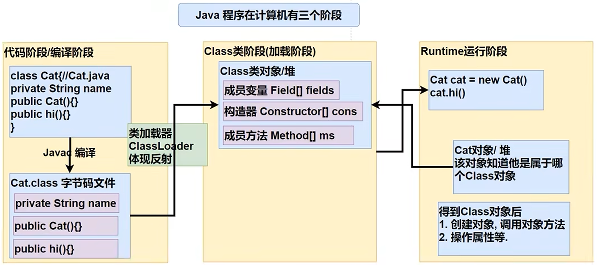
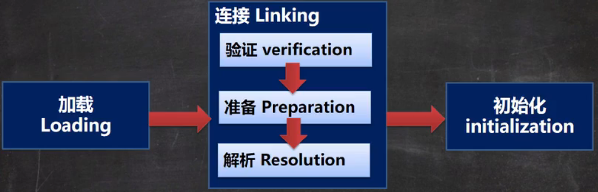

[toc]
# 反射

## 引例
根据配置文件 re.properties 指定信息，创建 Cat 对象并调用其方法 hi 。使用传统方式不能直接解决问题。
```txt
classfullpath=com.animals.Cat
method=hi
```
这样的需求在学习框架时特别多，即通过外部文件配置，在不修改源码情况下来控制程序，也符合设计模式的 ocp 原则（开闭原则: 不修改源码，扩容功能）。

反射快速入门：
```java
 // 1. 获取配置文件
Properties properties = new Properties();
properties.load(new FileReader("src\\re.properties"));
String classfullpath = properties.getProperty("classfullpath");
System.out.println(classfullpath);
String method = properties.getProperty("method");
System.out.println(method);

// 2. 创建对象，传统方法解决不了
// new classfullpath();

// 3. 使用反射机制解决
// (1) 加载类，返回 class 类型的对象
Class<?> aClass = Class.forName(classfullpath);
// (2) 通过 aClass 得到加载类 com.animals.Cat 的对象实例
Object o = aClass.getDeclaredConstructor().newInstance();
System.out.println("o 的运行类型是：" + o.getClass());
// (3) 通过 aClass 得到加载类 com.animals.Cat 的方法对象
Method method1 = aClass.getMethod(method);
// (4) 通过 method1 即通过方法对象来实现调用方法
method1.invoke(o);
```
运行结果：
```txt
com.animals.Cat
hi
o 的运行类型是：class com.animals.Cat
hi~mimi
```
## 反射原理
反射机制允许程序在执行期借助于 ReflectionAPI 取得任何类的内部信息(比如成员变量，构造器，成员方法等等)，并能操作对象的属性及方法。反射在设计模式和框架底层都会用到。



加载完类之后，在堆中就产生了一个 Class 类型的对象（一个类只有一个 Class 对象），这个对象包含了类的完整结构信息。通过这个对象得到类的结构。这个 Class 对象就像一面镜子，透过这个镜子看到类的结构，所以，形象的称之为：反射。

## 反射相关类
1. java.lang.Class：代表一个类， Class 对象表示某个类加载后在堆中的对象；
2. java.lang.reflect.Method：代表类的方法，Method 对象表示某个类的方法；
3. java.lang.reflect.Field：代表类的成员变量，Field 对象表示某个类的成员变量；
4. java.lang.reflect.Constructor：代表类的构造方法，Constructor 对象表示构造器。

```java
// getField 类获取 public 字段
// 可以通过 getDeclaredField 获取任意字段
Field ageField = aClass.getField("age");
System.out.println(ageField.get(o));
// getConstruct 类获取类构造器
Constructor<?> constructor = aClass.getConstructor();
System.out.println(constructor);
```
运行结果：
```txt
10
public com.animals.Cat()
public com.animals.Cat(java.lang.String)
```

## Class 类
1.Class 也是类，因此也继承Object类。
2.Class 类对象不是 new 出来的，而是系统创建的。
3.对于某个类的 Class 类对象，在内存中只有一份，因为类只加载一次；
4.每个类的实例都会记得自己是由哪个 Class 实例所生成的。
5.通过 Class 对象可以完整地得到一个类的完整结构，通过一系列 API 。
6.Class 对象是存放在堆的。
7.类的字节码二进制数据，是放在方法区的，有的地方称为类的元数据(包括 方法代码变量名，方法名，访问权限等等)。

**常用方法**
```java
String classFullPath = "com.animals.Cat";
Class<?> aClass = Class.forName(classFullPath);
// 1. 获取类信息
System.out.println(aClass.getClass());
// 2. 获取类实例信息
System.out.println(aClass);
// 3. 获取全类名
System.out.println(aClass.getName());
// 4. 获取包名
System.out.println(aClass.getPackage());
// 5. 生成类实例对象
Constructor<?> constructor = aClass.getConstructor(String.class, int.class);
Object o = constructor.newInstance("fg", 10);
System.out.println(o);
// 6. 获取类方法
Method hiMethod = aClass.getMethod("hi");
hiMethod.invoke(o);
// 7. 获取字段并赋值
Field nameField = aClass.getField("name");
nameField.setAccessible(true);
nameField.set(o, "oioioi");
System.out.println(o);
// 8. 获取实例类的所有字段
Field[] fields = aClass.getFields();
for (Field field : fields) {
    System.out.println(field.getName());
}
```

**有 Class 的类型**
如下类型有 Class
1 外部类，成员内部类，静态内部类，局部内部类，匿名内部类
2 interface ：接口
3 数组
4 enum ：枚举
5 annotation ：注解
6 基本数据类型
7 void
8 注解
9 class

## 反射性能
反射调用优化关闭访问检查 Method 和 Field、Constructor 对象都有 setAccessible() 方法。
setAccessible 作用是启动和禁用访问安全检查的开关提高反射的效率。参数值参数值为 true 表示反射的对象在使用时取消访问检查，为 false 则表示反射的对象执行访问检查。
```java
 // 传统调用时长 22ms
public static void m1() {
    Cat cat = new Cat();
    long start = System.currentTimeMillis();
    for(int i = 0;i < 900000000;i++) {
        cat.hi();
    }
    long end = System.currentTimeMillis();
    System.out.println((end - start) + " age = " + cat.age);
}
// 反射调用时长 4602ms
public static void m2() throws ClassNotFoundException, NoSuchMethodException, InvocationTargetException, InstantiationException, IllegalAccessException, NoSuchFieldException {
    Class<?> aClass = Class.forName("com.animals.Cat");
    Object o = aClass.getConstructor().newInstance();
    Method m = aClass.getMethod("hi");
    long start = System.currentTimeMillis();
    for(int i = 0;i < 900000000;i++) {
        m.invoke(o);
    }
    long end = System.currentTimeMillis();
    Field ageField = aClass.getField("age");
    System.out.println((end - start) + " age = " + ageField.get(o));
}
// 取消访问检查 3877ms
public static void m3() throws ClassNotFoundException, NoSuchMethodException, InvocationTargetException, InstantiationException, IllegalAccessException, NoSuchFieldException  {
    Class<?> aClass = Class.forName("com.animals.Cat");
    Object o = aClass.getConstructor().newInstance();
    Method m = aClass.getMethod("hi");
    m.setAccessible(true); // 在反射调用方法时 取消访问检查
    long start = System.currentTimeMillis();
    for(int i = 0;i < 900000000;i++) {
        m.invoke(o);
    }
    long end = System.currentTimeMillis();
    Field ageField = aClass.getField("age");
    System.out.println((end - start) + " age = " + ageField.get(o));
}
```
## Java 类加载
**加载时机**
1 当创建对象时。
2 当子类被加载时，父类也加载 。
3 静态加载调用类中的静态成员时。
4 通过反射，且为动态加载。

**类加载的三个阶段**

**1 加载阶段**
JVM 在该阶段的主要目的是将字节码从不同的数据源（可能是 class 文件、也可能是 jar 包，甚至网络）转化为二进制字节流加载到内存中，并生成一个代表该类的 java.lang.Class 对象。

**2.1 连接-验证阶段**
目的是为了确保 Class 文件的字节流中包含的信息符合当前虚拟机的要求，并且不会危害虚拟机自身的安全。包括:文件格式验证（是否以魔数 0xcafebabe 开头）、元数据验证、字节码验证和符号引用验证。
> 可以考虑使用 -Xverify:none 参数来关闭大部分的类验证措施，缩短虚拟机类加载的时间。

**2.1 连接-准备阶段**
 JVM 会在该阶段对静态变量，分配内存并默认初始化（对应数据类型的默认初始值，如 0、0L、null、false 等）。这些变量所使用的内存都将在方法区中进行分配。
```java
//1. n1 是实例属性，不是静态变量，因此在准备阶段，是不会分配内存
//2. n2 是静态变量，分配内存 2 是默认初始化 0，而不是 20
//3. n3 是 static final 是常量，他和静态变量不一样，因为一旦赋值就不变 n3 = 30
public int n1 = 10;
public static int n2 =20;
public static final int n3 = 30;
```

**2.1 连接-解析阶段**
虚拟机将常量池内的符号引用替换为直接引用的过程。

**3 初始化阶段**
到初始化阶段，才真正开始执行类中定义的 Java 程序代码，此阶段是执行 < clinit >() 方法的过程。< clinit >() 方法是由编译器按语句在源文件中出现的顺序，依次自动收集类中的所有静态变量的赋值动作和静态代码块中的语句，并进行合井。
> 虚拟机会保证一个类的 < clinit >() 方法在多线程环境中被正确地加锁、同步，如果多个线程同时去初始化一个类，那么只会有一个线程去执行这个类的 < clinit >() 方法。