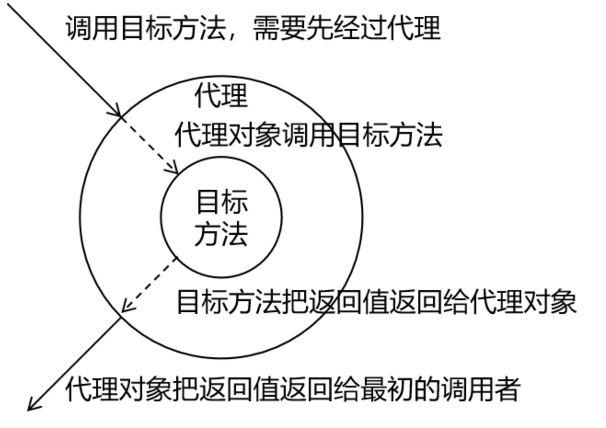
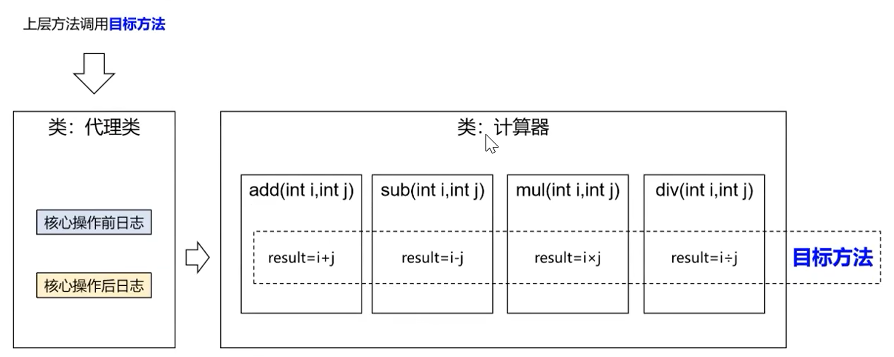
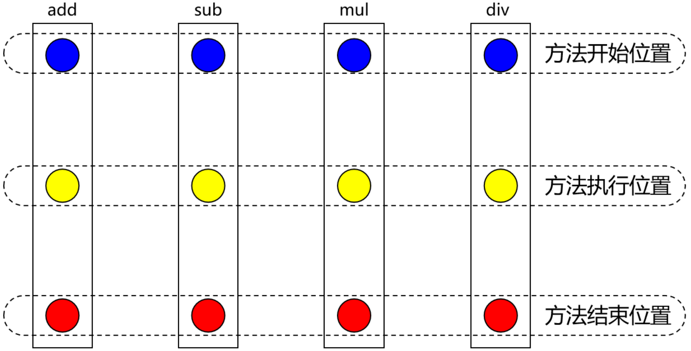
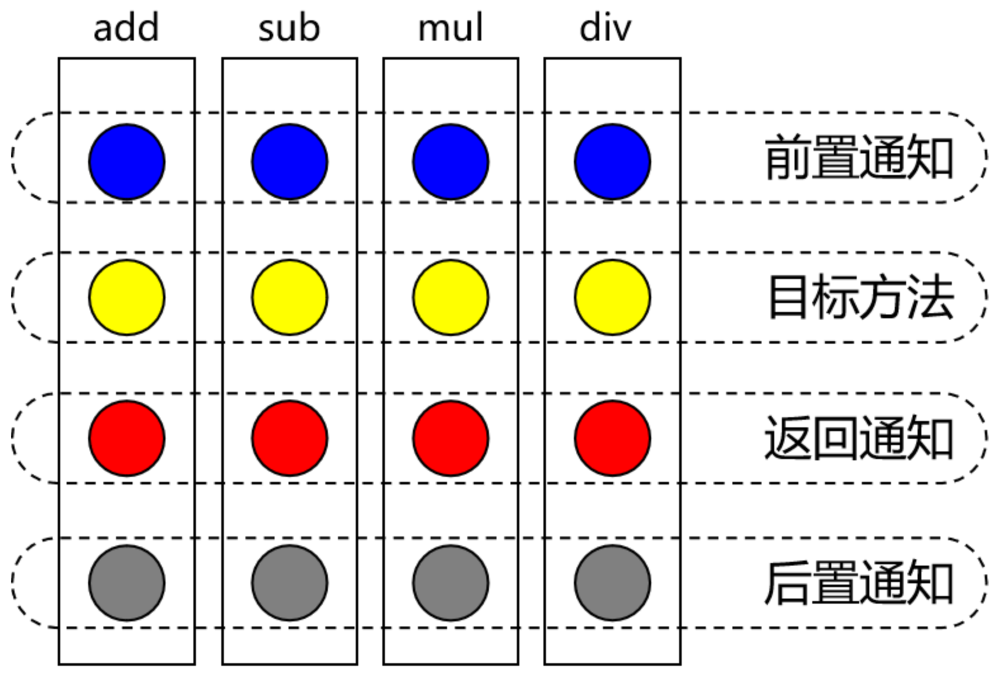
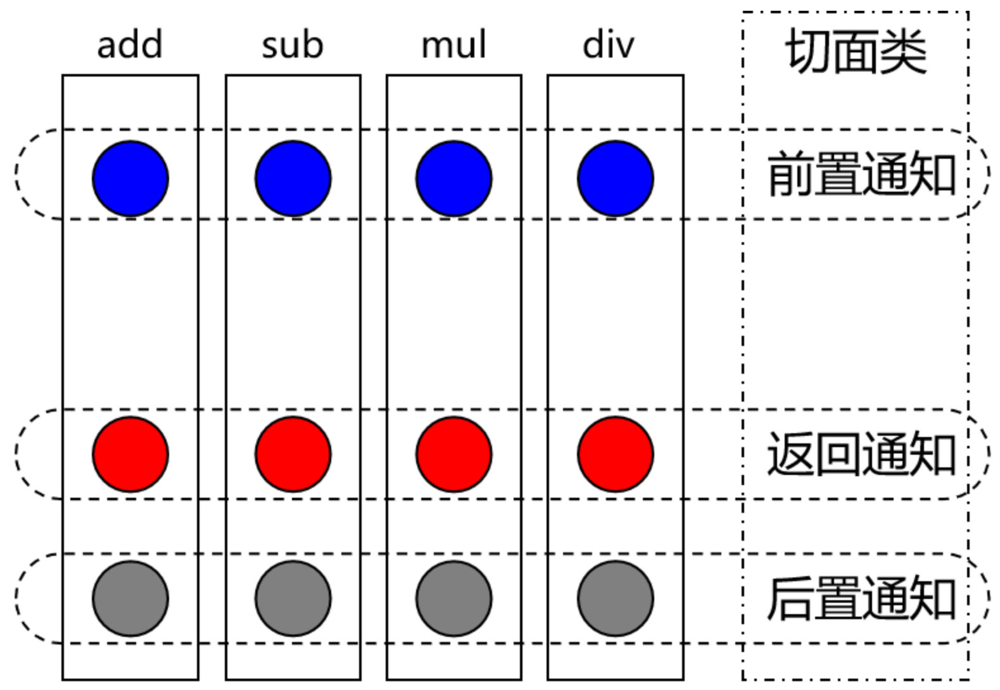
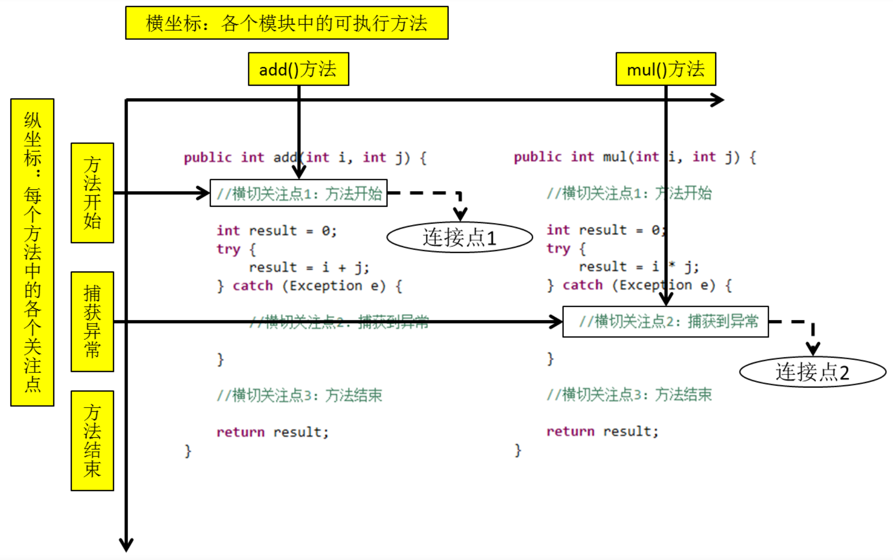
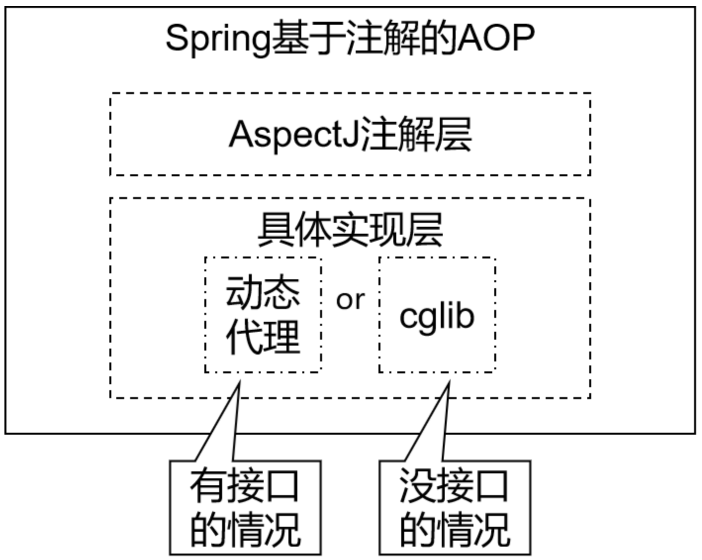
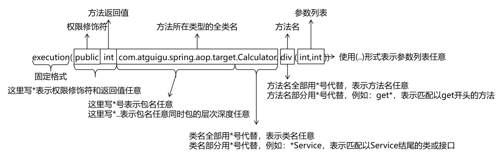
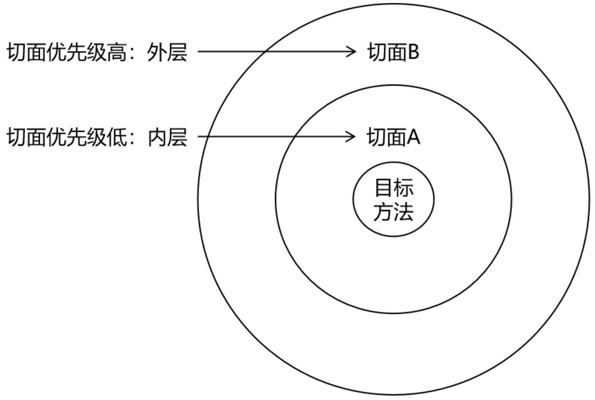

[toc]
# Spring 6
## 概述
### Spring 简介
Spring 是一款主流的 Java EE 轻量级开源框架 ，Spring 由 "spring之父" Rod Johnson 提出并创立，其目的是用于简化 Java 企业级应用的开发难度和开发周期。Spring 的用途不仅限于服务器端的开发。从简单性、可测试性和松耦合的角度而言，任何 Java 应用都可以从 Spring 中受益。Spring 框架除了自己提供功能外，还提供整合其他技术和框架的能力。

Spring 自诞生以来备受青睐，一直被广大开发人员作为 Java 企业级应用程序开发的首选。时至今日，Spring 俨然成为了 Java EE 代名词，成为了构建 Java EE 应用的事实标准。

### Spring Framework
Spring 框架是一个分层的、面向切面的 Java 应用程序的一站式轻量级解决方案，它是 Spring 技术栈的核心和基础，是为了解决企业级应用开发的复杂性而创建的。

Spring 有两个最核心模块: **IoC** 和 **AOP**。

**loC：Inverse of Control** 的简写，译为 “控制反转”，指把创建对象过程交给 Spring 进行管理
**AOP：Aspect Oriented Programming** 的简写，译为 “面向切面编程"。AOP 用来封装多个类的公共行为，将那些与业务无关，却为业务模块所共同调用的逻辑封装起来，减少系统的重复代码，降低模块间的耦合度。另外AOP 还解决一些系统层面上的问题，比如日志、事务、权限等。

### Spring 特点
- 非侵入式：使用 Spring Framework 开发应用程序时，Spring对应用程序本身的结构影响非常小。对领域模型可以做到零污染；对功能性组件也只需要使用几个简单的注解进行标记，完全不会破坏原有结构，反而能将组件结构进一步简化。这就使得基于 Spring Framework 开发应用程序时结构清晰、简洁优雅。
- 控制反转：IOC--Inversion of Control，翻转资源获取方向。把自己创建资源、向环境索取资源变成环境将资源准备好，我们享受资源注入。
- 面向切面编程：AOP--Aspect Oriented Programming，在不修改源代码的基础上增强代码功能。
- 容器：Spring IOC 是一个容器，因为它包含并且管理组件对象的生命周期。组件享受到了容器化的管理，替程序员屏蔽了组件创建过程中的大量细节，极大的降低了使用门槛，大幅度提高了开发效率。
- 组件化：Spring实现了使用简单的组件配置组合成一个复杂的应用。在 Spring 中可以使用 XML 和 Java 注解组合这些对象。这使得我们可以基于一个个功能明确、边界清晰的组件有条不紊的搭建超大型复杂应用系统。
- 一站式：在 IOC 和 AOP 的基础上可以整合各种企业应用的开源框架和优秀的第三方类库。而且 Spring 旗下的项目已经覆盖了广泛领域，很多方面的功能性需求可以在 Spring Framework 的基础上全部使用 Spring 来实现。

## 容器：IoC
IoC 是 Inversion of Control 的简写，译为 “控制反转"，它不是一门技术，而是一种**设计思想**，是一个重要的面向对象编程法则，能够指导我们如何设计出松耦合、更优良的程序。

Spring 通过 **IoC 容器**来管理所有 Java 对象的实例化和初始化，控制对象与对象之间的依赖关系。我们将由 IoC 容器管理的 Java 对象称为 Spring Bean，它与使用关键字 new 创建的 Java 对象没有任何区别。

IoC 容器是 Spring 框架中最重要的核心组件之一，它贯穿了 Spring 从诞生到成长的整个过程。

### 控制反转（IoC）
控制反转是一种思想，控制反转是为了降低程序耦合度，提高程序扩展力。

控制反转，反转的是什么？
1. 将对象的创建权利交出去，交给第三方容器负责。
2. 将对象和对象之间关系的维护权交出去，交给第三方容器负责。

控制反转这种思想如何实现呢？
DI（Dependency Injection）：依赖注入
### 依赖注入
DI（Dependency Injection）依赖注入，依赖注入实现了控制反转的思想。指 Spring 创建对象的过程中，将对象依赖属性通过配置进行注入。

依赖注入常见的实现方式包括两种：set注入和构造注入。

Spring 的 IoC 容器就是 IoC 思想的一个落地的产品实现。IoC 容器中管理的组件也叫做 bean。在创建 bean 之前，首先需要创建 IoC 容器。Spring 提供了 IoC 容器的两种实现方式：BeanFactory 是 IoC 容器的基本实现，是 Spring 内部使用的接口。面向 Spring 本身，不提供给开发人员使用；ApplicationContext，BeanFactory 的子接口，提供了更多高级特性。面向 Spring 的使用者，几乎所有场合都使用 ApplicationContext 而不是底层的 BeanFactory。

ApplicationContext的主要实现类：
| 类型名                             | 简介                                                                 |
|----------------------------------|----------------------------------------------------------------------|
| ClassPathXmlApplicationContext   | 通过读取类路径下的 XML 格式的配置文件创建 IOC 容器对象               |
| FileSystemXmlApplicationContext  | 通过文件系统路径读取 XML 格式的配置文件创建 IOC 容器对象             |
| ConfigurableApplicationContext   | ApplicationContext 的子接口，包含一些扩展方法 refresh() 和 close()，让 ApplicationContext 具有启动、关闭和刷新上下文的能力。 |
| WebApplicationContext            | 专门为 Web 应用准备，基于 Web 环境创建 IOC 容器对象，并将对象引入存入 ServletContext 域中。 |

### 基于 XML 管理 Bean
#### 获取 Bean
```java
ApplicationContext context = new ClassPathXmlApplicationContext("bean.xml");
// 根据 bean.xml 中的 id 获取对象
User user1 = (User) context.getBean("user");
// 根据类类型获取对象
User user2 = context.getBean(User.class);
// 根据 id 和类类型获取对象
User user3 = context.getBean("user", User.class);
```
当根据类型获取bean时，要求IOC容器中指定类型的bean有且只能有一个，否则会抛异常。
当 xml 中一共配置了两个类型一致的 Bean 时， 根据类型获取 Bean 会抛异常：
```xml
<bean id="user1" class="User"></bean>
<bean id="user2" class="User"></bean>
```

> 注意：
1.当根据类型获取bean时，要求IOC容器中指定类型的bean有且只能有一个。
2.如果类实现了接口，只有 Bean 唯一时接口类型可以获取 Bean 。

#### 依赖注入
##### setter 注入
第一步：实现类的 set 方法（注意也必须要有无参构造函数）；
```java
public void setName(String name) {
    this.name = name;
}

public void setAge(int age) {
    this.age = age;
}
```
第二步：配置 bean.xml 。
```xml
<bean id="user1" class="com.spring6.iocxml.User">
    <property name="age" value="17"></property>
    <property name="name" value="sophon"></property>
</bean>
```
##### 构造器注入
第一步：实现类的有参构造方法；
```java
public User(String name, int age) {
    System.out.println("带参构造调用...");
    this.age = age;
    this.name = name;
}
```
第二步：配置 bean.xml 。
```xml
<bean id="user2" class="com.spring6.iocxml.User">
    <constructor-arg name="name" value="nohpos"></constructor-arg>
    <constructor-arg name="age" value="19"></constructor-arg>
</bean>
```
> 注意：默认情况下，Spring 容器在初始化时会立即创建所有配置的单例（singleton）bean。并且这里的单例是指 id 唯一，而不是类唯一。

##### 特殊值处理
1.属性赋值为 null。
```xml
<property name="name">
    <null />
</property>
```
2.xml实体
```xml
<!-- 小于大于号在XML文档中用来定义标签的开始，不能随便使用 -->
<!-- 解决方案一：使用XML实体来代替。其中：&lt; 表示 '<' &gt; 表示 '>' -->
<property name="expression" value="a &lt; b"/>
```
3.CDATA节
```xml
<property name="expression">
    <!-- 解决方案二：使用CDATA节 -->
    <!-- CDATA中的C代表Character，是文本、字符的含义，CDATA就表示纯文本数据 -->
    <!-- XML解析器看到CDATA节就知道这里是纯文本，就不会当作XML标签或属性来解析 -->
    <!-- 所以CDATA节中写什么符号都随意 -->
    <value><![CDATA[a < b]]></value>
</property>
```

##### 为对象类型属性赋值
1.外部 Bean
配置 Birthday 类型的 bean：
```xml
<bean name="birthday" class="com.spring6.iocxml.Birthday">
    <property name="year" value="2025"></property>
    <property name="month" value="12"></property>
    <property name="day" value="31"></property>
</bean>
```
引用外部对象：
```xml
<bean name="user" class="com.spring6.iocxml.User">
    <property name="name" value="zhangsan"></property>
    <property name="age" value="0"></property>
    <property name="birthday" ref="birthday"></property>
    <!--还可以修改类属性-->
    <property name="birthday.year" value="2000"></property>
</bean>
```
2.内部 Bean
```xml
<bean name="user" class="com.spring6.iocxml.User">
    <property name="name" value="zhangsan"></property>
    <property name="age" value="0"></property>
    <property name="birthday">
        <!-- 在一个 Bean 中再声明一个 Bean 就是内部 Bean -->
        <!-- 内部 Bean 只能用于给属性赋值，不能在外部通过 IOC 容器获取，因此可以省略 id 属性 -->
        <bean class="com.spring6.iocxml.Birthday">
            <property name="year" value="2025"></property>
            <property name="month" value="12"></property>
            <property name="day" value="31"></property>
        </bean>
    </property>
</bean>
```
##### 为数组类型赋值
```xml
<property name="hobbies">
    <array>
        <value>抽烟</value>
        <value>喝酒</value>
        <value>烫头</value>
    </array>
</property>
```
##### 为集合类型赋值
1.为List集合类型属性赋值
```xml
<!--  预先准备好集合内部类型的 Bean（注意：也可以内部 Bean）
<bean name="addr1" class="com.spring6.iocxml.Addr">
    <property name="province" value="陕西"></property>
    <property name="city" value="西安"></property>
</bean>

<bean name="addr2" class="com.spring6.iocxml.Addr">
    <property name="province" value="黑龙江"></property>
    <property name="city" value="哈尔滨"></property>
</bean>
 -->
<property name="addrList">
    <list>
        <ref bean="addr1"></ref>
        <ref bean="addr2"></ref>
    </list>
</property>
```
> 注意：若为 Set 集合类型属性赋值，只需要将其中的 list 标签改为 set 标签即可。

2.为Map集合类型属性赋值
```xml
<property name="postAddress">
    <map>
        <entry>
            <key>
                <value>京东</value>
            </key>
            <ref bean="addr1"></ref>
        </entry>
        <entry>
            <key>
                <value>拼多多</value>
            </key>
            <ref bean="addr2"></ref>
        </entry>
    </map>
</property>
```
3.引用集合类型的bean
```xml
<!--  预先准备好集合内部类型的 Bean（注意：也可以内部 Bean）
<bean name="addr1" class="com.spring6.iocxml.Addr">
    <property name="province" value="陕西"></property>
    <property name="city" value="西安"></property>
</bean>

<bean name="addr2" class="com.spring6.iocxml.Addr">
    <property name="province" value="黑龙江"></property>
    <property name="city" value="哈尔滨"></property>
</bean>
 -->

<util:list id="hobbiesList">
    <value>抽烟</value>
    <value>喝酒</value>
    <value>烫头</value>
</util:list>

<util:map id="addrMap">
    <entry>
        <key>
            <value>京东</value>
        </key>
        <ref bean="addr1"></ref>
    </entry>
    <entry>
        <key>
            <value>拼多多</value>
        </key>
        <ref bean="addr2"></ref>
    </entry>
</util:map>

<bean name="user" class="com.spring6.iocxml.User">
    <property name="name" value="zhangsan"></property>
    <property name="age" value="18"></property>
    <property name="hobbies" ref="hobbiesList"></property>
    <property name="postAddress" ref="addrMap"></property>
</bean>
```
> 注意：使用 util:list、util:map 标签必须引入相应的命名空间。
> ```xml
> <?xml version="1.0" encoding="UTF-8"?>
> <beans xmlns="http://www.springframework.org/schema/beans"
>        xmlns:xsi="http://www.w3.org/2001/XMLSchema-instance"
>        xmlns:util="http://www.springframework.org/schema/util"
>        xsi:schemaLocation="http://www.springframework.org/schema/util
>        http://www.springframework.org/schema/util/spring-util.xsd
>        http://www.springframework.org/schema/beans
>        http://www.springframework.org/schema/beans/spring-beans.xsd">
> ```

##### p 命名空间
> 引入 p 命名空间
> ```xml
> <beans xmlns="http://www.springframework.org/schema/beans"
>        xmlns:xsi="http://www.w3.org/2001/XMLSchema-instance"
>        xmlns:util="http://www.springframework.org/schema/util"
>        xmlns:p="http://www.springframework.org/schema/p"
>        xsi:schemaLocation="
>         http://www.springframework.org/schema/beans http://www.springframework.org/schema/beans/spring-beans.xsd
>         http://www.springframework.org/schema/util http://www.springframework.org/schema/util/spring-util.xsd">
> ```
引入p命名空间后，可以通过以下方式为bean的各个属性赋值：
```xml
<bean name="user" class="com.spring6.iocxml.User"
    p:name="zhangsan" p:age="18" p:birthday-ref="birthday" p:hobbies="hobbiesList" p:postAddress-ref="addrMap">
</bean>
```

##### 引入外部属性文件
1.加入依赖
```xml
 <!-- MySQL驱动 -->
<dependency>
    <groupId>mysql</groupId>
    <artifactId>mysql-connector-java</artifactId>
    <version>8.0.30</version>
</dependency>

<!-- 数据源 -->
<dependency>
    <groupId>com.alibaba</groupId>
    <artifactId>druid</artifactId>
    <version>1.2.15</version>
</dependency>
```
2.创建外部属性文件 jdbc.properties
```properties
jdbc.user=root
jdbc.password=1234
jdbc.url=jdbc:mysql://localhost:3306/spring?serverTimezone=UTC
jdbc.driver=com.mysql.cj.jdbc.Driver
```
3.引入 context 命名空间，引入外部属性文件，配置 bean 。
```xml
<?xml version="1.0" encoding="UTF-8"?>
<beans xmlns="http://www.springframework.org/schema/beans"
       xmlns:xsi="http://www.w3.org/2001/XMLSchema-instance"
       xmlns:context="http://www.springframework.org/schema/context"
       xsi:schemaLocation="http://www.springframework.org/schema/beans http://www.springframework.org/schema/beans/spring-beans.xsd
       http://www.springframework.org/schema/context http://www.springframework.org/schema/context/spring-context.xsd">
    <!--引入外部属性文件-->
    <context:property-placeholder location="classpath:jdbc.properties"></context:property-placeholder>
    
    <bean id="druidDataSource" class="com.alibaba.druid.pool.DruidDataSource">
        <property name="url" value="${jdbc.url}"></property>
        <property name="username" value="${jdbc.user}"></property>
        <property name="password" value="${jdbc.password}"></property>
        <property name="driverClassName" value="${jdbc.driver}"></property>
    </bean>

</beans>
```
#### Bean 的作用域
在 Spring 中可以通过配置 Bean 标签的 scope 属性来指定 bean 的作用域范围，各取值含义参加下表：
| 取值         | 含义      | 创建对象的时机         |
|--------------|-----------|-----------------|
| singleton（默认） | 在IOC容器中，这个bean的对象始终为单实例 | IOC容器初始化时     |
| prototype    | 这个bean在IOC容器中有多个实例       | 获取bean时         |、


如果是在WebApplicationContext环境下还会有另外几个作用域（但不常用）：
| 取值    | 含义          |
|---------|---------------------|
| request | 在一个请求范围内有效     |
| session | 在一个会话范围内有效     |

#### Bean 的生命周期
具体生命周期过程
1. bean 对象创建（调用无参构造器）。
2. 给 bean 对象设置属性。
3. bean 的后置处理器（初始化之前）。
4. bean 对象初始化（需在配置 bean 时指定初始化方法）。
5. bean 的后置处理器（初始化之后）。
6. bean 对象就绪可以使用。
7. bean 对象销毁（需在配置 bean 时指定销毁方法）。
8. IOC 容器关闭。

#### FactoryBean
> 区分：BeanFactory: Spring 实现 IoC 容器的顶层接口。

FactoryBean 是 Spring 提供的一种整合第三方框架的常用机制。和普通的 bean 不同，配置一个 FactoryBean 类型的 bean，在获取 bean 的时候得到的并不是 class 属性中配置的这个类的对象，而是 getObject() 方法的返回值。通过这种机制，Spring 可以帮我们把复杂组件创建的详细过程和繁琐细节都屏蔽起来，只把最简洁的使用界面展示给我们。

将来整合 Mybatis 时，Spring 就是通过 FactoryBean 机制来帮我们创建 SqlSessionFactory 对象的。

第一步：创建类 UserFactoryBean
```java
public class UserFactoryBean implements FactoryBean<User> {
    @Override
    public User getObject() throws Exception {
        return new User();
    }

    @Override
    public Class<?> getObjectType() {
        return User.class;
    }
}
```
第二步：配置 bean
```xml
<!--如果我们想要获取 FactoryBean 本身，可以在 id 前加上 & 符号-->
<bean name="userFactoryBean" class="com.spring6.iocxml.UserFactoryBean"></bean>
```
第三步：测试
```java
@Test
public void test() {
    ApplicationContext context = new ClassPathXmlApplicationContext("bean.xml");
    // getBean 得到的是 User 对象，而非 userFactoryBean 对象
    User userFactoryBean = (User)context.getBean("userFactoryBean");
    System.out.println(userFactoryBean);
}
```
#### 基于 xml 的自动装配
自动装配：根据指定的策略，在 IOC 容器中匹配某一个 bean，自动为指定的 bean 中所依赖的类类型或接口类型属性赋值。

使用 bean 标签的 autowire 属性设置自动装配效果。
自动装配方式：byType
```xml
<bean id="userController" class="com.spring6.auto.controller.UserController" autowire="byType">
</bean>
<bean id="userService" class="com.spring6.auto.service.impl.UserServiceImpl" autowire="byType">
</bean>
<bean id="userDao" class="com.spring6.auto.dao.impl.UserDaoImpl">
</bean>
```
byType：根据类型匹配 IOC 容器中的某个兼容类型的 bean，为属性自动赋值
若在 IOC 中，没有任何一个兼容类型的 bean 能够为属性赋值，则该属性不装配，即值为默认值 null。
若在 IOC 中，有多个兼容类型的 bean 能够为属性赋值，则抛出异常 NoUniqueBeanDefinitionException。

自动装配方式：byName
```xml
<bean id="userController" class="com.spring6.auto.controller.UserController" autowire="byName">
</bean>
<bean id="userService" class="com.spring6.auto.service.impl.UserServiceImpl" autowire="byName">
</bean>
<bean id="userDao" class="com.spring6.auto.dao.impl.UserDaoImpl">
</bean>
```
byName：将自动装配的属性的属性名，作为 bean 的 id 在 IOC 容器中匹配相对应的 bean 进行赋值。

### 基于注解管理 Bean
从 Java 5 开始，Java 增加了对注解（Annotation）的支持，它是代码中的一种特殊标记，可以在编译、类加载和运行时被读取，执行相应的处理。开发人员可以通过注解在不改变原有代码和逻辑的情况下，在源代码中嵌入补充信息。

Spring 从 2.5 版本开始提供了对注解技术的全面支持，我们可以使用注解来实现自动装配，简化 Spring 的 XML 配置。

Spring 通过注解实现自动装配的步骤如下：
1. 引入依赖。
2. 开启组件扫描。
3. 使用注解定义 Bean 。
4. 依赖注入。

#### 组件扫描
Spring 默认不使用注解装配 Bean，因此我们需要在 Spring 的 XML 配置中，通过 context:component-scan 元素开启 Spring Beans的自动扫描功能。开启此功能后，Spring 会自动从扫描指定的包（base-package 属性设置）及其子包下的所有类，如果类上使用了 @Component 注解，就将该类装配到容器中。
```xml
<?xml version="1.0" encoding="UTF-8"?>
<beans xmlns="http://www.springframework.org/schema/beans"
       xmlns:xsi="http://www.w3.org/2001/XMLSchema-instance"
       xmlns:context="http://www.springframework.org/schema/context"
       xsi:schemaLocation="http://www.springframework.org/schema/beans
    http://www.springframework.org/schema/beans/spring-beans-3.0.xsd
    http://www.springframework.org/schema/context
            http://www.springframework.org/schema/context/spring-context.xsd">
    <!--开启组件扫描功能-->
    <context:component-scan base-package="com.atguigu.spring6"></context:component-scan>
</beans>
```
> 注意：在使用 context:component-scan 元素开启自动扫描功能前，首先需要在 XML 配置的一级标签 中添加 context 相关的约束。

**扫描方式一：全包扫描**
```xml
<context:component-scan base-package="com.spring6">
</context:component-scan>
```

**扫描方式二**
```xml
<context:component-scan base-package="com.spring6">
    <!-- context:exclude-filter标签：指定排除规则 -->
    <!-- 
 		type：设置排除或包含的依据
		type="annotation"，根据注解排除，expression中设置要排除的注解的全类名
		type="assignable"，根据类型排除，expression中设置要排除的类型的全类名
	-->
    <context:exclude-filter type="annotation" expression="org.springframework.stereotype.Controller"/>
        <!--<context:exclude-filter type="assignable" expression="com.spring6.controller.UserController"/>-->
</context:component-scan>
```

**扫描方式三**
```xml
<context:component-scan base-package="com" use-default-filters="false">
    <!-- context:include-filter标签：指定在原有扫描规则的基础上追加的规则 -->
    <!-- use-default-filters属性：取值false表示关闭默认扫描规则 -->
    <!-- 此时必须设置use-default-filters="false"，因为默认规则即扫描指定包下所有类 -->
    <!-- 
 		type：设置排除或包含的依据
		type="annotation"，根据注解排除，expression中设置要排除的注解的全类名
		type="assignable"，根据类型排除，expression中设置要排除的类型的全类名
	-->
    <context:include-filter type="annotation" expression="org.springframework.stereotype.Controller"/>
	<!--<context:include-filter type="assignable" expression="com.spring6.controller.UserController"/>-->
</context:component-scan>
```
#### 使用注解定义 Bean
Spring 提供了以下多个注解，这些注解可以直接标注在 Java 类上，将它们定义成 Spring Bean。
| 注释         | 说明                            |
|--------------|---------------------------------------------------------------------|
| @Component   | 该注解用于描述 Spring 中的 Bean，它是一个泛化的概念，仅仅表示容器中的一个组件（Bean），并且可以作用在应用的任何层次，例如 Service 层、Dao 层等。使用时只需将该注解标注在相应类上即可。 |
| @Repository  | 该注解用于将数据访问层（Dao 层）的类标识为 Spring 中的 Bean，其功能与 @Component 相同。               |
| @Service     | 该注解通常作用在业务层（Service 层），用于将业务层的类标识为 Spring 中的 Bean，其功能与 @Component 相同。 |
| @Controller  | 该注解通常作用在控制层（如 SpringMVC 的 Controller），用于将控制层的类标识为 Spring 中的 Bean，其功能与 @Component 相同。 |
例如：
```java
// 不设置注解 value 默认为类名首字母小写
@Component
public class User {
}
/*
测试代码（注意要提前配置组件扫描）
@Test
public void test() {
    ApplicationContext context = new ClassPathXmlApplicationContext("bean.xml");
    User user = (User)context.getBean("user");
    System.out.println(user);
}
*/
```

#### @Autowired 注入
单独使用 @Autowired 注解，默认根据类型装配（默认 byType）。且不需要提供 set 方法。

**属性注入**示例：
```java
@Controller
public class UserController {
    // 自动装配 userService
    @Autowired
    private UserService userService;

    public void addUser() {
        System.out.println("UserController addUser ...");
        userService.addUserService();
    }
}

/*
@Service
public class UserServiceImpl implements UserService {
    @Autowired
    private UserDao userDao;

    @Override
    public void addUserService() {
        System.out.println("UserServiceImpl addUserService ...");
        userDao.add();
    }
}
*/

/*
@Repository
public class UserDaoImpl implements UserDao {
    @Override
    public void add() {
        System.out.println("UserDaoImpl add...");
    }
}
*/
```
除了直接属性注入以外，还可以 set 注入、构造方法注入、形参上注入等，当组件类中只有一个有参构造函数时 @Autowired 注解可以省略。

如果一个接口拥有多个实现类，例如 UserDaoImpl 和 UserDaoRedisImpl 都实现了 UserDao 接口则会报错，因为 @Autowired 注解默认根据类型装配。此时可以搭配 @Qualifier 注解实现根据名称匹配（byName）。
```java
@Service
public class UserServiceImpl implements UserService {
    @Autowired
    @Qualifier(value = "userDaoRedisImpl")
    private UserDao userDao;

    @Override
    public void addUserService() {
        System.out.println("UserServiceImpl addUserService ...");
        userDao.add();
    }
}
```
#### @Resource 注入
- @Resource 注解也可以完成属性注入。那它和 @Autowired 注解有什么区别？
- @Resource 注解是 JDK 扩展包中的，也就是说属于 JDK 的一部分。所以该注解是标准注解，更加具有通用性。(JSR-250 标准中制定的注解类型。JSR 是 Java 规范提案。)
- @Autowired 注解是 Spring 框架自己的。
- @Resource 注解默认根据名称装配 byName，未指定 name 时，使用属性名作为 name。通过name 找不到的话会自动启动通过类型 byType 装配。
- @Autowired 注解默认根据类型装配 byType，如果想根据名称装配，需要配合 @Qualifier 注解一起用。
- @Resource 注解用在属性上、setter 方法上。
- @Autowired 注解用在属性上、setter 方法上、构造方法上、构造方法参数上。

@Resource 注解属于 JDK 扩展包，所以不在 JDK 当中，需要额外引入以下依赖（如果是JDK8的话不需要额外引入依赖。高于JDK11或低于JDK8需要引入以下依赖。）：
```xml
<dependency>
    <groupId>jakarta.annotation</groupId>
    <artifactId>jakarta.annotation-api</artifactId>
    <version>2.1.1</version>
</dependency>
```
#### 全注解开发 IoC
全注解开发就是不再使用 Spring 配置文件了，写一个配置类来代替配置文件。
```java
import org.springframework.context.annotation.ComponentScan;
import org.springframework.context.annotation.Configuration;

@Configuration
// @ComponentScan({"com.atguigu.spring6.controller", "com.atguigu.spring6.service","com.atguigu.spring6.dao"})
@ComponentScan("com.spring6")
public class SpringConfig {
}
```
### 手写 IoC
手写 IoC（控制反转）和 DI（依赖注入）Spring 里面的核心，整体上了解下 Spring 原理。

**1.定义注解 @Bean 和 @Di**
**Bean** 注解实现 Spring 中的 @Service 注解功能，即标注组件（Bean 对象）。
```java
package com.spring.anno;

import java.lang.annotation.ElementType;
import java.lang.annotation.Retention;
import java.lang.annotation.RetentionPolicy;
import java.lang.annotation.Target;

@Target(ElementType.TYPE)
@Retention(RetentionPolicy.RUNTIME)
public @interface Bean {
}
```

**Di** 注解实现 Spring 中的 @Autowired 注解功能，即自动装配。
```java
package com.spring.anno;

import java.lang.annotation.ElementType;
import java.lang.annotation.Retention;
import java.lang.annotation.RetentionPolicy;
import java.lang.annotation.Target;

@Target(ElementType.FIELD)
@Retention(RetentionPolicy.RUNTIME)
public @interface Di {
}
```

**2.定义 IoC 容器 ApplicationContext**
定义 ApplicationContext 接口。
```java
package com.spring.bean;

public interface ApplicationContext {
    Object getBean(Class clazz);
}
```

实现 AnnotationApplicationContext 基于注解扫描 bean。
```java
public class AnnotationApplicationContext implements ApplicationContext {
    private String rootPath;
    // 创建 Map 集合存放 bean 对象
    private Map<Class, Object> beanFactory = new HashMap<>();

    @Override
    public Object getBean(Class clazz) {
        return beanFactory.get(clazz);
    }

    // 创建有参数构造，传递包路径，设置包扫描规则
    // 当前包及其子包，哪个类有 @Bean 注解，把这个类通过反射实例化
    public AnnotationApplicationContext(String basePackage) {
        // 1 把 . 替换为 \
        String packagePath = basePackage.replaceAll("\\.", "\\\\");
        // 2 获取包的绝对路径
        try {
            Enumeration<URL> urls = Thread.currentThread().getContextClassLoader().getResources(packagePath);
            while (urls.hasMoreElements()) {
                URL url = urls.nextElement();
                // 解码 %5c
                String filePath = URLDecoder.decode(url.getFile(), StandardCharsets.UTF_8);
                rootPath = filePath.substring(0, filePath.length() - packagePath.length());
                // 扫描包，加载 bean
                try {
                    loadBean(new File(filePath));
                } catch (Exception e) {
                    e.printStackTrace();
                }
            }
        } catch (IOException e) {
            throw new RuntimeException(e);
        }

        try {
            loadDi();
        } catch (IllegalAccessException e) {
            throw new RuntimeException(e);
        }
    }

    private void loadBean(File file) throws ClassNotFoundException, NoSuchMethodException, InvocationTargetException, InstantiationException, IllegalAccessException {
        // 1 判断当前是否是文件夹
        if(file.isDirectory()) {
            // 2 获取文件夹里面的所有内容
            File[] childFiles = file.listFiles();
            // 3 若文件夹为空，直接返回
            if(childFiles == null || childFiles.length == 0) {
                return;
            }
            // 4 若文件夹不为空，遍历文件夹所有内容
            for (File childFile : childFiles) {
                // 如果还算是文件夹，递归
                if(childFile.isDirectory()) {
                    loadBean(childFile);
                } else {
                    // 文件
                    // 4.1 得到包路径和类名称
                    String pathWithClass = childFile.getAbsolutePath().substring(rootPath.length() - 1);
                    if(pathWithClass.endsWith(".class")) {
                        String fullClassName = pathWithClass.replaceAll("\\\\", "\\.").replace(".class", "");
                        Class<?> aClass = Class.forName(fullClassName);
                        // 判断是否为接口，不是接口则检查是否为 bean
                        if(!aClass.isInterface()) {
                            // 是否能获取到 @Bean 注解
                            Bean annotation = aClass.getAnnotation(Bean.class);
                            if(annotation != null) {
                                // 实例化对象
                                Object instance = aClass.getDeclaredConstructor().newInstance();
                                // 4.2 如果当前类有接口，则接口作为 Map 的 Key
                                if(aClass.getInterfaces().length > 0) {
                                    beanFactory.put(aClass.getInterfaces()[0], instance);
                                } else {
                                    beanFactory.put(aClass, instance);
                                }
                            }
                        }
                    }
                }
            }
        }
    }

    private void loadDi() throws IllegalAccessException {
        // 实例化对象在 beanFactory 的 map 集合里面
        // 1 遍历 beanFactory 的 key 集合
        for (Class aClass : beanFactory.keySet()) {
            // 2 获取 aClass 对应实例
            Object instance = beanFactory.get(aClass);
            Class<?> instanceClass = instance.getClass();
            // 3 遍历 aClass 字段（field）判断是否有 @Di 注解
            Field[] declaredFields = instanceClass.getDeclaredFields();
            for (Field field : declaredFields) {
                field.setAccessible(true);
                // 如果有 @Di 注解则注入 字段（field）对应的对象实例
                Di annotation = field.getAnnotation(Di.class);
                if(annotation != null) {
                    field.set(instance, beanFactory.get(field.getType()));
                }
            }
        }
    }
}
```

## AOP
### 代理模式
二十三种设计模式中的一种，属于结构型模式。它的作用就是通过提供一个代理类，让我们在调用目标方法的时候，不再是直接对目标方法进行调用，而是通过代理类**间接调用**。让不属于目标方法核心逻辑的代码从目标方法中剥离出来——**解耦**。调用目标方法时先调用代理对象的方法，减少对目标方法的调用和打扰，同时让附加功能能够集中在一起也有利于统一维护。



**相关术语**
代理：将非核心逻辑剥离出来以后，封装这些非核心逻辑的类、对象、方法。
目标：被代理“套用”了非核心逻辑代码的类、对象、方法。

**静态代理**
静态代理直接在目标上套用代理类确实实现了解耦，但是由于代码都写死了，完全不具备任何的灵活性。就拿日志功能来说，将来其他地方也需要附加日志，那还得再声明更多个静态代理类，那就产生了大量重复的代码，日志功能还是分散的，没有统一管理。

提出进一步的需求：将日志功能集中到一个代理类中，将来有任何日志需求，都通过这一个代理类来实现。这就需要使用动态代理技术了。

### 动态代理


生产代理对象的工厂类：
```java
public class ProxyFactory {

    // 目标对象
    private Object target;
    public ProxyFactory(Object target) {
        this.target = target;
    }

    // 返回代理对象
    public Object getProxy() {
        /**
         * Proxy.newProxyInstance() 方法三个参数
         * 1 ClassLoader loader：加载动态生成代理类的类加载器
         * 2 Class<?>[] interfaces：目标对象实现的所有接口 class 类型的数组
         * 3 InvocationHandler：定义方法调用的拦截逻辑（InvocationHandler）
         */
        ClassLoader classLoader = target.getClass().getClassLoader();
        Class<?>[] interfaces = target.getClass().getInterfaces();
        InvocationHandler invocationHandler = new InvocationHandler() {
            // 参数 1：代理对象
            // 参数 2：需要重写目标对象的方法
            // 参数 3：method 方法里面的参数
            @Override
            public Object invoke(Object proxy, Method method, Object[] args) throws Throwable {
                // 方法调用前日志
                System.out.println("[动态代理][日志]" + method.getName() + "，参数：" + Arrays.toString(args));
                Object result = method.invoke(target, args);
                // 方法调用后日志
                System.out.println("[动态代理][日志]" + method.getName() + "，结果：" + result);
                return result;
            }
        };
        return Proxy.newProxyInstance(classLoader, interfaces, invocationHandler);
    }
}
```
测试：
```java
@Test
public void test() {
    ProxyFactory calProxyFactory = new ProxyFactory(new CalculatorImpl());
    Calculator calProxy = (Calculator)calProxyFactory.getProxy();
    calProxy.add(1, 2);
}
/* 测试结果：
[动态代理][日志]add，参数：[1, 2]
[动态代理][日志]add，结果：3
*/
```
> 注意：
仅支持接口代理：目标类必须实现至少一个接口（JDK 动态代理的限制）。
性能开销：反射调用比直接调用略慢，但在大多数场景可忽略。
避免递归调用：在 invoke() 中直接调用 proxy.method() 会导致栈溢出。

### AOP 面向切面编程
AOP（Aspect Oriented Programming）是一种设计思想，是软件设计领域中的面向切面编程，它是面向对象编程的一种补充和完善，它以通过预编译方式和运行期动态代理方式实现，在不修改源代码的情况下，给程序动态统一添加额外功能的一种技术。利用 AOP 可以对业务逻辑的各个部分进行隔离，从而使得业务逻辑各部分之间的耦合度降低，提高程序的可重用性，同时提高了开发的效率。

- 简化代码：把方法中固定位置的重复的代码抽取出来，让被抽取的方法更专注于自己的核心功能，提高内聚性。
- 代码增强：把特定的功能封装到切面类中，看哪里有需要，就往上套，被套用了切面逻辑的方法就被切面给增强了。

#### 相关术语
**1.横切关注点**


分散在每个各个模块中解决同一样的问题，如用户验证、日志管理、事务处理、数据缓存都属于横切关注点。

从每个方法中抽取出来的同一类非核心业务。在同一个项目中，我们可以使用多个横切关注点对相关方法进行多个不同方面的增强。

这个概念不是语法层面的，而是根据附加功能的逻辑上的需要：有十个附加功能，就有十个横切关注点。

**2.通知（增强）**


增强，通俗说，就是你想要增强的**功能**，比如 安全，事务，日志等。

每一个横切关注点上要做的事情都需要写一个方法来实现，这样的方法就叫通知方法。

- 前置通知：在被代理的目标方法前执行
- 返回通知：在被代理的目标方法成功结束后执行（寿终正寝）
- 异常通知：在被代理的目标方法异常结束后执行（死于非命）
- 后置通知：在被代理的目标方法最终结束后执行（盖棺定论）
- 环绕通知：使用try…catch…finally结构围绕整个被代理的目标方法，包括上面四种通知对应的所有位置

**切面**
封装通知方法的类。


**4.目标**
被代理的目标对象。

**5.代理**
向目标对象应用通知之后创建的代理对象。

**6.连接点**


这也是一个纯逻辑概念，不是语法定义的。

把方法排成一排，每一个横切位置看成 x 轴方向，把方法从上到下执行的顺序看成 y 轴，x 轴和 y 轴的交叉点就是连接点。通俗说，就是 spring 允许你使用通知的地方

**切入点**
定位连接点的方式。

每个类的方法中都包含多个连接点，所以连接点是类中客观存在的事物（从逻辑上来说）。

如果把连接点看作数据库中的记录，那么切入点就是查询记录的 SQL 语句。

Spring 的 AOP 技术可以通过切入点定位到特定的连接点。通俗说，要实际去增强的方法

切点通过 org.springframework.aop.Pointcut 接口进行描述，它使用类和方法作为连接点的查询条件。

#### 基于注解的 AOP
##### Spring AOP


其中：
- 动态代理分为 JDK 动态代理和 cglib 动态代理
- 当目标类有接口的情况使用 JDK 动态代理和 cglib 动态代理，没有接口时只能使用 cglib 动态代理
- JDK 动态代理动态生成的代理类会在 com.sun.proxy 包下，类名为 $proxy1，和目标类实现相同的接口
- cglib 动态代理动态生成的代理类会和目标在在相同的包下，会继承目标类
- 动态代理（InvocationHandler）：JDK 原生的实现方式，需要被**代理的目标类必须实现接口**。因为这个技术要求代理对象和目标对象实现同样的接口（兄弟两个拜把子模式）。
- cglib：通过**继承被代理的目标类**（认干爹模式）实现代理，所以不需要目标类实现接口。
- AspectJ：是 AOP 思想的一种实现。本质上是静态代理，**将代理逻辑“织入”被代理的目标类编译得到的字节码文件**，所以最终效果是动态的。weaver 就是织入器。Spring 只是借用了AspectJ 中的注解。

##### 环境准备
**引入依赖**
> 需要额外引入以下依赖：
> ```xml
> <!--spring aop依赖-->
> <dependency>
>     <groupId>org.springframework</groupId>
>     <artifactId>spring-aop</artifactId>
>     <version>6.0.2</version>
> </dependency>
> <!--spring aspects依赖-->
> <dependency>
>     <groupId>org.springframework</groupId>
>     <artifactId>spring-aspects</artifactId>
>     <version>6.0.2</version>
> </dependency>
> ```

**准备被代理的目标资源**
接口：
```java
public interface Calculator {
    int add(int i, int j);
    
    int sub(int i, int j);
    
    int mul(int i, int j);
    
    int div(int i, int j);
}
```
实现类：
```java
@Component
public class CalculatorImpl implements Calculator {
    @Override
    public int add(int i, int j) {
    
        int result = i + j;
    
        System.out.println("方法内部 result = " + result);
    
        return result;
    }
    
    @Override
    public int sub(int i, int j) {
    
        int result = i - j;
    
        System.out.println("方法内部 result = " + result);
    
        return result;
    }
    
    @Override
    public int mul(int i, int j) {
    
        int result = i * j;
    
        System.out.println("方法内部 result = " + result);
    
        return result;
    }
    
    @Override
    public int div(int i, int j) {
    
        int result = i / j;
    
        System.out.println("方法内部 result = " + result);
    
        return result;
    }
}
```

**配置文件**
在 Spring 的配置文件中配置，开启组件扫描并开启 aspectj 自动代理，为目标对象生成代理。
```xml
<?xml version="1.0" encoding="UTF-8"?>
<beans xmlns="http://www.springframework.org/schema/beans"
       xmlns:xsi="http://www.w3.org/2001/XMLSchema-instance"
       xmlns:context="http://www.springframework.org/schema/context"
       xmlns:aop="http://www.springframework.org/schema/aop"
       xsi:schemaLocation="http://www.springframework.org/schema/beans
       http://www.springframework.org/schema/beans/spring-beans.xsd
       http://www.springframework.org/schema/context
       http://www.springframework.org/schema/context/spring-context.xsd
       http://www.springframework.org/schema/aop
       http://www.springframework.org/schema/aop/spring-aop.xsd">
    <!--
        基于注解的 AOP 的实现：
        1、将目标对象和切面交给 IOC 容器管理（注解+扫描）
        2、开启 AspectJ 的自动代理，为目标对象自动生成代理
        3、将切面类通过注解@Aspect标识
    -->
    <!--开启组件扫描-->
    <context:component-scan base-package="com.spring6.aopannotation"></context:component-scan>
    <!--开启 aspectj 自动代理，为目标对象生成代理-->
    <aop:aspectj-autoproxy />
</beans>
```
##### 通知（增强）
**前置通知**：使用 @Before 注解标识，在被代理的目标方法前执行
**返回通知**：使用 @AfterReturning 注解标识，在被代理的目标方法成功结束后执行（寿终正寝）
**异常通知**：使用 @AfterThrowing 注解标识，在被代理的目标方法异常结束后执行（死于非命）
**后置通知**：使用 @After 注解标识，在被代理的目标方法最终结束后执行（盖棺定论）
**环绕通知**：使用 @Around 注解标识，使用 try...catch...finally 结构围绕整个被代理的目标方法，包括上面四种通知对应的所有位置

> 各种通知的执行顺序：
> - Spring 版本 5.3.x 以前：
>     - 前置通知
>     - 目标操作
>     - 后置通知
>     - 返回通知或异常通知
> - Spring 版本 5.3.x 以后：
>   - 前置通知
>   - 目标操作
>   - 返回通知或异常通知
>   - 后置通知

##### 切入表达式

**1. 通配符使用规则**
- 用`*`号代替`权限修饰符`和`返回值`部分表示权限修饰符和返回值不限
- 在包名的部分，一个`*`号只能代表包的层次结构中的一层，表示这一层是任意的
    - 例如：`*.Hello`匹配`com.Hello`，不匹配`com.atguigu.Hello`
- 在包名的部分，使用`*..`表示包含任意、包的层次深度任意

**2. 类名匹配规则**
- 类名部分整体用`*`号代替，表示类名任意
- 在类名的部分，可以使用`*`号代替类名的一部分
    - 例如：`*Service`匹配所有名称以`Service`结尾的类或接口

**3. 方法名匹配规则**
- 在方法名部分，可以使用`*`号表示方法名任意
- 在方法名部分，可以使用`*`号代替方法名的一部分
    - 例如：`*Operation`匹配所有方法名以`Operation`结尾的方法

**4. 方法参数列表匹配规则**
- 使用`(..)`表示参数列表任意
- 使用`(int,..)`表示参数列表以一个`int`类型的参数开头
- 注意：基本数据类型和对应的包装类型是不一样的
    - 切入点表达式中使用`int`和实际方法中`Integer`是不匹配的

**5. 方法返回值匹配规则**
- 如果想要明确指定一个返回值类型，那么必须同时写明权限修饰符
    - 正确示例：`execution(public int *..*Service.*(.., int))`
    - 错误示例：`execution( int *..*Service.*(.., int))`

##### 创建切面类
```java
@Aspect // 切面类
@Component // IoC 容器
public class LogAspect {
    // 设置切入点和通知类型
    // 通知类型：
    // 前置 @Before(value = "切入点表达式配置切入点")
    @Before(value = "execution(* com.spring6.example.CalculatorImpl.*(..))")
    public void beforeMethod(JoinPoint joinPoint) {
        System.out.println("Logger -> Before Method:"  + joinPoint.getSignature().getName() + " " + Arrays.toString(joinPoint.getArgs()));
    }
    // 返回 @AfterReturning
    @AfterReturning(value = "execution(* com.spring6.example.CalculatorImpl.*(..))", returning = "returnValue")
    public void afterReturningMethod(JoinPoint joinPoint, Object returnValue) {
        System.out.println("Logger -> After Returning Method:"  + joinPoint.getSignature().getName() + " " + returnValue);
    }
    // 异常 @AfterThrowing
    @AfterThrowing(value = "execution(* com.spring6.example.CalculatorImpl.*(..))", throwing = "throwable")
    public void afterThrowingMethod(JoinPoint joinPoint, Throwable throwable) {
        System.out.println("Logger -> After Throwing Method:"  + joinPoint.getSignature().getName() + " " + throwable);
    }
    // 后置 @After
    @After(value = "execution(* com.spring6.example.CalculatorImpl.*(..))")
    public void afterMethod(JoinPoint joinPoint) {
        System.out.println("Logger -> After Method: " + joinPoint.getSignature().getName() + " " + Arrays.toString(joinPoint.getArgs()));
    }
    // 环绕 @Around
    @Around(value = "execution(* com.spring6.example.CalculatorImpl.*(..))")
    public Object AroundMethod(ProceedingJoinPoint joinPoint) {
        Object returnValue = null;
        try {
            System.out.println("Logger -> 1 After Around Method: " + joinPoint.getSignature().getName() + " " + Arrays.toString(joinPoint.getArgs()));
            returnValue = joinPoint.proceed();
            System.out.println("Logger -> 2 AfterReturning Around Method: " + joinPoint.getSignature().getName() + " retValue = " + returnValue);
        } catch (Throwable throwable) {
            System.out.println("Logger -> 3 AfterThrowing Around Method: " + joinPoint.getSignature().getName() + " " + throwable);
        } finally {
            System.out.println("Logger -> 4 After Around Method: " + joinPoint.getSignature().getName() + " " + Arrays.toString(joinPoint.getArgs()));
        }
        return returnValue;
    }
}
```
##### 重用切入点表达式
注意到多个相同的切入点表达式被反复书写，重用切入点表达式就是为了定义一次切入点表达式，其它地方需要只需要引用就可以了。

**声明切入点表达式**
```java
@Pointcut("execution(* com.spring6.example.CalculatorImpl.*(..))")
public void pointCut(){}
```

**同一个切面使用**
```java
@Before(value = "pointCut()")
public void beforeMethod(JoinPoint joinPoint) {
    System.out.println("Logger -> Before Method:"  + joinPoint.getSignature().getName() + " " + Arrays.toString(joinPoint.getArgs()));
}

@AfterReturning(value = "pointCut()", returning = "returnValue")
public void afterReturningMethod(JoinPoint joinPoint, Object returnValue) {
    System.out.println("Logger -> After Returning Method:"  + joinPoint.getSignature().getName() + " " + returnValue);
}
```

**在不同切面使用**
```java
@Before(value = "com.spring6.example.LogAspect.pointCut()")
public void beforeMethod(JoinPoint joinPoint) {
    System.out.println("Logger -> Before Method:"  + joinPoint.getSignature().getName() + " " + Arrays.toString(joinPoint.getArgs()));
}
```
##### 切面的优先级


相同目标方法上同时存在多个切面时，切面的优先级控制切面的内外嵌套顺序。
- 优先级高的切面：外面
- 优先级低的切面：里面

使用@Order注解可以控制切面的优先级：
- @Order(较小的数)：优先级高
- @Order(较大的数)：优先级低

##### 全注解开发 AOP
编写配置类如下即可：
```java
@Configuration
@EnableAspectJAutoProxy  // 替代XML中的<aop:aspectj-autoproxy />
@ComponentScan(basePackages = "com.spring6.aopannotation") // 扫描组件
public class SpringConfig {
    // 其他配置...
}
```

#### 基于 xml 配置 AOP
bean.xml 配置如下：
```xml
<!--包扫描规则-->
<context:component-scan base-package="com.spring6.aopxml"></context:component-scan>
<!--配置 aop 五种通知类型-->
<aop:config>
    <!--配置切面类-->
    <aop:aspect ref="loggerAspect">
        <aop:pointcut id="pointCut" 
                   expression="execution(* com.spring6.aopxml.CalculatorImpl.*(..))"/>
        <aop:before method="beforeMethod" pointcut-ref="pointCut"></aop:before>
        <aop:after method="afterMethod" pointcut-ref="pointCut"></aop:after>
        <aop:after-returning method="afterReturningMethod" returning="result" pointcut-ref="pointCut"></aop:after-returning>
        <aop:after-throwing method="afterThrowingMethod" throwing="ex" pointcut-ref="pointCut"></aop:after-throwing>
        <aop:around method="aroundMethod" pointcut-ref="pointCut"></aop:around>
    </aop:aspect>
</aop:config>
```

## 单元测试 JUnit
融合 Junit 测试是为了去掉每次测试都出现的重复代码：
```java
// 加载 spring 配置文件，对象创建
ApplicationContext context = new ClassPathXmlApplicationContext("bean.xml");
// 获取创建的对象
User user = (User) context.getBean("user");
```
### JUnit 5
#### 环境准备
**引入依赖**
```xml
<dependencies>
    <!--spring context依赖-->
    <!--当你引入Spring Context依赖之后，表示将Spring的基础依赖引入了-->
    <dependency>
        <groupId>org.springframework</groupId>
        <artifactId>spring-context</artifactId>
        <version>6.0.2</version>
    </dependency>

    <!--spring对junit的支持相关依赖-->
    <dependency>
        <groupId>org.springframework</groupId>
        <artifactId>spring-test</artifactId>
        <version>6.0.2</version>
    </dependency>

    <!--junit5测试-->
    <dependency>
        <groupId>org.junit.jupiter</groupId>
        <artifactId>junit-jupiter-api</artifactId>
        <version>5.9.0</version>
    </dependency>

    <!--log4j2的依赖-->
    <dependency>
        <groupId>org.apache.logging.log4j</groupId>
        <artifactId>log4j-core</artifactId>
        <version>2.19.0</version>
    </dependency>
    <dependency>
        <groupId>org.apache.logging.log4j</groupId>
        <artifactId>log4j-slf4j2-impl</artifactId>
        <version>2.19.0</version>
    </dependency>
</dependencies>
```

**xml 配置**
```xml
<?xml version="1.0" encoding="UTF-8"?>
<beans xmlns="http://www.springframework.org/schema/beans"
       xmlns:xsi="http://www.w3.org/2001/XMLSchema-instance"
       xmlns:context="http://www.springframework.org/schema/context"
       xsi:schemaLocation="http://www.springframework.org/schema/beans http://www.springframework.org/schema/beans/spring-beans.xsd
                           http://www.springframework.org/schema/context http://www.springframework.org/schema/context/spring-context.xsd">
    <context:component-scan base-package="com.atguigu.spring6.bean"/>
</beans>
```

#### 测试
```java
//两种方式均可
//方式一
//@ExtendWith(SpringExtension.class)
//@ContextConfiguration("classpath:beans.xml")
//方式二
@SpringJUnitConfig(locations = "classpath:beans.xml")
public class SpringJUnit5Test {
    @Autowired
    private User user;
    @Test
    public void testUser(){
        System.out.println(user);
    }
}
```
### JUnit 4
JUnit4在公司也会经常用到，在此也学习一下.
#### 环境准备
**引入依赖**
```xml
<!-- junit测试 -->
<dependency>
    <groupId>junit</groupId>
    <artifactId>junit</artifactId>
    <version>4.12</version>
</dependency>
```

#### 测试
```java
@RunWith(SpringJUnit4ClassRunner.class)
@ContextConfiguration("classpath:bean.xml")
public class SpringTestJunit4 {
    @Autowired
    private User user;
    @Test
    public void test() {
        System.out.println(user);
        user.run();
    }
}
```

## 事物
### JdbcTemplate


Spring 框架对 JDBC 进行封装，使用 JdbcTemplate 方便实现对数据库操作。
#### 环境准备
**引入依赖**
```xml
<dependencies>
    <!--spring jdbc  Spring 持久化层支持jar包-->
    <dependency>
        <groupId>org.springframework</groupId>
        <artifactId>spring-jdbc</artifactId>
        <version>6.0.2</version>
    </dependency>
    <!-- MySQL驱动 -->
    <dependency>
        <groupId>mysql</groupId>
        <artifactId>mysql-connector-java</artifactId>
        <version>8.0.30</version>
    </dependency>
    <!-- 数据源 -->
    <dependency>
        <groupId>com.alibaba</groupId>
        <artifactId>druid</artifactId>
        <version>1.2.15</version>
    </dependency>
</dependencies>
```

**创建 jdbc.properties**
```java
jdbc.user=root
jdbc.password=root
jdbc.url=jdbc:mysql://localhost:3306/spring?characterEncoding=utf8&useSSL=false
jdbc.driver=com.mysql.cj.jdbc.Driver
```

**配置 Spring 配置文件**
beans.xml
```xml
<?xml version="1.0" encoding="UTF-8"?>
<beans xmlns="http://www.springframework.org/schema/beans"
       xmlns:xsi="http://www.w3.org/2001/XMLSchema-instance"
       xmlns:context="http://www.springframework.org/schema/context"
       xsi:schemaLocation="http://www.springframework.org/schema/beans
               http://www.springframework.org/schema/beans/spring-beans.xsd
               http://www.springframework.org/schema/context
               http://www.springframework.org/schema/context/spring-context.xsd">
    <!--引入外部属性文件-->
    <context:property-placeholder location="classpath:jdbc.properties"></context:property-placeholder>

    <bean id="druidDataSource" class="com.alibaba.druid.pool.DruidDataSource">
        <property name="url" value="${jdbc.url}"></property>
        <property name="driverClassName" value="${jdbc.driver}"></property>
        <property name="username" value="${jdbc.user}"></property>
        <property name="password" value="${jdbc.password}"></property>
    </bean>
    
    <!--引入 JdbcTemplate 对象，注入数据源-->
    <bean id="jdbcTemplate" class="org.springframework.jdbc.core.JdbcTemplate">
        <property name="dataSource" ref="druidDataSource"></property>
    </bean>
</beans>
```

**准备数据库与测试表**
```sql
CREATE DATABASE `spring`;
use `spring`;

CREATE TABLE `t_emp` (
  `id` int(11) NOT NULL AUTO_INCREMENT,
  `name` varchar(20) DEFAULT NULL COMMENT '姓名',
  `age` int(11) DEFAULT NULL COMMENT '年龄',
  `sex` varchar(2) DEFAULT NULL COMMENT '性别',
  PRIMARY KEY (`id`)
) ENGINE=InnoDB DEFAULT CHARSET=utf8mb4;
```

#### 实现 CURD
**装配 JdbcTemplate**
创建测试类，整合 JUnit，注入 JdbcTemplate 。
```java
package com.spring6;

import org.springframework.beans.factory.annotation.Autowired;
import org.springframework.jdbc.core.JdbcTemplate;
import org.springframework.test.context.junit.jupiter.SpringJUnitConfig;

@SpringJUnitConfig(locations = "classpath:beans.xml")
public class JDBCTemplateTest {

    @Autowired
    private JdbcTemplate jdbcTemplate;
    
}
```
**增删改**
```java
@Test
public void test(){
    //添加功能
    String sql = "insert into t_emp values(null,?,?,?)";
    int result = jdbcTemplate.update(sql, "张三", 23, "男");
    
    //修改功能
    //String sql = "update t_emp set name=? where id=?";
    //int result = jdbcTemplate.update(sql, "张三丰", 1);
 
    //删除功能
    //String sql = "delete from t_emp where id=?";
    //int result = jdbcTemplate.update(sql, 1);
}
```
**查询**
```java
@Test
public void test() {
    // 查询单个对象
    String sql1 = "select * from t_emp where id = ?";
    Emp emp = jdbcTemplate.queryForObject(sql1, new BeanPropertyRowMapper<>(Emp.class), 2);
    System.out.println(emp);

    // 查询多个对象
    String sql2 = "select * from t_emp";
    List<Emp> emps = jdbcTemplate.query(sql2, new BeanPropertyRowMapper<>(Emp.class));
    System.out.println(emps);

    // 查询返回数值
    String sql3 = "select count(*) from t_emp";
    Integer count = jdbcTemplate.queryForObject(sql3, Integer.class);
    System.out.println(count);
}
```

### 声明式事务概念
**编程式事务**
事务功能的相关操作全部通过自己编写代码来实现：
```java
Connection conn = ...;
try {
    // 开启事务：关闭事务的自动提交
    conn.setAutoCommit(false);
    // 核心操作
    
    // 提交事务
    conn.commit();
}catch(Exception e){
    // 回滚事务
    conn.rollBack();
}finally{
    // 释放数据库连接
    conn.close();
}
```
编程式的实现方式存在缺陷：
- 细节没有被屏蔽：具体操作过程中，所有细节都需要程序员自己来完成，比较繁琐。
- 代码复用性不高：如果没有有效抽取出来，每次实现功能都需要自己编写代码，代码就没有得到复用。

**声明式事务**
既然事务控制的代码有规律可循，代码的结构基本是确定的，所以框架就可以将固定模式的代码抽取出来，进行相关的封装。

封装起来后，我们只需要在配置文件中进行简单的配置即可完成操作。
- 好处1：提高开发效率
- 好处2：消除了冗余的代码
- 好处3：框架会综合考虑相关领域中在实际开发环境下有可能遇到的各种问题，进行了健壮性、性能等各个方面的优化

所以，我们可以总结下面两个概念：
- 编程式：自己写代码实现功能
- 声明式：通过配置让框架实现功能

### 声明式事务
#### 环境准备
**配置 beans.xml**
在 spring 配置文件中引入tx命名空间。
```xml
<?xml version="1.0" encoding="UTF-8"?>
<beans xmlns="http://www.springframework.org/schema/beans"
       xmlns:xsi="http://www.w3.org/2001/XMLSchema-instance"
       xmlns:context="http://www.springframework.org/schema/context"
       xmlns:tx="http://www.springframework.org/schema/tx"
       xsi:schemaLocation="http://www.springframework.org/schema/beans
       http://www.springframework.org/schema/beans/spring-beans.xsd
       http://www.springframework.org/schema/context
       http://www.springframework.org/schema/context/spring-context.xsd
       http://www.springframework.org/schema/tx
       http://www.springframework.org/schema/tx/spring-tx.xsd">
```
在 Spring 的配置文件中继续添加配置：
```xml
<bean id="transactionManager" class="org.springframework.jdbc.datasource.DataSourceTransactionManager">
    <property name="dataSource" ref="druidDataSource"></property>
</bean>

<!--
    开启事务的注解驱动
    通过注解@Transactional所标识的方法或标识的类中所有的方法，都会被事务管理器管理事务
-->
<!-- transaction-manager属性的默认值是transactionManager，如果事务管理器bean的id正好就是这个默认值，则可以省略这个属性 -->
<tx:annotation-driven transaction-manager="transactionManager" />
```

#### 使用注解声明事务
因为 service 层表示业务逻辑层，一个方法表示一个完成的功能，因此处理事务一般在 service 层处理。

在 BookServiceImpl 的 buybook() 添加注解 @Transactional 。
```java
@Override
@Transactional
public void buyBook(Integer bookId, Integer userId) {
    // 根据图书 id 查询图书价格
    int bookPrice = bookDao.getBookPriceByBookId(bookId);
    // 图书库存量 -1
    bookDao.updateStock(bookId);
    // 更新用户余额
    bookDao.updateUserBalance(userId, bookPrice);
}
```

> 注意：
@Transactional标识在方法上，则只会影响该方法
@Transactional标识的类上，则会影响类中所有的方法

#### 事务注解属性
**属性：readOnly 只读**
对一个查询操作来说，如果我们把它设置成只读，就能够明确告诉数据库，这个操作不涉及写操作。这样数据库就能够针对查询操作来进行优化。
```java
@Transactional(readOnly = true)
```

**属性：timeout 超时**
事务在执行过程中，有可能因为遇到某些问题，导致程序卡住，从而长时间占用数据库资源。而长时间占用资源，大概率是因为程序运行出现了问题（可能是 Java 程序或 MySQL 数据库或网络连接等等）。此时这个很可能出问题的程序应该被回滚，撤销它已做的操作，事务结束，把资源让出来，让其他正常程序可以执行。

概括来说就是一句话：超时回滚，释放资源。
```java
//超时时间单位秒 默认为 -1 表示永不超时
@Transactional(timeout = 3)
```

**属性：回滚策略**
声明式事务默认只针对运行时异常回滚，编译时异常不回滚。

可以通过 @Transactional 中相关属性设置回滚策略
- rollbackFor：需要设置一个 Class 类型的对象
- rollbackForClassName：需要设置一个字符串类型的全类名
- noRollbackFor：需要设置一个 Class 类型的对象
- rollbackFor：需要设置一个字符串类型的全类名

如设置针对算数运算异常不回滚：
```java
@Transactional(noRollbackFor = ArithmeticException.class)
//@Transactional(noRollbackForClassName = "java.lang.ArithmeticException")
public void buyBook(Integer bookId, Integer userId) {
    //查询图书的价格
    Integer price = bookDao.getPriceByBookId(bookId);
    //更新图书的库存
    bookDao.updateStock(bookId);
    //更新用户的余额
    bookDao.updateBalance(userId, price);
    System.out.println(1/0);
}
```

**属性：隔离级别**
数据库系统必须具有隔离并发运行各个事务的能力，使它们不会相互影响，避免各种并发问题。一个事务与其他事务隔离的程度称为隔离级别。SQL 标准中规定了多种事务隔离级别，不同隔离级别对应不同的干扰程度，隔离级别越高，数据一致性就越好，但并发性越弱。

隔离级别一共有四种：
- 读未提交：READ UNCOMMITTED
允许 Transaction01 读取 Transaction02 未提交的修改。

- 读已提交：READ COMMITTED
要求 Transaction01 只能读取 Transaction02 已提交的修改。

- 可重复读：REPEATABLE READ
确保 Transaction01 可以多次从一个字段中读取到相同的值，即 Transaction01 执行期间禁止其它事务对这个字段进行更新。

- 串行化：SERIALIZABLE
确保 Transaction01 可以多次从一个表中读取到相同的行，在 Transaction01 执行期间，禁止其它事务对这个表进行添加、更新、删除操作。可以避免任何并发问题，但性能十分低下。

```java
@Transactional(isolation = Isolation.DEFAULT)//使用数据库默认的隔离级别
@Transactional(isolation = Isolation.READ_UNCOMMITTED)//读未提交
@Transactional(isolation = Isolation.READ_COMMITTED)//读已提交
@Transactional(isolation = Isolation.REPEATABLE_READ)//可重复读
@Transactional(isolation = Isolation.SERIALIZABLE)//串行化
```

**属性：传播行为**
在 service 类中有 a() 方法和 b() 方法，a() 方法上有事务，b() 方法上也有事务，当 a() 方法执行过程中调用了 b() 方法，事务是如何传递的？合并到一个事务里？还是开启一个新的事务？这就是事务传播行为。

一共有七种传播行为：
- REQUIRED：支持当前事务，如果不存在就新建一个(默认) **【没有就新建，有就加入】**。
- SUPPORTS：支持当前事务，如果当前没有事务，就以非事务方式执行 **【有就加入，没有就不管了】**。
- MANDATORY：必须运行在一个事务中，如果当前没有事务正在发生，将抛出一个异常 **【有就加入，没有就抛异常】**。
- REQUIRES_NEW：开启一个新的事务，如果一个事务已经存在，则将这个存在的事务挂起 **【不管有没有，直接开启一个新事务，开启的新事务和之前的事务不存在嵌套关系，之前事务被挂起】**。
- NOT_SUPPORTED：以非事务方式运行，如果有事务存在，挂起当前事务 **【不支持事务，存在就挂起】**。
- NEVER：以非事务方式运行，如果有事务存在，抛出异常 **【不支持事务，存在就抛异常】**。
- NESTED：如果当前正有一个事务在进行中，则该方法应当运行在一个嵌套式事务中。被嵌套的事务可以独立于外层事务进行提交或回滚。如果外层事务不存在，行为就像 REQUIRED 一样。 **【有事务的话，就在这个事务里再嵌套一个完全独立的事务，嵌套的事务可以独立的提交和回滚。没有事务就和 REQUIRED 一样。】**

示例：
```java
@Transactional(propagation = Propagation.REQUIRED)
// @Transactional(propagation = Propagation.REQUIRES_NEW)
```

### 全注解配置 IoC、AOP、事务
**pom.xml 依赖**
```xml
<dependencies>
    <dependency>
        <groupId>org.springframework</groupId>
        <artifactId>spring-context</artifactId>
        <version>6.0.2</version>
    </dependency>

    <!--spring对junit的支持相关依赖-->
    <dependency>
        <groupId>org.springframework</groupId>
        <artifactId>spring-test</artifactId>
        <version>6.0.2</version>
    </dependency>

    <!--junit5测试-->
    <dependency>
        <groupId>org.junit.jupiter</groupId>
        <artifactId>junit-jupiter-api</artifactId>
        <version>5.3.1</version>
    </dependency>

    <!--log4j2的依赖-->
    <dependency>
        <groupId>org.apache.logging.log4j</groupId>
        <artifactId>log4j-core</artifactId>
        <version>2.19.0</version>
    </dependency>

    <dependency>
        <groupId>org.apache.logging.log4j</groupId>
        <artifactId>log4j-slf4j2-impl</artifactId>
        <version>2.19.0</version>
    </dependency>

    <!--Spring jdbc 持久化层支持 jar 包-->
    <dependency>
        <groupId>org.springframework</groupId>
        <artifactId>spring-jdbc</artifactId>
        <version>6.0.2</version>
    </dependency>

    <!-- MySQL驱动 -->
    <dependency>
        <groupId>mysql</groupId>
        <artifactId>mysql-connector-java</artifactId>
        <version>8.0.30</version>
    </dependency>

    <!-- 数据源 -->
    <dependency>
        <groupId>com.alibaba</groupId>
        <artifactId>druid</artifactId>
        <version>1.2.15</version>
    </dependency>

    <!--spring aop依赖-->
    <dependency>
        <groupId>org.springframework</groupId>
        <artifactId>spring-aop</artifactId>
        <version>6.0.2</version>
    </dependency>
    <!--spring aspects依赖-->
    <dependency>
        <groupId>org.springframework</groupId>
        <artifactId>spring-aspects</artifactId>
        <version>6.0.2</version>
    </dependency>
</dependencies>
```

**添加配置类**
```java
@Configuration // 标记配置类
@EnableTransactionManagement // 启用声明式事务管理
@EnableAspectJAutoProxy // AOP aspectj 自动代理
@ComponentScan("com.spring6.tx") // 自动包扫描
@PropertySource("classpath:jdbc.properties") // 加载外部属性文件
public class SpringConfig {
    @Value("${jdbc.driver}")
    private String driver;

    @Value("${jdbc.url}")
    private String url;

    @Value("${jdbc.emp}")
    private String username;

    @Value("${jdbc.password}")
    private String password;

    @Bean
    public DataSource getDataSource() {
        DruidDataSource druidDataSource = new DruidDataSource();
        druidDataSource.setDriverClassName(driver);
        druidDataSource.setUrl(url);
        druidDataSource.setUsername(username);
        druidDataSource.setPassword(password);
        return druidDataSource;
    }

    @Bean
    public JdbcTemplate getJdbcTemplate(DataSource dataSource) {
        return new JdbcTemplate(dataSource);
    }

    @Bean
    public DataSourceTransactionManager getDataSourceTransactionManager(DataSource dataSource) {
        return new DataSourceTransactionManager(dataSource);
    }
}
```

**测试**
```java
@Test
public void test() {
    ApplicationContext context = new AnnotationConfigApplicationContext(SpringConfig.class);
    BookController bean = context.getBean(BookController.class);
    bean.buyBook(1, 1) ;
}
```

### 基于XML的声明式事务
**修改Spring配置文件**
将Spring配置文件中去掉tx:annotation-driven 标签，并添加配置：
```xml
<aop:config>
    <!-- 配置事务通知和切入点表达式 -->
    <aop:advisor advice-ref="txAdvice" pointcut="execution(* com.atguigu.spring.tx.xml.service.impl.*.*(..))"></aop:advisor>
</aop:config>
<!-- tx:advice标签：配置事务通知 -->
<!-- id属性：给事务通知标签设置唯一标识，便于引用 -->
<!-- transaction-manager属性：关联事务管理器 -->
<tx:advice id="txAdvice" transaction-manager="transactionManager">
    <tx:attributes>
        <!-- tx:method标签：配置具体的事务方法 -->
        <!-- name属性：指定方法名，可以使用星号代表多个字符 -->
        <tx:method name="get*" read-only="true"/>
        <tx:method name="query*" read-only="true"/>
        <tx:method name="find*" read-only="true"/>
    
        <!-- read-only属性：设置只读属性 -->
        <!-- rollback-for属性：设置回滚的异常 -->
        <!-- no-rollback-for属性：设置不回滚的异常 -->
        <!-- isolation属性：设置事务的隔离级别 -->
        <!-- timeout属性：设置事务的超时属性 -->
        <!-- propagation属性：设置事务的传播行为 -->
        <tx:method name="save*" read-only="false" rollback-for="java.lang.Exception" propagation="REQUIRES_NEW"/>
        <tx:method name="update*" read-only="false" rollback-for="java.lang.Exception" propagation="REQUIRES_NEW"/>
        <tx:method name="delete*" read-only="false" rollback-for="java.lang.Exception" propagation="REQUIRES_NEW"/>
    </tx:attributes>
</tx:advice>
```
> 注意：基于xml实现的声明式事务，必须引入aspectJ的依赖
> ```xml
>  <dependency>
>      <groupId>org.springframework</groupId>
>      <artifactId>spring-aspects</artifactId>
>      <version>6.0.2</version>
> </dependency>
> ```

## Resources
Java 的标准 java.net.URL 类和各种 URL 前缀的标准处理程序无法满足所有对 low-level 资源的访问，比如：没有标准化的 URL 实现可用于访问需要从类路径或相对于 ServletContext 获取的资源。并且缺少某些 Spring 所需要的功能，例如检测某资源是否存在等。而 Spring 的 Resource 声明了**访问 low-level 资源**的能力。

### Resource 接口
Spring 的 Resource 接口位于 org.springframework.core.io 中。旨在成为一个更强大的接口，用于抽象对低级资源的访问。以下显示了 Resource 接口定义的方法：
```java
public interface Resource extends InputStreamSource {

    boolean exists();

    boolean isReadable();

    boolean isOpen();

    boolean isFile();

    URL getURL() throws IOException;

    URI getURI() throws IOException;

    File getFile() throws IOException;

    ReadableByteChannel readableChannel() throws IOException;

    long contentLength() throws IOException;

    long lastModified() throws IOException;

    Resource createRelative(String relativePath) throws IOException;

    String getFilename();

    String getDescription();
}
```
Resource 接口继承了 InputStreamSource 接口，提供了很多 InputStreamSource 所没有的方法。InputStreamSource 接口，只有一个方法：
```java
public interface InputStreamSource {

    InputStream getInputStream() throws IOException;

}
```
其中一些重要的方法：
getInputStream(): 找到并打开资源，返回一个 InputStream 以从资源中读取。预计每次调用都会返回一个**新的** InputStream()，调用者有责任关闭每个流
exists(): 返回一个布尔值，表明某个资源是否以物理形式存在
isOpen: 返回一个布尔值，指示此资源是否具有开放流的句柄。如果为 true，InputStream就不能够多次读取，只能够读取一次并且及时关闭以避免内存泄漏。对于所有常规资源实现，返回 false，但是 InputStreamResource 除外。
getDescription(): 返回资源的描述，用来输出错误的日志。这通常是完全限定的文件名或资源的实际 URL 。

其他方法：
isReadable(): 表明资源的目录读取是否通过 getInputStream() 进行读取。
isFile(): 表明这个资源是否代表了一个文件系统的文件。
getURL(): 返回一个URL句柄，如果资源不能够被解析为 URL，将抛出 IOException
getURI(): 返回一个资源的 URI 句柄
getFile(): 返回某个文件，如果资源不能够被解析称为绝对路径，将会抛出 FileNotFoundException
lastModified(): 资源最后一次修改的时间戳
createRelative(): 创建此资源的相关资源
getFilename(): 资源的文件名是什么 例如：最后一部分的文件名 myfile.txt

### Resources 实现类
Resource 接口是 Spring 资源访问策略的抽象，它本身并不提供任何资源访问实现，具体的资源访问由该接口的实现类完成——每个实现类代表一种资源访问策略。Resource 一般包括这些实现类：UrlResource、ClassPathResource、FileSystemResource、ServletContextResource、InputStreamResource、ByteArrayResource。

#### UrlResource 访问网络资源
Resource的一个实现类，用来访问网络资源，它支持URL的绝对路径。
- http:------该前缀用于访问基于HTTP协议的网络资源。
- ftp:------该前缀用于访问基于FTP协议的网络资源
- file: ------该前缀用于从文件系统中读取资源

```java
/*
    //1 访问网络资源
	//loadAndReadUrlResource("http://www.atguigu.com");
    
    //2 访问文件系统资源（项目根路径下，而非模块）
    loadAndReadUrlResource("file:1.txt");
*/
public static void loadAndReadUrlResource(String path) throws IOException {
    // 创建一个 Resource 对象
    UrlResource url  = new UrlResource(path);
    // 获取资源名
    System.out.println(url.getFilename());
    System.out.println(url.getURI());
    // 获取资源描述
    System.out.println(url.getDescription());
    //获取资源内容
    int read = -1;
    byte[] bytes = new byte[1024];
    while ((read = inputStream.read(bytes)) != -1) {
        System.out.println(new String(bytes, 0, read));
    }
}
```

#### ClassPathResource
ClassPathResource 用来访问类加载路径下的资源，相对于其他的 Resource 实现类，其主要优势是方便访问类加载路径里的资源，尤其对于 Web 应用，ClassPathResource 可自动搜索位于 classes 下的资源文件，无须使用绝对路径访问。
```java
public static void loadAndReadUrlResource(String path) throws Exception{
    // 创建一个 Resource 对象
    ClassPathResource resource = new ClassPathResource(path);
    // 获取文件名
    System.out.println(resource.getFilename());
    // 获取文件描述
    System.out.println(resource.getDescription());
    //获取文件内容
    InputStream in = resource.getInputStream();
    int read = -1;
    byte[] bytes = new byte[1024];
    while ((read = in.read(bytes)) != -1) {
        System.out.println(new String(bytes, 0, read));
    }
}
```
ClassPathResource 实例可使用 ClassPathResource 构造器显式地创建，但更多的时候它都是隐式地创建的。当执行 Spring 的某个方法时，该方法接受一个代表资源路径的字符串参数，当 Spring 识别该字符串参数中包含 `classpath:` 前缀后，系统会自动创建ClassPathResource 对象。

#### FileSystemResource
Spring 提供的 FileSystemResource 类用于访问文件系统资源，使用 FileSystemResource 来访问文件系统资源并没有太大的优势，因为 Java 提供的 File 类也可用于访问文件系统资源。

FileSystemResource 实例可使用 FileSystemResource 构造器显示地创建，但更多的时候它都是隐式创建。执行 Spring 的某个方法时，该方法接受一个代表资源路径的字符串参数，当 Spring 识别该字符串参数中包含 `file:` 前缀后，系统将会自动创建 FileSystemResource 对象。

#### ServletContextResource
这是 ServletContext 资源的 Resource 实现，它解释相关 Web 应用程序根目录中的相对路径。它始终支持流(stream)访问和 URL 访问，但只有在扩展 Web 应用程序存档且资源实际位于文件系统上时才允许 java.io.File 访问。无论它是在文件系统上扩展还是直接从 JAR 或其他地方（如数据库）访问，实际上都依赖于 Servlet 容器。

#### InputStreamResource
InputStreamResource 是给定的输入流(InputStream)的 Resource 实现。它的使用场景在没有特定的资源实现的时候使用(感觉和 @Component 的适用场景很相似)。与其他 Resource 实现相比，这是已打开资源的描述符。 因此，它的isOpen()方法返回true。如果需要将资源描述符保留在某处或者需要多次读取流，请不要使用它。

#### ByteArrayResource
字节数组的 Resource 实现类。通过给定的数组创建了一个 ByteArrayInputStream。它对于从任何给定的字节数组加载内容非常有用，而无需求助于单次使用的 InputStreamResource 。

### ResourceLoader 接口
Spring 提供如下两个标志性接口：
1. ResourceLoader ： 该接口实现类的实例可以获得一个Resource实例。
2. ResourceLoaderAware ： 该接口实现类的实例将获得一个ResourceLoader的引用。

在 ResourceLoader 接口里有如下方法：
Resource getResource（String location） ： 该接口仅有这个方法，用于返回一个Resource 实例。ApplicationContext 实现类都实现 ResourceLoader 接口，因此 ApplicationContext 可直接获取 Resource 实例。

Spring 将采用和 ApplicationContext 相同的策略来访问资源。也就是说，如果 ApplicationContext 是 FileSystemXmlApplicationContext，res 就是FileSystemResource 实例；如果 ApplicationContext 是ClassPathXmlApplicationContext，res 就是 ClassPathResource 实例

当 Spring 应用需要进行资源访问时，实际上并不需要直接使用 Resource 实现类，而是调用 ResourceLoader 实例的 getResource() 方法来获得资源，ReosurceLoader 将会负责选择 Reosurce 实现类，也就是确定具体的资源访问策略，从而将应用程序和具体的资源访问策略分离开来

另外，使用 ApplicationContext 访问资源时，可通过不同前缀指定强制使用指定的 ClassPathResource、FileSystemResource 等实现类
```java
Resource res = ctx.getResource("calsspath:bean.xml");
Resrouce res = ctx.getResource("file:bean.xml");
Resource res = ctx.getResource("http://localhost:8080/beans.xml");
```
### ResourceLoaderAware 接口
ResourceLoaderAware 接口实现类的实例将获得一个 ResourceLoader 的引用， ResourceLoaderAware 接口也提供了一个 setResourceLoader() 方法，该方法将由 Spring 容器负责调用，Spring 容器会将一个 ResourceLoader 对象作为该方法的参数传入。

如果把实现 ResourceLoaderAware 接口的 Bean 类部署在 Spring 容器中，Spring 容器会将自身当成 ResourceLoader 作为 setResourceLoader() 方法的参数传入。由于 ApplicationContext 的实现类都实现了 ResourceLoader 接口，Spring 容器自身完全可作为 ResorceLoader 使用。
> 通俗解释：ResourceLoaderAware 是 Spring 提供的一个 **感知接口（Aware Interface）**，用于让 Bean 获取 Spring 容器中的 ResourceLoader。它的核心作用是 **让 Bean 能够动态加载类路径、文件系统或网络资源**。

创建类，实现 ResourceLoaderAware 接口：
```java
package com.spring6.resouceloader;
import org.springframework.context.ResourceLoaderAware;
import org.springframework.core.io.ResourceLoader;

@Component
public class TestBean implements ResourceLoaderAware {
    private ResourceLoader resourceLoader;

    // 实现 ResourceLoaderAware 接口必须实现的方法
	// 如果把该 Bean 部署在 Spring 容器中，该方法将会有Spring容器负责调用。
	// Spring容器调用该方法时，Spring 会将自身作为参数传给该方法。
    public void setResourceLoader(ResourceLoader resourceLoader) {
        this.resourceLoader = resourceLoader;
    }

    //返回ResourceLoader对象的应用
    public ResourceLoader getResourceLoader(){
        return this.resourceLoader;
    }
}
```

### 应用程序上下文和资源路径
不管以怎样的方式创建 ApplicationContext 实例，都需要为 ApplicationContext 指定配置文件，Spring 允许使用一份或多分 XML 配置文件。当程序创建 ApplicationContext 实例时，通常也是以 Resource 的方式来访问配置文件的，所以 ApplicationContext 完全支持 ClassPathResource、FileSystemResource、ServletContextResource 等资源访问方式。

ApplicationContext确定资源访问策略通常有两种方法：
1. 使用ApplicationContext实现类指定访问策略。
2. 使用前缀指定访问策略。

**ApplicationContext 实现类指定访问策略**
创建 ApplicationContext 对象时，通常可以使用如下实现类：
1. ClassPathXMLApplicationContext : 对应使用 ClassPathResource 进行资源访问。
2. FileSystemXmlApplicationContext ： 对应使用 FileSystemResource 进行资源访问。
3. XmlWebApplicationContext ： 对应使用 ServletContextResource 进行资源访问。

当使用ApplicationContext的不同实现类时，就意味着 Spring 使用响应的资源访问策略。

**使用前缀指定访问策略**
```java
package com.spring6.context;

import org.springframework.context.ApplicationContext;
import org.springframework.context.support.FileSystemXmlApplicationContext;
import org.springframework.core.io.Resource;

public class Demo1 {

    public static void main(String[] args) {
        /*
         * 通过搜索文件系统路径下的xml文件创建ApplicationContext，
         * 但通过指定classpath:前缀强制搜索类加载路径
         * classpath:bean.xml
         * */
        ApplicationContext ctx =
                new ClassPathXmlApplicationContext("classpath:bean.xml");
        System.out.println(ctx);
        Resource resource = ctx.getResource("atguigu.txt");
        System.out.println(resource.getFilename());
        System.out.println(resource.getDescription());
    }
}
```

classpath * :前缀提供了加载多个XML配置文件的能力，当使用 `classpath*:` 前缀来指定 XML 配置文件时，系统将搜索类加载路径，找到所有与文件名匹配的文件，分别加载文件中的配置定义，最后合并成一个 ApplicationContext。
```java
ApplicationContext ctx = new ClassPathXmlApplicationContext("classpath*:bean.xml");
System.out.println(ctx);
```
当使 `classpath*:` 前缀时，Spring将会搜索类加载路径下所有满足该规则的配置文件。

如果不是采用 `classpath*:` 前缀，而是改为使用 `classpath:` 前缀，Spring则只加载第一个符合条件的XML文件

一次性加载多个配置文件的方式：指定配置文件时使用通配符:
```java
ApplicationContext ctx = new ClassPathXmlApplicationContext("classpath:bean*.xml");
```

## 国际化：i18n
### i18n概述
国际化也称作 i18n ，其来源是英文单词 internationalization 的首末字符 i 和 n，18 为中间的字符数。由于软件发行可能面向多个国家，对于不同国家的用户，软件显示不同语言的过程就是国际化。通常来讲，软件中的国际化是通过配置文件来实现的，假设要支撑两种语言，那么就需要两个版本的配置文件。

### Java 国际化
**Java 国际化**
Java 自身是支持国际化的，java.util.Locale 用于指定当前用户所属的语言环境等信息，java.util.ResourceBundle 用于查找绑定对应的资源文件。Locale 包含了 language 信息和 country 信息，Locale 创建默认 locale 对象时使用的静态方法：
```java
    /**
     * This method must be called only for creating the Locale.*
     * constants due to making shortcuts.
     */
    private static Locale createConstant(String lang, String country) {
        BaseLocale base = BaseLocale.createInstance(lang, country);
        return getInstance(base, null);
    }
```

**配置文件命名规则**
basename_language_country.properties
必须遵循以上的命名规则，java 才会识别。其中，basename 是必须的，语言和国家是可选的。这里存在一个优先级概念，如果同时提供了 messages.properties 和 messages_zh_CN.propertes 两个配置文件，如果提供的 locale 符合 en_CN，那么优先查找 messages_en_CN.propertes 配置文件，如果没查找到，再查找 messages.properties 配置文件。最后，提示下，所有的配置文件必须放在 classpath 中，一般放在 resources 目录下

**Java 国际化**
在 resource 目录下创建两个配置文件：messages_zh_CN.propertes 和 messages_en_GB.propertes 。并测试：
```java
package com.spring6.javai18n;
import java.nio.charset.StandardCharsets;
import java.util.Locale;
import java.util.ResourceBundle;

public class Demo1 {
    public static void main(String[] args) {
        System.out.println(ResourceBundle.getBundle("messages",
                new Locale("en","GB")).getString("test"));

        System.out.println(ResourceBundle.getBundle("messages",
                new Locale("zh","CN")).getString("test"));
    }
}
```
**Spring 国际化**
MessageSource 接口spring中国际化是通过 MessageSource 这个接口来支持的。常见实现类：
- ResourceBundleMessageSource
这个是基于Java的ResourceBundle基础类实现，允许仅通过资源名加载国际化资源

- ReloadableResourceBundleMessageSource
这个功能和第一个类的功能类似，多了定时刷新功能，允许在不重启系统的情况下，更新资源的信息

- StaticMessageSource
它允许通过编程的方式提供国际化信息，一会我们可以通过这个来实现db中存储国际化信息的功能。

演示：
1. 创建 messages_zh_CN.properties：
```properties
test=欢迎 {0}, 时间 {1} 
```

2. 创建spring配置文件，配置 MessageSource：
```xml
<?xml version="1.0" encoding="UTF-8"?>
<beans xmlns="http://www.springframework.org/schema/beans"
       xmlns:xsi="http://www.w3.org/2001/XMLSchema-instance"
       xsi:schemaLocation="http://www.springframework.org/schema/beans http://www.springframework.org/schema/beans/spring-beans.xsd">

    <bean id="messageSource"
          class="org.springframework.context.support.ResourceBundleMessageSource">
        <property name="basenames">
            <list>
                <value>messages</value>
            </list>
        </property>
        <property name="defaultEncoding">
            <value>utf-8</value>
        </property>
    </bean>
</beans>
```
3. 测试
```java
package com.spring6.javai18n;
import org.springframework.context.ApplicationContext;
import org.springframework.context.annotation.AnnotationConfigApplicationContext;
import org.springframework.context.support.ClassPathXmlApplicationContext;
import java.util.Date;
import java.util.Locale;

public class Demo2 {

    public static void main(String[] args) {
        ApplicationContext context = new ClassPathXmlApplicationContext("beans.xml");
        //传递动态参数，使用数组形式对应{0} {1}顺序
        Object[] objs = new Object[]{"zhangsan", new Date().toString()};

        //test 为资源文件的key值,
        //objs 为资源文件 value 值所需要的参数, Local.CHINA为国际化为语言
        String str=context.getMessage("test", objs, Locale.CHINA);
        System.out.println(str);
    }
}
```

## 数据校验：Validation
在开发中，我们经常遇到参数校验的需求，比如用户注册的时候，要校验用户名不能为空、用户名长度不超过 20 个字符、手机号是合法的手机号格式等等。如果使用普通方式，我们会把校验的代码和真正的业务处理逻辑耦合在一起，而且如果未来要新增一种校验逻辑也需要在修改多个地方。而 spring validation 允许通过注解的方式来定义对象校验规则，把校验和业务逻辑分离开，让代码编写更加方便。Spring Validation 其实就是对 Hibernate Validator 进一步的封装，方便在 Spring 中使用。

在Spring中有多种校验的方式:
- 第一种是通过实现 org.springframework.validation.Validator 接口，然后在代码中调用这个类。
- 第二种是按照 Bean Validation 方式来进行校验，即通过注解的方式。
- 第三种是基于方法实现校验。
- 除此之外，还可以实现自定义校验。

> 引入依赖
> ```xml
> <dependencies>
>     <dependency>
>         <groupId>org.hibernate.validator</groupId>
>         <artifactId>hibernate-validator</artifactId>
>         <version>7.0.5.Final</version>
>     </dependency>
> 
>     <dependency>
>         <groupId>org.glassfish</groupId>
>         <artifactId>jakarta.el</artifactId>
>         <version>4.0.1</version>
>     </dependency>
> </dependencies>
> ```

### 通过 Validator 接口实现
创建类实现Validator接口，实现接口方法指定校验规则：
```java
import org.springframework.validation.Errors;
import org.springframework.validation.ValidationUtils;
import org.springframework.validation.Validator;

public class PersonValidator implements Validator {
    // supports 方法用来表示此校验用在哪个类型上
    @Override
    public boolean supports(Class<?> clazz) {
        return Person.class.equals(clazz);
    }
    // validate 是设置校验逻辑的地点，其中 ValidationUtils，是 Spring 封装的校验工具类，帮助快速实现校验。
    @Override
    public void validate(Object object, Errors errors) {
        ValidationUtils.rejectIfEmpty(errors, "name", "name.empty");
        Person p = (Person) object;
        if (p.getAge() < 0) {
            errors.rejectValue("age", "error value < 0");
        } else if (p.getAge() > 110) {
            errors.rejectValue("age", "error value too old");
        }
    }
}
```
测试：
```java
@Test
public void test() {
    //创建person对象
    Person person = new Person();
    person.setName("lucy");
    person.setAge(-1);
    
    // 创建Person对应的DataBinder
    DataBinder binder = new DataBinder(person);

    // 设置校验
    binder.setValidator(new PersonValidator());

    // 由于Person对象中的属性为空，所以校验不通过
    binder.validate();

    //输出结果
    BindingResult results = binder.getBindingResult();
    System.out.println(results.getAllErrors());
}
```
### Bean Validation 注解实现
1. 创建配置类，配置 LocalValidatorFactoryBean ：
```java
@Configuration
@ComponentScan("com.spring6.validation.method2")
public class ValidationConfig {
    @Bean
    public LocalValidatorFactoryBean validator() {
        return new LocalValidatorFactoryBean();
    }
}
```

2.创建实体类，使用注解定义校验规则：
```java
public class User {
    @NotNull
    private String name;

    @Min(0)
    @Max(120)
    private int age;

    public String getName() {
        return name;
    }
    public void setName(String name) {
        this.name = name;
    }
    public int getAge() {
        return age;
    }
    public void setAge(int age) {
        this.age = age;
    }
}
```
> 常用注解说明
@NotNull 限制必须不为 null
@NotEmpty 只作用于字符串类型，字符串不为空，并且长度不为 0
@NotBlank 只作用于字符串类型，字符串不为空，并且 trim() 后不为空串
@DecimalMax(value) 限制必须为一个不大于指定值的数字
@DecimalMin(value) 限制必须为一个不小于指定值的数字
@Max(value) 限制必须为一个不大于指定值的数字
@Min(value) 限制必须为一个不小于指定值的数字
@Pattern(value) 限制必须符合指定的正则表达式
@Size(max, min) 限制字符长度必须在 min 到 max 之间
@Email 验证注解的元素值是 Email，也可以通过正则表达式和 flag 指定自定义的 email 格式

3.使用两种不同的校验器实现
（1）使用 jakarta.validation.Validator 校验
```java
import jakarta.validation.ConstraintViolation;
import jakarta.validation.Validator;
import org.springframework.beans.factory.annotation.Autowired;
import org.springframework.stereotype.Service;
import java.util.Set;

@Service
public class MyService1 {
    @Autowired
    private Validator validator;

    public  boolean validator(User user){
        Set<ConstraintViolation<User>> sets =  validator.validate(user);
        return sets.isEmpty();
    }
}
```
（2）使用 org.springframework.validation.Validator 校验
```java
import org.springframework.beans.factory.annotation.Autowired;
import org.springframework.stereotype.Service;
import org.springframework.validation.BindException;
import org.springframework.validation.Validator;

@Service
public class MyService2 {
    @Autowired
    private Validator validator;

    public boolean validaPersonByValidator(User user) {
        BindException bindException = new BindException(user, user.getName());
        validator.validate(user, bindException);
        return bindException.hasErrors();
    }
}
```
测试：
```java
public class TestClass {
    @Test
    public void test1() {
        ApplicationContext context = new AnnotationConfigApplicationContext(ValidationConfig.class);
        MyService1 myService = context.getBean(MyService1.class);
        User user = new User();
        user.setAge(-1);
        boolean validator = myService.validator(user);
        System.out.println(validator);
    }

    @Test
    public void test2() {
        ApplicationContext context = new AnnotationConfigApplicationContext(ValidationConfig.class);
        MyService2 myService = context.getBean(MyService2.class);
        User user = new User();
        user.setName("lucy");
        user.setAge(130);
        user.setAge(-1);
        boolean validator = myService.validaPersonByValidator(user);
        System.out.println(validator);
    }
}
```
### *基于方法实现校验
1.创建配置类，配置 MethodValidationPostProcessor ：
```java
import org.springframework.context.annotation.Bean;
import org.springframework.context.annotation.ComponentScan;
import org.springframework.context.annotation.Configuration;
import org.springframework.validation.beanvalidation.LocalValidatorFactoryBean;
import org.springframework.validation.beanvalidation.MethodValidationPostProcessor;

@Configuration
@ComponentScan("com.spring6.validation.method3")
public class ValidationConfig {
    @Bean
    public MethodValidationPostProcessor validationPostProcessor() {
        return new MethodValidationPostProcessor();
    }
}
```

2.创建实体类，使用注解设置校验规则：
```java
public class User {
    @NotNull
    private String name;

    @Min(0)
    @Max(120)
    private int age;

    @Pattern(regexp = "^1(3|4|5|7|8)\\d{9}$",message = "手机号码格式错误")
    @NotBlank(message = "手机号码不能为空")
    private String phone;

    public String getName() {
        return name;
    }
    public void setName(String name) {
        this.name = name;
    }
    public int getAge() {
        return age;
    }
    public void setAge(int age) {
        this.age = age;
    }
    public String getPhone() {
        return phone;
    }
    public void setPhone(String phone) {
        this.phone = phone;
    }
}
```

3.定义 Service 类，通过注解操作对象：
```java
import jakarta.validation.Valid;
import jakarta.validation.constraints.NotNull;
import org.springframework.stereotype.Service;
import org.springframework.validation.annotation.Validated;

@Service
@Validated
public class MyService {
    public String testParams(@NotNull @Valid User user) {
        return user.toString();
    }
}
```
4.测试：
```java
@Test
public void testMyService1() {
    ApplicationContext context = new AnnotationConfigApplicationContext(ValidationConfig.class);
    MyService myService = context.getBean(MyService.class);
    User user = new User();
    user.setAge(-1);
    myService.testParams(user);
}
```

#### 实现自定义校验
1. 自定义校验注解：
```java
import jakarta.validation.Constraint;
import jakarta.validation.Payload;
import java.lang.annotation.*;

@Target({ElementType.METHOD, ElementType.FIELD, ElementType.ANNOTATION_TYPE, ElementType.CONSTRUCTOR, ElementType.PARAMETER})
@Retention(RetentionPolicy.RUNTIME)
@Documented
@Constraint(validatedBy = {CannotBlankValidator.class})
public @interface CannotBlank {
    //默认错误消息
    String message() default "不能包含空格";

    //分组
    Class<?>[] groups() default {};

    //负载
    Class<? extends Payload>[] payload() default {};

    //指定多个时使用
    @Target({ElementType.METHOD, ElementType.FIELD, ElementType.ANNOTATION_TYPE, ElementType.CONSTRUCTOR, ElementType.PARAMETER, ElementType.TYPE_USE})
    @Retention(RetentionPolicy.RUNTIME)
    @Documented
    @interface List {
        CannotBlank[] value();
    }
}
```

2.编写真正的校验类：
```java
import jakarta.validation.ConstraintValidator;
import jakarta.validation.ConstraintValidatorContext;

public class CannotBlankValidator implements ConstraintValidator<CannotBlank, String> {
    @Override
    public void initialize(CannotBlank constraintAnnotation) {
    }

    @Override
    public boolean isValid(String value, ConstraintValidatorContext context) {
            //null时不进行校验
            if (value != null && value.contains(" ")) {
                    //获取默认提示信息
                    String defaultConstraintMessageTemplate = context.getDefaultConstraintMessageTemplate();
                    System.out.println("default message :" + defaultConstraintMessageTemplate);
                    //禁用默认提示信息
                    context.disableDefaultConstraintViolation();
                    //设置提示语
                    context.buildConstraintViolationWithTemplate("can not contains blank").addConstraintViolation();
                    return false;
            }
            return true;
    }
}
```